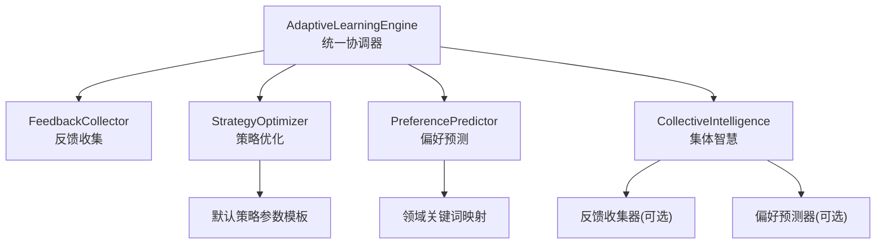
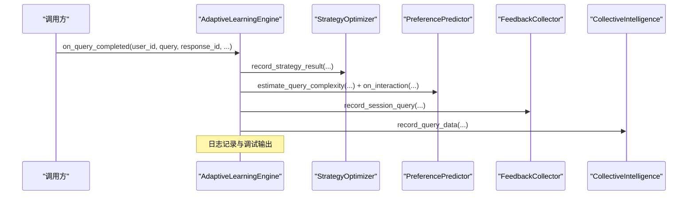
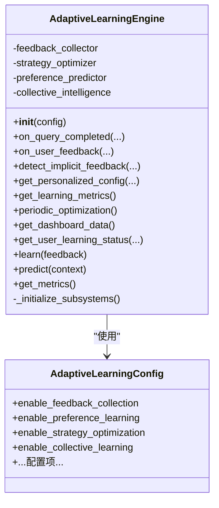
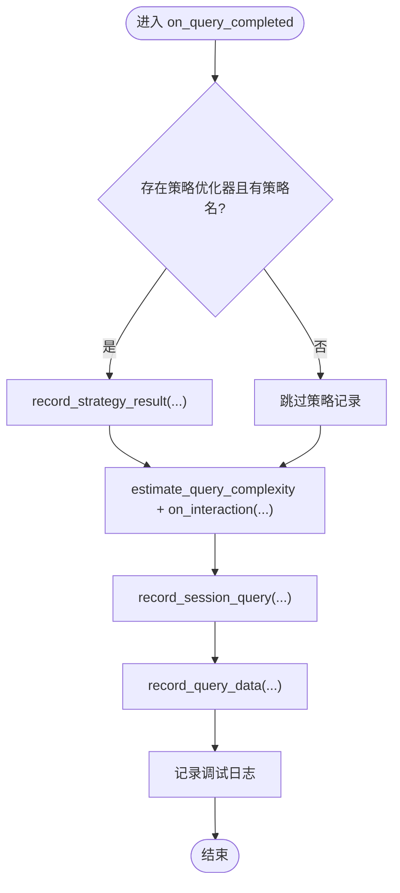
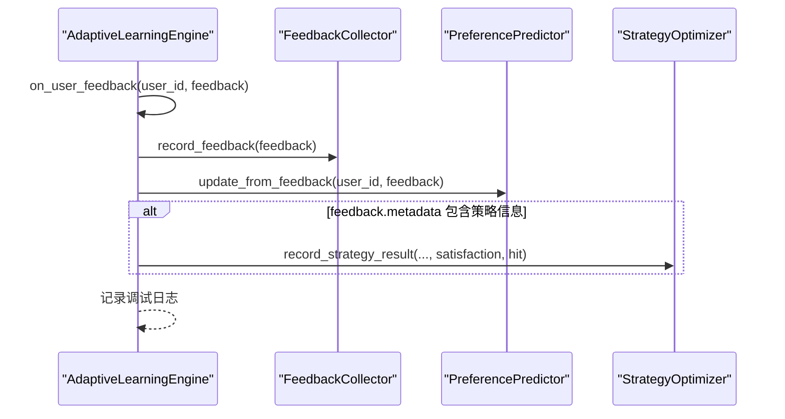
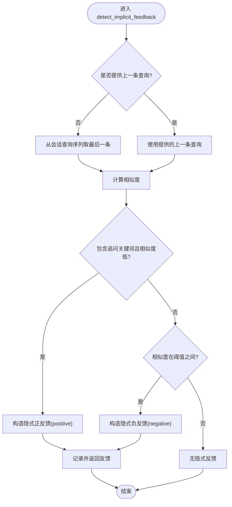
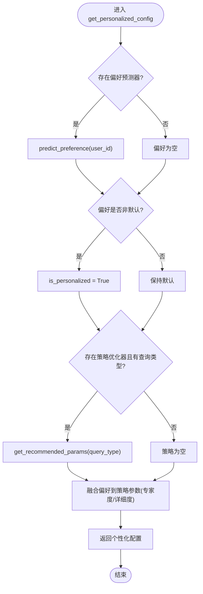
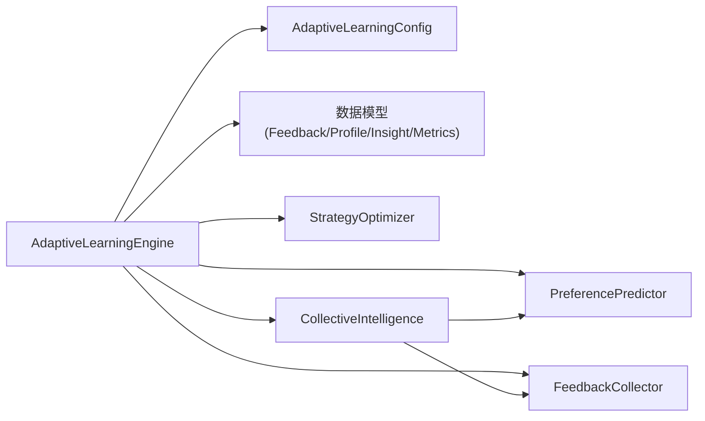

# 学习引擎核心

<cite>
**本文引用的文件**
- [src/adaptive/engine.py](file://src/adaptive/engine.py)
- [src/adaptive/__init__.py](file://src/adaptive/__init__.py)
- [src/adaptive/config.py](file://src/adaptive/config.py)
- [src/adaptive/models.py](file://src/adaptive/models.py)
- [src/adaptive/feedback.py](file://src/adaptive/feedback.py)
- [src/adaptive/strategy_optimizer.py](file://src/adaptive/strategy_optimizer.py)
- [src/adaptive/preference_predictor.py](file://src/adaptive/preference_predictor.py)
- [src/adaptive/collective.py](file://src/adaptive/collective.py)
- [src/core/base.py](file://src/core/base.py)
- [src/core/config.py](file://src/core/config.py)
- [example/example_usage.py](file://example/example_usage.py)
</cite>

## 目录
1. [简介](#简介)
2. [项目结构](#项目结构)
3. [核心组件](#核心组件)
4. [架构总览](#架构总览)
5. [详细组件分析](#详细组件分析)
6. [依赖分析](#依赖分析)
7. [性能考虑](#性能考虑)
8. [故障排查指南](#故障排查指南)
9. [结论](#结论)
10. [附录](#附录)

## 简介
本文件面向自适应学习引擎核心组件，聚焦于 AdaptiveLearningEngine 的统一协调器设计与四大子系统的生命周期管理，系统性阐述以下关键流程与机制：
- 查询完成回调 on_query_completed 的完整学习闭环：策略效果记录、用户画像更新、会话查询记录、集体智慧数据记录
- 用户反馈处理 on_user_feedback 的多阶段处理：显式反馈收集、偏好更新、策略优化
- 隐式反馈检测 detect_implicit_feedback 的会话分析算法
- 个性化配置获取 get_personalized_config 的综合决策过程：用户偏好与最优策略融合
- 提供使用示例、配置参数说明与性能优化建议

## 项目结构
自适应学习引擎位于 src/adaptive 目录，围绕 AdaptiveLearningEngine 统一协调器组织四大子系统：
- 反馈收集 FeedbackCollector：显式/隐式反馈采集与会话分析
- 策略优化 StrategyOptimizer：基于在线学习的检索策略权重与参数优化
- 偏好预测 PreferencePredictor：用户画像与偏好建模
- 集体智慧 CollectiveIntelligence：从多用户交互中提炼洞察

图表来源
- [src/adaptive/engine.py:30-121](file://src/adaptive/engine.py#L30-L121)
- [src/adaptive/feedback.py:19-38](file://src/adaptive/feedback.py#L19-L38)
- [src/adaptive/strategy_optimizer.py:19-76](file://src/adaptive/strategy_optimizer.py#L19-L76)
- [src/adaptive/preference_predictor.py:21-57](file://src/adaptive/preference_predictor.py#L21-L57)
- [src/adaptive/collective.py:26-60](file://src/adaptive/collective.py#L26-L60)

章节来源
- [src/adaptive/engine.py:30-121](file://src/adaptive/engine.py#L30-L121)
- [src/adaptive/__init__.py:12-68](file://src/adaptive/__init__.py#L12-L68)

## 核心组件
- AdaptiveLearningEngine：统一协调器，负责四大子系统的初始化与生命周期管理，并提供 on_query_completed、on_user_feedback、detect_implicit_feedback、get_personalized_config 等核心接口。
- AdaptiveLearningConfig：自适应学习配置，控制各子系统的开关与学习参数。
- 数据模型：UserFeedback、StrategyPerformance、UserLearningProfile、CommunityInsight、AdaptiveLearningMetrics、InteractionRecord 等，支撑反馈、偏好、策略与指标的数据结构。
- 子系统职责：
  - FeedbackCollector：记录显式/隐式反馈，维护会话查询序列，计算满意度趋势与反馈模式。
  - StrategyOptimizer：记录策略执行结果，基于奖励在线更新策略权重，提供最优策略与推荐参数。
  - PreferencePredictor：基于交互历史估计用户专业度、偏好详细程度与语气，预测用户偏好。
  - CollectiveIntelligence：聚合查询数据，识别知识盲区、提取最佳实践、检测趋势，生成社区洞察。

章节来源
- [src/adaptive/engine.py:64-121](file://src/adaptive/engine.py#L64-L121)
- [src/adaptive/config.py:15-200](file://src/adaptive/config.py#L15-L200)
- [src/adaptive/models.py:14-258](file://src/adaptive/models.py#L14-L258)
- [src/adaptive/feedback.py:19-398](file://src/adaptive/feedback.py#L19-L398)
- [src/adaptive/strategy_optimizer.py:19-401](file://src/adaptive/strategy_optimizer.py#L19-L401)
- [src/adaptive/preference_predictor.py:21-426](file://src/adaptive/preference_predictor.py#L21-L426)
- [src/adaptive/collective.py:26-378](file://src/adaptive/collective.py#L26-L378)

## 架构总览
AdaptiveLearningEngine 采用延迟初始化策略，按配置启用子系统；在查询完成后回调 on_query_completed 驱动四路学习闭环；on_user_feedback 与 detect_implicit_feedback 支持显式与隐式反馈的闭环学习；get_personalized_config 将偏好预测与策略优化结果融合，输出个性化检索参数。

图表来源
- [src/adaptive/engine.py:122-197](file://src/adaptive/engine.py#L122-L197)
- [src/adaptive/strategy_optimizer.py:93-154](file://src/adaptive/strategy_optimizer.py#L93-L154)
- [src/adaptive/preference_predictor.py:64-128](file://src/adaptive/preference_predictor.py#L64-L128)
- [src/adaptive/feedback.py:67-95](file://src/adaptive/feedback.py#L67-L95)
- [src/adaptive/collective.py:61-92](file://src/adaptive/collective.py#L61-L92)

## 详细组件分析

### 统一协调器 AdaptiveLearningEngine
- 初始化与延迟加载：根据 AdaptiveLearningConfig.enable_* 控制 FeedbackCollector、StrategyOptimizer、PreferencePredictor、CollectiveIntelligence 的启用与实例化。
- 生命周期管理：提供 get_learning_metrics、periodic_optimization、get_dashboard_data、get_user_learning_status 等方法，支撑运行时指标与周期性聚合。
- 核心回调：
  - on_query_completed：策略效果记录、用户画像更新、会话查询记录、集体智慧数据记录。
  - on_user_feedback：显式反馈收集、偏好更新、策略优化（若反馈携带策略信息）。
  - detect_implicit_feedback：基于会话查询序列与相似度/关键词规则检测隐式反馈。
  - get_personalized_config：融合偏好预测与策略优化，输出个性化检索参数。
- 抽象实现：learn、predict、get_metrics 三方法实现 BaseAdaptiveLearner 接口，便于上层统一接入。

图表来源
- [src/adaptive/engine.py:64-121](file://src/adaptive/engine.py#L64-L121)
- [src/adaptive/config.py:15-200](file://src/adaptive/config.py#L15-L200)

章节来源
- [src/adaptive/engine.py:64-406](file://src/adaptive/engine.py#L64-L406)
- [src/core/base.py:797-869](file://src/core/base.py#L797-L869)

### 查询完成回调 on_query_completed 流程
- 策略效果记录：当存在策略优化器与策略名称时，记录满意度、延迟与命中率，触发权重在线更新。
- 用户画像更新：估计查询复杂度并更新偏好预测器的专家度、复杂度趋势、满意度历史、主题频率与活跃时段。
- 会话查询记录：将当前查询与响应ID记录到会话查询序列，用于隐式反馈检测。
- 集体智慧数据记录：将查询主题与满意度、命中情况记录到集体智慧聚合器，参与全局洞察生成。

图表来源
- [src/adaptive/engine.py:122-197](file://src/adaptive/engine.py#L122-L197)
- [src/adaptive/strategy_optimizer.py:93-154](file://src/adaptive/strategy_optimizer.py#L93-L154)
- [src/adaptive/preference_predictor.py:64-128](file://src/adaptive/preference_predictor.py#L64-L128)
- [src/adaptive/feedback.py:67-95](file://src/adaptive/feedback.py#L67-L95)
- [src/adaptive/collective.py:61-92](file://src/adaptive/collective.py#L61-L92)

章节来源
- [src/adaptive/engine.py:122-197](file://src/adaptive/engine.py#L122-L197)

### 用户反馈处理 on_user_feedback 多阶段机制
- 显式反馈收集：将反馈元数据附加 user_id 并记录到反馈收集器。
- 偏好更新：基于反馈类型与评论内容调整偏好预测器的详细程度与语气偏好。
- 策略优化：若反馈携带策略信息，则将其转换为满意度分数并记录到策略优化器，驱动权重更新。

图表来源
- [src/adaptive/engine.py:198-243](file://src/adaptive/engine.py#L198-L243)
- [src/adaptive/feedback.py:39-65](file://src/adaptive/feedback.py#L39-L65)
- [src/adaptive/preference_predictor.py:225-268](file://src/adaptive/preference_predictor.py#L225-L268)
- [src/adaptive/strategy_optimizer.py:93-154](file://src/adaptive/strategy_optimizer.py#L93-L154)

章节来源
- [src/adaptive/engine.py:198-243](file://src/adaptive/engine.py#L198-L243)

### 隐式反馈检测 detect_implicit_feedback 会话分析算法
- 输入：会话ID、当前查询、可选的上一条查询。
- 会话查询序列：通过 FeedbackCollector.record_session_query 维护最近若干条查询。
- 相似度计算：基于字符集重叠计算相似度，判断是否为“改写”（相似度在阈值之间）。
- 关键词检测：识别连续追问关键词，判断是否为“深入”（follow-up）。
- 输出：构造 UserFeedback（显式信号为隐式），并自动记录到反馈收集器。

图表来源
- [src/adaptive/engine.py:245-276](file://src/adaptive/engine.py#L245-L276)
- [src/adaptive/feedback.py:96-170](file://src/adaptive/feedback.py#L96-L170)
- [src/adaptive/feedback.py:172-196](file://src/adaptive/feedback.py#L172-L196)

章节来源
- [src/adaptive/engine.py:245-276](file://src/adaptive/engine.py#L245-L276)
- [src/adaptive/feedback.py:96-170](file://src/adaptive/feedback.py#L96-L170)

### 个性化配置获取 get_personalized_config 综合决策过程
- 获取用户偏好：从偏好预测器读取预测偏好，若非默认则标记个性化。
- 获取最优策略：基于查询类型从策略优化器获取推荐参数。
- 偏好融合：根据用户专业度与偏好详细程度对策略参数进行微调（如 top_k、置信度阈值）。
- 输出：返回包含用户ID、查询类型、策略参数、偏好信息与个性化标记的配置字典。

图表来源
- [src/adaptive/engine.py:278-337](file://src/adaptive/engine.py#L278-L337)
- [src/adaptive/preference_predictor.py:174-223](file://src/adaptive/preference_predictor.py#L174-L223)
- [src/adaptive/strategy_optimizer.py:265-289](file://src/adaptive/strategy_optimizer.py#L265-L289)

章节来源
- [src/adaptive/engine.py:278-337](file://src/adaptive/engine.py#L278-L337)

### 子系统内部机制与数据结构

#### 反馈收集 FeedbackCollector
- 存储结构：内存列表存储 UserFeedback，用户ID索引，会话查询序列。
- 会话分析：detect_implicit_feedback 基于相似度与关键词规则识别隐式反馈。
- 统计分析：get_satisfaction_trend、get_feedback_summary、analyze_feedback_patterns 提供反馈趋势与模式。

章节来源
- [src/adaptive/feedback.py:19-398](file://src/adaptive/feedback.py#L19-L398)

#### 策略优化 StrategyOptimizer
- 默认策略参数模板：包含多种检索策略的基础参数。
- 在线权重更新：基于奖励（满意度-0.5）与学习率更新策略权重，采用 epsilon-greedy 探索与利用。
- 推荐参数：按查询类型微调参数，如 top_k、置信度阈值、HyDE 开关等。

章节来源
- [src/adaptive/strategy_optimizer.py:19-401](file://src/adaptive/strategy_optimizer.py#L19-L401)

#### 偏好预测 PreferencePredictor
- 领域关键词映射与专业术语：用于估计用户专业度与检测查询领域。
- 画像更新：on_interaction 更新专家度、复杂度趋势、满意度历史、主题频率与活跃时段。
- 偏好预测：predict_preference 输出详细程度、语气、专业度、兴趣主题与格式偏好。

章节来源
- [src/adaptive/preference_predictor.py:21-426](file://src/adaptive/preference_predictor.py#L21-L426)

#### 集体智慧 CollectiveIntelligence
- 数据记录：record_query_data 统计主题频率与低满意度主题。
- 洞察生成：identify_common_gaps、extract_best_practices、detect_trending_topics 生成知识盲区、最佳实践与趋势洞察。
- 缓存与刷新：基于时间间隔缓存洞察，避免频繁计算。

章节来源
- [src/adaptive/collective.py:26-378](file://src/adaptive/collective.py#L26-L378)

## 依赖分析
- 组件耦合：AdaptiveLearningEngine 对四大子系统采用弱耦合的延迟依赖，通过配置控制启用。
- 外部依赖：各子系统依赖 AdaptiveLearningConfig 提供的参数；CollectiveIntelligence 可选依赖 FeedbackCollector 与 PreferencePredictor。
- 数据依赖：UserFeedback、StrategyPerformance、UserLearningProfile、CommunityInsight、AdaptiveLearningMetrics、InteractionRecord 作为跨模块共享数据结构。

图表来源
- [src/adaptive/engine.py:12-24](file://src/adaptive/engine.py#L12-L24)
- [src/adaptive/config.py:15-200](file://src/adaptive/config.py#L15-L200)
- [src/adaptive/models.py:14-258](file://src/adaptive/models.py#L14-L258)
- [src/adaptive/collective.py:36-53](file://src/adaptive/collective.py#L36-L53)

章节来源
- [src/adaptive/engine.py:12-24](file://src/adaptive/engine.py#L12-L24)
- [src/adaptive/collective.py:36-53](file://src/adaptive/collective.py#L36-L53)

## 性能考虑
- 学习速率与探索率：AdaptiveLearningConfig 中的 expertise_learning_rate、strategy_learning_rate、exploration_rate 控制学习速度与稳定性，建议在保守模式下调低学习速率以稳定性能。
- 样本阈值：min_samples_for_optimization 限制策略优化的最小样本，避免早期噪声影响。
- 内存与历史长度：feedback_history_size、max_interaction_history、max_complexity_history 等参数控制内存占用与计算开销，需结合业务规模调优。
- 会话查询长度：record_session_query 限制会话历史长度，减少隐式反馈检测的计算成本。
- 洞察缓存：CollectiveIntelligence 的洞察刷新间隔降低频繁聚合开销。
- 建议：
  - 在高并发场景下，优先使用保守学习模式，适当提高 min_samples_for_optimization。
  - 对大规模用户场景，定期清理旧反馈与交互记录，控制内存峰值。
  - 将 get_personalized_config 的调用频率限制在必要节点，避免过度融合导致延迟。

[本节为通用性能指导，无需特定文件来源]

## 故障排查指南
- 配置校验：AdaptiveLearningConfig.validate() 会验证学习率、探索率、窗口大小等参数范围，异常时抛出错误，需检查配置合法性。
- 反馈缺失：若 on_query_completed 未记录策略或偏好，请确认 enable_* 配置已开启。
- 隐式反馈未检测：检查 implicit_feedback_enabled 与会话查询记录是否正常，相似度阈值与关键词规则是否合理。
- 洞察为空：检查 min_users_for_insight 与 insight_refresh_interval 设置，确保有足够的用户与时间窗口。
- 指标异常：通过 get_learning_metrics 与 get_dashboard_data 获取满意度趋势、策略优化收益、个性化准确度与知识覆盖增长，定位问题来源。

章节来源
- [src/adaptive/config.py:157-192](file://src/adaptive/config.py#L157-L192)
- [src/adaptive/feedback.py:369-397](file://src/adaptive/feedback.py#L369-L397)
- [src/adaptive/collective.py:242-246](file://src/adaptive/collective.py#L242-L246)

## 结论
AdaptiveLearningEngine 通过统一协调器设计，将反馈收集、偏好预测、策略优化与集体智慧有机结合，形成“越用越智能”的闭环。其延迟初始化与可插拔配置使系统具备良好的扩展性与可控性；on_query_completed、on_user_feedback、detect_implicit_feedback 与 get_personalized_config 等核心接口提供了清晰的学习路径与个性化决策流程。配合合理的配置与性能优化策略，可在保证稳定性的同时持续提升用户体验与系统效果。

[本节为总结性内容，无需特定文件来源]

## 附录

### 使用示例
- 初始化引擎与配置模式：create_adaptive_engine(mode) 支持 default/aggressive/conservative/minimal。
- 查询完成后学习：on_query_completed(user_id, query, response_id, strategy_used, query_type, satisfaction, topics...)。
- 处理用户反馈：on_user_feedback(user_id, feedback)，支持显式/隐式/延迟信号。
- 获取个性化配置：get_personalized_config(user_id, query_type) 返回融合偏好与策略的检索参数。
- 仪表盘数据：get_dashboard_data() 返回指标、反馈、策略表现、用户画像与社区洞察的聚合数据。

章节来源
- [src/adaptive/engine.py:37-62](file://src/adaptive/engine.py#L37-L62)
- [src/adaptive/engine.py:575-597](file://src/adaptive/engine.py#L575-L597)
- [src/adaptive/engine.py:122-197](file://src/adaptive/engine.py#L122-L197)
- [src/adaptive/engine.py:198-243](file://src/adaptive/engine.py#L198-L243)
- [src/adaptive/engine.py:278-337](file://src/adaptive/engine.py#L278-L337)
- [src/adaptive/engine.py:408-447](file://src/adaptive/engine.py#L408-L447)
- [example/example_usage.py:218-252](file://example/example_usage.py#L218-L252)

### 配置参数说明（节选）
- 反馈收集：enable_feedback_collection、feedback_history_size、implicit_feedback_enabled。
- 偏好学习：enable_preference_learning、preference_update_interval、expertise_learning_rate、satisfaction_window、max_complexity_history。
- 策略优化：enable_strategy_optimization、strategy_learning_rate、min_samples_for_optimization、exploration_rate、default_strategies。
- 集体智慧：enable_collective_learning、min_users_for_insight、insight_refresh_interval、max_insights。
- 指标与交互：metrics_window_days、trend_comparison_ratio、max_interaction_history、interaction_retention_days。

章节来源
- [src/adaptive/config.py:23-60](file://src/adaptive/config.py#L23-L60)
- [src/adaptive/config.py:85-155](file://src/adaptive/config.py#L85-L155)