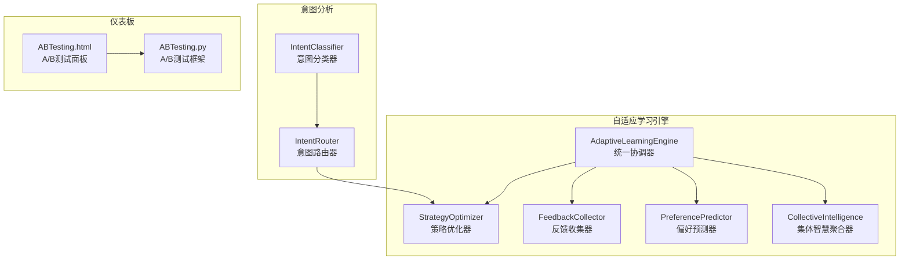
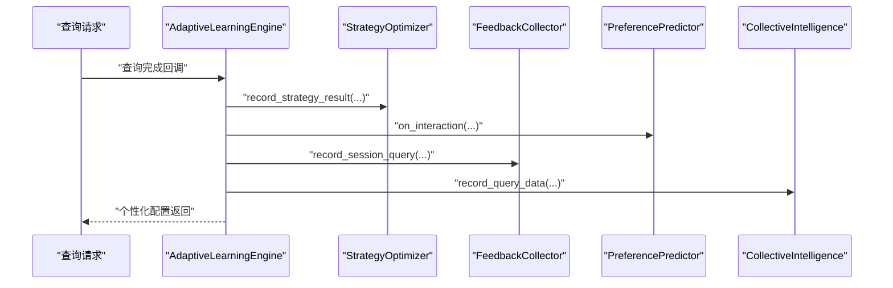
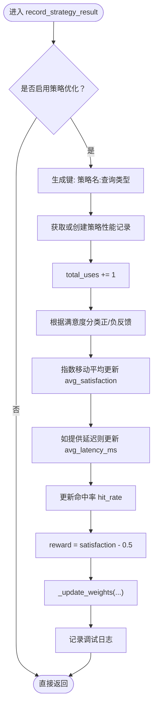
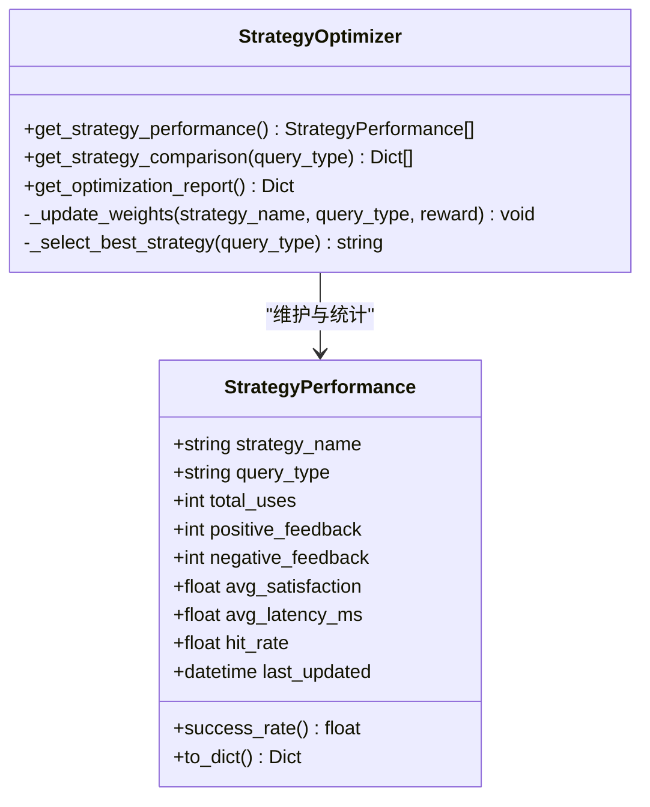
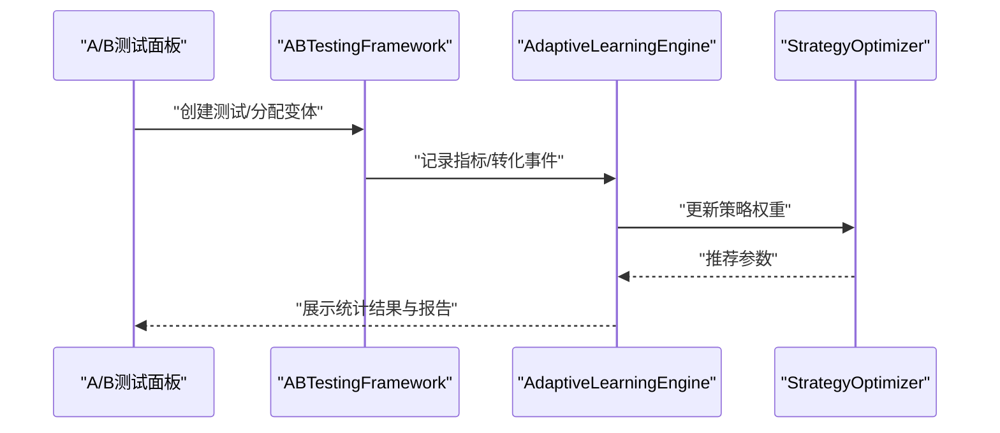
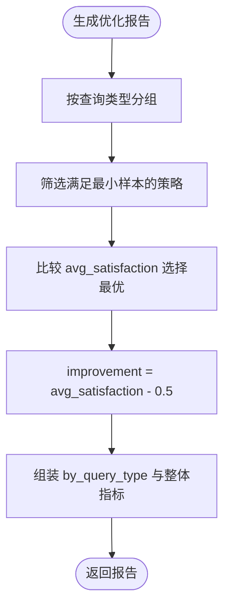
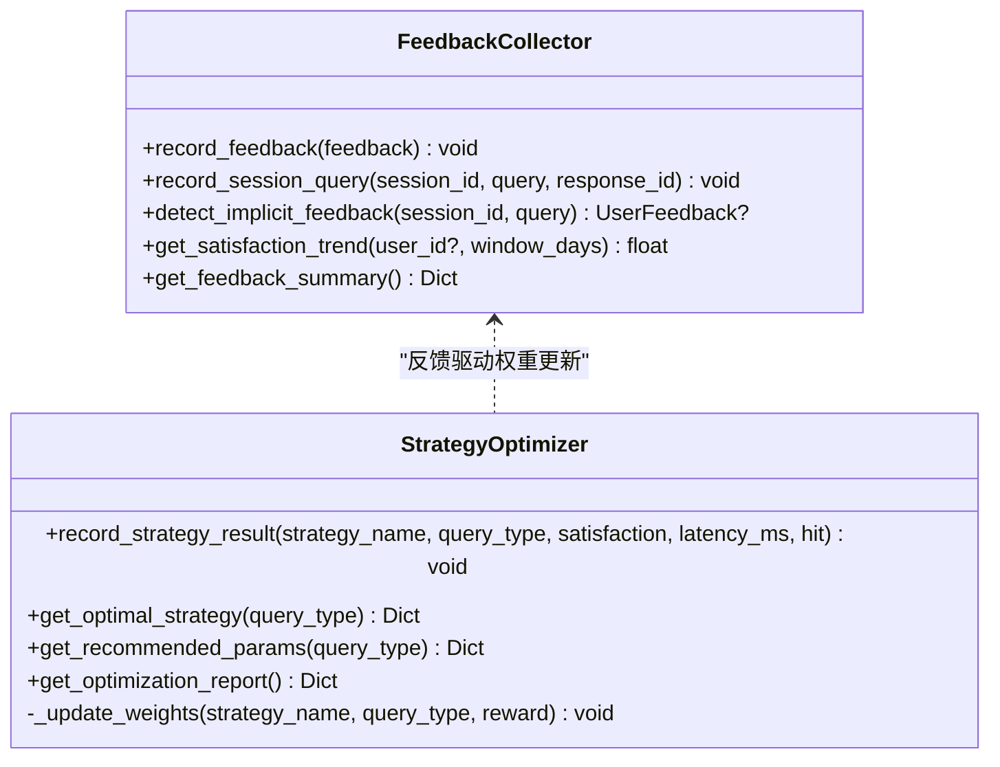
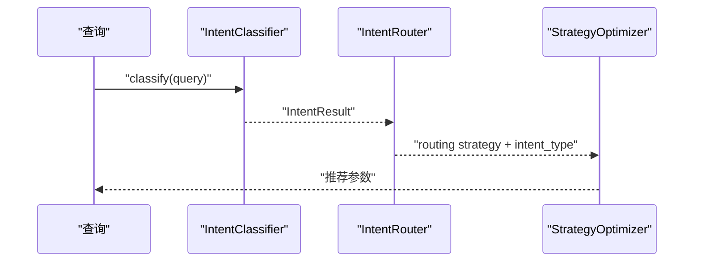
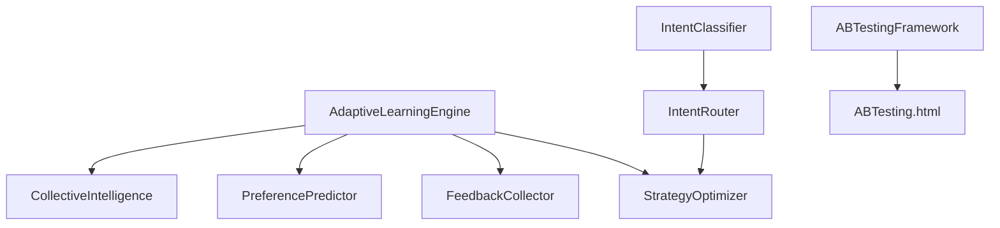

# 策略优化系统

<cite>
**本文档引用的文件**
- [strategy_optimizer.py](file://src/adaptive/strategy_optimizer.py)
- [engine.py](file://src/adaptive/engine.py)
- [models.py](file://src/adaptive/models.py)
- [feedback.py](file://src/adaptive/feedback.py)
- [preference_predictor.py](file://src/adaptive/preference_predictor.py)
- [config.py](file://src/adaptive/config.py)
- [collective.py](file://src/adaptive/collective.py)
- [router.py](file://src/intent/router.py)
- [classifier.py](file://src/intent/classifier.py)
- [models.py](file://src/intent/models.py)
- [ABTesting.html](file://src/dashboard/components/ABTesting.html)
- [ab_testing.py](file://src/dashboard/debug/ab_testing.py)
</cite>

## 目录
1. [简介](#简介)
2. [项目结构](#项目结构)
3. [核心组件](#核心组件)
4. [架构总览](#架构总览)
5. [详细组件分析](#详细组件分析)
6. [依赖关系分析](#依赖关系分析)
7. [性能考虑](#性能考虑)
8. [故障排除指南](#故障排除指南)
9. [结论](#结论)
10. [附录](#附录)

## 简介
本文件为策略优化系统的全面技术文档，围绕 StrategyOptimizer 的策略效果记录机制、策略性能分析、推荐参数获取与优化报告生成进行深入解析，并结合自适应学习引擎的整体架构，阐述实时学习机制、查询类型分类对策略选择的影响以及跨类型知识迁移。文档同时提供策略配置说明、性能指标定义与优化效果评估方法，帮助读者快速理解并高效使用该系统。

## 项目结构
策略优化系统位于 src/adaptive 目录，围绕自适应学习引擎（AdaptiveLearningEngine）组织，包含策略优化器、反馈收集器、偏好预测器与集体智慧聚合器四大子系统；意图分析模块（src/intent）负责查询类型分类与路由策略生成；仪表板模块（src/dashboard）提供 A/B 测试管理与可视化。

**图表来源**
- [engine.py:30-121](file://src/adaptive/engine.py#L30-L121)
- [strategy_optimizer.py:19-76](file://src/adaptive/strategy_optimizer.py#L19-L76)
- [feedback.py:19-38](file://src/adaptive/feedback.py#L19-L38)
- [preference_predictor.py:21-57](file://src/adaptive/preference_predictor.py#L21-L57)
- [collective.py:26-60](file://src/adaptive/collective.py#L26-L60)
- [router.py:18-54](file://src/intent/router.py#L18-L54)
- [classifier.py:20-58](file://src/intent/classifier.py#L20-L58)
- [ABTesting.html:582-625](file://src/dashboard/components/ABTesting.html#L582-L625)
- [ab_testing.py:161-174](file://src/dashboard/debug/ab_testing.py#L161-L174)

**章节来源**
- [engine.py:30-121](file://src/adaptive/engine.py#L30-L121)
- [strategy_optimizer.py:19-76](file://src/adaptive/strategy_optimizer.py#L19-L76)
- [feedback.py:19-38](file://src/adaptive/feedback.py#L19-L38)
- [preference_predictor.py:21-57](file://src/adaptive/preference_predictor.py#L21-L57)
- [collective.py:26-60](file://src/adaptive/collective.py#L26-L60)
- [router.py:18-54](file://src/intent/router.py#L18-L54)
- [classifier.py:20-58](file://src/intent/classifier.py#L20-L58)
- [ABTesting.html:582-625](file://src/dashboard/components/ABTesting.html#L582-L625)
- [ab_testing.py:161-174](file://src/dashboard/debug/ab_testing.py#L161-L174)

## 核心组件
- 策略优化器（StrategyOptimizer）：负责策略效果记录、在线权重更新、探索与利用（ε-greedy）、推荐参数生成与优化报告。
- 自适应学习引擎（AdaptiveLearningEngine）：统一协调反馈收集、偏好预测、策略优化与集体智慧，提供学习指标与仪表板数据。
- 反馈收集器（FeedbackCollector）：收集显式与隐式反馈，分析满意度趋势与反馈模式。
- 偏好预测器（PreferencePredictor）：基于用户交互历史预测个性化偏好，支持专家度估计与偏好微调。
- 集体智慧聚合器（CollectiveIntelligence）：从全量用户交互中提炼知识盲区、最佳实践与趋势洞察。
- 意图分类与路由（IntentClassifier/IntentRouter）：将查询类型映射到检索策略，支持多意图融合与自适应调整。
- A/B 测试框架（ABTesting.html/ABTesting.py）：提供测试创建、流量分配、指标记录与统计分析。

**章节来源**
- [strategy_optimizer.py:19-76](file://src/adaptive/strategy_optimizer.py#L19-L76)
- [engine.py:30-121](file://src/adaptive/engine.py#L30-L121)
- [feedback.py:19-38](file://src/adaptive/feedback.py#L19-L38)
- [preference_predictor.py:21-57](file://src/adaptive/preference_predictor.py#L21-L57)
- [collective.py:26-60](file://src/adaptive/collective.py#L26-L60)
- [router.py:18-54](file://src/intent/router.py#L18-L54)
- [classifier.py:20-58](file://src/intent/classifier.py#L20-L58)
- [ABTesting.html:582-625](file://src/dashboard/components/ABTesting.html#L582-L625)
- [ab_testing.py:161-174](file://src/dashboard/debug/ab_testing.py#L161-L174)

## 架构总览
策略优化系统通过自适应学习引擎串联各子系统，形成“查询完成→反馈收集→偏好预测→策略优化→个性化配置→指标产出”的闭环。策略优化器以查询类型为维度维护策略权重，结合 ε-greedy 探索与利用，持续优化检索参数组合；意图分析模块提供查询类型分类与路由策略，为策略选择提供基础；A/B 测试框架用于外部实验验证策略改进效果。

**图表来源**
- [engine.py:122-196](file://src/adaptive/engine.py#L122-L196)
- [strategy_optimizer.py:93-155](file://src/adaptive/strategy_optimizer.py#L93-L155)
- [feedback.py:67-95](file://src/adaptive/feedback.py#L67-L95)
- [preference_predictor.py:64-128](file://src/adaptive/preference_predictor.py#L64-L128)
- [collective.py:61-92](file://src/adaptive/collective.py#L61-L92)

**章节来源**
- [engine.py:122-196](file://src/adaptive/engine.py#L122-L196)
- [strategy_optimizer.py:93-155](file://src/adaptive/strategy_optimizer.py#L93-L155)
- [feedback.py:67-95](file://src/adaptive/feedback.py#L67-L95)
- [preference_predictor.py:64-128](file://src/adaptive/preference_predictor.py#L64-L128)
- [collective.py:61-92](file://src/adaptive/collective.py#L61-L92)

## 详细组件分析

### 策略效果记录机制 record_strategy_result
- 多维度评估指标
  - 满意度：以 0-1 的分数记录，作为策略奖励的基础；系统以满意度-0.5 作为奖励信号，0.5 作为基准。
  - 延迟时间：毫秒级响应时间，采用指数移动平均平滑处理，避免极端值影响。
  - 命中率：基于二分类命中结果，采用增量式滚动平均，随使用次数动态更新。
  - 成功率：基于正负反馈计数计算，作为策略表现的辅助指标。
- 实时学习与权重调整
  - 在线权重更新：采用简单的在线学习规则，权重变化与奖励成正比，学习率由配置控制。
  - 权重约束：确保权重非负并进行归一化，维持概率分布性质。
  - 探索与利用：当样本不足时，系统自动偏向探索，保证策略多样性。
- 记录键设计
  - 以“策略名:查询类型”为键，实现跨查询类型的策略独立跟踪与对比。

**图表来源**
- [strategy_optimizer.py:93-155](file://src/adaptive/strategy_optimizer.py#L93-L155)
- [strategy_optimizer.py:156-197](file://src/adaptive/strategy_optimizer.py#L156-L197)

**章节来源**
- [strategy_optimizer.py:93-155](file://src/adaptive/strategy_optimizer.py#L93-L155)
- [strategy_optimizer.py:156-197](file://src/adaptive/strategy_optimizer.py#L156-L197)

### 策略性能分析 get_strategy_performance 与统计分析算法
- 统计指标
  - 平均满意度：基于指数移动平均，平滑短期波动。
  - 平均延迟：对响应时间进行指数平滑，反映系统稳定性。
  - 命中率：基于二分类命中结果的滚动平均，衡量检索质量。
  - 成功率：正反馈占比，作为策略受欢迎程度的直观指标。
- 算法要点
  - 样本量阈值：仅当使用次数达到最小样本数时，策略优化才会生效，避免过拟合。
  - 权重归一化：确保策略权重构成合法概率分布，便于采样与解释。
  - ε-greedy 探索：在探索率阈值内随机选择策略，保障策略空间充分探索。

**图表来源**
- [models.py:84-122](file://src/adaptive/models.py#L84-L122)
- [strategy_optimizer.py:344-351](file://src/adaptive/strategy_optimizer.py#L344-L351)
- [strategy_optimizer.py:353-385](file://src/adaptive/strategy_optimizer.py#L353-L385)
- [strategy_optimizer.py:291-342](file://src/adaptive/strategy_optimizer.py#L291-L342)

**章节来源**
- [models.py:84-122](file://src/adaptive/models.py#L84-L122)
- [strategy_optimizer.py:344-351](file://src/adaptive/strategy_optimizer.py#L344-L351)
- [strategy_optimizer.py:353-385](file://src/adaptive/strategy_optimizer.py#L353-L385)
- [strategy_optimizer.py:291-342](file://src/adaptive/strategy_optimizer.py#L291-L342)

### 推荐参数获取 get_recommended_params 与 A/B 测试集成
- 参数微调策略
  - 针对不同查询类型（如 factoid/simple、complex/analytical、exploratory/creative）对默认策略参数进行微调，包括 top_k、置信度阈值与 HyDE 启用开关。
- A/B 测试集成
  - 仪表板提供 A/B 测试管理界面，支持测试创建、流量分配、指标记录与统计分析。
  - 测试框架支持多种统计检验（如 t 检验），并生成测试报告与优化建议。
  - 引擎可将策略优化与 A/B 测试结果联动，形成闭环验证与迭代。

**图表来源**
- [ABTesting.html:582-625](file://src/dashboard/components/ABTesting.html#L582-L625)
- [ab_testing.py:182-240](file://src/dashboard/debug/ab_testing.py#L182-L240)
- [engine.py:122-196](file://src/adaptive/engine.py#L122-L196)
- [strategy_optimizer.py:265-289](file://src/adaptive/strategy_optimizer.py#L265-L289)

**章节来源**
- [ABTesting.html:582-625](file://src/dashboard/components/ABTesting.html#L582-L625)
- [ab_testing.py:182-240](file://src/dashboard/debug/ab_testing.py#L182-L240)
- [engine.py:122-196](file://src/adaptive/engine.py#L122-L196)
- [strategy_optimizer.py:265-289](file://src/adaptive/strategy_optimizer.py#L265-L289)

### 优化报告生成 get_optimization_report 与改进幅度计算
- 报告结构
  - 按查询类型分组，输出每类下的最优策略、平均满意度、成功率、使用次数与相对基准的改进幅度。
  - 整体改进幅度：对各类改进幅度取平均，作为系统整体优化成效的量化指标。
- 改进幅度计算
  - 以 0.5 为基准，最优策略的平均满意度减去 0.5 得到改进幅度，正值表示优于基准。
- 策略对比分析
  - 输出各策略的权重、使用次数、满意度、延迟与命中率，便于横向对比与决策支持。

**图表来源**
- [strategy_optimizer.py:291-342](file://src/adaptive/strategy_optimizer.py#L291-L342)

**章节来源**
- [strategy_optimizer.py:291-342](file://src/adaptive/strategy_optimizer.py#L291-L342)

### 实时学习机制与跨类型知识迁移
- 实时学习
  - 基于满意度的奖励信号与指数移动平均，策略性能指标随时间平滑更新。
  - 权重更新采用在线学习规则，结合学习率与归一化，确保收敛稳定。
- 正负反馈权重调整
  - 满意度≥0.6 视为正反馈，满意度<0.4 视为负反馈，其余视为中性。
  - 权重更新仅依赖奖励信号，不区分显式/隐式反馈，简化学习流程。
- 跨类型知识迁移
  - 策略权重以查询类型为维度独立维护，但可通过样本量与权重分布间接共享经验。
  - 集体智慧聚合器从全量用户交互中提炼共性洞察，为策略优化提供宏观参考。

**图表来源**
- [feedback.py:39-66](file://src/adaptive/feedback.py#L39-L66)
- [feedback.py:96-170](file://src/adaptive/feedback.py#L96-L170)
- [strategy_optimizer.py:93-155](file://src/adaptive/strategy_optimizer.py#L93-L155)
- [strategy_optimizer.py:156-197](file://src/adaptive/strategy_optimizer.py#L156-L197)

**章节来源**
- [feedback.py:39-66](file://src/adaptive/feedback.py#L39-L66)
- [feedback.py:96-170](file://src/adaptive/feedback.py#L96-L170)
- [strategy_optimizer.py:93-155](file://src/adaptive/strategy_optimizer.py#L93-L155)
- [strategy_optimizer.py:156-197](file://src/adaptive/strategy_optimizer.py#L156-L197)

### 查询类型分类对策略选择的影响与路由机制
- 意图分类
  - 基于规则、FastText 或 Transformer 的多后端分类器，支持关键词模式匹配与机器学习模型。
  - 输出主次意图、关键词与实体，用于丰富检索上下文。
- 路由策略
  - 根据意图类型返回对应的检索模式（向量/图谱/混合/HyDE）、top_k、权重调整与重排序策略。
  - 支持多意图融合与自适应调整，根据历史反馈动态优化 top_k 等关键参数。
- 与策略优化的衔接
  - 引擎在查询完成后将查询类型与策略使用情况传递给策略优化器，形成“类型→策略”的闭环优化。

**图表来源**
- [classifier.py:85-206](file://src/intent/classifier.py#L85-L206)
- [router.py:55-78](file://src/intent/router.py#L55-L78)
- [engine.py:152-160](file://src/adaptive/engine.py#L152-L160)

**章节来源**
- [classifier.py:85-206](file://src/intent/classifier.py#L85-L206)
- [router.py:55-78](file://src/intent/router.py#L55-L78)
- [engine.py:152-160](file://src/adaptive/engine.py#L152-L160)

## 依赖关系分析
- 组件耦合
  - AdaptiveLearningEngine 作为协调器，依赖策略优化器、反馈收集器、偏好预测器与集体智慧聚合器。
  - 策略优化器依赖配置与数据模型，内部通过键值映射维护性能表与权重表。
  - 意图分类与路由模块为策略选择提供输入，形成“意图→策略”的映射。
- 外部依赖
  - A/B 测试框架依赖统计学库（如 scipy）进行假设检验与效应量计算。
  - 仪表板通过 WebSocket 实时推送测试状态与结果。

**图表来源**
- [engine.py:84-101](file://src/adaptive/engine.py#L84-L101)
- [strategy_optimizer.py:19-76](file://src/adaptive/strategy_optimizer.py#L19-L76)
- [feedback.py:19-38](file://src/adaptive/feedback.py#L19-L38)
- [preference_predictor.py:21-57](file://src/adaptive/preference_predictor.py#L21-L57)
- [collective.py:26-60](file://src/adaptive/collective.py#L26-L60)
- [router.py:18-54](file://src/intent/router.py#L18-L54)
- [classifier.py:20-58](file://src/intent/classifier.py#L20-L58)
- [ab_testing.py:161-174](file://src/dashboard/debug/ab_testing.py#L161-L174)
- [ABTesting.html:582-625](file://src/dashboard/components/ABTesting.html#L582-L625)

**章节来源**
- [engine.py:84-101](file://src/adaptive/engine.py#L84-L101)
- [strategy_optimizer.py:19-76](file://src/adaptive/strategy_optimizer.py#L19-L76)
- [feedback.py:19-38](file://src/adaptive/feedback.py#L19-L38)
- [preference_predictor.py:21-57](file://src/adaptive/preference_predictor.py#L21-L57)
- [collective.py:26-60](file://src/adaptive/collective.py#L26-L60)
- [router.py:18-54](file://src/intent/router.py#L18-L54)
- [classifier.py:20-58](file://src/intent/classifier.py#L20-L58)
- [ab_testing.py:161-174](file://src/dashboard/debug/ab_testing.py#L161-L174)
- [ABTesting.html:582-625](file://src/dashboard/components/ABTesting.html#L582-L625)

## 性能考虑
- 指数移动平均平滑：对满意度与延迟进行平滑处理，降低噪声影响，提升稳定性。
- 样本量阈值：避免早期样本不足导致的不稳定策略选择。
- 权重归一化：确保策略权重构成合法分布，避免数值溢出与收敛问题。
- ε-greedy 探索：在探索率与利用之间平衡，兼顾策略多样性与性能稳定性。
- 统计检验：A/B 测试框架提供科学的显著性检验与效应量评估，避免误判。

## 故障排除指南
- 策略权重异常
  - 现象：某策略权重长期为 0 或异常偏高。
  - 排查：检查最小样本数配置与样本量是否达标；确认奖励信号是否正常传入；查看权重归一化逻辑。
- 满意度趋势异常
  - 现象：满意度趋势为负或波动剧烈。
  - 排查：检查反馈收集是否启用；确认满意度窗口与时间切分比例；核对隐式反馈检测逻辑。
- A/B 测试结果不显著
  - 现象：p 值大于显著性水平或效应量较小。
  - 排查：增大最小样本量或测试时长；检查统计检验方法与指标定义；确认流量分配是否均衡。

**章节来源**
- [strategy_optimizer.py:156-197](file://src/adaptive/strategy_optimizer.py#L156-L197)
- [feedback.py:198-239](file://src/adaptive/feedback.py#L198-L239)
- [ab_testing.py:361-428](file://src/dashboard/debug/ab_testing.py#L361-L428)

## 结论
策略优化系统通过“查询类型→策略参数→反馈→权重更新→推荐配置”的闭环，实现了检索策略的自适应优化。结合意图分析与 A/B 测试框架，系统能够在真实场景中持续改进策略效果，并提供可解释的优化报告与可视化支持。建议在生产环境中合理设置探索率、最小样本数与学习率，以平衡探索效率与稳定性。

## 附录

### 策略配置说明
- 策略学习率：控制权重更新速度，过高易震荡，过低收敛慢。
- 探索率：控制 ε-greedy 探索概率，平衡多样性与稳定性。
- 最小样本数：避免早期样本不足导致的不稳定优化。
- 默认策略集合：包含向量搜索、混合搜索、图增强与 HyDE 增强四种模板。

**章节来源**
- [config.py:35-46](file://src/adaptive/config.py#L35-L46)
- [strategy_optimizer.py:28-57](file://src/adaptive/strategy_optimizer.py#L28-L57)

### 性能指标定义
- 平均满意度：策略执行的用户满意度指数移动平均。
- 平均延迟：响应时间指数移动平均。
- 命中率：检索命中结果的比例。
- 成功率：正反馈占总使用次数的比例。
- 改进幅度：最优策略平均满意度相对 0.5 的提升。

**章节来源**
- [models.py:84-122](file://src/adaptive/models.py#L84-L122)
- [strategy_optimizer.py:291-342](file://src/adaptive/strategy_optimizer.py#L291-L342)

### 优化效果评估方法
- 策略对比：按权重排序输出各策略的使用次数、满意度、延迟与命中率。
- 整体评估：计算各类改进幅度的平均值，作为系统整体优化成效。
- A/B 测试：通过统计检验与效应量评估策略变更的显著性与业务影响。

**章节来源**
- [strategy_optimizer.py:353-385](file://src/adaptive/strategy_optimizer.py#L353-L385)
- [ab_testing.py:361-428](file://src/dashboard/debug/ab_testing.py#L361-L428)