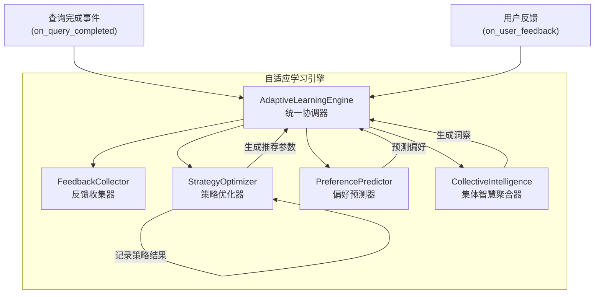
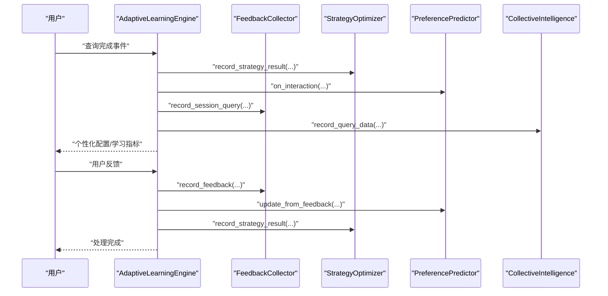
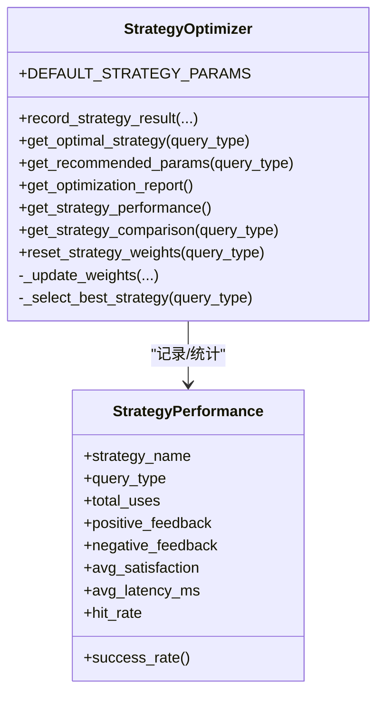
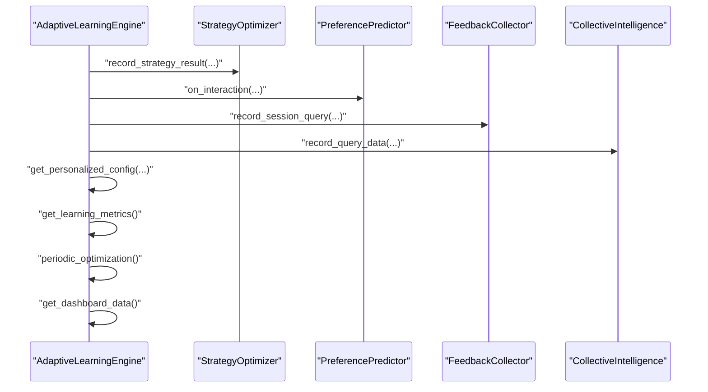
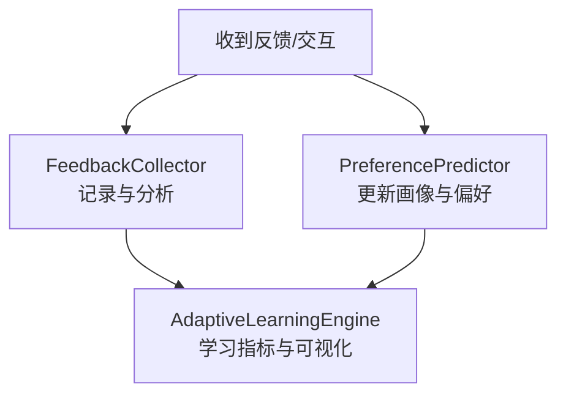
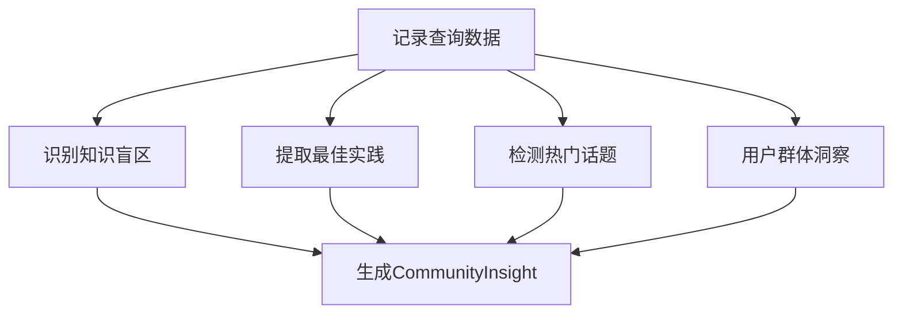
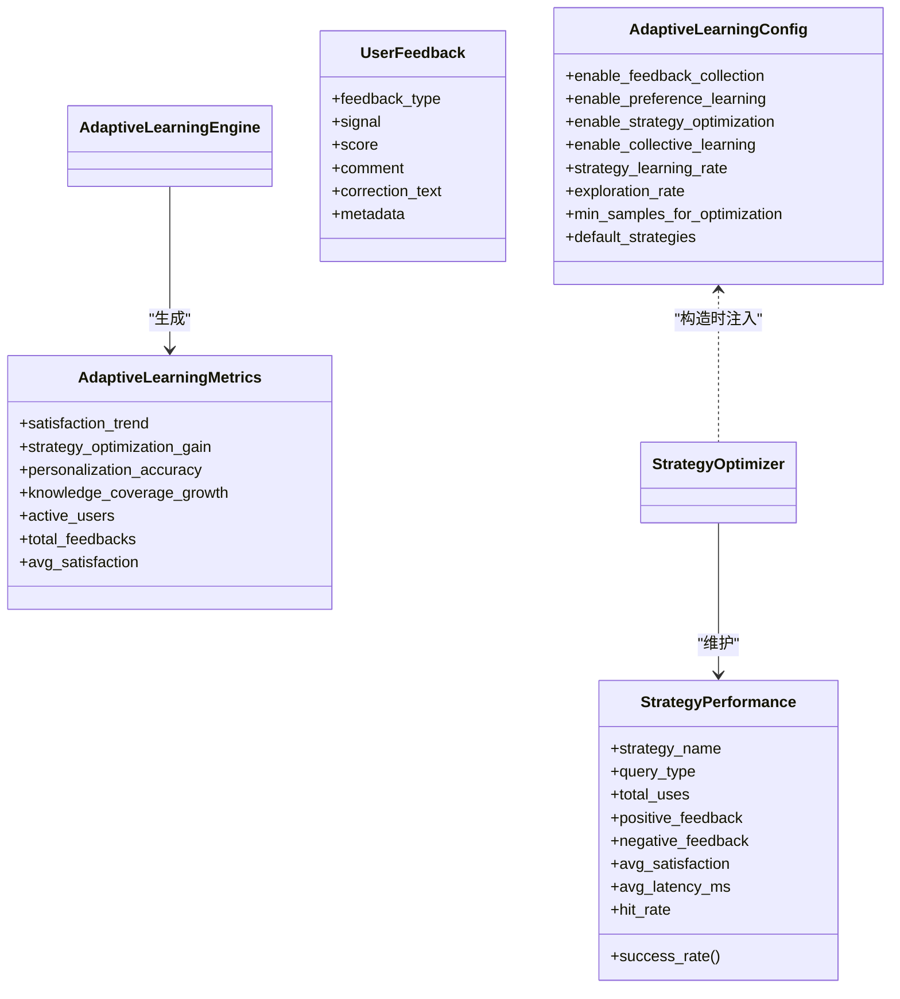
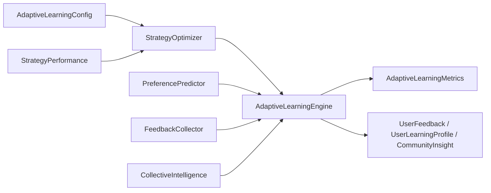

# 策略优化系统

<cite>
**本文引用的文件**
- [src/adaptive/strategy_optimizer.py](file://src/adaptive/strategy_optimizer.py)
- [src/adaptive/engine.py](file://src/adaptive/engine.py)
- [src/adaptive/models.py](file://src/adaptive/models.py)
- [src/adaptive/config.py](file://src/adaptive/config.py)
- [src/adaptive/feedback.py](file://src/adaptive/feedback.py)
- [src/adaptive/collective.py](file://src/adaptive/collective.py)
- [src/adaptive/preference_predictor.py](file://src/adaptive/preference_predictor.py)
- [src/core/base.py](file://src/core/base.py)
- [src/core/protocols.py](file://src/core/protocols.py)
- [src/dashboard/debug/test_comprehensive.py](file://src/dashboard/debug/test_comprehensive.py)
</cite>

## 目录
1. [简介](#简介)
2. [项目结构](#项目结构)
3. [核心组件](#核心组件)
4. [架构总览](#架构总览)
5. [详细组件分析](#详细组件分析)
6. [依赖分析](#依赖分析)
7. [性能考量](#性能考量)
8. [故障排查指南](#故障排查指南)
9. [结论](#结论)
10. [附录](#附录)

## 简介
本文件面向策略优化系统，聚焦于 StrategyOptimizer 类的在线学习架构与策略性能评估机制，系统性阐述以下能力：
- 策略效果记录与权重更新：record_strategy_result 的满意度、延迟、命中率统计与探索-利用平衡
- 个性化策略生成：get_recommended_params 的专家水平与查询类型适配
- 多维度策略评估：get_strategy_performance 与 get_optimization_report 的成功率、平均满意度、基准对比与趋势分析
- 优化报告生成：整体收益计算、性能提升分析与优化建议
- 实时监控与可视化：学习指标、反馈模式、策略对比与异常检测
- 查询类型特定优化：事实查询、推理查询、创意查询的差异化参数策略
- 自适应机制：探索与利用平衡、收敛条件控制
- A/B 测试集成：效果验证与统计显著性分析

## 项目结构
策略优化系统位于 src/adaptive 目录，围绕“自适应学习引擎”统一协调反馈收集、偏好预测、策略优化与集体智慧四大子系统，形成闭环学习与持续优化。

图表来源
- [src/adaptive/engine.py:122-196](file://src/adaptive/engine.py#L122-L196)
- [src/adaptive/strategy_optimizer.py:93-154](file://src/adaptive/strategy_optimizer.py#L93-L154)
- [src/adaptive/feedback.py:39-65](file://src/adaptive/feedback.py#L39-L65)
- [src/adaptive/preference_predictor.py:64-128](file://src/adaptive/preference_predictor.py#L64-L128)
- [src/adaptive/collective.py:61-92](file://src/adaptive/collective.py#L61-L92)

章节来源
- [src/adaptive/engine.py:30-121](file://src/adaptive/engine.py#L30-L121)

## 核心组件
- StrategyOptimizer：在线学习与策略权重更新，支持 epsilon-greedy 探索与利用平衡；提供推荐参数与优化报告
- AdaptiveLearningEngine：统一协调器，整合反馈、偏好、策略与集体智慧，提供个性化配置与学习指标
- FeedbackCollector：显式/隐式反馈收集与分析，满意度趋势与模式识别
- PreferencePredictor：用户偏好建模与更新，专业度估计与内容深度适配
- CollectiveIntelligence：社群洞察生成，知识盲区、最佳实践与趋势分析
- 配置与数据模型：AdaptiveLearningConfig、StrategyPerformance、UserFeedback、AdaptiveLearningMetrics 等

章节来源
- [src/adaptive/strategy_optimizer.py:19-76](file://src/adaptive/strategy_optimizer.py#L19-L76)
- [src/adaptive/engine.py:30-121](file://src/adaptive/engine.py#L30-L121)
- [src/adaptive/models.py:14-258](file://src/adaptive/models.py#L14-L258)
- [src/adaptive/config.py:15-156](file://src/adaptive/config.py#L15-L156)

## 架构总览
策略优化系统采用“事件驱动 + 在线学习”的架构：
- 事件入口：on_query_completed 与 on_user_feedback
- 学习闭环：反馈收集、偏好预测、策略优化、集体智慧
- 输出：个性化配置、学习指标、优化报告、洞察与可视化

图表来源
- [src/adaptive/engine.py:122-196](file://src/adaptive/engine.py#L122-L196)
- [src/adaptive/feedback.py:39-65](file://src/adaptive/feedback.py#L39-L65)
- [src/adaptive/strategy_optimizer.py:93-154](file://src/adaptive/strategy_optimizer.py#L93-L154)
- [src/adaptive/preference_predictor.py:225-268](file://src/adaptive/preference_predictor.py#L225-L268)
- [src/adaptive/collective.py:61-92](file://src/adaptive/collective.py#L61-L92)

## 详细组件分析

### StrategyOptimizer：在线学习与策略优化
- 在线学习目标：为不同查询类型寻找最优检索策略参数组合
- 探索-利用平衡：epsilon-greedy，以 exploration_rate 概率随机探索，否则按权重选择最优
- 性能记录与权重更新：
  - 记录满意度、延迟、命中率，维护平均满意度与命中率
  - 奖励定义：reward = satisfaction - 0.5，以 0.5 为基准
  - 权重更新：weight_new = weight_old + lr * reward，并归一化
- 推荐参数生成：结合查询类型与专家水平，对默认策略参数进行微调
- 报告生成：按查询类型输出最优策略、平均满意度、成功率、使用次数与整体提升

图表来源
- [src/adaptive/strategy_optimizer.py:19-401](file://src/adaptive/strategy_optimizer.py#L19-L401)
- [src/adaptive/models.py:84-121](file://src/adaptive/models.py#L84-L121)

章节来源
- [src/adaptive/strategy_optimizer.py:93-154](file://src/adaptive/strategy_optimizer.py#L93-L154)
- [src/adaptive/strategy_optimizer.py:156-197](file://src/adaptive/strategy_optimizer.py#L156-L197)
- [src/adaptive/strategy_optimizer.py:198-263](file://src/adaptive/strategy_optimizer.py#L198-L263)
- [src/adaptive/strategy_optimizer.py:265-289](file://src/adaptive/strategy_optimizer.py#L265-L289)
- [src/adaptive/strategy_optimizer.py:291-342](file://src/adaptive/strategy_optimizer.py#L291-L342)
- [src/adaptive/strategy_optimizer.py:344-385](file://src/adaptive/strategy_optimizer.py#L344-L385)
- [src/adaptive/strategy_optimizer.py:387-401](file://src/adaptive/strategy_optimizer.py#L387-L401)

### AdaptiveLearningEngine：统一协调器
- 子系统延迟初始化：按配置启用反馈收集、策略优化、偏好预测、集体智慧
- 查询完成学习：记录策略结果、更新偏好、会话查询、聚合集体智慧
- 用户反馈处理：显式/隐式反馈，满意度转换与策略权重更新
- 个性化配置：综合用户偏好与最优策略，按专家水平调整参数
- 学习指标：满意度趋势、策略优化收益、个性化准确度、知识覆盖增长
- 周期性优化：生成洞察、清理旧反馈
- 仪表盘数据：指标、反馈汇总、策略表现、用户画像、社区洞察

图表来源
- [src/adaptive/engine.py:122-196](file://src/adaptive/engine.py#L122-L196)
- [src/adaptive/engine.py:278-337](file://src/adaptive/engine.py#L278-L337)
- [src/adaptive/engine.py:339-372](file://src/adaptive/engine.py#L339-L372)
- [src/adaptive/engine.py:374-406](file://src/adaptive/engine.py#L374-L406)
- [src/adaptive/engine.py:408-447](file://src/adaptive/engine.py#L408-L447)

章节来源
- [src/adaptive/engine.py:84-121](file://src/adaptive/engine.py#L84-L121)
- [src/adaptive/engine.py:122-196](file://src/adaptive/engine.py#L122-L196)
- [src/adaptive/engine.py:278-337](file://src/adaptive/engine.py#L278-L337)
- [src/adaptive/engine.py:339-372](file://src/adaptive/engine.py#L339-L372)
- [src/adaptive/engine.py:374-406](file://src/adaptive/engine.py#L374-L406)
- [src/adaptive/engine.py:408-447](file://src/adaptive/engine.py#L408-L447)

### 反馈收集与偏好预测
- FeedbackCollector：显式/隐式反馈检测（改写、追问、会话放弃），满意度趋势与模式分析
- PreferencePredictor：用户画像（专业度、详细程度、语气、兴趣）、偏好更新、专家度估计、查询复杂度估计

图表来源
- [src/adaptive/feedback.py:39-65](file://src/adaptive/feedback.py#L39-L65)
- [src/adaptive/feedback.py:96-170](file://src/adaptive/feedback.py#L96-L170)
- [src/adaptive/feedback.py:198-239](file://src/adaptive/feedback.py#L198-L239)
- [src/adaptive/feedback.py:286-349](file://src/adaptive/feedback.py#L286-L349)
- [src/adaptive/preference_predictor.py:64-128](file://src/adaptive/preference_predictor.py#L64-L128)
- [src/adaptive/preference_predictor.py:174-223](file://src/adaptive/preference_predictor.py#L174-L223)
- [src/adaptive/preference_predictor.py:270-338](file://src/adaptive/preference_predictor.py#L270-L338)

章节来源
- [src/adaptive/feedback.py:19-398](file://src/adaptive/feedback.py#L19-L398)
- [src/adaptive/preference_predictor.py:21-426](file://src/adaptive/preference_predictor.py#L21-L426)

### 集体智慧与洞察
- CollectiveIntelligence：知识盲区识别、最佳实践提取、趋势检测、用户群体洞察、知识覆盖增长
- 生成周期：按刷新间隔缓存洞察，避免重复计算

图表来源
- [src/adaptive/collective.py:61-92](file://src/adaptive/collective.py#L61-L92)
- [src/adaptive/collective.py:124-153](file://src/adaptive/collective.py#L124-L153)
- [src/adaptive/collective.py:155-201](file://src/adaptive/collective.py#L155-L201)
- [src/adaptive/collective.py:203-230](file://src/adaptive/collective.py#L203-L230)
- [src/adaptive/collective.py:232-322](file://src/adaptive/collective.py#L232-L322)

章节来源
- [src/adaptive/collective.py:26-378](file://src/adaptive/collective.py#L26-L378)

### 数据模型与配置
- 数据模型：UserFeedback、StrategyPerformance、UserLearningProfile、CommunityInsight、AdaptiveLearningMetrics、InteractionRecord
- 配置：AdaptiveLearningConfig，包含反馈、偏好、策略优化、集体智慧、指标与交互记录等配置项

图表来源
- [src/adaptive/config.py:15-156](file://src/adaptive/config.py#L15-L156)
- [src/adaptive/models.py:84-121](file://src/adaptive/models.py#L84-L121)
- [src/adaptive/models.py:38-82](file://src/adaptive/models.py#L38-L82)
- [src/adaptive/models.py:192-219](file://src/adaptive/models.py#L192-L219)

章节来源
- [src/adaptive/models.py:14-258](file://src/adaptive/models.py#L14-L258)
- [src/adaptive/config.py:15-193](file://src/adaptive/config.py#L15-L193)

## 依赖分析
- StrategyOptimizer 依赖 AdaptiveLearningConfig 与 StrategyPerformance
- AdaptiveLearningEngine 组合 FeedbackCollector、StrategyOptimizer、PreferencePredictor、CollectiveIntelligence
- 数据模型与配置被广泛使用，形成清晰的数据契约
- 与核心协议（protocols）解耦，便于替换实现

图表来源
- [src/adaptive/strategy_optimizer.py:59-76](file://src/adaptive/strategy_optimizer.py#L59-L76)
- [src/adaptive/engine.py:64-101](file://src/adaptive/engine.py#L64-L101)
- [src/adaptive/models.py:84-121](file://src/adaptive/models.py#L84-L121)
- [src/adaptive/models.py:38-82](file://src/adaptive/models.py#L38-L82)
- [src/adaptive/models.py:192-219](file://src/adaptive/models.py#L192-L219)

章节来源
- [src/adaptive/strategy_optimizer.py:59-76](file://src/adaptive/strategy_optimizer.py#L59-L76)
- [src/adaptive/engine.py:84-101](file://src/adaptive/engine.py#L84-L101)

## 性能考量
- 在线学习的平滑因子与学习率：alpha 与 strategy_learning_rate 控制收敛速度与稳定性
- 探索率：exploration_rate 平衡早期探索与后期利用，建议在保守模式下调小
- 样本阈值：min_samples_for_optimization 避免过早优化导致的不稳定
- 内存与计算：策略权重与性能记录按查询类型组织，注意长期运行下的内存占用
- 可扩展性：策略数量增加时，权重归一化与采样策略需关注计算成本

## 故障排查指南
- 策略权重异常
  - 症状：某策略权重异常增大或为负
  - 排查：检查 reward 计算与权重裁剪（最小值约束）与归一化
  - 参考：[src/adaptive/strategy_optimizer.py:186-196](file://src/adaptive/strategy_optimizer.py#L186-L196)
- 探索与利用失衡
  - 症状：始终探索或始终利用
  - 排查：确认 exploration_rate 设置与 min_samples_for_optimization
  - 参考：[src/adaptive/config.py:36-45](file://src/adaptive/config.py#L36-L45)
- 反馈缺失导致指标异常
  - 症状：满意度趋势为 0 或波动异常
  - 排查：检查 FeedbackCollector 的历史窗口与反馈类型分布
  - 参考：[src/adaptive/feedback.py:198-239](file://src/adaptive/feedback.py#L198-L239)
- 个性化配置偏差
  - 症状：专家度估计与用户反馈不一致
  - 排查：检查 PreferencePredictor 的偏好更新频率与反馈解读
  - 参考：[src/adaptive/preference_predictor.py:151-173](file://src/adaptive/preference_predictor.py#L151-L173)
- 集体智慧洞察缺失
  - 症状：洞察为空或刷新不生效
  - 排查：检查 min_users_for_insight 与刷新间隔
  - 参考：[src/adaptive/collective.py:242-246](file://src/adaptive/collective.py#L242-L246)

章节来源
- [src/adaptive/strategy_optimizer.py:156-197](file://src/adaptive/strategy_optimizer.py#L156-L197)
- [src/adaptive/config.py:157-192](file://src/adaptive/config.py#L157-L192)
- [src/adaptive/feedback.py:198-239](file://src/adaptive/feedback.py#L198-L239)
- [src/adaptive/preference_predictor.py:151-173](file://src/adaptive/preference_predictor.py#L151-L173)
- [src/adaptive/collective.py:242-246](file://src/adaptive/collective.py#L242-L246)

## 结论
策略优化系统通过在线学习与多源反馈，实现了“越用越智能”的检索策略自适应。StrategyOptimizer 以 epsilon-greedy 平衡探索与利用，结合满意度、延迟与命中率的多维指标，持续优化策略权重；AdaptiveLearningEngine 将反馈、偏好、策略与集体智慧整合为统一的学习闭环，提供个性化配置与可视化指标。系统具备良好的扩展性与可维护性，适合在生产环境中持续演进。

## 附录

### 策略效果记录与评估要点
- 满意度评分：以 0.5 为基准，正向奖励促进策略权重提升
- 延迟分析：指数移动平均平滑延迟，辅助性能评估
- 命中率统计：反映检索有效性，与满意度共同决定策略收益
- 查询类型分类：按事实、推理、创意等类型微调参数，提升针对性

章节来源
- [src/adaptive/strategy_optimizer.py:93-154](file://src/adaptive/strategy_optimizer.py#L93-L154)
- [src/adaptive/strategy_optimizer.py:156-197](file://src/adaptive/strategy_optimizer.py#L156-L197)

### 推荐参数生成与专家水平调整
- 专家水平：根据用户偏好与查询复杂度估计，动态调整 top_k 与置信度阈值
- 查询类型适配：针对不同查询类型（事实、复杂、探索、创意）调整参数
- 参数动态优化：结合策略权重与用户画像，生成个性化检索参数

章节来源
- [src/adaptive/engine.py:278-337](file://src/adaptive/engine.py#L278-L337)
- [src/adaptive/strategy_optimizer.py:265-289](file://src/adaptive/strategy_optimizer.py#L265-L289)
- [src/adaptive/preference_predictor.py:270-338](file://src/adaptive/preference_predictor.py#L270-L338)

### 策略性能分析与优化报告
- 成功率与平均满意度：基于策略使用次数与反馈统计
- 基准对比：以 0.5 为基准，计算策略收益
- 趋势分析：结合满意度趋势与策略权重变化
- 优化建议：基于策略对比与洞察生成

章节来源
- [src/adaptive/strategy_optimizer.py:344-385](file://src/adaptive/strategy_optimizer.py#L344-L385)
- [src/adaptive/strategy_optimizer.py:291-342](file://src/adaptive/strategy_optimizer.py#L291-L342)
- [src/adaptive/feedback.py:198-239](file://src/adaptive/feedback.py#L198-L239)
- [src/adaptive/collective.py:232-322](file://src/adaptive/collective.py#L232-L322)

### 实时监控与可视化
- 学习指标：满意度趋势、策略优化收益、个性化准确度、知识覆盖增长
- 策略表现：按查询类型输出权重、使用次数、满意度、命中率
- 反馈模式：查询类型满意度、时段活动、常见修正与低满意度查询
- 仪表盘数据：指标、反馈汇总、策略性能、用户画像、社区洞察

章节来源
- [src/adaptive/engine.py:339-372](file://src/adaptive/engine.py#L339-L372)
- [src/adaptive/engine.py:408-447](file://src/adaptive/engine.py#L408-L447)
- [src/adaptive/feedback.py:241-284](file://src/adaptive/feedback.py#L241-L284)
- [src/adaptive/feedback.py:286-349](file://src/adaptive/feedback.py#L286-L349)

### 查询类型特定优化策略
- 事实查询：降低 top_k、提高置信度阈值，追求高精度
- 复杂/分析查询：扩大 top_k、启用 HyDE 增强，提升召回
- 探索/创意查询：进一步扩大 top_k、降低置信度阈值，鼓励探索

章节来源
- [src/adaptive/strategy_optimizer.py:278-288](file://src/adaptive/strategy_optimizer.py#L278-L288)

### 自适应机制与收敛控制
- 探索-利用平衡：epsilon-greedy，可配置探索率
- 收敛条件：最小样本数、权重裁剪与归一化
- 学习率：策略权重更新步长，影响收敛速度

章节来源
- [src/adaptive/strategy_optimizer.py:198-263](file://src/adaptive/strategy_optimizer.py#L198-L263)
- [src/adaptive/strategy_optimizer.py:156-197](file://src/adaptive/strategy_optimizer.py#L156-L197)
- [src/adaptive/config.py:36-45](file://src/adaptive/config.py#L36-L45)

### A/B 测试集成与效果验证
- A/B 测试框架：变体权重分配、指标收集与统计显著性检验
- 集成点：策略参数变体、个性化配置对比
- 效果验证：基于显著性检验与业务指标对比

章节来源
- [src/dashboard/debug/test_comprehensive.py:240-274](file://src/dashboard/debug/test_comprehensive.py#L240-L274)