# 自适应学习引擎核心

<cite>
**本文引用的文件**
- [engine.py](file://src/adaptive/engine.py)
- [__init__.py](file://src/adaptive/__init__.py)
- [models.py](file://src/adaptive/models.py)
- [feedback.py](file://src/adaptive/feedback.py)
- [strategy_optimizer.py](file://src/adaptive/strategy_optimizer.py)
- [preference_predictor.py](file://src/adaptive/preference_predictor.py)
- [collective.py](file://src/adaptive/collective.py)
- [config.py](file://src/adaptive/config.py)
- [base.py](file://src/core/base.py)
</cite>

## 目录
1. [简介](#简介)
2. [项目结构](#项目结构)
3. [核心组件](#核心组件)
4. [架构总览](#架构总览)
5. [详细组件分析](#详细组件分析)
6. [依赖分析](#依赖分析)
7. [性能考量](#性能考量)
8. [故障排查指南](#故障排查指南)
9. [结论](#结论)
10. [附录](#附录)

## 简介
本文件面向“自适应学习引擎核心模块”，系统性梳理 AdaptiveLearningEngine 的设计架构与统一协调机制，覆盖四个子系统的初始化与管理策略；深入解释查询完成回调 on_query_completed 的学习闭环流程（策略效果记录、用户画像更新、会话查询记录、集体智慧数据记录）；详解用户反馈处理 on_user_feedback 的完整流程（显式反馈收集、偏好更新、策略优化）；阐述隐式反馈检测 detect_implicit_feedback 的算法与会话分析机制；说明个性化配置获取 get_personalized_config 的综合决策过程（用户偏好与最优策略融合）；给出学习指标获取 get_learning_metrics 的数据聚合逻辑；包含周期性优化 periodic_optimization 的批量处理功能；解释仪表板数据获取 get_dashboard_data 的完整数据结构；最后覆盖 BaseAdaptiveLearner 抽象接口的实现细节与便捷工厂函数 create_adaptive_engine 的使用方法。

## 项目结构
自适应学习引擎位于 src/adaptive 目录，围绕 AdaptiveLearningEngine 统一协调四个子系统：
- 反馈收集 FeedbackCollector：显式/隐式反馈采集与会话分析
- 策略优化 StrategyOptimizer：基于在线学习的检索策略权重与参数优化
- 偏好预测 PreferencePredictor：用户画像与偏好建模
- 集体智慧 CollectiveIntelligence：多用户交互洞察与知识覆盖增长

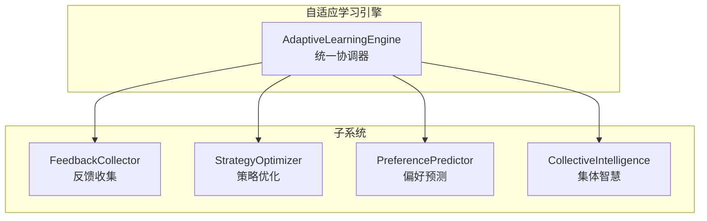

图表来源
- [engine.py:30-121](file://src/adaptive/engine.py#L30-L121)
- [feedback.py:19-38](file://src/adaptive/feedback.py#L19-L38)
- [strategy_optimizer.py:19-76](file://src/adaptive/strategy_optimizer.py#L19-L76)
- [preference_predictor.py:21-57](file://src/adaptive/preference_predictor.py#L21-L57)
- [collective.py:26-60](file://src/adaptive/collective.py#L26-L60)

章节来源
- [engine.py:30-121](file://src/adaptive/engine.py#L30-L121)
- [__init__.py:12-68](file://src/adaptive/__init__.py#L12-L68)

## 核心组件
- AdaptiveLearningEngine：统一协调器，负责子系统初始化、生命周期管理与对外 API 暴露
- FeedbackCollector：反馈采集与会话分析，支持显式/隐式/延迟反馈
- StrategyOptimizer：检索策略在线学习，基于 epsilon-greedy 平衡探索与利用
- PreferencePredictor：用户画像与偏好建模，结合查询复杂度与领域关键词
- CollectiveIntelligence：多用户洞察生成与知识覆盖增长评估
- AdaptiveLearningConfig：统一配置中心，支持默认/积极/保守/最小模式
- 数据模型：UserFeedback、StrategyPerformance、UserLearningProfile、CommunityInsight、AdaptiveLearningMetrics、InteractionRecord

章节来源
- [engine.py:30-121](file://src/adaptive/engine.py#L30-L121)
- [feedback.py:19-38](file://src/adaptive/feedback.py#L19-L38)
- [strategy_optimizer.py:19-76](file://src/adaptive/strategy_optimizer.py#L19-L76)
- [preference_predictor.py:21-57](file://src/adaptive/preference_predictor.py#L21-L57)
- [collective.py:26-60](file://src/adaptive/collective.py#L26-L60)
- [config.py:15-200](file://src/adaptive/config.py#L15-L200)
- [models.py:14-258](file://src/adaptive/models.py#L14-L258)

## 架构总览
AdaptiveLearningEngine 通过延迟初始化与按需启用的方式管理四个子系统，并在关键事件（查询完成、用户反馈、周期性任务）中驱动子系统协同学习，最终形成“越用越智能”的闭环。

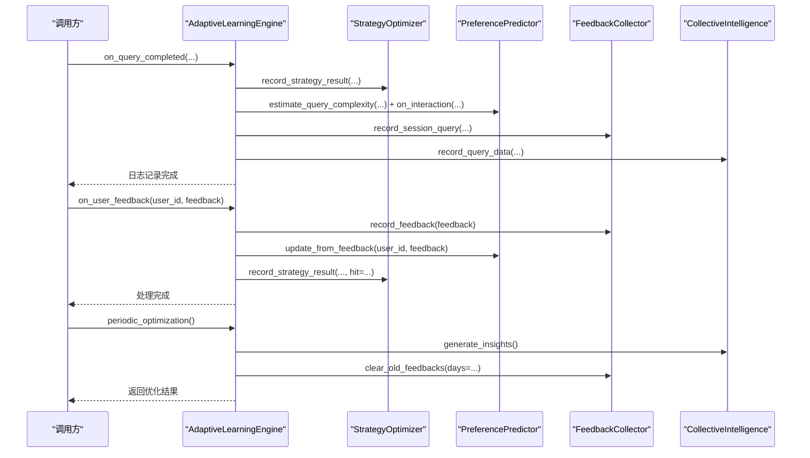

图表来源
- [engine.py:122-197](file://src/adaptive/engine.py#L122-L197)
- [engine.py:198-244](file://src/adaptive/engine.py#L198-L244)
- [engine.py:374-406](file://src/adaptive/engine.py#L374-L406)

## 详细组件分析

### AdaptiveLearningEngine 设计与统一协调机制
- 延迟初始化：根据配置决定是否启用各子系统，避免不必要的资源占用
- 属性访问器：提供对子系统的安全访问，便于外部调试与集成
- 统一 API：对外暴露 on_query_completed、on_user_feedback、detect_implicit_feedback、get_personalized_config、get_learning_metrics、periodic_optimization、get_dashboard_data 等核心方法

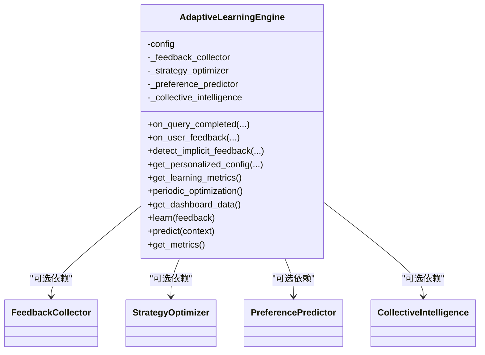

图表来源
- [engine.py:30-121](file://src/adaptive/engine.py#L30-L121)
- [engine.py:522-573](file://src/adaptive/engine.py#L522-L573)

章节来源
- [engine.py:64-121](file://src/adaptive/engine.py#L64-L121)
- [engine.py:522-573](file://src/adaptive/engine.py#L522-L573)

### 查询完成回调 on_query_completed 的工作流程
- 策略效果记录：若启用策略优化，记录满意度、延迟、命中率等指标，驱动权重更新
- 用户画像更新：估计查询复杂度，更新偏好预测器的专家度、满意度趋势、主题频率等
- 会话查询记录：记录会话中的查询序列，供隐式反馈检测使用
- 集体智慧数据：记录主题分布与低满意度情况，用于洞察生成

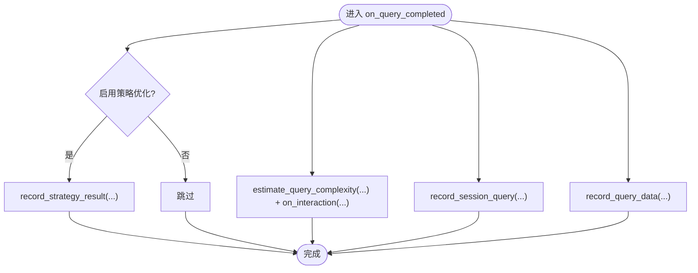

图表来源
- [engine.py:122-197](file://src/adaptive/engine.py#L122-L197)

章节来源
- [engine.py:122-197](file://src/adaptive/engine.py#L122-L197)

### 用户反馈处理 on_user_feedback 的完整流程
- 显式反馈收集：将反馈写入反馈收集器，建立用户-反馈索引
- 偏好更新：根据反馈类型与评论关键词调整偏好（详细程度、语气等）
- 策略优化：若反馈包含策略信息，将其转换为满意度并更新策略权重

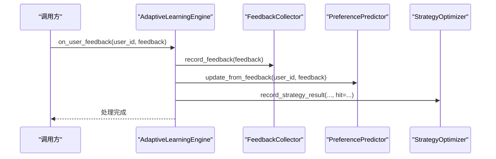

图表来源
- [engine.py:198-244](file://src/adaptive/engine.py#L198-L244)

章节来源
- [engine.py:198-244](file://src/adaptive/engine.py#L198-L244)

### 隐式反馈检测 detect_implicit_feedback 的算法与会话分析
- 会话查询序列：维护每个会话的历史查询，限制长度防止内存膨胀
- 相似度计算：基于字符集合重叠度判断查询相似性
- 关键词检测：识别连续追问关键词，判断深入程度
- 反馈类型判定：相似度在中间范围视为“查询改写”（隐式负反馈），出现追问关键词且相似度较低视为“深入追问”（隐式正反馈）

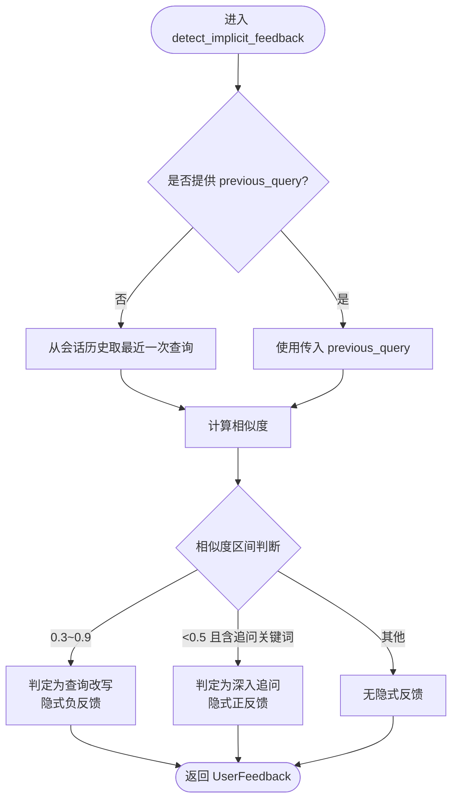

图表来源
- [engine.py:245-277](file://src/adaptive/engine.py#L245-L277)
- [feedback.py:96-171](file://src/adaptive/feedback.py#L96-L171)
- [feedback.py:172-197](file://src/adaptive/feedback.py#L172-L197)

章节来源
- [engine.py:245-277](file://src/adaptive/engine.py#L245-L277)
- [feedback.py:96-171](file://src/adaptive/feedback.py#L96-L171)
- [feedback.py:172-197](file://src/adaptive/feedback.py#L172-L197)

### 个性化配置获取 get_personalized_config 的综合决策过程
- 用户偏好预测：从偏好预测器获取用户画像与偏好（详细程度、语气、兴趣、格式倾向）
- 最优策略参数：从策略优化器按查询类型获取推荐参数
- 偏好融合策略：根据用户专业度动态调整 top_k 与置信度阈值，实现“因人而异”的检索参数

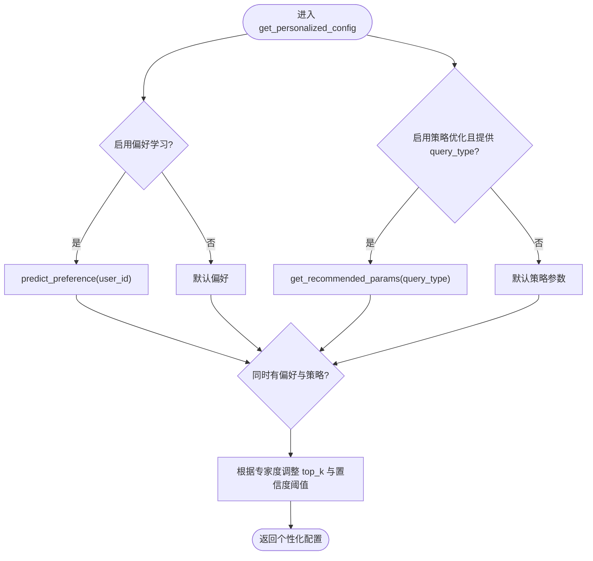

图表来源
- [engine.py:278-337](file://src/adaptive/engine.py#L278-L337)
- [preference_predictor.py:174-224](file://src/adaptive/preference_predictor.py#L174-L224)
- [strategy_optimizer.py:265-289](file://src/adaptive/strategy_optimizer.py#L265-L289)

章节来源
- [engine.py:278-337](file://src/adaptive/engine.py#L278-L337)
- [preference_predictor.py:174-224](file://src/adaptive/preference_predictor.py#L174-L224)
- [strategy_optimizer.py:265-289](file://src/adaptive/strategy_optimizer.py#L265-L289)

### 学习指标获取 get_learning_metrics 的数据聚合逻辑
- 满意度趋势：基于反馈收集器的满意度趋势计算
- 策略优化收益：基于策略优化器的优化报告（整体提升）
- 个性化准确度：基于偏好预测器的用户满意度历史
- 知识覆盖增长：基于集体智慧的主题数量增长评估
- 时间戳：指标计算完成时间

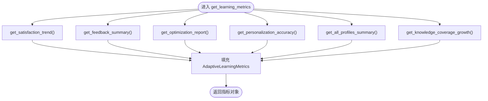

图表来源
- [engine.py:339-372](file://src/adaptive/engine.py#L339-L372)
- [feedback.py:198-240](file://src/adaptive/feedback.py#L198-L240)
- [feedback.py:241-284](file://src/adaptive/feedback.py#L241-L284)
- [strategy_optimizer.py:291-342](file://src/adaptive/strategy_optimizer.py#L291-L342)
- [preference_predictor.py:403-426](file://src/adaptive/preference_predictor.py#L403-L426)
- [collective.py:358-378](file://src/adaptive/collective.py#L358-L378)

章节来源
- [engine.py:339-372](file://src/adaptive/engine.py#L339-L372)

### 周期性优化 periodic_optimization 的批量处理功能
- 集体智慧洞察生成：定期生成并缓存洞察，限制数量与刷新间隔
- 旧反馈清理：按配置保留天数清理历史反馈，重建索引
- 结果聚合：返回洞察数量、部分洞察、清理数量与时间戳

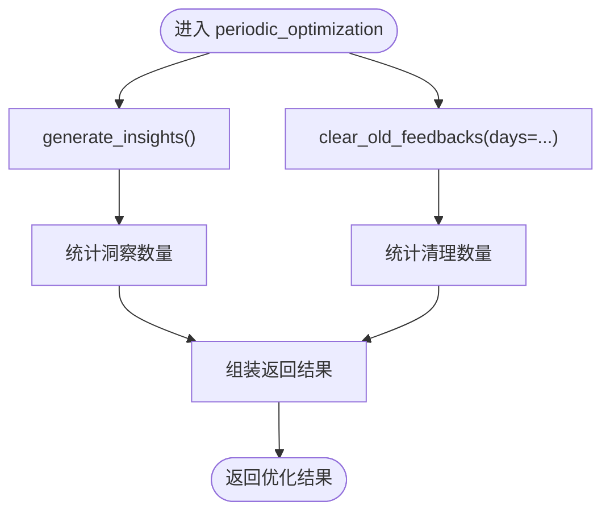

图表来源
- [engine.py:374-406](file://src/adaptive/engine.py#L374-L406)
- [collective.py:232-322](file://src/adaptive/collective.py#L232-L322)
- [feedback.py:369-397](file://src/adaptive/feedback.py#L369-L397)

章节来源
- [engine.py:374-406](file://src/adaptive/engine.py#L374-L406)

### 仪表板数据获取 get_dashboard_data 的完整数据结构
- 指标：学习指标对象
- 反馈汇总：反馈统计与模式分析
- 策略表现：策略性能与优化报告
- 用户画像汇总：用户画像统计
- 集体智慧洞察：洞察汇总

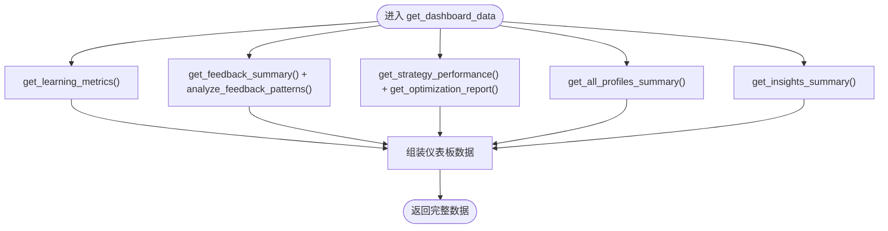

图表来源
- [engine.py:408-447](file://src/adaptive/engine.py#L408-L447)
- [feedback.py:241-349](file://src/adaptive/feedback.py#L241-L349)
- [strategy_optimizer.py:344-385](file://src/adaptive/strategy_optimizer.py#L344-L385)
- [preference_predictor.py:352-401](file://src/adaptive/preference_predictor.py#L352-L401)
- [collective.py:333-356](file://src/adaptive/collective.py#L333-L356)

章节来源
- [engine.py:408-447](file://src/adaptive/engine.py#L408-L447)

### BaseAdaptiveLearner 抽象接口与便捷工厂函数
- BaseAdaptiveLearner：定义 learn、predict、get_metrics 三个抽象方法，确保实现一致性
- AdaptiveLearningEngine 实现上述接口，提供具体学习与预测逻辑
- create_adaptive_engine：便捷工厂函数，支持 default/aggressive/conservative/minimal 四种模式

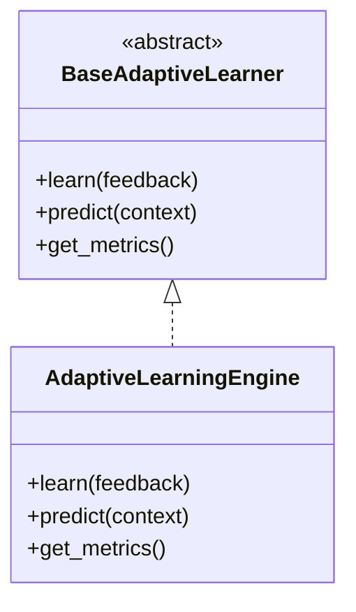

图表来源
- [base.py:830-869](file://src/core/base.py#L830-L869)
- [engine.py:522-573](file://src/adaptive/engine.py#L522-L573)

章节来源
- [base.py:830-869](file://src/core/base.py#L830-L869)
- [engine.py:575-598](file://src/adaptive/engine.py#L575-L598)

## 依赖分析
- AdaptiveLearningEngine 依赖四个子系统，均通过可选属性持有，遵循延迟初始化与按需启用原则
- 子系统之间存在弱耦合：偏好预测器与策略优化器共享查询类型维度；反馈收集器与集体智慧共享主题与满意度统计
- 配置驱动：所有行为由 AdaptiveLearningConfig 控制，支持多种模式切换

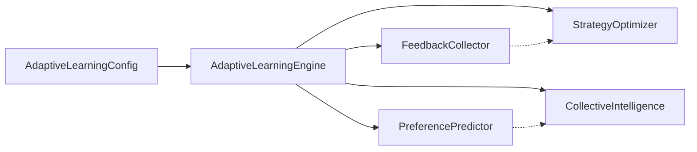

图表来源
- [config.py:15-200](file://src/adaptive/config.py#L15-L200)
- [engine.py:64-121](file://src/adaptive/engine.py#L64-L121)

章节来源
- [config.py:15-200](file://src/adaptive/config.py#L15-L200)
- [engine.py:64-121](file://src/adaptive/engine.py#L64-L121)

## 性能考量
- 内存与容量控制：反馈历史与会话查询长度限制，避免无限增长
- 在线学习平滑：策略权重采用指数移动平均与归一化，保证稳定性
- 探索与利用平衡：epsilon-greedy 在早期快速探索，后期稳定利用
- 指标计算窗口：满意度趋势与统计采用滑动窗口，兼顾实时性与稳定性

## 故障排查指南
- 配置校验：AdaptiveLearningConfig.validate() 可验证参数范围与数值约束
- 日志输出：各组件均包含 DEBUG/INFO 级日志，便于定位问题
- 数据结构校验：UserFeedback、StrategyPerformance、UserLearningProfile、CommunityInsight、AdaptiveLearningMetrics、InteractionRecord 均提供 to_dict/from_dict，便于序列化与反序列化

章节来源
- [config.py:157-192](file://src/adaptive/config.py#L157-L192)
- [models.py:56-82](file://src/adaptive/models.py#L56-L82)
- [models.py:108-122](file://src/adaptive/models.py#L108-L122)
- [models.py:142-160](file://src/adaptive/models.py#L142-L160)
- [models.py:178-190](file://src/adaptive/models.py#L178-L190)
- [models.py:208-219](file://src/adaptive/models.py#L208-L219)
- [models.py:242-258](file://src/adaptive/models.py#L242-L258)

## 结论
AdaptiveLearningEngine 通过统一协调四个子系统，实现了从显式/隐式反馈到策略优化、从用户画像到集体智慧的全链路自适应学习。其延迟初始化与配置驱动的设计使其具备良好的可扩展性与可维护性；查询完成回调、反馈处理、隐式反馈检测、个性化配置、学习指标、周期性优化与仪表板数据等能力共同构成了“越用越智能”的核心体验。

## 附录
- 使用示例与 API 参考可参考 engine.py 中的文档字符串与注释
- 配置模式：default/aggressive/conservative/minimal，分别对应不同的学习速率、探索率与样本要求
- 数据模型：建议优先使用 to_dict/from_dict 进行持久化与传输