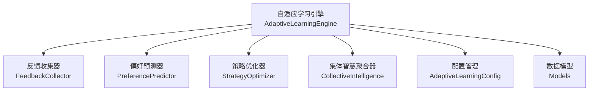
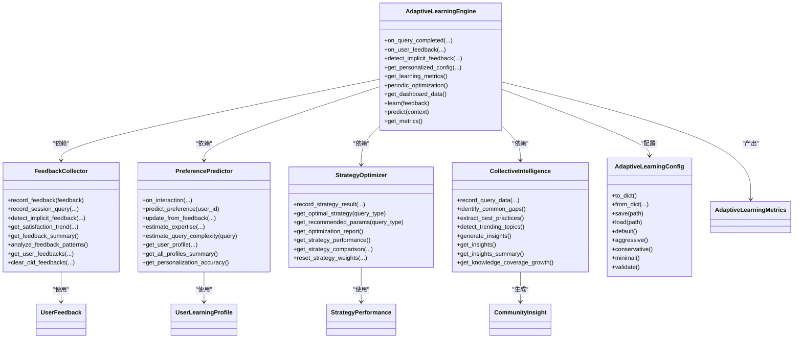
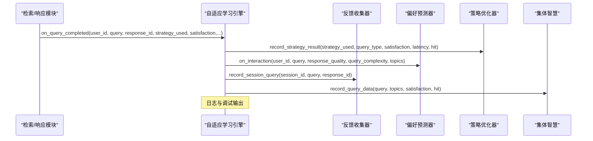
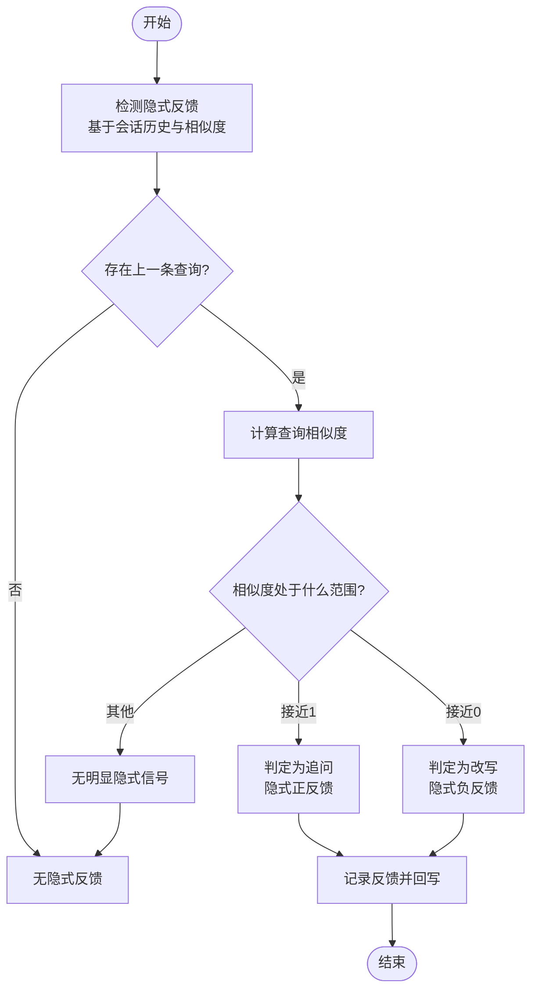
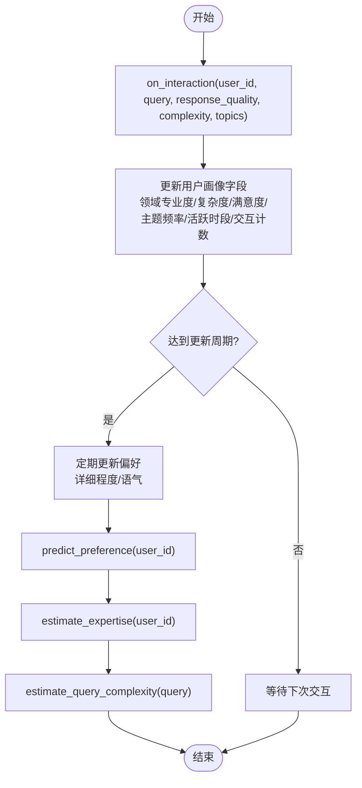
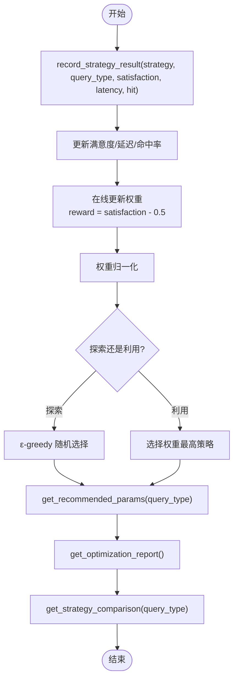
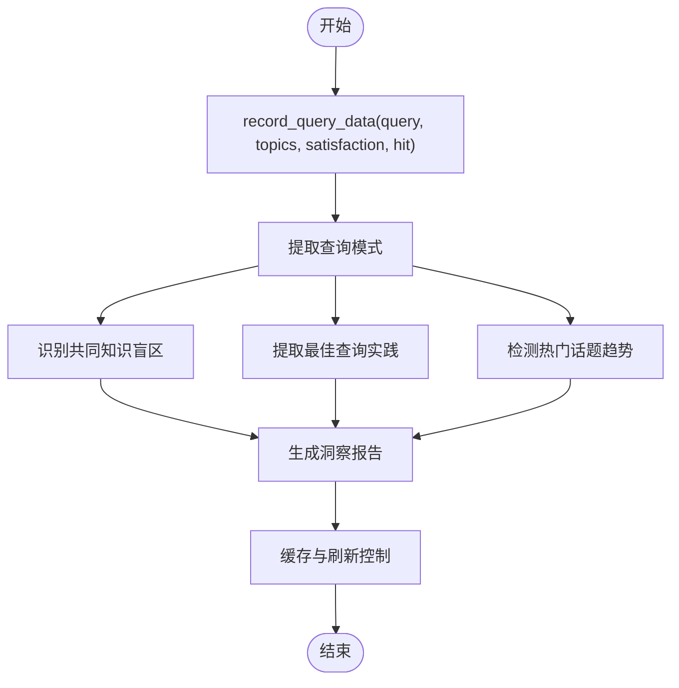
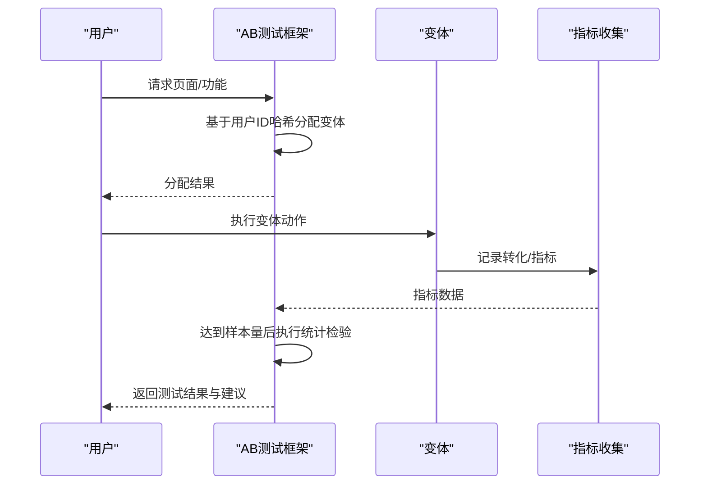
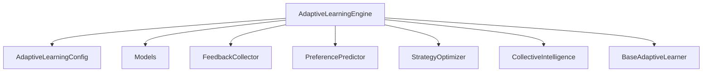

# 自适应学习系统

<cite>
**本文档引用的文件**
- [src/adaptive/__init__.py](file://src/adaptive/__init__.py)
- [src/adaptive/engine.py](file://src/adaptive/engine.py)
- [src/adaptive/feedback.py](file://src/adaptive/feedback.py)
- [src/adaptive/strategy_optimizer.py](file://src/adaptive/strategy_optimizer.py)
- [src/adaptive/preference_predictor.py](file://src/adaptive/preference_predictor.py)
- [src/adaptive/collective.py](file://src/adaptive/collective.py)
- [src/adaptive/models.py](file://src/adaptive/models.py)
- [src/adaptive/config.py](file://src/adaptive/config.py)
- [src/adaptive/README.md](file://src/adaptive/README.md)
- [src/core/base.py](file://src/core/base.py)
- [src/core/protocols.py](file://src/core/protocols.py)
- [src/dashboard/debug/ab_testing.py](file://src/dashboard/debug/ab_testing.py)
</cite>

## 目录
1. [简介](#简介)
2. [项目结构](#项目结构)
3. [核心组件](#核心组件)
4. [架构总览](#架构总览)
5. [详细组件分析](#详细组件分析)
6. [依赖关系分析](#依赖关系分析)
7. [性能考虑](#性能考虑)
8. [故障排除指南](#故障排除指南)
9. [结论](#结论)
10. [附录](#附录)

## 简介
本文件面向 NecoRAG v3.3.0-alpha 版本的自适应学习系统，系统性阐述群体智能的联邦学习机制、分布式模型训练与参数聚合、反馈收集与用户行为分析、偏好预测与个性化推荐、A/B 测试集成与实验评估、策略优化器与在线学习算法，以及学习效果评估与模型优化策略。文档同时解释自适应学习与用户交互的集成关系，并提供可操作的参数配置与最佳实践。

## 项目结构
自适应学习系统位于 src/adaptive 目录，围绕统一引擎 AdaptiveLearningEngine 协调四个子系统：
- 反馈收集 FeedbackCollector：显式/隐式反馈采集与分析
- 偏好预测 PreferencePredictor：用户画像与偏好建模
- 策略优化 StrategyOptimizer：检索策略的在线学习与参数优化
- 集体智慧 CollectiveIntelligence：群体洞察与知识沉淀

**图表来源**
- [src/adaptive/engine.py:30-120](file://src/adaptive/engine.py#L30-L120)
- [src/adaptive/feedback.py:19-38](file://src/adaptive/feedback.py#L19-L38)
- [src/adaptive/preference_predictor.py:21-56](file://src/adaptive/preference_predictor.py#L21-L56)
- [src/adaptive/strategy_optimizer.py:19-75](file://src/adaptive/strategy_optimizer.py#L19-L75)
- [src/adaptive/collective.py:26-53](file://src/adaptive/collective.py#L26-L53)
- [src/adaptive/config.py:15-60](file://src/adaptive/config.py#L15-L60)
- [src/adaptive/models.py:14-82](file://src/adaptive/models.py#L14-L82)

**章节来源**
- [src/adaptive/__init__.py:1-69](file://src/adaptive/__init__.py#L1-L69)
- [src/adaptive/README.md:1-627](file://src/adaptive/README.md#L1-L627)

## 核心组件
- 自适应学习引擎（AdaptiveLearningEngine）：统一协调反馈收集、偏好预测、策略优化、集体智慧，提供查询完成回调、用户反馈处理、个性化配置生成、学习指标与仪表盘数据聚合。
- 反馈收集器（FeedbackCollector）：记录显式/隐式反馈，检测会话中的隐式信号（查询改写、追问、会话放弃），并提供满意度趋势与反馈模式分析。
- 偏好预测器（PreferencePredictor）：基于用户交互历史估计专业度、预测偏好（详细程度、语气、兴趣领域），并结合反馈进行动态调整。
- 策略优化器（StrategyOptimizer）：对检索策略进行在线学习，采用 ε-greedy 平衡探索与利用，记录策略结果并更新权重。
- 集体智慧聚合器（CollectiveIntelligence）：从全局交互中识别知识盲区、提取最佳实践、检测热门话题趋势，生成社区洞察。
- 配置管理（AdaptiveLearningConfig）：集中管理学习速率、探索率、最小样本数、洞察刷新间隔等关键参数。
- 数据模型（Models）：定义反馈、策略表现、用户画像、集体洞察、学习指标等统一数据结构。

**章节来源**
- [src/adaptive/engine.py:30-120](file://src/adaptive/engine.py#L30-L120)
- [src/adaptive/feedback.py:19-66](file://src/adaptive/feedback.py#L19-L66)
- [src/adaptive/preference_predictor.py:21-56](file://src/adaptive/preference_predictor.py#L21-L56)
- [src/adaptive/strategy_optimizer.py:19-75](file://src/adaptive/strategy_optimizer.py#L19-L75)
- [src/adaptive/collective.py:26-60](file://src/adaptive/collective.py#L26-L60)
- [src/adaptive/config.py:15-60](file://src/adaptive/config.py#L15-L60)
- [src/adaptive/models.py:14-82](file://src/adaptive/models.py#L14-L82)

## 架构总览
自适应学习系统采用三层学习架构：
- 即时适应（秒-分钟级）：单次会话内上下文学习与偏好微调
- 短期优化（天-周级）：跨会话的用户偏好学习与画像更新
- 长期进化（周-月级）：全局策略优化与知识沉淀（集体智慧）

**图表来源**
- [src/adaptive/engine.py:30-120](file://src/adaptive/engine.py#L30-L120)
- [src/adaptive/feedback.py:19-66](file://src/adaptive/feedback.py#L19-L66)
- [src/adaptive/preference_predictor.py:21-56](file://src/adaptive/preference_predictor.py#L21-L56)
- [src/adaptive/strategy_optimizer.py:19-75](file://src/adaptive/strategy_optimizer.py#L19-L75)
- [src/adaptive/collective.py:26-60](file://src/adaptive/collective.py#L26-L60)
- [src/adaptive/config.py:15-60](file://src/adaptive/config.py#L15-L60)
- [src/adaptive/models.py:14-82](file://src/adaptive/models.py#L14-L82)

## 详细组件分析

### 自适应学习引擎（AdaptiveLearningEngine）
- 统一协调器：按配置延迟初始化反馈收集、偏好预测、策略优化、集体智慧子系统
- 查询完成回调：记录策略结果、更新偏好、记录会话查询、聚合集体智慧数据
- 用户反馈处理：显式反馈直接记录；隐式反馈自动检测并回写；可联动策略优化
- 个性化配置：综合用户偏好与最优策略，动态调整 top_k、置信度阈值等参数
- 指标与仪表盘：满意度趋势、策略优化收益、个性化准确度、知识覆盖增长等
- 周期性优化：生成洞察、清理旧反馈、汇总统计

**图表来源**
- [src/adaptive/engine.py:122-196](file://src/adaptive/engine.py#L122-L196)

**章节来源**
- [src/adaptive/engine.py:30-120](file://src/adaptive/engine.py#L30-L120)
- [src/adaptive/engine.py:122-196](file://src/adaptive/engine.py#L122-L196)
- [src/adaptive/engine.py:198-276](file://src/adaptive/engine.py#L198-L276)
- [src/adaptive/engine.py:278-337](file://src/adaptive/engine.py#L278-L337)
- [src/adaptive/engine.py:339-406](file://src/adaptive/engine.py#L339-L406)
- [src/adaptive/engine.py:408-447](file://src/adaptive/engine.py#L408-L447)
- [src/adaptive/engine.py:449-479](file://src/adaptive/engine.py#L449-L479)
- [src/adaptive/engine.py:481-521](file://src/adaptive/engine.py#L481-L521)
- [src/adaptive/engine.py:524-573](file://src/adaptive/engine.py#L524-L573)
- [src/adaptive/engine.py:575-598](file://src/adaptive/engine.py#L575-L598)

### 反馈收集器（FeedbackCollector）
- 显式反馈：点赞/踩、修正、补充、无关等类型，支持评论与修正文本
- 隐式反馈：基于会话查询序列检测查询改写（reformulation）、追问（follow-up）、会话放弃
- 统计分析：满意度趋势、反馈汇总、查询类型满意度、小时活跃度、常见修正模式
- 数据清理：按保留天数清理旧反馈，重建索引

**图表来源**
- [src/adaptive/feedback.py:96-170](file://src/adaptive/feedback.py#L96-L170)

**章节来源**
- [src/adaptive/feedback.py:19-66](file://src/adaptive/feedback.py#L19-L66)
- [src/adaptive/feedback.py:67-95](file://src/adaptive/feedback.py#L67-L95)
- [src/adaptive/feedback.py:96-170](file://src/adaptive/feedback.py#L96-L170)
- [src/adaptive/feedback.py:172-196](file://src/adaptive/feedback.py#L172-L196)
- [src/adaptive/feedback.py:198-239](file://src/adaptive/feedback.py#L198-L239)
- [src/adaptive/feedback.py:241-284](file://src/adaptive/feedback.py#L241-L284)
- [src/adaptive/feedback.py:286-349](file://src/adaptive/feedback.py#L286-L349)
- [src/adaptive/feedback.py:351-367](file://src/adaptive/feedback.py#L351-L367)
- [src/adaptive/feedback.py:369-398](file://src/adaptive/feedback.py#L369-L398)

### 偏好预测器（PreferencePredictor）
- 画像构建：领域专业度、查询复杂度趋势、满意度历史、主题频率、活跃时段、交互总量
- 偏好预测：详细程度、语气（专业/友好/平衡）、兴趣领域 Top-N、偏好格式（简洁/结构化/详细）
- 专家估计：综合领域专业度与近期复杂度趋势，给出专家水平估计
- 复杂度估计：基于查询长度、专业术语、问题类型等特征估计查询复杂度
- 准确度评估：基于用户满意度历史计算个性化准确度

**图表来源**
- [src/adaptive/preference_predictor.py:64-128](file://src/adaptive/preference_predictor.py#L64-L128)
- [src/adaptive/preference_predictor.py:151-173](file://src/adaptive/preference_predictor.py#L151-L173)
- [src/adaptive/preference_predictor.py:174-223](file://src/adaptive/preference_predictor.py#L174-L223)
- [src/adaptive/preference_predictor.py:270-299](file://src/adaptive/preference_predictor.py#L270-L299)
- [src/adaptive/preference_predictor.py:301-338](file://src/adaptive/preference_predictor.py#L301-L338)

**章节来源**
- [src/adaptive/preference_predictor.py:21-56](file://src/adaptive/preference_predictor.py#L21-L56)
- [src/adaptive/preference_predictor.py:64-128](file://src/adaptive/preference_predictor.py#L64-L128)
- [src/adaptive/preference_predictor.py:130-150](file://src/adaptive/preference_predictor.py#L130-L150)
- [src/adaptive/preference_predictor.py:151-173](file://src/adaptive/preference_predictor.py#L151-L173)
- [src/adaptive/preference_predictor.py:174-223](file://src/adaptive/preference_predictor.py#L174-L223)
- [src/adaptive/preference_predictor.py:225-268](file://src/adaptive/preference_predictor.py#L225-L268)
- [src/adaptive/preference_predictor.py:270-299](file://src/adaptive/preference_predictor.py#L270-L299)
- [src/adaptive/preference_predictor.py:301-338](file://src/adaptive/preference_predictor.py#L301-L338)
- [src/adaptive/preference_predictor.py:340-350](file://src/adaptive/preference_predictor.py#L340-L350)
- [src/adaptive/preference_predictor.py:352-401](file://src/adaptive/preference_predictor.py#L352-L401)
- [src/adaptive/preference_predictor.py:403-426](file://src/adaptive/preference_predictor.py#L403-L426)

### 策略优化器（StrategyOptimizer）
- 默认策略模板：向量检索、混合检索、图增强、HyDE 增强
- 在线学习：记录满意度与延迟，更新策略表现统计与权重
- ε-greedy 探索：以探索率随机选择策略，否则选择当前最优
- 参数微调：按查询类型（事实、复杂、探索性等）微调 top_k、置信度阈值、HyDE 开关
- 报告与对比：提供优化报告、策略对比、总体改进度

**图表来源**
- [src/adaptive/strategy_optimizer.py:93-154](file://src/adaptive/strategy_optimizer.py#L93-L154)
- [src/adaptive/strategy_optimizer.py:156-197](file://src/adaptive/strategy_optimizer.py#L156-L197)
- [src/adaptive/strategy_optimizer.py:198-232](file://src/adaptive/strategy_optimizer.py#L198-L232)
- [src/adaptive/strategy_optimizer.py:265-289](file://src/adaptive/strategy_optimizer.py#L265-L289)
- [src/adaptive/strategy_optimizer.py:291-342](file://src/adaptive/strategy_optimizer.py#L291-L342)
- [src/adaptive/strategy_optimizer.py:353-385](file://src/adaptive/strategy_optimizer.py#L353-L385)

**章节来源**
- [src/adaptive/strategy_optimizer.py:19-75](file://src/adaptive/strategy_optimizer.py#L19-L75)
- [src/adaptive/strategy_optimizer.py:93-154](file://src/adaptive/strategy_optimizer.py#L93-L154)
- [src/adaptive/strategy_optimizer.py:156-197](file://src/adaptive/strategy_optimizer.py#L156-L197)
- [src/adaptive/strategy_optimizer.py:198-232](file://src/adaptive/strategy_optimizer.py#L198-L232)
- [src/adaptive/strategy_optimizer.py:265-289](file://src/adaptive/strategy_optimizer.py#L265-L289)
- [src/adaptive/strategy_optimizer.py:291-342](file://src/adaptive/strategy_optimizer.py#L291-L342)
- [src/adaptive/strategy_optimizer.py:353-385](file://src/adaptive/strategy_optimizer.py#L353-L385)
- [src/adaptive/strategy_optimizer.py:387-401](file://src/adaptive/strategy_optimizer.py#L387-L401)

### 集体智慧聚合器（CollectiveIntelligence）
- 数据记录：主题频率、低满意度主题、查询模式
- 知识盲区：统计低满意度主题，识别影响范围与严重程度
- 最佳实践：提取高满意度查询模式与常用查询改写
- 趋势检测：热门主题排行与趋势判断
- 洞察生成：缓存与刷新控制、按类型汇总、知识覆盖增长率

**图表来源**
- [src/adaptive/collective.py:61-92](file://src/adaptive/collective.py#L61-L92)
- [src/adaptive/collective.py:124-153](file://src/adaptive/collective.py#L124-L153)
- [src/adaptive/collective.py:155-201](file://src/adaptive/collective.py#L155-L201)
- [src/adaptive/collective.py:203-230](file://src/adaptive/collective.py#L203-L230)
- [src/adaptive/collective.py:232-322](file://src/adaptive/collective.py#L232-L322)

**章节来源**
- [src/adaptive/collective.py:26-60](file://src/adaptive/collective.py#L26-L60)
- [src/adaptive/collective.py:61-92](file://src/adaptive/collective.py#L61-L92)
- [src/adaptive/collective.py:93-123](file://src/adaptive/collective.py#L93-L123)
- [src/adaptive/collective.py:124-153](file://src/adaptive/collective.py#L124-L153)
- [src/adaptive/collective.py:155-201](file://src/adaptive/collective.py#L155-L201)
- [src/adaptive/collective.py:203-230](file://src/adaptive/collective.py#L203-L230)
- [src/adaptive/collective.py:232-322](file://src/adaptive/collective.py#L232-L322)
- [src/adaptive/collective.py:324-356](file://src/adaptive/collective.py#L324-L356)
- [src/adaptive/collective.py:358-378](file://src/adaptive/collective.py#L358-L378)

### 配置管理（AdaptiveLearningConfig）
- 反馈收集：开关、历史容量、隐式反馈开关
- 偏好学习：更新周期、专业度学习速率、满意度窗口、复杂度历史长度
- 策略优化：开关、学习率、最小样本数、探索率、默认策略集合
- 集体学习：开关、最少用户数、洞察刷新间隔、最大洞察数
- 指标与交互：指标窗口、趋势比较比例、交互历史容量、交互保留天数
- 预设模式：默认、积极、保守、最小配置

**章节来源**
- [src/adaptive/config.py:15-60](file://src/adaptive/config.py#L15-L60)
- [src/adaptive/config.py:85-155](file://src/adaptive/config.py#L85-L155)
- [src/adaptive/config.py:157-192](file://src/adaptive/config.py#L157-L192)

### 数据模型（Models）
- 反馈类型与信号：显式/隐式/延迟
- 用户反馈：评分、评论、修正文本、元数据、时间戳
- 策略表现：使用次数、正负反馈、平均满意度、平均延迟、命中率、成功率
- 用户画像：领域专业度、详细程度偏好、语气、复杂度趋势、满意度历史、活跃时段、主题频率、交互统计
- 集体洞察：洞察类型、标题、描述、影响人数、置信度、数据、时间戳
- 学习指标：满意度趋势、策略优化收益、个性化准确度、知识覆盖增长率、活跃用户、反馈总数、平均满意度
- 交互记录：用户、查询、响应、查询类型、策略、延迟、命中、满意度、主题、复杂度、时间戳

**章节来源**
- [src/adaptive/models.py:14-82](file://src/adaptive/models.py#L14-L82)
- [src/adaptive/models.py:84-122](file://src/adaptive/models.py#L84-L122)
- [src/adaptive/models.py:124-159](file://src/adaptive/models.py#L124-L159)
- [src/adaptive/models.py:162-189](file://src/adaptive/models.py#L162-L189)
- [src/adaptive/models.py:192-219](file://src/adaptive/models.py#L192-L219)
- [src/adaptive/models.py:222-258](file://src/adaptive/models.py#L222-L258)

### A/B 测试集成（ABTestingFramework）
- 测试生命周期：创建、启动、暂停、恢复、完成
- 变体分配：基于用户 ID 的哈希流量分配，支持权重
- 指标记录：转化事件与连续指标，支持主/次要指标
- 统计分析：内置 t 检验、卡方、ANOVA、Mann-Whitney，支持效应量与置信区间
- 报告生成：获胜变体、统计置信度、业务影响、优化建议

**图表来源**
- [src/dashboard/debug/ab_testing.py:161-308](file://src/dashboard/debug/ab_testing.py#L161-L308)
- [src/dashboard/debug/ab_testing.py:361-428](file://src/dashboard/debug/ab_testing.py#L361-L428)
- [src/dashboard/debug/ab_testing.py:430-496](file://src/dashboard/debug/ab_testing.py#L430-L496)

**章节来源**
- [src/dashboard/debug/ab_testing.py:161-308](file://src/dashboard/debug/ab_testing.py#L161-L308)
- [src/dashboard/debug/ab_testing.py:361-428](file://src/dashboard/debug/ab_testing.py#L361-L428)
- [src/dashboard/debug/ab_testing.py:430-496](file://src/dashboard/debug/ab_testing.py#L430-L496)
- [src/dashboard/debug/ab_testing.py:498-527](file://src/dashboard/debug/ab_testing.py#L498-L527)
- [src/dashboard/debug/ab_testing.py:529-563](file://src/dashboard/debug/ab_testing.py#L529-L563)
- [src/dashboard/debug/ab_testing.py:565-587](file://src/dashboard/debug/ab_testing.py#L565-L587)
- [src/dashboard/debug/ab_testing.py:589-591](file://src/dashboard/debug/ab_testing.py#L589-L591)

## 依赖关系分析
- 引擎依赖：反馈收集器、偏好预测器、策略优化器、集体智慧聚合器、配置、数据模型
- 子系统内部耦合：偏好预测器与策略优化器共享查询类型概念；反馈收集器为策略优化器提供满意度信号；集体智慧聚合器为引擎提供全局洞察
- 外部依赖：核心抽象基类 BaseAdaptiveLearner 为自适应学习提供统一接口

**图表来源**
- [src/adaptive/engine.py:30-120](file://src/adaptive/engine.py#L30-L120)
- [src/core/base.py:830-869](file://src/core/base.py#L830-L869)

**章节来源**
- [src/adaptive/engine.py:30-120](file://src/adaptive/engine.py#L30-L120)
- [src/core/base.py:830-869](file://src/core/base.py#L830-L869)

## 性能考虑
- 在线学习效率：策略优化器采用指数移动平均与权重归一化，降低波动；偏好预测器定期更新避免频繁全量重算
- 数据规模控制：反馈历史与交互记录容量上限、按天清理旧数据，避免内存膨胀
- 探索与利用平衡：通过配置探索率控制策略学习的稳定性与收敛速度
- 洞察缓存：集体智慧聚合器设置刷新间隔，减少重复计算
- 指标计算窗口：可配置指标窗口与趋势比较比例，兼顾实时性与稳定性

## 故障排除指南
- 偏好预测不准确
  - 增加交互数据量，提高更新周期阈值
  - 检查领域关键词映射与专业术语集合
  - 启用更积极的学习模式（提高学习速率与探索率）
- 策略优化收敛慢
  - 提高学习率与探索率
  - 降低最小样本数以加速早期优化
  - 使用更丰富的默认策略集合
- 反馈信号稀疏
  - 启用隐式反馈检测
  - 主动触发反馈请求
  - 基于相似用户迁移偏好

**章节来源**
- [src/adaptive/preference_predictor.py:151-173](file://src/adaptive/preference_predictor.py#L151-L173)
- [src/adaptive/strategy_optimizer.py:156-197](file://src/adaptive/strategy_optimizer.py#L156-L197)
- [src/adaptive/feedback.py:117-170](file://src/adaptive/feedback.py#L117-L170)
- [src/adaptive/config.py:108-135](file://src/adaptive/config.py#L108-L135)

## 结论
自适应学习系统通过“即时适应—短期优化—长期进化”三层架构，实现了从单次会话到全局知识的渐进式智能提升。反馈收集、偏好预测、策略优化与集体智慧四大子系统协同工作，配合灵活的配置管理与 A/B 测试框架，既保证了系统的可扩展性，也为持续优化提供了坚实的评估基础。v3.3.0-alpha 版本在保持核心能力的同时，增强了群体智慧与实验评估能力，为“越用越智能”的用户体验奠定了坚实基础。

## 附录
- 使用示例与最佳实践
  - 创建引擎：使用便捷工厂函数选择默认/积极/保守/最小配置模式
  - 查询完成回调：在检索响应后调用，自动驱动学习闭环
  - 用户反馈：支持显式与隐式反馈，自动检测并回写
  - 个性化配置：根据用户偏好与最优策略动态调整检索参数
  - 仪表盘数据：获取学习指标、反馈汇总、策略表现、用户画像与社区洞察
- 参数配置建议
  - 积极模式：适合快速迭代场景，提高学习速率与探索率
  - 保守模式：适合稳定生产环境，降低学习波动
  - 最小配置：关闭集体学习与隐式反馈，聚焦核心功能

**章节来源**
- [src/adaptive/engine.py:575-598](file://src/adaptive/engine.py#L575-L598)
- [src/adaptive/engine.py:122-196](file://src/adaptive/engine.py#L122-L196)
- [src/adaptive/engine.py:198-276](file://src/adaptive/engine.py#L198-L276)
- [src/adaptive/engine.py:278-337](file://src/adaptive/engine.py#L278-L337)
- [src/adaptive/engine.py:408-447](file://src/adaptive/engine.py#L408-L447)
- [src/adaptive/config.py:85-155](file://src/adaptive/config.py#L85-L155)