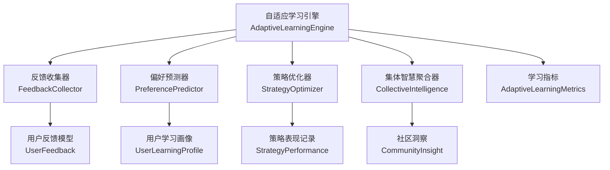
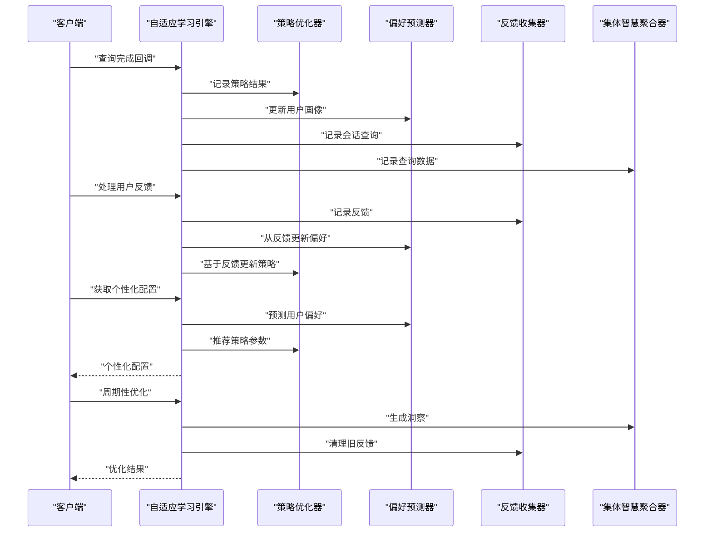
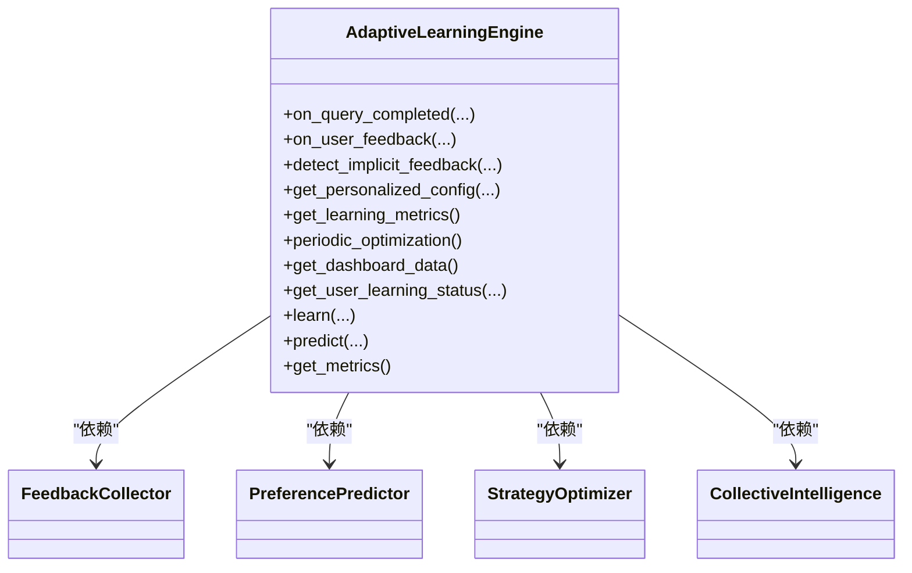
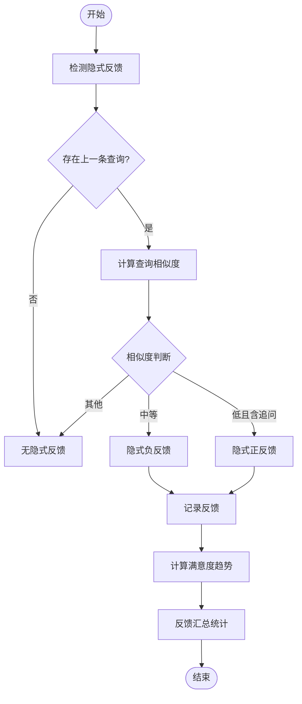
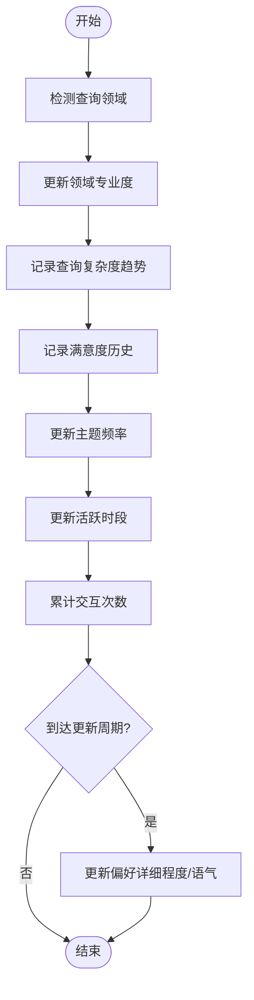
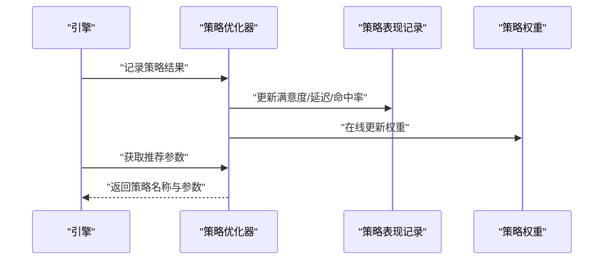
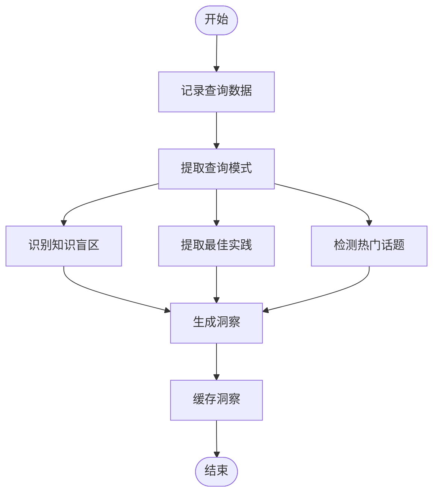
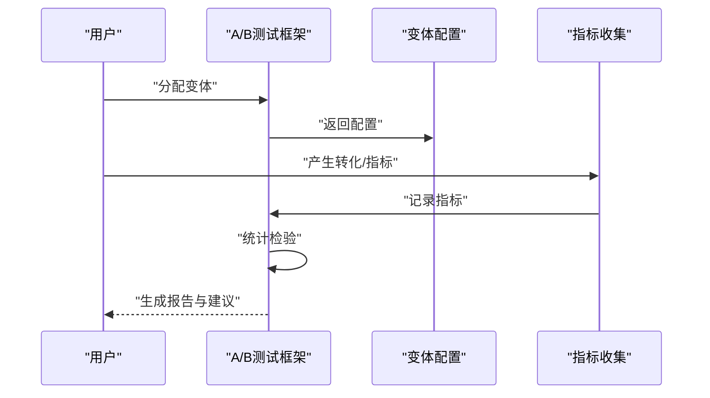
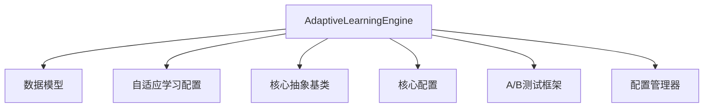

# 自适应学习系统

<cite>
**本文档引用的文件**
- [src/adaptive/__init__.py](file://src/adaptive/__init__.py)
- [src/adaptive/engine.py](file://src/adaptive/engine.py)
- [src/adaptive/collective.py](file://src/adaptive/collective.py)
- [src/adaptive/feedback.py](file://src/adaptive/feedback.py)
- [src/adaptive/models.py](file://src/adaptive/models.py)
- [src/adaptive/config.py](file://src/adaptive/config.py)
- [src/adaptive/preference_predictor.py](file://src/adaptive/preference_predictor.py)
- [src/adaptive/strategy_optimizer.py](file://src/adaptive/strategy_optimizer.py)
- [src/core/base.py](file://src/core/base.py)
- [src/core/config.py](file://src/core/config.py)
- [src/dashboard/debug/ab_testing.py](file://src/dashboard/debug/ab_testing.py)
- [src/dashboard/config_manager.py](file://src/dashboard/config_manager.py)
- [interface/api.py](file://interface/api.py)
- [interface/main.py](file://interface/main.py)
- [example/example_usage.py](file://example/example_usage.py)
</cite>

## 目录
1. [简介](#简介)
2. [项目结构](#项目结构)
3. [核心组件](#核心组件)
4. [架构总览](#架构总览)
5. [详细组件分析](#详细组件分析)
6. [依赖关系分析](#依赖关系分析)
7. [性能考虑](#性能考虑)
8. [故障排除指南](#故障排除指南)
9. [结论](#结论)
10. [附录](#附录)

## 简介
本文件面向构建智能化学习优化系统的开发者，系统性阐述自适应学习引擎的实现与集成方案。内容涵盖：
- 群体智能的联邦学习式实现：通过“集体智慧”聚合多用户交互，提炼共性洞察与最佳实践
- 反馈收集的用户行为分析：显式与隐式反馈的统一建模与趋势分析
- 偏好预测的机器学习模型：基于交互历史的用户画像与偏好动态建模
- 策略优化的算法设计：基于在线学习的检索策略参数自适应调整
- A/B测试集成的实验管理框架：统计显著性检验与业务影响评估
- 协同学习的分布式架构：模块化组件与统一协调器的设计

系统目标是实现“越用越智能”，通过学习指标量化效果，并提供配置参数、评估指标与性能调优指南，帮助快速落地。

## 项目结构
自适应学习系统位于 src/adaptive 目录，围绕统一协调器 AdaptiveLearningEngine 协调四大子系统：
- 反馈收集 FeedbackCollector：显式/隐式反馈采集与分析
- 偏好预测 PreferencePredictor：用户画像与偏好建模
- 策略优化 StrategyOptimizer：检索策略参数在线学习
- 集体智慧 CollectiveIntelligence：社群洞察生成与知识覆盖增长

**图表来源**
- [src/adaptive/engine.py:30-120](file://src/adaptive/engine.py#L30-L120)
- [src/adaptive/feedback.py:19-38](file://src/adaptive/feedback.py#L19-L38)
- [src/adaptive/preference_predictor.py:21-57](file://src/adaptive/preference_predictor.py#L21-L57)
- [src/adaptive/strategy_optimizer.py:19-76](file://src/adaptive/strategy_optimizer.py#L19-L76)
- [src/adaptive/collective.py:26-53](file://src/adaptive/collective.py#L26-L53)
- [src/adaptive/models.py:38-258](file://src/adaptive/models.py#L38-L258)

**章节来源**
- [src/adaptive/__init__.py:1-69](file://src/adaptive/__init__.py#L1-L69)
- [src/adaptive/engine.py:30-120](file://src/adaptive/engine.py#L30-L120)

## 核心组件
- 自适应学习引擎（AdaptiveLearningEngine）：统一协调器，负责在查询完成后学习、处理用户反馈、检测隐式反馈、生成个性化配置、周期性优化与指标汇总
- 反馈收集器（FeedbackCollector）：记录显式反馈与隐式反馈，计算满意度趋势与反馈模式
- 偏好预测器（PreferencePredictor）：基于领域关键词与查询复杂度估计用户专业度，动态更新偏好（详细程度、语气、兴趣主题）
- 策略优化器（StrategyOptimizer）：基于 epsilon-greedy 在线学习，为不同查询类型推荐最优检索参数
- 集体智慧聚合器（CollectiveIntelligence）：识别知识盲区、提取最佳实践、检测趋势，生成社区洞察
- 数据模型与配置：统一的数据结构与可调参数，便于扩展与实验

**章节来源**
- [src/adaptive/engine.py:122-447](file://src/adaptive/engine.py#L122-L447)
- [src/adaptive/feedback.py:39-398](file://src/adaptive/feedback.py#L39-L398)
- [src/adaptive/preference_predictor.py:64-426](file://src/adaptive/preference_predictor.py#L64-L426)
- [src/adaptive/strategy_optimizer.py:93-401](file://src/adaptive/strategy_optimizer.py#L93-L401)
- [src/adaptive/collective.py:61-378](file://src/adaptive/collective.py#L61-L378)
- [src/adaptive/models.py:14-258](file://src/adaptive/models.py#L14-L258)
- [src/adaptive/config.py:15-200](file://src/adaptive/config.py#L15-L200)

## 架构总览
自适应学习引擎通过统一协调器串联反馈、偏好、策略与集体智慧四个子系统，形成闭环学习：查询完成后记录策略效果与用户画像，收集显式/隐式反馈，优化策略参数，生成个性化配置，并定期产出社区洞察与学习指标。

**图表来源**
- [src/adaptive/engine.py:122-406](file://src/adaptive/engine.py#L122-L406)
- [src/adaptive/strategy_optimizer.py:93-290](file://src/adaptive/strategy_optimizer.py#L93-L290)
- [src/adaptive/preference_predictor.py:64-269](file://src/adaptive/preference_predictor.py#L64-L269)
- [src/adaptive/feedback.py:39-171](file://src/adaptive/feedback.py#L39-L171)
- [src/adaptive/collective.py:61-322](file://src/adaptive/collective.py#L61-L322)

## 详细组件分析

### 自适应学习引擎（AdaptiveLearningEngine）
- 统一协调器职责：延迟初始化子系统；查询完成学习；处理用户反馈；检测隐式反馈；生成个性化配置；周期性优化与指标汇总
- 个性化配置融合：结合偏好预测与策略优化结果，动态调整 top_k、置信度阈值等参数
- 指标汇总：满意度趋势、策略优化收益、个性化准确度、知识覆盖增长

**图表来源**
- [src/adaptive/engine.py:30-120](file://src/adaptive/engine.py#L30-L120)

**章节来源**
- [src/adaptive/engine.py:122-573](file://src/adaptive/engine.py#L122-L573)

### 反馈收集器（FeedbackCollector）
- 显式反馈：评分、修正、补充、无关等类型统一建模
- 隐式反馈：基于查询改写、追问关键词与相似度检测，自动推断正/负反馈
- 统计分析：满意度趋势、反馈模式、按查询类型/时段的活动分布

**图表来源**
- [src/adaptive/feedback.py:96-171](file://src/adaptive/feedback.py#L96-L171)
- [src/adaptive/feedback.py:198-240](file://src/adaptive/feedback.py#L198-L240)
- [src/adaptive/feedback.py:241-350](file://src/adaptive/feedback.py#L241-L350)

**章节来源**
- [src/adaptive/feedback.py:39-398](file://src/adaptive/feedback.py#L39-L398)

### 偏好预测器（PreferencePredictor）
- 领域关键词映射与专业度估计：基于查询关键词与术语使用，估计用户在各领域的专业度
- 用户画像更新：累积查询复杂度趋势、满意度历史、主题频率、活跃时段
- 偏好推断：根据复杂度趋势与专业度估计，动态调整详细程度与语气偏好

**图表来源**
- [src/adaptive/preference_predictor.py:64-129](file://src/adaptive/preference_predictor.py#L64-L129)
- [src/adaptive/preference_predictor.py:151-174](file://src/adaptive/preference_predictor.py#L151-L174)
- [src/adaptive/preference_predictor.py:301-339](file://src/adaptive/preference_predictor.py#L301-L339)

**章节来源**
- [src/adaptive/preference_predictor.py:64-426](file://src/adaptive/preference_predictor.py#L64-L426)

### 策略优化器（StrategyOptimizer）
- 默认策略参数模板：向量检索、混合检索、图增强、HyDE 增强等
- 在线学习：基于奖励（满意度-0.5）更新策略权重，采用 epsilon-greedy 探索与利用
- 推荐参数：根据不同查询类型微调 top_k、置信度阈值与是否启用 HyDE

**图表来源**
- [src/adaptive/strategy_optimizer.py:93-155](file://src/adaptive/strategy_optimizer.py#L93-L155)
- [src/adaptive/strategy_optimizer.py:156-197](file://src/adaptive/strategy_optimizer.py#L156-L197)
- [src/adaptive/strategy_optimizer.py:265-290](file://src/adaptive/strategy_optimizer.py#L265-L290)

**章节来源**
- [src/adaptive/strategy_optimizer.py:93-401](file://src/adaptive/strategy_optimizer.py#L93-L401)

### 集体智慧聚合器（CollectiveIntelligence）
- 知识盲区识别：统计低满意度主题，评估影响范围与严重程度
- 最佳实践提取：基于反馈与查询模式，提炼高满意度的查询类型与常用模式
- 趋势检测：统计主题查询频次，识别上升/稳定趋势
- 洞察生成：按类型缓存洞察，限制数量与刷新间隔

**图表来源**
- [src/adaptive/collective.py:61-92](file://src/adaptive/collective.py#L61-L92)
- [src/adaptive/collective.py:124-202](file://src/adaptive/collective.py#L124-L202)
- [src/adaptive/collective.py:232-322](file://src/adaptive/collective.py#L232-L322)

**章节来源**
- [src/adaptive/collective.py:61-378](file://src/adaptive/collective.py#L61-L378)

### 数据模型与配置
- 数据模型：用户反馈、策略表现、用户画像、社区洞察、学习指标、交互记录
- 配置类：反馈历史、偏好学习、策略优化、集体学习、指标窗口、交互记录等参数
- 预设模式：默认/积极/保守/最小配置，便于快速切换

**章节来源**
- [src/adaptive/models.py:14-258](file://src/adaptive/models.py#L14-L258)
- [src/adaptive/config.py:15-200](file://src/adaptive/config.py#L15-L200)

### A/B测试集成与实验管理
- A/B测试框架：测试变体、统计检验（t检验等）、转化事件与指标记录、报告生成
- 与自适应学习集成：可对不同学习策略、偏好参数或反馈模式进行对比测试，评估业务影响

**图表来源**
- [src/dashboard/debug/ab_testing.py:161-428](file://src/dashboard/debug/ab_testing.py#L161-L428)

**章节来源**
- [src/dashboard/debug/ab_testing.py:161-682](file://src/dashboard/debug/ab_testing.py#L161-L682)

### 配置管理与仪表盘
- 配置管理器：Profile 的创建、切换、更新、复制、导入/导出
- 仪表盘数据：学习指标、反馈汇总、策略表现、用户画像汇总、社区洞察

**章节来源**
- [src/dashboard/config_manager.py:14-315](file://src/dashboard/config_manager.py#L14-L315)

## 依赖关系分析
- 自适应学习引擎依赖反馈、偏好、策略与集体智慧子系统
- 子系统之间通过统一数据模型解耦，降低耦合度
- 与核心配置与抽象基类协同，保证可替换性与一致性

**图表来源**
- [src/adaptive/engine.py:12-24](file://src/adaptive/engine.py#L12-L24)
- [src/core/base.py:1-800](file://src/core/base.py#L1-L800)
- [src/core/config.py:1-420](file://src/core/config.py#L1-L420)
- [src/dashboard/debug/ab_testing.py:1-682](file://src/dashboard/debug/ab_testing.py#L1-L682)
- [src/dashboard/config_manager.py:1-315](file://src/dashboard/config_manager.py#L1-L315)

**章节来源**
- [src/adaptive/engine.py:12-24](file://src/adaptive/engine.py#L12-L24)
- [src/core/base.py:1-800](file://src/core/base.py#L1-L800)
- [src/core/config.py:1-420](file://src/core/config.py#L1-L420)

## 性能考虑
- 学习速率与探索率：通过配置项控制偏好与策略的学习速度与探索程度，避免过度震荡
- 样本量阈值：策略优化要求最小样本数，减少噪声影响
- 缓存与刷新：集体智慧洞察设置刷新间隔，避免频繁计算
- 内存与历史长度：反馈与交互记录的最大数量与保留天数，平衡存储与性能
- 统计检验：在足够样本量下进行显著性检验，避免误判

[本节为通用指导，无需特定文件引用]

## 故障排除指南
- 配置校验：当配置超出有效范围或数值不合理时，抛出异常提示
- 日志记录：各组件均包含详细日志，便于定位问题
- 反馈清理：定期清理旧反馈，防止内存膨胀
- 指标缺失：若用户画像或策略数据为空，返回默认偏好与基准策略

**章节来源**
- [src/adaptive/config.py:157-192](file://src/adaptive/config.py#L157-L192)
- [src/adaptive/feedback.py:369-398](file://src/adaptive/feedback.py#L369-L398)
- [src/adaptive/preference_predictor.py:174-224](file://src/adaptive/preference_predictor.py#L174-L224)
- [src/adaptive/strategy_optimizer.py:256-263](file://src/adaptive/strategy_optimizer.py#L256-L263)

## 结论
本自适应学习系统通过统一协调器整合反馈、偏好、策略与集体智慧，形成闭环学习与持续优化。配合 A/B 测试框架与仪表盘，能够量化“越用越智能”的效果，并提供灵活的配置与调优手段。开发者可据此快速构建智能化的学习优化系统。

[本节为总结，无需特定文件引用]

## 附录

### 使用示例与集成方案
- 完整工作流示例：展示从感知层到交互层的端到端流程，便于理解自适应学习在整体架构中的位置
- 接口服务：提供 RESTful API 与 WebSocket 服务，便于集成到现有系统

**章节来源**
- [example/example_usage.py:1-252](file://example/example_usage.py#L1-L252)
- [interface/api.py:19-162](file://interface/api.py#L19-L162)
- [interface/main.py:14-82](file://interface/main.py#L14-L82)

### 自适应机制配置参数与效果评估
- 配置参数：反馈历史大小、隐式反馈开关、偏好更新间隔、学习速率、探索率、默认策略集合、最小样本数、洞察刷新间隔等
- 效果评估指标：满意度趋势、策略优化收益、个性化准确度、知识覆盖增长率、活跃用户数、反馈总量与平均满意度

**章节来源**
- [src/adaptive/config.py:23-60](file://src/adaptive/config.py#L23-L60)
- [src/adaptive/engine.py:339-372](file://src/adaptive/engine.py#L339-L372)
- [src/adaptive/collective.py:358-378](file://src/adaptive/collective.py#L358-L378)

### 扩展指南
- 新增策略：在策略优化器中扩展默认策略参数模板，并在推荐逻辑中加入类型微调
- 新增反馈类型：在反馈收集器中扩展类型识别与隐式反馈检测规则
- 新增领域：在偏好预测器中扩展领域关键词映射与专业术语集合
- 新增统计检验：在 A/B 测试框架中注册新的统计检验方法

**章节来源**
- [src/adaptive/strategy_optimizer.py:27-57](file://src/adaptive/strategy_optimizer.py#L27-L57)
- [src/adaptive/feedback.py:117-171](file://src/adaptive/feedback.py#L117-L171)
- [src/adaptive/preference_predictor.py:29-46](file://src/adaptive/preference_predictor.py#L29-L46)
- [src/dashboard/debug/ab_testing.py:175-181](file://src/dashboard/debug/ab_testing.py#L175-L181)