# 自适应学习系统

<cite>
**本文档引用的文件**
- [src/retrieval/smart_routing/engine.py](file://src/retrieval/smart_routing/engine.py)
- [src/retrieval/smart_routing/feedback_loop.py](file://src/retrieval/smart_routing/feedback_loop.py)
- [src/retrieval/smart_routing/user_adapter.py](file://src/retrieval/smart_routing/user_adapter.py)
- [src/retrieval/smart_routing/intent_router.py](file://src/retrieval/smart_routing/intent_router.py)
- [src/retrieval/smart_routing/strategy_fusion.py](file://src/retrieval/smart_routing/strategy_fusion.py)
- [src/retrieval/smart_routing/cot_controller.py](file://src/retrieval/smart_routing/cot_controller.py)
- [src/retrieval/smart_routing/early_stopping.py](file://src/retrieval/smart_routing/early_stopping.py)
- [src/retrieval/smart_routing/IMPLEMENTATION_SUMMARY.md](file://src/retrieval/smart_routing/IMPLEMENTATION_SUMMARY.md)
- [src/core/base.py](file://src/core/base.py)
- [src/core/config.py](file://src/core/config.py)
- [src/dashboard/debug/ab_testing.py](file://src/dashboard/debug/ab_testing.py)
- [src/dashboard/config_manager.py](file://src/dashboard/config_manager.py)
- [interface/api.py](file://interface/api.py)
- [interface/main.py](file://interface/main.py)
- [example/example_usage.py](file://example/example_usage.py)
</cite>

## 目录
1. [简介](#简介)
2. [项目结构](#项目结构)
3. [核心组件](#核心组件)
4. [架构总览](#架构总览)
5. [详细组件分析](#详细组件分析)
6. [依赖关系分析](#依赖关系分析)
7. [性能考虑](#性能考虑)
8. [故障排除指南](#故障排除指南)
9. [结论](#结论)
10. [附录](#附录)

## 简介
本文件面向构建智能化学习优化系统的开发者，系统性阐述智能路由引擎的反馈闭环机制实现与集成方案。内容涵盖：
- 智能路由的多层决策架构：通过"意图识别层、用户画像层、策略融合层"实现精准路由
- 反馈收集的实时学习系统：显式与隐式反馈的统一建模与在线学习更新
- 用户偏好的动态适配：基于用户画像的专业度评估与风格偏好调节
- 策略优化的增量学习算法：基于预测误差的在线权重更新机制
- A/B测试集成的实验管理框架：统计显著性检验与业务影响评估
- 协同学习的分布式架构：模块化组件与统一协调器的设计

系统目标是实现"越用越智能"，通过实时反馈闭环学习提升检索效果，并提供配置参数、评估指标与性能调优指南，帮助快速落地。

## 项目结构
智能路由引擎位于 src/retrieval/smart_routing 目录，围绕统一协调器 StrategyFusionEngine 协调六大子系统：
- 意图路由器 IntentRouter：语义意图分类与复杂度评估
- 用户画像适配器 UserProfileAdapter：用户专业度与风格偏好管理
- CoT思维链控制器 CoTController：智能推理触发与深度调节
- 策略融合引擎 StrategyFusion：多策略并行执行与结果融合
- 早停管理器 EarlyStoppingManager：性能监控与降级决策
- 反馈闭环系统 FeedbackLoop：实时反馈收集与在线学习

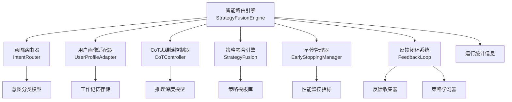

**图表来源**
- [src/retrieval/smart_routing/engine.py:34-62](file://src/retrieval/smart_routing/engine.py#L34-L62)
- [src/retrieval/smart_routing/intent_router.py:91-110](file://src/retrieval/smart_routing/intent_router.py#L91-L110)
- [src/retrieval/smart_routing/user_adapter.py:98-124](file://src/retrieval/smart_routing/user_adapter.py#L98-L124)
- [src/retrieval/smart_routing/cot_controller.py:21-54](file://src/retrieval/smart_routing/cot_controller.py#L21-L54)
- [src/retrieval/smart_routing/strategy_fusion.py:43-56](file://src/retrieval/smart_routing/strategy_fusion.py#L43-L56)
- [src/retrieval/smart_routing/early_stopping.py:39-55](file://src/retrieval/smart_routing/early_stopping.py#L39-L55)
- [src/retrieval/smart_routing/feedback_loop.py:30-51](file://src/retrieval/smart_routing/feedback_loop.py#L30-L51)

**章节来源**
- [src/retrieval/smart_routing/engine.py:34-129](file://src/retrieval/smart_routing/engine.py#L34-L129)

## 核心组件
- 智能路由引擎（StrategyFusionEngine）：统一协调器，负责三层决策架构、实时反馈学习、性能监控与降级管理
- 意图路由器（IntentRouter）：语义意图分类与复杂度评估，提供策略模板映射
- 用户画像适配器（UserProfileAdapter）：用户专业度评估与风格偏好管理，支持实时更新
- CoT思维链控制器（CoTController）：智能推理触发判断与动态深度调节
- 策略融合引擎（StrategyFusion）：多策略并行执行、结果融合与多样性保证
- 早停管理器（EarlyStoppingManager）：多维度早停判断与动态降级决策
- 反馈闭环系统（FeedbackLoop）：显式/隐式反馈收集与在线学习更新

**章节来源**
- [src/retrieval/smart_routing/engine.py:34-274](file://src/retrieval/smart_routing/engine.py#L34-L274)
- [src/retrieval/smart_routing/intent_router.py:91-278](file://src/retrieval/smart_routing/intent_router.py#L91-L278)
- [src/retrieval/smart_routing/user_adapter.py:98-331](file://src/retrieval/smart_routing/user_adapter.py#L98-L331)
- [src/retrieval/smart_routing/cot_controller.py:21-202](file://src/retrieval/smart_routing/cot_controller.py#L21-L202)
- [src/retrieval/smart_routing/strategy_fusion.py:43-349](file://src/retrieval/smart_routing/strategy_fusion.py#L43-L349)
- [src/retrieval/smart_routing/early_stopping.py:39-326](file://src/retrieval/smart_routing/early_stopping.py#L39-L326)
- [src/retrieval/smart_routing/feedback_loop.py:30-435](file://src/retrieval/smart_routing/feedback_loop.py#L30-L435)

## 架构总览
智能路由引擎通过三层决策架构与实时反馈闭环实现智能化学习：意图识别层提供策略模板，用户画像层进行个性化调节，策略融合层执行多策略并行检索，早停管理器平衡性能与效果，反馈闭环系统实现在线学习更新。

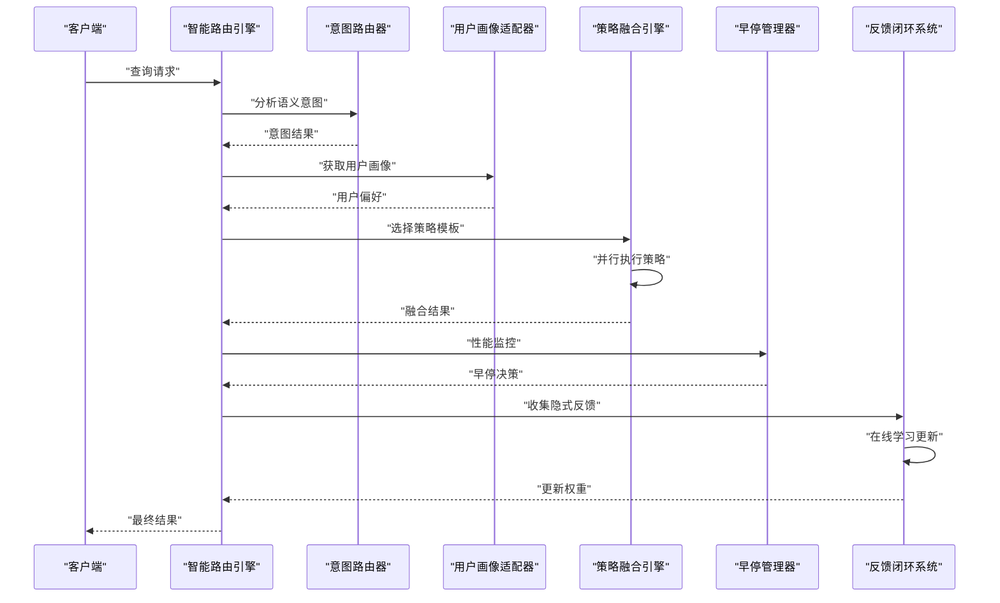

**图表来源**
- [src/retrieval/smart_routing/engine.py:68-129](file://src/retrieval/smart_routing/engine.py#L68-L129)
- [src/retrieval/smart_routing/engine.py:205-249](file://src/retrieval/smart_routing/engine.py#L205-L249)
- [src/retrieval/smart_routing/feedback_loop.py:250-282](file://src/retrieval/smart_routing/feedback_loop.py#L250-L282)

## 详细组件分析

### 智能路由引擎（StrategyFusionEngine）
- 三层决策架构：意图识别层、用户画像层、策略融合层的统一协调
- 实时反馈学习：从隐式反馈中更新策略权重，实现在线学习
- 性能监控：平均处理时间统计与运行状态跟踪
- 降级管理：基于延迟的动态降级策略

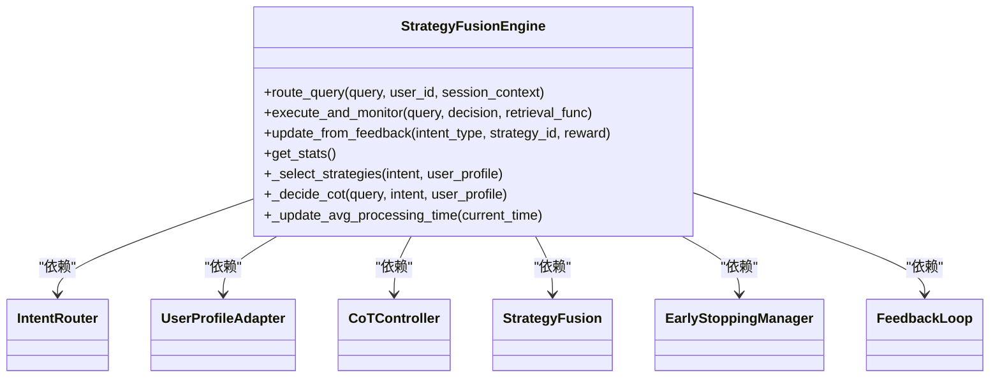

**图表来源**
- [src/retrieval/smart_routing/engine.py:34-62](file://src/retrieval/smart_routing/engine.py#L34-L62)

**章节来源**
- [src/retrieval/smart_routing/engine.py:34-274](file://src/retrieval/smart_routing/engine.py#L34-L274)

### 意图路由器（IntentRouter）
- 七类语义意图识别：事实查询、比较分析、推理演绎、概念解释、摘要总结、操作指导、探索发散
- 复杂度评估：基于查询长度、问句数量、连接词等特征估算问题复杂度
- 策略模板映射：为每种意图提供默认策略权重配置
- CoT触发概率：根据不同意图类型设置相应的思维链触发概率

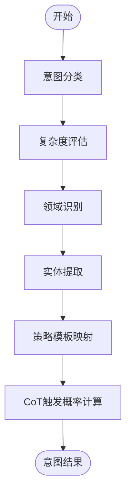

**图表来源**
- [src/retrieval/smart_routing/intent_router.py:115-155](file://src/retrieval/smart_routing/intent_router.py#L115-L155)
- [src/retrieval/smart_routing/intent_router.py:240-246](file://src/retrieval/smart_routing/intent_router.py#L240-L246)

**章节来源**
- [src/retrieval/smart_routing/intent_router.py:91-278](file://src/retrieval/smart_routing/intent_router.py#L91-L278)

### 用户画像适配器（UserProfileAdapter）
- 专业度评估：基于领域关键词与查询复杂度估计用户在各领域的专业度
- 风格偏好管理：详细度、语调、格式偏好、引用风格等个性化设置
- 实时更新机制：从反馈信号中更新用户画像，支持专业度和偏好的动态调整
- 专家级适配：根据专业度自动调整响应风格和详细程度

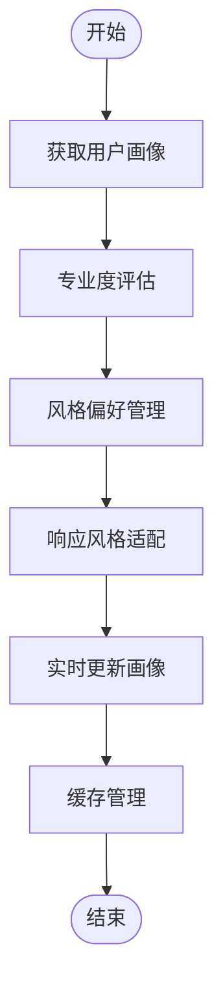

**图表来源**
- [src/retrieval/smart_routing/user_adapter.py:133-150](file://src/retrieval/smart_routing/user_adapter.py#L133-L150)
- [src/retrieval/smart_routing/user_adapter.py:248-288](file://src/retrieval/smart_routing/user_adapter.py#L248-L288)

**章节来源**
- [src/retrieval/smart_routing/user_adapter.py:98-331](file://src/retrieval/smart_routing/user_adapter.py#L98-L331)

### CoT思维链控制器（CoTController）
- 智能触发判断：基于复杂度、置信度、查询长度、推理关键词等特征判断是否触发思维链
- 动态深度调节：根据意图复杂度、用户专业度、显式偏好等因素动态确定推理深度
- 性能监控：统计触发率与查询总数，提供性能分析

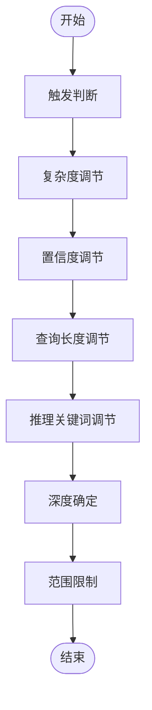

**图表来源**
- [src/retrieval/smart_routing/cot_controller.py:55-107](file://src/retrieval/smart_routing/cot_controller.py#L55-L107)
- [src/retrieval/smart_routing/cot_controller.py:109-172](file://src/retrieval/smart_routing/cot_controller.py#L109-L172)

**章节来源**
- [src/retrieval/smart_routing/cot_controller.py:21-202](file://src/retrieval/smart_routing/cot_controller.py#L21-L202)

### 策略融合引擎（StrategyFusion）
- 多策略并行执行：支持向量检索、图谱多跳、HyDE假设答案、CoT推理等多种策略
- 结果融合算法：基于策略权重、归一化分数、新颖性加成、多样性惩罚的融合评分
- 多样性保证：避免单一来源垄断，控制领域分布比例
- 重排序机制：支持BGE重排序等模型进行最终排序

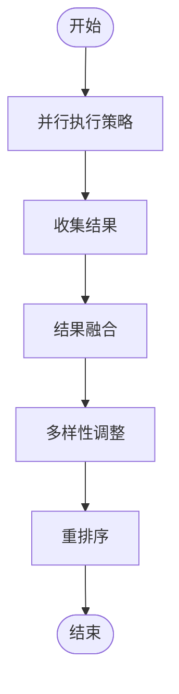

**图表来源**
- [src/retrieval/smart_routing/strategy_fusion.py:78-158](file://src/retrieval/smart_routing/strategy_fusion.py#L78-L158)
- [src/retrieval/smart_routing/strategy_fusion.py:217-271](file://src/retrieval/smart_routing/strategy_fusion.py#L217-L271)

**章节来源**
- [src/retrieval/smart_routing/strategy_fusion.py:43-349](file://src/retrieval/smart_routing/strategy_fusion.py#L43-L349)

### 早停管理器（EarlyStoppingManager）
- 多维度早停判断：置信度阈值、边际收益递减、延迟预算、满意度预测
- 动态降级决策：基于延迟时间的四级降级策略
- 性能监控：统计早停触发次数、降级事件分布、运行效率指标

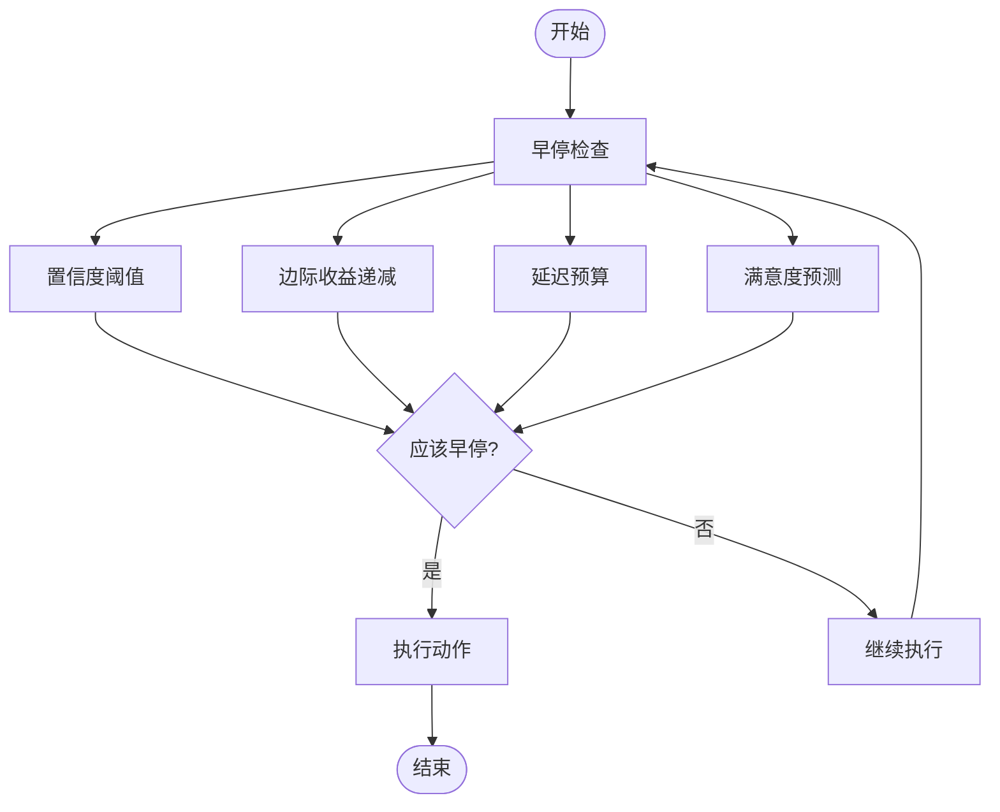

**图表来源**
- [src/retrieval/smart_routing/early_stopping.py:57-109](file://src/retrieval/smart_routing/early_stopping.py#L57-L109)
- [src/retrieval/smart_routing/early_stopping.py:157-183](file://src/retrieval/smart_routing/early_stopping.py#L157-L183)

**章节来源**
- [src/retrieval/smart_routing/early_stopping.py:39-326](file://src/retrieval/smart_routing/early_stopping.py#L39-L326)

### 反馈闭环系统（FeedbackLoop）
- 显式反馈收集：评分标准化、文本反馈处理、领域专业度更新
- 隐式反馈收集：查询改写、会话放弃、再次搜索、停留时长、引用行为
- 在线学习算法：基于预测误差的增量权重更新，支持用户画像实时更新
- 信号权重配置：不同反馈类型的权重设置与标准化处理

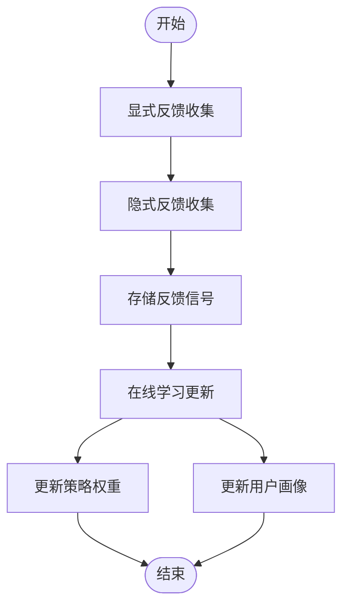

**图表来源**
- [src/retrieval/smart_routing/feedback_loop.py:57-96](file://src/retrieval/smart_routing/feedback_loop.py#L57-L96)
- [src/retrieval/smart_routing/feedback_loop.py:98-148](file://src/retrieval/smart_routing/feedback_loop.py#L98-L148)
- [src/retrieval/smart_routing/feedback_loop.py:325-356](file://src/retrieval/smart_routing/feedback_loop.py#L325-L356)

**章节来源**
- [src/retrieval/smart_routing/feedback_loop.py:30-435](file://src/retrieval/smart_routing/feedback_loop.py#L30-L435)

### A/B测试集成与实验管理
- A/B测试框架：测试变体、统计检验（t检验等）、转化事件与指标记录、报告生成
- 与智能路由集成：可对不同路由策略、CoT深度、反馈权重等进行对比测试，评估业务影响

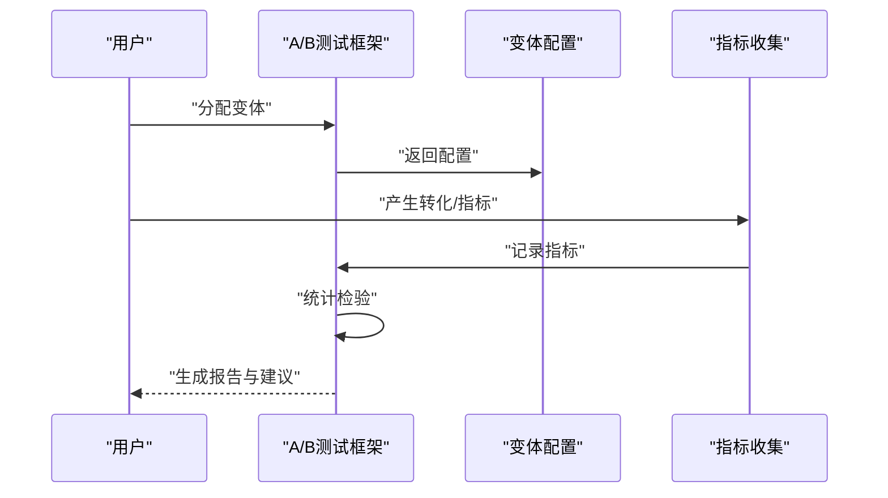

**图表来源**
- [src/dashboard/debug/ab_testing.py:161-428](file://src/dashboard/debug/ab_testing.py#L161-L428)

**章节来源**
- [src/dashboard/debug/ab_testing.py:161-682](file://src/dashboard/debug/ab_testing.py#L161-L682)

### 配置管理与仪表盘
- 配置管理器：Profile 的创建、切换、更新、复制、导入/导出
- 仪表盘数据：学习指标、反馈汇总、策略表现、用户画像汇总、社区洞察

**章节来源**
- [src/dashboard/config_manager.py:14-315](file://src/dashboard/config_manager.py#L14-L315)

## 依赖关系分析
- 智能路由引擎依赖六大核心子系统，形成完整的反馈闭环
- 子系统之间通过统一的数据模型解耦，降低耦合度
- 与核心配置与抽象基类协同，保证可替换性与一致性

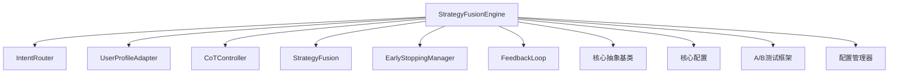

**图表来源**
- [src/retrieval/smart_routing/engine.py:12-24](file://src/retrieval/smart_routing/engine.py#L12-L24)
- [src/core/base.py:1-800](file://src/core/base.py#L1-L800)
- [src/core/config.py:1-420](file://src/core/config.py#L1-L420)
- [src/dashboard/debug/ab_testing.py:1-682](file://src/dashboard/debug/ab_testing.py#L1-L682)
- [src/dashboard/config_manager.py:1-315](file://src/dashboard/config_manager.py#L1-L315)

**章节来源**
- [src/retrieval/smart_routing/engine.py:12-24](file://src/retrieval/smart_routing/engine.py#L12-L24)
- [src/core/base.py:1-800](file://src/core/base.py#L1-L800)
- [src/core/config.py:1-420](file://src/core/config.py#L1-L420)

## 性能考虑
- 学习速率与权重限制：通过学习率和权重范围控制在线学习的稳定性
- 并行策略优化：策略优先级排序与早停机制平衡性能与效果
- 缓存与内存管理：用户画像缓存、反馈信号存储限制
- 降级策略：基于延迟的四级降级确保系统可用性
- 统计检验：在足够样本量下进行显著性检验，避免误判

## 故障排除指南
- 配置校验：当配置超出有效范围或数值不合理时，抛出异常提示
- 日志记录：各组件均包含详细日志，便于定位问题
- 反馈清理：定期清理旧反馈，防止内存膨胀
- 策略权重恢复：学习器支持重置状态，避免异常权重影响
- 性能监控：早停管理器提供详细的统计信息，便于性能分析

**章节来源**
- [src/retrieval/smart_routing/feedback_loop.py:430-435](file://src/retrieval/smart_routing/feedback_loop.py#L430-L435)
- [src/retrieval/smart_routing/early_stopping.py:321-326](file://src/retrieval/smart_routing/early_stopping.py#L321-L326)
- [src/retrieval/smart_routing/user_adapter.py:325-331](file://src/retrieval/smart_routing/user_adapter.py#L325-L331)

## 结论
本智能路由系统通过三层决策架构与实时反馈闭环实现智能化学习，替代了原有的独立自适应学习组件。系统具备完整的意图识别、用户画像、策略融合、性能监控、降级管理和在线学习能力，配合A/B测试框架与仪表盘，能够量化"越用越智能"的效果，并提供灵活的配置与调优手段。开发者可据此快速构建智能化的学习优化系统。

## 附录

### 使用示例与集成方案
- 完整工作流示例：展示从感知层到交互层的端到端流程，便于理解智能路由在整体架构中的位置
- 接口服务：提供 RESTful API 与 WebSocket 服务，便于集成到现有系统

**章节来源**
- [example/example_usage.py:1-252](file://example/example_usage.py#L1-L252)
- [interface/api.py:19-162](file://interface/api.py#L19-L162)
- [interface/main.py:14-82](file://interface/main.py#L14-L82)

### 智能路由机制配置参数与效果评估
- 配置参数：学习率、策略权重范围、早停阈值、降级延迟阈值、反馈信号权重、用户画像缓存大小等
- 效果评估指标：路由准确性、用户满意度、响应时间、策略使用效率、CoT触发率、早停成功率

**章节来源**
- [src/retrieval/smart_routing/feedback_loop.py:315-317](file://src/retrieval/smart_routing/feedback_loop.py#L315-L317)
- [src/retrieval/smart_routing/early_stopping.py:210-243](file://src/retrieval/smart_routing/early_stopping.py#L210-L243)
- [src/retrieval/smart_routing/engine.py:266-273](file://src/retrieval/smart_routing/engine.py#L266-L273)

### 扩展指南
- 新增策略：在策略模板中注册新策略，实现相应的检索函数
- 新增反馈类型：在反馈收集器中扩展信号类型与权重配置
- 新增意图类型：在意图路由器中注册新的意图分类器与策略模板
- 新增降级策略：在早停管理器中扩展降级动作与阈值配置

**章节来源**
- [src/retrieval/smart_routing/strategy_fusion.py:61-76](file://src/retrieval/smart_routing/strategy_fusion.py#L61-L76)
- [src/retrieval/smart_routing/feedback_loop.py:43-51](file://src/retrieval/smart_routing/feedback_loop.py#L43-L51)
- [src/retrieval/smart_routing/intent_router.py:248-254](file://src/retrieval/smart_routing/intent_router.py#L248-L254)
- [src/retrieval/smart_routing/early_stopping.py:185-208](file://src/retrieval/smart_routing/early_stopping.py#L185-L208)