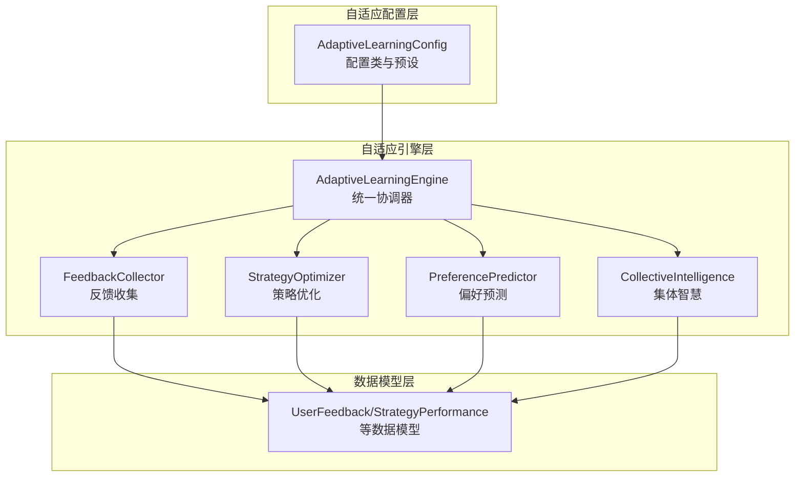
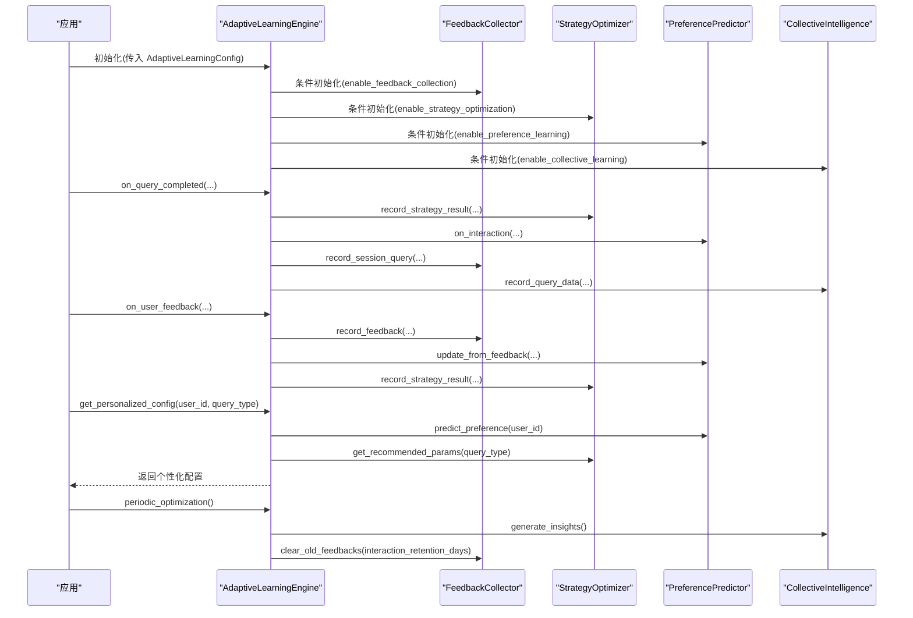
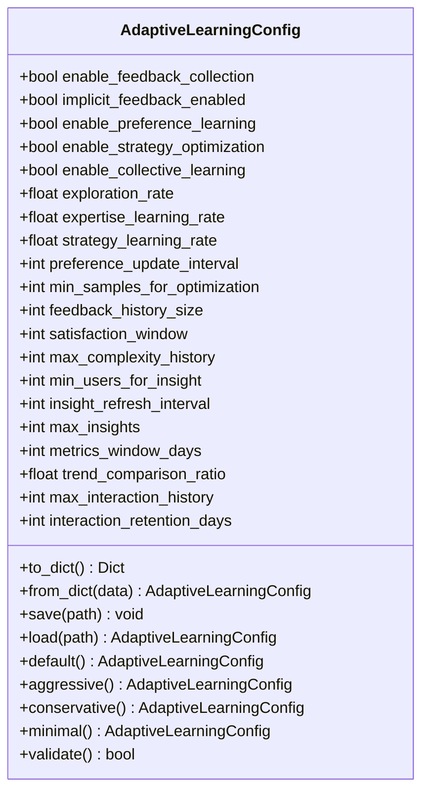
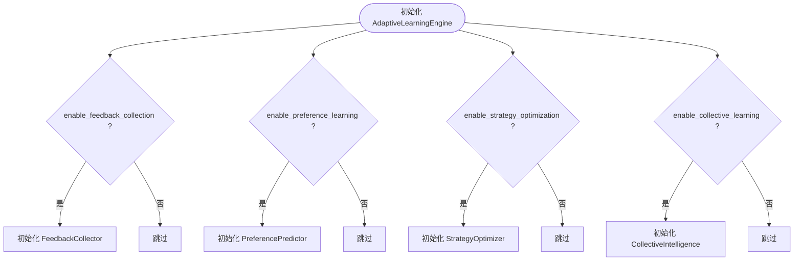
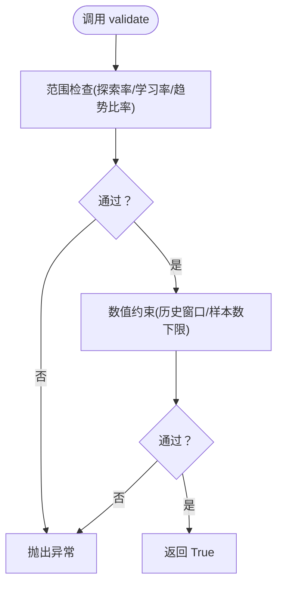
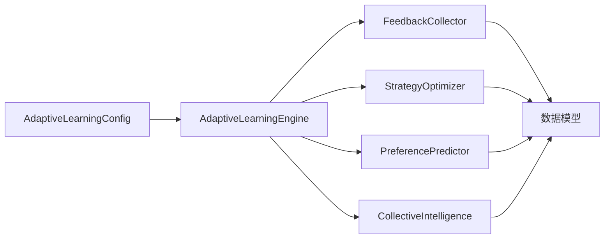

# 自适应配置管理

<cite>
**本文引用的文件**
- [src/adaptive/config.py](file://src/adaptive/config.py)
- [src/adaptive/engine.py](file://src/adaptive/engine.py)
- [src/adaptive/feedback.py](file://src/adaptive/feedback.py)
- [src/adaptive/strategy_optimizer.py](file://src/adaptive/strategy_optimizer.py)
- [src/adaptive/preference_predictor.py](file://src/adaptive/preference_predictor.py)
- [src/adaptive/collective.py](file://src/adaptive/collective.py)
- [src/adaptive/models.py](file://src/adaptive/models.py)
- [src/adaptive/__init__.py](file://src/adaptive/__init__.py)
- [src/adaptive/README.md](file://src/adaptive/README.md)
- [wiki/wiki/配置管理/配置管理.md](file://wiki/wiki/配置管理/配置管理.md)
- [wiki/wiki/配置管理/预设配置.md](file://wiki/wiki/配置管理/预设配置.md)
</cite>

## 目录
1. [简介](#简介)
2. [项目结构](#项目结构)
3. [核心组件](#核心组件)
4. [架构总览](#架构总览)
5. [详细组件分析](#详细组件分析)
6. [依赖分析](#依赖分析)
7. [性能考虑](#性能考虑)
8. [故障排查指南](#故障排查指南)
9. [结论](#结论)
10. [附录](#附录)

## 简介
本文件系统性阐述 NecoRAG 自适应配置管理系统的架构与实现，重点围绕 AdaptiveLearningConfig 类的配置模式设计、参数管理机制与验证约束，解释反馈收集、偏好学习、策略优化与集体智慧四大子系统的模块化开关控制，以及配置持久化、热更新与监控诊断能力。文档同时提供配置模板与最佳实践，帮助在不同业务场景下选择合适的预设模式并进行工程化落地。

## 项目结构
自适应配置管理位于 src/adaptive 目录，核心文件包括：
- config.py：AdaptiveLearningConfig 配置类与预设模式工厂方法
- engine.py：自适应学习引擎，协调反馈收集、偏好预测、策略优化与集体智慧
- feedback.py：反馈收集器，支持显式/隐式反馈与会话跟踪
- strategy_optimizer.py：策略优化器，基于 epsilon-greedy 的在线学习
- preference_predictor.py：偏好预测器，动态建模用户偏好与专业度
- collective.py：集体智慧聚合器，从全局交互中提炼洞察
- models.py：数据模型与枚举，统一反馈、策略性能、用户画像与指标
- __init__.py：模块导出与便捷工厂函数 create_adaptive_engine

**图表来源**
- [src/adaptive/config.py:15-200](file://src/adaptive/config.py#L15-L200)
- [src/adaptive/engine.py:30-598](file://src/adaptive/engine.py#L30-L598)
- [src/adaptive/feedback.py:19-398](file://src/adaptive/feedback.py#L19-L398)
- [src/adaptive/strategy_optimizer.py:19-401](file://src/adaptive/strategy_optimizer.py#L19-L401)
- [src/adaptive/preference_predictor.py:21-426](file://src/adaptive/preference_predictor.py#L21-L426)
- [src/adaptive/collective.py:26-378](file://src/adaptive/collective.py#L26-L378)
- [src/adaptive/models.py:14-258](file://src/adaptive/models.py#L14-L258)

**章节来源**
- [src/adaptive/config.py:15-200](file://src/adaptive/config.py#L15-L200)
- [src/adaptive/engine.py:30-598](file://src/adaptive/engine.py#L30-L598)
- [src/adaptive/__init__.py:12-69](file://src/adaptive/__init__.py#L12-L69)

## 核心组件
- AdaptiveLearningConfig：定义反馈收集、偏好学习、策略优化、集体智慧、指标与交互记录等配置项，提供默认/积极/保守/最小化四种预设工厂方法，并内置 validate 参数校验。
- AdaptiveLearningEngine：统一协调四大子系统，提供查询完成回调、用户反馈处理、隐式反馈检测、个性化配置生成、学习指标获取与周期性优化等能力。
- FeedbackCollector：记录显式/隐式反馈、会话查询、满意度趋势与反馈模式分析，支持清理旧数据。
- StrategyOptimizer：基于 epsilon-greedy 的策略权重在线更新，提供推荐参数与优化报告。
- PreferencePredictor：基于查询复杂度、领域关键词与反馈语义，动态估计用户专业度与偏好，定期更新偏好模型。
- CollectiveIntelligence：聚合主题、低满意度与查询模式，生成知识盲区、最佳实践与趋势洞察。
- 数据模型：UserFeedback、StrategyPerformance、UserLearningProfile、CommunityInsight、AdaptiveLearningMetrics、InteractionRecord 等。

**章节来源**
- [src/adaptive/config.py:15-200](file://src/adaptive/config.py#L15-L200)
- [src/adaptive/engine.py:30-598](file://src/adaptive/engine.py#L30-L598)
- [src/adaptive/feedback.py:19-398](file://src/adaptive/feedback.py#L19-L398)
- [src/adaptive/strategy_optimizer.py:19-401](file://src/adaptive/strategy_optimizer.py#L19-L401)
- [src/adaptive/preference_predictor.py:21-426](file://src/adaptive/preference_predictor.py#L21-L426)
- [src/adaptive/collective.py:26-378](file://src/adaptive/collective.py#L26-L378)
- [src/adaptive/models.py:14-258](file://src/adaptive/models.py#L14-L258)

## 架构总览
自适应配置管理采用“配置驱动 + 子系统模块化”的架构：AdaptiveLearningConfig 作为单一真相源，AdaptiveLearningEngine 根据配置决定启用哪些子系统；子系统之间通过统一的数据模型进行协作，形成“反馈-偏好-策略-集体智慧”的闭环学习。

**图表来源**
- [src/adaptive/engine.py:64-406](file://src/adaptive/engine.py#L64-L406)
- [src/adaptive/feedback.py:39-397](file://src/adaptive/feedback.py#L39-L397)
- [src/adaptive/strategy_optimizer.py:93-290](file://src/adaptive/strategy_optimizer.py#L93-L290)
- [src/adaptive/preference_predictor.py:64-268](file://src/adaptive/preference_predictor.py#L64-L268)
- [src/adaptive/collective.py:61-322](file://src/adaptive/collective.py#L61-L322)

**章节来源**
- [src/adaptive/engine.py:64-406](file://src/adaptive/engine.py#L64-L406)

## 详细组件分析

### AdaptiveLearningConfig 配置架构与预设模式
- 配置分区
  - 反馈收集：enable_feedback_collection、feedback_history_size、implicit_feedback_enabled
  - 偏好学习：enable_preference_learning、preference_update_interval、expertise_learning_rate、satisfaction_window、max_complexity_history
  - 策略优化：enable_strategy_optimization、strategy_learning_rate、min_samples_for_optimization、exploration_rate、default_strategies
  - 集体智慧：enable_collective_learning、min_users_for_insight、insight_refresh_interval、max_insights
  - 指标与交互：metrics_window_days、trend_comparison_ratio、max_interaction_history、interaction_retention_days
- 预设模式
  - default：通用默认配置，平衡学习速率与探索率
  - aggressive：高频偏好更新、高学习速率、高探索率，适合快速学习场景
  - conservative：低频偏好更新、低学习速率、低探索率，适合稳定与低波动场景
  - minimal：禁用集体智慧与隐式反馈，仅保留核心功能，适合资源受限场景
- 参数验证
  - 探索率、学习率、趋势比率范围校验
  - 历史窗口与样本数下限校验
  - 验证失败抛出异常，保证配置有效性

**图表来源**
- [src/adaptive/config.py:15-200](file://src/adaptive/config.py#L15-L200)

**章节来源**
- [src/adaptive/config.py:15-200](file://src/adaptive/config.py#L15-L200)

### 学习开关控制与模块化配置
- 开关粒度
  - enable_feedback_collection：控制 FeedbackCollector 初始化与反馈记录
  - enable_preference_learning：控制 PreferencePredictor 初始化与偏好更新
  - enable_strategy_optimization：控制 StrategyOptimizer 初始化与策略权重更新
  - enable_collective_learning：控制 CollectiveIntelligence 初始化与洞察生成
- 控制流
  - AdaptiveLearningEngine 在初始化时根据配置决定是否实例化对应子系统
  - 学习回调 on_query_completed/on_user_feedback 仅在相应开关开启时调用对应子系统
  - 个性化配置 get_personalized_config 仅在子系统可用时返回对应参数

**图表来源**
- [src/adaptive/engine.py:84-100](file://src/adaptive/engine.py#L84-L100)

**章节来源**
- [src/adaptive/engine.py:84-100](file://src/adaptive/engine.py#L84-L100)

### 学习参数设置与关键指标
- 交互保留与学习速率
  - interaction_retention_days：交互记录清理周期
  - expertise_learning_rate、strategy_learning_rate：偏好与策略学习速率
  - preference_update_interval：偏好更新频率（每 N 次交互）
- 探索与优化
  - exploration_rate：epsilon-greedy 探索率
  - min_samples_for_optimization：开始优化的最少样本数
- 指标窗口
  - metrics_window_days、satisfaction_window、max_complexity_history：趋势与窗口计算
- 参数范围与约束
  - validate 对探索率、学习率、趋势比率、历史窗口与样本数进行范围与下限校验

**章节来源**
- [src/adaptive/config.py:157-192](file://src/adaptive/config.py#L157-L192)

### 配置验证与参数约束机制
- 范围检查
  - 探索率、学习率、趋势比率必须在合法区间
- 数值约束
  - 历史窗口与样本数不得小于下限
- 错误处理
  - validate 失败抛出异常，阻止无效配置进入运行时

**图表来源**
- [src/adaptive/config.py:157-192](file://src/adaptive/config.py#L157-L192)

**章节来源**
- [src/adaptive/config.py:157-192](file://src/adaptive/config.py#L157-L192)

### 配置持久化与热更新支持
- 持久化
  - to_dict/from_dict：序列化/反序列化配置
  - save/load：文件读写，支持 JSON 格式
- 热更新
  - 通过工厂方法 create_adaptive_engine(mode) 快速切换预设模式
  - 建议在应用启动或后台任务中加载新配置并替换运行时实例
- 配置回滚
  - 建议在保存新配置前备份原配置文件，失败时恢复

**章节来源**
- [src/adaptive/config.py:61-83](file://src/adaptive/config.py#L61-L83)
- [src/adaptive/engine.py:575-598](file://src/adaptive/engine.py#L575-L598)

### 配置监控与诊断功能
- 学习指标
  - AdaptiveLearningEngine.get_learning_metrics：满意度趋势、策略优化收益、个性化准确度、知识覆盖增长
- 反馈分析
  - FeedbackCollector.get_feedback_summary/analyze_feedback_patterns：反馈类型与信号分布、低满意度查询
- 策略表现
  - StrategyOptimizer.get_optimization_report/get_strategy_performance：策略对比与提升
- 个性化状态
  - PreferencePredictor.get_user_profile/get_all_profiles_summary：用户画像与群体分布
- 集体智慧
  - CollectiveIntelligence.get_insights_summary/generate_insights：洞察汇总与生成

**章节来源**
- [src/adaptive/engine.py:339-447](file://src/adaptive/engine.py#L339-L447)
- [src/adaptive/feedback.py:241-350](file://src/adaptive/feedback.py#L241-L350)
- [src/adaptive/strategy_optimizer.py:291-352](file://src/adaptive/strategy_optimizer.py#L291-L352)
- [src/adaptive/preference_predictor.py:340-426](file://src/adaptive/preference_predictor.py#L340-L426)
- [src/adaptive/collective.py:324-378](file://src/adaptive/collective.py#L324-L378)

### 配置模板与最佳实践
- 预设模式选择
  - default：通用场景，平衡学习与稳定性
  - aggressive：快速学习、高频更新，适合数据丰富与实验阶段
  - conservative：低波动、稳健更新，适合生产稳定场景
  - minimal：资源受限、最小功能集，适合边缘或快速启动
- 场景化建议
  - 高并发/低延迟：minimal 或 conservative，关闭隐式反馈与集体智慧
  - 数据稀疏/探索期：aggressive，提高学习速率与探索率
  - 专业用户占比高：提高 confidence_threshold 与 top_k，增强专业回答
- 仪表盘与可视化
  - 通过 get_dashboard_data 获取完整指标与反馈、策略、用户画像与洞察，便于监控

**章节来源**
- [src/adaptive/config.py:86-155](file://src/adaptive/config.py#L86-L155)
- [src/adaptive/engine.py:408-447](file://src/adaptive/engine.py#L408-L447)
- [wiki/wiki/配置管理/预设配置.md:123-153](file://wiki/wiki/配置管理/预设配置.md#L123-L153)

## 依赖分析
- 组件内聚
  - AdaptiveLearningConfig 统一定义配置项，AdaptiveLearningEngine 依据配置条件初始化子系统，降低耦合
- 组件耦合
  - 子系统依赖统一数据模型（UserFeedback、StrategyPerformance、UserLearningProfile、CommunityInsight、AdaptiveLearningMetrics、InteractionRecord）
- 外部依赖
  - JSON 文件用于配置持久化；引擎通过工厂方法与预设实现“配置即代码”
- 测试与文档
  - README.md 提供设计与使用示例；wiki 提供配置管理与预设配置的系统说明

**图表来源**
- [src/adaptive/config.py:15-200](file://src/adaptive/config.py#L15-L200)
- [src/adaptive/engine.py:30-598](file://src/adaptive/engine.py#L30-L598)
- [src/adaptive/models.py:14-258](file://src/adaptive/models.py#L14-L258)

**章节来源**
- [src/adaptive/config.py:15-200](file://src/adaptive/config.py#L15-L200)
- [src/adaptive/engine.py:30-598](file://src/adaptive/engine.py#L30-L598)
- [src/adaptive/models.py:14-258](file://src/adaptive/models.py#L14-L258)

## 性能考虑
- 学习速率与探索率
  - aggressive 模式下学习速率与探索率较高，可能导致短期波动增大；conservative 模式更稳健
- 子系统启用
  - minimal 模式关闭集体智慧与隐式反馈，显著降低计算与存储开销
- 窗口与样本
  - 较大的历史窗口与样本数会增加内存与计算成本，需根据数据规模权衡
- 指标计算
  - 周期性优化与仪表盘数据聚合应在后台任务中执行，避免阻塞主线程

## 故障排查指南
- 配置验证失败
  - 检查探索率、学习率、趋势比率是否在合法范围；历史窗口与样本数是否满足下限
- 学习效果不明显
  - 检查 enable_* 开关是否正确；min_samples_for_optimization 是否过高导致优化延迟
- 反馈缺失或隐式反馈未触发
  - 确认 enable_feedback_collection 与 implicit_feedback_enabled；检查会话查询记录与相似度阈值
- 策略优化停滞
  - 检查 exploration_rate 是否过低；策略样本数是否达到 min_samples_for_optimization
- 集体智慧洞察为空
  - 确认 enable_collective_learning；min_users_for_insight 与 insight_refresh_interval 设置是否合理

**章节来源**
- [src/adaptive/config.py:157-192](file://src/adaptive/config.py#L157-L192)
- [src/adaptive/feedback.py:46-65](file://src/adaptive/feedback.py#L46-L65)
- [src/adaptive/strategy_optimizer.py:252-263](file://src/adaptive/strategy_optimizer.py#L252-L263)
- [src/adaptive/collective.py:77-80](file://src/adaptive/collective.py#L77-L80)

## 结论
AdaptiveLearningConfig 通过清晰的配置分区与严格的参数验证，为自适应学习提供了可解释、可扩展与可监控的基础。结合四大子系统的模块化开关与预设模式，系统能够在不同业务场景下灵活权衡学习速度、稳定性与资源消耗。建议在工程实践中以预设模式为起点，结合监控指标与仪表盘数据持续优化参数，并通过文件持久化与热更新机制实现平滑演进。

## 附录
- 预设模式使用指南
  - development：开发调试优先，关闭生产特性
  - production：生产就绪，启用关键优化
  - minimal：最小功能集，快速启动
- 配置验证与异常处理
  - validate 提供严格校验；异常类型包括配置验证错误与学习异常
- 配置迁移与版本管理
  - 建议使用带时间戳的文件命名与变更日志，配合回滚机制保障稳定性

**章节来源**
- [wiki/wiki/配置管理/配置管理.md:483-497](file://wiki/wiki/配置管理/配置管理.md#L483-L497)
- [wiki/wiki/配置管理/预设配置.md:123-153](file://wiki/wiki/配置管理/预设配置.md#L123-L153)