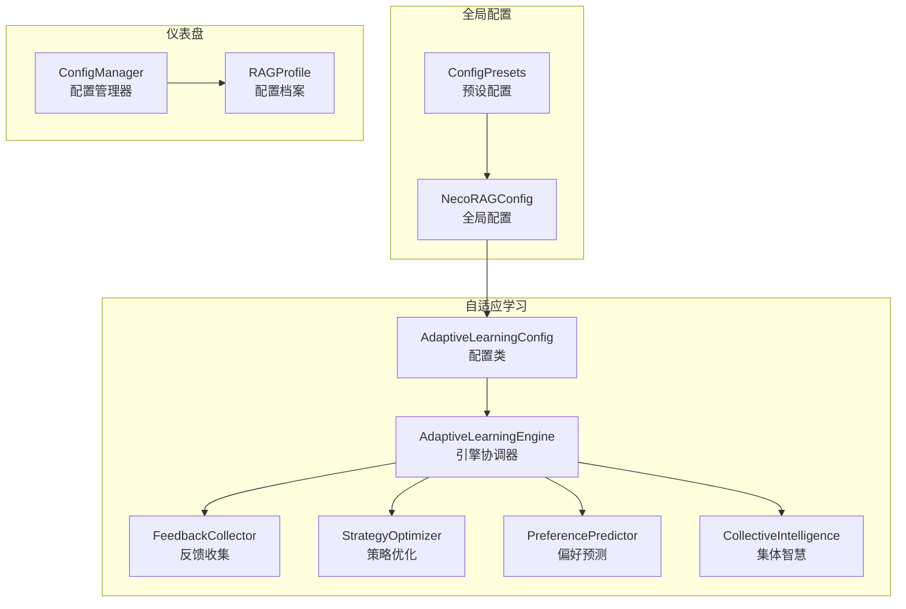
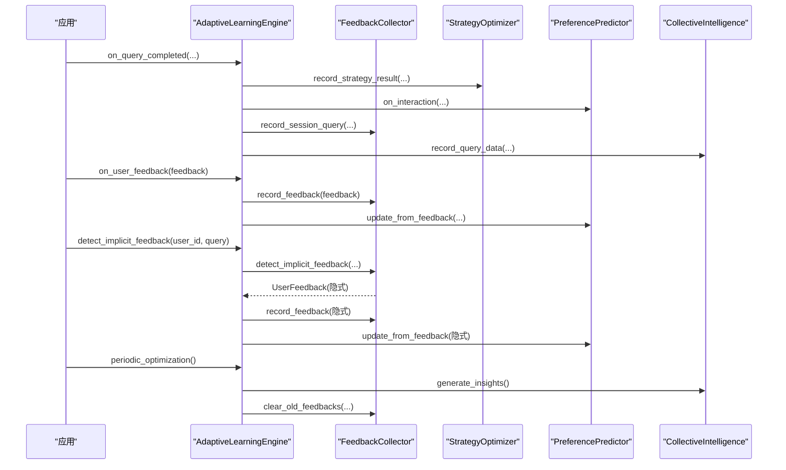
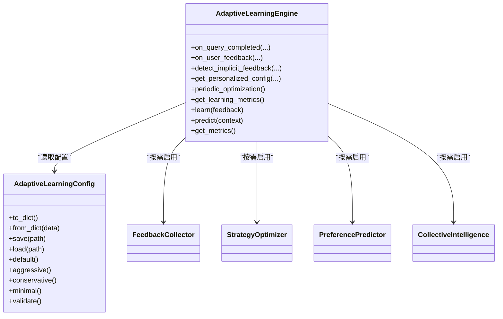

# 配置管理系统

<cite>
**本文引用的文件**
- [src/adaptive/config.py](file://src/adaptive/config.py)
- [src/adaptive/engine.py](file://src/adaptive/engine.py)
- [src/adaptive/models.py](file://src/adaptive/models.py)
- [src/adaptive/feedback.py](file://src/adaptive/feedback.py)
- [src/adaptive/strategy_optimizer.py](file://src/adaptive/strategy_optimizer.py)
- [src/adaptive/preference_predictor.py](file://src/adaptive/preference_predictor.py)
- [src/adaptive/collective.py](file://src/adaptive/collective.py)
- [src/core/config.py](file://src/core/config.py)
- [src/dashboard/config_manager.py](file://src/dashboard/config_manager.py)
- [src/dashboard/models.py](file://src/dashboard/models.py)
- [src/core/base.py](file://src/core/base.py)
- [tests/test_core/test_config.py](file://tests/test_core/test_config.py)
- [example/example_usage.py](file://example/example_usage.py)
</cite>

## 目录
1. [简介](#简介)
2. [项目结构](#项目结构)
3. [核心组件](#核心组件)
4. [架构总览](#架构总览)
5. [详细组件分析](#详细组件分析)
6. [依赖关系分析](#依赖关系分析)
7. [性能考量](#性能考量)
8. [故障排除指南](#故障排除指南)
9. [结论](#结论)
10. [附录](#附录)

## 简介
本文件面向“自适应学习配置管理系统”，围绕 AdaptiveLearningConfig 的四种预设模式（默认、积极、保守、最小）及其参数差异与适用场景，系统梳理配置的层次结构、动态调整机制、运行时修改支持、继承与覆盖规则、验证与错误处理、持久化与版本管理策略，并提供参数参考、最佳实践与故障排除建议。文档同时结合反馈收集、策略优化、偏好学习、集体学习四大子系统，给出端到端的配置使用与运维建议。

## 项目结构
自适应学习配置位于 src/adaptive 下，核心文件包括：
- 配置定义与工厂：config.py
- 引擎协调器：engine.py
- 数据模型：models.py
- 子系统实现：feedback.py、strategy_optimizer.py、preference_predictor.py、collective.py
- 全局配置与环境变量加载：core/config.py
- 仪表盘配置管理：dashboard/config_manager.py、dashboard/models.py
- 抽象基类与协议：core/base.py

图表来源
- [src/adaptive/config.py:15-200](file://src/adaptive/config.py#L15-L200)
- [src/adaptive/engine.py:30-121](file://src/adaptive/engine.py#L30-L121)
- [src/adaptive/feedback.py:19-66](file://src/adaptive/feedback.py#L19-L66)
- [src/adaptive/strategy_optimizer.py:19-76](file://src/adaptive/strategy_optimizer.py#L19-L76)
- [src/adaptive/preference_predictor.py:21-57](file://src/adaptive/preference_predictor.py#L21-L57)
- [src/adaptive/collective.py:26-60](file://src/adaptive/collective.py#L26-L60)
- [src/core/config.py:277-334](file://src/core/config.py#L277-L334)
- [src/dashboard/config_manager.py:14-41](file://src/dashboard/config_manager.py#L14-L41)
- [src/dashboard/models.py:165-220](file://src/dashboard/models.py#L165-L220)

章节来源
- [src/adaptive/config.py:15-200](file://src/adaptive/config.py#L15-L200)
- [src/adaptive/engine.py:30-121](file://src/adaptive/engine.py#L30-L121)
- [src/core/config.py:277-334](file://src/core/config.py#L277-L334)
- [src/dashboard/config_manager.py:14-41](file://src/dashboard/config_manager.py#L14-L41)

## 核心组件
- AdaptiveLearningConfig：自适应学习引擎的配置类，提供默认、积极、保守、最小四种模式的工厂方法，以及参数校验、序列化/反序列化、保存/加载能力。
- AdaptiveLearningEngine：引擎协调器，按配置启用反馈收集、策略优化、偏好预测、集体智慧四个子系统，负责学习回调、个性化配置生成、周期性优化与指标聚合。
- 子系统：
  - FeedbackCollector：显式/隐式反馈收集与分析，满意度趋势、反馈汇总、模式分析、清理旧数据。
  - StrategyOptimizer：基于 epsilon-greedy 的策略权重在线更新，按查询类型推荐参数，生成优化报告。
  - PreferencePredictor：基于交互历史预测用户偏好（详细程度、语气、兴趣领域），估计专业度，定期更新偏好。
  - CollectiveIntelligence：从全局交互中提炼知识盲区、最佳实践、趋势洞察，生成社区洞察并缓存。

章节来源
- [src/adaptive/config.py:15-200](file://src/adaptive/config.py#L15-L200)
- [src/adaptive/engine.py:30-121](file://src/adaptive/engine.py#L30-L121)
- [src/adaptive/feedback.py:19-66](file://src/adaptive/feedback.py#L19-L66)
- [src/adaptive/strategy_optimizer.py:19-76](file://src/adaptive/strategy_optimizer.py#L19-L76)
- [src/adaptive/preference_predictor.py:21-57](file://src/adaptive/preference_predictor.py#L21-L57)
- [src/adaptive/collective.py:26-60](file://src/adaptive/collective.py#L26-L60)

## 架构总览
自适应学习配置系统通过 AdaptiveLearningEngine 统一协调四大子系统，形成“反馈—偏好—策略—集体智慧”的闭环学习。引擎根据配置决定启用哪些子系统，并在查询完成、用户反馈、隐式反馈检测、周期性优化等时机触发学习与更新。

图表来源
- [src/adaptive/engine.py:122-406](file://src/adaptive/engine.py#L122-L406)
- [src/adaptive/feedback.py:39-170](file://src/adaptive/feedback.py#L39-L170)
- [src/adaptive/strategy_optimizer.py:93-154](file://src/adaptive/strategy_optimizer.py#L93-L154)
- [src/adaptive/preference_predictor.py:64-128](file://src/adaptive/preference_predictor.py#L64-L128)
- [src/adaptive/collective.py:61-92](file://src/adaptive/collective.py#L61-L92)

## 详细组件分析

### 配置模式与参数差异
- 默认模式（default）
  - 启用全部子系统：反馈收集、偏好学习、策略优化、集体学习
  - 探索率、学习速率、最小样本数等参数处于平衡值
  - 适合通用场景，兼顾稳定性与学习效率
- 积极模式（aggressive）
  - 更频繁的偏好更新、更高的学习速率、更高的探索率
  - 更少的最小样本数，加速策略收敛
  - 适合对学习速度要求高、数据量充足、可容忍波动的场景
- 保守模式（conservative）
  - 较少的偏好更新、更低的学习速率、更低的探索率
  - 更高的最小样本数，稳健但收敛较慢
  - 适合对稳定性要求高、数据噪声较大、追求长期稳定的场景
- 最小模式（minimal）
  - 禁用集体学习；可选择禁用隐式反馈
  - 仅保留核心反馈与偏好学习、策略优化能力
  - 适合资源受限或隐私敏感场景

章节来源
- [src/adaptive/config.py:86-155](file://src/adaptive/config.py#L86-L155)

### 配置层次结构与独立开关
- 反馈收集（enable_feedback_collection, implicit_feedback_enabled）
  - 控制显式反馈与隐式反馈的采集与处理
- 偏好学习（enable_preference_learning, preference_update_interval, expertise_learning_rate, satisfaction_window, max_complexity_history）
  - 控制用户画像更新频率、专业度学习速率、满意度窗口与复杂度历史长度
- 策略优化（enable_strategy_optimization, strategy_learning_rate, min_samples_for_optimization, exploration_rate, default_strategies）
  - 控制策略权重在线更新、最小样本数、探索率与默认策略集合
- 集体学习（enable_collective_learning, min_users_for_insight, insight_refresh_interval, max_insights）
  - 控制社区洞察生成的用户门槛、刷新间隔与最大数量
- 指标与交互记录（metrics_window_days, trend_comparison_ratio, max_interaction_history, interaction_retention_days）
  - 控制学习指标计算窗口、趋势比较比例与交互历史容量与保留期

章节来源
- [src/adaptive/config.py:23-59](file://src/adaptive/config.py#L23-L59)

### 动态调整机制与运行时修改
- 引擎按配置启用子系统，子系统内部根据配置参数动态调整行为
- 引擎提供 get_personalized_config，将偏好预测与策略优化结果合并，按用户专业度与查询类型微调参数
- 引擎提供 periodic_optimization，周期性生成洞察并清理旧反馈，受配置项控制
- 引擎提供 get_learning_metrics 与 get_dashboard_data，聚合反馈、策略、偏好、集体智慧指标

章节来源
- [src/adaptive/engine.py:278-447](file://src/adaptive/engine.py#L278-L447)

### 配置继承与覆盖规则
- 全局配置（NecoRAGConfig）与自适应学习配置（AdaptiveLearningConfig）分离
- 全局配置支持从文件与环境变量加载，环境变量具有更高优先级
- 自适应学习配置提供工厂方法（default/aggressive/conservative/minimal），可在引擎初始化时注入
- 仪表盘配置管理器（ConfigManager）管理 RAGProfile，支持模块级配置参数的增删改与导入导出

章节来源
- [src/core/config.py:338-377](file://src/core/config.py#L338-L377)
- [src/adaptive/engine.py:575-597](file://src/adaptive/engine.py#L575-L597)
- [src/dashboard/config_manager.py:14-41](file://src/dashboard/config_manager.py#L14-L41)
- [src/dashboard/models.py:165-220](file://src/dashboard/models.py#L165-L220)

### 配置验证与错误处理
- AdaptiveLearningConfig.validate：对探索率、学习速率、趋势比较比例、历史窗口等进行范围与数值校验，异常时抛出错误
- 子系统在启用开关关闭时直接返回或跳过处理，避免无效计算
- 引擎在 learn/predict/get_metrics 等抽象方法实现中对输入类型进行判断与容错

章节来源
- [src/adaptive/config.py:157-192](file://src/adaptive/config.py#L157-L192)
- [src/adaptive/engine.py:524-572](file://src/adaptive/engine.py#L524-L572)

### 配置持久化与版本管理
- AdaptiveLearningConfig：支持 to_dict/from_dict、save/load，便于序列化与文件存储
- NecoRAGConfig：支持 to_dict/from_dict、save/load，支持从文件加载与环境变量覆盖
- ConfigManager：支持 Profile 的创建、激活、更新、复制、导入、导出与删除，配置文件以 JSON 存储

章节来源
- [src/adaptive/config.py:61-83](file://src/adaptive/config.py#L61-L83)
- [src/core/config.py:49-76](file://src/core/config.py#L49-L76)
- [src/dashboard/config_manager.py:25-315](file://src/dashboard/config_manager.py#L25-L315)

## 依赖关系分析
- AdaptiveLearningEngine 依赖 AdaptiveLearningConfig 与四大子系统
- 四大子系统共享 AdaptiveLearningConfig 作为配置源
- 全局配置（NecoRAGConfig）与自适应学习配置（AdaptiveLearningConfig）解耦，可通过工厂注入
- 仪表盘配置管理器（ConfigManager）与 RAGProfile 与自适应学习配置相互独立，但可配合使用

图表来源
- [src/adaptive/config.py:15-200](file://src/adaptive/config.py#L15-L200)
- [src/adaptive/engine.py:30-121](file://src/adaptive/engine.py#L30-L121)
- [src/adaptive/feedback.py:19-66](file://src/adaptive/feedback.py#L19-L66)
- [src/adaptive/strategy_optimizer.py:19-76](file://src/adaptive/strategy_optimizer.py#L19-L76)
- [src/adaptive/preference_predictor.py:21-57](file://src/adaptive/preference_predictor.py#L21-L57)
- [src/adaptive/collective.py:26-60](file://src/adaptive/collective.py#L26-L60)

## 性能考量
- 子系统延迟初始化：仅在配置启用时创建，减少内存占用与启动开销
- 内存存储与容量控制：反馈历史、交互记录、洞察等均有限制，避免无限增长
- 在线学习平滑因子与权重归一化：保证策略权重稳定收敛
- 周期性优化与清理：定期生成洞察与清理旧数据，维持系统健康状态
- 建议：在高并发场景下，适当提高最小样本数与刷新间隔，降低频繁更新带来的抖动

[本节为通用指导，无需列出章节来源]

## 故障排除指南
- 配置校验失败
  - 现象：抛出参数范围或数值错误
  - 处理：检查探索率、学习速率、窗口参数是否在允许范围内；修正后重新加载
- 子系统未生效
  - 现象：偏好/策略/反馈/集体学习指标为空
  - 处理：确认对应 enable_* 开关已开启；检查引擎初始化是否传入正确配置
- 隐式反馈未检测
  - 现象：连续追问或改写未产生隐式反馈
  - 处理：确认 implicit_feedback_enabled 已开启；检查会话历史与相似度阈值
- 策略优化无提升
  - 现象：策略权重未变化或提升不明显
  - 处理：提高探索率或降低最小样本数；增加查询类型覆盖；检查奖励信号与满意度阈值
- 集体学习洞察缺失
  - 现象：洞察数量为零或刷新间隔过短
  - 处理：提高 min_users_for_insight；延长 insight_refresh_interval；确保 record_query_data 被调用

章节来源
- [src/adaptive/config.py:157-192](file://src/adaptive/config.py#L157-L192)
- [src/adaptive/feedback.py:117-170](file://src/adaptive/feedback.py#L117-L170)
- [src/adaptive/strategy_optimizer.py:212-263](file://src/adaptive/strategy_optimizer.py#L212-L263)
- [src/adaptive/collective.py:133-246](file://src/adaptive/collective.py#L133-L246)

## 结论
自适应学习配置管理系统通过清晰的配置层次、灵活的模式工厂、完善的验证与持久化机制，实现了从反馈收集到策略优化、从偏好预测到集体智慧的闭环学习。建议在生产环境中优先使用默认模式，根据业务目标与数据规模选择积极/保守模式；在资源受限或隐私敏感场景使用最小模式；通过仪表盘配置管理器与全局配置加载机制实现模块化与环境化管理。

[本节为总结性内容，无需列出章节来源]

## 附录

### 配置参数参考（AdaptiveLearningConfig）
- 反馈收集
  - enable_feedback_collection：是否启用反馈收集
  - feedback_history_size：反馈历史上限
  - implicit_feedback_enabled：是否启用隐式反馈
- 偏好学习
  - enable_preference_learning：是否启用偏好学习
  - preference_update_interval：偏好更新间隔（交互次数）
  - expertise_learning_rate：专业度学习速率
  - satisfaction_window：满意度滑动窗口
  - max_complexity_history：复杂度历史最大长度
- 策略优化
  - enable_strategy_optimization：是否启用策略优化
  - strategy_learning_rate：策略权重学习率
  - min_samples_for_optimization：最小样本数
  - exploration_rate：探索率（epsilon-greedy）
  - default_strategies：默认策略集合
- 集体学习
  - enable_collective_learning：是否启用集体学习
  - min_users_for_insight：生成洞察所需最少用户数
  - insight_refresh_interval：洞察刷新间隔（秒）
  - max_insights：最大洞察数量
- 指标与交互记录
  - metrics_window_days：指标计算窗口（天）
  - trend_comparison_ratio：趋势比较时间分割比例
  - max_interaction_history：交互记录最大数量
  - interaction_retention_days：交互记录保留天数

章节来源
- [src/adaptive/config.py:23-59](file://src/adaptive/config.py#L23-L59)

### 最佳实践建议
- 模式选择
  - 开发/测试：默认模式
  - 快速迭代：积极模式
  - 稳定生产：保守模式
  - 资源受限/隐私优先：最小模式
- 参数调优
  - 探索率与学习速率：在积极模式下适度提高，在保守模式下降低
  - 最小样本数：根据数据量与稳定性需求调整
  - 窗口与历史长度：平衡实时性与稳定性
- 运行维护
  - 定期执行 periodic_optimization，清理旧反馈
  - 监控 get_learning_metrics，关注满意度趋势与策略优化收益
  - 使用 ConfigManager 管理 RAGProfile，支持导入导出与复制

章节来源
- [src/adaptive/engine.py:374-406](file://src/adaptive/engine.py#L374-L406)
- [src/dashboard/config_manager.py:135-228](file://src/dashboard/config_manager.py#L135-L228)

### 使用示例与测试参考
- 使用示例：展示从感知层到响应层的完整流程，体现配置在各层的协同作用
- 测试用例：验证全局配置的创建、序列化/反序列化、预设配置与环境变量加载

章节来源
- [example/example_usage.py:1-252](file://example/example_usage.py#L1-L252)
- [tests/test_core/test_config.py:1-397](file://tests/test_core/test_config.py#L1-L397)