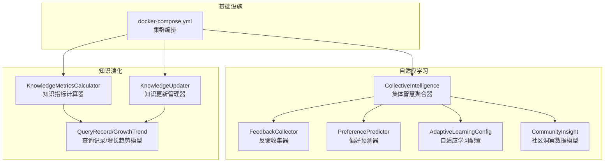
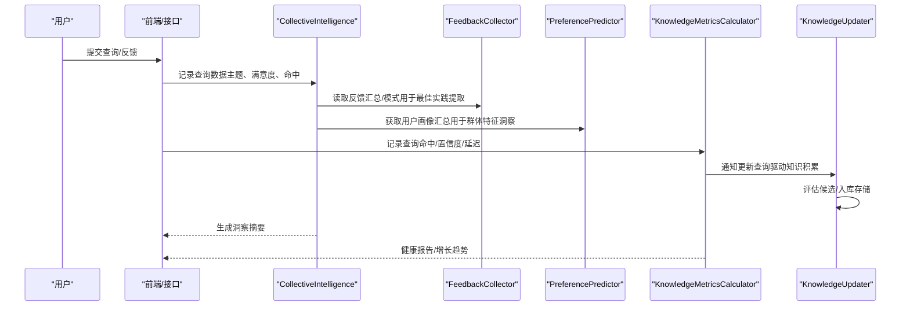
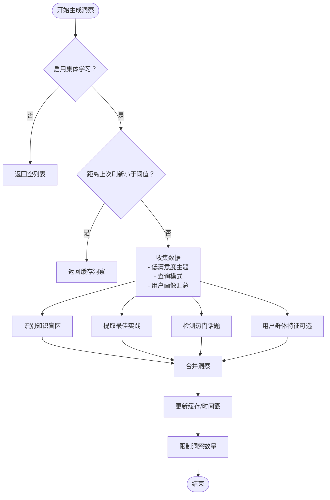
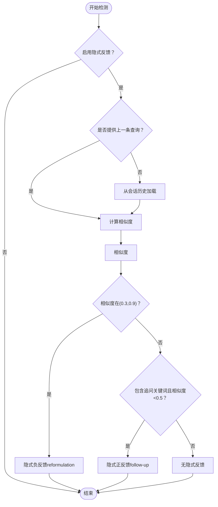
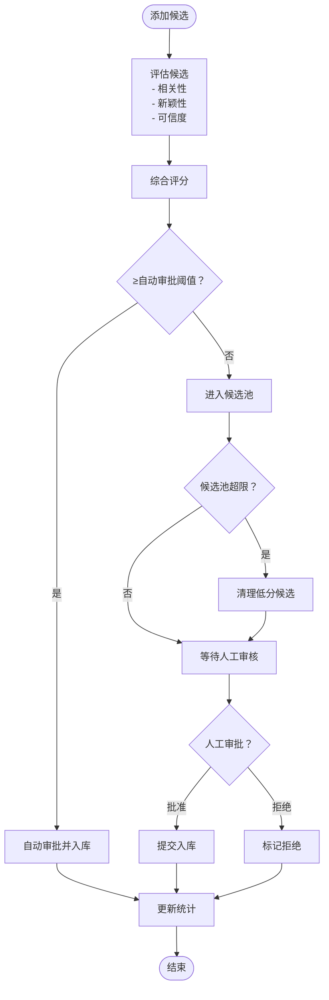
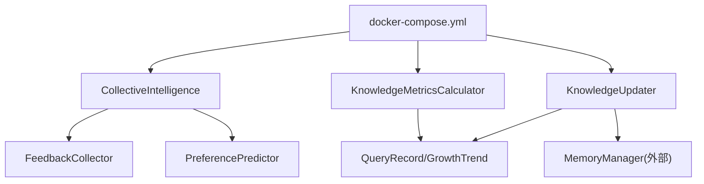

# 集体智慧系统

<cite>
**本文引用的文件**
- [collective.py](file://src/adaptive/collective.py)
- [config.py](file://src/adaptive/config.py)
- [models.py](file://src/adaptive/models.py)
- [feedback.py](file://src/adaptive/feedback.py)
- [preference_predictor.py](file://src/adaptive/preference_predictor.py)
- [metrics.py](file://src/knowledge_evolution/metrics.py)
- [models.py](file://src/knowledge_evolution/models.py)
- [updater.py](file://src/knowledge_evolution/updater.py)
- [permissions.py](file://src/user/permissions.py)
- [docker-compose.yml](file://devops/docker-compose.yml)
</cite>

## 目录
1. [简介](#简介)
2. [项目结构](#项目结构)
3. [核心组件](#核心组件)
4. [架构总览](#架构总览)
5. [详细组件分析](#详细组件分析)
6. [依赖关系分析](#依赖关系分析)
7. [性能考量](#性能考量)
8. [故障排查指南](#故障排查指南)
9. [结论](#结论)
10. [附录](#附录)

## 简介
本文件面向“集体智慧系统”，系统性阐述基于用户交互数据的分布式学习架构，涵盖以下关键能力：
- 用户反馈聚合与隐式反馈检测
- 社区洞察生成（共识检测、异常发现、趋势预测）
- 查询数据记录与去重策略
- 知识覆盖增长与社区贡献度量
- 洞察摘要生成与可视化
- 集体智慧聚合的隐私保护与数据匿名化
- 集群部署与分布式计算优化

## 项目结构
围绕“自适应学习”和“知识演化”的两条主线组织：
- 自适应学习子系统：反馈收集、偏好预测、集体智慧聚合
- 知识演化子系统：指标计算、增长趋势、更新管理、查询驱动知识积累

**图表来源**
- [collective.py:26-378](file://src/adaptive/collective.py#L26-L378)
- [feedback.py:19-398](file://src/adaptive/feedback.py#L19-L398)
- [preference_predictor.py:21-426](file://src/adaptive/preference_predictor.py#L21-L426)
- [config.py:15-200](file://src/adaptive/config.py#L15-L200)
- [models.py:162-258](file://src/adaptive/models.py#L162-L258)
- [metrics.py:21-725](file://src/knowledge_evolution/metrics.py#L21-L725)
- [models.py:312-366](file://src/knowledge_evolution/models.py#L312-L366)
- [updater.py:24-800](file://src/knowledge_evolution/updater.py#L24-L800)
- [docker-compose.yml:1-164](file://devops/docker-compose.yml#L1-L164)

**章节来源**
- [collective.py:1-378](file://src/adaptive/collective.py#L1-L378)
- [feedback.py:1-398](file://src/adaptive/feedback.py#L1-L398)
- [preference_predictor.py:1-426](file://src/adaptive/preference_predictor.py#L1-L426)
- [config.py:1-200](file://src/adaptive/config.py#L1-L200)
- [models.py:1-258](file://src/adaptive/models.py#L1-L258)
- [metrics.py:1-725](file://src/knowledge_evolution/metrics.py#L1-L725)
- [models.py:1-367](file://src/knowledge_evolution/models.py#L1-L367)
- [updater.py:1-800](file://src/knowledge_evolution/updater.py#L1-L800)
- [docker-compose.yml:1-164](file://devops/docker-compose.yml#L1-L164)

## 核心组件
- 集体智慧聚合器（CollectiveIntelligence）：从用户交互中提炼共性智慧，识别知识盲区、提取最佳实践、检测趋势，并生成社区洞察。
- 反馈收集器（FeedbackCollector）：收集显式与隐式反馈，支持满意度趋势分析与反馈模式挖掘。
- 偏好预测器（PreferencePredictor）：基于交互历史估计用户专业度与偏好，输出个性化参数。
- 知识指标计算器（KnowledgeMetricsCalculator）：持续计算知识库健康度指标，生成健康报告与增长趋势。
- 知识更新管理器（KnowledgeUpdater）：管理实时/批量更新、候选池、变更日志与查询驱动的知识积累。

**章节来源**
- [collective.py:26-378](file://src/adaptive/collective.py#L26-L378)
- [feedback.py:19-398](file://src/adaptive/feedback.py#L19-L398)
- [preference_predictor.py:21-426](file://src/adaptive/preference_predictor.py#L21-L426)
- [metrics.py:21-725](file://src/knowledge_evolution/metrics.py#L21-L725)
- [updater.py:24-800](file://src/knowledge_evolution/updater.py#L24-L800)

## 架构总览
系统采用“自适应学习 + 知识演化”的双轨架构：
- 自适应学习负责群体层面的反馈聚合与洞察生成，支撑个性化与策略优化。
- 知识演化负责知识库的健康度与增长趋势管理，支撑查询驱动的知识积累与去重。

**图表来源**
- [collective.py:61-377](file://src/adaptive/collective.py#L61-L377)
- [feedback.py:39-398](file://src/adaptive/feedback.py#L39-L398)
- [preference_predictor.py:352-426](file://src/adaptive/preference_predictor.py#L352-L426)
- [metrics.py:574-725](file://src/knowledge_evolution/metrics.py#L574-L725)
- [updater.py:697-794](file://src/knowledge_evolution/updater.py#L697-L794)

## 详细组件分析

### 集体智慧聚合器（CollectiveIntelligence）
- 功能职责
  - 记录查询数据：主题频率、低满意度主题、查询模式统计
  - 知识盲区识别：基于低满意度主题与用户数量阈值
  - 最佳实践提取：结合反馈收集器的满意度模式与常用查询模式
  - 趋势检测：按查询频率排序的热门话题
  - 洞察生成：整合盲区、最佳实践、趋势与用户群体特征
  - 洞察摘要：按类型统计与最近生成时间
  - 知识覆盖增长：基于主题数量的增长率估算

- 关键流程（洞察生成）

**图表来源**
- [collective.py:232-322](file://src/adaptive/collective.py#L232-L322)

- 关键方法路径
  - 记录查询数据：[record_query_data:61-92](file://src/adaptive/collective.py#L61-L92)
  - 知识盲区识别：[identify_common_gaps:124-153](file://src/adaptive/collective.py#L124-L153)
  - 最佳实践提取：[extract_best_practices:155-201](file://src/adaptive/collective.py#L155-L201)
  - 趋势检测：[detect_trending_topics:203-230](file://src/adaptive/collective.py#L203-L230)
  - 洞察生成：[generate_insights:232-322](file://src/adaptive/collective.py#L232-L322)
  - 洞察摘要：[get_insights_summary:333-356](file://src/adaptive/collective.py#L333-L356)
  - 知识覆盖增长：[get_knowledge_coverage_growth:358-377](file://src/adaptive/collective.py#L358-L377)

**章节来源**
- [collective.py:26-378](file://src/adaptive/collective.py#L26-L378)
- [config.py:47-51](file://src/adaptive/config.py#L47-L51)

### 反馈收集器（FeedbackCollector）
- 功能职责
  - 记录显式反馈（点赞/点踩/修正/补充/无关）
  - 检测隐式反馈（查询改写、追问、会话放弃）
  - 满意度趋势分析（前后时间段对比）
  - 反馈模式分析（查询类型满意度、小时活跃度、常见修正）

- 关键流程（隐式反馈检测）

**图表来源**
- [feedback.py:96-170](file://src/adaptive/feedback.py#L96-L170)

- 关键方法路径
  - 记录反馈：[record_feedback:39-65](file://src/adaptive/feedback.py#L39-L65)
  - 记录会话查询：[record_session_query:67-95](file://src/adaptive/feedback.py#L67-L95)
  - 隐式反馈检测：[detect_implicit_feedback:96-170](file://src/adaptive/feedback.py#L96-L170)
  - 满意度趋势：[get_satisfaction_trend:198-239](file://src/adaptive/feedback.py#L198-L239)
  - 反馈汇总：[get_feedback_summary:241-284](file://src/adaptive/feedback.py#L241-L284)
  - 反馈模式分析：[analyze_feedback_patterns:286-349](file://src/adaptive/feedback.py#L286-L349)

**章节来源**
- [feedback.py:1-398](file://src/adaptive/feedback.py#L1-L398)

### 偏好预测器（PreferencePredictor）
- 功能职责
  - 基于交互历史估计用户专业度与兴趣领域
  - 更新偏好：内容深度、语气、偏好格式
  - 从反馈中微调偏好（如“太详细/太简单/太专业/太基础”等提示词）

- 关键方法路径
  - 交互更新：[on_interaction:64-128](file://src/adaptive/preference_predictor.py#L64-L128)
  - 偏好预测：[predict_preference:174-223](file://src/adaptive/preference_predictor.py#L174-L223)
  - 反馈微调：[update_from_feedback:225-268](file://src/adaptive/preference_predictor.py#L225-L268)
  - 专家度估计：[estimate_expertise:270-299](file://src/adaptive/preference_predictor.py#L270-L299)
  - 查询复杂度估计：[estimate_query_complexity:301-338](file://src/adaptive/preference_predictor.py#L301-L338)
  - 用户画像汇总：[get_all_profiles_summary:352-401](file://src/adaptive/preference_predictor.py#L352-L401)

**章节来源**
- [preference_predictor.py:1-426](file://src/adaptive/preference_predictor.py#L1-L426)

### 知识指标计算器（KnowledgeMetricsCalculator）
- 功能职责
  - 计算知识库规模、新鲜度、质量、连通性等指标
  - 生成健康报告与维度评分
  - 记录查询统计与增长趋势

- 关键方法路径
  - 指标计算：[calculate_metrics:66-134](file://src/knowledge_evolution/metrics.py#L66-L134)
  - 健康报告：[generate_health_report:508-572](file://src/knowledge_evolution/metrics.py#L508-L572)
  - 查询记录：[record_query:574-601](file://src/knowledge_evolution/metrics.py#L574-L601)
  - 增长趋势：[get_growth_trend:637-669](file://src/knowledge_evolution/metrics.py#L637-L669)
  - 查询统计：[get_query_stats:671-702](file://src/knowledge_evolution/metrics.py#L671-L702)

**章节来源**
- [metrics.py:1-725](file://src/knowledge_evolution/metrics.py#L1-L725)
- [models.py:195-366](file://src/knowledge_evolution/models.py#L195-L366)

### 知识更新管理器（KnowledgeUpdater）
- 功能职责
  - 候选池管理：质量评估、自动/手动审批、去重清理
  - 实时/批量更新：质量阈值控制、向量索引与图谱增量更新
  - 变更日志：插入/更新/删除记录与回滚
  - 查询驱动知识积累：未命中时记录缺口、高质量回答入候选池

- 关键流程（候选评估与入库）

**图表来源**
- [updater.py:82-358](file://src/knowledge_evolution/updater.py#L82-L358)

- 关键方法路径
  - 添加候选：[add_candidate:82-131](file://src/knowledge_evolution/updater.py#L82-L131)
  - 评估候选：[evaluate_candidate:133-161](file://src/knowledge_evolution/updater.py#L133-L161)
  - 批准/拒绝：[approve_candidate:233-258](file://src/knowledge_evolution/updater.py#L233-L258)、[reject_candidate:260-284](file://src/knowledge_evolution/updater.py#L260-L284)
  - 实时更新：[realtime_update:361-405](file://src/knowledge_evolution/updater.py#L361-L405)
  - 批量更新：[execute_batch_update:442-497](file://src/knowledge_evolution/updater.py#L442-L497)
  - 查询驱动积累：[on_query_completed:697-757](file://src/knowledge_evolution/updater.py#L697-L757)

**章节来源**
- [updater.py:1-800](file://src/knowledge_evolution/updater.py#L1-L800)
- [models.py:64-192](file://src/knowledge_evolution/models.py#L64-L192)

### 查询数据记录与去重策略
- 查询记录模型
  - 字段包含：查询ID、查询文本、答案、证据列表、命中状态、延迟、置信度、用户反馈、时间戳、元数据
  - 提供to_dict序列化，便于持久化与传输

- 去重策略
  - 候选池去重：基于内容哈希前缀匹配，避免重复内容入库
  - 知识缺口去重：基于查询哈希前缀，统计出现频率与最后出现时间
  - 查询日志去重：通过限制日志大小与时间窗口控制内存占用

- 关键方法路径
  - 候选去重：[evaluate_candidate:186-205](file://src/knowledge_evolution/updater.py#L186-L205)
  - 知识缺口记录：[on_query_completed:719-757](file://src/knowledge_evolution/updater.py#L719-L757)
  - 查询记录模型：[QueryRecord:312-342](file://src/knowledge_evolution/models.py#L312-L342)

**章节来源**
- [models.py:312-342](file://src/knowledge_evolution/models.py#L312-L342)
- [updater.py:186-205](file://src/knowledge_evolution/updater.py#L186-L205)
- [updater.py:719-757](file://src/knowledge_evolution/updater.py#L719-L757)

### 洞察摘要生成与可视化
- 洞察摘要
  - 统计总数、按类型分布、最近生成时间、最近若干条洞察
  - 用于仪表盘快速概览

- 可视化展示
  - 健康报告与增长趋势：由知识演化模块提供，支持仪表盘渲染
  - 知识健康仪表盘：包含健康分数、维度评分、增长曲线、领域覆盖等

- 关键方法路径
  - 洞察摘要：[get_insights_summary:333-356](file://src/adaptive/collective.py#L333-L356)
  - 健康报告：[generate_health_report:508-572](file://src/knowledge_evolution/metrics.py#L508-L572)
  - 增长趋势：[get_growth_trend:637-669](file://src/knowledge_evolution/metrics.py#L637-L669)

**章节来源**
- [collective.py:333-356](file://src/adaptive/collective.py#L333-L356)
- [metrics.py:508-572](file://src/knowledge_evolution/metrics.py#L508-L572)
- [metrics.py:637-669](file://src/knowledge_evolution/metrics.py#L637-L669)

### 集体智慧聚合的隐私保护与数据匿名化
- 隐私保护工具类
  - 个人数据加/解密（占位实现，便于扩展）
  - 查询内容匿名化（占位实现，便于扩展）
  - 查询记录保留策略：基于时间阈值判断是否保留
  - 过期数据清理：按保留策略批量清理

- 关键方法路径
  - 加密/解密：[encrypt_personal_data:318-335](file://src/user/permissions.py#L318-L335)
  - 匿名化：[anonymize_query:338-341](file://src/user/permissions.py#L338-L341)
  - 保留策略：[should_retain_query:344-352](file://src/user/permissions.py#L344-L352)
  - 清理过期数据：[purge_expired_data:355-367](file://src/user/permissions.py#L355-L367)

**章节来源**
- [permissions.py:314-368](file://src/user/permissions.py#L314-L368)

## 依赖关系分析
- 组件耦合
  - CollectiveIntelligence依赖FeedbackCollector与PreferencePredictor以生成综合洞察
  - KnowledgeMetricsCalculator依赖KnowledgeUpdater以获取更新统计
  - KnowledgeUpdater依赖MemoryManager（外部）以执行提交与回滚

- 外部依赖
  - Redis/Qdrant/Neo4j/LLM服务通过docker-compose编排提供

**图表来源**
- [collective.py:36-53](file://src/adaptive/collective.py#L36-L53)
- [feedback.py:27-38](file://src/adaptive/feedback.py#L27-L38)
- [preference_predictor.py:48-56](file://src/adaptive/preference_predictor.py#L48-L56)
- [metrics.py:31-47](file://src/knowledge_evolution/metrics.py#L31-L47)
- [updater.py:35-63](file://src/knowledge_evolution/updater.py#L35-L63)
- [docker-compose.yml:1-164](file://devops/docker-compose.yml#L1-L164)

**章节来源**
- [collective.py:36-53](file://src/adaptive/collective.py#L36-L53)
- [feedback.py:27-38](file://src/adaptive/feedback.py#L27-L38)
- [preference_predictor.py:48-56](file://src/adaptive/preference_predictor.py#L48-L56)
- [metrics.py:31-47](file://src/knowledge_evolution/metrics.py#L31-L47)
- [updater.py:35-63](file://src/knowledge_evolution/updater.py#L35-L63)
- [docker-compose.yml:1-164](file://devops/docker-compose.yml#L1-L164)

## 性能考量
- 缓存与节流
  - 集体智慧洞察按时间间隔缓存，避免频繁计算
  - 反馈与查询日志限制大小，定期清理旧数据
- 计算复杂度
  - 洞察生成涉及排序与阈值筛选，整体为线性或接近线性
  - 指标计算按需缓存，TTL控制减少重复计算
- 存储与IO
  - 候选池与变更日志限制大小，避免内存膨胀
  - 查询驱动积累仅在命中率低或高质量回答时触发

[本节为通用指导，无需特定文件引用]

## 故障排查指南
- 集体智慧未生成洞察
  - 检查配置项enable_collective_learning与insight_refresh_interval
  - 确认最低用户数阈值min_users_for_insight是否满足
  - 参考：[config.py:47-51](file://src/adaptive/config.py#L47-L51)

- 反馈未被识别为隐式反馈
  - 检查implicit_feedback_enabled与相似度阈值
  - 确认会话历史是否正确记录
  - 参考：[feedback.py:117-170](file://src/adaptive/feedback.py#L117-L170)

- 知识库健康度偏低
  - 关注新鲜度、命中率、碎片率与冗余度指标
  - 检查更新活跃度与候选池状态
  - 参考：[metrics.py:508-572](file://src/knowledge_evolution/metrics.py#L508-L572)

- 候选池积压
  - 检查自动审批阈值与清理策略
  - 参考：[updater.py:341-357](file://src/knowledge_evolution/updater.py#L341-L357)

- 集群部署异常
  - 检查各服务健康检查与端口映射
  - 参考：[docker-compose.yml:1-164](file://devops/docker-compose.yml#L1-L164)

**章节来源**
- [config.py:47-51](file://src/adaptive/config.py#L47-L51)
- [feedback.py:117-170](file://src/adaptive/feedback.py#L117-L170)
- [metrics.py:508-572](file://src/knowledge_evolution/metrics.py#L508-L572)
- [updater.py:341-357](file://src/knowledge_evolution/updater.py#L341-L357)
- [docker-compose.yml:1-164](file://devops/docker-compose.yml#L1-L164)

## 结论
本系统通过“自适应学习 + 知识演化”的双轨架构，实现了从用户交互到社区洞察再到知识库演化的闭环：
- 集体智慧聚合器负责群体层面的共识检测、异常发现与趋势预测
- 反馈收集器与偏好预测器保障个性化与策略优化
- 知识演化模块确保知识库健康度与增长趋势的可观测性
- 集群编排提供稳定的分布式运行环境

[本节为总结性内容，无需特定文件引用]

## 附录
- 配置与预设
  - 自适应学习配置：默认/积极/保守/最小化模式
  - 参考：[config.py:86-155](file://src/adaptive/config.py#L86-L155)

- 数据模型
  - 社区洞察、用户反馈、查询记录、增长趋势等
  - 参考：[models.py:162-258](file://src/adaptive/models.py#L162-L258)、[models.py:312-366](file://src/knowledge_evolution/models.py#L312-L366)

- 集群部署
  - Redis/Qdrant/Neo4j/Ollama/Grafana统一编排
  - 参考：[docker-compose.yml:1-164](file://devops/docker-compose.yml#L1-L164)

**章节来源**
- [config.py:86-155](file://src/adaptive/config.py#L86-L155)
- [models.py:162-258](file://src/adaptive/models.py#L162-L258)
- [models.py:312-366](file://src/knowledge_evolution/models.py#L312-L366)
- [docker-compose.yml:1-164](file://devops/docker-compose.yml#L1-L164)