# 集体智慧系统

<cite>
**本文引用的文件**
- [collective.py](file://src/adaptive/collective.py)
- [models.py](file://src/adaptive/models.py)
- [config.py](file://src/adaptive/config.py)
- [engine.py](file://src/adaptive/engine.py)
- [feedback.py](file://src/adaptive/feedback.py)
- [dashboard.py](file://src/dashboard/dashboard.py)
- [models.py](file://src/dashboard/models.py)
- [PathAnalysis.html](file://src/dashboard/components/PathAnalysis.html)
- [MainConsole.html](file://src/dashboard/components/MainConsole.html)
- [permissions.py](file://src/workspace/user/permissions.py)
- [history.py](file://src/dashboard/debug/history.py)
- [api.py](file://src/dashboard/debug/api.py)
- [critic.py](file://src/refinement/critic.py)
- [validator.py](file://src/retrieval/web_search/validator.py)
- [README.md](file://src/adaptive/README.md)
</cite>

## 目录
1. [简介](#简介)
2. [项目结构](#项目结构)
3. [核心组件](#核心组件)
4. [架构总览](#架构总览)
5. [详细组件分析](#详细组件分析)
6. [依赖关系分析](#依赖关系分析)
7. [性能考量](#性能考量)
8. [故障排查指南](#故障排查指南)
9. [结论](#结论)
10. [附录](#附录)

## 简介
本文件面向“集体智慧系统”，围绕CollectiveIntelligence类的联邦学习架构与群体智能聚合机制展开，系统性阐述以下能力：
- 用户反馈共享与知识洞见生成
- 查询数据记录record_query_data的群体数据收集（查询内容聚合、主题分布统计、满意度趋势分析）
- 群体学习效果评估get_knowledge_coverage_growth（知识范围扩展、覆盖率变化、学习效率分析）
- 洞察生成generate_insights的智能分析算法（群体行为模式识别、知识传播分析、趋势预测）
- 社区洞察管理CommunityInsight的数据结构设计（洞察内容、影响范围、时效性、验证状态）
- 群体学习的隐私保护机制（差分隐私与数据匿名化策略现状说明）
- 知识洞见的可视化展示与交互分析（仪表板与前端组件）
- 群体智能的质量评估与可信度分析机制
- 跨用户的学习迁移与知识共享策略
- 集体智慧与个人学习的协同优化机制

## 项目结构
本系统位于src/adaptive目录，核心模块包括：
- CollectiveIntelligence：联邦式群体智能聚合器
- AdaptiveLearningEngine：统一协调器，整合反馈收集、偏好预测、策略优化与集体智慧
- 数据模型与配置：UserFeedback、CommunityInsight、AdaptiveLearningConfig等
- Dashboard与前端组件：提供可视化展示与交互分析
- 隐私保护与质量评估：权限与隐私工具类、可信度与质量评估组件

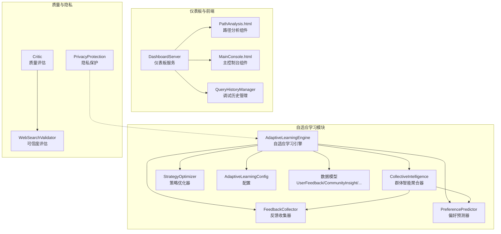

**图表来源**
- [engine.py:30-121](file://src/adaptive/engine.py#L30-L121)
- [collective.py:26-60](file://src/adaptive/collective.py#L26-L60)
- [feedback.py:19-38](file://src/adaptive/feedback.py#L19-L38)
- [dashboard.py:10-26](file://src/dashboard/dashboard.py#L10-L26)
- [PathAnalysis.html:1-936](file://src/dashboard/components/PathAnalysis.html#L1-L936)
- [MainConsole.html:636-665](file://src/dashboard/components/MainConsole.html#L636-L665)
- [critic.py:274-308](file://src/refinement/critic.py#L274-L308)
- [validator.py:172-221](file://src/retrieval/web_search/validator.py#L172-L221)
- [permissions.py:314-356](file://src/workspace/user/permissions.py#L314-L356)

**章节来源**
- [engine.py:30-121](file://src/adaptive/engine.py#L30-L121)
- [collective.py:26-60](file://src/adaptive/collective.py#L26-L60)
- [feedback.py:19-38](file://src/adaptive/feedback.py#L19-L38)
- [dashboard.py:10-26](file://src/dashboard/dashboard.py#L10-L26)
- [models.py:1-232](file://src/dashboard/models.py#L1-L232)
- [PathAnalysis.html:1-936](file://src/dashboard/components/PathAnalysis.html#L1-L936)
- [MainConsole.html:636-665](file://src/dashboard/components/MainConsole.html#L636-L665)
- [critic.py:274-308](file://src/refinement/critic.py#L274-L308)
- [validator.py:172-221](file://src/retrieval/web_search/validator.py#L172-L221)
- [permissions.py:314-356](file://src/workspace/user/permissions.py#L314-L356)

## 核心组件
- CollectiveIntelligence：负责群体数据收集、洞察生成、覆盖率评估与缓存控制
- AdaptiveLearningEngine：统一协调反馈收集、偏好预测、策略优化与集体智慧，并提供仪表板数据聚合
- 数据模型：UserFeedback、CommunityInsight、AdaptiveLearningMetrics等
- 配置：AdaptiveLearningConfig，控制开关与阈值
- Dashboard与前端：PathAnalysis、MainConsole等组件，提供可视化与交互
- 质量与隐私：Critic、WebSearchValidator、PrivacyProtection等

**章节来源**
- [collective.py:26-60](file://src/adaptive/collective.py#L26-L60)
- [engine.py:30-121](file://src/adaptive/engine.py#L30-L121)
- [models.py:162-189](file://src/adaptive/models.py#L162-L189)
- [config.py:15-60](file://src/adaptive/config.py#L15-L60)
- [dashboard.py:10-26](file://src/dashboard/dashboard.py#L10-L26)

## 架构总览
自适应学习引擎以CollectiveIntelligence为核心，结合反馈收集、偏好预测与策略优化，形成“即时适应—短期优化—长期进化”的三层学习架构。引擎在查询完成后记录交互数据，驱动各子系统学习；周期性执行优化，生成洞察并更新仪表板。

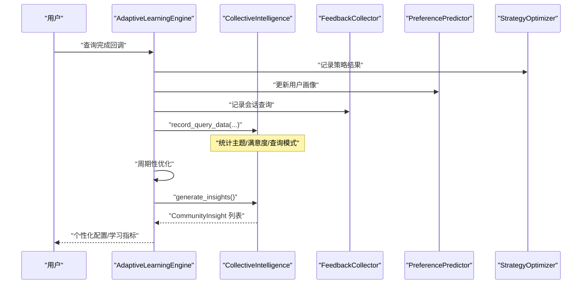

**图表来源**
- [engine.py:122-196](file://src/adaptive/engine.py#L122-L196)
- [engine.py:374-406](file://src/adaptive/engine.py#L374-L406)
- [collective.py:61-123](file://src/adaptive/collective.py#L61-L123)

**章节来源**
- [engine.py:122-196](file://src/adaptive/engine.py#L122-L196)
- [engine.py:374-406](file://src/adaptive/engine.py#L374-L406)
- [README.md:20-62](file://src/adaptive/README.md#L20-L62)

## 详细组件分析

### CollectiveIntelligence：联邦式群体智能聚合器
- 群体数据收集
  - record_query_data：聚合主题频率、低满意度主题集合、查询模式（关键词模式提取）
  - 内部统计字段：主题计数、低满意度主题序列、查询模式计数
- 知识盲区识别
  - identify_common_gaps：基于低满意度主题与用户数阈值，识别高/中严重程度的知识盲区
- 最佳实践提取
  - extract_best_practices：结合反馈收集器的查询类型满意度与群体常用模式
- 趋势检测
  - detect_trending_topics：按主题查询频次排序，识别上升/稳定趋势
- 洞察生成
  - generate_insights：按缓存策略与配置阈值生成知识盲区、最佳实践、趋势与用户画像洞察
  - get_insights/get_insights_summary：提供洞察列表与汇总
- 学习效果评估
  - get_knowledge_coverage_growth：基于主题数量的增长率（主题基数与阈值控制）

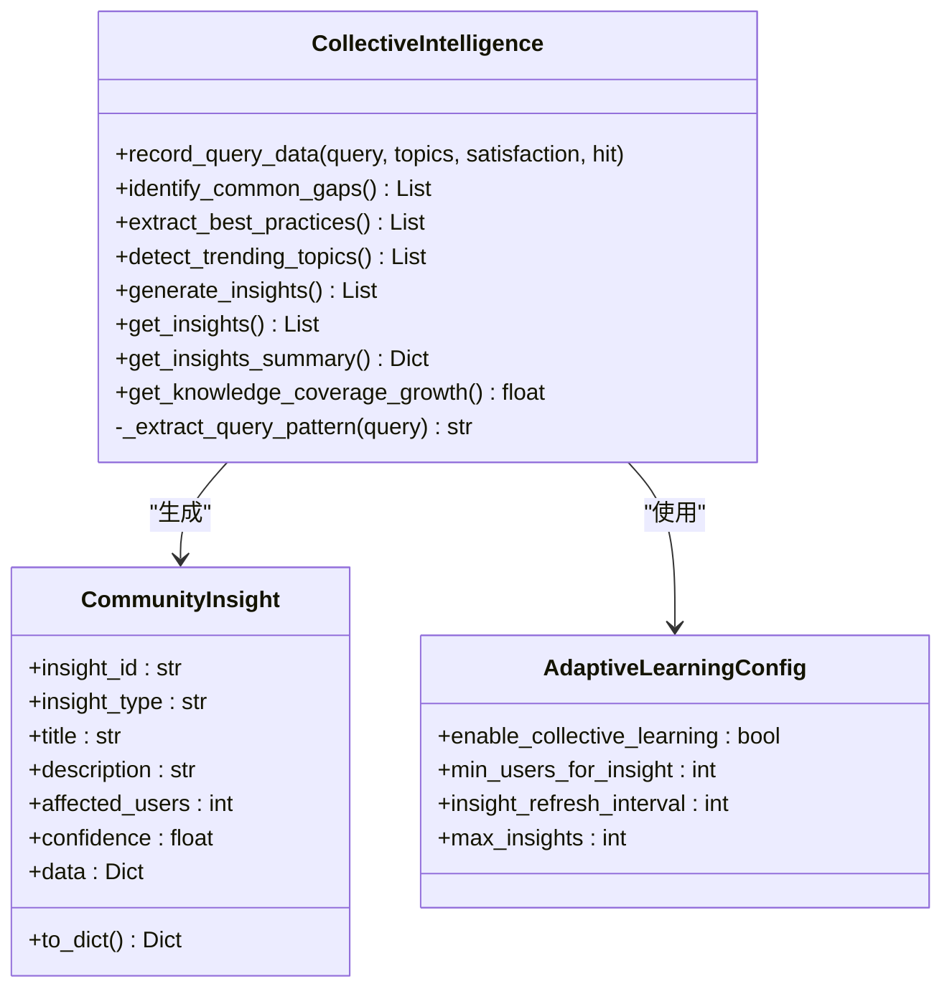

**图表来源**
- [collective.py:26-378](file://src/adaptive/collective.py#L26-L378)
- [models.py:162-189](file://src/adaptive/models.py#L162-L189)
- [config.py:47-51](file://src/adaptive/config.py#L47-L51)

**章节来源**
- [collective.py:61-123](file://src/adaptive/collective.py#L61-L123)
- [collective.py:124-201](file://src/adaptive/collective.py#L124-L201)
- [collective.py:203-230](file://src/adaptive/collective.py#L203-L230)
- [collective.py:232-322](file://src/adaptive/collective.py#L232-L322)
- [collective.py:324-356](file://src/adaptive/collective.py#L324-L356)
- [collective.py:358-377](file://src/adaptive/collective.py#L358-L377)

### AdaptiveLearningEngine：统一协调器
- 子系统初始化：根据配置延迟初始化反馈收集、策略优化、偏好预测与集体智慧
- 查询完成学习：记录策略结果、更新偏好、记录会话查询、记录群体数据
- 用户反馈处理：显式/隐式反馈，更新偏好与策略
- 个性化配置：综合用户偏好与最优策略，返回推荐参数
- 学习指标：满意度趋势、策略优化收益、个性化准确度、知识覆盖增长
- 周期性优化：生成洞察、清理旧反馈
- 仪表板数据：聚合指标、反馈汇总、策略表现、用户画像、社区洞察

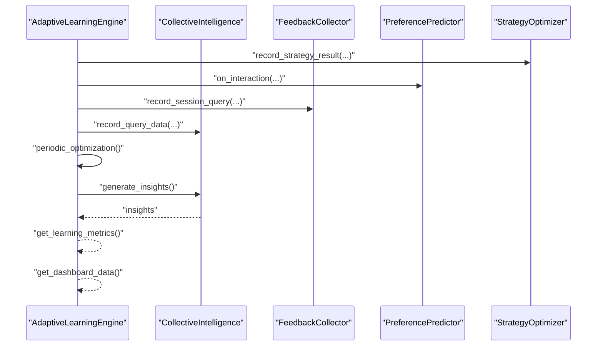

**图表来源**
- [engine.py:122-196](file://src/adaptive/engine.py#L122-L196)
- [engine.py:374-406](file://src/adaptive/engine.py#L374-L406)
- [engine.py:339-372](file://src/adaptive/engine.py#L339-L372)
- [engine.py:408-447](file://src/adaptive/engine.py#L408-L447)

**章节来源**
- [engine.py:84-101](file://src/adaptive/engine.py#L84-L101)
- [engine.py:122-196](file://src/adaptive/engine.py#L122-L196)
- [engine.py:198-244](file://src/adaptive/engine.py#L198-L244)
- [engine.py:278-337](file://src/adaptive/engine.py#L278-L337)
- [engine.py:339-372](file://src/adaptive/engine.py#L339-L372)
- [engine.py:374-406](file://src/adaptive/engine.py#L374-L406)
- [engine.py:408-447](file://src/adaptive/engine.py#L408-L447)

### 查询数据记录与群体数据收集
- record_query_data：更新主题频率与低满意度主题序列，提取查询模式（关键词模式）
- 查询追踪与统计：QueryTracker/QueryHistoryManager支持查询生命周期管理与统计
- 反馈收集：FeedbackCollector记录显式/隐式反馈，支持满意度趋势与模式分析

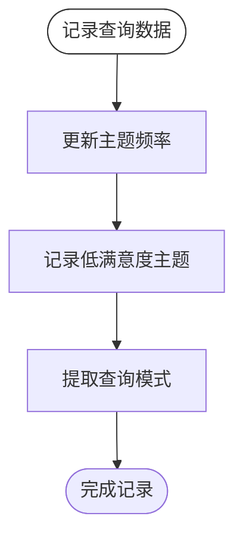

**图表来源**
- [collective.py:61-123](file://src/adaptive/collective.py#L61-L123)

**章节来源**
- [collective.py:61-123](file://src/adaptive/collective.py#L61-L123)
- [feedback.py:39-65](file://src/adaptive/feedback.py#L39-L65)
- [history.py:140-159](file://src/dashboard/debug/history.py#L140-L159)
- [history.py:266-325](file://src/dashboard/debug/history.py#L266-L325)

### 知识覆盖增长评估
- get_knowledge_coverage_growth：基于主题数量的增长率计算，设定基准与阈值，限制范围在[0,1]

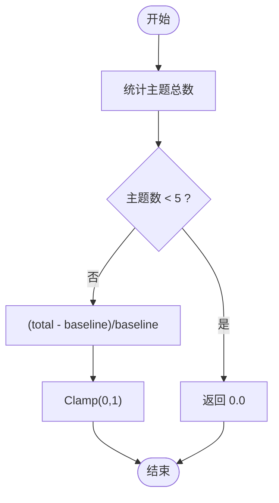

**图表来源**
- [collective.py:358-377](file://src/adaptive/collective.py#L358-L377)

**章节来源**
- [collective.py:358-377](file://src/adaptive/collective.py#L358-L377)

### 洞察生成与智能分析算法
- 知识盲区洞察：识别低满意度主题，按严重程度与影响范围排序
- 最佳实践洞察：结合反馈满意度与群体常用模式
- 趋势洞察：按主题查询频次识别上升/稳定趋势
- 用户画像洞察：偏好预测器提供的用户群体特征（如专业度分布）

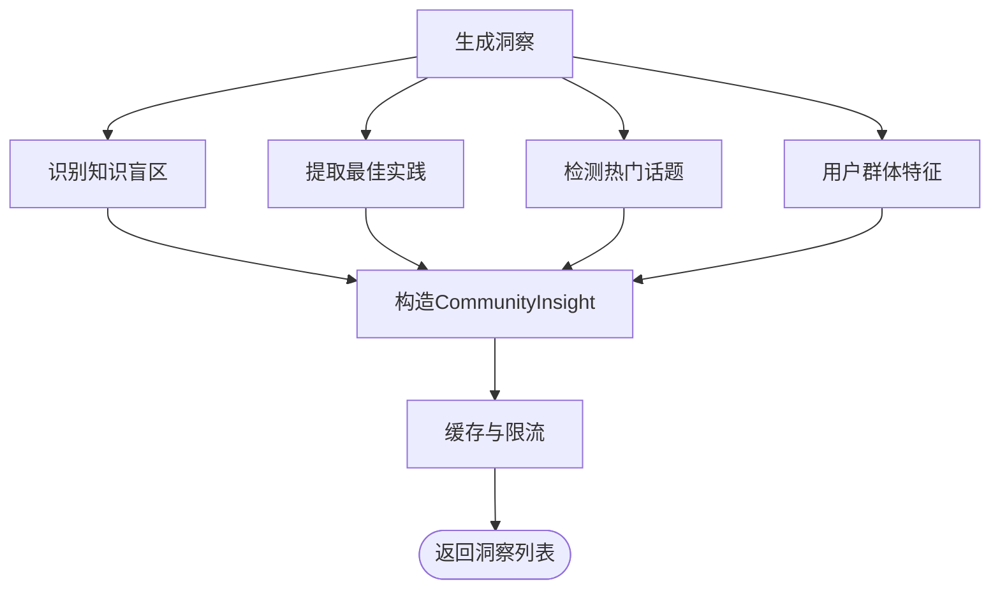

**图表来源**
- [collective.py:232-322](file://src/adaptive/collective.py#L232-L322)
- [models.py:162-189](file://src/adaptive/models.py#L162-L189)

**章节来源**
- [collective.py:232-322](file://src/adaptive/collective.py#L232-L322)
- [models.py:162-189](file://src/adaptive/models.py#L162-L189)

### 社区洞察数据结构设计
- CommunityInsight：包含洞察ID、类型、标题、描述、影响人数、置信度、原始数据与创建时间
- to_dict：序列化为字典，便于仪表板与API传输

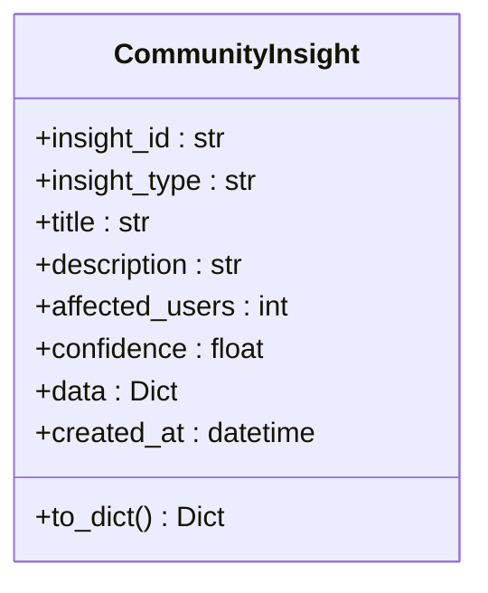

**图表来源**
- [models.py:162-189](file://src/adaptive/models.py#L162-L189)

**章节来源**
- [models.py:162-189](file://src/adaptive/models.py#L162-L189)

### 隐私保护机制
- 隐私保护工具类：提供数据加密/解密、查询匿名化、保留期限判断与过期数据清理占位实现
- 建议：在实际部署中实现AES-256加密、敏感信息检测与替换、最小化数据保留策略

**章节来源**
- [permissions.py:314-356](file://src/workspace/user/permissions.py#L314-L356)

### 可视化展示与交互分析
- DashboardServer：启动仪表板服务
- PathAnalysis.html：路径分析工具，支持结果渲染与通知提示
- MainConsole.html：主控制台，支持视图切换与统计更新
- QueryHistoryManager：查询历史管理与统计

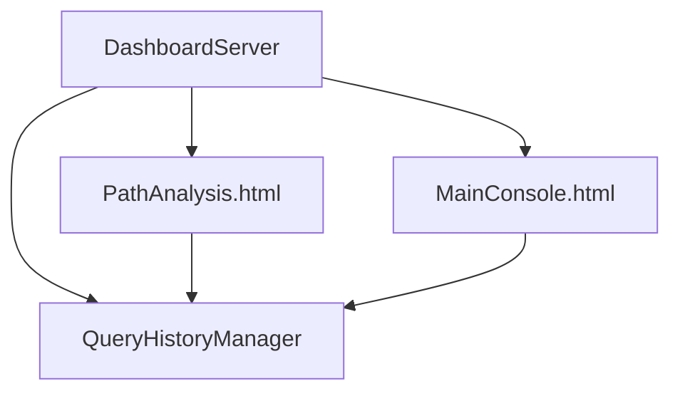

**图表来源**
- [dashboard.py:10-26](file://src/dashboard/dashboard.py#L10-L26)
- [PathAnalysis.html:1-936](file://src/dashboard/components/PathAnalysis.html#L1-L936)
- [MainConsole.html:636-665](file://src/dashboard/components/MainConsole.html#L636-L665)
- [history.py:140-159](file://src/dashboard/debug/history.py#L140-L159)

**章节来源**
- [dashboard.py:10-26](file://src/dashboard/dashboard.py#L10-L26)
- [PathAnalysis.html:1-936](file://src/dashboard/components/PathAnalysis.html#L1-L936)
- [MainConsole.html:636-665](file://src/dashboard/components/MainConsole.html#L636-L665)
- [history.py:140-159](file://src/dashboard/debug/history.py#L140-L159)

### 群体智能质量评估与可信度分析
- 质量评估：Critic基于事实性、完整性、相关性加权计算质量分数
- 可信度评估：WebSearchValidator基于域名可信度、HTTPS、内容质量等指标评估结果可信度
- 仪表板：DashboardStats提供查询历史与性能指标

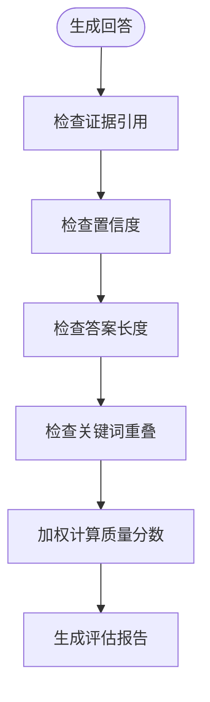

**图表来源**
- [critic.py:274-308](file://src/refinement/critic.py#L274-L308)

**章节来源**
- [critic.py:274-308](file://src/refinement/critic.py#L274-L308)
- [validator.py:172-221](file://src/retrieval/web_search/validator.py#L172-L221)
- [models.py:222-232](file://src/dashboard/models.py#L222-L232)

### 跨用户学习迁移与知识共享策略
- 团队知识流动：用户与团队管理模块提供知识分享、同步与镜像的接口占位
- 建议：实现基于主题/查询模式的跨用户偏好迁移、策略权重共享与增量联邦聚合

**章节来源**
- [manager.py:364-421](file://src/workspace/user/manager.py#L364-L421)
- [manager.py:364-421](file://src/workspace/team/legacy_user/manager.py#L364-L421)

### 集体智慧与个人学习协同优化
- AdaptiveLearningEngine综合用户偏好与最优策略，动态调整参数（如top_k、置信度阈值）
- 周期性洞察生成与反馈清理，维持群体学习的可持续性

**章节来源**
- [engine.py:278-337](file://src/adaptive/engine.py#L278-L337)
- [engine.py:374-406](file://src/adaptive/engine.py#L374-L406)

## 依赖关系分析
- CollectiveIntelligence依赖AdaptiveLearningConfig与CommunityInsight
- AdaptiveLearningEngine协调FeedbackCollector、PreferencePredictor、StrategyOptimizer与CollectiveIntelligence
- Dashboard组件依赖QueryHistoryManager与数据模型
- 质量与隐私组件独立存在，为系统提供评估与保护能力

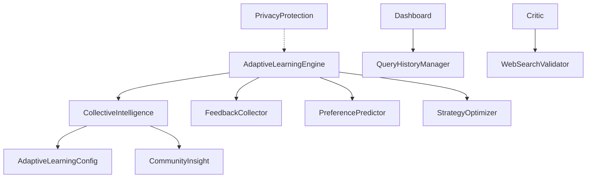

**图表来源**
- [collective.py:26-60](file://src/adaptive/collective.py#L26-L60)
- [engine.py:84-101](file://src/adaptive/engine.py#L84-L101)
- [dashboard.py:10-26](file://src/dashboard/dashboard.py#L10-L26)
- [critic.py:274-308](file://src/refinement/critic.py#L274-L308)
- [validator.py:172-221](file://src/retrieval/web_search/validator.py#L172-L221)
- [permissions.py:314-356](file://src/workspace/user/permissions.py#L314-L356)

**章节来源**
- [collective.py:26-60](file://src/adaptive/collective.py#L26-L60)
- [engine.py:84-101](file://src/adaptive/engine.py#L84-L101)
- [dashboard.py:10-26](file://src/dashboard/dashboard.py#L10-L26)

## 性能考量
- 缓存与限流：洞察生成采用时间间隔缓存与最大洞察数量限制，避免重复计算与内存膨胀
- 数据结构：使用defaultdict与有序统计，保证主题与模式统计的高效性
- 配置化：通过AdaptiveLearningConfig控制采样窗口、阈值与刷新间隔，平衡准确性与性能
- 建议：对大规模主题/模式统计引入分桶或采样策略，减少峰值开销

[本节为通用指导，无需引用具体文件]

## 故障排查指南
- 洞察为空：确认enable_collective_learning开关与insight_refresh_interval设置
- 满意度趋势异常：检查反馈收集器的历史窗口与评分分布
- 查询追踪异常：核对QueryTracker/QueryHistoryManager的锁与持久化逻辑
- 隐私策略未生效：确认隐私保护工具类的实际实现与密钥管理

**章节来源**
- [config.py:47-51](file://src/adaptive/config.py#L47-L51)
- [engine.py:245-277](file://src/adaptive/engine.py#L245-L277)
- [history.py:140-159](file://src/dashboard/debug/history.py#L140-L159)
- [permissions.py:314-356](file://src/workspace/user/permissions.py#L314-L356)

## 结论
集体智慧系统通过CollectiveIntelligence实现联邦式群体智能聚合，结合AdaptiveLearningEngine的统一协调，形成从即时适应到长期进化的完整学习闭环。系统具备完善的可视化与质量评估能力，并在隐私保护方面预留了扩展接口。建议在生产环境中完善差分隐私与数据匿名化实现，强化跨用户学习迁移与知识共享策略，持续提升群体学习的效率与可信度。

[本节为总结性内容，无需引用具体文件]

## 附录
- 使用示例与API参考详见自适应模块README
- 仪表板组件与数据模型参见对应文件

**章节来源**
- [README.md:577-622](file://src/adaptive/README.md#L577-L622)
- [models.py:1-232](file://src/dashboard/models.py#L1-L232)