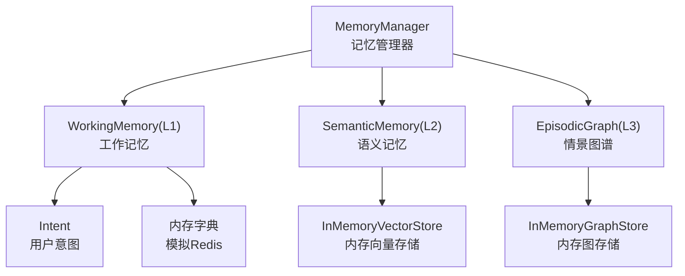
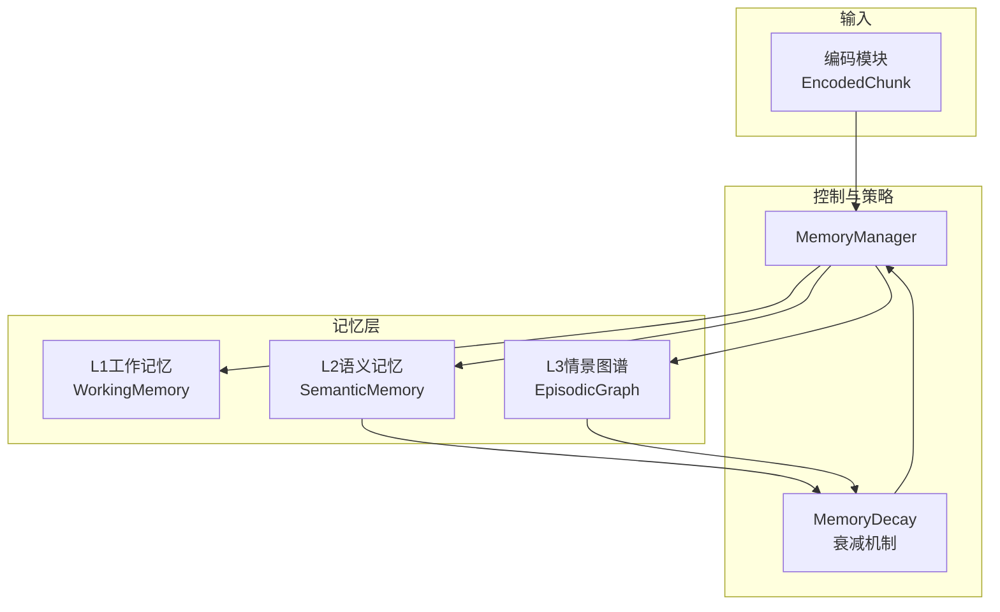
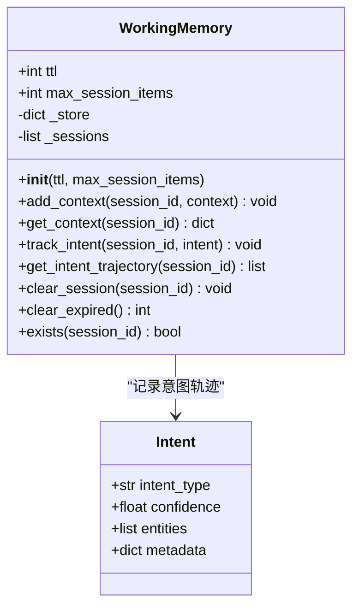
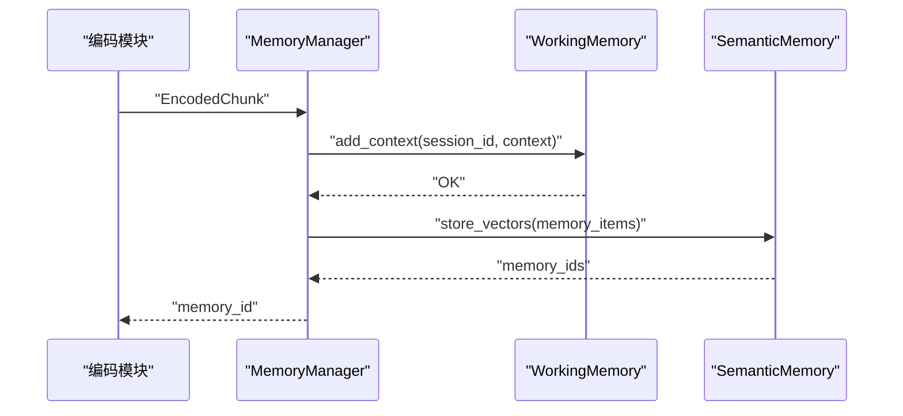
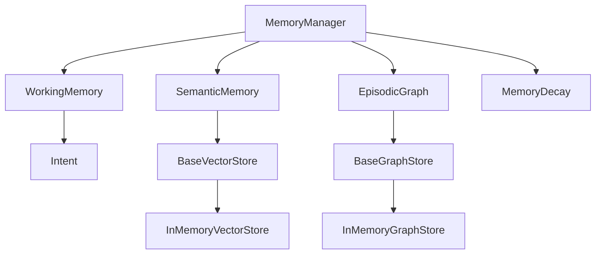

# L1工作记忆（Redis）

<cite>
**本文引用的文件**
- [src/memory/working_memory.py](file://src/memory/working_memory.py)
- [src/memory/manager.py](file://src/memory/manager.py)
- [src/memory/models.py](file://src/memory/models.py)
- [src/memory/README.md](file://src/memory/README.md)
- [src/dashboard/static/index.html](file://src/dashboard/static/index.html)
- [src/memory/backends/base.py](file://src/memory/backends/base.py)
- [src/memory/backends/memory_store.py](file://src/memory/backends/memory_store.py)
- [src/memory/semantic_memory.py](file://src/memory/semantic_memory.py)
- [src/memory/episodic_graph.py](file://src/memory/episodic_graph.py)
- [src/memory/decay.py](file://src/memory/decay.py)
</cite>

## 目录
1. [简介](#简介)
2. [项目结构](#项目结构)
3. [核心组件](#核心组件)
4. [架构概览](#架构概览)
5. [详细组件分析](#详细组件分析)
6. [依赖分析](#依赖分析)
7. [性能考虑](#性能考虑)
8. [故障排除指南](#故障排除指南)
9. [结论](#结论)
10. [附录](#附录)

## 简介
本文件聚焦于L1工作记忆模块，系统阐述其作为短期记忆的实现原理与工程实践。工作记忆承担“当前会话上下文”和“用户意图轨迹”的高频读写需求，强调极低延迟访问、TTL自动过期与模拟瞬时遗忘能力。在当前代码库中，工作记忆以最小实现形式使用内存字典模拟Redis行为；同时，文档提供了对接真实Redis存储后端的配置思路、数据结构设计、访问模式与缓存策略，并给出性能优化与故障排除建议。

## 项目结构
围绕L1工作记忆的相关文件组织如下：
- 记忆管理层：统一编排L1/L2/L3三层记忆，负责数据流与生命周期管理
- L1工作记忆：提供会话上下文与意图轨迹的临时存储
- 数据模型：定义记忆项、意图等基础数据结构
- 后端抽象与内存实现：为向量与图存储提供抽象接口与内存实现，便于理解整体存储体系
- 配置与文档：包含使用示例、参数说明与性能指标

图表来源
- [src/memory/manager.py:16-47](file://src/memory/manager.py#L16-L47)
- [src/memory/working_memory.py:11-35](file://src/memory/working_memory.py#L11-L35)
- [src/memory/models.py:61-67](file://src/memory/models.py#L61-L67)
- [src/memory/backends/memory_store.py:20-141](file://src/memory/backends/memory_store.py#L20-L141)
- [src/memory/backends/memory_store.py:143-381](file://src/memory/backends/memory_store.py#L143-L381)

章节来源
- [src/memory/README.md:1-61](file://src/memory/README.md#L1-L61)
- [src/memory/manager.py:16-47](file://src/memory/manager.py#L16-L47)

## 核心组件
- WorkingMemory（L1工作记忆）：提供add_context/get_context、track_intent/get_intent_trajectory、clear_session/exists等接口，内部以内存字典模拟Redis行为，具备TTL与LRU淘汰预留位点。
- MemoryManager（记忆管理器）：统一管理三层记忆，负责新知识入库、跨层检索、记忆巩固与主动遗忘。
- 数据模型：MemoryItem、Intent等，支撑工作记忆与上层检索融合。
- 后端抽象：BaseVectorStore/BaseGraphStore及其内存实现，帮助理解整体存储架构。

章节来源
- [src/memory/working_memory.py:11-120](file://src/memory/working_memory.py#L11-L120)
- [src/memory/manager.py:16-47](file://src/memory/manager.py#L16-L47)
- [src/memory/models.py:19-67](file://src/memory/models.py#L19-L67)
- [src/memory/backends/base.py:54-297](file://src/memory/backends/base.py#L54-L297)
- [src/memory/backends/memory_store.py:20-381](file://src/memory/backends/memory_store.py#L20-L381)

## 架构概览
L1工作记忆在整体记忆体系中的定位与交互如下：
- 输入：感知模块编码后的文本块（包含向量、实体、标签等），由记忆管理器驱动进入三层记忆。
- L1工作记忆：承接当前会话上下文与用户意图轨迹，支持高频读取与TTL过期。
- L2语义记忆：持久化高维向量，支持向量检索与混合检索。
- L3情景图谱：构建实体关系网络，支持多跳推理与因果链条追踪。
- 记忆衰减：通过权重衰减与强化机制，动态调整知识保留策略。

图表来源
- [src/memory/README.md:179-192](file://src/memory/README.md#L179-L192)
- [src/memory/manager.py:48-112](file://src/memory/manager.py#L48-L112)
- [src/memory/semantic_memory.py:50-78](file://src/memory/semantic_memory.py#L50-L78)
- [src/memory/episodic_graph.py:33-70](file://src/memory/episodic_graph.py#L33-L70)
- [src/memory/decay.py:11-22](file://src/memory/decay.py#L11-L22)

## 详细组件分析

### L1工作记忆类设计与职责
- 存储内容：当前会话上下文、用户意图轨迹
- 特性：极低延迟访问、TTL自动过期、LRU淘汰策略预留、模拟瞬时遗忘
- 关键接口：
  - add_context/session_id, context：合并并更新会话上下文，记录最近更新时间
  - get_context/session_id：获取会话上下文
  - track_intent/session_id, intent：记录用户意图轨迹
  - get_intent_trajectory/session_id：获取意图列表
  - clear_session/session_id：清除会话数据（模拟遗忘）
  - clear_expired()：清理过期数据（当前最小实现返回0）
  - exists/session_id：检查会话是否存在

图表来源
- [src/memory/working_memory.py:11-120](file://src/memory/working_memory.py#L11-L120)
- [src/memory/models.py:61-67](file://src/memory/models.py#L61-L67)

章节来源
- [src/memory/working_memory.py:11-120](file://src/memory/working_memory.py#L11-L120)
- [src/memory/models.py:61-67](file://src/memory/models.py#L61-L67)

### 数据结构与存储策略
- 会话上下文存储：以session_id为键，值为字典，包含任意上下文字段与_last_update时间戳
- 意图轨迹存储：以session_id为键，值为Intent对象列表
- TTL与过期：当前实现未实际执行TTL过期检测，预留位点为后续接入Redis TTL提供扩展空间
- LRU淘汰：当前实现未实现LRU，预留max_session_items上限，后续可结合Redis的maxmemory策略实现

章节来源
- [src/memory/working_memory.py:22-48](file://src/memory/working_memory.py#L22-L48)
- [src/memory/working_memory.py:62-85](file://src/memory/working_memory.py#L62-L85)

### 访问模式与使用场景
- 高频读写：会话上下文与意图轨迹的频繁更新与读取，要求极低延迟
- 临时存储：会话生命周期内的数据，会话结束后自动清除
- 意图追踪：记录用户在一次对话中的意图变化，辅助生成个性化响应

章节来源
- [src/memory/README.md:41-46](file://src/memory/README.md#L41-L46)
- [src/memory/working_memory.py:36-85](file://src/memory/working_memory.py#L36-L85)

### 对接Redis存储后端的配置与实现要点
- 连接配置
  - redis_url：Redis连接URL，如redis://localhost:6379
  - TTL设置：通过EX参数设置键的过期时间
  - LRU策略：通过maxmemory与maxmemory-policy配置实现
- 数据序列化
  - 上下文字典：建议使用JSON序列化，确保复杂嵌套结构可持久化
  - 意图列表：建议序列化为JSON数组，便于跨语言/进程读取
- 缓存策略
  - 会话键命名：采用统一前缀与session_id组合，避免键冲突
  - 批量操作：利用mset/mget提升批量写入/读取效率
  - 过期清理：结合Redis过期事件或定期任务清理过期键

章节来源
- [src/memory/README.md:196-201](file://src/memory/README.md#L196-L201)
- [src/memory/manager.py:23-43](file://src/memory/manager.py#L23-L43)

### 与记忆管理器的协作流程

图表来源
- [src/memory/manager.py:48-112](file://src/memory/manager.py#L48-L112)
- [src/memory/working_memory.py:36-48](file://src/memory/working_memory.py#L36-L48)
- [src/memory/semantic_memory.py:50-78](file://src/memory/semantic_memory.py#L50-L78)

## 依赖分析
- WorkingMemory依赖MemoryItem与Intent数据模型
- MemoryManager统一编排L1/L2/L3三层记忆，依赖MemoryDecay进行权重衰减
- 向量与图存储采用抽象接口与内存实现，便于替换为真实数据库后端

图表来源
- [src/memory/working_memory.py:6-8](file://src/memory/working_memory.py#L6-L8)
- [src/memory/manager.py:8-12](file://src/memory/manager.py#L8-L12)
- [src/memory/backends/base.py:54-297](file://src/memory/backends/base.py#L54-L297)
- [src/memory/backends/memory_store.py:20-381](file://src/memory/backends/memory_store.py#L20-L381)

章节来源
- [src/memory/models.py:19-67](file://src/memory/models.py#L19-L67)
- [src/memory/manager.py:16-47](file://src/memory/manager.py#L16-L47)
- [src/memory/backends/base.py:54-297](file://src/memory/backends/base.py#L54-L297)

## 性能考虑
- 延迟目标
  - L1写入延迟：<5ms；读取延迟：<2ms
  - L2向量检索延迟：<100ms；L3图谱查询延迟：<500ms
- 内存占用
  - L1容量：约10万条；L2容量可达千万级；L3可达亿级节点
- 优化建议
  - L1
    - 使用Redis集群与主从复制，提升可用性与吞吐
    - 合理设置maxmemory与淘汰策略，避免内存溢出
    - 对热点键使用内存优化（如hotkey检测与本地缓存）
  - 序列化
    - 优先使用紧凑格式（如msgpack或JSON）减少序列化开销
    - 对大字段采用压缩存储（如gzip/snappy）
  - 批处理
    - 批量写入/读取，降低网络往返
    - 使用流水线（pipeline）减少RTT
  - 过期与清理
    - 启用Redis过期事件，异步清理过期键
    - 定期扫描与LRU清理，维持内存健康

章节来源
- [src/memory/README.md:223-229](file://src/memory/README.md#L223-L229)
- [src/memory/README.md:196-201](file://src/memory/README.md#L196-L201)

## 故障排除指南
- 现象：会话上下文无法读取
  - 检查session_id是否正确传递
  - 确认add_context是否已调用并成功写入
- 现象：意图轨迹为空
  - 确认track_intent是否被调用
  - 检查Intent对象是否正确构造
- 现象：内存持续增长
  - 检查TTL是否生效（当前实现未接入Redis TTL）
  - 设置max_session_items上限并实现LRU清理
- 现象：性能下降
  - 检查序列化/反序列化开销
  - 评估批处理与流水线使用情况
  - 监控Redis内存使用与淘汰策略

章节来源
- [src/memory/working_memory.py:36-85](file://src/memory/working_memory.py#L36-L85)
- [src/memory/working_memory.py:97-107](file://src/memory/working_memory.py#L97-L107)
- [src/memory/README.md:196-201](file://src/memory/README.md#L196-L201)

## 结论
L1工作记忆作为系统短期记忆的核心，承担高频上下文与意图的临时存储职责。当前实现以内存字典模拟Redis，具备清晰的接口与扩展点。通过合理的Redis配置、序列化策略与缓存优化，可满足毫秒级延迟与高吞吐的业务需求。后续建议完善TTL过期检测与LRU淘汰逻辑，并在生产环境接入真实Redis后端，以获得更好的稳定性与可扩展性。

## 附录

### 配置参数参考
- L1工作记忆
  - redis_ttl：会话TTL（秒）
  - max_session_items：单会话最大条目
  - lru_max_size：LRU最大缓存数
- 记忆衰减
  - decay_rate：衰减速率
  - archive_threshold：归档阈值
  - consolidation_interval：巩固间隔（秒）

章节来源
- [src/memory/README.md:196-222](file://src/memory/README.md#L196-L222)
- [src/dashboard/static/index.html:549-582](file://src/dashboard/static/index.html#L549-L582)