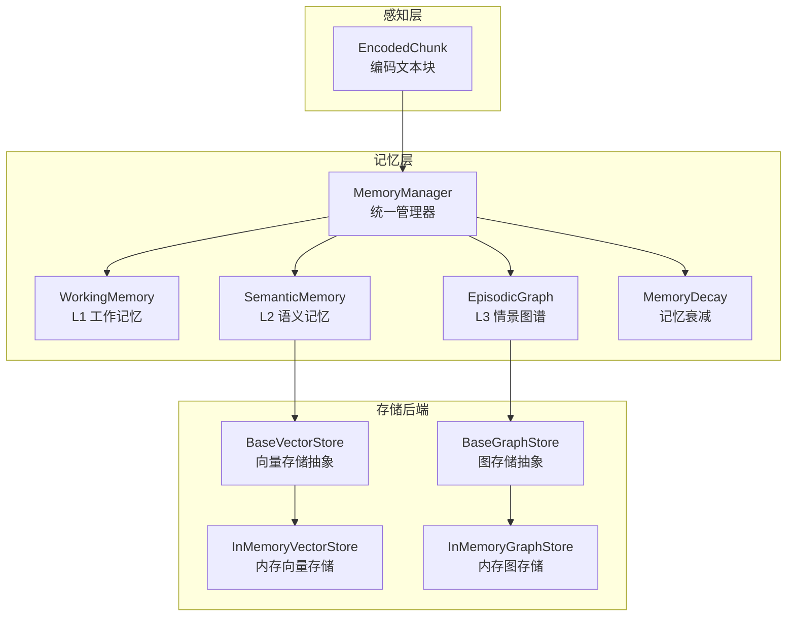
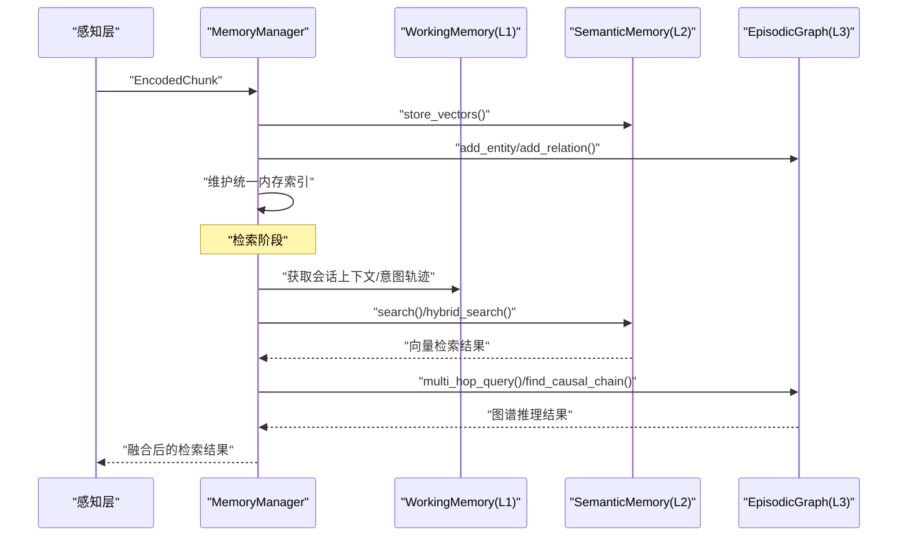
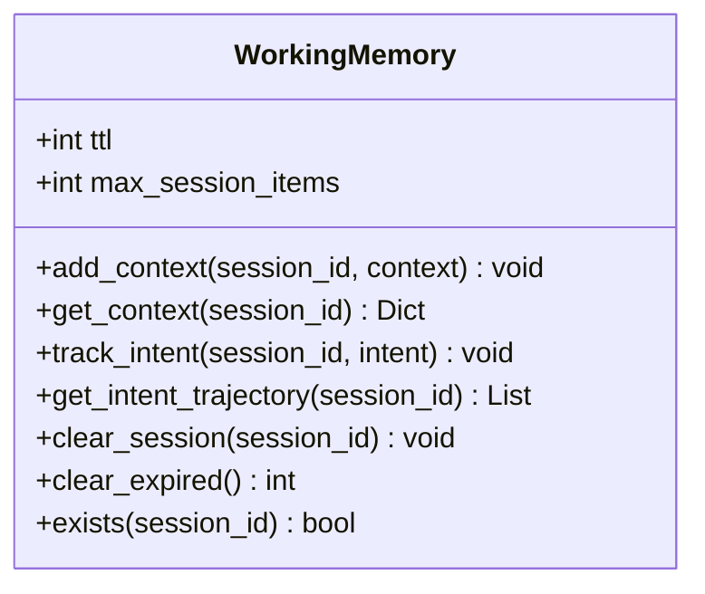
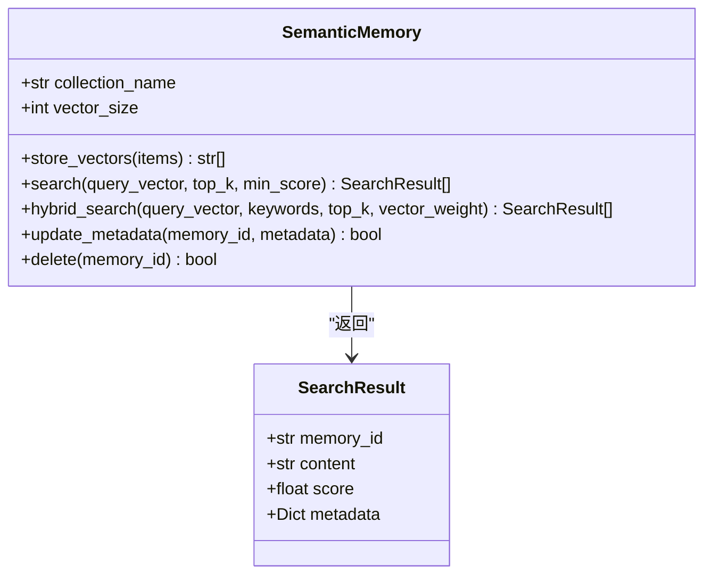
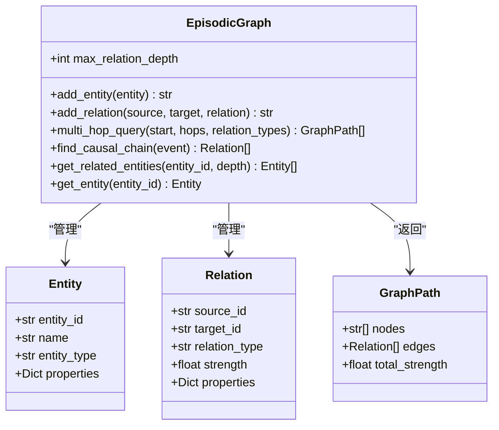
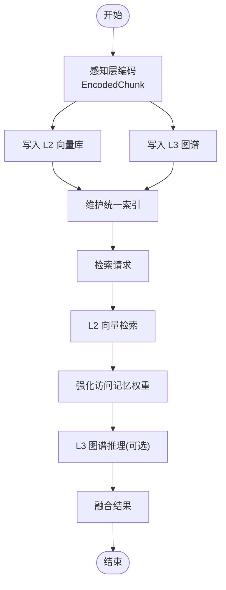
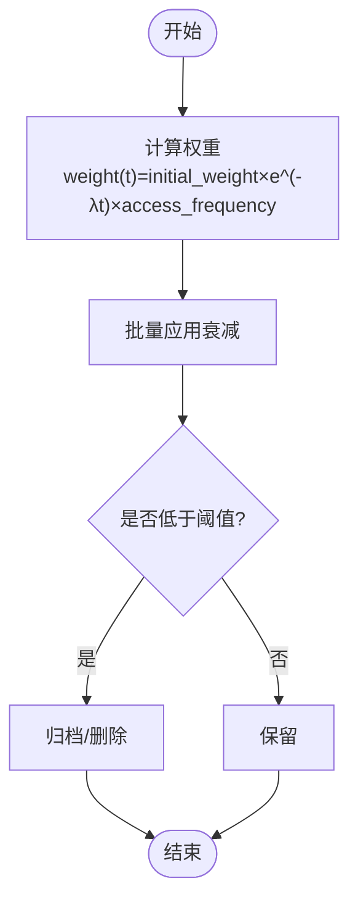
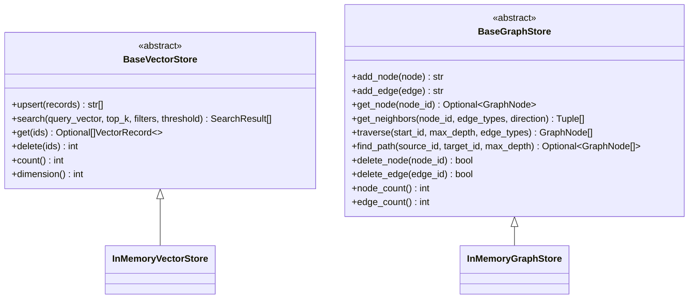
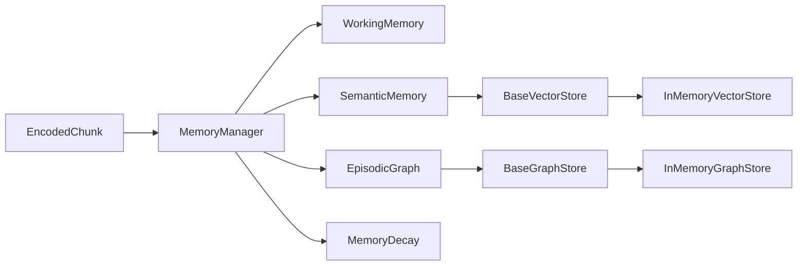
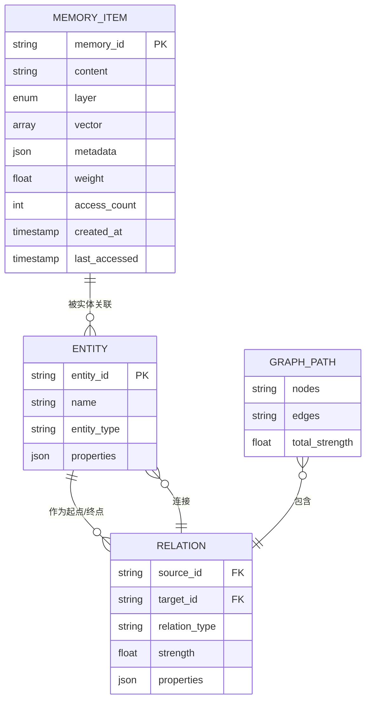

# 三层记忆架构

<cite>
**本文引用的文件**
- [src/memory/README.md](file://src/memory/README.md)
- [src/memory/models.py](file://src/memory/models.py)
- [src/memory/working_memory.py](file://src/memory/working_memory.py)
- [src/memory/semantic_memory.py](file://src/memory/semantic_memory.py)
- [src/memory/episodic_graph.py](file://src/memory/episodic_graph.py)
- [src/memory/manager.py](file://src/memory/manager.py)
- [src/memory/decay.py](file://src/memory/decay.py)
- [src/memory/backends/base.py](file://src/memory/backends/base.py)
- [src/memory/backends/memory_store.py](file://src/memory/backends/memory_store.py)
- [src/perception/models.py](file://src/perception/models.py)
- [src/core/config.py](file://src/core/config.py)
- [README.md](file://README.md)
</cite>

## 目录
1. [引言](#引言)
2. [项目结构](#项目结构)
3. [核心组件](#核心组件)
4. [架构总览](#架构总览)
5. [详细组件分析](#详细组件分析)
6. [依赖关系分析](#依赖关系分析)
7. [性能考量](#性能考量)
8. [故障排查指南](#故障排查指南)
9. [结论](#结论)
10. [附录](#附录)

## 引言
本文件围绕 NecoRAG 的“九命记忆存储”（Nine-Lives Memory）三层记忆架构展开，系统阐述 L1 工作记忆、L2 语义记忆与 L3 情景图谱的设计理念、数据结构、检索机制与协作流程。文档同时给出架构图、数据模型说明与配置参数，帮助读者快速理解并扩展该记忆系统。

## 项目结构
记忆层位于 src/memory 目录，包含三层记忆实现、统一管理器、衰减机制以及可插拔的存储后端抽象与内存实现。感知层提供编码后的文本块（含稠密/稀疏向量、实体三元组等），作为记忆层输入。

图表来源
- [src/memory/manager.py:16-195](file://src/memory/manager.py#L16-L195)
- [src/memory/working_memory.py:11-120](file://src/memory/working_memory.py#L11-L120)
- [src/memory/semantic_memory.py:21-179](file://src/memory/semantic_memory.py#L21-L179)
- [src/memory/episodic_graph.py:10-194](file://src/memory/episodic_graph.py#L10-L194)
- [src/memory/decay.py:11-155](file://src/memory/decay.py#L11-L155)
- [src/memory/backends/base.py:54-297](file://src/memory/backends/base.py#L54-L297)
- [src/memory/backends/memory_store.py:20-381](file://src/memory/backends/memory_store.py#L20-L381)
- [src/perception/models.py:31-41](file://src/perception/models.py#L31-L41)

章节来源
- [src/memory/README.md:1-244](file://src/memory/README.md#L1-L244)
- [README.md:35-85](file://README.md#L35-L85)

## 核心组件
- MemoryManager：统一协调 L1/L2/L3 三层记忆，负责存储、检索、巩固与主动遗忘。
- WorkingMemory（L1）：会话上下文与意图轨迹的短期存储，具备 TTL 过期与 LRU 淘汰能力。
- SemanticMemory（L2）：高维向量存储与检索，支持混合检索与元数据更新。
- EpisodicGraph（L3）：实体关系网络，支持多跳查询与因果链条追踪。
- MemoryDecay：基于指数衰减与访问频率的动态权重机制，实现记忆巩固与归档。
- 存储后端抽象：BaseVectorStore/BaseGraphStore；内存实现 InMemoryVectorStore/InMemoryGraphStore。

章节来源
- [src/memory/manager.py:16-195](file://src/memory/manager.py#L16-L195)
- [src/memory/working_memory.py:11-120](file://src/memory/working_memory.py#L11-L120)
- [src/memory/semantic_memory.py:21-179](file://src/memory/semantic_memory.py#L21-L179)
- [src/memory/episodic_graph.py:10-194](file://src/memory/episodic_graph.py#L10-L194)
- [src/memory/decay.py:11-155](file://src/memory/decay.py#L11-L155)
- [src/memory/backends/base.py:54-297](file://src/memory/backends/base.py#L54-L297)
- [src/memory/backends/memory_store.py:20-381](file://src/memory/backends/memory_store.py#L20-L381)

## 架构总览
三层记忆的协作流程如下：
- 新知识入库：感知层编码后，MemoryManager 将向量写入 L2，实体三元组写入 L3，同时维护统一内存索引。
- 检索流程：先从 L1 获取会话上下文与意图轨迹，再进行 L2 向量检索，必要时结合 L3 图谱推理，最后融合结果。
- 记忆巩固：周期性应用衰减，强化高频访问记忆，归档低权重记忆。

图表来源
- [src/memory/manager.py:48-147](file://src/memory/manager.py#L48-L147)
- [src/memory/semantic_memory.py:50-142](file://src/memory/semantic_memory.py#L50-L142)
- [src/memory/episodic_graph.py:71-147](file://src/memory/episodic_graph.py#L71-L147)
- [src/memory/working_memory.py:36-85](file://src/memory/working_memory.py#L36-L85)

## 详细组件分析

### L1 工作记忆（WorkingMemory）
- 功能定位：短期会话上下文与用户意图轨迹存储，模拟“瞬时遗忘”，适合低延迟、易失性数据。
- 数据存储：内存字典模拟 Redis，支持会话级上下文合并、意图列表追加。
- 检索机制：按会话 ID 获取上下文与意图轨迹；TTL 过期与 LRU 淘汰为 TODO，当前最小实现返回占位行为。
- 适用场景：多轮对话、意图追踪、临时状态缓存。
- 配置要点：TTL、单会话最大条目数、LRU 最大缓存数（见配置表）。

图表来源
- [src/memory/working_memory.py:11-120](file://src/memory/working_memory.py#L11-L120)

章节来源
- [src/memory/working_memory.py:11-120](file://src/memory/working_memory.py#L11-L120)
- [src/memory/README.md:41-46](file://src/memory/README.md#L41-L46)

### L2 语义记忆（SemanticMemory）
- 功能定位：高维向量存储与模糊匹配，支持向量检索与混合检索（关键词+向量）。
- 数据存储：内存字典模拟向量库，存储向量与元数据；支持元数据更新与删除。
- 检索机制：余弦相似度计算；HNSW 索引为 TODO；混合检索为 TODO。
- 适用场景：语义近似检索、模糊匹配、直觉检索。
- 配置要点：集合名、向量维度、索引类型（见配置表）。

图表来源
- [src/memory/semantic_memory.py:21-179](file://src/memory/semantic_memory.py#L21-L179)

章节来源
- [src/memory/semantic_memory.py:21-179](file://src/memory/semantic_memory.py#L21-L179)
- [src/memory/README.md:47-52](file://src/memory/README.md#L47-L52)

### L3 情景图谱（EpisodicGraph）
- 功能定位：实体关系网络，支持多跳推理与因果链条追踪，模拟“结构化记忆”。
- 数据存储：内存图结构，存储实体与关系；支持邻接表与遍历。
- 检索机制：BFS 多跳查询、因果关系链查找、相关实体获取。
- 适用场景：复杂推理、事件链条、知识图谱路径发现。
- 配置要点：最大关系深度、是否启用因果图谱（见配置表）。

图表来源
- [src/memory/episodic_graph.py:10-194](file://src/memory/episodic_graph.py#L10-L194)
- [src/memory/models.py:33-67](file://src/memory/models.py#L33-L67)

章节来源
- [src/memory/episodic_graph.py:10-194](file://src/memory/episodic_graph.py#L10-L194)
- [src/memory/README.md:53-61](file://src/memory/README.md#L53-L61)

### 记忆管理器（MemoryManager）
- 统一入口：负责将感知层编码后的知识写入 L2/L3，并维护统一内存索引。
- 检索控制：根据层级选择 L2/L3 检索，强化访问记忆权重。
- 巩固与遗忘：应用衰减、归档低权重记忆、删除统一索引。

图表来源
- [src/memory/manager.py:48-147](file://src/memory/manager.py#L48-L147)

章节来源
- [src/memory/manager.py:16-195](file://src/memory/manager.py#L16-L195)

### 记忆衰减（MemoryDecay）
- 设计原理：指数时间衰减 × 访问频率因子，实现“巩固与遗忘”的动态平衡。
- 功能：计算权重、批量衰减、归档低权重记忆、强化访问记忆。

图表来源
- [src/memory/decay.py:39-155](file://src/memory/decay.py#L39-L155)

章节来源
- [src/memory/decay.py:11-155](file://src/memory/decay.py#L11-L155)
- [src/memory/README.md:62-81](file://src/memory/README.md#L62-L81)

### 存储后端抽象与内存实现
- 抽象接口：BaseVectorStore/ BaseGraphStore 定义统一的向量与图存储接口。
- 内存实现：InMemoryVectorStore/ InMemoryGraphStore 提供开发与测试可用的最小实现，便于替换为真实外部数据库（如 Qdrant、Neo4j 等）。

图表来源
- [src/memory/backends/base.py:54-297](file://src/memory/backends/base.py#L54-L297)
- [src/memory/backends/memory_store.py:20-381](file://src/memory/backends/memory_store.py#L20-L381)

章节来源
- [src/memory/backends/base.py:54-297](file://src/memory/backends/base.py#L54-L297)
- [src/memory/backends/memory_store.py:20-381](file://src/memory/backends/memory_store.py#L20-L381)

## 依赖关系分析
- MemoryManager 依赖 WorkingMemory、SemanticMemory、EpisodicGraph 与 MemoryDecay。
- SemanticMemory 与 EpisodicGraph 通过抽象接口 BaseVectorStore/BaseGraphStore 与具体实现解耦。
- 感知层 EncodedChunk 为 MemoryManager 的输入，包含稠密向量、稀疏向量、实体三元组与情境标签。

图表来源
- [src/memory/manager.py:48-112](file://src/memory/manager.py#L48-L112)
- [src/memory/backends/base.py:54-297](file://src/memory/backends/base.py#L54-L297)
- [src/perception/models.py:31-41](file://src/perception/models.py#L31-L41)

章节来源
- [src/memory/manager.py:16-195](file://src/memory/manager.py#L16-L195)
- [src/perception/models.py:31-41](file://src/perception/models.py#L31-L41)

## 性能考量
- 写入延迟：L1 < L2 < L3（参考性能指标表）。
- 检索延迟：L1 < L2 < L3（参考性能指标表）。
- 容量规模：L1 适合小规模短期数据；L2 支持千万级向量；L3 支持亿级节点。
- 优化建议：在 L2 引入 HNSW 索引与混合检索；在 L3 实现图遍历剪枝与缓存热点路径；在 L1 引入 TTL 过期检测与 LRU 淘汰。

章节来源
- [src/memory/README.md:223-229](file://src/memory/README.md#L223-L229)

## 故障排查指南
- L1 会话上下文缺失：检查 add_context 与 get_context 的 session_id 是否一致；确认 clear_session 是否被误触发。
- L2 检索为空：确认向量维度与集合名配置正确；检查 query 向量维度与存储向量维度一致；验证 min_score 与 top_k 设置。
- L3 查询无结果：确认实体 ID 与关系类型过滤；检查 max_relation_depth 与 relation_types；验证图谱是否已正确写入。
- 记忆权重异常：检查 decay_rate 与 archive_threshold；确认 reinforce 是否被频繁调用导致权重上限。

章节来源
- [src/memory/working_memory.py:36-120](file://src/memory/working_memory.py#L36-L120)
- [src/memory/semantic_memory.py:50-179](file://src/memory/semantic_memory.py#L50-L179)
- [src/memory/episodic_graph.py:71-194](file://src/memory/episodic_graph.py#L71-L194)
- [src/memory/decay.py:72-155](file://src/memory/decay.py#L72-L155)

## 结论
三层记忆架构以“工作记忆 + 语义记忆 + 情景图谱”的组合，模拟人类记忆的多层结构与动态平衡。通过 MemoryManager 统一编排、MemoryDecay 实现巩固与遗忘、抽象存储后端实现可插拔扩展，该系统既满足快速开发与测试，又为生产环境预留了高性能向量与图数据库的接入空间。

## 附录

### 数据模型说明
- MemoryItem：记忆项，包含内容、层级、向量、元数据、权重、访问计数与时间戳。
- Entity/Relation/GraphPath：实体、关系与图谱路径，用于 L3 图谱。
- EncodedChunk：感知层编码后的文本块，包含稠密/稀疏向量、实体三元组与情境标签。

图表来源
- [src/memory/models.py:19-67](file://src/memory/models.py#L19-L67)

章节来源
- [src/memory/models.py:12-67](file://src/memory/models.py#L12-L67)
- [src/perception/models.py:31-41](file://src/perception/models.py#L31-L41)

### 配置参数与性能特征对比
- L1 工作记忆配置（示例）
  - 参数：redis_ttl、max_session_items、lru_max_size
  - 说明：会话 TTL、单会话最大条目、LRU 最大缓存数
- L2 语义记忆配置（示例）
  - 参数：vector_size、collection_name、index_type
  - 说明：向量维度、集合名、索引类型
- L3 情景图谱配置（示例）
  - 参数：max_relation_depth、enable_causal_graph
  - 说明：最大关系深度、是否启用因果图谱
- 衰减机制配置（示例）
  - 参数：decay_rate、archive_threshold、consolidation_interval
  - 说明：衰减速率、归档阈值、巩固间隔
- 性能指标（示例）
  - L1：写入延迟 < 5ms，检索延迟 < 2ms，容量约 10 万条
  - L2：写入延迟 < 50ms，检索延迟 < 100ms，容量千万级
  - L3：写入延迟 < 100ms，检索延迟 < 500ms，容量亿级节点

章节来源
- [src/memory/README.md:194-229](file://src/memory/README.md#L194-L229)
- [src/core/config.py:134-156](file://src/core/config.py#L134-L156)