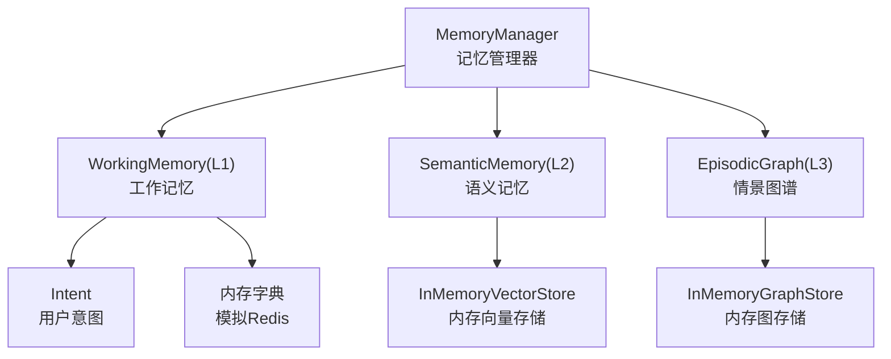
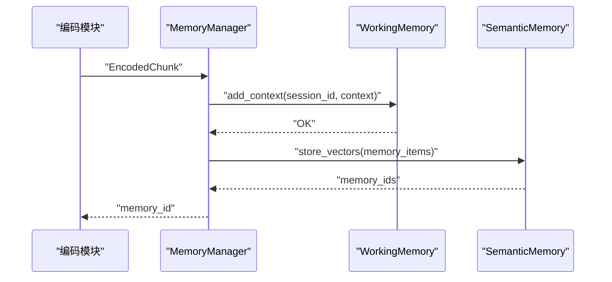
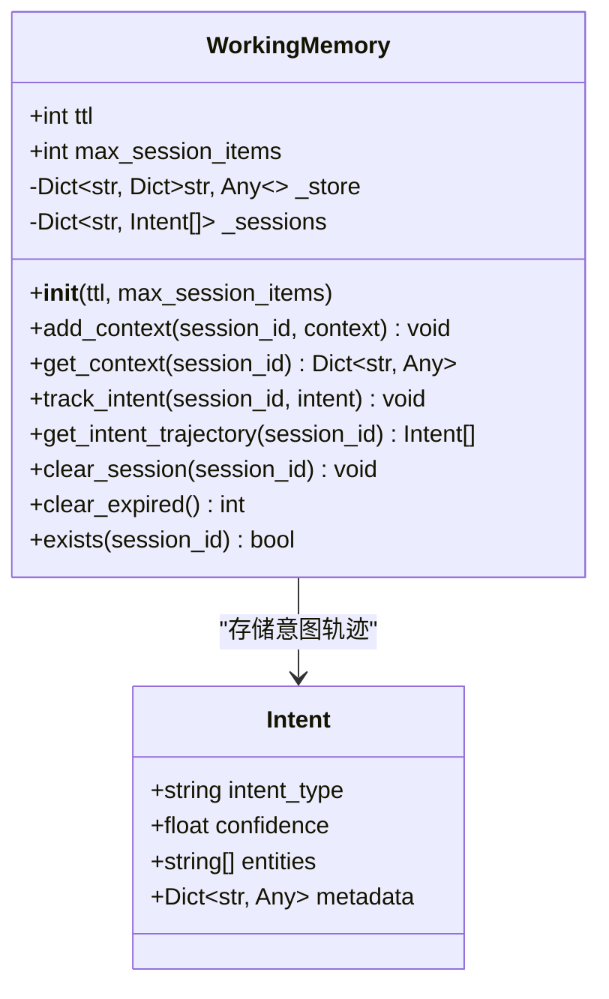
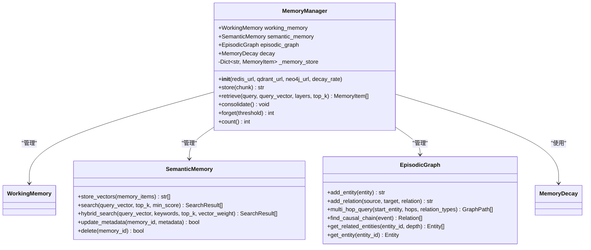
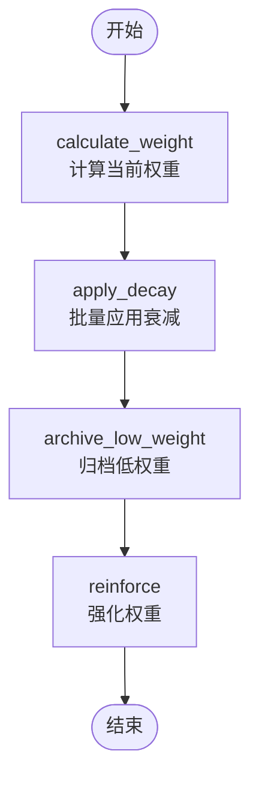
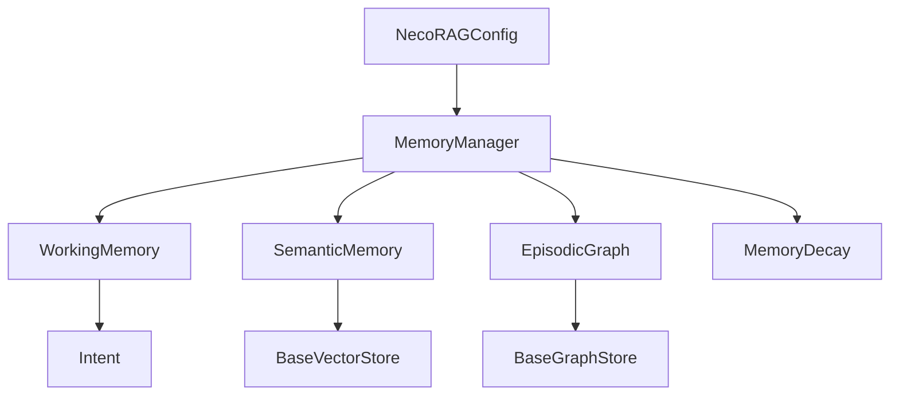

# 工作记忆 (L1)

<cite>
**本文引用的文件**
- [src/memory/working_memory.py](file://src/memory/working_memory.py)
- [src/memory/manager.py](file://src/memory/manager.py)
- [src/memory/models.py](file://src/memory/models.py)
- [src/memory/README.md](file://src/memory/README.md)
- [src/memory/backends/base.py](file://src/memory/backends/base.py)
- [src/memory/backends/memory_store.py](file://src/memory/backends/memory_store.py)
- [src/memory/semantic_memory.py](file://src/memory/semantic_memory.py)
- [src/memory/episodic_graph.py](file://src/memory/episodic_graph.py)
- [src/memory/decay.py](file://src/memory/decay.py)
- [src/core/config.py](file://src/core/config.py)
- [devops/configs/redis/redis.conf](file://devops/configs/redis/redis.conf)
- [example/example_usage.py](file://example/example_usage.py)
</cite>

## 目录
1. [简介](#简介)
2. [项目结构](#项目结构)
3. [核心组件](#核心组件)
4. [架构概览](#架构概览)
5. [详细组件分析](#详细组件分析)
6. [依赖分析](#依赖分析)
7. [性能考虑](#性能考虑)
8. [故障排除指南](#故障排除指南)
9. [结论](#结论)
10. [附录](#附录)

## 简介
本文件聚焦于L1工作记忆模块，系统阐述其作为短期记忆的实现原理与工程实践。工作记忆承担“当前会话上下文”和“用户意图轨迹”的高频读写需求，强调极低延迟访问、TTL自动过期与模拟瞬时遗忘能力。在当前代码库中，工作记忆以最小实现形式使用内存字典模拟Redis行为；同时，文档提供了对接真实Redis存储后端的配置思路、数据结构设计、访问模式与缓存策略，并给出性能优化与故障排除建议。

## 项目结构
围绕L1工作记忆的相关文件组织如下：
- 记忆管理层：统一编排L1/L2/L3三层记忆，负责数据流与生命周期管理
- L1工作记忆：提供会话上下文与意图轨迹的临时存储
- 数据模型：定义记忆项、意图等基础数据结构
- 后端抽象与内存实现：为向量与图存储提供抽象接口与内存实现，便于理解整体存储体系
- 配置与文档：包含使用示例、参数说明与性能指标

图表来源
- [src/memory/manager.py:16-47](file://src/memory/manager.py#L16-L47)
- [src/memory/working_memory.py:11-35](file://src/memory/working_memory.py#L11-L35)
- [src/memory/models.py:36-43](file://src/memory/models.py#L36-L43)
- [src/memory/backends/memory_store.py:20-141](file://src/memory/backends/memory_store.py#L20-L141)
- [src/memory/backends/memory_store.py:143-381](file://src/memory/backends/memory_store.py#L143-L381)

章节来源
- [src/memory/README.md:1-61](file://src/memory/README.md#L1-L61)
- [src/memory/manager.py:16-47](file://src/memory/manager.py#L16-L47)

## 核心组件
- WorkingMemory：L1工作记忆，提供会话上下文与意图轨迹的临时存储，具备极低延迟访问、TTL自动过期、LRU淘汰策略与“瞬时遗忘”模拟。
- MemoryManager：统一管理三层记忆，协调L1/L2/L3之间的数据流转与生命周期管理。
- MemoryItem/Intent：定义记忆项与用户意图的数据结构，支撑工作记忆与语义记忆的统一存储。
- InMemoryVectorStore/InMemoryGraphStore：为向量与图存储提供抽象接口与内存实现，便于理解整体存储体系。
- MemoryDecay：实现记忆权重衰减与巩固机制，模拟生物记忆的巩固与遗忘。

章节来源
- [src/memory/working_memory.py:11-120](file://src/memory/working_memory.py#L11-L120)
- [src/memory/manager.py:20-212](file://src/memory/manager.py#L20-L212)
- [src/memory/models.py:14-43](file://src/memory/models.py#L14-L43)
- [src/memory/backends/base.py:61-314](file://src/memory/backends/base.py#L61-L314)
- [src/memory/decay.py:11-155](file://src/memory/decay.py#L11-L155)

## 架构概览
L1工作记忆在NecoRAG中承担“当前会话上下文与用户意图轨迹”的短期存储职责，通过极低延迟访问、TTL自动过期、LRU淘汰策略与“瞬时遗忘”模拟，实现接近人类大脑的快速信息处理能力。工作记忆与记忆管理器协作，形成“感知层→L1缓存→L2向量存储→L3图谱”的数据流转路径。

图表来源
- [src/memory/manager.py:52-123](file://src/memory/manager.py#L52-L123)
- [src/memory/working_memory.py:36-85](file://src/memory/working_memory.py#L36-L85)

章节来源
- [src/memory/README.md:179-209](file://src/memory/README.md#L179-L209)
- [src/memory/manager.py:124-159](file://src/memory/manager.py#L124-L159)

## 详细组件分析

### WorkingMemory（L1工作记忆）
- 设计目标：极低延迟访问、TTL自动过期、LRU淘汰策略、模拟瞬时遗忘
- 数据结构：使用内存字典模拟Redis，分别存储会话上下文与意图轨迹
- 核心方法：
  - add_context：添加会话上下文，支持增量更新与最后更新时间记录
  - get_context：获取会话上下文
  - track_intent：跟踪用户意图轨迹
  - get_intent_trajectory：获取用户意图轨迹
  - clear_session：清除会话数据（模拟遗忘）
  - clear_expired：清除过期数据（最小实现：返回0）
  - exists：检查会话是否存在

图表来源
- [src/memory/working_memory.py:11-120](file://src/memory/working_memory.py#L11-L120)
- [src/memory/models.py:36-43](file://src/memory/models.py#L36-L43)

章节来源
- [src/memory/working_memory.py:11-120](file://src/memory/working_memory.py#L11-L120)
- [src/memory/models.py:36-43](file://src/memory/models.py#L36-L43)

### 记忆管理器（MemoryManager）
- 统一管理三层记忆：L1工作记忆、L2语义记忆、L3情景图谱
- 核心功能：
  - store：将编码后的文本块存储到L2语义记忆，并在L3图谱中创建实体与关系
  - retrieve：从L2语义记忆检索相关知识，结合记忆衰减进行权重强化
  - consolidate：记忆巩固，将高频数据持久化到L2，低频数据归档
  - forget：主动遗忘低价值记忆

图表来源
- [src/memory/manager.py:20-212](file://src/memory/manager.py#L20-L212)
- [src/memory/semantic_memory.py:21-179](file://src/memory/semantic_memory.py#L21-L179)
- [src/memory/episodic_graph.py:10-194](file://src/memory/episodic_graph.py#L10-L194)
- [src/memory/decay.py:11-155](file://src/memory/decay.py#L11-L155)

章节来源
- [src/memory/manager.py:20-212](file://src/memory/manager.py#L20-L212)

### 记忆衰减机制（MemoryDecay）
- 实现生物记忆的巩固与遗忘：通过权重衰减公式动态调整记忆重要性
- 核心功能：
  - calculate_weight：计算当前权重（考虑时间衰减与访问频率）
  - apply_decay：批量应用衰减
  - archive_low_weight：归档低权重记忆
  - reinforce：强化记忆权重

图表来源
- [src/memory/decay.py:39-142](file://src/memory/decay.py#L39-L142)

章节来源
- [src/memory/decay.py:11-155](file://src/memory/decay.py#L11-L155)

### Redis缓存集成方案
- 连接配置
  - redis_url：Redis连接URL，如redis://localhost:6379
  - TTL设置：通过EX参数设置键的过期时间
  - LRU策略：通过maxmemory与maxmemory-policy配置实现
- 数据序列化
  - 上下文字典：建议使用JSON序列化，确保复杂嵌套结构可持久化
  - 意图列表：建议序列化为JSON数组，便于跨语言/进程读取
- 缓存策略
  - 会话键命名：采用统一前缀与session_id组合，避免键冲突
  - 批量操作：利用mset/mget提升批量写入/读取效率
  - 过期清理：结合Redis过期事件或定期任务清理过期键

章节来源
- [src/memory/README.md:179-209](file://src/memory/README.md#L179-L209)
- [devops/configs/redis/redis.conf:1-23](file://devops/configs/redis/redis.conf#L1-L23)

## 依赖分析
- WorkingMemory依赖Intent数据模型，用于存储用户意图轨迹
- MemoryManager依赖WorkingMemory、SemanticMemory、EpisodicGraph与MemoryDecay，统一管理三层记忆
- SemanticMemory与EpisodicGraph提供向量与图存储的内存实现，便于理解整体存储体系
- 配置系统通过NecoRAGConfig提供L1工作记忆的参数配置（如TTL、最大条目数）

图表来源
- [src/memory/working_memory.py:8](file://src/memory/working_memory.py#L8)
- [src/memory/manager.py:9-13](file://src/memory/manager.py#L9-L13)
- [src/memory/backends/base.py:61-314](file://src/memory/backends/base.py#L61-L314)
- [src/core/config.py:136-156](file://src/core/config.py#L136-L156)

章节来源
- [src/memory/working_memory.py:6-8](file://src/memory/working_memory.py#L6-L8)
- [src/memory/manager.py:8-14](file://src/memory/manager.py#L8-L14)
- [src/core/config.py:136-156](file://src/core/config.py#L136-L156)

## 性能考虑
- L1工作记忆写入延迟：< 5ms，检索延迟：< 2ms，容量：10万条
- L2语义记忆写入延迟：< 50ms，检索延迟：< 100ms，容量：千万级
- L3情景图谱写入延迟：< 100ms，检索延迟：< 500ms，容量：亿级节点
- 优化建议：
  - 使用Redis作为L1后端，结合TTL与LRU策略实现高性能缓存
  - 对会话上下文与意图轨迹进行批量操作，减少网络往返
  - 定期清理过期数据，避免内存泄漏
  - 在高并发场景下，合理设置Redis连接池与超时参数

章节来源
- [src/memory/README.md:223-230](file://src/memory/README.md#L223-L230)

## 故障排除指南
- 会话数据未过期：检查TTL设置与过期检测逻辑（当前实现为最小实现，需完善）
- 内存占用过高：检查LRU策略配置与最大会话条目限制
- 意图轨迹异常：确认Intent数据结构与序列化/反序列化过程
- 记忆巩固效果不佳：调整衰减参数与归档阈值，确保重要知识得到强化

章节来源
- [src/memory/working_memory.py:97-107](file://src/memory/working_memory.py#L97-L107)
- [src/memory/decay.py:24-38](file://src/memory/decay.py#L24-L38)

## 结论
L1工作记忆作为系统短期记忆的核心，承担高频上下文与意图的临时存储职责。当前实现以内存字典模拟Redis，具备清晰的接口与扩展点。通过合理的Redis配置、序列化策略与缓存优化，可满足毫秒级延迟与高吞吐的业务需求。后续建议完善TTL过期检测与LRU淘汰逻辑，并在生产环境接入真实Redis后端，以获得更好的稳定性与可扩展性。

## 附录

### 配置参数参考
- L1工作记忆
  - redis_ttl：会话TTL（秒）
  - max_session_items：单会话最大条目
  - lru_max_size：LRU最大缓存数
- 记忆衰减
  - decay_rate：衰减速率
  - archive_threshold：归档阈值
  - consolidation_interval：巩固间隔（秒）

章节来源
- [src/memory/README.md:196-222](file://src/memory/README.md#L196-L222)
- [src/core/config.py:136-156](file://src/core/config.py#L136-L156)

### 使用示例
- 完整使用示例展示了从感知层到交互层的完整工作流程，包括知识存储、检索、记忆巩固与响应生成。

章节来源
- [example/example_usage.py:50-216](file://example/example_usage.py#L50-L216)