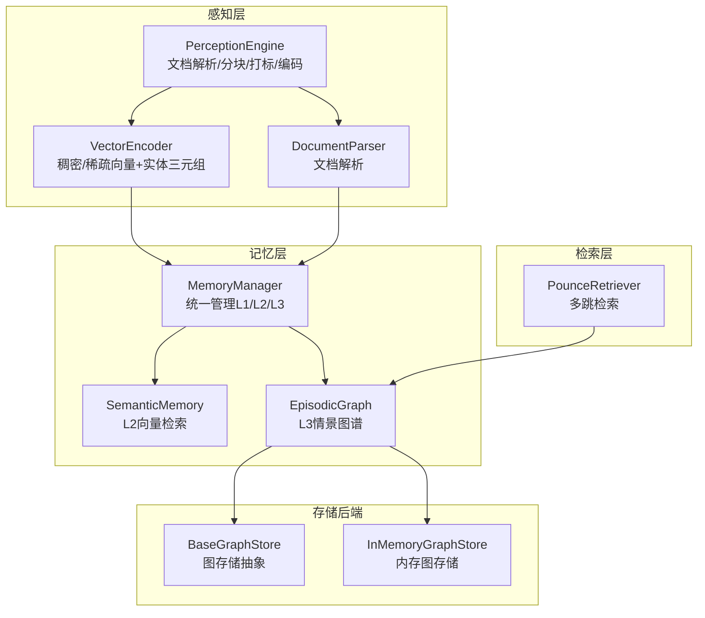
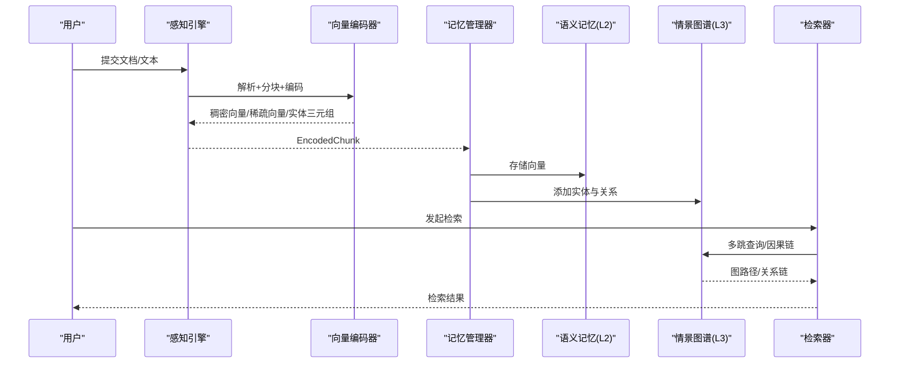
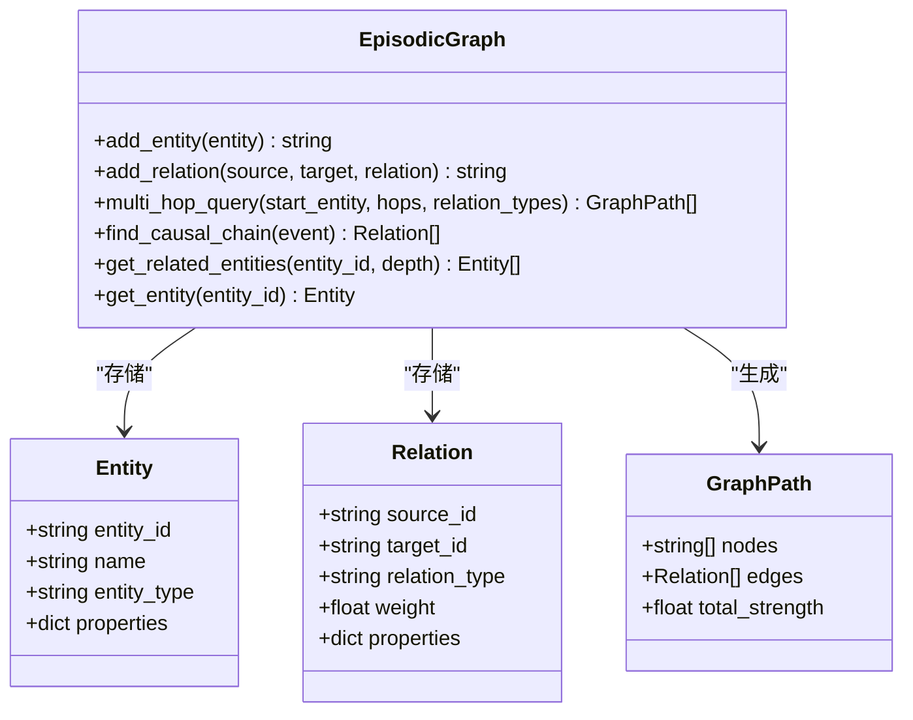
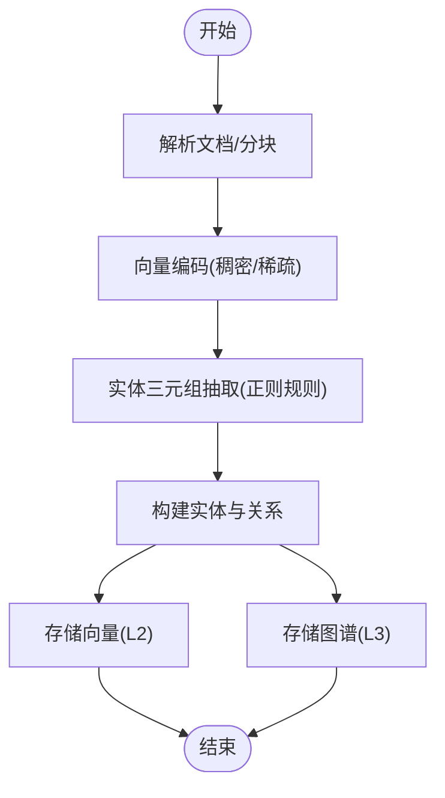
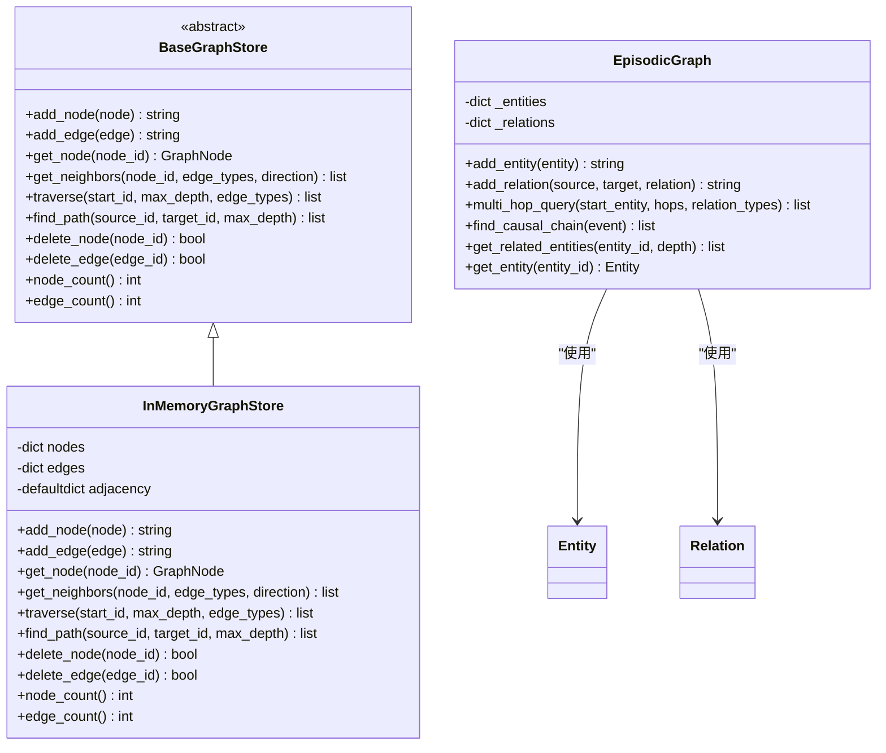
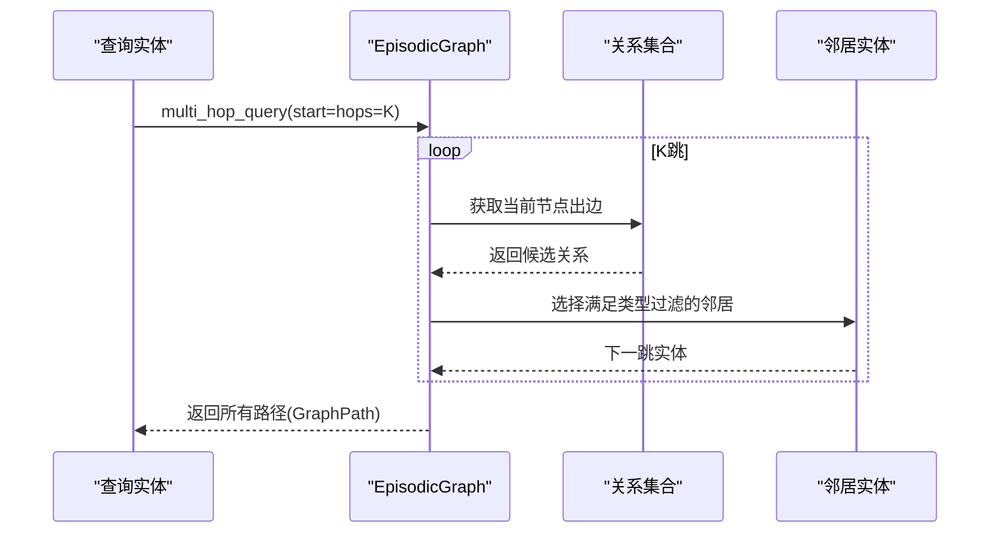
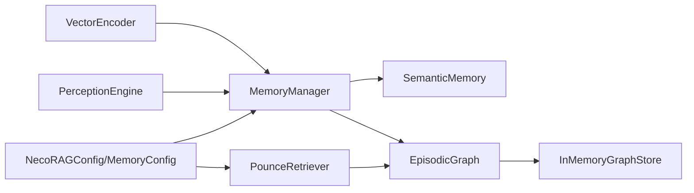

# 情景图谱 (L3)

<cite>
**本文引用的文件**
- [episodic_graph.py](file://src/memory/episodic_graph.py)
- [models.py](file://src/memory/models.py)
- [memory_store.py](file://src/memory/backends/memory_store.py)
- [base.py](file://src/memory/backends/base.py)
- [manager.py](file://src/memory/manager.py)
- [config.py](file://src/core/config.py)
- [engine.py](file://src/perception/engine.py)
- [encoder.py](file://src/perception/encoder.py)
- [parser.py](file://src/perception/parser.py)
- [design.md](file://design/design.md)
- [retriever.py](file://src/retrieval/retriever.py)
- [metrics.py](file://src/knowledge_evolution/metrics.py)
- [L3情景图谱（图数据库）.md](file://wiki/wiki/记忆管理层/L3情景图谱（图数据库）.md)
- [记忆层配置.md](file://wiki/wiki/配置管理/记忆层配置.md)
- [deployment_quickref.md](file://3rd/deployment_quickref.md)
</cite>

## 目录
1. [简介](#简介)
2. [项目结构](#项目结构)
3. [核心组件](#核心组件)
4. [架构总览](#架构总览)
5. [详细组件分析](#详细组件分析)
6. [依赖分析](#依赖分析)
7. [性能考量](#性能考量)
8. [故障排查指南](#故障排查指南)
9. [结论](#结论)
10. [附录](#附录)

## 简介
本文件聚焦于 NecoRAG 项目中的 L3 情景图谱（图数据库）模块，系统阐述其作为“关系记忆”的实现方式：从感知层抽取实体与关系，到 L3 图谱的存储与检索；解释图数据库的节点与边模型、实体类型与关系强度的建模；梳理扩散激活理论在检索中的应用与多跳推理的实现；并给出图谱配置、实体抽取算法与关系建模的最佳实践，以及查询优化与大规模图处理的解决方案。

## 项目结构
围绕 L3 情景图谱的关键代码分布在以下模块：
- 记忆层：EpisodicGraph（L3 情景图谱）、SemanticMemory（L2 语义向量）、WorkingMemory（L1 工作记忆）、MemoryManager（统一管理）
- 存储后端：BaseGraphStore/InMemoryGraphStore（图存储抽象与内存实现）
- 感知层：PerceptionEngine、VectorEncoder、DocumentParser（文档解析与实体抽取）
- 配置层：NecoRAGConfig、MemoryConfig（含图数据库提供方与参数）
- 检索层：PounceRetriever（多跳检索调用 L3 图谱）
- 设计文档：扩散激活与检索流程的神经科学映射

**图表来源**
- [engine.py:15-174](file://src/perception/engine.py#L15-L174)
- [encoder.py:24-254](file://src/perception/encoder.py#L24-L254)
- [parser.py:11-112](file://src/perception/parser.py#L11-L112)
- [manager.py:16-195](file://src/memory/manager.py#L16-L195)
- [semantic_memory.py:21-179](file://src/memory/semantic_memory.py#L21-L179)
- [episodic_graph.py:10-194](file://src/memory/episodic_graph.py#L10-L194)
- [base.py:139-297](file://src/memory/backends/base.py#L139-L297)
- [memory_store.py:143-381](file://src/memory/backends/memory_store.py#L143-L381)
- [retriever.py:333-378](file://src/retrieval/retriever.py#L333-L378)

**章节来源**
- [engine.py:15-174](file://src/perception/engine.py#L15-L174)
- [encoder.py:24-254](file://src/perception/encoder.py#L24-L254)
- [parser.py:11-112](file://src/perception/parser.py#L11-L112)
- [manager.py:16-195](file://src/memory/manager.py#L16-L195)
- [semantic_memory.py:21-179](file://src/memory/semantic_memory.py#L21-L179)
- [episodic_graph.py:10-194](file://src/memory/episodic_graph.py#L10-L194)
- [base.py:139-297](file://src/memory/backends/base.py#L139-L297)
- [memory_store.py:143-381](file://src/memory/backends/memory_store.py#L143-L381)
- [retriever.py:333-378](file://src/retrieval/retriever.py#L333-L378)

## 核心组件
- EpisodicGraph（L3 情景图谱）：以内存字典和邻接表实现的轻量图结构，支持实体与关系的增删查、多跳查询、因果链条追踪与相关实体发现。
- MemoryManager（记忆统一管理）：将感知层产出的实体三元组转化为 L3 图谱实体与关系，并同步写入 L2 语义向量存储。
- BaseGraphStore/InMemoryGraphStore：定义图存储接口与内存实现，提供节点/边增删、邻居查询、BFS 遍历与路径查找。
- SemanticMemory：L2 向量检索（当前为内存模拟），配合 MemoryManager 完成向量检索与记忆强化。
- PerceptionEngine/VectorEncoder：负责文档解析、分块、情境标签与向量化，抽取实体三元组作为图谱关系来源。
- 配置层：NecoRAGConfig/MemoryConfig 定义图数据库提供方（MEMORY/NEO4J/NEBULA）与参数（如 max_relation_depth）。

**章节来源**
- [episodic_graph.py:10-194](file://src/memory/episodic_graph.py#L10-L194)
- [manager.py:16-195](file://src/memory/manager.py#L16-L195)
- [base.py:139-297](file://src/memory/backends/base.py#L139-L297)
- [memory_store.py:143-381](file://src/memory/backends/memory_store.py#L143-L381)
- [semantic_memory.py:21-179](file://src/memory/semantic_memory.py#L21-L179)
- [engine.py:15-174](file://src/perception/engine.py#L15-L174)
- [encoder.py:24-254](file://src/perception/encoder.py#L24-L254)
- [config.py:136-156](file://src/core/config.py#L136-L156)

## 架构总览
L3 情景图谱在整体系统中的位置与交互如下：

**图表来源**
- [engine.py:84-137](file://src/perception/engine.py#L84-L137)
- [manager.py:48-113](file://src/memory/manager.py#L48-L113)
- [semantic_memory.py:50-79](file://src/memory/semantic_memory.py#L50-L79)
- [episodic_graph.py:33-69](file://src/memory/episodic_graph.py#L33-L69)
- [retriever.py:333-378](file://src/retrieval/retriever.py#L333-L378)

## 详细组件分析

### 图数据库节点与边模型
- 节点（Entity）：包含实体 ID、名称、类型与属性字典，用于描述知识图谱中的实体。
- 边（Relation）：包含源 ID、目标 ID、关系类型与强度，用于表达实体间的关系。
- 图路径（GraphPath）：记录一次多跳查询的节点序列与边序列，以及路径总强度。

**图表来源**
- [models.py:33-67](file://src/memory/models.py#L33-L67)
- [episodic_graph.py:10-194](file://src/memory/episodic_graph.py#L10-L194)

**章节来源**
- [models.py:33-67](file://src/memory/models.py#L33-L67)
- [episodic_graph.py:10-194](file://src/memory/episodic_graph.py#L10-L194)

### 实体识别与关系抽取
- 实体识别：感知引擎对文档进行解析与分块，随后由向量编码器抽取实体三元组（主体、关系、客体）。当前实现采用正则规则匹配简单句式，如“X是Y”、“X属于Y”等。
- 关系建模：抽取得到的关系类型映射到 Relation.relation_type，强度默认为 1.0，可扩展为基于置信度或统计强度的数值。

**图表来源**
- [engine.py:84-137](file://src/perception/engine.py#L84-L137)
- [encoder.py:148-190](file://src/perception/encoder.py#L148-L190)
- [manager.py:77-113](file://src/memory/manager.py#L77-L113)

**章节来源**
- [engine.py:84-137](file://src/perception/engine.py#L84-L137)
- [encoder.py:148-190](file://src/perception/encoder.py#L148-L190)
- [manager.py:77-113](file://src/memory/manager.py#L77-L113)

### 图结构存储与查询
- 内存图存储：InMemoryGraphStore 提供节点/边增删、邻居查询、BFS 遍历与路径查找，适合作为开发/测试场景的原型实现。
- L3 情景图谱：EpisodicGraph 以内存字典与邻接表组织实体与关系，支持多跳查询与因果链追踪；当前实现为简化版 BFS，后续可扩展为带权重的 Dijkstra/BFS 或图遍历优化。

**图表来源**
- [base.py:139-297](file://src/memory/backends/base.py#L139-L297)
- [memory_store.py:143-381](file://src/memory/backends/memory_store.py#L143-L381)
- [episodic_graph.py:10-194](file://src/memory/episodic_graph.py#L10-L194)

**章节来源**
- [base.py:139-297](file://src/memory/backends/base.py#L139-L297)
- [memory_store.py:143-381](file://src/memory/backends/memory_store.py#L143-L381)
- [episodic_graph.py:10-194](file://src/memory/episodic_graph.py#L10-L194)

### 扩散激活理论与多跳推理
- 扩散激活：激活一个概念会自动激活相关概念，形成“联想网络”。在检索中体现为从初始实体出发，沿着关系边进行多跳传播，逐步扩展到相关实体。
- 多跳推理：通过 EpisodicGraph.multi_hop_query 实现，当前为简化 BFS，后续可引入关系强度、时间权重、领域权重等综合评分，提升路径质量与召回。

**图表来源**
- [episodic_graph.py:71-126](file://src/memory/episodic_graph.py#L71-L126)
- [retriever.py:333-378](file://src/retrieval/retriever.py#L333-L378)

**章节来源**
- [episodic_graph.py:71-126](file://src/memory/episodic_graph.py#L71-L126)
- [retriever.py:333-378](file://src/retrieval/retriever.py#L333-L378)
- [design.md:108-144](file://design/design.md#L108-L144)

### 实体类型分类与关系强度计算
- 实体类型：当前 EpisodicGraph 的 Entity 未强制类型约束，可在业务侧约定类型体系（如人物、组织、事件、地点等），并在存储时统一规范化。
- 关系强度：Relation.weight 默认为 1.0，建议结合置信度、共现频次、时间衰减、领域权重等进行动态计算，作为多跳传播的权重或排序依据。

**章节来源**
- [models.py:33-67](file://src/memory/models.py#L33-L67)

### 记忆管理与图谱联动
- MemoryManager 在存储向量的同时，将感知层抽取的实体三元组转换为 L3 图谱实体与关系，实现 L2 向量检索与 L3 图谱检索的协同。
- 检索阶段，PounceRetriever 可调用 EpisodicGraph.multi_hop_query 进行多跳检索，丰富检索路径与证据来源。

**章节来源**
- [manager.py:48-113](file://src/memory/manager.py#L48-L113)
- [retriever.py:333-378](file://src/retrieval/retriever.py#L333-L378)

## 依赖分析
- 模块耦合
  - EpisodicGraph 依赖 MemoryModels（Entity/Relation/GraphPath）。
  - MemoryManager 依赖 PerceptionEngine 与 SemanticMemory，负责将感知产物写入 L2 与 L3。
  - InMemoryGraphStore 实现 BaseGraphStore 接口，为 EpisodicGraph 提供底层存储能力。
  - Retriever 依赖 MemoryManager 与 EpisodicGraph，实现多跳检索。
- 外部依赖
  - 配置层提供 GraphDBProvider 枚举，支持 MEMORY/NEO4J/NEBULA 三种提供方，当前代码以 MEMORY 实现为主，其余为占位或待集成。

**图表来源**
- [encoder.py:24-254](file://src/perception/encoder.py#L24-L254)
- [engine.py:15-174](file://src/perception/engine.py#L15-L174)
- [manager.py:16-195](file://src/memory/manager.py#L16-L195)
- [semantic_memory.py:21-179](file://src/memory/semantic_memory.py#L21-L179)
- [episodic_graph.py:10-194](file://src/memory/episodic_graph.py#L10-L194)
- [memory_store.py:143-381](file://src/memory/backends/memory_store.py#L143-L381)
- [retriever.py:333-378](file://src/retrieval/retriever.py#L333-L378)
- [config.py:136-156](file://src/core/config.py#L136-L156)

**章节来源**
- [config.py:136-156](file://src/core/config.py#L136-L156)
- [manager.py:16-195](file://src/memory/manager.py#L16-L195)
- [episodic_graph.py:10-194](file://src/memory/episodic_graph.py#L10-L194)
- [memory_store.py:143-381](file://src/memory/backends/memory_store.py#L143-L381)
- [retriever.py:333-378](file://src/retrieval/retriever.py#L333-L378)

## 性能考量
- 存储与查询复杂度
  - 邻接表存储：add_edge/get_neighbors/traverse 等操作均摊 O(degree)；BFS 多跳查询在最坏情况下可能呈指数增长，需限制 max_relation_depth 与 relation_types 过滤。
  - 内存向量检索：余弦相似度计算为 O(d·n)，其中 d 为维度，n 为向量数量；建议在 L2 层引入索引（如 HNSW）以降低查询复杂度。
- 扩展建议
  - 图数据库：集成 Neo4j/NebulaGraph 以获得成熟的索引、查询语言与大规模图处理能力。
  - 关系强度：引入置信度、共现统计、时间衰减与领域权重，作为多跳传播的边权重。
  - 查询优化：对多跳查询增加剪枝策略（如按强度阈值、路径唯一性、深度优先/广度优先切换）。
  - 大规模图处理：采用分片、增量更新、周期性图修剪（孤立节点/弱边）与缓存热点路径。

## 故障排查指南
- 实体/关系未入库
  - 检查感知层是否正确抽取三元组，确认编码器的 extract_entities 输出。
  - 核对 MemoryManager 的 store 流程，确保实体 ID 生成与关系添加顺序正确。
- 多跳查询无结果
  - 检查 relation_types 过滤条件与关系类型映射。
  - 调整 max_relation_depth 与初始实体 ID 是否存在。
- 图谱遍历异常
  - InMemoryGraphStore 在 add_edge 前会校验节点存在性，若报错请先 add_node。
  - 邻接表更新需同时维护“出边/入边”，确保邻居查询方向正确。
- 检索结果质量不佳
  - 结合领域权重、时间权重与重要性标签，调整检索融合策略。
  - 开启 HyDE 与重排序，提升检索质量与多样性。

**章节来源**
- [encoder.py:148-190](file://src/perception/encoder.py#L148-L190)
- [manager.py:77-113](file://src/memory/manager.py#L77-L113)
- [memory_store.py:164-178](file://src/memory/backends/memory_store.py#L164-L178)
- [episodic_graph.py:71-126](file://src/memory/episodic_graph.py#L71-L126)
- [retriever.py:333-378](file://src/retrieval/retriever.py#L333-L378)

## 结论
L3 情景图谱模块以“实体-关系-路径”为核心，实现了关系记忆的最小可用版本：感知层抽取三元组，MemoryManager 写入 L2 向量与 L3 图谱，EpisodicGraph 提供多跳与因果链能力，Retriever 在检索阶段利用扩散激活进行联想检索。当前以内存实现为主，建议在生产环境中接入 Neo4j/NebulaGraph，结合关系强度、时间与领域权重，优化多跳传播与查询性能，并配套图修剪与缓存策略以支撑大规模知识图谱。

## 附录

### 图谱配置最佳实践
- 提供方选择
  - 开发/测试：GraphDBProvider.MEMORY（InMemoryGraphStore）
  - 生产：GraphDBProvider.NEO4J 或 GraphDBProvider.NEBULA（需集成对应客户端）
- 关键参数
  - max_relation_depth：控制多跳深度，避免爆炸式搜索
  - relation_types 过滤：限定关系类型，提升检索相关性
  - 关系强度：建议引入置信度与统计强度，作为传播权重

**章节来源**
- [config.py:136-156](file://src/core/config.py#L136-L156)
- [episodic_graph.py:21-28](file://src/memory/episodic_graph.py#L21-L28)

### 实体抽取算法与关系建模最佳实践
- 规则+LLM 混合：当前以正则规则抽取三元组，建议结合 LLM 进行更鲁棒的抽取与消歧。
- 关系标准化：建立关系类型词典与映射，统一不同来源的表述。
- 属性建模：Entity/Relation 均可扩展属性字段，承载时间、来源、置信度等元信息。

**章节来源**
- [encoder.py:148-190](file://src/perception/encoder.py#L148-L190)
- [models.py:33-67](file://src/memory/models.py#L33-L67)

### 查询优化与大规模图处理
- 查询优化
  - 多跳剪枝：按强度阈值、路径唯一性、深度优先/广度优先切换
  - 缓存热点路径：对高频查询结果进行缓存
- 大规模图处理
  - 分片与增量更新：按实体 ID 或领域分片，支持增量添加
  - 图修剪：定期删除孤立节点与弱关系边
  - 变更日志：记录更新与回滚，支持审计与恢复

**章节来源**
- [design.md:413-433](file://design/design.md#L413-L433)
- [metrics.py:305-349](file://src/knowledge_evolution/metrics.py#L305-L349)

### 图数据库集成指南（Neo4j）
- 部署与配置
  - 使用 Docker 快速启动 Neo4j 社区版或企业版集群。
  - 安装 APOC 插件以启用高级图算法与过程。
- 连接与迁移
  - 在配置中将 graph_db_provider 设置为 NEO4J，并提供连接地址。
  - 将 EpisodicGraph 的内存实现替换为 Neo4j 客户端，保持相同的 Entity/Relation 接口。

**章节来源**
- [deployment_quickref.md:299-760](file://3rd/deployment_quickref.md#L299-L760)