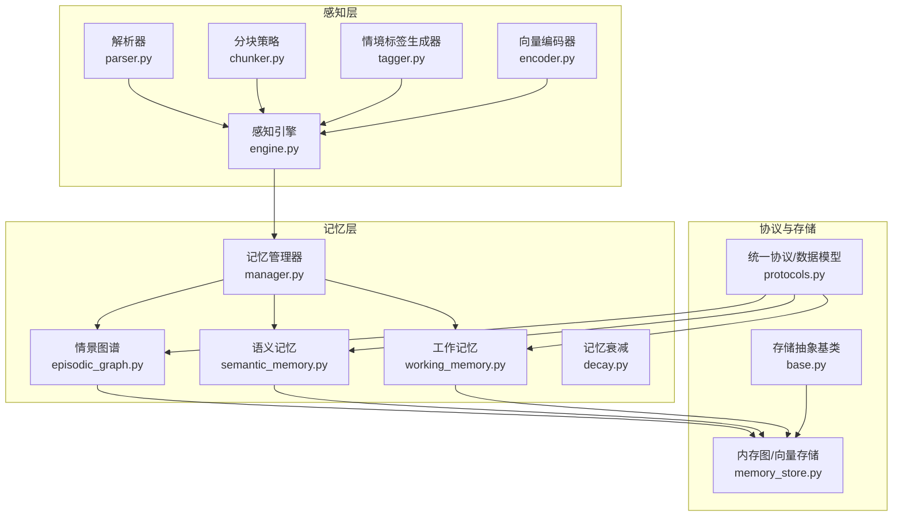
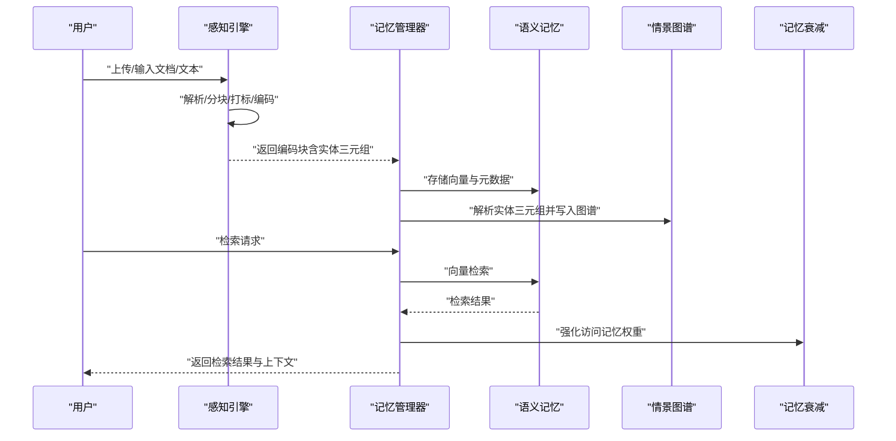
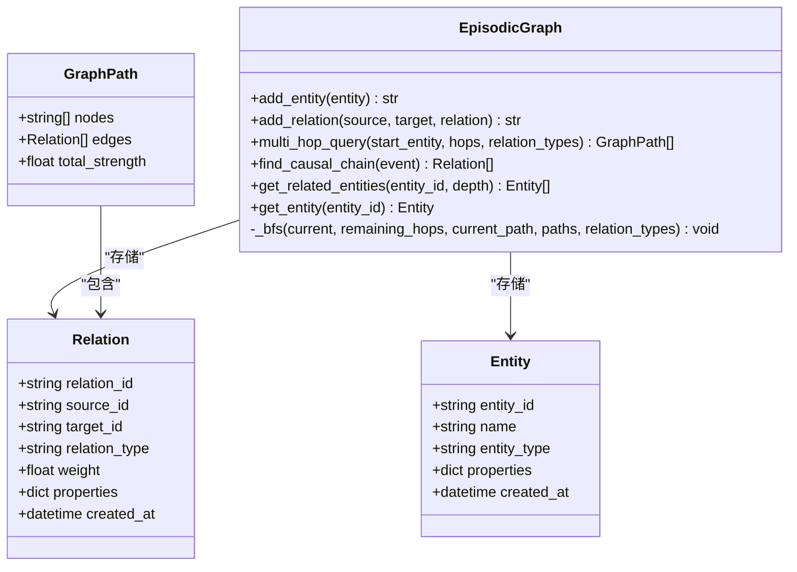
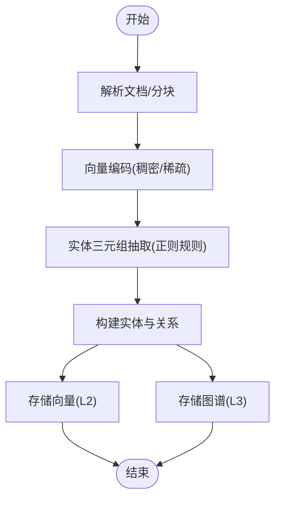
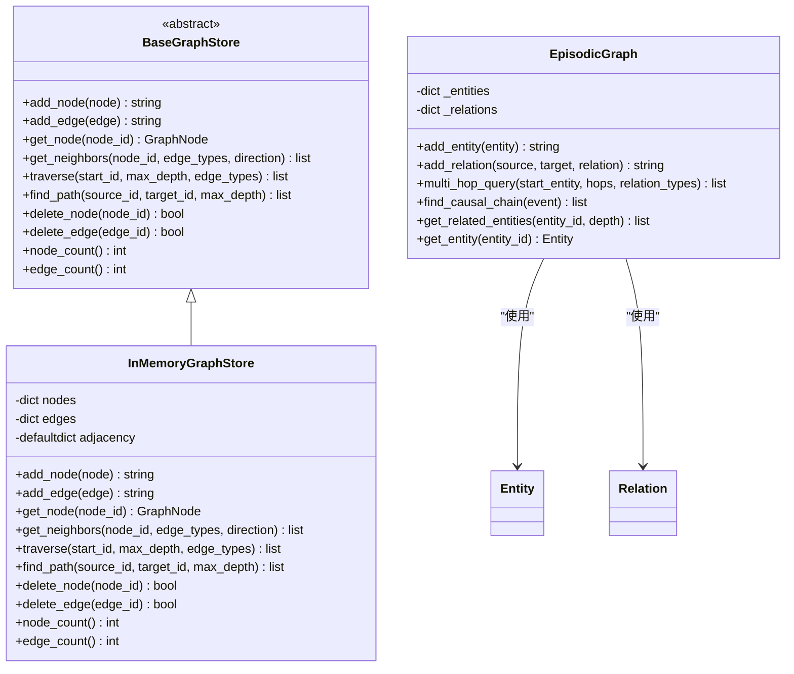
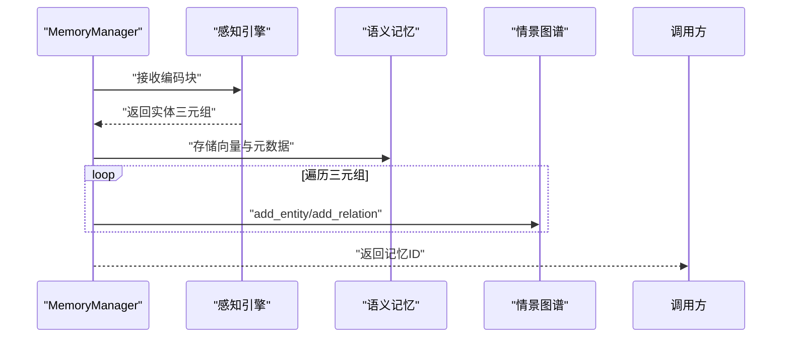
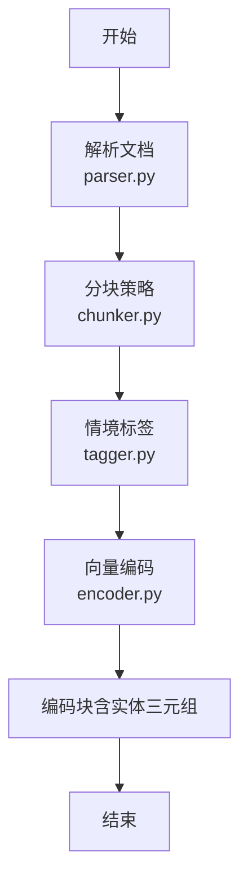
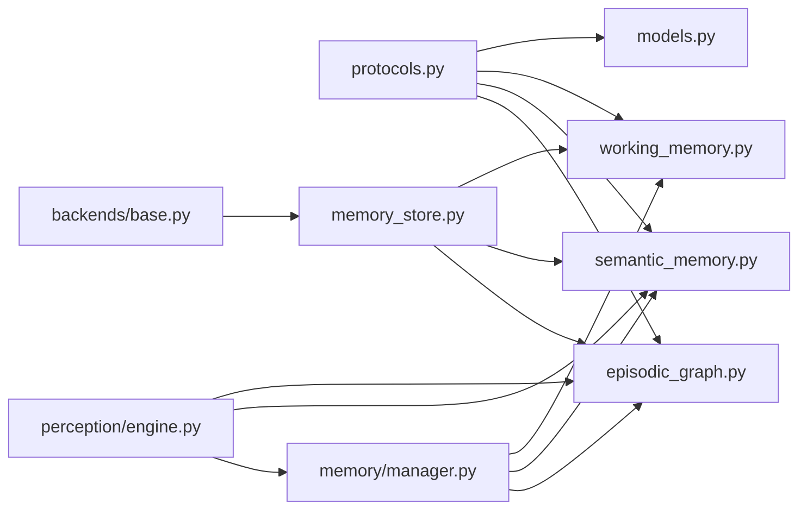

# 情景图谱管理

<cite>
**本文引用的文件**
- [episodic_graph.py](file://src/memory/episodic_graph.py)
- [models.py](file://src/memory/models.py)
- [manager.py](file://src/memory/manager.py)
- [semantic_memory.py](file://src/memory/semantic_memory.py)
- [working_memory.py](file://src/memory/working_memory.py)
- [encoder.py](file://src/perception/encoder.py)
- [protocols.py](file://src/core/protocols.py)
- [base.py](file://src/memory/backends/base.py)
- [memory_store.py](file://src/memory/backends/memory_store.py)
- [config.py](file://src/core/config.py)
- [retriever.py](file://src/retrieval/retriever.py)
- [L3情景图谱（图数据库）.md](file://wiki/wiki/记忆管理层/L3情景图谱（图数据库）.md)
- [情景图谱 (L3).md](file://wiki/wiki/核心架构设计/五层认知架构/记忆层 (L2)/情景图谱 (L3).md)
</cite>

## 目录
1. [简介](#简介)
2. [项目结构](#项目结构)
3. [核心组件](#核心组件)
4. [架构总览](#架构总览)
5. [详细组件分析](#详细组件分析)
6. [依赖分析](#依赖分析)
7. [性能考量](#性能考量)
8. [故障排查指南](#故障排查指南)
9. [结论](#结论)
10. [附录](#附录)

## 简介
本文件聚焦于 NecoRAG 项目中的 L3 情景图谱（图数据库）模块，系统阐述其作为“关系记忆”的实现方式：从感知层抽取实体与关系，到 L3 图谱的存储与检索；解释图数据库的节点与边模型、实体类型与关系强度的建模；梳理扩散激活理论在检索中的应用与多跳推理的实现；并给出图谱配置、实体抽取算法与关系建模的最佳实践，以及查询优化与大规模图处理的解决方案。

## 项目结构
围绕 L3 情景图谱，核心代码分布在以下模块：
- 记忆层：工作记忆（L1）、语义记忆（L2）、情景图谱（L3）
- 感知层：文档解析、分块策略、情境标签、向量编码与实体抽取
- 协议层：统一的数据模型与枚举（实体、关系、记忆层等）
- 存储层：BaseVectorStore/BaseGraphStore 抽象与 InMemoryVectorStore/InMemoryGraphStore 内存实现

**图表来源**
- [情景图谱 (L3).md:48-94](file://wiki/wiki/核心架构设计/五层认知架构/记忆层 (L2)/情景图谱 (L3).md#L48-L94)

**章节来源**
- [情景图谱 (L3).md:42-104](file://wiki/wiki/核心架构设计/五层认知架构/记忆层 (L2)/情景图谱 (L3).md#L42-L104)

## 核心组件
- 情景图谱 EpisodicGraph：以内存字典与邻接表为核心的数据结构，支持实体添加、关系添加、多跳查询、因果链条追踪、相关实体检索与实体获取。
- 记忆管理器 MemoryManager：统一编排 L1/L2/L3，负责将感知层产出的实体三元组写入 L3 图谱，并协调语义记忆与工作记忆。
- 语义记忆 SemanticMemory：内存向量存储，提供向量检索与混合检索接口（当前为最小实现）。
- 工作记忆 WorkingMemory：内存会话上下文与意图轨迹存储（最小实现）。
- 记忆衰减 MemoryDecay：基于时间与访问频率的权重衰减与归档策略。
- 感知引擎 PerceptionEngine：文档解析、分块、情境标签与向量编码的流水线。
- 存储抽象与内存实现：BaseVectorStore/BaseGraphStore 抽象与 InMemoryVectorStore/InMemoryGraphStore 内存实现。

**章节来源**
- [情景图谱 (L3).md:106-124](file://wiki/wiki/核心架构设计/五层认知架构/记忆层 (L2)/情景图谱 (L3).md#L106-L124)

## 架构总览
情景图谱（L3）在整体系统中的定位与交互如下：

**图表来源**
- [情景图谱 (L3).md:128-146](file://wiki/wiki/核心架构设计/五层认知架构/记忆层 (L2)/情景图谱 (L3).md#L128-L146)

## 详细组件分析

### 图数据库节点与边模型
- 节点（Entity）：包含实体 ID、名称、类型与属性字典，用于描述知识图谱中的实体。
- 边（Relation）：包含源 ID、目标 ID、关系类型与强度，用于表达实体间的关系。
- 图路径（GraphPath）：记录一次多跳查询的节点序列与边序列，以及路径总强度。

**图表来源**
- [models.py:28-43](file://src/memory/models.py#L28-L43)
- [episodic_graph.py:10-194](file://src/memory/episodic_graph.py#L10-L194)
- [protocols.py:180-200](file://src/core/protocols.py#L180-L200)

**章节来源**
- [models.py:28-43](file://src/memory/models.py#L28-L43)
- [episodic_graph.py:10-194](file://src/memory/episodic_graph.py#L10-L194)
- [protocols.py:180-200](file://src/core/protocols.py#L180-L200)

### 实体识别与关系抽取
- 实体识别：感知引擎对文档进行解析与分块，随后由向量编码器抽取实体三元组（主体、关系、客体）。当前实现采用正则规则匹配简单句式，如“X是Y”、“X属于Y”等。
- 关系建模：抽取得到的关系类型映射到 Relation.relation_type，强度默认为 1.0，可扩展为基于置信度或统计强度的数值。

**图表来源**
- [encoder.py:149-190](file://src/perception/encoder.py#L149-L190)
- [manager.py:83-113](file://src/memory/manager.py#L83-L113)

**章节来源**
- [encoder.py:149-190](file://src/perception/encoder.py#L149-L190)
- [manager.py:83-113](file://src/memory/manager.py#L83-L113)

### 图结构存储与查询
- 内存图存储：InMemoryGraphStore 提供节点/边增删、邻居查询、BFS 遍历与路径查找，适合作为开发/测试场景的原型实现。
- L3 情景图谱：EpisodicGraph 以内存字典与邻接表组织实体与关系，支持多跳查询与因果链追踪；当前实现为简化版 BFS，后续可扩展为带权重的 Dijkstra/BFS 或图遍历优化。

**图表来源**
- [base.py:150-314](file://src/memory/backends/base.py#L150-L314)
- [memory_store.py:143-381](file://src/memory/backends/memory_store.py#L143-L381)
- [episodic_graph.py:10-194](file://src/memory/episodic_graph.py#L10-L194)

**章节来源**
- [base.py:150-314](file://src/memory/backends/base.py#L150-L314)
- [memory_store.py:143-381](file://src/memory/backends/memory_store.py#L143-L381)
- [episodic_graph.py:10-194](file://src/memory/episodic_graph.py#L10-L194)

### 记忆管理器 MemoryManager（统一编排）
- 职责
  - 将感知层的编码块写入 L2 语义记忆与 L3 情景图谱
  - 统一检索与衰减控制
- 关键流程
  - 存储：创建 MemoryItem，写入语义向量，解析实体三元组并写入图谱
  - 检索：向量检索并强化访问记忆权重
  - 巩固/遗忘：应用衰减、归档低权重记忆

**图表来源**
- [manager.py:52-123](file://src/memory/manager.py#L52-L123)

**章节来源**
- [manager.py:52-123](file://src/memory/manager.py#L52-L123)

### 语义记忆 SemanticMemory（L2）
- 能力
  - 存储向量与元数据
  - 向量检索（余弦相似度）
  - 混合检索接口（预留）
- 设计
  - 内存字典模拟向量数据库
  - 提供元数据更新与删除

**章节来源**
- [semantic_memory.py:21-179](file://src/memory/semantic_memory.py#L21-L179)

### 工作记忆 WorkingMemory（L1）
- 能力
  - 会话上下文存储与获取
  - 用户意图轨迹跟踪
  - 会话清理与存在性检查
- 设计
  - 内存字典模拟 Redis 行为（最小实现）

**章节来源**
- [working_memory.py:11-120](file://src/memory/working_memory.py#L11-L120)

### 记忆衰减 MemoryDecay
- 能力
  - 权重衰减计算（指数衰减 × 访问频率）
  - 批量应用衰减
  - 归档低权重记忆
  - 强化访问记忆
- 设计
  - 可配置衰减速率与归档阈值

**章节来源**
- [情景图谱 (L3).md:279-289](file://wiki/wiki/核心架构设计/五层认知架构/记忆层 (L2)/情景图谱 (L3).md#L279-L289)

### 感知引擎 PerceptionEngine 与数据管线
- 能力
  - 文档解析、分块、情境标签、向量编码
  - 统一处理入口（文件/文本）
- 关键点
  - 分块策略支持弹性/语义/固定/结构化/句子级
  - 情境标签包含时间、情感、重要性、主题
  - 向量编码同时产出稠密向量、稀疏向量与实体三元组

**图表来源**
- [情景图谱 (L3).md:300-316](file://wiki/wiki/核心架构设计/五层认知架构/记忆层 (L2)/情景图谱 (L3).md#L300-L316)

**章节来源**
- [情景图谱 (L3).md:291-322](file://wiki/wiki/核心架构设计/五层认知架构/记忆层 (L2)/情景图谱 (L3).md#L291-L322)

### 存储抽象与内存实现
- 抽象基类
  - BaseVectorStore：upsert/search/get/delete/count
  - BaseGraphStore：add_node/add_edge/get_node/get_neighbors/traverse/find_path/delete_node/delete_edge/node_count/edge_count/search_nodes
- 内存实现
  - InMemoryVectorStore：余弦相似度、元数据过滤、阈值筛选
  - InMemoryGraphStore：邻接表、BFS 遍历、BFS 路径查找、节点/边增删

**章节来源**
- [base.py:61-314](file://src/memory/backends/base.py#L61-L314)
- [memory_store.py:20-381](file://src/memory/backends/memory_store.py#L20-L381)

### Neo4j 图数据库集成与 Cypher 查询
- 集成方式
  - 当前实现为内存图存储，提供 BaseGraphStore 抽象接口，便于替换为 Neo4j 或 NebulaGraph 等外部图数据库。
  - 配置层支持 GraphDBProvider 枚举，包含 MEMORY、NEO4J、NEBULA 三种提供方。
- Cypher 查询语言使用
  - 实体识别与关系抽取：通过正则规则匹配简单句式，如“X是Y”、“X属于Y”等，映射到关系类型。
  - 多跳推理：基于 BFS 的多跳查询，支持关系类型过滤与路径强度聚合。
  - 复杂关系分析：支持因果链条追踪（causes/leads_to/results_in），结合时间标签与上下文标签提升可信度。
- 多跳推理算法
  - 当前实现为简化版 BFS，后续可扩展为带权重的 Dijkstra/BFS 或图遍历优化。
  - 提供 GraphPath 封装路径节点与边序列，支持路径强度聚合与去重。

**章节来源**
- [config.py:36-41](file://src/core/config.py#L36-L41)
- [config.py:148-151](file://src/core/config.py#L148-L151)
- [episodic_graph.py:71-147](file://src/memory/episodic_graph.py#L71-L147)
- [retriever.py:390-422](file://src/retrieval/retriever.py#L390-L422)

## 依赖分析
- 模块耦合
  - MemoryManager 依赖感知层产物（EncodedChunk）与三层记忆组件
  - EpisodicGraph 依赖统一协议层的 Entity/Relation/GraphPath
  - SemanticMemory/WorkingMemory 依赖 MemoryItem/协议层枚举
  - 感知层各组件通过统一模型（Chunk/EncodedChunk/ContextTag）解耦
- 外部依赖
  - 可插拔 LLM 客户端（Mock 实现可用）
  - 存储层可替换（当前为内存实现，抽象清晰）

**图表来源**
- [情景图谱 (L3).md:346-373](file://wiki/wiki/核心架构设计/五层认知架构/记忆层 (L2)/情景图谱 (L3).md#L346-L373)

**章节来源**
- [情景图谱 (L3).md:336-384](file://wiki/wiki/核心架构设计/五层认知架构/记忆层 (L2)/情景图谱 (L3).md#L336-L384)

## 性能考量
- 存储层
  - 内存向量/图存储适合小规模与开发测试；生产建议接入外部向量库（如 Qdrant/Milvus）与图数据库（Neo4j/NebulaGraph），以获得更高吞吐与持久化能力。
- 检索与遍历
  - 向量检索采用余弦相似度，建议在大规模场景引入近似最近邻索引（如 HNSW）与向量压缩技术。
  - 图遍历与路径查找采用 BFS，建议设置最大深度与剪枝策略，避免组合爆炸。
- 记忆衰减
  - 衰减与强化策略可降低无效检索开销，提升热点知识召回效率。
- 分块与标签
  - 弹性分块与语义边界有助于提升检索质量；建议结合领域特征调整边界优先级与重叠策略。

**章节来源**
- [情景图谱 (L3).md:386-396](file://wiki/wiki/核心架构设计/五层认知架构/记忆层 (L2)/情景图谱 (L3).md#L386-L396)

## 故障排查指南
- 图谱构建异常
  - 检查实体三元组是否正确生成（编码器实体抽取规则较为简单，必要时接入更强的 NLP 模块）。
  - 确认实体 ID 唯一性与关系方向（source/target）。
- 检索结果为空
  - 检查向量维度与查询向量维度一致。
  - 调整相似度阈值与 top_k。
- 图遍历/路径查找超时
  - 降低最大深度或增加关系类型过滤。
  - 对大型图谱考虑索引与缓存策略。
- 记忆归档过多
  - 调整衰减速率与归档阈值，或减少强化因子。

**章节来源**
- [semantic_memory.py:80-118](file://src/memory/semantic_memory.py#L80-L118)
- [memory_store.py:55-91](file://src/memory/backends/memory_store.py#L55-L91)
- [episodic_graph.py:71-125](file://src/memory/episodic_graph.py#L71-L125)
- [memory_store.py:215-278](file://src/memory/backends/memory_store.py#L215-L278)
- [情景图谱 (L3).md:397-416](file://wiki/wiki/核心架构设计/五层认知架构/记忆层 (L2)/情景图谱 (L3).md#L397-L416)

## 结论
NecoRAG 的 L3 情景图谱以“内存图存储 + 统一协议 + 分层记忆”为核心，实现了从感知到记忆再到推理的闭环。其优势在于：
- 明确的三层记忆分工与统一协议，便于扩展与替换存储后端
- 清晰的实体关系建模与图遍历算法，满足多跳推理与因果链条追踪
- 可插拔的感知与存储实现，兼顾开发效率与生产可用性

建议后续重点：
- 接入外部图数据库与向量库，提升可扩展性
- 增强实体抽取与关系抽取的准确性与领域适配
- 引入图索引与缓存策略，优化大规模图谱的查询性能

## 附录

### 图谱构建示例（步骤说明）
- 输入：一段文本或解析后的文档
- 步骤：
  1) 文档解析与分块
  2) 情境标签生成
  3) 向量编码（稠密/稀疏）
  4) 实体三元组抽取
  5) 写入语义记忆（L2）
  6) 写入情景图谱（L3）：添加实体与关系
- 输出：可检索的向量与可推理的图谱

**章节来源**
- [情景图谱 (L3).md:430-446](file://wiki/wiki/核心架构设计/五层认知架构/记忆层 (L2)/情景图谱 (L3).md#L430-L446)

### 复杂关系查询最佳实践
- 多跳查询
  - 明确起始实体与跳数上限，按需过滤关系类型
  - 对路径结果进行强度聚合与去重
- 因果链条
  - 基于预定义关系类型集合（如 causes/leads_to/results_in）进行追踪
  - 结合时间标签与上下文标签，提升因果链可信度
- 图遍历
  - 设置最大深度与访问去重，避免无限循环
  - 按方向（入边/出边/双向）与边类型过滤，缩小搜索空间

**章节来源**
- [episodic_graph.py:71-147](file://src/memory/episodic_graph.py#L71-L147)
- [memory_store.py:215-246](file://src/memory/backends/memory_store.py#L215-L246)