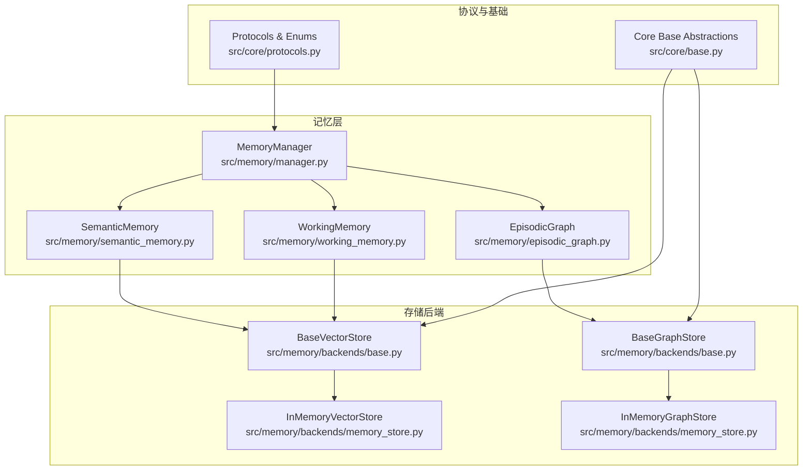
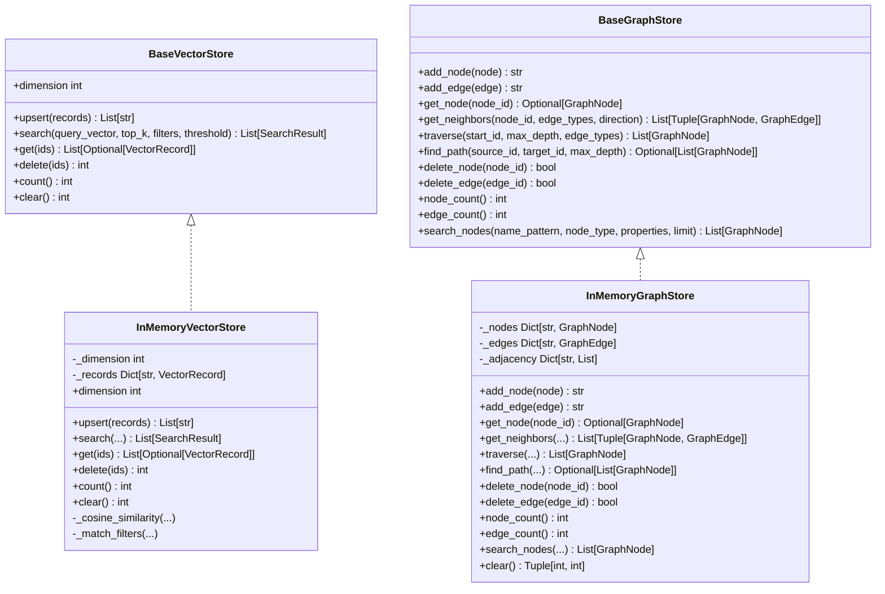
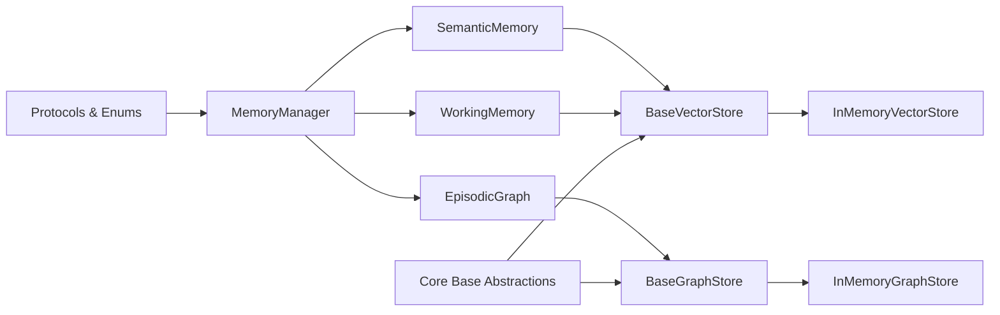

# 记忆存储后端

<cite>
**本文档引用的文件**
- [src/memory/backends/base.py](file://src/memory/backends/base.py)
- [src/memory/backends/memory_store.py](file://src/memory/backends/memory_store.py)
- [src/memory/manager.py](file://src/memory/manager.py)
- [src/memory/models.py](file://src/memory/models.py)
- [src/memory/semantic_memory.py](file://src/memory/semantic_memory.py)
- [src/memory/working_memory.py](file://src/memory/working_memory.py)
- [src/memory/episodic_graph.py](file://src/memory/episodic_graph.py)
- [src/memory/README.md](file://src/memory/README.md)
- [src/core/base.py](file://src/core/base.py)
- [src/core/protocols.py](file://src/core/protocols.py)
- [example/example_usage.py](file://example/example_usage.py)
</cite>

## 目录
1. [简介](#简介)
2. [项目结构](#项目结构)
3. [核心组件](#核心组件)
4. [架构总览](#架构总览)
5. [详细组件分析](#详细组件分析)
6. [依赖关系分析](#依赖关系分析)
7. [性能考量](#性能考量)
8. [故障排查指南](#故障排查指南)
9. [结论](#结论)
10. [附录](#附录)

## 简介
本文件面向“记忆存储后端”模块，系统阐述三层记忆体系（工作记忆、语义记忆、情景图谱）的统一抽象与具体实现，重点说明向量存储与图存储的接口设计、内存实现与扩展机制、数据序列化与并发控制、以及自定义存储后端的开发指南与最佳实践。文档同时给出与感知层、检索层、巩固层的集成关系，帮助读者在真实项目中正确选择与配置存储后端。

## 项目结构
记忆存储后端位于 src/memory/backends 目录，采用“抽象基类 + 内存实现”的双层设计，向上承接记忆管理层，向下为具体存储提供统一接口。核心文件如下：
- 抽象层：src/memory/backends/base.py
- 内存实现：src/memory/backends/memory_store.py
- 记忆管理层：src/memory/manager.py
- 记忆模型：src/memory/models.py
- 语义记忆（向量层）：src/memory/semantic_memory.py
- 工作记忆（会话层）：src/memory/working_memory.py
- 情景图谱（图层）：src/memory/episodic_graph.py
- 统一协议与枚举：src/core/protocols.py
- 核心抽象基类：src/core/base.py
- 使用示例：example/example_usage.py

图表来源
- [src/memory/manager.py:16-195](file://src/memory/manager.py#L16-L195)
- [src/memory/backends/base.py:61-312](file://src/memory/backends/base.py#L61-L312)
- [src/memory/backends/memory_store.py:20-381](file://src/memory/backends/memory_store.py#L20-L381)
- [src/core/base.py:211-384](file://src/core/base.py#L211-L384)
- [src/core/protocols.py:36-298](file://src/core/protocols.py#L36-L298)

章节来源
- [src/memory/README.md:1-244](file://src/memory/README.md#L1-L244)
- [src/memory/backends/base.py:1-312](file://src/memory/backends/base.py#L1-L312)
- [src/memory/backends/memory_store.py:1-381](file://src/memory/backends/memory_store.py#L1-L381)

## 核心组件
- 抽象存储接口
  - BaseVectorStore：定义向量存储的统一接口，包括 upsert、search、get、delete、count、dimension 等方法。
  - BaseGraphStore：定义图存储的统一接口，包括 add_node、add_edge、get_node、get_neighbors、traverse、find_path、delete_node、delete_edge、node_count、edge_count 等方法。
- 内存存储实现
  - InMemoryVectorStore：基于内存的向量存储，支持维度校验、余弦相似度搜索、元数据过滤、阈值过滤等。
  - InMemoryGraphStore：基于内存的图存储，支持邻接表、BFS 遍历、路径查找、节点/边删除等。
- 记忆管理层
  - MemoryManager：统一管理三层记忆，负责存储、检索、巩固与主动遗忘；当前以内存模拟各层存储。
- 记忆模型
  - MemoryItem：记忆项数据模型，包含内容、层级、向量、元数据、权重、访问计数等。
- 协议与枚举
  - MemoryLayer、Entity、Relation 等统一数据类型，确保模块间数据交换一致。

章节来源
- [src/memory/backends/base.py:61-312](file://src/memory/backends/base.py#L61-L312)
- [src/memory/backends/memory_store.py:20-381](file://src/memory/backends/memory_store.py#L20-L381)
- [src/memory/manager.py:16-195](file://src/memory/manager.py#L16-L195)
- [src/memory/models.py:14-43](file://src/memory/models.py#L14-L43)
- [src/core/protocols.py:36-298](file://src/core/protocols.py#L36-L298)

## 架构总览
记忆存储后端采用“抽象接口 + 内存实现”的设计，向上对齐记忆管理层，向下为外部存储（如 Redis、Qdrant、Neo4j）预留扩展点。当前示例中，MemoryManager 通过 WorkingMemory、SemanticMemory、EpisodicGraph 使用内存存储作为最小可用实现；未来可替换为对应的真实存储客户端。

图表来源
- [src/memory/backends/base.py:61-312](file://src/memory/backends/base.py#L61-L312)
- [src/memory/backends/memory_store.py:20-381](file://src/memory/backends/memory_store.py#L20-L381)

## 详细组件分析

### 抽象存储接口设计
- 设计原则
  - 统一抽象：通过继承核心抽象基类，确保向量与图存储接口一致，便于替换与扩展。
  - 方法完备：覆盖增删改查、统计、清空等常用操作，满足典型检索与推理需求。
  - 可选实现：部分方法默认抛出未实现异常，鼓励具体实现按需覆盖。
- 关键方法说明
  - 向量存储：upsert、search（支持 top_k、filters、threshold）、get、delete、count、clear、dimension。
  - 图存储：add_node、add_edge、get_node、get_neighbors（支持方向过滤）、traverse（BFS）、find_path（BFS）、delete_node、delete_edge、node_count、edge_count、search_nodes（可选）。

章节来源
- [src/memory/backends/base.py:61-312](file://src/memory/backends/base.py#L61-L312)
- [src/core/base.py:211-384](file://src/core/base.py#L211-L384)

### 内存存储实现对比
- InMemoryVectorStore
  - 特性：内存字典存储、维度校验、余弦相似度、元数据过滤、阈值过滤、排序截断。
  - 适用场景：开发测试、小规模数据、快速原型验证。
  - 性能特征：O(n) 搜索，适合小样本；可扩展为索引加速。
- InMemoryGraphStore
  - 特性：邻接表、BFS 遍历、路径查找、节点/边删除、节点/边计数、可选节点搜索。
  - 适用场景：开发测试、小规模图谱、原型验证。
  - 性能特征：邻接表 O(deg) 查询，适合中小规模图谱；可扩展为图数据库。

章节来源
- [src/memory/backends/memory_store.py:20-381](file://src/memory/backends/memory_store.py#L20-L381)

### 记忆管理层与存储后端的集成
- MemoryManager
  - 统一管理三层记忆：WorkingMemory、SemanticMemory、EpisodicGraph。
  - 存储流程：将 EncodedChunk 转换为 MemoryItem，写入 L2 语义向量存储，同时构建 L3 图谱实体与关系。
  - 检索流程：根据查询向量在 L2 语义层检索，结合统一存储进行结果强化与返回。
  - 巩固与遗忘：基于权重衰减机制，定期归档低价值记忆，维持知识新鲜度。
- 与存储后端的关系
  - WorkingMemory：当前以内存字典模拟 Redis，支持会话上下文与意图轨迹跟踪。
  - SemanticMemory：当前以内存字典模拟向量数据库，支持向量检索与元数据更新。
  - EpisodicGraph：当前以内存字典模拟图数据库，支持实体关系与多跳查询。

章节来源
- [src/memory/manager.py:16-195](file://src/memory/manager.py#L16-L195)
- [src/memory/semantic_memory.py:21-179](file://src/memory/semantic_memory.py#L21-L179)
- [src/memory/working_memory.py:11-120](file://src/memory/working_memory.py#L11-L120)
- [src/memory/episodic_graph.py:10-194](file://src/memory/episodic_graph.py#L10-L194)

### 数据模型与序列化
- MemoryItem：统一记忆项数据模型，包含内容、层级、向量、元数据、权重、访问计数、时间戳等。
- Protocols：统一枚举与数据类（MemoryLayer、Entity、Relation 等），确保跨模块数据一致性。
- 序列化建议
  - 向量：使用 numpy 数组或列表，注意 dtype 与精度。
  - 元数据：使用字典结构，避免复杂对象直接序列化。
  - 时间戳：统一使用 datetime，便于跨模块比较与排序。

章节来源
- [src/memory/models.py:14-43](file://src/memory/models.py#L14-L43)
- [src/core/protocols.py:36-298](file://src/core/protocols.py#L36-L298)

### 并发控制机制
- 现状
  - 内存实现未引入锁或并发控制，适合单线程或本地测试场景。
- 建议
  - 多线程：为共享状态（字典、列表）增加读写锁或使用线程安全容器。
  - 多进程：使用进程池或分布式锁，避免竞态条件。
  - 异步：在异步环境中使用 asyncio.Lock 或 aiofiles 等异步工具。

章节来源
- [src/memory/backends/memory_store.py:20-381](file://src/memory/backends/memory_store.py#L20-L381)

### 自定义存储后端开发指南
- 实现步骤
  - 继承抽象基类：实现 BaseVectorStore 或 BaseGraphStore 的全部抽象方法。
  - 数据模型映射：将内部数据模型（如 MemoryItem、Entity、Relation）映射到目标存储的数据结构。
  - 错误处理：捕获并转换底层异常为统一的业务异常，提供清晰的错误信息。
  - 性能优化：根据目标存储特性实现批量写入、索引构建、查询缓存等。
- 接口实现要点
  - 向量存储：确保维度一致、支持过滤与阈值、提供高效相似度计算。
  - 图存储：维护邻接关系、支持遍历与路径查找、提供原子性删除。
- 配置与部署
  - 通过构造函数注入连接参数（如 URL、凭据、超时等）。
  - 支持环境变量与配置文件，便于在不同环境切换。

章节来源
- [src/memory/backends/base.py:61-312](file://src/memory/backends/base.py#L61-L312)
- [src/core/base.py:211-384](file://src/core/base.py#L211-L384)

### 存储后端选择与配置最佳实践
- 选择依据
  - L1 工作记忆：优先 Redis，要求低延迟与 TTL 过期；若无 Redis，可使用 InMemoryVectorStore 作为替代。
  - L2 语义记忆：优先 Qdrant/Milvus，要求高维向量检索与索引能力；若无外部服务，可使用 InMemoryVectorStore 作为替代。
  - L3 情景图谱：优先 Neo4j/NebulaGraph，要求图查询与多跳推理；若无外部服务，可使用 InMemoryGraphStore 作为替代。
- 配置建议
  - L1：合理设置 TTL 与会话上限，避免内存膨胀。
  - L2：根据向量维度与数据规模选择合适的索引类型与参数。
  - L3：根据图规模与查询深度设置最大遍历深度与关系类型过滤。
- 迁移策略
  - 以抽象接口为边界，逐步替换内存实现为真实存储，保持上层调用不变。
  - 在迁移过程中保留统一的错误处理与日志输出，便于问题定位。

章节来源
- [src/memory/README.md:194-244](file://src/memory/README.md#L194-L244)
- [src/memory/manager.py:23-47](file://src/memory/manager.py#L23-L47)

## 依赖关系分析
- 模块耦合
  - MemoryManager 依赖 WorkingMemory、SemanticMemory、EpisodicGraph；这些组件当前以内存实现为主，耦合度较低。
  - 存储后端通过抽象接口与核心模块解耦，便于替换。
- 外部依赖
  - 当前未引入 Redis、Qdrant、Neo4j 等外部库，使用内存模拟实现。
  - 建议在真实部署时引入对应客户端库，并在构造函数中注入连接参数。

图表来源
- [src/memory/manager.py:16-195](file://src/memory/manager.py#L16-L195)
- [src/memory/backends/base.py:61-312](file://src/memory/backends/base.py#L61-L312)
- [src/memory/backends/memory_store.py:20-381](file://src/memory/backends/memory_store.py#L20-L381)
- [src/core/base.py:211-384](file://src/core/base.py#L211-L384)
- [src/core/protocols.py:36-298](file://src/core/protocols.py#L36-L298)

章节来源
- [src/memory/manager.py:16-195](file://src/memory/manager.py#L16-L195)
- [src/memory/backends/base.py:61-312](file://src/memory/backends/base.py#L61-L312)

## 性能考量
- 内存实现性能
  - 向量检索：当前为 O(n) 搜索，适合小规模数据；建议引入索引（如 HNSW）提升大规模检索性能。
  - 图遍历：BFS 为 O(V+E)，适合中小规模图谱；建议使用邻接矩阵或外部图数据库优化。
- 并发与资源
  - 单线程场景下性能稳定；多线程或多进程需考虑锁与共享状态。
  - 控制会话数量与 TTL，避免内存占用过高。
- 扩展建议
  - 向量存储：引入批量写入、异步索引、缓存预热。
  - 图存储：引入图分区、增量索引、查询计划优化。

[本节为通用性能讨论，不直接分析具体文件]

## 故障排查指南
- 常见问题
  - 向量维度不匹配：检查输入向量维度与存储维度是否一致。
  - 节点/边不存在：确认节点 ID 是否存在，边两端节点是否已添加。
  - 检索结果为空：检查阈值、过滤条件与数据量。
- 日志与监控
  - 记录关键操作（写入、删除、检索）的时间与结果，便于定位性能瓶颈。
  - 对异常进行分类记录，区分业务异常与系统异常。
- 修复建议
  - 维度校验：在 upsert/search 前进行维度检查，提前报错。
  - 边界检查：在图操作前检查节点存在性，避免无效操作。
  - 资源清理：定期清理过期会话与低价值记忆，释放内存。

章节来源
- [src/memory/backends/memory_store.py:41-140](file://src/memory/backends/memory_store.py#L41-L140)
- [src/memory/backends/memory_store.py:157-320](file://src/memory/backends/memory_store.py#L157-L320)

## 结论
记忆存储后端通过抽象接口与内存实现，提供了清晰的扩展边界与统一的数据模型。当前实现适合开发与测试，生产环境建议替换为 Redis、Qdrant、Neo4j 等真实存储，并结合批量写入、索引优化与并发控制提升性能与稳定性。遵循本文档的接口规范与最佳实践，可平滑完成存储后端的替换与升级。

[本节为总结性内容，不直接分析具体文件]

## 附录

### API 方法定义与行为约定
- 向量存储
  - upsert：插入或更新记录，返回成功 ID 列表。
  - search：按相似度检索，支持 top_k、filters、threshold。
  - get：批量获取记录，不存在返回 None。
  - delete：按 ID 删除，返回删除数量。
  - count/clear/dimension：统计、清空、维度查询。
- 图存储
  - add_node/add_edge：添加节点/边，返回 ID。
  - get_node/get_neighbors：获取节点与邻居。
  - traverse/find_path：遍历与路径查找。
  - delete_node/delete_edge：删除节点/边。
  - node_count/edge_count：统计节点/边数量。
  - search_nodes（可选）：按名称、类型、属性过滤节点。

章节来源
- [src/memory/backends/base.py:61-312](file://src/memory/backends/base.py#L61-L312)

### 使用示例与集成路径
- 示例流程
  - 感知层编码：生成 EncodedChunk。
  - 记忆层存储：MemoryManager.store 写入语义与图谱。
  - 检索层检索：MemoryManager.retrieve 基于向量检索。
  - 巩固与遗忘：MemoryManager.consolidate/forget。
- 示例参考
  - [example/example_usage.py:50-91](file://example/example_usage.py#L50-L91)

章节来源
- [example/example_usage.py:50-91](file://example/example_usage.py#L50-L91)