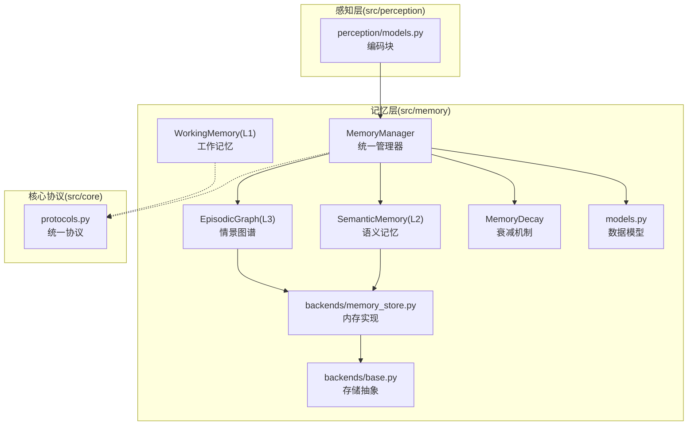
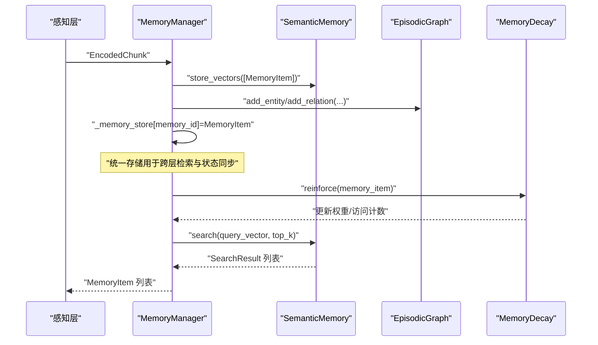
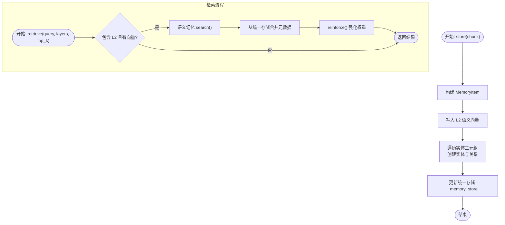
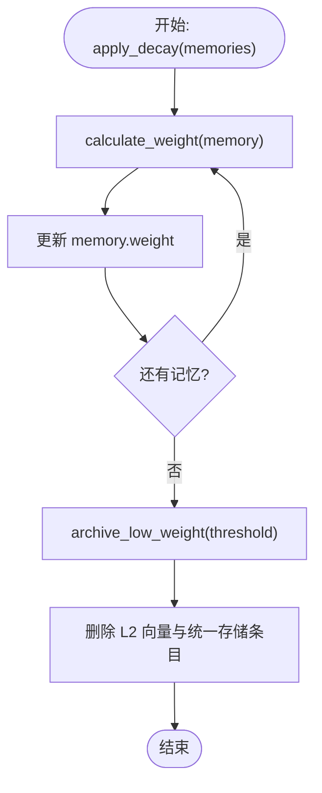
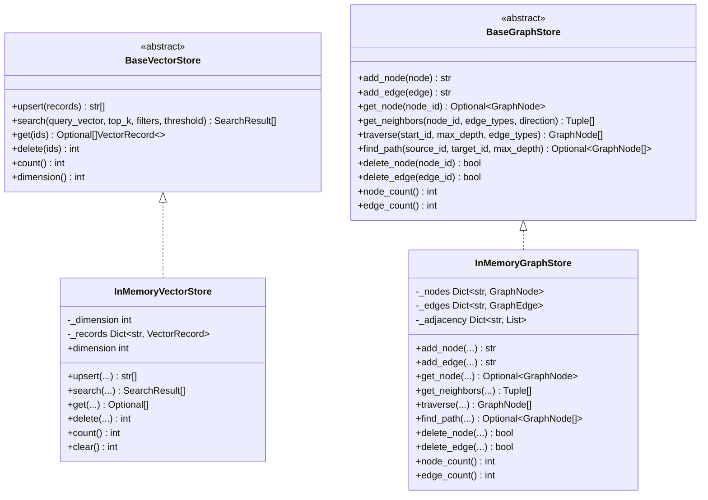
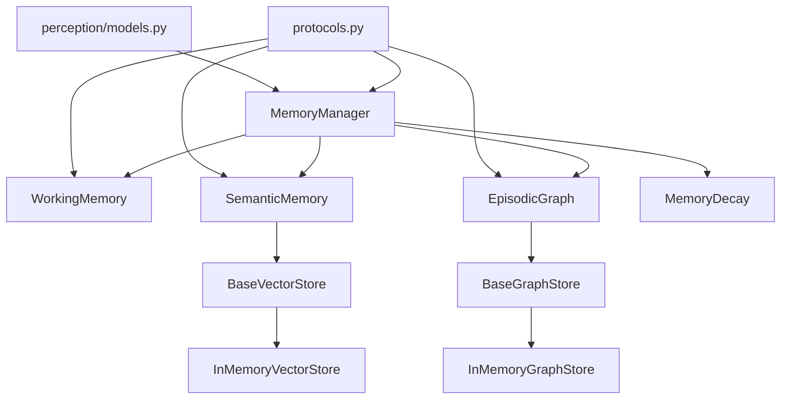

# 记忆管理器

<cite>
**本文引用的文件**
- [src/memory/manager.py](file://src/memory/manager.py)
- [src/memory/__init__.py](file://src/memory/__init__.py)
- [src/memory/models.py](file://src/memory/models.py)
- [src/memory/working_memory.py](file://src/memory/working_memory.py)
- [src/memory/semantic_memory.py](file://src/memory/semantic_memory.py)
- [src/memory/episodic_graph.py](file://src/memory/episodic_graph.py)
- [src/memory/decay.py](file://src/memory/decay.py)
- [src/memory/backends/base.py](file://src/memory/backends/base.py)
- [src/memory/backends/memory_store.py](file://src/memory/backends/memory_store.py)
- [src/core/protocols.py](file://src/core/protocols.py)
- [src/perception/models.py](file://src/perception/models.py)
- [example/example_usage.py](file://example/example_usage.py)
- [tests/test_memory/test_working_memory.py](file://tests/test_memory/test_working_memory.py)
- [tests/test_memory/test_decay.py](file://tests/test_memory/test_decay.py)
- [src/memory/README.md](file://src/memory/README.md)
</cite>

## 目录
1. [简介](#简介)
2. [项目结构](#项目结构)
3. [核心组件](#核心组件)
4. [架构总览](#架构总览)
5. [详细组件分析](#详细组件分析)
6. [依赖关系分析](#依赖关系分析)
7. [性能考量](#性能考量)
8. [故障排查指南](#故障排查指南)
9. [结论](#结论)
10. [附录](#附录)

## 简介
本文件为记忆管理器的详细技术文档，聚焦于统一三层记忆系统的架构设计与运行机制。记忆管理器通过协调 L1 工作记忆、L2 语义记忆与 L3 情景图谱，实现知识的存储、检索、巩固与主动遗忘的闭环流程。文档还涵盖跨层数据流转、状态同步策略、事务一致性保障思路、存储后端性能优化与故障恢复机制，并提供 API 参考、使用模式与最佳实践，帮助开发者构建稳定可靠的统一记忆系统。

## 项目结构
记忆管理层位于 src/memory 目录，包含管理器、三层记忆实现、衰减机制、存储后端抽象与内存实现、数据模型与协议等模块。上层感知模块提供编码后的文本块，作为记忆管理器的输入。

**图表来源**
- [src/memory/manager.py:20-212](file://src/memory/manager.py#L20-L212)
- [src/memory/working_memory.py:11-120](file://src/memory/working_memory.py#L11-L120)
- [src/memory/semantic_memory.py:21-179](file://src/memory/semantic_memory.py#L21-L179)
- [src/memory/episodic_graph.py:10-194](file://src/memory/episodic_graph.py#L10-L194)
- [src/memory/decay.py:11-155](file://src/memory/decay.py#L11-L155)
- [src/memory/models.py:14-43](file://src/memory/models.py#L14-L43)
- [src/memory/backends/base.py:61-314](file://src/memory/backends/base.py#L61-L314)
- [src/memory/backends/memory_store.py:20-381](file://src/memory/backends/memory_store.py#L20-L381)
- [src/perception/models.py:14-62](file://src/perception/models.py#L14-L62)
- [src/core/protocols.py:36-298](file://src/core/protocols.py#L36-L298)

**章节来源**
- [src/memory/README.md:1-244](file://src/memory/README.md#L1-L244)
- [src/memory/manager.py:20-212](file://src/memory/manager.py#L20-L212)
- [src/memory/__init__.py:6-29](file://src/memory/__init__.py#L6-L29)

## 核心组件
- 统一管理器：MemoryManager，负责三层记忆的统一调度、跨层检索、巩固与主动遗忘。
- 三层记忆：
  - L1 工作记忆：WorkingMemory，模拟瞬时上下文与意图轨迹，具备 TTL 与容量控制。
  - L2 语义记忆：SemanticMemory，高维向量存储与模糊检索，支持混合检索接口占位。
  - L3 情景图谱：EpisodicGraph，实体关系网络，支持多跳与因果链路追踪。
- 衰减机制：MemoryDecay，基于指数衰减与访问频率的动态权重管理，支持批量衰减与归档。
- 存储后端抽象与内存实现：BaseVectorStore/BaseGraphStore 与 InMemoryVectorStore/InMemoryGraphStore，向上对齐记忆管理器，向下为外部存储预留扩展点。
- 数据模型与协议：MemoryItem、Entity、Relation、MemoryLayer 等，确保模块间数据交换一致。

**章节来源**
- [src/memory/manager.py:20-212](file://src/memory/manager.py#L20-L212)
- [src/memory/working_memory.py:11-120](file://src/memory/working_memory.py#L11-L120)
- [src/memory/semantic_memory.py:21-179](file://src/memory/semantic_memory.py#L21-L179)
- [src/memory/episodic_graph.py:10-194](file://src/memory/episodic_graph.py#L10-L194)
- [src/memory/decay.py:11-155](file://src/memory/decay.py#L11-L155)
- [src/memory/models.py:14-43](file://src/memory/models.py#L14-L43)
- [src/memory/backends/base.py:61-314](file://src/memory/backends/base.py#L61-L314)
- [src/memory/backends/memory_store.py:20-381](file://src/memory/backends/memory_store.py#L20-L381)
- [src/core/protocols.py:36-298](file://src/core/protocols.py#L36-L298)

## 架构总览
记忆管理器采用“统一管理器 + 三层记忆 + 衰减机制 + 存储抽象”的分层架构。感知层提供编码后的文本块，统一管理器将其写入 L2 语义记忆与 L3 情景图谱，并在内存中维护统一索引；检索时优先利用 L2 向量检索与 L3 图谱推理，结合 L1 上下文进行融合；周期性执行衰减与巩固，维持知识的时效性与稳定性。

**图表来源**
- [src/memory/manager.py:52-159](file://src/memory/manager.py#L52-L159)
- [src/memory/semantic_memory.py:50-118](file://src/memory/semantic_memory.py#L50-L118)
- [src/memory/decay.py:120-142](file://src/memory/decay.py#L120-L142)

## 详细组件分析

### 统一记忆管理器（MemoryManager）
- 职责
  - 接收感知层编码块，构建 MemoryItem 并写入 L2 语义记忆与 L3 情景图谱。
  - 维护统一存储（内存字典），用于跨层检索与状态同步。
  - 提供检索接口，优先 L2 向量检索，命中后通过统一存储补充元数据并强化权重。
  - 提供巩固与主动遗忘接口，基于衰减机制批量归档低权重记忆。
- 关键流程
  - 存储：创建 MemoryItem，调用语义记忆向量存储，遍历实体三元组创建实体与关系，更新统一存储。
  - 检索：若指定查询向量且目标层级包含 L2，则调用语义记忆搜索，合并统一存储中的元数据并强化访问权重。
  - 巩固：应用衰减，识别归档集合，删除对应向量与统一存储条目。
  - 遗忘：按阈值主动归档并删除。
- 事务一致性与状态同步
  - 统一存储作为跨层检索与状态同步的中枢，所有检索命中均通过统一存储补充元数据并触发权重强化，确保 L2/L3 与统一存储之间的一致性。
  - 存储与图谱写入在单次 store 调用内顺序执行，失败时由上层感知层重试或补偿。

**图表来源**
- [src/memory/manager.py:52-159](file://src/memory/manager.py#L52-L159)
- [src/memory/semantic_memory.py:50-118](file://src/memory/semantic_memory.py#L50-L118)
- [src/memory/decay.py:120-142](file://src/memory/decay.py#L120-L142)

**章节来源**
- [src/memory/manager.py:20-212](file://src/memory/manager.py#L20-L212)
- [src/memory/README.md:179-192](file://src/memory/README.md#L179-L192)

### L1 工作记忆（WorkingMemory）
- 职责：存储当前会话上下文与用户意图轨迹，具备 TTL 与容量控制，模拟瞬时遗忘。
- 接口要点：添加上下文、获取上下文、跟踪意图、获取意图轨迹、清理会话、检查会话存在、清理过期（占位）。
- 注意：当前实现为内存字典模拟，TTL 过期检测为占位，生产环境建议接入 Redis 并实现过期与淘汰策略。

**章节来源**
- [src/memory/working_memory.py:11-120](file://src/memory/working_memory.py#L11-L120)
- [src/memory/README.md:41-46](file://src/memory/README.md#L41-L46)

### L2 语义记忆（SemanticMemory）
- 职责：高维向量存储与模糊检索，支持混合检索接口占位。
- 接口要点：批量存储向量、向量检索、混合检索（占位）、更新元数据、删除记忆。
- 当前实现：内存字典与简单余弦相似度，适合小规模与原型验证；后续可集成 Qdrant/Milvus 并引入 HNSW 索引。

**章节来源**
- [src/memory/semantic_memory.py:21-179](file://src/memory/semantic_memory.py#L21-L179)
- [src/memory/README.md:47-52](file://src/memory/README.md#L47-L52)

### L3 情景图谱（EpisodicGraph）
- 职责：实体关系网络，支持多跳查询与因果链追踪。
- 接口要点：添加实体、添加关系、多跳查询（BFS）、因果链查找、获取相关实体、获取实体。
- 当前实现：内存邻接表与 BFS，适合小规模与原型验证；后续可集成 Neo4j/NebulaGraph。

**章节来源**
- [src/memory/episodic_graph.py:10-194](file://src/memory/episodic_graph.py#L10-L194)
- [src/memory/README.md:53-61](file://src/memory/README.md#L53-L61)

### 衰减机制（MemoryDecay）
- 职责：模拟生物记忆的巩固与遗忘，基于指数衰减与访问频率动态调整权重。
- 关键方法：计算权重、批量衰减、归档低权重、强化权重、判断归档。
- 策略：低频访问降权、低于阈值自动归档、强化热点知识、限制最大权重。

**图表来源**
- [src/memory/decay.py:72-118](file://src/memory/decay.py#L72-L118)
- [src/memory/manager.py:161-202](file://src/memory/manager.py#L161-L202)

**章节来源**
- [src/memory/decay.py:11-155](file://src/memory/decay.py#L11-L155)
- [src/memory/README.md:62-81](file://src/memory/README.md#L62-L81)

### 存储后端抽象与内存实现
- 抽象接口：BaseVectorStore 与 BaseGraphStore 定义统一的向量与图存储接口，便于替换为真实外部存储。
- 内存实现：InMemoryVectorStore 与 InMemoryGraphStore 提供最小可用实现，支持维度校验、余弦相似度、邻接表、BFS 等。
- 设计优势：向上对齐记忆管理器，向下为 Redis/Qdrant/Neo4j 等后端预留扩展点。

**图表来源**
- [src/memory/backends/base.py:61-314](file://src/memory/backends/base.py#L61-L314)
- [src/memory/backends/memory_store.py:20-381](file://src/memory/backends/memory_store.py#L20-L381)

**章节来源**
- [src/memory/backends/base.py:61-314](file://src/memory/backends/base.py#L61-L314)
- [src/memory/backends/memory_store.py:20-381](file://src/memory/backends/memory_store.py#L20-L381)

### 数据模型与协议
- 数据模型：MemoryItem、GraphPath、Intent 等，承载记忆内容、权重、访问计数、实体关系等信息。
- 统一协议：MemoryLayer、Entity、Relation 等枚举与数据类，确保模块间数据交换一致。

**章节来源**
- [src/memory/models.py:14-43](file://src/memory/models.py#L14-L43)
- [src/core/protocols.py:36-298](file://src/core/protocols.py#L36-L298)

## 依赖关系分析
- 组件耦合
  - MemoryManager 与三层记忆实现松耦合，通过统一存储与协议进行交互。
  - WorkingMemory 与 SemanticMemory/EpisodicGraph 通过 MemoryManager 协调，不直接互相依赖。
  - MemoryDecay 与 MemoryManager 通过权重更新与归档流程耦合。
- 外部依赖
  - 存储抽象面向 Redis/Qdrant/Neo4j 等外部存储，当前以内存实现替代，便于替换。
  - 感知层提供 EncodedChunk 输入，统一管理器据此构建 MemoryItem 并写入三层记忆。

**图表来源**
- [src/memory/manager.py:20-212](file://src/memory/manager.py#L20-L212)
- [src/memory/backends/base.py:61-314](file://src/memory/backends/base.py#L61-L314)
- [src/memory/backends/memory_store.py:20-381](file://src/memory/backends/memory_store.py#L20-L381)
- [src/core/protocols.py:36-298](file://src/core/protocols.py#L36-L298)
- [src/perception/models.py:14-62](file://src/perception/models.py#L14-L62)

**章节来源**
- [src/memory/manager.py:20-212](file://src/memory/manager.py#L20-L212)
- [src/memory/__init__.py:6-29](file://src/memory/__init__.py#L6-L29)

## 性能考量
- 内存实现性能
  - 向量检索为 O(n) 搜索，适合小规模数据；建议引入索引（如 HNSW）提升大规模检索性能。
  - 图遍历 BFS 为 O(V+E)，适合中小规模图谱；建议使用邻接矩阵或外部图数据库优化。
- 并发与资源
  - 单线程场景下性能稳定；多线程或多进程需考虑锁与共享状态。
  - 控制会话数量与 TTL，避免内存占用过高。
- 扩展建议
  - 向量存储：引入批量写入、异步索引、缓存预热。
  - 图存储：引入图分区、增量索引、查询计划优化。
  - L1：接入 Redis 并实现 TTL 与 LRU 淘汰策略。

**章节来源**
- [src/memory/README.md:223-244](file://src/memory/README.md#L223-L244)
- [src/memory/backends/memory_store.py:116-140](file://src/memory/backends/memory_store.py#L116-L140)
- [src/memory/backends/memory_store.py:215-246](file://src/memory/backends/memory_store.py#L215-L246)

## 故障排查指南
- 存储失败
  - 现象：store 调用抛出异常。
  - 排查：检查编码块向量维度与语义记忆维度是否一致；确认实体三元组格式正确；查看日志错误堆栈。
- 检索为空
  - 现象：retrieve 返回空列表。
  - 排查：确认查询向量非空且与存储向量维度一致；检查统一存储中是否存在对应 memory_id；验证 L2 是否已写入。
- 权重异常
  - 现象：记忆权重不更新或异常升高。
  - 排查：确认检索流程是否触发 reinforce；检查 access_count 与 last_accessed 是否更新；核对衰减阈值设置。
- 主动遗忘无效
  - 现象：forget 后仍可检索到低权重记忆。
  - 排查：确认归档阈值设置；检查是否同时删除了 L2 向量与统一存储条目；核对 consolidate 与 forget 的调用时机。

**章节来源**
- [src/memory/manager.py:120-122](file://src/memory/manager.py#L120-L122)
- [src/memory/semantic_memory.py:164-178](file://src/memory/semantic_memory.py#L164-L178)
- [src/memory/decay.py:120-142](file://src/memory/decay.py#L120-L142)

## 结论
统一记忆管理器通过三层记忆的协同与衰减机制，实现了从知识入库、跨层检索到巩固与遗忘的完整闭环。其“抽象接口 + 内存实现”的设计为后续接入 Redis/Qdrant/Neo4j 等真实存储提供了清晰的扩展路径。配合感知层提供的编码块输入，开发者可快速搭建稳定可靠的统一记忆系统，并在实践中逐步引入索引、缓存与分布式能力以满足更大规模的性能需求。

## 附录

### API 参考
- MemoryManager
  - store(chunk): 存储编码块，返回 memory_id。
  - retrieve(query, query_vector, layers, top_k): 跨层检索，返回 MemoryItem 列表。
  - consolidate(): 记忆巩固，批量应用衰减并归档低权重记忆。
  - forget(threshold): 主动遗忘，按阈值删除低价值记忆，返回删除数量。
  - count(): 返回统一存储中的记忆总数。
- WorkingMemory
  - add_context(session_id, context): 添加会话上下文。
  - get_context(session_id): 获取会话上下文。
  - track_intent(session_id, intent): 跟踪用户意图。
  - get_intent_trajectory(session_id): 获取意图轨迹。
  - clear_session(session_id): 清除会话数据。
  - exists(session_id): 检查会话是否存在。
- SemanticMemory
  - store_vectors(memory_items): 存储向量与元数据。
  - search(query_vector, top_k, min_score): 向量检索。
  - hybrid_search(query_vector, keywords, top_k, vector_weight): 混合检索（占位）。
  - update_metadata(memory_id, metadata): 更新元数据。
  - delete(memory_id): 删除记忆。
- EpisodicGraph
  - add_entity(entity): 添加实体。
  - add_relation(source, target, relation): 添加关系。
  - multi_hop_query(start_entity, hops, relation_types): 多跳查询。
  - find_causal_chain(event): 查找因果链。
  - get_related_entities(entity_id, depth): 获取相关实体。
  - get_entity(entity_id): 获取实体。
- MemoryDecay
  - calculate_weight(memory, current_time): 计算当前权重。
  - apply_decay(memories, current_time): 批量应用衰减。
  - archive_low_weight(memories, threshold): 归档低权重记忆。
  - reinforce(memory, boost_factor): 强化权重。
  - should_archive(memory): 判断是否应归档。

**章节来源**
- [src/memory/manager.py:52-212](file://src/memory/manager.py#L52-L212)
- [src/memory/working_memory.py:36-120](file://src/memory/working_memory.py#L36-L120)
- [src/memory/semantic_memory.py:50-179](file://src/memory/semantic_memory.py#L50-L179)
- [src/memory/episodic_graph.py:33-194](file://src/memory/episodic_graph.py#L33-L194)
- [src/memory/decay.py:39-155](file://src/memory/decay.py#L39-L155)

### 使用模式与最佳实践
- 使用模式
  - 典型流程：感知层编码 → 记忆管理器存储 → 语义检索 + 图谱推理 → 融合结果 → 巩固/遗忘。
  - 跨层检索：优先 L2 向量检索，命中后通过统一存储补充元数据并强化权重。
  - 主动遗忘：定期调用 forget，按业务阈值清理低价值记忆。
- 最佳实践
  - 明确三层职责边界，避免跨层耦合。
  - 使用统一协议与数据模型，确保模块间一致性。
  - 在生产环境接入 Redis/Qdrant/Neo4j，并实现 TTL、索引与缓存策略。
  - 对检索结果进行去重与排序，结合用户偏好与上下文进行个性化融合。

**章节来源**
- [src/memory/README.md:149-178](file://src/memory/README.md#L149-L178)
- [src/memory/README.md:194-244](file://src/memory/README.md#L194-L244)
- [example/example_usage.py:50-92](file://example/example_usage.py#L50-L92)