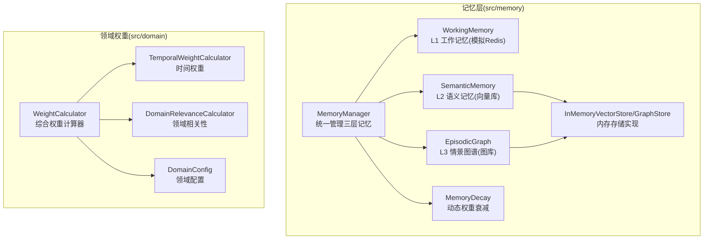
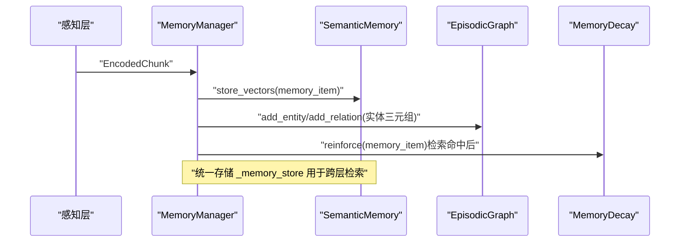
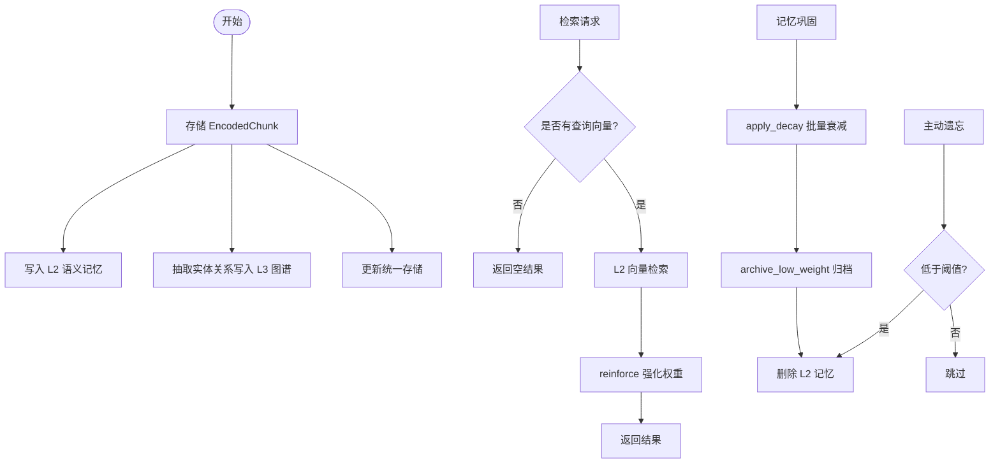
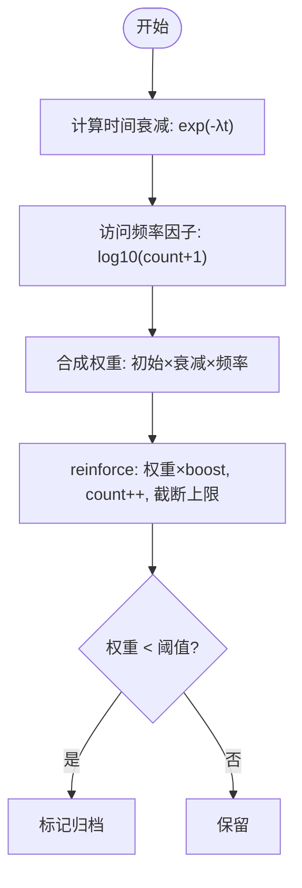
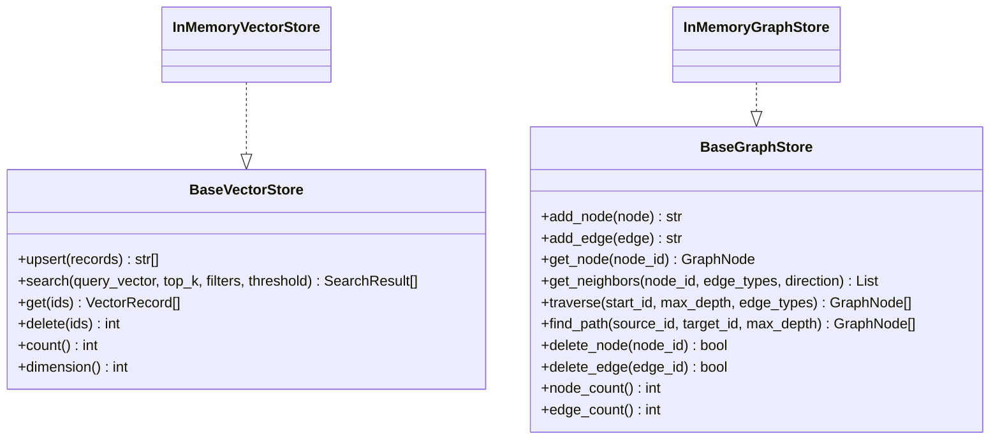
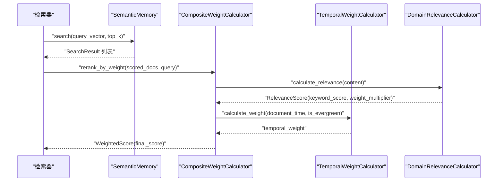
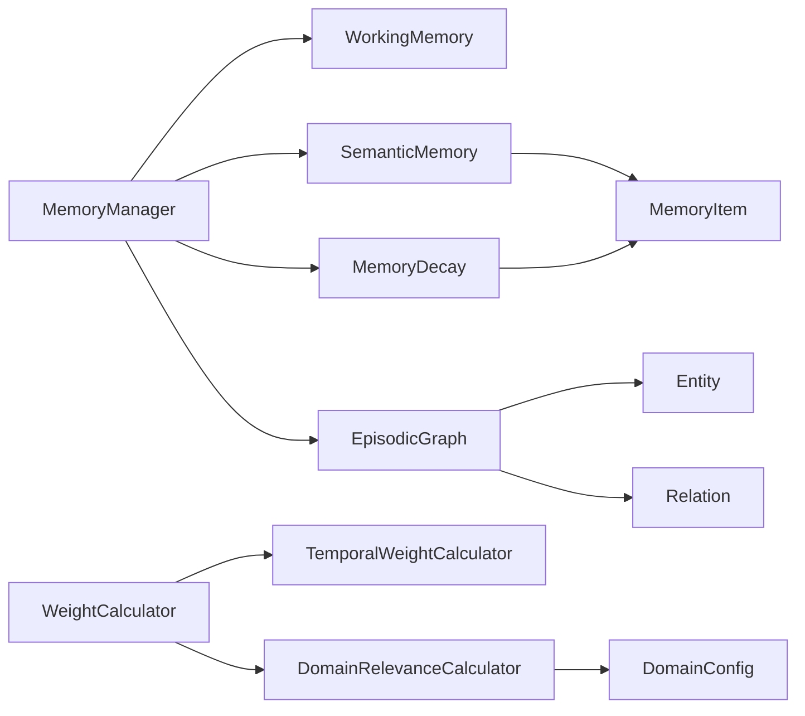

# 记忆管理层

<cite>
**本文引用的文件**
- [src/memory/manager.py](file://src/memory/manager.py)
- [src/memory/models.py](file://src/memory/models.py)
- [src/memory/working_memory.py](file://src/memory/working_memory.py)
- [src/memory/semantic_memory.py](file://src/memory/semantic_memory.py)
- [src/memory/episodic_graph.py](file://src/memory/episodic_graph.py)
- [src/memory/decay.py](file://src/memory/decay.py)
- [src/memory/backends/base.py](file://src/memory/backends/base.py)
- [src/memory/backends/memory_store.py](file://src/memory/backends/memory_store.py)
- [src/domain/weight_calculator.py](file://src/domain/weight_calculator.py)
- [src/domain/temporal_weight.py](file://src/domain/temporal_weight.py)
- [src/domain/config.py](file://src/domain/config.py)
- [src/domain/relevance.py](file://src/domain/relevance.py)
- [example/example_usage.py](file://example/example_usage.py)
- [example/domain_weight_example.py](file://example/domain_weight_example.py)
</cite>

## 目录
1. [简介](#简介)
2. [项目结构](#项目结构)
3. [核心组件](#核心组件)
4. [架构总览](#架构总览)
5. [详细组件分析](#详细组件分析)
6. [依赖分析](#依赖分析)
7. [性能考量](#性能考量)
8. [故障排除指南](#故障排除指南)
9. [结论](#结论)
10. [附录](#附录)

## 简介
本文件系统性阐述 NecoRAG 记忆管理层的三层架构设计与实现细节，覆盖 L1 工作记忆（Redis 模拟）、L2 语义记忆（向量数据库模拟）与 L3 情景图谱（图数据库模拟）。文档重点解析动态权重衰减机制的数学模型与应用场景，详述记忆巩固与主动遗忘的算法实现，并提供存储策略、检索优化、性能调优、模块交互与数据同步、故障排除与监控指标等最佳实践。

## 项目结构
记忆管理层位于 src/memory 目录，围绕 MemoryManager 统一编排三层记忆；同时提供抽象基类与内存实现以适配外部存储后端；领域权重系统位于 src/domain，为检索阶段提供综合权重计算能力。

图表来源
- [src/memory/manager.py:16-195](file://src/memory/manager.py#L16-L195)
- [src/memory/working_memory.py:11-120](file://src/memory/working_memory.py#L11-L120)
- [src/memory/semantic_memory.py:21-179](file://src/memory/semantic_memory.py#L21-L179)
- [src/memory/episodic_graph.py:10-194](file://src/memory/episodic_graph.py#L10-L194)
- [src/memory/decay.py:11-155](file://src/memory/decay.py#L11-L155)
- [src/memory/backends/base.py:54-297](file://src/memory/backends/base.py#L54-L297)
- [src/memory/backends/memory_store.py:20-381](file://src/memory/backends/memory_store.py#L20-L381)
- [src/domain/weight_calculator.py:56-318](file://src/domain/weight_calculator.py#L56-L318)
- [src/domain/temporal_weight.py:47-271](file://src/domain/temporal_weight.py#L47-L271)
- [src/domain/config.py:54-285](file://src/domain/config.py#L54-L285)
- [src/domain/relevance.py:29-328](file://src/domain/relevance.py#L29-L328)

章节来源
- [src/memory/manager.py:16-195](file://src/memory/manager.py#L16-L195)
- [src/memory/backends/base.py:54-297](file://src/memory/backends/base.py#L54-L297)
- [src/memory/backends/memory_store.py:20-381](file://src/memory/backends/memory_store.py#L20-L381)
- [src/domain/weight_calculator.py:56-318](file://src/domain/weight_calculator.py#L56-L318)

## 核心组件
- MemoryManager：统一编排三层记忆，负责存储、检索、巩固与主动遗忘。
- WorkingMemory：L1 工作记忆，模拟 Redis 行为（上下文、意图轨迹、TTL、LRU 等）。
- SemanticMemory：L2 语义记忆，向量存储与检索，支持混合检索与元数据更新。
- EpisodicGraph：L3 情景图谱，实体关系存储与多跳查询。
- MemoryDecay：动态权重衰减，强化访问记忆、批量衰减与归档。
- InMemoryVectorStore/InMemoryGraphStore：内存版向量与图存储，作为开发/测试实现。
- 领域权重系统：综合权重计算器、时间权重、领域相关性评分与配置管理。

章节来源
- [src/memory/manager.py:16-195](file://src/memory/manager.py#L16-L195)
- [src/memory/working_memory.py:11-120](file://src/memory/working_memory.py#L11-L120)
- [src/memory/semantic_memory.py:21-179](file://src/memory/semantic_memory.py#L21-L179)
- [src/memory/episodic_graph.py:10-194](file://src/memory/episodic_graph.py#L10-L194)
- [src/memory/decay.py:11-155](file://src/memory/decay.py#L11-L155)
- [src/memory/backends/memory_store.py:20-381](file://src/memory/backends/memory_store.py#L20-L381)
- [src/domain/weight_calculator.py:56-318](file://src/domain/weight_calculator.py#L56-L318)

## 架构总览
三层记忆架构通过 MemoryManager 协同工作：感知层产出编码块，MemoryManager 将其写入 L2 语义记忆并抽取实体关系写入 L3 图谱；检索阶段由 MemoryManager 调用 L2 向量检索，结合领域权重系统进行重排序；记忆巩固与主动遗忘由 MemoryDecay 控制权重与生命周期。

图表来源
- [src/memory/manager.py:48-112](file://src/memory/manager.py#L48-L112)
- [src/memory/semantic_memory.py:50-78](file://src/memory/semantic_memory.py#L50-L78)
- [src/memory/episodic_graph.py:33-69](file://src/memory/episodic_graph.py#L33-L69)
- [src/memory/decay.py:120-142](file://src/memory/decay.py#L120-L142)

## 详细组件分析

### MemoryManager（统一记忆管理）
- 职责：初始化三层记忆与衰减器；存储编码块至 L2/L3；检索 L2 并强化访问记忆；巩固与主动遗忘。
- 存储流程：将 EncodedChunk 转为 MemoryItem 写入 L2；解析 chunk.entities 写入 L3 实体与关系；更新统一存储。
- 检索流程：若指定查询向量且目标层包含 L2，则调用 SemanticMemory.search，命中后通过 MemoryDecay.reinforce 强化权重。
- 巩固与遗忘：apply_decay 批量衰减；archive_low_weight 识别低权重并删除；forget 支持阈值控制。

图表来源
- [src/memory/manager.py:48-185](file://src/memory/manager.py#L48-L185)

章节来源
- [src/memory/manager.py:16-195](file://src/memory/manager.py#L16-L195)

### WorkingMemory（L1 工作记忆）
- 特性：会话上下文存储、意图轨迹跟踪、TTL 过期、LRU 淘汰、瞬时遗忘模拟。
- 接口：add_context/get_context、track_intent/get_intent_trajectory、clear_session/clear_expired、exists。
- 注意：当前为内存字典模拟，TTL/过期清理为 TODO 待实现。

章节来源
- [src/memory/working_memory.py:11-120](file://src/memory/working_memory.py#L11-L120)

### SemanticMemory（L2 语义记忆）
- 特性：高维向量存储、余弦相似度检索、混合检索（关键词+向量）、元数据更新、删除。
- 接口：store_vectors、search、hybrid_search、update_metadata、delete。
- 注意：当前为内存实现，HNSW 索引与外部向量库集成标记为 TODO。

章节来源
- [src/memory/semantic_memory.py:21-179](file://src/memory/semantic_memory.py#L21-L179)

### EpisodicGraph（L3 情景图谱）
- 特性：实体关系存储、多跳查询（BFS）、因果链条追踪、相关实体发现。
- 接口：add_entity、add_relation、multi_hop_query、find_causal_chain、get_related_entities、get_entity。
- 注意：当前为内存图结构，Neo4j/NebulaGraph 集成标记为 TODO。

章节来源
- [src/memory/episodic_graph.py:10-194](file://src/memory/episodic_graph.py#L10-L194)

### MemoryDecay（动态权重衰减）
- 数学模型：weight(t) = initial_weight × e^(-λt) × log10(access_count+1)
- 功能：计算当前权重、批量衰减、归档低权重、强化访问记忆、判断归档。
- 参数：衰减速率 λ、归档阈值、强化因子、最大权重上限。

图表来源
- [src/memory/decay.py:39-155](file://src/memory/decay.py#L39-L155)

章节来源
- [src/memory/decay.py:11-155](file://src/memory/decay.py#L11-L155)

### 存储后端抽象与内存实现
- 抽象基类：BaseVectorStore/ BaseGraphStore 定义统一接口（upsert/search/get/delete/count/traverse/find_path 等）。
- 内存实现：InMemoryVectorStore/ InMemoryGraphStore 提供向量相似度与图遍历/BFS 能力，便于开发测试。

图表来源
- [src/memory/backends/base.py:54-297](file://src/memory/backends/base.py#L54-L297)
- [src/memory/backends/memory_store.py:20-381](file://src/memory/backends/memory_store.py#L20-L381)

章节来源
- [src/memory/backends/base.py:54-297](file://src/memory/backends/base.py#L54-L297)
- [src/memory/backends/memory_store.py:20-381](file://src/memory/backends/memory_store.py#L20-L381)

### 领域权重系统（与检索融合）
- 综合权重：final = base_score × (α×keyword_weight) × (β×temporal_weight) × (γ×domain_weight) × custom_weight
- 时间权重：分层权重、指数衰减、混合方法；支持“常青”内容禁用时间衰减。
- 领域相关性：关键字密度与匹配强度，判定领域等级并映射权重乘数。
- 配置管理：DomainConfig/DomainConfigManager 支持关键字词典、权重因子、时间衰减参数与持久化。

图表来源
- [src/domain/weight_calculator.py:56-206](file://src/domain/weight_calculator.py#L56-L206)
- [src/domain/temporal_weight.py:47-196](file://src/domain/temporal_weight.py#L47-L196)
- [src/domain/relevance.py:198-242](file://src/domain/relevance.py#L198-L242)
- [src/memory/semantic_memory.py:80-118](file://src/memory/semantic_memory.py#L80-L118)

章节来源
- [src/domain/weight_calculator.py:56-318](file://src/domain/weight_calculator.py#L56-L318)
- [src/domain/temporal_weight.py:47-271](file://src/domain/temporal_weight.py#L47-L271)
- [src/domain/relevance.py:29-328](file://src/domain/relevance.py#L29-L328)
- [src/domain/config.py:54-285](file://src/domain/config.py#L54-L285)

## 依赖分析
- MemoryManager 依赖 WorkingMemory、SemanticMemory、EpisodicGraph、MemoryDecay 与 MemoryItem/Entity/Relation。
- SemanticMemory 与 EpisodicGraph 依赖 models 数据模型。
- MemoryDecay 依赖 MemoryItem。
- 领域权重系统相互依赖：CompositeWeightCalculator 依赖 TemporalWeightCalculator 与 DomainRelevanceCalculator，二者均依赖 DomainConfig。

图表来源
- [src/memory/manager.py:8-12](file://src/memory/manager.py#L8-L12)
- [src/memory/models.py:19-50](file://src/memory/models.py#L19-L50)
- [src/memory/decay.py:11-38](file://src/memory/decay.py#L11-L38)
- [src/domain/weight_calculator.py:56-75](file://src/domain/weight_calculator.py#L56-L75)
- [src/domain/temporal_weight.py:47-52](file://src/domain/temporal_weight.py#L47-L52)
- [src/domain/relevance.py:29-40](file://src/domain/relevance.py#L29-L40)
- [src/domain/config.py:54-66](file://src/domain/config.py#L54-L66)

章节来源
- [src/memory/manager.py:16-47](file://src/memory/manager.py#L16-L47)
- [src/memory/models.py:19-50](file://src/memory/models.py#L19-L50)
- [src/domain/weight_calculator.py:56-80](file://src/domain/weight_calculator.py#L56-L80)

## 性能考量
- 向量检索复杂度：当前内存实现为 O(N) 相似度计算，建议在生产环境接入 HNSW/FAISS/Qdrant 等索引以降低至 O(log N)/O(k)。
- 图遍历复杂度：BFS/DFS 多跳查询在稀疏图上较高效，但深度增加会导致组合爆炸，需限制 max_relation_depth。
- 内存占用：统一存储 _memory_store 与向量/图内存实现会随数据增长而上升，建议定期 consolidate/forget 与分片部署。
- 并发与一致性：工作记忆模拟未实现并发安全，生产环境需替换为真实 Redis 并启用事务/锁。
- 调优建议：
  - 合理设置 decay_rate 与 archive_threshold，平衡保留与清理节奏。
  - top_k 与 min_score/threshold 控制召回与质量。
  - 关键字权重与时间权重因子（α/β/γ）按领域特性动态调整。

[本节为通用指导，无需特定文件引用]

## 故障排除指南
- 存储失败（维度不匹配）：检查向量维度与集合配置，确保编码器输出一致。
- 检索无结果：确认 query_vector 非空且与存储向量维度一致；检查 min_score 与 top_k 设置。
- 图查询异常：确保实体 ID 存在且关系方向/类型过滤正确；注意 BFS 深度限制。
- 权重异常：检查 decay_rate 与 access_count 是否异常；确认 reinforce 是否被调用。
- 配置加载失败：确认 DomainConfigManager 的配置目录存在且 JSON 文件格式正确。

章节来源
- [src/memory/backends/memory_store.py:45-53](file://src/memory/backends/memory_store.py#L45-L53)
- [src/memory/semantic_memory.py:103-118](file://src/memory/semantic_memory.py#L103-L118)
- [src/memory/episodic_graph.py:95-126](file://src/memory/episodic_graph.py#L95-L126)
- [src/domain/weight_calculator.py:103-130](file://src/domain/weight_calculator.py#L103-L130)

## 结论
记忆管理层通过三层架构实现了从工作记忆到语义记忆再到情景图谱的渐进式知识组织，配合动态权重衰减机制实现记忆巩固与主动遗忘。领域权重系统进一步提升了检索质量与个性化。建议在生产环境中替换为真实存储后端（Redis/Qdrant/Neo4j），并引入索引与缓存策略以提升性能与稳定性。

[本节为总结，无需特定文件引用]

## 附录

### 使用示例与最佳实践
- 使用示例：参考 example_usage.py 展示了从感知编码到记忆存储、检索、巩固的完整流程。
- 领域权重示例：参考 domain_weight_example.py 展示了领域配置、时间权重与综合权重计算。

章节来源
- [example/example_usage.py:50-92](file://example/example_usage.py#L50-L92)
- [example/domain_weight_example.py:22-202](file://example/domain_weight_example.py#L22-L202)