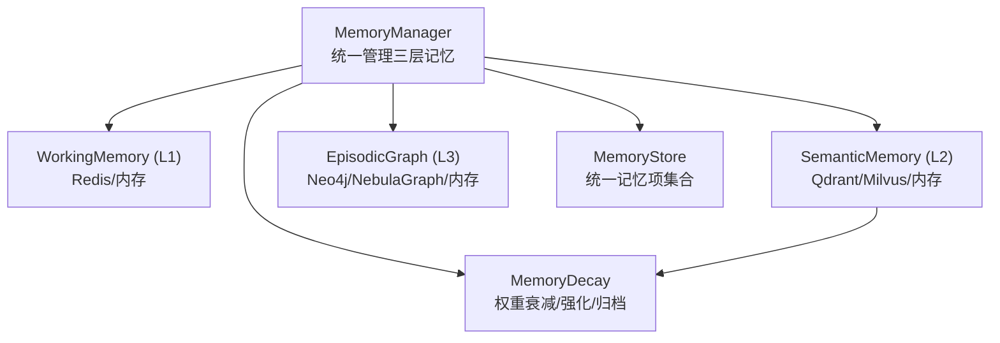
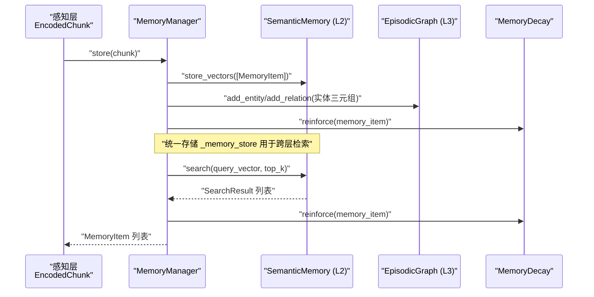
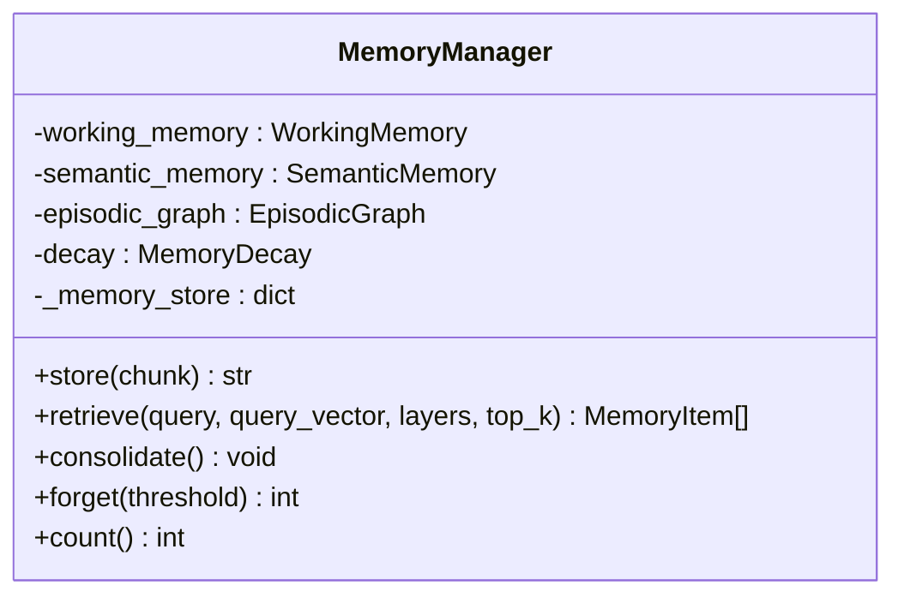
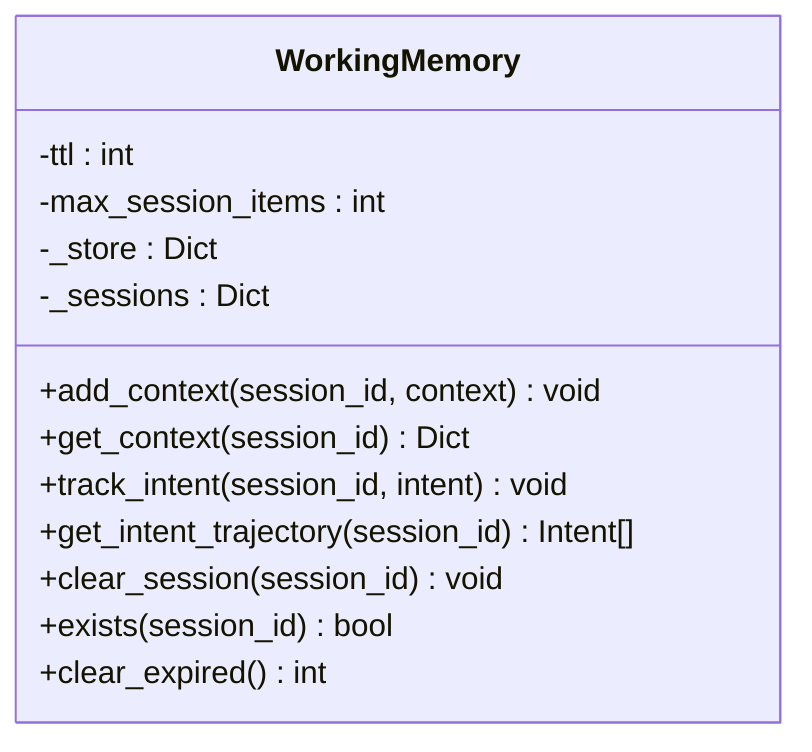
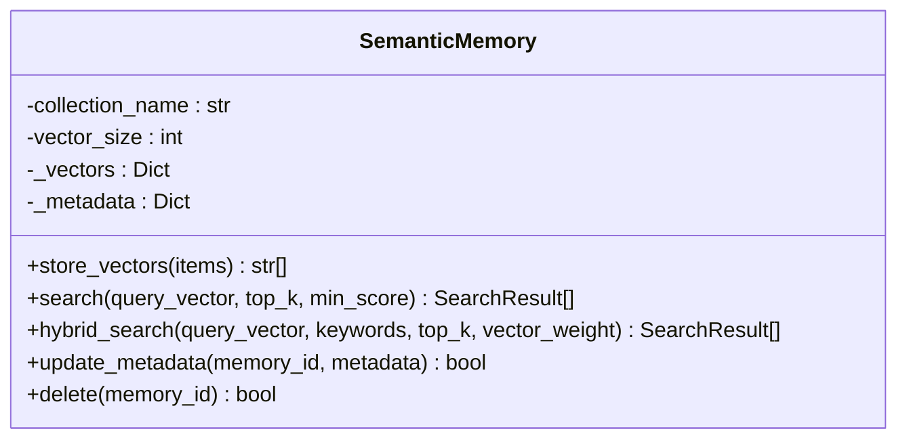
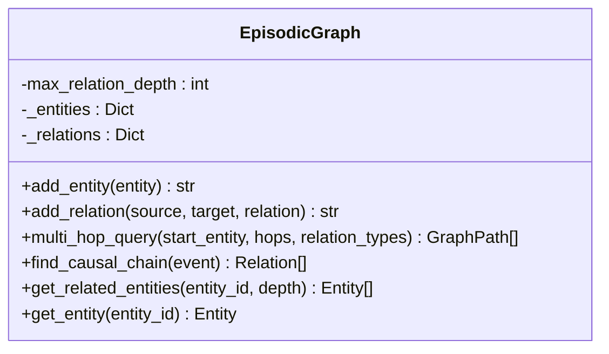
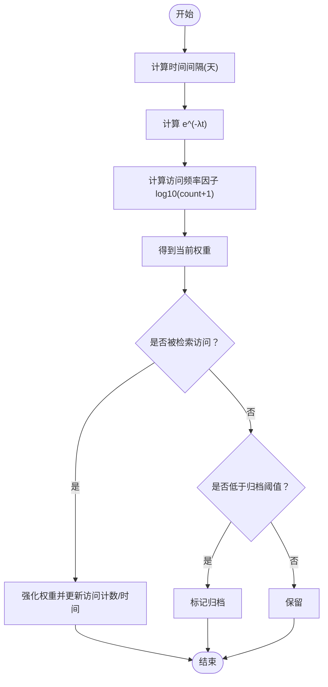
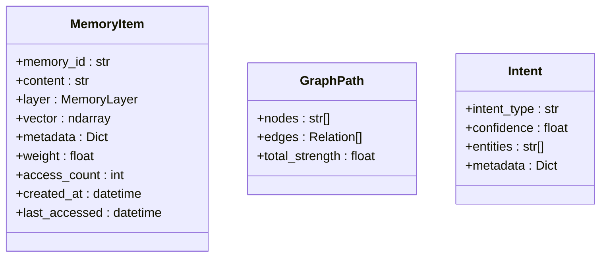
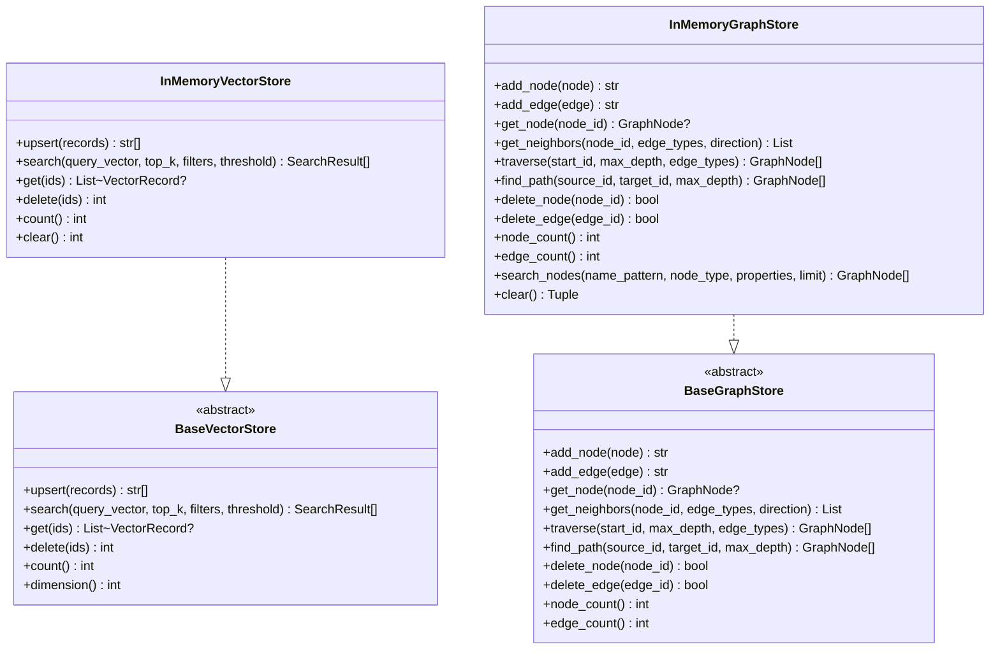
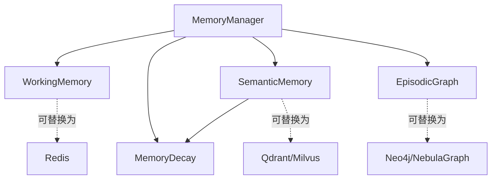

# 记忆管理层

<cite>
**本文引用的文件**
- [src/memory/__init__.py](file://src/memory/__init__.py)
- [src/memory/manager.py](file://src/memory/manager.py)
- [src/memory/models.py](file://src/memory/models.py)
- [src/memory/working_memory.py](file://src/memory/working_memory.py)
- [src/memory/semantic_memory.py](file://src/memory/semantic_memory.py)
- [src/memory/episodic_graph.py](file://src/memory/episodic_graph.py)
- [src/memory/decay.py](file://src/memory/decay.py)
- [src/memory/backends/base.py](file://src/memory/backends/base.py)
- [src/memory/backends/memory_store.py](file://src/memory/backends/memory_store.py)
- [src/memory/backends/__init__.py](file://src/memory/backends/__init__.py)
- [src/core/protocols.py](file://src/core/protocols.py)
- [src/perception/models.py](file://src/perception/models.py)
- [src/memory/README.md](file://src/memory/README.md)
- [tests/test_memory/test_working_memory.py](file://tests/test_memory/test_working_memory.py)
- [tests/test_memory/test_decay.py](file://tests/test_memory/test_decay.py)
</cite>

## 目录
1. [简介](#简介)
2. [项目结构](#项目结构)
3. [核心组件](#核心组件)
4. [架构总览](#架构总览)
5. [详细组件分析](#详细组件分析)
6. [依赖分析](#依赖分析)
7. [性能考虑](#性能考虑)
8. [故障排查指南](#故障排查指南)
9. [结论](#结论)
10. [附录](#附录)

## 简介
本文件面向开发者与架构师，系统化阐述 NecoRAG 记忆管理层的三层记忆架构与实现细节，覆盖工作记忆（L1）、语义记忆（L2）与情景图谱（L3）的职责划分、协作机制与数据流；深入解析记忆存储后端选择策略、动态权重衰减的数学模型、记忆巩固与主动遗忘的算法实现；并给出 Redis、Qdrant、Neo4j 等存储系统的集成方案、数据模型设计与性能优化策略，以及最佳实践、容量规划与故障恢复建议。

## 项目结构
记忆管理层位于 src/memory 目录，采用“按层与按职责”相结合的组织方式：
- 管理层：MemoryManager 统一编排三层记忆与检索
- L1 工作记忆：WorkingMemory（最小实现为内存字典，标注可接入 Redis）
- L2 语义记忆：SemanticMemory（最小实现为内存向量存储，标注可接入 Qdrant/Milvus）
- L3 情景图谱：EpisodicGraph（最小实现为内存图结构，标注可接入 Neo4j/NebulaGraph）
- 衰减机制：MemoryDecay 提供权重衰减、强化与归档
- 后端抽象与内存实现：backends/base.py 与 backends/memory_store.py
- 数据模型：models.py 与 core/protocols.py

图表来源
- [src/memory/manager.py:20-212](file://src/memory/manager.py#L20-L212)
- [src/memory/working_memory.py:11-120](file://src/memory/working_memory.py#L11-L120)
- [src/memory/semantic_memory.py:21-179](file://src/memory/semantic_memory.py#L21-L179)
- [src/memory/episodic_graph.py:10-194](file://src/memory/episodic_graph.py#L10-L194)
- [src/memory/decay.py:11-155](file://src/memory/decay.py#L11-L155)

章节来源
- [src/memory/README.md:1-244](file://src/memory/README.md#L1-L244)
- [src/memory/__init__.py:1-29](file://src/memory/__init__.py#L1-L29)

## 核心组件
- MemoryManager：三层记忆的统一入口，负责存储、检索、巩固与主动遗忘
- WorkingMemory（L1）：会话上下文与意图轨迹的短期存储，具备 TTL 与最小实现
- SemanticMemory（L2）：高维向量存储与检索，支持混合检索与元数据更新
- EpisodicGraph（L3）：实体关系网络，支持多跳查询与因果链追踪
- MemoryDecay：基于指数衰减与访问频率的动态权重模型，支持强化与归档
- Backends：抽象基类与内存实现，便于替换为 Redis/Qdrant/Neo4j 等生产存储

章节来源
- [src/memory/manager.py:20-212](file://src/memory/manager.py#L20-L212)
- [src/memory/working_memory.py:11-120](file://src/memory/working_memory.py#L11-L120)
- [src/memory/semantic_memory.py:21-179](file://src/memory/semantic_memory.py#L21-L179)
- [src/memory/episodic_graph.py:10-194](file://src/memory/episodic_graph.py#L10-L194)
- [src/memory/decay.py:11-155](file://src/memory/decay.py#L11-L155)
- [src/memory/backends/base.py:61-314](file://src/memory/backends/base.py#L61-L314)
- [src/memory/backends/memory_store.py:20-381](file://src/memory/backends/memory_store.py#L20-L381)

## 架构总览
三层记忆系统的设计目标是模拟人脑的记忆层次：L1（工作记忆）负责即时上下文与意图，L2（语义记忆）负责向量化的模糊检索与联想，L3（情景图谱）负责结构化推理与因果链条。MemoryManager 将感知层编码的 EncodedChunk 落地到三层，并在检索阶段根据查询向量与层级策略进行跨层融合。

图表来源
- [src/memory/manager.py:52-159](file://src/memory/manager.py#L52-L159)
- [src/memory/semantic_memory.py:50-118](file://src/memory/semantic_memory.py#L50-L118)
- [src/memory/decay.py:120-142](file://src/memory/decay.py#L120-L142)

## 详细组件分析

### MemoryManager（统一管理器）
- 职责
  - 接收感知层 EncodedChunk，创建 MemoryItem 并写入 L2
  - 从实体三元组构建 L3 图谱节点与关系
  - 统一存储 _memory_store，便于跨层检索与状态维护
  - 检索：基于查询向量在 L2 执行向量检索，命中后通过 MemoryDecay 强化权重
  - 巩固：批量应用衰减，识别并归档低权重记忆
  - 主动遗忘：按阈值删除低价值记忆
- 关键接口
  - store(chunk): 返回 memory_id
  - retrieve(query, query_vector, layers, top_k): 返回 MemoryItem 列表
  - consolidate(): 执行衰减与归档
  - forget(threshold): 主动遗忘
  - count(): 统计记忆总数

图表来源
- [src/memory/manager.py:20-212](file://src/memory/manager.py#L20-L212)

章节来源
- [src/memory/manager.py:20-212](file://src/memory/manager.py#L20-L212)

### WorkingMemory（L1 工作记忆）
- 职责：短期会话上下文与用户意图轨迹存储
- 特性：最小实现为内存字典，支持会话上下文更新、意图轨迹追加、会话清理与存在性检查；标注支持 TTL 与 LRU（待实现）
- 关键接口
  - add_context(session_id, context)
  - get_context(session_id)
  - track_intent(session_id, intent)
  - get_intent_trajectory(session_id)
  - clear_session(session_id)
  - exists(session_id)
  - clear_expired()

图表来源
- [src/memory/working_memory.py:11-120](file://src/memory/working_memory.py#L11-L120)

章节来源
- [src/memory/working_memory.py:11-120](file://src/memory/working_memory.py#L11-L120)
- [tests/test_memory/test_working_memory.py:1-307](file://tests/test_memory/test_working_memory.py#L1-L307)

### SemanticMemory（L2 语义记忆）
- 职责：高维向量存储与检索，支持混合检索与元数据更新
- 特性：最小实现为内存字典与元数据映射；标注支持 HNSW 索引与 Qdrant/Milvus 集成
- 关键接口
  - store_vectors(memory_items): 写入向量与元数据
  - search(query_vector, top_k, min_score): 余弦相似度检索
  - hybrid_search(query_vector, keywords, top_k, vector_weight): 混合检索（标注待实现）
  - update_metadata(memory_id, metadata)
  - delete(memory_id)

图表来源
- [src/memory/semantic_memory.py:21-179](file://src/memory/semantic_memory.py#L21-L179)

章节来源
- [src/memory/semantic_memory.py:21-179](file://src/memory/semantic_memory.py#L21-L179)

### EpisodicGraph（L3 情景图谱）
- 职责：实体关系网络，支持多跳查询与因果链追踪
- 特性：最小实现为邻接表与实体映射；标注支持 Neo4j/NebulaGraph 集成
- 关键接口
  - add_entity(entity): 添加实体
  - add_relation(source, target, relation): 添加关系
  - multi_hop_query(start_entity, hops, relation_types): 多跳 BFS
  - find_causal_chain(event): 查找因果关系
  - get_related_entities(entity_id, depth): 获取相关实体
  - get_entity(entity_id)

图表来源
- [src/memory/episodic_graph.py:10-194](file://src/memory/episodic_graph.py#L10-L194)

章节来源
- [src/memory/episodic_graph.py:10-194](file://src/memory/episodic_graph.py#L10-L194)

### MemoryDecay（动态权重衰减）
- 数学模型：weight(t) = initial_weight × e^(-λt) × log10(access_count + 1)
- 功能：计算权重、批量衰减、归档低权重、强化权重（访问即强化）
- 关键接口
  - calculate_weight(memory, current_time)
  - apply_decay(memories, current_time)
  - archive_low_weight(memories, threshold)
  - reinforce(memory, boost_factor)
  - should_archive(memory)

图表来源
- [src/memory/decay.py:39-155](file://src/memory/decay.py#L39-L155)

章节来源
- [src/memory/decay.py:11-155](file://src/memory/decay.py#L11-L155)
- [tests/test_memory/test_decay.py:1-544](file://tests/test_memory/test_decay.py#L1-L544)

### 数据模型与协议
- MemoryItem：统一记忆项，包含 content、layer、vector、metadata、weight、access_count、时间戳
- GraphPath：图谱路径，包含 nodes、edges、total_strength
- Intent：用户意图，包含类型、置信度、实体与元数据
- 从 core/protocols 导入的枚举与数据类：MemoryLayer、Entity、Relation 等

图表来源
- [src/memory/models.py:14-43](file://src/memory/models.py#L14-L43)
- [src/core/protocols.py:36-200](file://src/core/protocols.py#L36-L200)

章节来源
- [src/memory/models.py:1-43](file://src/memory/models.py#L1-L43)
- [src/core/protocols.py:1-298](file://src/core/protocols.py#L1-L298)

### 存储后端抽象与内存实现
- BaseVectorStore/BaseGraphStore：定义向量与图存储的统一接口
- InMemoryVectorStore/InMemoryGraphStore：提供内存实现，便于开发与测试
- 与 Redis/Qdrant/Neo4j 的对接：通过实现上述抽象接口完成替换

图表来源
- [src/memory/backends/base.py:61-314](file://src/memory/backends/base.py#L61-L314)
- [src/memory/backends/memory_store.py:20-381](file://src/memory/backends/memory_store.py#L20-L381)

章节来源
- [src/memory/backends/base.py:1-314](file://src/memory/backends/base.py#L1-L314)
- [src/memory/backends/memory_store.py:1-381](file://src/memory/backends/memory_store.py#L1-L381)
- [src/memory/backends/__init__.py:1-16](file://src/memory/backends/__init__.py#L1-L16)

## 依赖分析
- 模块内聚与耦合
  - MemoryManager 对三层记忆与衰减机制有直接依赖，承担编排职责
  - SemanticMemory 与 EpisodicGraph 作为独立存储单元，通过 MemoryManager 协同
  - Backends 抽象层降低具体存储实现的耦合度
- 外部依赖
  - Redis（L1）、Qdrant/Milvus（L2）、Neo4j/NebulaGraph（L3）为可插拔后端
  - numpy 用于向量运算（最小实现中体现）

图表来源
- [src/memory/manager.py:9-47](file://src/memory/manager.py#L9-L47)
- [src/memory/README.md:231-236](file://src/memory/README.md#L231-L236)

章节来源
- [src/memory/manager.py:9-47](file://src/memory/manager.py#L9-L47)
- [src/memory/README.md:231-236](file://src/memory/README.md#L231-L236)

## 性能考虑
- 写入延迟
  - L1：内存字典 O(1)，实际取决于 Redis 实现
  - L2：内存向量存储 O(n) 遍历；生产环境建议 HNSW 索引与批量写入
  - L3：内存邻接表 O(1) 插入；生产环境建议图数据库批处理
- 检索延迟
  - L1：O(1) 上下文读取
  - L2：内存检索 O(n)；建议 HNSW 索引与向量库
  - L3：BFS/DFS 检索 O(V+E)，建议限制 hops 与使用索引/中间结果缓存
- 容量规划
  - L1：会话级，控制 TTL 与最大条目
  - L2：向量库容量与索引参数调优，冷热数据分离
  - L3：节点/边规模增长快，需定期清理与分片
- 优化策略
  - 向量检索：批量写入、索引预热、阈值裁剪、Top-K 限制
  - 图检索：限制深度与关系类型、路径去重、中间结果缓存
  - 衰减与归档：周期性任务、阈值调参、批量删除

## 故障排查指南
- 存储后端不可用
  - 现象：连接失败、超时、写入异常
  - 措施：检查连接串、网络、认证；在 backends 层替换为内存实现快速定位问题
- 向量维度不匹配
  - 现象：写入时报维度错误
  - 措施：确认编码器输出维度与向量库配置一致
- 图节点缺失
  - 现象：添加边时报源/目标节点不存在
  - 措施：先 add_node，再 add_edge；校验实体 ID
- 检索结果为空
  - 现象：query_vector 未写入或阈值过高
  - 措施：检查向量写入、min_score/top_k、是否执行了 consolidate
- 权重异常
  - 现象：权重不变化或异常升高
  - 措施：核对 access_count、boost_factor、archive_threshold；查看测试用例覆盖场景

章节来源
- [src/memory/backends/memory_store.py:41-140](file://src/memory/backends/memory_store.py#L41-L140)
- [src/memory/semantic_memory.py:50-118](file://src/memory/semantic_memory.py#L50-L118)
- [src/memory/episodic_graph.py:143-194](file://src/memory/episodic_graph.py#L143-L194)
- [tests/test_memory/test_decay.py:225-309](file://tests/test_memory/test_decay.py#L225-L309)

## 结论
记忆管理层通过三层架构实现了从即时上下文到结构化推理的完整闭环。MemoryManager 作为编排中枢，结合 MemoryDecay 的动态权重模型，既保障热点知识的活跃性，又避免低价值信息占用资源。通过 backends 抽象层，系统可在开发（内存实现）与生产（Redis/Qdrant/Neo4j）之间平滑切换。建议在生产环境中优先采用向量库与图数据库，并配合容量规划、阈值调参与周期性巩固任务，持续优化检索性能与稳定性。

## 附录

### API 参考（方法与职责）
- MemoryManager
  - store(chunk): 存储 EncodedChunk，写入 L2 与 L3，强化权重
  - retrieve(query, query_vector, layers, top_k): L2 向量检索，命中后强化
  - consolidate(): 批量衰减与归档
  - forget(threshold): 主动遗忘
  - count(): 统计总数
- WorkingMemory（L1）
  - add_context/get_context/track_intent/get_intent_trajectory/clear_session/exists/clear_expired
- SemanticMemory（L2）
  - store_vectors/search/hybrid_search/update_metadata/delete
- EpisodicGraph（L3）
  - add_entity/add_relation/multi_hop_query/find_causal_chain/get_related_entities/get_entity
- MemoryDecay
  - calculate_weight/apply_decay/archive_low_weight/reinforce/should_archive

章节来源
- [src/memory/manager.py:52-212](file://src/memory/manager.py#L52-L212)
- [src/memory/working_memory.py:36-120](file://src/memory/working_memory.py#L36-L120)
- [src/memory/semantic_memory.py:50-179](file://src/memory/semantic_memory.py#L50-L179)
- [src/memory/episodic_graph.py:33-194](file://src/memory/episodic_graph.py#L33-L194)
- [src/memory/decay.py:39-155](file://src/memory/decay.py#L39-L155)

### 使用示例（步骤说明）
- 初始化 MemoryManager（可传入 redis/qdrant/neo4j 连接串）
- 使用感知层 EncodedChunk 调用 store 写入
- 调用 retrieve 进行跨层检索（可指定层级与 Top-K）
- 定期调用 consolidate 执行巩固与归档
- 必要时调用 forget 进行主动遗忘

章节来源
- [src/memory/README.md:149-177](file://src/memory/README.md#L149-L177)