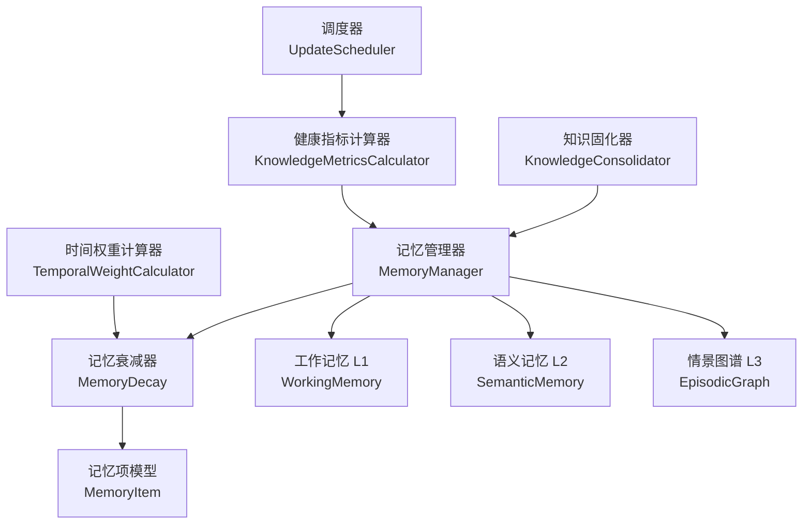
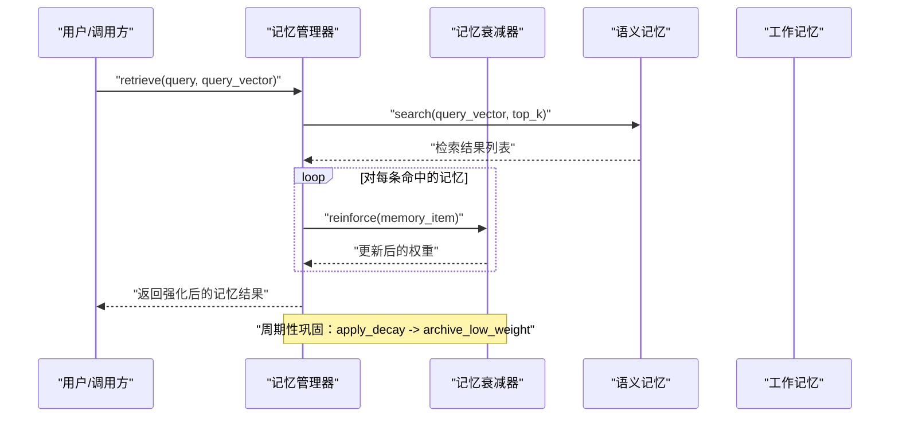
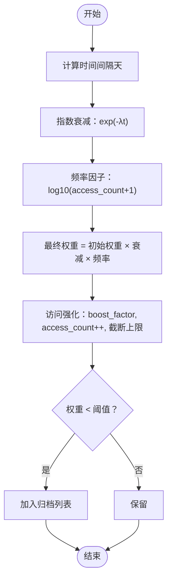
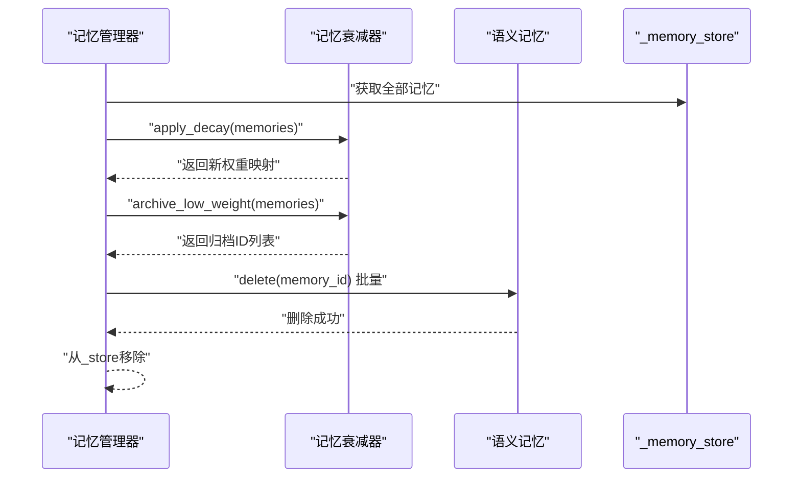
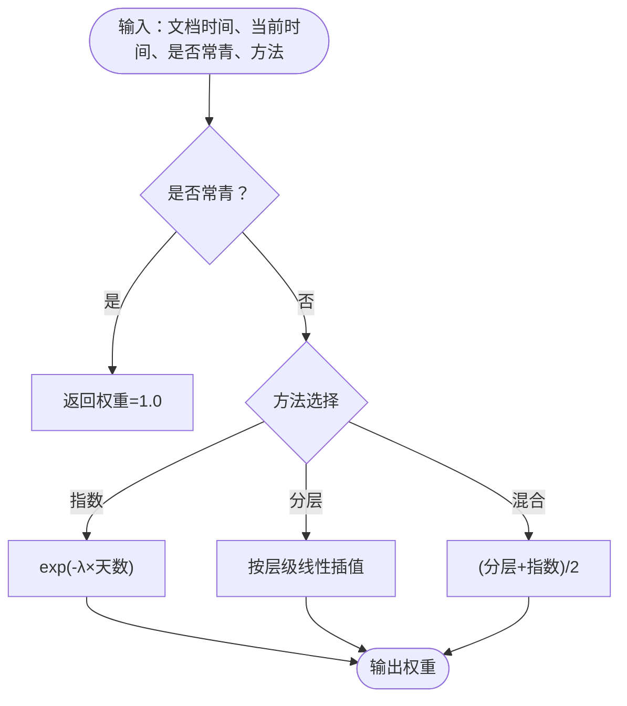
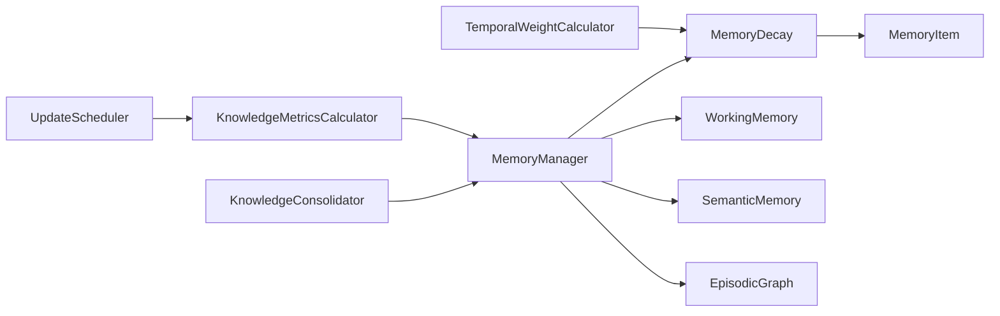

# 记忆衰减机制

<cite>
**本文引用的文件**
- [src/memory/decay.py](file://src/memory/decay.py)
- [src/memory/manager.py](file://src/memory/manager.py)
- [src/memory/models.py](file://src/memory/models.py)
- [src/memory/working_memory.py](file://src/memory/working_memory.py)
- [src/memory/semantic_memory.py](file://src/memory/semantic_memory.py)
- [src/memory/episodic_graph.py](file://src/memory/episodic_graph.py)
- [src/domain/temporal_weight.py](file://src/domain/temporal_weight.py)
- [src/refinement/consolidator.py](file://src/refinement/consolidator.py)
- [src/knowledge_evolution/metrics.py](file://src/knowledge_evolution/metrics.py)
- [src/knowledge_evolution/scheduler.py](file://src/knowledge_evolution/scheduler.py)
- [src/core/protocols.py](file://src/core/protocols.py)
- [src/core/config.py](file://src/core/config.py)
- [tests/test_memory/test_decay.py](file://tests/test_memory/test_decay.py)
- [wiki/wiki/记忆管理层/记忆衰减与巩固机制.md](file://wiki/wiki/记忆管理层/记忆衰减与巩固机制.md)
- [wiki/wiki/记忆管理层/记忆存储后端.md](file://wiki/wiki/记忆管理层/记忆存储后端.md)
</cite>

## 目录
1. [简介](#简介)
2. [项目结构](#项目结构)
3. [核心组件](#核心组件)
4. [架构总览](#架构总览)
5. [详细组件分析](#详细组件分析)
6. [依赖关系分析](#依赖关系分析)
7. [性能考量](#性能考量)
8. [故障排查指南](#故障排查指南)
9. [结论](#结论)
10. [附录](#附录)

## 简介
本文件围绕 NecoRAG 的“记忆衰减与巩固机制”展开，系统阐述三层记忆（工作记忆 L1、语义记忆 L2、情景图谱 L3）中的权重衰减、使用频率强化、时间与重要性评估、巩固触发与执行流程、主动遗忘策略，以及健康监控与性能调优建议。文档以代码为依据，辅以图示帮助读者理解。

## 项目结构
NecoRAG 将记忆系统分为三层：
- L1 工作记忆：短期上下文与意图轨迹，具备 TTL 与 LRU 特性，模拟瞬时遗忘。
- L2 语义记忆：高维向量存储，支持混合检索与模糊匹配。
- L3 情景图谱：实体关系网络，支持多跳推理与因果链条追踪。

记忆衰减与巩固涉及以下关键模块：
- 记忆衰减器：负责权重衰减、频率强化、归档阈值判断与批量应用。
- 记忆管理器：统一协调三层记忆，执行巩固与主动遗忘。
- 时间权重模块：提供基于时间的权重计算（分层/指数/混合）。
- 知识固化器：分析查询模式、识别知识缺口并补充。
- 健康指标与调度：计算知识库健康度、调度周期任务。

图表来源
- [src/memory/manager.py:16-47](file://src/memory/manager.py#L16-L47)
- [src/memory/decay.py:11-38](file://src/memory/decay.py#L11-L38)
- [src/memory/working_memory.py:11-35](file://src/memory/working_memory.py#L11-L35)
- [src/memory/semantic_memory.py:21-46](file://src/memory/semantic_memory.py#L21-L46)
- [src/memory/episodic_graph.py:10-29](file://src/memory/episodic_graph.py#L10-L29)
- [src/domain/temporal_weight.py:47-52](file://src/domain/temporal_weight.py#L47-L52)
- [src/refinement/consolidator.py:9-34](file://src/refinement/consolidator.py#L9-L34)
- [src/knowledge_evolution/metrics.py:21-45](file://src/knowledge_evolution/metrics.py#L21-L45)
- [src/knowledge_evolution/scheduler.py:124-167](file://src/knowledge_evolution/scheduler.py#L124-L167)

章节来源
- [src/memory/manager.py:16-47](file://src/memory/manager.py#L16-L47)
- [src/memory/working_memory.py:11-35](file://src/memory/working_memory.py#L11-L35)
- [src/memory/semantic_memory.py:21-46](file://src/memory/semantic_memory.py#L21-L46)
- [src/memory/episodic_graph.py:10-29](file://src/memory/episodic_graph.py#L10-L29)

## 核心组件
- 记忆衰减器（MemoryDecay）
  - 负责权重衰减、频率强化、批量衰减与归档阈值判断。
  - 提供时间衰减（指数）与使用频率因子（对数）的组合。
- 记忆管理器（MemoryManager）
  - 统一管理 L1/L2/L3，协调存储、检索、巩固与主动遗忘。
  - 在检索时对命中的记忆进行强化。
- 时间权重计算器（TemporalWeightCalculator）
  - 提供分层权重、指数衰减与混合方法，支持领域预设。
- 知识固化器（KnowledgeConsolidator）
  - 分析查询模式、识别知识缺口并补充，作为巩固的扩展手段。
- 健康指标与调度（KnowledgeMetricsCalculator / UpdateScheduler）
  - 计算知识库健康度、生成报告；调度周期任务保障系统健康运行。

章节来源
- [src/memory/decay.py:11-38](file://src/memory/decay.py#L11-L38)
- [src/memory/manager.py:16-47](file://src/memory/manager.py#L16-L47)
- [src/domain/temporal_weight.py:47-52](file://src/domain/temporal_weight.py#L47-L52)
- [src/refinement/consolidator.py:9-34](file://src/refinement/consolidator.py#L9-L34)
- [src/knowledge_evolution/metrics.py:21-45](file://src/knowledge_evolution/metrics.py#L21-L45)
- [src/knowledge_evolution/scheduler.py:124-167](file://src/knowledge_evolution/scheduler.py#L124-L167)

## 架构总览
记忆系统以 MemoryManager 为核心，结合 MemoryDecay 实现权重动态调整；TemporalWeightCalculator 为时间维度提供权重；KnowledgeConsolidator 与 UpdateScheduler 协同实现知识缺口识别与周期性维护；WorkingMemory、SemanticMemory、EpisodicGraph 分别承担短期上下文、向量检索与图谱推理。

图表来源
- [src/memory/manager.py:114-147](file://src/memory/manager.py#L114-L147)
- [src/memory/decay.py:120-142](file://src/memory/decay.py#L120-L142)
- [src/memory/semantic_memory.py:80-118](file://src/memory/semantic_memory.py#L80-L118)

## 详细组件分析

### 记忆衰减器（MemoryDecay）
- 数学模型
  - 权重衰减：指数衰减 e^(-λt)，其中 t 为天数，λ 为衰减速率。
  - 使用频率因子：log10(access_count + 1)，对数放大低频收益。
  - 最终权重：初始权重 × 时间衰减 × 频率因子。
- 关键能力
  - 计算单条记忆权重：[calculate_weight:39-70](file://src/memory/decay.py#L39-L70)
  - 批量应用衰减：[apply_decay:72-94](file://src/memory/decay.py#L72-L94)
  - 归档低权重记忆：[archive_low_weight:96-118](file://src/memory/decay.py#L96-L118)
  - 强化记忆权重（访问增强）：[reinforce:120-142](file://src/memory/decay.py#L120-L142)
  - 判断是否归档：[should_archive:144-155](file://src/memory/decay.py#L144-L155)

图表来源
- [src/memory/decay.py:39-70](file://src/memory/decay.py#L39-L70)
- [src/memory/decay.py:120-142](file://src/memory/decay.py#L120-L142)
- [src/memory/decay.py:96-118](file://src/memory/decay.py#L96-L118)

章节来源
- [src/memory/decay.py:11-38](file://src/memory/decay.py#L11-L38)
- [src/memory/decay.py:39-70](file://src/memory/decay.py#L39-L70)
- [src/memory/decay.py:72-94](file://src/memory/decay.py#L72-L94)
- [src/memory/decay.py:96-118](file://src/memory/decay.py#L96-L118)
- [src/memory/decay.py:120-142](file://src/memory/decay.py#L120-L142)
- [src/memory/decay.py:144-155](file://src/memory/decay.py#L144-L155)

### 记忆管理器（MemoryManager）
- 统一管理三层记忆与衰减器，提供存储、检索、巩固与主动遗忘接口。
- 存储流程：将编码块写入 L2 语义记忆，同时抽取实体关系写入 L3 图谱。
- 检索流程：在 L2 向量空间检索，命中后对记忆进行强化。
- 巩固流程：对全部记忆应用衰减，识别并删除低权重记忆。
- 主动遗忘：根据自定义阈值删除低价值记忆。

图表来源
- [src/memory/manager.py:149-185](file://src/memory/manager.py#L149-L185)
- [src/memory/manager.py:156-166](file://src/memory/manager.py#L156-L166)
- [src/memory/semantic_memory.py:164-178](file://src/memory/semantic_memory.py#L164-L178)

章节来源
- [src/memory/manager.py:48-112](file://src/memory/manager.py#L48-L112)
- [src/memory/manager.py:114-147](file://src/memory/manager.py#L114-L147)
- [src/memory/manager.py:149-185](file://src/memory/manager.py#L149-L185)

### 时间权重与重要性评估（TemporalWeightCalculator）
- 时间层级：最近（0-30天）、近期（30-90天）、中期（90-365天）、远期（1-3年）、历史（>3年）、常青（不受时间衰减）。
- 计算方法：
  - 分层权重：在时间区间内线性插值，得到对应权重范围内的值。
  - 指数衰减：e^(-λ×天数)。
  - 混合方法：分层权重与指数衰减取平均。
- 预设配置：快变领域、常规领域、慢变领域、常青领域，分别提供不同的时间分界与衰减系数。

图表来源
- [src/domain/temporal_weight.py:160-195](file://src/domain/temporal_weight.py#L160-L195)
- [src/domain/temporal_weight.py:231-270](file://src/domain/temporal_weight.py#L231-L270)

章节来源
- [src/domain/temporal_weight.py:14-45](file://src/domain/temporal_weight.py#L14-L45)
- [src/domain/temporal_weight.py:47-52](file://src/domain/temporal_weight.py#L47-L52)
- [src/domain/temporal_weight.py:160-195](file://src/domain/temporal_weight.py#L160-L195)
- [src/domain/temporal_weight.py:231-270](file://src/domain/temporal_weight.py#L231-L270)

### 记忆强化机制（使用频率提升权重）
- 每当检索命中某记忆项时，调用强化函数：access_count++，权重乘以 boost_factor，并限制最大权重。
- 该机制鼓励高频使用的内容在长期保持较高权重，避免被时间衰减完全抹去。

章节来源
- [src/memory/decay.py:120-142](file://src/memory/decay.py#L120-L142)
- [src/memory/manager.py:143-145](file://src/memory/manager.py#L143-L145)

### 记忆巩固与主动遗忘策略
- 巩固触发条件
  - 周期性：由调度器定期触发。
  - 手动：调用 consolidate()。
- 执行流程
  - 对全部记忆应用衰减。
  - 识别权重低于阈值的记忆，删除其在 L2 的向量存储，并从统一存储中移除。
- 主动遗忘
  - 通过 forget(threshold) 按自定义阈值删除低价值记忆，适用于紧急清理或资源回收场景。

章节来源
- [src/memory/manager.py:149-185](file://src/memory/manager.py#L149-L185)
- [src/knowledge_evolution/scheduler.py:169-197](file://src/knowledge_evolution/scheduler.py#L169-L197)
- [src/knowledge_evolution/scheduler.py:223-245](file://src/knowledge_evolution/scheduler.py#L223-L245)

### 知识固化器（扩展巩固）
- 分析查询模式、识别知识缺口（低命中率且高频率）。
- 填补知识缺口、合并碎片、更新图谱连接（当前为占位实现，后续可接入外部知识源或人工审核流程）。

章节来源
- [src/refinement/consolidator.py:35-61](file://src/refinement/consolidator.py#L35-L61)
- [src/refinement/consolidator.py:75-102](file://src/refinement/consolidator.py#L75-L102)
- [src/refinement/consolidator.py:104-117](file://src/refinement/consolidator.py#L104-L117)

### 记忆模型与数据结构
- MemoryItem：包含 memory_id、content、layer、vector、metadata、weight、access_count、created_at、last_accessed。
- GraphPath、Intent 等：支撑图谱与意图追踪。

章节来源
- [src/memory/models.py:14-26](file://src/memory/models.py#L14-L26)
- [src/core/protocols.py:160-177](file://src/core/protocols.py#L160-L177)

## 依赖关系分析
- MemoryManager 依赖 MemoryDecay、WorkingMemory、SemanticMemory、EpisodicGraph。
- MemoryDecay 依赖 MemoryItem。
- TemporalWeightCalculator 依赖配置与时间计算。
- KnowledgeConsolidator 依赖 MemoryManager。
- KnowledgeMetricsCalculator 依赖 MemoryManager 与查询日志。
- UpdateScheduler 依赖 KnowledgeEvolutionConfig 与指标计算器。

图表来源
- [src/memory/manager.py:16-47](file://src/memory/manager.py#L16-L47)
- [src/memory/decay.py:11-38](file://src/memory/decay.py#L11-L38)
- [src/domain/temporal_weight.py:47-52](file://src/domain/temporal_weight.py#L47-L52)
- [src/refinement/consolidator.py:20-34](file://src/refinement/consolidator.py#L20-L34)
- [src/knowledge_evolution/metrics.py:31-45](file://src/knowledge_evolution/metrics.py#L31-L45)
- [src/knowledge_evolution/scheduler.py:138-167](file://src/knowledge_evolution/scheduler.py#L138-L167)

章节来源
- [src/memory/manager.py:16-47](file://src/memory/manager.py#L16-L47)
- [src/memory/decay.py:11-38](file://src/memory/decay.py#L11-L38)
- [src/domain/temporal_weight.py:47-52](file://src/domain/temporal_weight.py#L47-L52)
- [src/refinement/consolidator.py:20-34](file://src/refinement/consolidator.py#L20-L34)
- [src/knowledge_evolution/metrics.py:31-45](file://src/knowledge_evolution/metrics.py#L31-L45)
- [src/knowledge_evolution/scheduler.py:138-167](file://src/knowledge_evolution/scheduler.py#L138-L167)

## 性能考量
- 衰减计算复杂度
  - 单条：O(1)，包含指数与对数运算。
  - 批量：O(n)，n 为记忆条目数。
- 检索强化
  - 每次命中即强化，建议在检索结果集较小或命中率可控时使用，避免过度强化导致权重上溢。
- 时间权重计算
  - 分层/混合方法引入线性插值，整体仍为 O(1)。
- 存储与索引
  - L2 向量检索当前为内存实现，建议在生产环境接入 Qdrant/Milvus 等向量数据库以提升大规模检索性能。
- 调度与缓存
  - 指标计算器带缓存（默认 60 秒），减少重复计算开销。
  - 调度器当前为轮询实现，生产环境建议使用 APScheduler/Celery。

章节来源
- [src/memory/decay.py:72-94](file://src/memory/decay.py#L72-L94)
- [src/memory/semantic_memory.py:80-118](file://src/memory/semantic_memory.py#L80-L118)
- [src/knowledge_evolution/metrics.py:66-134](file://src/knowledge_evolution/metrics.py#L66-L134)
- [src/knowledge_evolution/scheduler.py:321-354](file://src/knowledge_evolution/scheduler.py#L321-L354)

## 故障排查指南
- 权重异常
  - 症状：权重不降反升或异常高。
  - 排查：确认 decay_rate 设置合理；检查 reinforce 是否频繁调用；核对 access_count 是否异常增长。
- 归档误删
  - 症状：重要记忆被删除。
  - 排查：提高 archive_threshold；结合健康报告查看权重分布；必要时使用主动遗忘的更高阈值。
- 检索命中率低
  - 症状：查询命中率低。
  - 排查：检查 L2 向量覆盖度；考虑启用知识固化器填补知识缺口；优化查询向量质量。
- 健康度下降
  - 症状：健康分持续降低。
  - 排查：查看健康报告中的警告与建议；关注碎片率、冗余度、更新活跃度；调整巩固周期与阈值。

章节来源
- [src/knowledge_evolution/metrics.py:508-572](file://src/knowledge_evolution/metrics.py#L508-L572)
- [src/knowledge_evolution/metrics.py:528-551](file://src/knowledge_evolution/metrics.py#L528-L551)

## 结论
NecoRAG 的记忆衰减与巩固机制通过指数时间衰减与使用频率强化的双重约束，实现了对知识权重的动态管理；结合时间权重与知识固化器，进一步提升了知识的新鲜度与完整性。通过健康指标与调度器，系统能够持续监控与自我维护。建议在生产环境中结合向量数据库、APScheduler 与更完善的查询日志体系，以获得更好的性能与稳定性。

## 附录

### 参数调优与配置建议
- 衰减参数
  - decay_rate：快变领域（新闻/科技）建议增大；慢变领域（法律/历史）建议减小；常青领域可禁用时间衰减。
  - archive_threshold：默认 0.05，可根据业务重要性上调；对高价值知识库可设为 0.1。
- 巩固周期
  - 建议每日固定时间执行巩固；若数据更新频繁，可缩短周期或启用实时更新。
- 遗忘阈值
  - 默认 0.05，紧急清理时可临时下调；日常维护建议保持默认或略上调。
- 时间权重方法
  - 分层权重：适合稳定领域；指数衰减：强调时效性；混合方法：兼顾时效与平滑。

章节来源
- [src/domain/temporal_weight.py:231-270](file://src/domain/temporal_weight.py#L231-L270)
- [src/memory/decay.py:24-37](file://src/memory/decay.py#L24-L37)
- [src/knowledge_evolution/scheduler.py:169-197](file://src/knowledge_evolution/scheduler.py#L169-L197)

### 使用示例参考
- 完整工作流示例展示了从感知、记忆、检索、精炼到交互的端到端流程，便于理解记忆衰减与巩固在真实场景中的作用。

章节来源
- [example/example_usage.py:50-91](file://example/example_usage.py#L50-L91)
- [example/example_usage.py:94-136](file://example/example_usage.py#L94-L136)
- [example/example_usage.py:139-173](file://example/example_usage.py#L139-L173)
- [example/example_usage.py:176-215](file://example/example_usage.py#L176-L215)

### 计算示例与算法实现细节
- 记忆衰减计算示例
  - 刚创建的记忆：权重 ≈ 初始权重 × e^0 × (1 + log10(1)) = 初始权重。
  - 一天后：权重 = 初始权重 × e^(-λ × 1) × (1 + log10(1))。
  - 十天后：权重 ≈ 初始权重 × e^(-λ × 10)。
  - 高访问次数：权重显著提升，因为频率因子为 log10(access_count + 1)。
- 批量衰减与归档
  - apply_decay 对所有记忆应用衰减，返回权重映射。
  - archive_low_weight 根据阈值筛选低权重记忆，返回 ID 列表。
- 记忆强化
  - reinforce 将权重乘以 boost_factor，并将 access_count 增加 1，最后限制最大权重为 2.0。
- 主动遗忘
  - forget 接受自定义阈值，删除低价值记忆并返回删除数量。

章节来源
- [tests/test_memory/test_decay.py:37-166](file://tests/test_memory/test_decay.py#L37-L166)
- [tests/test_memory/test_decay.py:168-309](file://tests/test_memory/test_decay.py#L168-L309)
- [tests/test_memory/test_decay.py:311-395](file://tests/test_memory/test_decay.py#L311-L395)
- [tests/test_memory/test_decay.py:397-460](file://tests/test_memory/test_decay.py#L397-L460)
- [tests/test_memory/test_decay.py:462-544](file://tests/test_memory/test_decay.py#L462-L544)