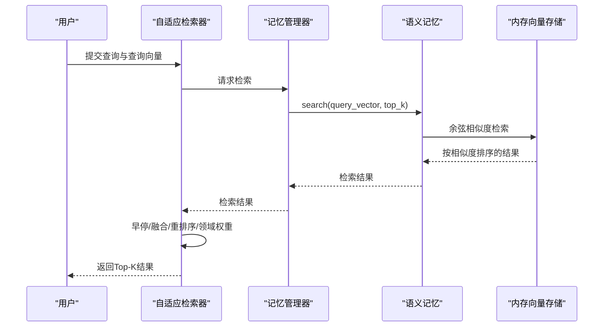
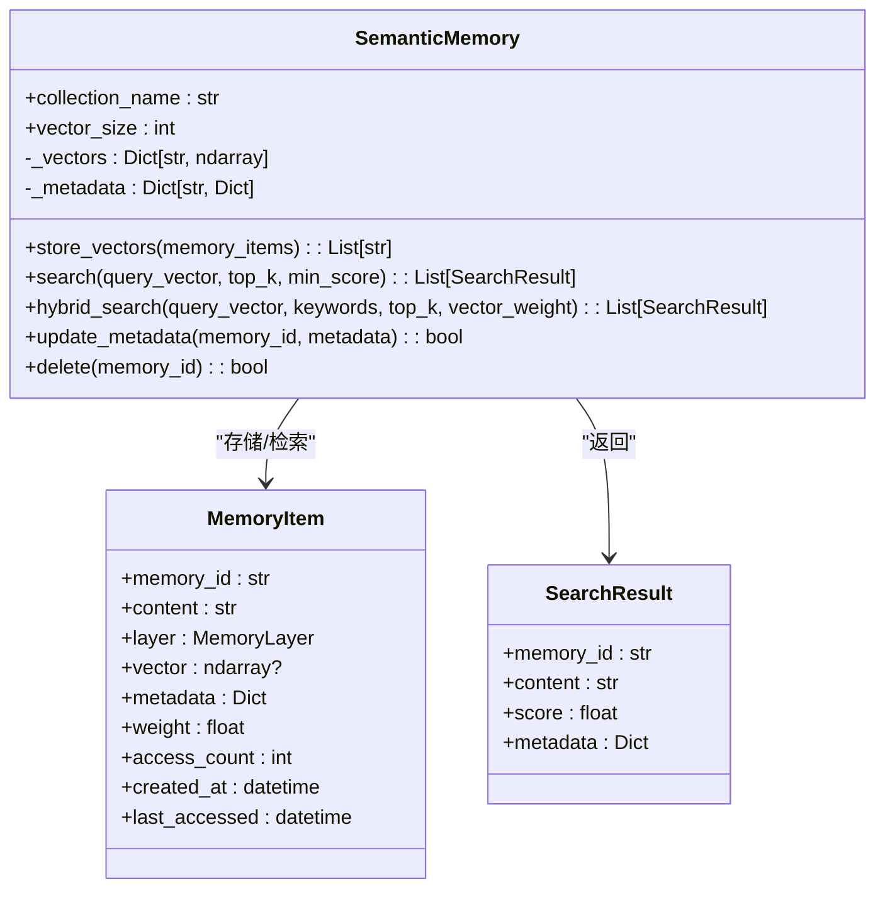
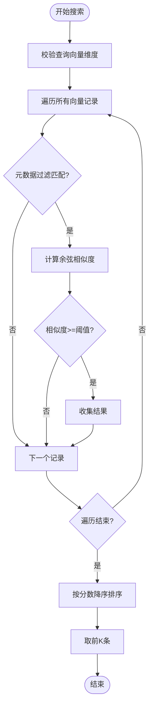
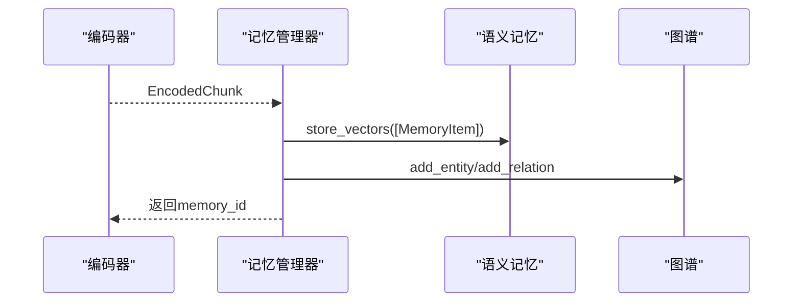
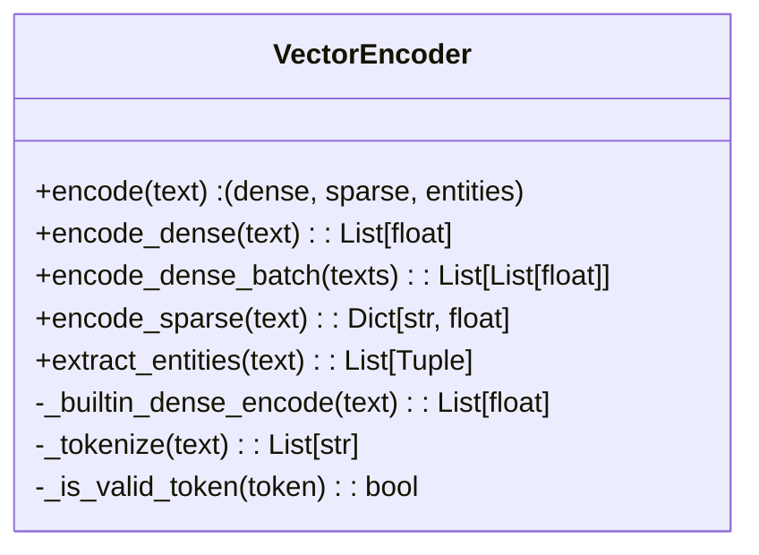
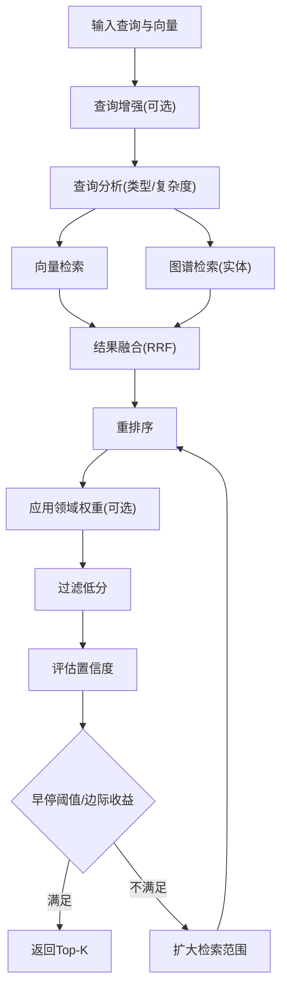
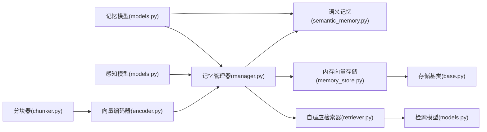

# 语义记忆 (L2)

<cite>
**本文引用的文件**
- [semantic_memory.py](file://src/memory/semantic_memory.py)
- [memory_store.py](file://src/memory/backends/memory_store.py)
- [base.py](file://src/memory/backends/base.py)
- [manager.py](file://src/memory/manager.py)
- [models.py](file://src/memory/models.py)
- [encoder.py](file://src/perception/encoder.py)
- [chunker.py](file://src/perception/chunker.py)
- [retriever.py](file://src/retrieval/retriever.py)
- [episodic_graph.py](file://src/memory/episodic_graph.py)
- [working_memory.py](file://src/memory/working_memory.py)
- [decay.py](file://src/memory/decay.py)
- [protocols.py](file://src/core/protocols.py)
- [models.py](file://src/retrieval/models.py)
- [models.py](file://src/perception/models.py)
- [L2语义记忆（向量数据库）.md](file://wiki/wiki/记忆管理层/L2语义记忆（向量数据库）.md)
- [三层记忆架构.md](file://wiki/wiki/记忆管理层/三层记忆架构.md)
- [记忆存储后端.md](file://wiki/wiki/记忆管理层/记忆存储后端.md)
</cite>

## 目录
1. [简介](#简介)
2. [项目结构](#项目结构)
3. [核心组件](#核心组件)
4. [架构总览](#架构总览)
5. [详细组件分析](#详细组件分析)
6. [依赖关系分析](#依赖关系分析)
7. [性能考量](#性能考量)
8. [故障排查指南](#故障排查指南)
9. [结论](#结论)
10. [附录](#附录)

## 简介
本文件聚焦于 NecoRAG 框架中的 L2 语义记忆模块，系统阐述其作为长期记忆的实现原理与工程实践，涵盖：
- 向量相似度检索与语义理解机制
- 向量存储格式、索引策略与检索算法
- 稀疏向量与稠密向量的混合使用方式
- 实体标签在语义检索中的作用
- 向量数据库配置、索引优化与查询性能调优
- 语义搜索最佳实践与常见问题解决方案

## 项目结构
围绕 L2 语义记忆的关键代码分布在以下模块：
- 记忆层：语义记忆、记忆管理器、向量/图存储后端
- 感知层：向量编码器、分块器、情境标签生成器
- 检索层：自适应检索器、HyDE增强、重排序与融合策略
- 示例：完整工作流演示

```mermaid
graph TB
subgraph "感知层"
CE["向量编码器<br/>生成稠密/稀疏向量与实体三元组"]
CK["分块器<br/>弹性/语义/固定等分块策略"]
end
subgraph "记忆层"
MM["记忆管理器<br/>统一三层记忆(L1/L2/L3)"]
SM["语义记忆<br/>向量检索/混合检索"]
VS["内存向量存储<br/>余弦相似度搜索"]
GS["内存图存储<br/>节点/边/路径/遍历"]
END
subgraph "检索层"
AR["自适应检索器<br/>早停/融合/重排序/领域权重"]
end
CE --> MM
CK --> CE
MM --> SM
SM --> VS
MM --> GS
AR --> MM
AR --> SM
```

图表来源
- [manager.py:16-195](file://src/memory/manager.py#L16-L195)
- [semantic_memory.py:21-179](file://src/memory/semantic_memory.py#L21-L179)
- [memory_store.py:20-381](file://src/memory/backends/memory_store.py#L20-L381)
- [encoder.py:24-254](file://src/perception/encoder.py#L24-L254)
- [chunker.py:11-566](file://src/perception/chunker.py#L11-L566)
- [retriever.py:122-440](file://src/retrieval/retriever.py#L122-L440)

章节来源
- [manager.py:16-195](file://src/memory/manager.py#L16-L195)
- [semantic_memory.py:21-179](file://src/memory/semantic_memory.py#L21-L179)
- [memory_store.py:20-381](file://src/memory/backends/memory_store.py#L20-L381)
- [encoder.py:24-254](file://src/perception/encoder.py#L24-L254)
- [chunker.py:11-566](file://src/perception/chunker.py#L11-L566)
- [retriever.py:122-440](file://src/retrieval/retriever.py#L122-L440)

## 核心组件
- 语义记忆（SemanticMemory）：负责向量存储、向量检索、混合检索、元数据更新与删除。
- 内存向量存储（InMemoryVectorStore）：提供基于内存的向量存储与余弦相似度检索，支持元数据过滤与阈值筛选。
- 记忆管理器（MemoryManager）：统一管理三层记忆，协调向量存储与图谱存储，执行记忆巩固与主动遗忘。
- 向量编码器（VectorEncoder）：生成稠密向量、稀疏向量与实体三元组，支持 LLM 客户端嵌入与内置实现。
- 分块器（ChunkStrategy）：提供弹性/语义/固定/结构化/句子级等分块策略，保障语义边界与块大小控制。
- 自适应检索器（AdaptiveRetriever）：实现早停机制、多路检索、结果融合、重排序与领域权重应用。

章节来源
- [semantic_memory.py:21-179](file://src/memory/semantic_memory.py#L21-L179)
- [memory_store.py:20-381](file://src/memory/backends/memory_store.py#L20-L381)
- [manager.py:16-195](file://src/memory/manager.py#L16-L195)
- [encoder.py:24-254](file://src/perception/encoder.py#L24-L254)
- [chunker.py:11-566](file://src/perception/chunker.py#L11-L566)
- [retriever.py:122-440](file://src/retrieval/retriever.py#L122-L440)

## 架构总览
L2 语义记忆在整体系统中的职责是"长期记忆"，通过向量相似度实现模糊匹配与直觉检索。其工作流如下：
- 感知层将原始文本编码为稠密向量、稀疏向量与实体三元组。
- 记忆管理器将编码后的知识持久化到语义记忆（向量存储）与图谱（实体关系）。
- 检索层以查询向量驱动语义检索，结合图谱、HyDE、重排序与领域权重，最终输出高质量检索结果。



图表来源
- [retriever.py:177-253](file://src/retrieval/retriever.py#L177-L253)
- [semantic_memory.py:80-118](file://src/memory/semantic_memory.py#L80-L118)
- [memory_store.py:55-91](file://src/memory/backends/memory_store.py#L55-L91)

## 详细组件分析

### 语义记忆（SemanticMemory）
- 职责
  - 存储向量：接收 MemoryItem 列表，将向量与元数据存入内存字典。
  - 向量检索：计算查询向量与库中向量的余弦相似度，按分数降序返回 Top-K。
  - 混合检索：预留接口，当前最小实现为仅向量检索。
  - 元数据更新与删除：支持按 ID 更新元数据与删除记忆。
- 数据结构
  - 向量映射：memory_id -> numpy 数组
  - 元数据映射：memory_id -> 字典（包含 content、layer、weight、metadata）
- 算法
  - 余弦相似度：dot(A,B)/(norm(A)*norm(B))
  - 排序与截断：按分数降序，取前 K 条
- 索引策略
  - 当前实现为线性扫描，适合小规模场景；大规模场景建议集成 HNSW 或向量数据库（如 Qdrant/Milvus）。



图表来源
- [semantic_memory.py:21-179](file://src/memory/semantic_memory.py#L21-L179)
- [models.py:19-31](file://src/memory/models.py#L19-L31)

章节来源
- [semantic_memory.py:21-179](file://src/memory/semantic_memory.py#L21-L179)
- [models.py:19-31](file://src/memory/models.py#L19-L31)

### 内存向量存储（InMemoryVectorStore）
- 职责
  - 插入/更新：校验维度后写入记录。
  - 搜索：对每个记录计算余弦相似度，应用元数据过滤与阈值，按分数降序返回 Top-K。
  - 批量获取/删除/计数/清空：提供常用操作。
- 元数据过滤
  - 支持精确匹配与列表匹配，便于按类型、标签等条件筛选。
- 性能
  - O(N) 线性扫描，适合小规模数据；大规模需引入索引或外部向量数据库。



图表来源
- [memory_store.py:55-91](file://src/memory/backends/memory_store.py#L55-L91)

章节来源
- [memory_store.py:20-381](file://src/memory/backends/memory_store.py#L20-L381)

### 记忆管理器（MemoryManager）
- 职责
  - 统一管理 L1、L2、L3 三层记忆。
  - 将编码后的知识存储到语义记忆与图谱，并维护统一索引。
  - 执行记忆巩固与主动遗忘，基于权重衰减策略。
- 存储流程
  - 将 EncodedChunk 封装为 MemoryItem，写入语义记忆。
  - 解析实体三元组，构建实体与关系，写入图谱。
- 检索流程
  - L2 向量检索：调用语义记忆 search，结合衰减强化访问。



图表来源
- [manager.py:48-112](file://src/memory/manager.py#L48-L112)
- [semantic_memory.py:50-78](file://src/memory/semantic_memory.py#L50-L78)

章节来源
- [manager.py:16-195](file://src/memory/manager.py#L16-L195)

### 向量编码器（VectorEncoder）
- 职责
  - 生成稠密向量：优先使用 LLM 客户端嵌入，回退至内置实现。
  - 生成稀疏向量：基于 TF-IDF 风格的词频统计，返回关键词权重字典。
  - 提取实体三元组：基于规则匹配，抽取"主语-关系-宾语"三元组。
- 分词与过滤
  - 支持中英文分词，过滤停用词与短词，保留有效 token。
- 稠密向量生成
  - 内置实现：基于文本哈希确定随机种子，生成高斯噪声向量并归一化，确保确定性。



图表来源
- [encoder.py:24-254](file://src/perception/encoder.py#L24-L254)

章节来源
- [encoder.py:24-254](file://src/perception/encoder.py#L24-L254)

### 分块器（ChunkStrategy）
- 职责
  - 提供多种分块策略：弹性分块、语义分块、固定大小分块、结构化分块、句子级分块。
  - 通过语义边界（段落/句子/子句）与块大小控制，减少碎片化并保持语义完整性。
- 弹性分块算法
  - 按段落合并小块、拆分大块、添加重叠上下文，最终生成 Chunk 列表。

章节来源
- [chunker.py:11-566](file://src/perception/chunker.py#L11-L566)

### 自适应检索器（AdaptiveRetriever）
- 职责
  - 多路检索：向量检索、图谱检索、HyDE 增强、领域权重。
  - 早停机制：基于置信度阈值与边际收益递减策略，避免冗余计算。
  - 结果融合：采用 Reciprocal Rank Fusion（RRF）。
  - 重排序：使用重排序模型提升相关性。
- 流程
  - 查询增强（可选）→ 查询分析（类型/复杂度）→ 多路检索→融合→重排序→应用领域权重→过滤→早停判断→返回 Top-K。



图表来源
- [retriever.py:177-253](file://src/retrieval/retriever.py#L177-L253)
- [retriever.py:30-120](file://src/retrieval/retriever.py#L30-L120)

章节来源
- [retriever.py:122-440](file://src/retrieval/retriever.py#L122-L440)

## 依赖关系分析
- 语义记忆依赖 MemoryItem 数据模型与 numpy 向量运算。
- 记忆管理器依赖感知层的 EncodedChunk 与记忆模型，协调语义记忆与图谱。
- 内存向量存储实现 BaseVectorStore 接口，提供统一的向量检索能力。
- 自适应检索器依赖记忆管理器与检索模型，串联多路检索与优化策略。



图表来源
- [models.py:19-67](file://src/memory/models.py#L19-L67)
- [semantic_memory.py:21-179](file://src/memory/semantic_memory.py#L21-L179)
- [manager.py:16-195](file://src/memory/manager.py#L16-L195)
- [encoder.py:24-254](file://src/perception/encoder.py#L24-L254)
- [chunker.py:11-566](file://src/perception/chunker.py#L11-L566)
- [memory_store.py:20-381](file://src/memory/backends/memory_store.py#L20-L381)
- [base.py:54-297](file://src/memory/backends/base.py#L54-L297)
- [retriever.py:122-440](file://src/retrieval/retriever.py#L122-L440)
- [models.py:9-29](file://src/retrieval/models.py#L9-L29)

章节来源
- [models.py:19-67](file://src/memory/models.py#L19-L67)
- [semantic_memory.py:21-179](file://src/memory/semantic_memory.py#L21-L179)
- [manager.py:16-195](file://src/memory/manager.py#L16-L195)
- [encoder.py:24-254](file://src/perception/encoder.py#L24-L254)
- [chunker.py:11-566](file://src/perception/chunker.py#L11-L566)
- [memory_store.py:20-381](file://src/memory/backends/memory_store.py#L20-L381)
- [base.py:54-297](file://src/memory/backends/base.py#L54-L297)
- [retriever.py:122-440](file://src/retrieval/retriever.py#L122-L440)
- [models.py:9-29](file://src/retrieval/models.py#L9-L29)

## 性能考量
- 向量维度与相似度计算
  - 维度越高，向量稀疏性越强，余弦相似度更稳定；但计算成本更高。
  - 建议在编码器中统一设置向量维度，并在检索时保持一致。
- 线性扫描与索引
  - 当前内存向量存储为 O(N) 线性扫描，适合小规模数据。
  - 大规模场景建议：
    - 集成 HNSW 索引（当前 TODO 中已标注）
    - 使用外部向量数据库（如 Qdrant/Milvus），支持分区、倒排索引与近似最近邻检索。
- 元数据过滤与阈值
  - 合理设置 min_score 与 filters，可显著减少无效计算。
  - 对热点字段建立索引（如时间、主题、重要性）可加速过滤。
- 批量处理
  - encode_dense_batch 与向量批量写入可降低 I/O 开销。
- 早停机制
  - 基于置信度阈值与边际收益递减策略，避免不必要的重排序与领域权重计算。
- 稀疏向量与稠密向量混合
  - 稀疏向量可用于关键词过滤与粗排，稠密向量用于细排与语义匹配。
  - 建议在融合阶段对两类向量进行归一化与加权组合。

## 故障排查指南
- 向量维度不匹配
  - 现象：插入或查询时报维度错误。
  - 处理：确保编码器与向量存储的维度一致；在批量写入前校验向量长度。
- 相似度异常
  - 现象：返回分数为 NaN 或 0。
  - 处理：检查向量是否归一化；确认查询向量与库中向量均非零向量。
- 元数据过滤无效
  - 现象：过滤条件不起作用。
  - 处理：核对 filters 键名与类型；确保元数据字段命名一致。
- 混合检索未生效
  - 现象：hybrid_search 仍返回仅向量检索结果。
  - 处理：实现稀疏向量与关键词权重的融合逻辑（当前 TODO）。
- 早停过早导致召回不足
  - 现象：置信度过高，提前终止。
  - 处理：调整 confidence_threshold 与 min_gain；对简单查询适当降低阈值。
- 实体标签影响检索
  - 现象：图谱检索为空或结果较少。
  - 处理：检查实体抽取规则与覆盖率；必要时增强 LLM 客户端或规则模板。

章节来源
- [memory_store.py:45-53](file://src/memory/backends/memory_store.py#L45-L53)
- [semantic_memory.py:98-118](file://src/memory/semantic_memory.py#L98-L118)
- [memory_store.py:72-74](file://src/memory/backends/memory_store.py#L72-L74)
- [retriever.py:81-101](file://src/retrieval/retriever.py#L81-L101)

## 结论
L2 语义记忆模块通过"稠密向量+稀疏向量+实体标签"的多模态表示，实现了面向语义的理解与检索。当前实现以内存存储为基础，具备良好的扩展性与可插拔性。建议在生产环境中：
- 集成 HNSW 索引与外部向量数据库，提升检索性能与可扩展性
- 完善混合检索算法，充分利用稀疏向量与实体标签
- 优化早停策略与领域权重，平衡准确率与效率
- 建立监控与日志体系，持续跟踪检索质量与性能指标

## 附录

### 向量数据库配置与索引优化（实践建议）
- 索引类型
  - HNSW：适合高维稠密向量，支持动态插入与近似检索
  - IVF/PQ：适合大规模向量，支持分片与压缩
- 索引参数
  - efConstruction：构建时探索宽度，越大召回越好但耗时更长
  - M：连接数，影响图密度与查询速度
  - ef：查询时探索宽度，平衡精度与速度
- 元数据索引
  - 对常用过滤字段（如 topic、time_tag、importance_score）建立倒排索引
- 查询优化
  - 启用预过滤（先用稀疏向量/关键词过滤，再做稠密向量检索）
  - 使用缓存命中热点查询向量与实体三元组
- 数据治理
  - 定期清理低权重/过期向量，维持索引质量
  - 监控向量分布与相似度分布，及时调整阈值与维度

### 语义搜索最佳实践
- 查询增强
  - 使用 HyDE 生成假设文档，提升抽象概念检索效果
- 多路融合
  - 向量检索、图谱检索与关键词检索结果采用 RRF 融合
- 重排序与领域权重
  - 使用重排序模型提升相关性；结合领域权重与时间衰减
- 早停策略
  - 基于置信度阈值与边际收益递减，避免过度计算
- 实体标签利用
  - 将实体三元组用于图谱检索与路径推理，增强语义连贯性

章节来源
- [retriever.py:177-253](file://src/retrieval/retriever.py#L177-L253)
- [encoder.py:148-189](file://src/perception/encoder.py#L148-L189)