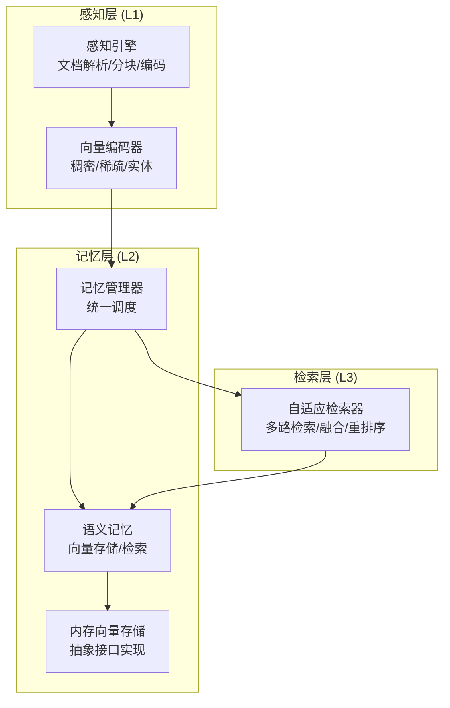
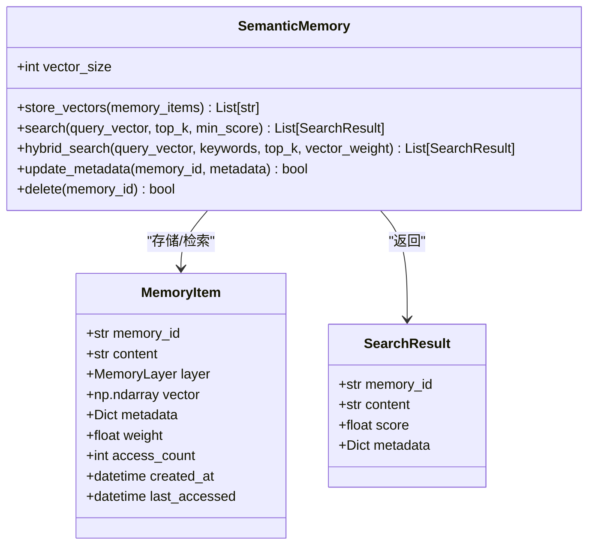
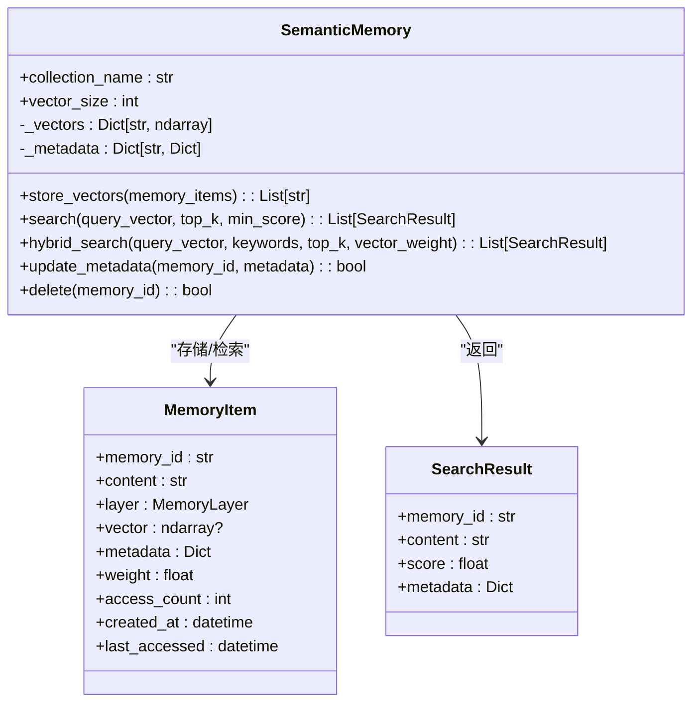
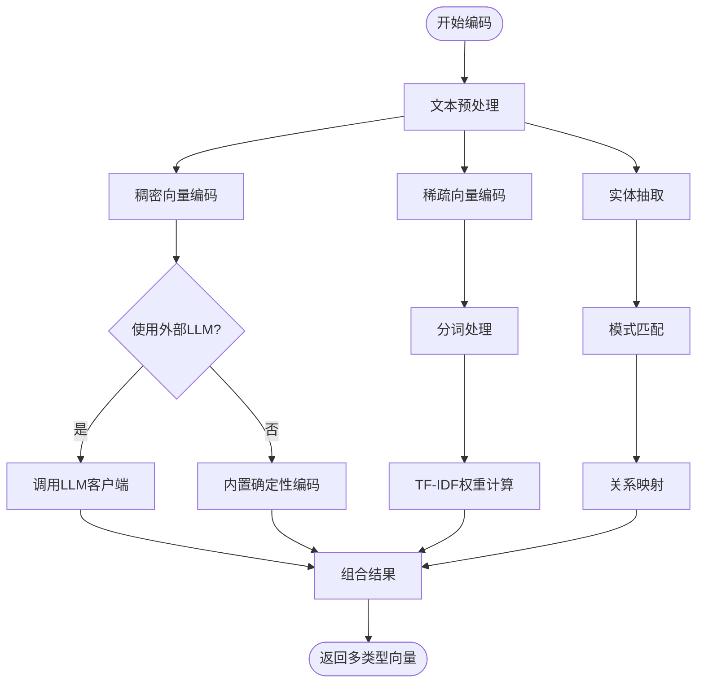
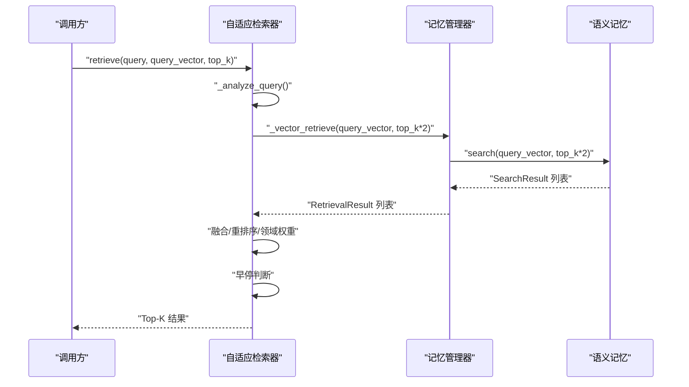
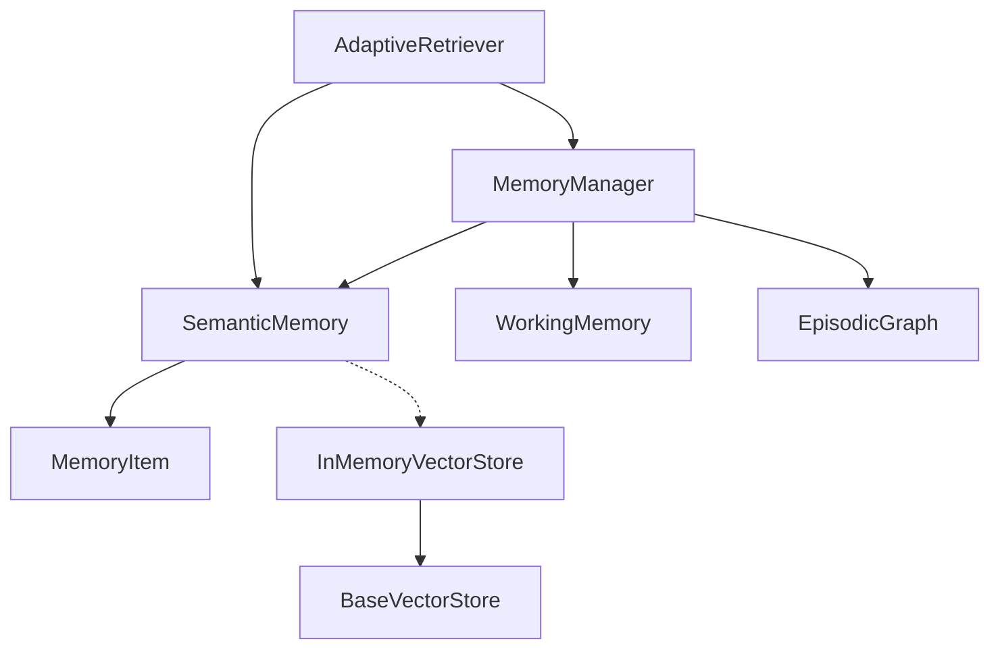

# 语义记忆系统

<cite>
**本文引用的文件**
- [semantic_memory.py](file://src/memory/semantic_memory.py)
- [memory_store.py](file://src/memory/backends/memory_store.py)
- [base.py](file://src/memory/backends/base.py)
- [models.py](file://src/memory/models.py)
- [manager.py](file://src/memory/manager.py)
- [engine.py](file://src/perception/engine.py)
- [encoder.py](file://src/perception/encoder.py)
- [retriever.py](file://src/retrieval/retriever.py)
- [README.md](file://src/memory/README.md)
- [example_usage.py](file://example/example_usage.py)
- [L2语义记忆（向量数据库）.md](file://wiki/wiki/记忆管理层/L2语义记忆（向量数据库）.md)
- [语义记忆 (L2).md](file://wiki/wiki/核心架构设计/五层认知架构/记忆层 (L2)/语义记忆 (L2).md)
- [向量编码器.md](file://wiki/wiki/核心架构设计/五层认知架构/感知层 (L1)/向量编码器.md)
- [deployment_quickref.md](file://3rd/legacy/deployment_quickref.md)
- [reranker.py](file://src/retrieval/reranker.py)
</cite>

## 目录
1. [简介](#简介)
2. [项目结构](#项目结构)
3. [核心组件](#核心组件)
4. [架构总览](#架构总览)
5. [详细组件分析](#详细组件分析)
6. [依赖关系分析](#依赖关系分析)
7. [性能考量](#性能考量)
8. [故障排查指南](#故障排查指南)
9. [结论](#结论)
10. [附录](#附录)

## 简介
本节面向语义记忆（L2）的设计理念与实现，重点阐述其作为长期存储的知识库如何通过高维向量数据库实现模糊匹配与直觉检索，并结合感知引擎的编码结果，完成从“感知-记忆-检索-生成”的闭环。文档将覆盖：
- 向量数据库的相似性检索机制（余弦相似度）
- 混合存储策略（稠密向量与稀疏向量）
- 语义理解与概念关联（实体抽取、图谱连接）
- 向量索引构建、相似度计算与与感知编码的匹配过程
- 查询接口、性能调优与向量维度选择指南
- 使用示例与向量搜索优化策略

## 项目结构
语义记忆系统位于记忆层（L2），与感知层（L1）和检索层（L3）紧密协作，形成完整的知识处理流水线。下图展示了与 L2 语义记忆直接相关的模块及其职责：

**图表来源**
- [engine.py:20-195](file://src/perception/engine.py#L20-L195)
- [manager.py:20-212](file://src/memory/manager.py#L20-L212)
- [semantic_memory.py:21-179](file://src/memory/semantic_memory.py#L21-L179)
- [memory_store.py:20-381](file://src/memory/backends/memory_store.py#L20-L381)
- [retriever.py:135-644](file://src/retrieval/retriever.py#L135-L644)

**章节来源**
- [README.md:1-244](file://src/memory/README.md#L1-L244)
- [engine.py:20-195](file://src/perception/engine.py#L20-L195)
- [manager.py:20-212](file://src/memory/manager.py#L20-L212)
- [semantic_memory.py:21-179](file://src/memory/semantic_memory.py#L21-L179)
- [memory_store.py:20-381](file://src/memory/backends/memory_store.py#L20-L381)
- [retriever.py:135-644](file://src/retrieval/retriever.py#L135-L644)

## 核心组件
- 语义记忆（SemanticMemory）：负责向量存储、相似度检索、混合检索与元数据更新/删除
- 记忆管理器（MemoryManager）：将感知编码结果写入 L2，并在检索时触发 L2 搜索
- 感知引擎（PerceptionEngine）：提供文档解析、分块与向量化（稠密/稀疏/实体）
- 向量编码器（VectorEncoder）：生成稠密向量、稀疏向量与实体三元组
- 内存向量存储（InMemoryVectorStore）：提供余弦相似度搜索与过滤能力
- 自适应检索器（AdaptiveRetriever）：多路检索、融合、重排序与早停

**章节来源**
- [semantic_memory.py:21-179](file://src/memory/semantic_memory.py#L21-L179)
- [manager.py:20-212](file://src/memory/manager.py#L20-L212)
- [engine.py:20-195](file://src/perception/engine.py#L20-L195)
- [encoder.py:25-255](file://src/perception/encoder.py#L25-L255)
- [memory_store.py:20-381](file://src/memory/backends/memory_store.py#L20-L381)
- [retriever.py:135-644](file://src/retrieval/retriever.py#L135-L644)

## 架构总览
L2 语义记忆在整体架构中的定位与职责如下：
- 输入：感知引擎产出的 EncodedChunk（含稠密向量、稀疏向量、实体、情境标签）
- 存储：MemoryManager 将 EncodedChunk 转换为 MemoryItem 并写入 L2（SemanticMemory）
- 检索：AdaptiveRetriever 调用 MemoryManager 与 SemanticMemory，执行向量检索与后续处理
- 输出：检索结果（含内容、分数、元数据）供上层生成与交互使用

**图表来源**
- [semantic_memory.py:21-179](file://src/memory/semantic_memory.py#L21-L179)
- [models.py:14-26](file://src/memory/models.py#L14-L26)

**章节来源**
- [semantic_memory.py:21-179](file://src/memory/semantic_memory.py#L21-L179)
- [models.py:14-26](file://src/memory/models.py#L14-L26)

## 详细组件分析

### 语义记忆（SemanticMemory）
- 职责
  - 存储向量：接收MemoryItem列表，将向量与元数据存入内存字典。
  - 向量检索：计算查询向量与库中向量的余弦相似度，按分数降序返回Top-K。
  - 混合检索：预留接口，当前最小实现为仅向量检索。
  - 元数据更新与删除：支持按ID更新元数据与删除记忆。
- 数据结构
  - 向量映射：memory_id -> numpy数组
  - 元数据映射：memory_id -> 字典（包含content、layer、weight、metadata）
- 算法
  - 余弦相似度：dot(A,B)/(norm(A)*norm(B))
  - 排序与截断：按分数降序，取前K条
- 索引策略
  - 当前实现为线性扫描，适合小规模场景；大规模场景建议集成HNSW或向量数据库（如Qdrant/Milvus）。

**图表来源**
- [semantic_memory.py:21-179](file://src/memory/semantic_memory.py#L21-L179)
- [models.py:19-31](file://src/memory/models.py#L19-L31)

**章节来源**
- [semantic_memory.py:21-179](file://src/memory/semantic_memory.py#L21-L179)
- [models.py:19-31](file://src/memory/models.py#L19-L31)

### 记忆管理器（MemoryManager）
- 职责：统一调度三层记忆；将感知编码结果写入 L2；在检索时触发 L2 搜索
- 关键流程：
  - store：将 EncodedChunk 转为 MemoryItem，写入 L2；同时将实体写入 L3 图谱
  - retrieve：若提供 query_vector，则调用 L2 搜索并返回 MemoryItem 列表
  - consolidate/forget：基于衰减机制进行记忆巩固与主动遗忘

**章节来源**
- [manager.py:52-123](file://src/memory/manager.py#L52-L123)
- [manager.py:124-159](file://src/memory/manager.py#L124-L159)
- [manager.py:161-202](file://src/memory/manager.py#L161-L202)

### 感知引擎与向量编码
- 感知引擎负责文档解析、分块与编码，生成 EncodedChunk（包含稠密向量、稀疏向量、实体、情境标签）
- 向量编码器支持两种模式：
  - 使用外部 LLM 客户端进行向量化
  - 内置确定性编码（基于文本哈希生成伪向量）

**图表来源**
- [encoder.py:73-190](file://src/perception/encoder.py#L73-L190)

**章节来源**
- [engine.py:96-154](file://src/perception/engine.py#L96-L154)
- [encoder.py:73-190](file://src/perception/encoder.py#L73-L190)

### 检索器与相关性排序
- AdaptiveRetriever 负责多路检索、结果融合、重排序与早停
- 早停控制器基于置信度阈值与边际收益递减策略，避免不必要的重排序与领域权重计算
- 重排序器采用多样性保障与冗余惩罚策略，提升结果质量

**图表来源**
- [retriever.py:224-308](file://src/retrieval/retriever.py#L224-L308)
- [manager.py:147-159](file://src/memory/manager.py#L147-L159)
- [semantic_memory.py:80-118](file://src/memory/semantic_memory.py#L80-L118)

**章节来源**
- [retriever.py:43-133](file://src/retrieval/retriever.py#L43-L133)
- [retriever.py:224-308](file://src/retrieval/retriever.py#L224-L308)
- [manager.py:147-159](file://src/memory/manager.py#L147-L159)
- [semantic_memory.py:80-118](file://src/memory/semantic_memory.py#L80-L118)

## 依赖关系分析
- SemanticMemory 依赖 MemoryItem 数据模型
- MemoryManager 统一管理 L1/L2/L3 三层记忆，并协调 SemanticMemory
- InMemoryVectorStore 实现 BaseVectorStore 抽象接口，提供内存向量存储能力
- AdaptiveRetriever 依赖 MemoryManager 与 SemanticMemory，实现多路检索与早停

**图表来源**
- [semantic_memory.py:9-9](file://src/memory/semantic_memory.py#L9-L9)
- [models.py:14-26](file://src/memory/models.py#L14-L26)
- [manager.py:44-47](file://src/memory/manager.py#L44-L47)
- [memory_store.py:13-17](file://src/memory/backends/memory_store.py#L13-L17)
- [base.py:61-148](file://src/memory/backends/base.py#L61-L148)
- [retriever.py:11-24](file://src/retrieval/retriever.py#L11-L24)

**章节来源**
- [semantic_memory.py:9-9](file://src/memory/semantic_memory.py#L9-L9)
- [models.py:14-26](file://src/memory/models.py#L14-L26)
- [manager.py:44-47](file://src/memory/manager.py#L44-L47)
- [memory_store.py:13-17](file://src/memory/backends/memory_store.py#L13-L17)
- [base.py:61-148](file://src/memory/backends/base.py#L61-L148)
- [retriever.py:11-24](file://src/retrieval/retriever.py#L11-L24)

## 性能考量
- 向量维度与相似度计算
  - 维度越高，向量稀疏性越强，余弦相似度更稳定；但计算成本更高。
  - 建议在编码器中统一设置向量维度，并在检索时保持一致。
- 线性扫描与索引
  - 当前内存向量存储为O(N)线性扫描，适合小规模数据。
  - 大规模场景建议：
    - 集成HNSW索引（当前TODO中已标注）
    - 使用外部向量数据库（如Qdrant/Milvus），支持分区、倒排索引与近似最近邻检索。
- 元数据过滤与阈值
  - 合理设置min_score与filters，可显著减少无效计算。
  - 对热点字段建立索引（如时间、主题、重要性）可加速过滤。
- 批量处理
  - encode_dense_batch与向量批量写入可降低I/O开销。
- 早停机制
  - 基于置信度阈值与边际收益递减策略，避免不必要的重排序与领域权重计算。
- 稀疏向量与稠密向量混合
  - 稀疏向量可用于关键词过滤与粗排，稠密向量用于细排与语义匹配。
  - 建议在融合阶段对两类向量进行归一化与加权组合。

**章节来源**
- [L2语义记忆（向量数据库）.md:391-411](file://wiki/wiki/记忆管理层/L2语义记忆（向量数据库）.md#L391-L411)
- [memory_store.py:55-91](file://src/memory/backends/memory_store.py#L55-L91)
- [semantic_memory.py:80-118](file://src/memory/semantic_memory.py#L80-L118)

## 故障排查指南
- 向量维度不匹配
  - 现象：插入或查询时报维度错误。
  - 处理：确保编码器与向量存储的维度一致；在批量写入前校验向量长度。
- 相似度异常
  - 现象：返回分数为NaN或0。
  - 处理：检查向量是否归一化；确认查询向量与库中向量均非零向量。
- 元数据过滤无效
  - 现象：过滤条件不起作用。
  - 处理：核对filters键名与类型；确保元数据字段命名一致。
- 混合检索未生效
  - 现象：hybrid_search仍返回仅向量检索结果。
  - 处理：实现稀疏向量与关键词权重的融合逻辑（当前TODO）。
- 早停过早导致召回不足
  - 现象：置信度过高，提前终止。
  - 处理：调整confidence_threshold与min_gain；对简单查询适当降低阈值。
- 实体标签影响检索
  - 现象：图谱检索为空或结果较少。
  - 处理：检查实体抽取规则与覆盖率；必要时增强LLM客户端或规则模板。

**章节来源**
- [L2语义记忆（向量数据库）.md:413-437](file://wiki/wiki/记忆管理层/L2语义记忆（向量数据库）.md#L413-L437)
- [semantic_memory.py:98-118](file://src/memory/semantic_memory.py#L98-L118)
- [memory_store.py:72-74](file://src/memory/backends/memory_store.py#L72-L74)
- [retriever.py:81-101](file://src/retrieval/retriever.py#L81-L101)

## 结论
L2 语义记忆通过向量检索与元数据管理，实现了对知识的模糊匹配与直觉检索；配合动态权重衰减机制，模拟人类记忆的巩固与遗忘，提升长期知识的有效性与稳定性。通过抽象接口与内存实现，系统具备良好的扩展性，可平滑迁移到 Redis/Qdrant/Neo4j 等生产级存储。结合领域权重与时间衰减，可在检索后进一步提升相关性与时效性。

## 附录

### 向量维度配置与相似度阈值设置
- 向量维度
  - 建议在编码器中统一设置向量维度（如768/1024），并在检索时保持一致。
  - 维度越高，相似度计算更稳定，但计算成本更高。
- 相似度阈值
  - min_score：过滤低分结果，建议根据业务场景调整（如0.3-0.7）。
  - confidence_threshold：早停阈值，建议根据查询复杂度动态调整。
- 元数据过滤
  - filters：支持精确匹配与列表匹配，建议对热点字段建立索引。

**章节来源**
- [encoder.py:33-71](file://src/perception/encoder.py#L33-L71)
- [memory_store.py:55-91](file://src/memory/backends/memory_store.py#L55-L91)
- [semantic_memory.py:80-118](file://src/memory/semantic_memory.py#L80-L118)
- [retriever.py:229-230](file://src/retrieval/retriever.py#L229-L230)

### 实际查询示例与调试技巧
- 使用示例
  - 参考示例脚本中的完整工作流程：文档解析 → 编码 → 存储 → 检索 → 答案生成 → 交互响应。
- 调试技巧
  - 启用检索路径追踪（Retrieval Trace）查看每一步骤的执行情况。
  - 使用早停控制器评估置信度，及时发现召回不足问题。
  - 通过领域权重计算查看各维度得分（基础分数、关键词权重、时间权重、领域权重）。

**章节来源**
- [example_usage.py:12-252](file://example/example_usage.py#L12-L252)
- [retriever.py:424-431](file://src/retrieval/retriever.py#L424-L431)
- [retriever.py:310-360](file://src/retrieval/retriever.py#L310-L360)

### 向量数据库集成指南（Qdrant/Milvus）
- 部署与配置
  - 可参考部署快速指南中的 Qdrant 配置与性能调优建议。
  - 建议使用 HNSW 索引与合适的 ef_construct 参数以平衡检索速度与内存占用。
- 迁移策略
  - 将内存实现替换为外部向量数据库客户端，保持接口一致。
  - 确保集合名称与向量维度与现有数据一致。

**章节来源**
- [deployment_quickref.md:221-298](file://3rd/legacy/deployment_quickref.md#L221-L298)
- [semantic_memory.py:63-64](file://src/memory/semantic_memory.py#L63-L64)