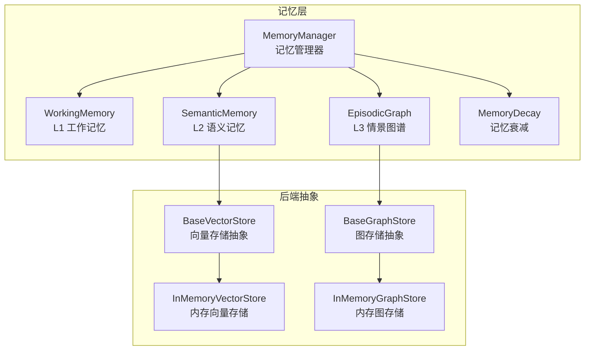
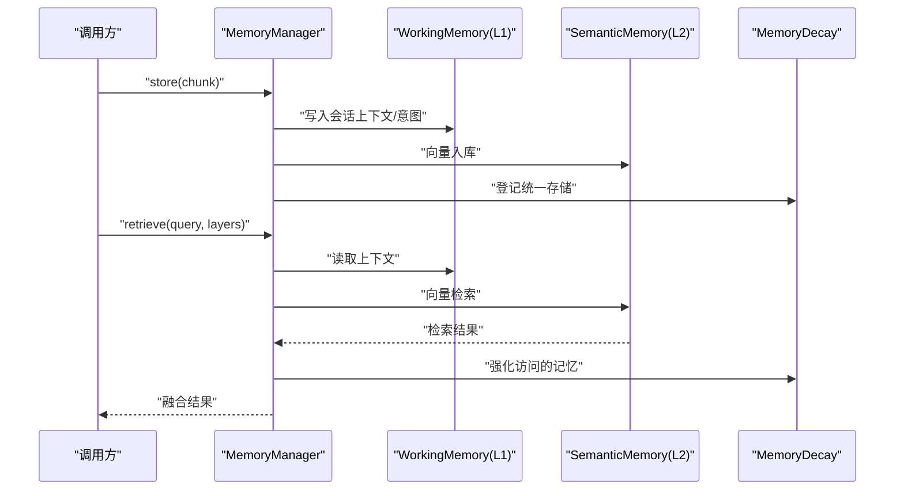
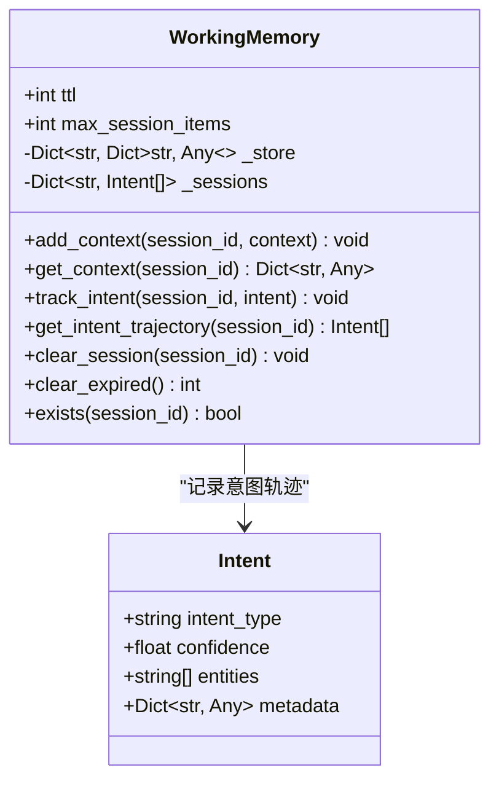
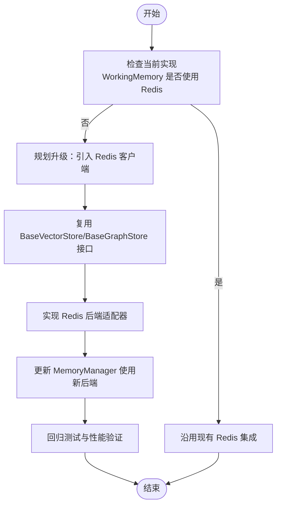
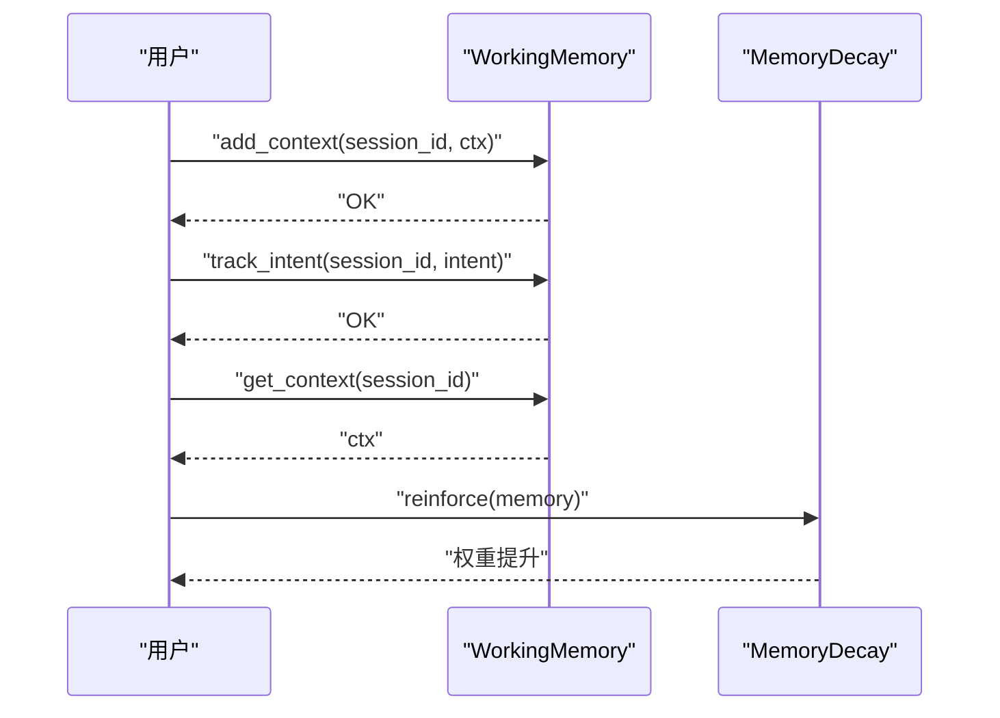
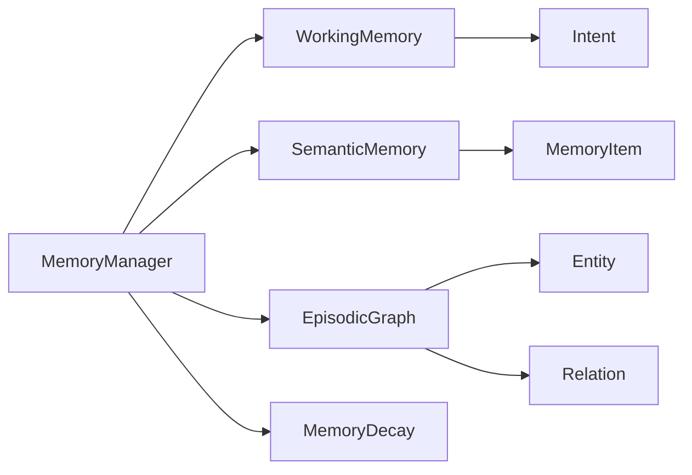

# 工作记忆管理

<cite>
**本文引用的文件**
- [src/memory/working_memory.py](file://src/memory/working_memory.py)
- [src/memory/manager.py](file://src/memory/manager.py)
- [src/memory/models.py](file://src/memory/models.py)
- [src/memory/semantic_memory.py](file://src/memory/semantic_memory.py)
- [src/memory/episodic_graph.py](file://src/memory/episodic_graph.py)
- [src/memory/decay.py](file://src/memory/decay.py)
- [src/memory/backends/base.py](file://src/memory/backends/base.py)
- [src/memory/backends/memory_store.py](file://src/memory/backends/memory_store.py)
- [src/memory/README.md](file://src/memory/README.md)
- [src/core/config.py](file://src/core/config.py)
- [example/example_usage.py](file://example/example_usage.py)
- [requirements.txt](file://requirements.txt)
</cite>

## 目录
1. [简介](#简介)
2. [项目结构](#项目结构)
3. [核心组件](#核心组件)
4. [架构总览](#架构总览)
5. [组件详细分析](#组件详细分析)
6. [依赖关系分析](#依赖关系分析)
7. [性能考量](#性能考量)
8. [故障排查指南](#故障排查指南)
9. [结论](#结论)
10. [附录](#附录)

## 简介
本文件面向“工作记忆管理”的技术文档，聚焦 L1 工作记忆（短期存储、高频访问、临时数据管理）。文档围绕以下目标展开：
- 设计原理与实现机制：TTL 自动过期、会话上下文与意图轨迹管理、模拟瞬时遗忘
- 存储后端选择与配置：Redis 等外部存储的集成方式与参数映射
- 数据结构、访问模式与性能优化策略
- 增删改查操作示例与典型使用场景
- 内存管理、缓存策略与并发访问处理
- 扩展与定制建议（如替换为真实 Redis 后端）

## 项目结构
工作记忆相关代码位于 src/memory 目录，核心文件如下：
- working_memory.py：L1 工作记忆实现（当前以内存字典模拟 Redis）
- manager.py：记忆管理器，统一编排 L1/L2/L3 三层记忆
- models.py：记忆与数据模型（MemoryItem、Intent 等）
- semantic_memory.py：L2 语义记忆（向量存储，当前以内存实现）
- episodic_graph.py：L3 情景图谱（实体关系网络，当前以内存实现）
- decay.py：记忆衰减机制（权重动态调整、主动遗忘）
- backends/base.py 与 backends/memory_store.py：向量与图存储抽象及内存实现
- README.md：整体架构与使用说明
- core/config.py：全局配置（含记忆层配置项）
- example/example_usage.py：完整使用示例
- requirements.txt：依赖声明（含 Redis、Qdrant、Neo4j 等可选依赖）

图表来源
- [src/memory/manager.py:16-47](file://src/memory/manager.py#L16-L47)
- [src/memory/working_memory.py:11-35](file://src/memory/working_memory.py#L11-L35)
- [src/memory/semantic_memory.py:21-49](file://src/memory/semantic_memory.py#L21-L49)
- [src/memory/episodic_graph.py:10-32](file://src/memory/episodic_graph.py#L10-L32)
- [src/memory/decay.py:11-38](file://src/memory/decay.py#L11-L38)
- [src/memory/backends/base.py:54-137](file://src/memory/backends/base.py#L54-L137)
- [src/memory/backends/memory_store.py:20-141](file://src/memory/backends/memory_store.py#L20-L141)

章节来源
- [src/memory/README.md:1-244](file://src/memory/README.md#L1-L244)
- [src/memory/manager.py:16-47](file://src/memory/manager.py#L16-L47)

## 核心组件
- WorkingMemory（L1）：短期上下文与意图轨迹管理，具备 TTL 过期与会话条目上限控制；当前实现为内存字典模拟，后续可替换为 Redis
- MemoryManager：统一编排三层记忆，负责存储、检索、巩固与主动遗忘
- MemoryDecay：基于时间与访问频率的权重衰减，支持归档与强化
- SemanticMemory（L2）：高维向量存储与检索（当前内存实现）
- EpisodicGraph（L3）：实体关系网络与多跳推理（当前内存实现）
- Backends 抽象：BaseVectorStore/BaseGraphStore 及其内存实现 InMemoryVectorStore/InMemoryGraphStore

章节来源
- [src/memory/working_memory.py:11-120](file://src/memory/working_memory.py#L11-L120)
- [src/memory/manager.py:16-47](file://src/memory/manager.py#L16-L47)
- [src/memory/decay.py:11-155](file://src/memory/decay.py#L11-L155)
- [src/memory/semantic_memory.py:21-179](file://src/memory/semantic_memory.py#L21-L179)
- [src/memory/episodic_graph.py:10-194](file://src/memory/episodic_graph.py#L10-L194)
- [src/memory/backends/base.py:54-297](file://src/memory/backends/base.py#L54-L297)
- [src/memory/backends/memory_store.py:20-381](file://src/memory/backends/memory_store.py#L20-L381)

## 架构总览
L1 工作记忆作为最短时延的缓存层，承载当前会话上下文与用户意图轨迹；L2 语义记忆负责高维向量检索；L3 情景图谱负责结构化推理。记忆管理器协调三层，结合记忆衰减机制进行巩固与主动遗忘。

图表来源
- [src/memory/manager.py:48-147](file://src/memory/manager.py#L48-L147)
- [src/memory/working_memory.py:36-85](file://src/memory/working_memory.py#L36-L85)
- [src/memory/semantic_memory.py:50-118](file://src/memory/semantic_memory.py#L50-L118)
- [src/memory/decay.py:120-142](file://src/memory/decay.py#L120-L142)

## 组件详细分析

### L1 工作记忆（WorkingMemory）
- 设计要点
  - 会话级上下文存储：add_context/get_context
  - 用户意图轨迹：track_intent/get_intent_trajectory
  - 会话清理：clear_session
  - 过期清理占位：clear_expired（当前返回 0，需后续实现 TTL 检测）
  - 存在性检查：exists
- 数据结构
  - 会话存储：字典映射 session_id -> 上下文键值对
  - 会话意图：字典映射 session_id -> Intent 列表
- 访问模式
  - 极低延迟：内存字典 O(1) 访问
  - 会话维度：按 session_id 读写，避免跨会话污染
- 性能优化
  - 会话条目上限：max_session_items 控制单会话大小
  - 最近更新标记：_last_update 便于后续过期策略
- 使用场景
  - 对话上下文、多轮问答状态、用户意图追踪、临时状态缓存

图表来源
- [src/memory/working_memory.py:11-120](file://src/memory/working_memory.py#L11-L120)
- [src/memory/models.py:61-67](file://src/memory/models.py#L61-L67)

章节来源
- [src/memory/working_memory.py:11-120](file://src/memory/working_memory.py#L11-L120)
- [src/memory/models.py:61-67](file://src/memory/models.py#L61-L67)

### 存储后端选择与配置
- 当前实现
  - WorkingMemory 当前为内存字典模拟，未直接依赖 Redis
  - MemoryManager 构造函数接收 redis_url/qdrant_url/neo4j_url 参数，但当前各层仍使用内存实现
- 后端抽象与内存实现
  - BaseVectorStore/BaseGraphStore 定义统一接口
  - InMemoryVectorStore/InMemoryGraphStore 提供内存实现
- 配置映射
  - core/config.py 中 MemoryConfig 提供 working_memory_ttl、working_memory_max_items 等参数
  - 可通过环境变量覆盖（如 NECORAG_MEMORY_VECTOR_DB、NECORAG_MEMORY_GRAPH_DB 等）

图表来源
- [src/memory/backends/base.py:54-297](file://src/memory/backends/base.py#L54-L297)
- [src/memory/backends/memory_store.py:20-141](file://src/memory/backends/memory_store.py#L20-L141)
- [src/memory/manager.py:23-43](file://src/memory/manager.py#L23-L43)
- [src/core/config.py:128-147](file://src/core/config.py#L128-L147)

章节来源
- [src/memory/manager.py:23-43](file://src/memory/manager.py#L23-L43)
- [src/memory/backends/base.py:54-297](file://src/memory/backends/base.py#L54-L297)
- [src/memory/backends/memory_store.py:20-141](file://src/memory/backends/memory_store.py#L20-L141)
- [src/core/config.py:128-147](file://src/core/config.py#L128-L147)

### 数据结构、访问模式与性能优化
- 数据结构
  - WorkingMemory：session_id -> 上下文字典；session_id -> 意图列表
  - SemanticMemory：内存字典存储向量与元数据
  - EpisodicGraph：实体字典 + 关系邻接表
- 访问模式
  - L1：按会话维度 O(1) 读写
  - L2：向量相似度计算（余弦），内存实现为全量扫描
  - L3：BFS/DFS 多跳搜索（当前内存实现）
- 性能优化
  - L1：控制 max_session_items，避免无限增长；未来可引入 LRU 淘汰
  - L2：内存实现建议在大规模数据时接入向量数据库（如 Qdrant/Milvus），并采用 HNSW 索引
  - L3：邻接表 + BFS/DFS，注意深度限制与去重

章节来源
- [src/memory/working_memory.py:22-35](file://src/memory/working_memory.py#L22-L35)
- [src/memory/semantic_memory.py:46-49](file://src/memory/semantic_memory.py#L46-L49)
- [src/memory/episodic_graph.py:29-32](file://src/memory/episodic_graph.py#L29-L32)

### 增删改查操作与使用场景
- 增（写入）
  - WorkingMemory：add_context、track_intent
  - SemanticMemory：store_vectors
  - EpisodicGraph：add_entity、add_relation
- 删（清理）
  - WorkingMemory：clear_session、clear_expired（待实现）
  - SemanticMemory：delete
  - EpisodicGraph：delete_node、delete_edge
- 改（更新）
  - SemanticMemory：update_metadata
  - WorkingMemory：add_context（会覆盖同 key 的上下文）
- 查（检索）
  - WorkingMemory：get_context、get_intent_trajectory、exists
  - SemanticMemory：search、hybrid_search
  - EpisodicGraph：multi_hop_query、find_causal_chain、get_related_entities

图表来源
- [src/memory/working_memory.py:36-85](file://src/memory/working_memory.py#L36-L85)
- [src/memory/decay.py:120-142](file://src/memory/decay.py#L120-L142)

章节来源
- [src/memory/working_memory.py:36-120](file://src/memory/working_memory.py#L36-L120)
- [src/memory/semantic_memory.py:50-179](file://src/memory/semantic_memory.py#L50-L179)
- [src/memory/episodic_graph.py:33-194](file://src/memory/episodic_graph.py#L33-L194)
- [src/memory/decay.py:120-142](file://src/memory/decay.py#L120-L142)

### 内存管理、缓存策略与并发访问
- 内存管理
  - WorkingMemory：通过 max_session_items 控制单会话条目上限；当前未实现 LRU，建议引入有序字典或第三方 LRU 容器
  - SemanticMemory/EpisodicGraph：内存字典/邻接表，注意及时清理与去重
- 缓存策略
  - L1：TTL 过期（当前占位，需实现定时扫描或过期回调）
  - L2/L3：建议引入分布式缓存与只读副本
- 并发访问
  - 当前实现为单进程内存字典，未加锁；建议在替换为 Redis/向量/图数据库后利用其线程安全能力
  - 若仍使用内存实现，可在上层加锁或使用线程安全容器

章节来源
- [src/memory/working_memory.py:22-35](file://src/memory/working_memory.py#L22-L35)
- [src/memory/semantic_memory.py:46-49](file://src/memory/semantic_memory.py#L46-L49)
- [src/memory/episodic_graph.py:29-32](file://src/memory/episodic_graph.py#L29-L32)

### 扩展与定制建议
- 替换为真实 Redis 后端
  - 复用 BaseVectorStore/BaseGraphStore 接口，实现 Redis 版本的向量/图存储
  - 在 MemoryManager 中注入 Redis 客户端，并将 WorkingMemory 切换为 Redis 实现
- 配置与部署
  - 使用 core/config.py 的 MemoryConfig 与环境变量进行参数覆盖
  - requirements.txt 中已标注可选依赖（redis、qdrant-client、neo4j 等），按需启用
- 功能增强
  - 实现 WorkingMemory 的 TTL 过期与 LRU 淘汰
  - 引入分布式锁与幂等写入，保障多实例一致性
  - 将 SemanticMemory/EpisodicGraph 切换至生产级数据库（Qdrant/Milvus/Neo4j 等）

章节来源
- [src/memory/backends/base.py:54-297](file://src/memory/backends/base.py#L54-L297)
- [src/memory/manager.py:23-43](file://src/memory/manager.py#L23-L43)
- [src/core/config.py:128-147](file://src/core/config.py#L128-L147)
- [requirements.txt:18-27](file://requirements.txt#L18-L27)

## 依赖关系分析
- 组件耦合
  - MemoryManager 统一持有 WorkingMemory/SemanticMemory/EpisodicGraph/MemoryDecay
  - WorkingMemory 依赖 Intent 模型
  - SemanticMemory/EpisodicGraph 依赖 MemoryItem/Entity/Relation 等模型
- 外部依赖
  - 可选：Redis（L1）、Qdrant/Milvus（L2）、Neo4j/NebulaGraph（L3）
- 潜在循环依赖
  - 当前文件间无循环导入；若引入 Redis 实现，需确保接口解耦

图表来源
- [src/memory/manager.py:16-47](file://src/memory/manager.py#L16-L47)
- [src/memory/models.py:19-67](file://src/memory/models.py#L19-L67)

章节来源
- [src/memory/manager.py:16-47](file://src/memory/manager.py#L16-L47)
- [src/memory/models.py:19-67](file://src/memory/models.py#L19-L67)

## 性能考量
- L1（工作记忆）：当前内存实现延迟极低；建议引入 TTL 与 LRU，控制会话规模
- L2（语义记忆）：内存实现为全量扫描，复杂度 O(N)；建议接入向量数据库并使用 HNSW 索引
- L3（情景图谱）：BFS/DFS 搜索复杂度随图规模增长；建议限制最大深度与使用索引/中间结果缓存

## 故障排查指南
- WorkingMemory.clear_expired 返回 0
  - 现状：占位实现，未做 TTL 检测
  - 建议：实现定时任务扫描过期键或在写入时维护过期时间戳
- 向量检索性能差
  - 现状：内存全量扫描
  - 建议：切换至 Qdrant/Milvus，启用 HNSW 索引与向量服务
- 图谱查询超时
  - 现状：内存 BFS/DFS
  - 建议：限制 max_depth，使用图数据库（Neo4j/NebulaGraph）并建立索引
- 并发冲突
  - 现状：内存字典非线程安全
  - 建议：使用 Redis 或图数据库，或在上层加锁

章节来源
- [src/memory/working_memory.py:97-107](file://src/memory/working_memory.py#L97-L107)
- [src/memory/semantic_memory.py:98-118](file://src/memory/semantic_memory.py#L98-L118)
- [src/memory/episodic_graph.py:215-246](file://src/memory/episodic_graph.py#L215-L246)

## 结论
工作记忆作为 L1 缓存层，承担了对话上下文与意图轨迹的短期存储职责。当前实现以内存字典模拟，具备极低延迟与简单易用的特点；但在 TTL 过期、LRU 淘汰、并发一致性等方面尚有改进空间。建议在保持接口兼容的前提下，逐步引入 Redis、向量数据库与图数据库，以满足生产环境的性能与可靠性要求。

## 附录
- 使用示例参考：example/example_usage.py 展示了从感知层到记忆层再到响应层的完整流程
- 配置参考：core/config.py 提供了记忆层参数与环境变量映射
- 依赖参考：requirements.txt 标注了可选的 Redis、Qdrant、Neo4j 等依赖

章节来源
- [example/example_usage.py:50-91](file://example/example_usage.py#L50-L91)
- [src/core/config.py:128-147](file://src/core/config.py#L128-L147)
- [requirements.txt:18-27](file://requirements.txt#L18-L27)