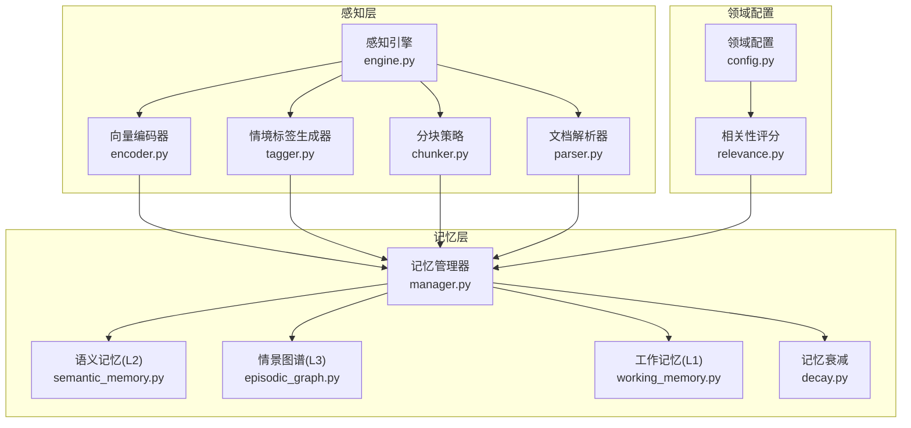
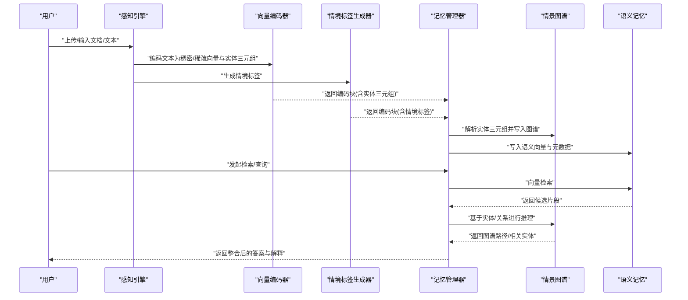
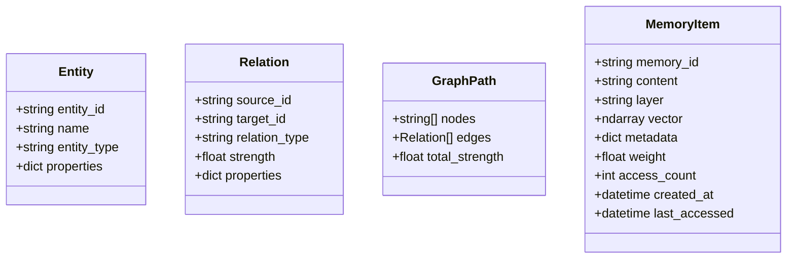
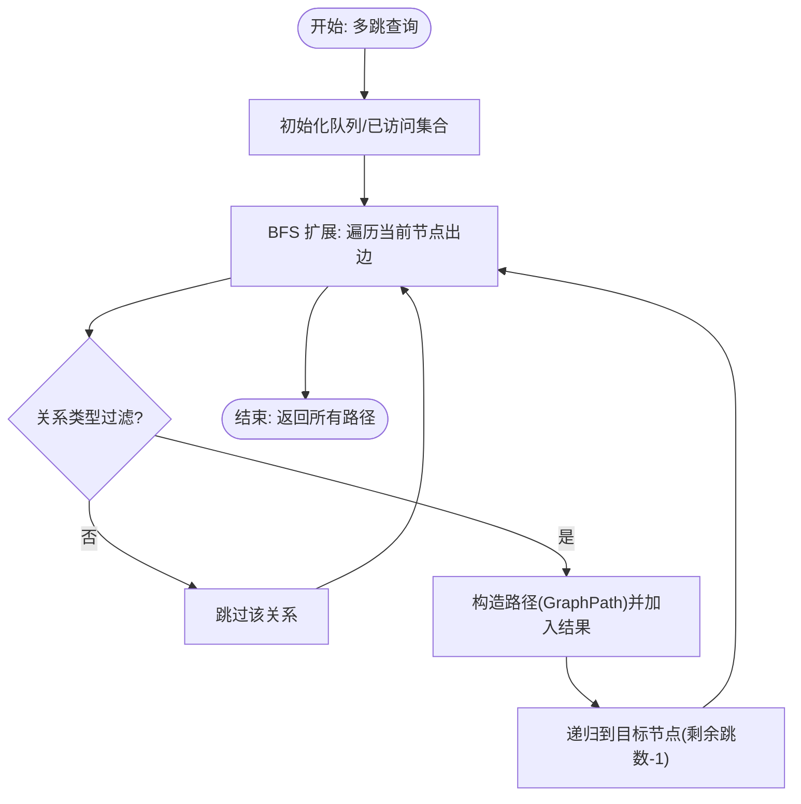
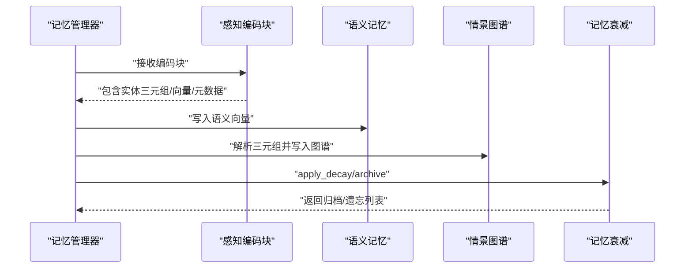
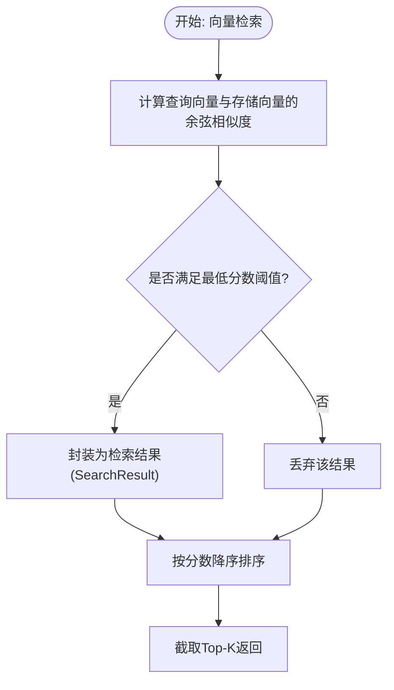
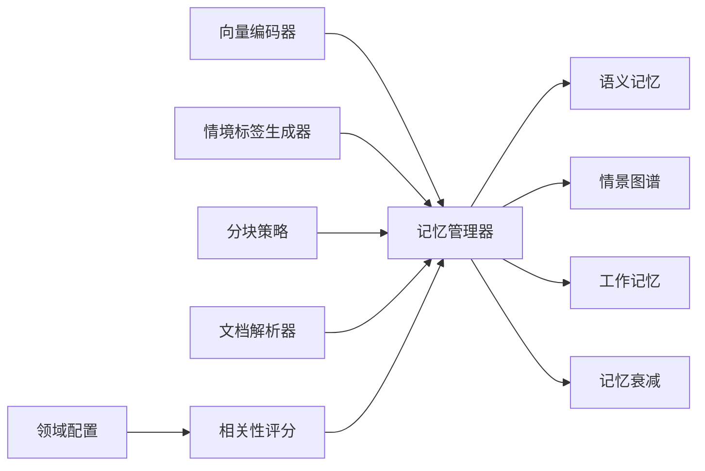

# 情景图谱管理

<cite>
**本文引用的文件**   
- [episodic_graph.py](file://src/memory/episodic_graph.py)
- [models.py](file://src/memory/models.py)
- [manager.py](file://src/memory/manager.py)
- [semantic_memory.py](file://src/memory/semantic_memory.py)
- [working_memory.py](file://src/memory/working_memory.py)
- [engine.py](file://src/perception/engine.py)
- [models.py](file://src/perception/models.py)
- [encoder.py](file://src/perception/encoder.py)
- [tagger.py](file://src/perception/tagger.py)
- [chunker.py](file://src/perception/chunker.py)
- [parser.py](file://src/perception/parser.py)
- [config.py](file://src/domain/config.py)
- [relevance.py](file://src/domain/relevance.py)
- [decay.py](file://src/memory/decay.py)
- [README.md](file://README.md)
</cite>

## 目录
1. [简介](#简介)
2. [项目结构](#项目结构)
3. [核心组件](#核心组件)
4. [架构总览](#架构总览)
5. [详细组件分析](#详细组件分析)
6. [依赖分析](#依赖分析)
7. [性能考量](#性能考量)
8. [故障排查指南](#故障排查指南)
9. [结论](#结论)
10. [附录](#附录)

## 简介
本文件面向“情景图谱管理”的技术文档，聚焦 L3 情景图谱的图数据库设计与实体关系建模，系统阐述实体（Entity）与关系（Relation）的数据结构定义与存储机制；解释图谱查询算法、路径搜索与关系推理方法；提供图谱构建、更新与维护的操作示例；并给出图数据库选择（Neo4j 等）与配置思路；最后讨论情景记忆与语义记忆的数据关联与知识整合策略，并为开发者提供扩展与自定义查询的实现指导。

## 项目结构
围绕“感知-记忆-检索-精炼-交互”的五层架构，情景图谱位于记忆层（L3），与感知层产出的实体三元组紧密耦合，通过记忆管理器完成从感知到图谱的落地与检索。

**图表来源**
- [engine.py:14-130](file://src/perception/engine.py#L14-L130)
- [encoder.py:24-254](file://src/perception/encoder.py#L24-L254)
- [tagger.py:10-144](file://src/perception/tagger.py#L10-L144)
- [chunker.py:10-98](file://src/perception/chunker.py#L10-L98)
- [parser.py:11-112](file://src/perception/parser.py#L11-L112)
- [manager.py:16-186](file://src/memory/manager.py#L16-L186)
- [semantic_memory.py:21-179](file://src/memory/semantic_memory.py#L21-L179)
- [episodic_graph.py:10-194](file://src/memory/episodic_graph.py#L10-L194)
- [working_memory.py:11-120](file://src/memory/working_memory.py#L11-L120)
- [decay.py:11-155](file://src/memory/decay.py#L11-L155)
- [config.py:54-285](file://src/domain/config.py#L54-L285)
- [relevance.py:29-328](file://src/domain/relevance.py#L29-L328)

**章节来源**
- [README.md:35-85](file://README.md#L35-L85)

## 核心组件
- 实体与关系数据模型：定义实体、关系、图谱路径与记忆项等核心数据结构，支撑图谱与记忆系统的统一建模。
- 情景图谱（EpisodicGraph）：提供实体与关系的增删改查、多跳查询、因果链条追踪与相关实体检索。
- 记忆管理器（MemoryManager）：串联感知层产出与三层记忆，驱动从文本块到实体关系图的构建与检索。
- 语义记忆（SemanticMemory）：高维向量存储与检索，为 L3 图谱提供语义基础与检索入口。
- 工作记忆（WorkingMemory）：会话级上下文与意图轨迹，支持 L1 层级的即时访问与过期清理。
- 记忆衰减（MemoryDecay）：模拟生物记忆的巩固与遗忘，控制知识权重与生命周期。
- 领域配置与相关性（DomainConfig/DomainRelevanceCalculator）：为图谱构建提供领域权重与关键字体系，辅助检索与融合。

**章节来源**
- [models.py:19-67](file://src/memory/models.py#L19-L67)
- [episodic_graph.py:10-194](file://src/memory/episodic_graph.py#L10-L194)
- [manager.py:16-186](file://src/memory/manager.py#L16-L186)
- [semantic_memory.py:21-179](file://src/memory/semantic_memory.py#L21-L179)
- [working_memory.py:11-120](file://src/memory/working_memory.py#L11-L120)
- [decay.py:11-155](file://src/memory/decay.py#L11-L155)
- [config.py:54-285](file://src/domain/config.py#L54-L285)
- [relevance.py:29-328](file://src/domain/relevance.py#L29-L328)

## 架构总览
情景图谱管理贯穿感知与记忆两大子系统：感知层负责将文档/文本编码为带实体三元组的结构化块；记忆管理器将这些三元组转化为实体与关系，写入 L3 情景图谱；同时将语义向量写入 L2 语义记忆；工作记忆记录会话上下文；记忆衰减机制对知识进行动态权重调整与归档。

**图表来源**
- [engine.py:54-130](file://src/perception/engine.py#L54-L130)
- [encoder.py:72-189](file://src/perception/encoder.py#L72-L189)
- [tagger.py:32-47](file://src/perception/tagger.py#L32-L47)
- [manager.py:48-112](file://src/memory/manager.py#L48-L112)
- [semantic_memory.py:50-78](file://src/memory/semantic_memory.py#L50-L78)
- [episodic_graph.py:33-69](file://src/memory/episodic_graph.py#L33-L69)

## 详细组件分析

### 实体与关系数据模型
- 实体（Entity）：包含实体 ID、名称、类型与属性字典，用于图谱节点建模。
- 关系（Relation）：包含源 ID、目标 ID、关系类型、强度与属性字典，用于图谱边建模。
- 图谱路径（GraphPath）：记录节点序列、边序列与总强度，用于多跳检索结果表达。
- 记忆项（MemoryItem）：统一承载内容、向量、元数据、权重与访问计数，支撑 L2/L3 的统一存储与检索。

**图表来源**
- [models.py:34-67](file://src/memory/models.py#L34-L67)

**章节来源**
- [models.py:19-67](file://src/memory/models.py#L19-L67)

### 情景图谱（EpisodicGraph）
- 存储机制：以内存字典维护实体与邻接关系列表，支持实体添加、关系添加与查询。
- 查询算法：
  - 多跳查询：基于广度优先搜索（BFS）在指定跳数内扩展路径，支持关系类型过滤。
  - 因果链条：识别特定因果关系类型（如 causes/leads_to/results_in）并返回链条。
  - 相关实体：按深度遍历图谱，返回与起始实体相关的实体集合。
- 注意：当前实现为最小可用版本，后续可集成 Neo4j/NebulaGraph 等图数据库以获得高性能与复杂查询能力。

**图表来源**
- [episodic_graph.py:71-126](file://src/memory/episodic_graph.py#L71-L126)

**章节来源**
- [episodic_graph.py:10-194](file://src/memory/episodic_graph.py#L10-L194)

### 记忆管理器（MemoryManager）
- 存储流程：接收感知层编码块，创建记忆项并写入 L2 语义记忆；解析实体三元组，创建实体与关系并写入 L3 情景图谱；统一存储于内存字典便于跨层检索。
- 检索流程：在 L2 向量空间检索，结合记忆衰减强化访问过的记忆项，返回整合后的记忆列表。
- 维护流程：应用记忆衰减，识别低权重记忆并归档/遗忘，保持知识库新鲜度与容量可控。

**图表来源**
- [manager.py:48-112](file://src/memory/manager.py#L48-L112)
- [semantic_memory.py:50-78](file://src/memory/semantic_memory.py#L50-L78)
- [episodic_graph.py:33-69](file://src/memory/episodic_graph.py#L33-L69)
- [decay.py:72-118](file://src/memory/decay.py#L72-L118)

**章节来源**
- [manager.py:16-186](file://src/memory/manager.py#L16-L186)
- [semantic_memory.py:21-179](file://src/memory/semantic_memory.py#L21-L179)
- [episodic_graph.py:10-194](file://src/memory/episodic_graph.py#L10-L194)
- [decay.py:11-155](file://src/memory/decay.py#L11-L155)

### 语义记忆（SemanticMemory）
- 存储：将 MemoryItem 的向量与元数据写入内存字典，支持元数据更新与删除。
- 检索：计算查询向量与存储向量的余弦相似度，返回 Top-K 结果。
- 混合检索：预留向量与关键词混合策略接口（当前最小实现为纯向量检索）。

**图表来源**
- [semantic_memory.py:80-118](file://src/memory/semantic_memory.py#L80-L118)

**章节来源**
- [semantic_memory.py:21-179](file://src/memory/semantic_memory.py#L21-L179)

### 工作记忆（WorkingMemory）
- 会话上下文：以内存字典模拟 Redis，支持 TTL、LRU 与过期清理。
- 意图轨迹：记录用户意图序列，支持获取轨迹与清除会话。

**章节来源**
- [working_memory.py:11-120](file://src/memory/working_memory.py#L11-L120)

### 记忆衰减（MemoryDecay）
- 权重计算：基于指数衰减与访问频率因子，动态调整记忆权重。
- 归档策略：根据阈值筛选低权重记忆，执行归档或主动遗忘。

**章节来源**
- [decay.py:11-155](file://src/memory/decay.py#L11-L155)

### 领域配置与相关性（DomainConfig/DomainRelevanceCalculator）
- 领域配置：定义关键字、权重等级、领域权重乘数、时间衰减参数等。
- 相关性评分：基于关键字得分与密度得分综合判定领域等级，提供权重乘数与置信度。

**章节来源**
- [config.py:54-285](file://src/domain/config.py#L54-L285)
- [relevance.py:29-328](file://src/domain/relevance.py#L29-L328)

## 依赖分析
- 感知层依赖：向量编码器依赖 LLM 客户端（可注入）；情境标签生成器与分块策略为感知层子模块；文档解析器提供基础文本解析能力。
- 记忆层依赖：记忆管理器统一调度 L1/L2/L3；语义记忆与情景图谱分别承担向量检索与图谱推理；工作记忆提供会话上下文；记忆衰减贯穿 L2/L3。
- 领域层依赖：相关性评分依赖领域配置，为检索与融合提供权重与等级。

**图表来源**
- [engine.py:14-130](file://src/perception/engine.py#L14-L130)
- [manager.py:16-186](file://src/memory/manager.py#L16-L186)
- [semantic_memory.py:21-179](file://src/memory/semantic_memory.py#L21-L179)
- [episodic_graph.py:10-194](file://src/memory/episodic_graph.py#L10-L194)
- [working_memory.py:11-120](file://src/memory/working_memory.py#L11-L120)
- [decay.py:11-155](file://src/memory/decay.py#L11-L155)
- [config.py:54-285](file://src/domain/config.py#L54-L285)
- [relevance.py:29-328](file://src/domain/relevance.py#L29-L328)

**章节来源**
- [engine.py:14-130](file://src/perception/engine.py#L14-L130)
- [manager.py:16-186](file://src/memory/manager.py#L16-L186)
- [semantic_memory.py:21-179](file://src/memory/semantic_memory.py#L21-L179)
- [episodic_graph.py:10-194](file://src/memory/episodic_graph.py#L10-L194)
- [working_memory.py:11-120](file://src/memory/working_memory.py#L11-L120)
- [decay.py:11-155](file://src/memory/decay.py#L11-L155)
- [config.py:54-285](file://src/domain/config.py#L54-L285)
- [relevance.py:29-328](file://src/domain/relevance.py#L29-L328)

## 性能考量
- 情景图谱查询：当前 BFS 实现适合中小规模图谱；对于大规模图谱，建议引入图数据库（如 Neo4j）并使用 Cypher 查询语言进行高效路径搜索与关系推理。
- 向量检索：语义记忆当前使用余弦相似度与内存存储；建议接入 Qdrant/Milvus 等向量数据库，启用 HNSW 索引与 GPU 加速以提升检索性能。
- 记忆衰减：通过指数衰减与访问频率因子平衡知识保留与更新，避免“灾难性遗忘”。
- 并发与缓存：工作记忆建议使用 Redis 以获得更好的并发与持久化能力；图谱与向量存储建议使用专用数据库以支持高吞吐与复杂查询。

## 故障排查指南
- 情景图谱查询无结果
  - 检查实体 ID 是否正确写入与存在。
  - 检查关系类型过滤条件是否过于严格。
  - 建议逐步降低跳数或放宽关系类型过滤进行定位。
- 语义检索命中率低
  - 检查编码器生成的稠密/稀疏向量是否有效。
  - 调整最小分数阈值或 Top-K 数量。
  - 确认向量维度与模型一致。
- 记忆被误归档
  - 检查记忆衰减参数（衰减速率、归档阈值）是否合理。
  - 对高频访问的记忆项进行强化（提高访问计数）。
- 工作记忆过期异常
  - 检查 TTL 设置与过期清理逻辑是否生效。
  - 如需真实场景，建议使用 Redis 替代内存字典。

**章节来源**
- [episodic_graph.py:71-126](file://src/memory/episodic_graph.py#L71-L126)
- [semantic_memory.py:80-118](file://src/memory/semantic_memory.py#L80-L118)
- [decay.py:72-118](file://src/memory/decay.py#L72-L118)
- [working_memory.py:97-107](file://src/memory/working_memory.py#L97-L107)

## 结论
本方案以“感知-记忆-检索-精炼-交互”五层架构为基础，将感知层产出的实体三元组无缝注入 L3 情景图谱，结合 L2 语义记忆与 L1 工作记忆，形成从结构化知识到可解释推理的完整闭环。当前实现为最小可用版本，建议在生产环境中引入图数据库与向量数据库，配合领域配置与相关性评分，实现更高效、可解释且可扩展的知识管理与推理系统。

## 附录

### 图数据库选择与配置（Neo4j 等）
- 选择建议
  - Neo4j：成熟的企业级图数据库，Cypher 查询语言强大，适合复杂关系推理与路径搜索。
  - NebulaGraph：开源分布式图数据库，具备高扩展性与云原生特性，适合大规模图谱。
- 配置要点
  - 连接参数：URL、认证信息、数据库实例。
  - Schema 设计：节点标签（实体类型）、关系类型、索引与约束。
  - 查询优化：为常用查询建立索引，使用参数化查询防止注入。
  - 数据迁移：将当前内存中的实体与关系批量导入图数据库。

**章节来源**
- [README.md:500-509](file://README.md#L500-L509)
- [episodic_graph.py:43-43](file://src/memory/episodic_graph.py#L43-L43)

### 操作示例（构建、更新与维护）
- 构建图谱
  - 使用感知引擎处理文档/文本，得到编码块。
  - 调用记忆管理器的存储接口，将实体三元组写入情景图谱。
- 更新与维护
  - 定期调用记忆巩固与主动遗忘接口，维持知识库质量。
  - 根据领域配置调整相关性评分权重，优化检索效果。
- 自定义查询
  - 在情景图谱中扩展查询接口，支持 Cypher 或图遍历算法。
  - 结合语义记忆的向量检索结果，进行图谱与向量的融合检索。

**章节来源**
- [engine.py:92-130](file://src/perception/engine.py#L92-L130)
- [manager.py:48-112](file://src/memory/manager.py#L48-L112)
- [semantic_memory.py:50-78](file://src/memory/semantic_memory.py#L50-L78)
- [decay.py:149-155](file://src/memory/decay.py#L149-L155)
- [config.py:54-130](file://src/domain/config.py#L54-L130)