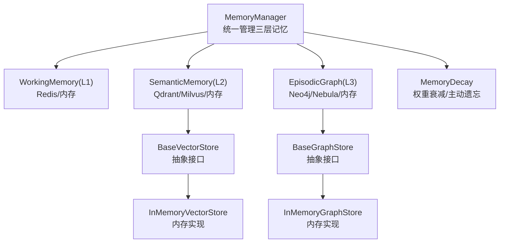
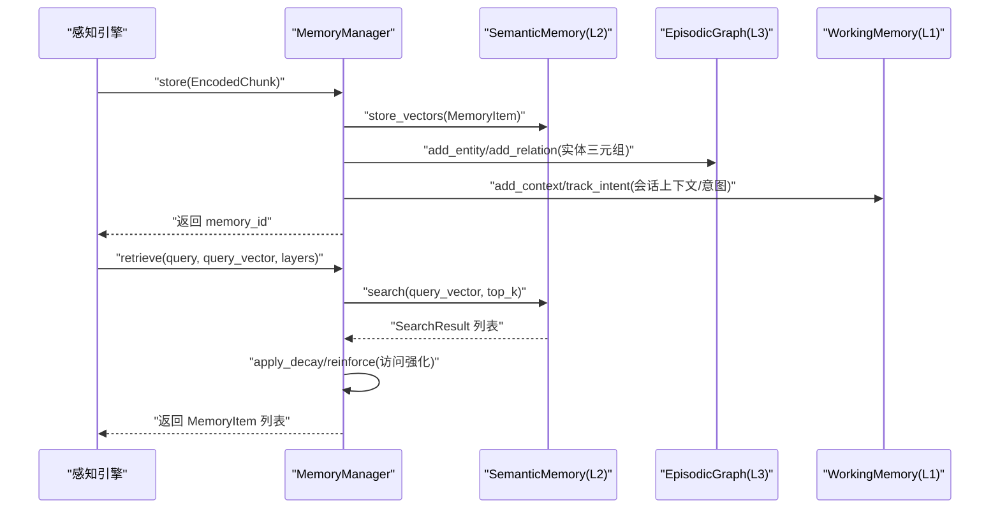
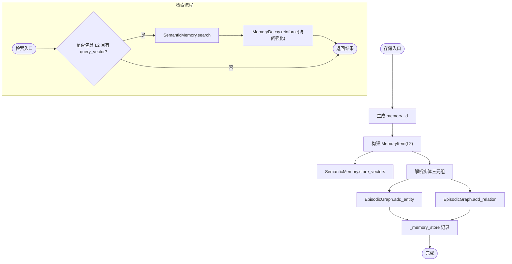
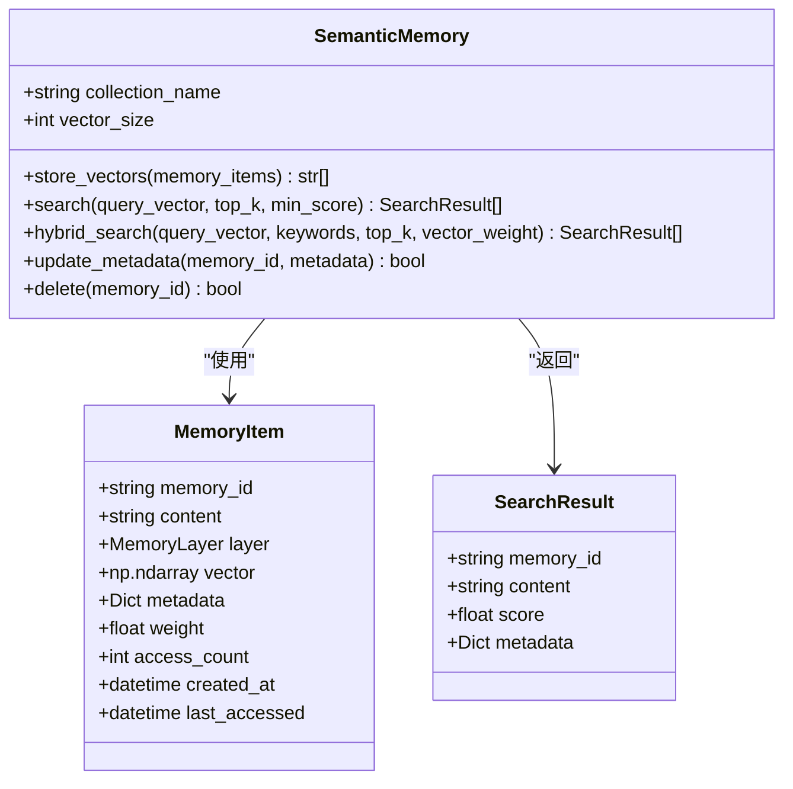
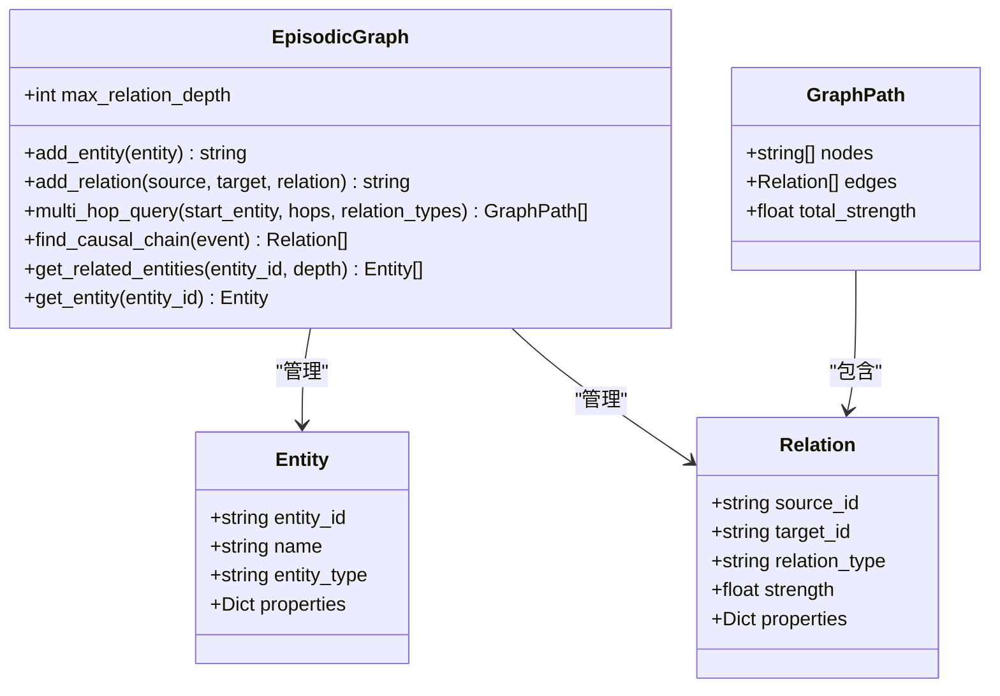
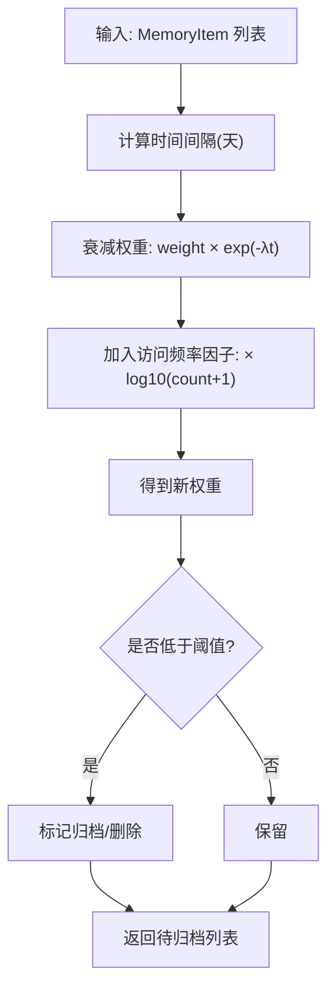
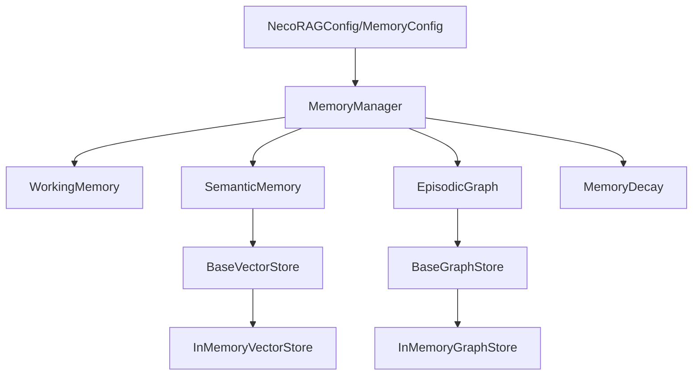

# 记忆管理系统

<cite>
**本文引用的文件**
- [src/memory/manager.py](file://src/memory/manager.py)
- [src/memory/models.py](file://src/memory/models.py)
- [src/memory/working_memory.py](file://src/memory/working_memory.py)
- [src/memory/semantic_memory.py](file://src/memory/semantic_memory.py)
- [src/memory/episodic_graph.py](file://src/memory/episodic_graph.py)
- [src/memory/decay.py](file://src/memory/decay.py)
- [src/memory/backends/base.py](file://src/memory/backends/base.py)
- [src/memory/backends/memory_store.py](file://src/memory/backends/memory_store.py)
- [src/memory/README.md](file://src/memory/README.md)
- [src/core/config.py](file://src/core/config.py)
- [src/domain/config.py](file://src/domain/config.py)
- [example/example_usage.py](file://example/example_usage.py)
- [requirements.txt](file://requirements.txt)
</cite>

## 目录
1. [简介](#简介)
2. [项目结构](#项目结构)
3. [核心组件](#核心组件)
4. [架构总览](#架构总览)
5. [详细组件分析](#详细组件分析)
6. [依赖分析](#依赖分析)
7. [性能考虑](#性能考虑)
8. [故障排查指南](#故障排查指南)
9. [结论](#结论)
10. [附录](#附录)

## 简介
本文件面向“记忆管理系统”的开发者与使用者，系统性阐述三层记忆体系（L1 工作记忆、L2 语义记忆、L3 情景图谱）的设计理念、实现架构与运行机制。重点覆盖：
- 记忆衰减机制、主动遗忘策略与记忆巩固过程
- 内存管理最佳实践与性能优化建议
- 各种存储后端的配置与使用方法
- 记忆数据生命周期管理与访问控制机制
- 扩展与定制记忆系统的指导

## 项目结构
记忆系统位于 src/memory 目录，采用“分层 + 后端抽象 + 衰减机制”的组织方式：
- 分层实现：WorkingMemory（L1）、SemanticMemory（L2）、EpisodicGraph（L3）
- 后端抽象：BaseVectorStore、BaseGraphStore 定义统一接口
- 存储实现：InMemoryVectorStore、InMemoryGraphStore 提供内存版实现
- 衰减与管理：MemoryDecay、MemoryManager 统一调度与生命周期管理
- 配置与领域：NecoRAGConfig、MemoryConfig、DomainConfig 支持灵活配置与领域加权

图表来源
- [src/memory/manager.py:16-186](file://src/memory/manager.py#L16-L186)
- [src/memory/working_memory.py:11-120](file://src/memory/working_memory.py#L11-L120)
- [src/memory/semantic_memory.py:21-179](file://src/memory/semantic_memory.py#L21-L179)
- [src/memory/episodic_graph.py:10-194](file://src/memory/episodic_graph.py#L10-L194)
- [src/memory/decay.py:11-155](file://src/memory/decay.py#L11-L155)
- [src/memory/backends/base.py:54-297](file://src/memory/backends/base.py#L54-L297)
- [src/memory/backends/memory_store.py:20-381](file://src/memory/backends/memory_store.py#L20-L381)

章节来源
- [src/memory/README.md:1-244](file://src/memory/README.md#L1-L244)
- [src/memory/manager.py:16-186](file://src/memory/manager.py#L16-L186)

## 核心组件
- MemoryManager：统一入口，协调 L1/L2/L3 与衰减机制，提供存储、检索、巩固、遗忘等操作
- WorkingMemory（L1）：会话上下文与意图轨迹的短期存储，具备 TTL、LRU 等机制
- SemanticMemory（L2）：高维向量存储与检索，支持混合检索与元数据管理
- EpisodicGraph（L3）：实体关系网络，支持多跳查询与因果链条追踪
- MemoryDecay：基于时间与访问频率的权重衰减，支持主动遗忘与归档
- BaseVectorStore/BaseGraphStore：向量与图存储的抽象接口
- InMemoryVectorStore/InMemoryGraphStore：内存版实现，便于开发与测试

章节来源
- [src/memory/models.py:12-67](file://src/memory/models.py#L12-L67)
- [src/memory/manager.py:16-186](file://src/memory/manager.py#L16-L186)
- [src/memory/working_memory.py:11-120](file://src/memory/working_memory.py#L11-L120)
- [src/memory/semantic_memory.py:21-179](file://src/memory/semantic_memory.py#L21-L179)
- [src/memory/episodic_graph.py:10-194](file://src/memory/episodic_graph.py#L10-L194)
- [src/memory/decay.py:11-155](file://src/memory/decay.py#L11-L155)
- [src/memory/backends/base.py:54-297](file://src/memory/backends/base.py#L54-L297)
- [src/memory/backends/memory_store.py:20-381](file://src/memory/backends/memory_store.py#L20-L381)

## 架构总览
三层记忆系统围绕 MemoryManager 协同工作：
- 输入：感知引擎产出的 EncodedChunk
- 存储：L2 语义向量持久化；L3 图谱实体关系；L1 会话上下文与意图轨迹
- 检索：L2 向量检索；必要时结合 L3 图谱推理；L1 提供上下文增强
- 管理：MemoryDecay 实施权重衰减与主动遗忘；MemoryManager 负责统一调度

图表来源
- [src/memory/manager.py:48-147](file://src/memory/manager.py#L48-L147)
- [src/memory/semantic_memory.py:50-118](file://src/memory/semantic_memory.py#L50-L118)
- [src/memory/working_memory.py:36-85](file://src/memory/working_memory.py#L36-L85)
- [src/memory/episodic_graph.py:33-69](file://src/memory/episodic_graph.py#L33-L69)

## 详细组件分析

### MemoryManager（统一管理器）
职责
- 将 EncodedChunk 转换为 MemoryItem，写入 L2 语义向量库
- 从实体三元组构建 L3 图谱节点与关系
- 维护统一的内存索引 _memory_store，便于跨层检索与访问强化
- 提供检索、巩固与主动遗忘接口

关键流程
- 存储：生成 memory_id，写入 L2，解析实体三元组写入 L3
- 检索：若指定 query_vector 且包含 L2，则执行向量检索并进行访问强化
- 巩固：应用衰减，识别低权重记忆并删除
- 遗忘：按阈值主动删除低价值记忆

图表来源
- [src/memory/manager.py:48-147](file://src/memory/manager.py#L48-L147)
- [src/memory/semantic_memory.py:50-118](file://src/memory/semantic_memory.py#L50-L118)
- [src/memory/episodic_graph.py:33-69](file://src/memory/episodic_graph.py#L33-L69)
- [src/memory/decay.py:120-142](file://src/memory/decay.py#L120-L142)

章节来源
- [src/memory/manager.py:16-186](file://src/memory/manager.py#L16-L186)

### WorkingMemory（L1 工作记忆）
特性
- 会话级上下文存储与更新
- 用户意图轨迹跟踪
- 模拟 TTL 过期与 LRU 淘汰（当前最小实现未完全落地，预留扩展点）

接口要点
- add_context/get_context：会话上下文增删改查
- track_intent/get_intent_trajectory：意图轨迹管理
- clear_session/clear_expired：会话清理与过期清理
- exists：会话存在性检查

章节来源
- [src/memory/working_memory.py:11-120](file://src/memory/working_memory.py#L11-L120)

### SemanticMemory（L2 语义记忆）
特性
- 高维向量存储与余弦相似度检索
- 元数据存储与过滤
- 混合检索接口预留（当前最小实现仅向量检索）

接口要点
- store_vectors：批量写入向量与元数据
- search：向量检索，返回 SearchResult 列表
- hybrid_search：混合检索接口（待实现）
- update_metadata/delete：元数据更新与删除

图表来源
- [src/memory/semantic_memory.py:21-179](file://src/memory/semantic_memory.py#L21-L179)
- [src/memory/models.py:19-31](file://src/memory/models.py#L19-L31)
- [src/memory/models.py:13-19](file://src/memory/models.py#L13-L19)

章节来源
- [src/memory/semantic_memory.py:21-179](file://src/memory/semantic_memory.py#L21-L179)

### EpisodicGraph（L3 情景图谱）
特性
- 实体与关系存储
- 多跳查询与因果链条追踪
- 结构化记忆与推理支持

接口要点
- add_entity/add_relation：节点与边的创建
- multi_hop_query：多跳路径搜索（BFS 简化实现）
- find_causal_chain：因果关系链查找
- get_related_entities：按深度获取相关实体
- get_entity：节点查询

图表来源
- [src/memory/episodic_graph.py:10-194](file://src/memory/episodic_graph.py#L10-L194)
- [src/memory/models.py:33-58](file://src/memory/models.py#L33-L58)

章节来源
- [src/memory/episodic_graph.py:10-194](file://src/memory/episodic_graph.py#L10-L194)

### MemoryDecay（记忆衰减与主动遗忘）
机制
- 权重衰减公式：initial_weight × exp(-λt) × log10(access_count+1)
- 访问强化：reinforce 提升权重并增加访问计数
- 主动遗忘：archive_low_weight 按阈值筛选并删除

图表来源
- [src/memory/decay.py:39-118](file://src/memory/decay.py#L39-L118)

章节来源
- [src/memory/decay.py:11-155](file://src/memory/decay.py#L11-L155)

### 存储后端抽象与内存实现
- BaseVectorStore：upsert/search/get/delete/count 等统一接口
- BaseGraphStore：add_node/add_edge/get_node/get_neighbors/traverse/find_path/delete_node/delete_edge/node_count/edge_count 等统一接口
- InMemoryVectorStore：内存版向量存储，支持维度校验、过滤与余弦相似度
- InMemoryGraphStore：内存版图存储，支持邻接表、BFS 遍历与路径查找

章节来源
- [src/memory/backends/base.py:54-297](file://src/memory/backends/base.py#L54-L297)
- [src/memory/backends/memory_store.py:20-381](file://src/memory/backends/memory_store.py#L20-L381)

## 依赖分析
- 组件耦合
  - MemoryManager 依赖 L1/L2/L3 与 MemoryDecay，承担统一编排
  - L2/L3 通过抽象接口与具体实现解耦，便于替换外部数据库
- 外部依赖
  - 向量与图数据库客户端（如 Qdrant、Neo4j 等）在 requirements 中以注释形式给出，当前最小实现使用内存存储
- 配置驱动
  - NecoRAGConfig/MemoryConfig 提供统一配置入口，支持从文件与环境变量加载

图表来源
- [src/core/config.py:232-284](file://src/core/config.py#L232-L284)
- [src/memory/manager.py:16-46](file://src/memory/manager.py#L16-L46)
- [src/memory/backends/base.py:54-297](file://src/memory/backends/base.py#L54-L297)

章节来源
- [requirements.txt:18-27](file://requirements.txt#L18-L27)
- [src/core/config.py:232-284](file://src/core/config.py#L232-L284)

## 性能考虑
- L1（工作记忆）：内存字典模拟，读写延迟极低；建议合理设置 TTL 与最大会话条目，避免内存膨胀
- L2（语义记忆）：当前最小实现为内存向量存储，检索复杂度与向量维度相关；建议：
  - 控制向量维度与 top_k，避免全量扫描
  - 使用索引（如 HNSW）与过滤条件降低无效匹配
- L3（情景图谱）：BFS/DFS 搜索复杂度随深度与边数增长；建议：
  - 限制最大关系深度
  - 对高频查询建立索引或缓存中间结果
- 衰减与归档：定期执行 consolidate/forget，避免低价值数据占用资源

[本节为通用性能建议，无需特定文件引用]

## 故障排查指南
- 向量维度不匹配
  - 现象：插入/查询时报维度错误
  - 排查：确认向量维度与初始化时一致
  - 参考：InMemoryVectorStore 的维度校验与错误提示
- 节点/边缺失
  - 现象：添加边时报错“节点不存在”
  - 排查：确保先添加节点再添加边
  - 参考：InMemoryGraphStore 的节点存在性检查
- 检索结果为空
  - 现象：query_vector 无法匹配任何记录
  - 排查：检查维度、阈值、过滤条件与相似度计算
  - 参考：InMemoryVectorStore 的过滤与相似度计算
- 记忆未被归档
  - 现象：forget/consolidate 后仍存在低权重记忆
  - 排查：确认 decay_rate、archive_threshold 设置与权重计算逻辑
  - 参考：MemoryDecay 的权重计算与归档判断

章节来源
- [src/memory/backends/memory_store.py:46-50](file://src/memory/backends/memory_store.py#L46-L50)
- [src/memory/backends/memory_store.py:167-170](file://src/memory/backends/memory_store.py#L167-L170)
- [src/memory/backends/memory_store.py:63-67](file://src/memory/backends/memory_store.py#L63-L67)
- [src/memory/decay.py:39-70](file://src/memory/decay.py#L39-L70)
- [src/memory/decay.py:96-118](file://src/memory/decay.py#L96-L118)

## 结论
本记忆系统通过三层架构与动态衰减机制，模拟人类记忆的巩固与遗忘过程，实现从短期上下文到长期结构化知识的协同管理。通过抽象后端接口与内存实现，既满足开发测试需求，又为接入真实数据库（Redis/Qdrant/Neo4j 等）预留了清晰路径。建议在生产环境中：
- 明确各层配置参数，结合业务场景调优
- 定期执行记忆巩固与主动遗忘，维持系统健康状态
- 逐步替换为真实数据库后端，并完善 TTL、索引与监控

[本节为总结性内容，无需特定文件引用]

## 附录

### 记忆数据生命周期管理
- 入库：感知引擎编码 → MemoryManager.store → L2/L3 写入 + L1 上下文/意图
- 检索：MemoryManager.retrieve → L2 向量检索 + L3 图谱推理（可选）→ 访问强化
- 巩固：MemoryManager.consolidate → 衰减应用 → 低权重归档/删除
- 遗忘：MemoryManager.forget → 主动删除低价值记忆

章节来源
- [src/memory/manager.py:48-186](file://src/memory/manager.py#L48-L186)
- [src/memory/semantic_memory.py:50-118](file://src/memory/semantic_memory.py#L50-L118)
- [src/memory/decay.py:72-118](file://src/memory/decay.py#L72-L118)

### 访问控制机制
- 当前实现未内置细粒度权限控制，建议在上层应用中：
  - 为不同用户/租户划分独立的 collection/graph 与命名空间
  - 在 MemoryManager 层增加会话隔离与审计日志
  - 对敏感数据进行脱敏与加密

[本节为概念性建议，无需特定文件引用]

### 存储后端配置与使用
- 内存实现（默认）
  - 向量存储：InMemoryVectorStore
  - 图存储：InMemoryGraphStore
- 外部数据库（需安装对应客户端）
  - 向量数据库：Qdrant/Milvus（在 requirements 中标注）
  - 图数据库：Neo4j/NebulaGraph（在 requirements 中标注）
  - 缓存：Redis（在 requirements 中标注）
- 配置入口
  - NecoRAGConfig/MemoryConfig 提供统一配置，支持从文件与环境变量加载

章节来源
- [requirements.txt:18-27](file://requirements.txt#L18-L27)
- [src/core/config.py:232-284](file://src/core/config.py#L232-L284)
- [src/memory/backends/base.py:54-297](file://src/memory/backends/base.py#L54-L297)

### 扩展与定制指导
- 新增存储后端
  - 实现 BaseVectorStore/BaseGraphStore 接口，替换内存实现
  - 在 MemoryConfig 中选择对应 Provider 与连接参数
- 自定义衰减策略
  - 修改 MemoryDecay 的权重计算逻辑或引入外部评分
- 增强检索能力
  - 在 SemanticMemory 中实现 HNSW 索引与 hybrid_search
  - 在 EpisodicGraph 中完善多跳与路径优化算法
- 领域加权
  - 使用 DomainConfig/DomainConfigManager 管理关键字与领域权重，结合权重计算器进行融合

章节来源
- [src/memory/backends/base.py:54-297](file://src/memory/backends/base.py#L54-L297)
- [src/memory/decay.py:39-142](file://src/memory/decay.py#L39-L142)
- [src/memory/semantic_memory.py:120-142](file://src/memory/semantic_memory.py#L120-L142)
- [src/memory/episodic_graph.py:71-147](file://src/memory/episodic_graph.py#L71-L147)
- [src/domain/config.py:53-285](file://src/domain/config.py#L53-L285)

### 使用示例参考
- 完整工作流示例：从感知编码到响应输出的端到端演示
- 关键步骤：初始化组件、存储知识、检索与巩固、生成响应

章节来源
- [example/example_usage.py:12-252](file://example/example_usage.py#L12-L252)