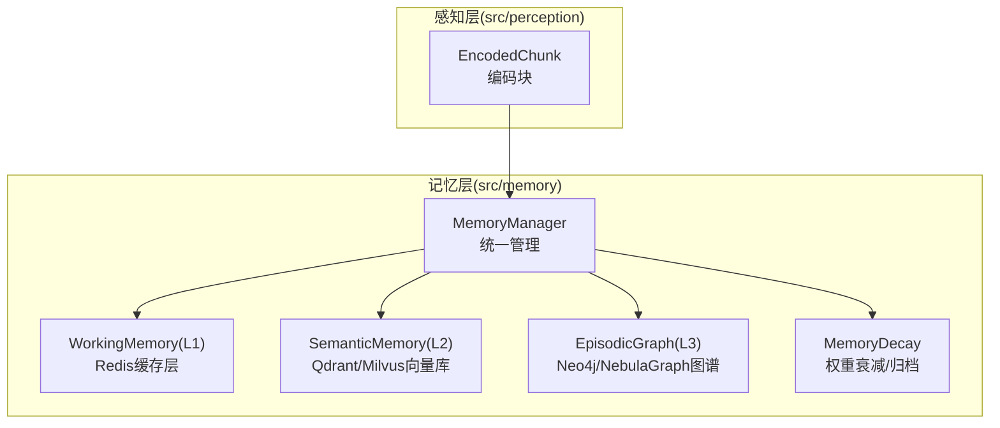
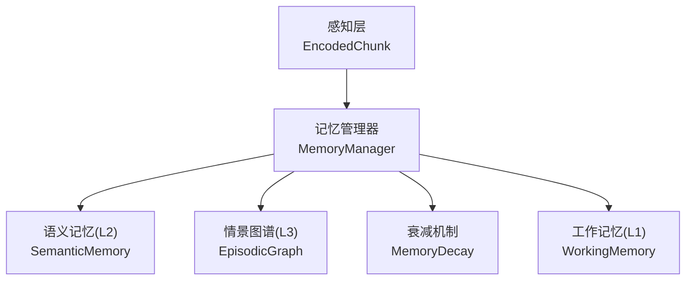
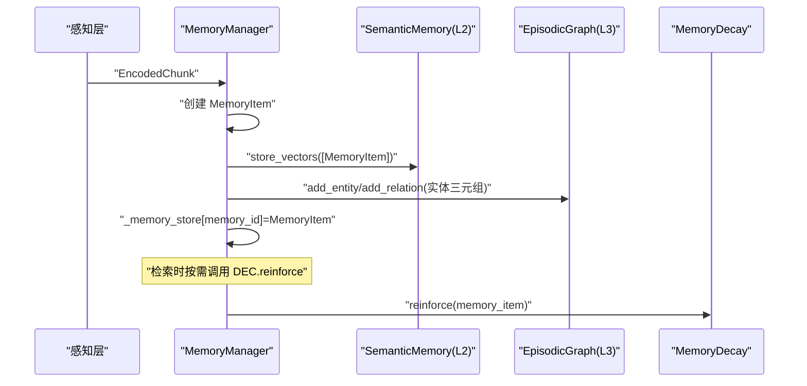
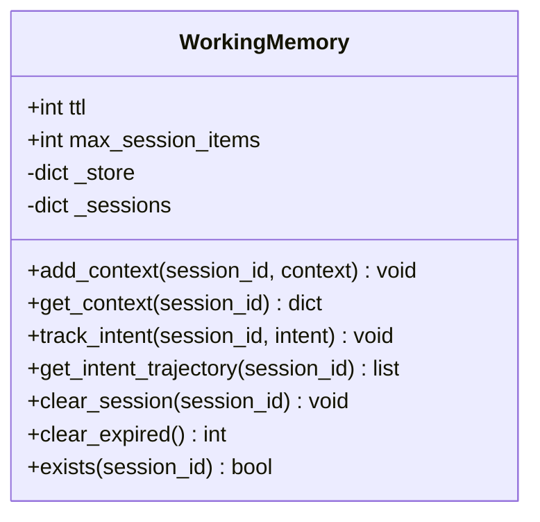
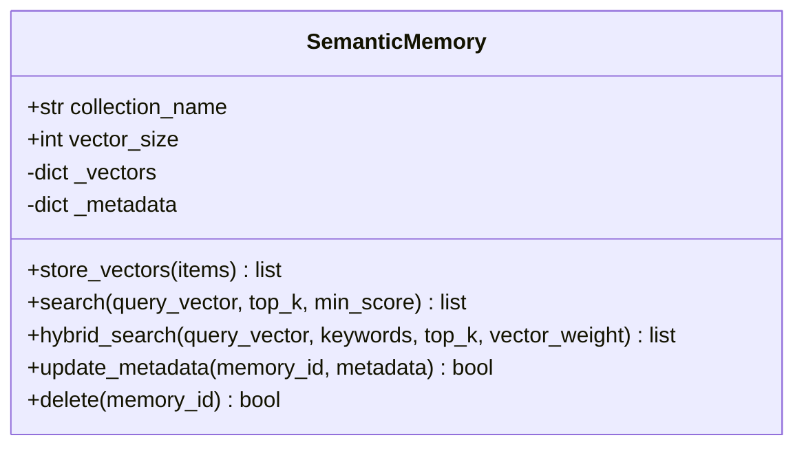
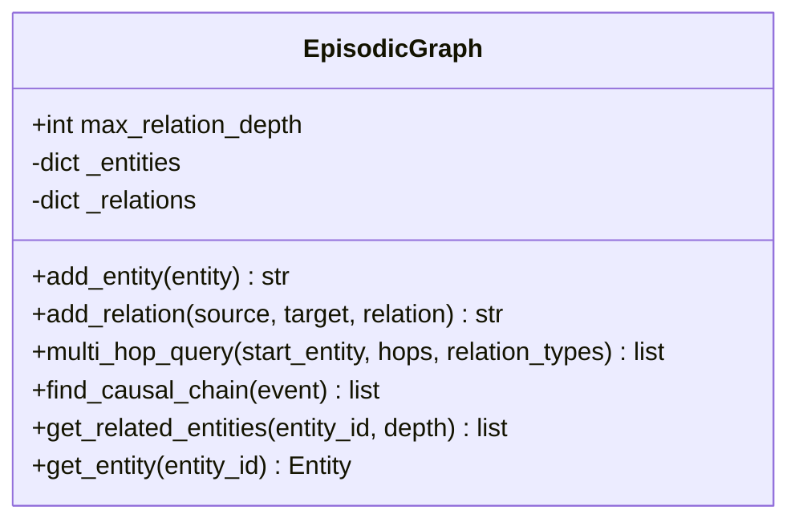
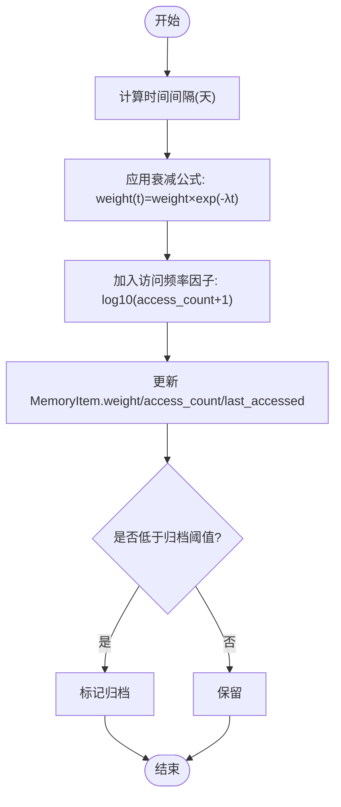
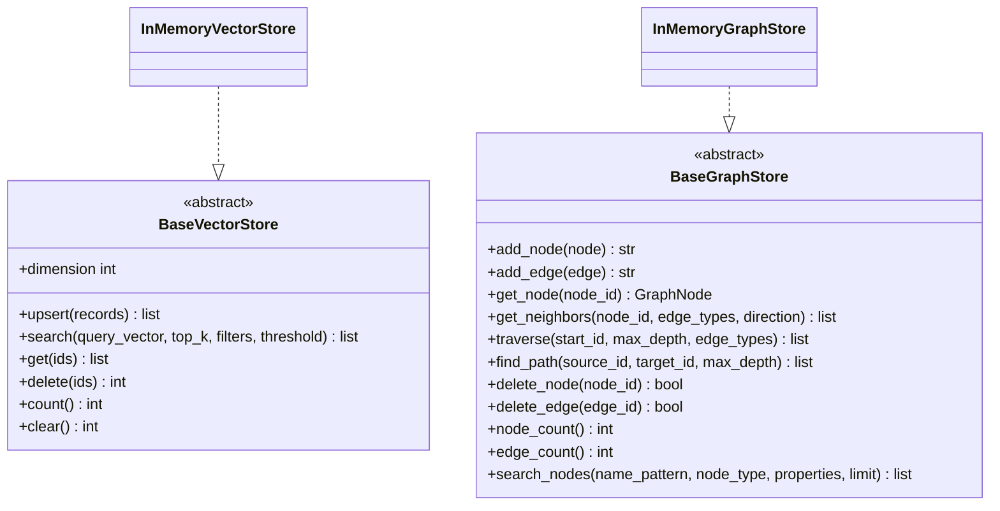
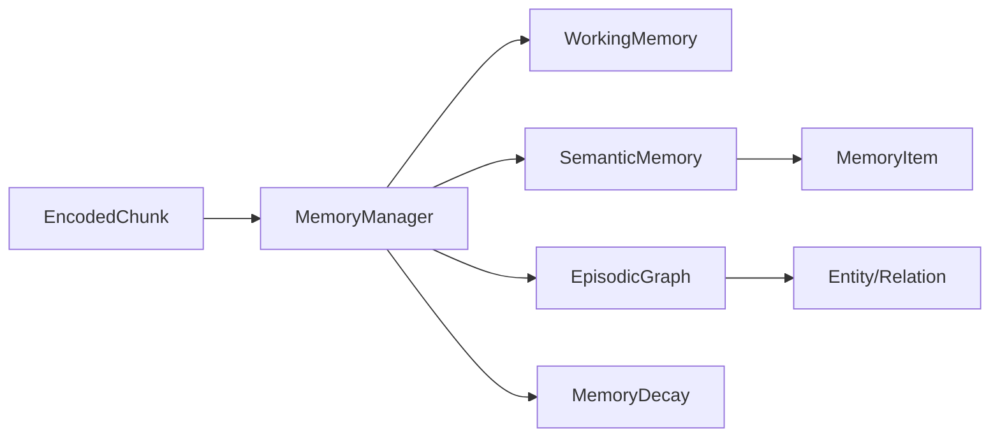

# 记忆系统概览

<cite>
**本文引用的文件**
- [src/memory/__init__.py](file://src/memory/__init__.py)
- [src/memory/manager.py](file://src/memory/manager.py)
- [src/memory/models.py](file://src/memory/models.py)
- [src/memory/working_memory.py](file://src/memory/working_memory.py)
- [src/memory/semantic_memory.py](file://src/memory/semantic_memory.py)
- [src/memory/episodic_graph.py](file://src/memory/episodic_graph.py)
- [src/memory/decay.py](file://src/memory/decay.py)
- [src/memory/backends/base.py](file://src/memory/backends/base.py)
- [src/memory/backends/memory_store.py](file://src/memory/backends/memory_store.py)
- [src/memory/README.md](file://src/memory/README.md)
- [src/perception/models.py](file://src/perception/models.py)
- [example/example_usage.py](file://example/example_usage.py)
- [README.md](file://README.md)
</cite>

## 目录
1. [简介](#简介)
2. [项目结构](#项目结构)
3. [核心组件](#核心组件)
4. [架构总览](#架构总览)
5. [详细组件分析](#详细组件分析)
6. [依赖关系分析](#依赖关系分析)
7. [性能考量](#性能考量)
8. [故障排查指南](#故障排查指南)
9. [结论](#结论)
10. [附录](#附录)

## 简介
本文件面向“记忆管理系统”的综合概览，重点阐述三层记忆体系（L1工作记忆、L2语义记忆、L3情景图谱）的整体架构与设计理念，解释记忆管理器的核心职责与统一管理机制，说明各记忆层的功能分工、数据流向与交互关系，介绍记忆数据的生命周期管理、存储策略与访问模式，并提供使用流程与最佳实践指导。文中包含架构图表与组件关系说明，帮助开发者快速理解整个记忆系统的运行机制。

## 项目结构
记忆系统位于 src/memory 目录，围绕 MemoryManager 统一调度 L1/L2/L3 三层记忆，配合衰减机制 MemoryDecay 实现动态权重管理；同时提供抽象存储后端 BaseVectorStore/BaseGraphStore 与内存实现 InMemoryVectorStore/InMemoryGraphStore，便于开发与测试。

**图表来源**
- [src/memory/manager.py:16-186](file://src/memory/manager.py#L16-L186)
- [src/memory/working_memory.py:11-120](file://src/memory/working_memory.py#L11-L120)
- [src/memory/semantic_memory.py:21-179](file://src/memory/semantic_memory.py#L21-L179)
- [src/memory/episodic_graph.py:10-194](file://src/memory/episodic_graph.py#L10-L194)
- [src/memory/decay.py:11-155](file://src/memory/decay.py#L11-L155)
- [src/perception/models.py:31-41](file://src/perception/models.py#L31-L41)

**章节来源**
- [src/memory/__init__.py:1-22](file://src/memory/__init__.py#L1-L22)
- [src/memory/README.md:1-244](file://src/memory/README.md#L1-L244)
- [README.md:69-84](file://README.md#L69-L84)

## 核心组件
- MemoryManager：统一管理三层记忆，协调存储、检索、巩固与遗忘。
- WorkingMemory(L1)：工作记忆，存储当前会话上下文与意图轨迹，具备 TTL 过期与模拟遗忘能力。
- SemanticMemory(L2)：语义记忆，高维向量存储，支持向量检索与混合检索，具备元数据更新与删除能力。
- EpisodicGraph(L3)：情景图谱，实体关系网络，支持多跳查询、因果链条追踪与相关实体发现。
- MemoryDecay：记忆衰减机制，基于权重公式进行动态衰减、强化与归档阈值控制。
- 存储后端：BaseVectorStore/BaseGraphStore 抽象接口与 InMemoryVectorStore/InMemoryGraphStore 内存实现。

**章节来源**
- [src/memory/manager.py:16-186](file://src/memory/manager.py#L16-L186)
- [src/memory/working_memory.py:11-120](file://src/memory/working_memory.py#L11-L120)
- [src/memory/semantic_memory.py:21-179](file://src/memory/semantic_memory.py#L21-L179)
- [src/memory/episodic_graph.py:10-194](file://src/memory/episodic_graph.py#L10-L194)
- [src/memory/decay.py:11-155](file://src/memory/decay.py#L11-L155)
- [src/memory/backends/base.py:54-297](file://src/memory/backends/base.py#L54-L297)
- [src/memory/backends/memory_store.py:20-381](file://src/memory/backends/memory_store.py#L20-L381)

## 架构总览
三层记忆系统的设计理念源于人脑的多层记忆理论与“九命”特性，强调短期工作记忆与长期结构化记忆的协同。MemoryManager 作为中枢，负责接收感知层编码后的 EncodedChunk，将其持久化到 L2 语义记忆并向 L3 图谱写入实体与关系，同时维护统一的内存存储以支持跨层检索与权重管理。

**图表来源**
- [src/memory/manager.py:48-112](file://src/memory/manager.py#L48-L112)
- [src/memory/semantic_memory.py:50-78](file://src/memory/semantic_memory.py#L50-L78)
- [src/memory/episodic_graph.py:33-69](file://src/memory/episodic_graph.py#L33-L69)
- [src/memory/working_memory.py:36-95](file://src/memory/working_memory.py#L36-L95)
- [src/memory/decay.py:72-94](file://src/memory/decay.py#L72-L94)

## 详细组件分析

### MemoryManager 统一管理器
- 职责
  - 接收 EncodedChunk，创建 MemoryItem 并写入 L2 语义记忆。
  - 将实体三元组解析为 Entity/Relation，写入 L3 情景图谱。
  - 维护统一内存存储 _memory_store，支持跨层检索与权重强化。
  - 提供检索、巩固与主动遗忘接口。
- 关键流程
  - 存储：创建 MemoryItem → L2 向量存储 → L3 实体/关系 → 统一存储。
  - 检索：按层级选择（默认 L1/L2）→ L2 向量检索 → 权重强化 → 返回结果。
  - 巩固/遗忘：应用衰减 → 识别低权重 → 删除/归档。

**图表来源**
- [src/memory/manager.py:48-112](file://src/memory/manager.py#L48-L112)
- [src/memory/semantic_memory.py:50-78](file://src/memory/semantic_memory.py#L50-L78)
- [src/memory/episodic_graph.py:33-69](file://src/memory/episodic_graph.py#L33-L69)
- [src/memory/decay.py:120-142](file://src/memory/decay.py#L120-L142)

**章节来源**
- [src/memory/manager.py:16-186](file://src/memory/manager.py#L16-L186)

### WorkingMemory（L1 工作记忆）
- 特性
  - 极低延迟访问，TTL 自动过期，模拟瞬时遗忘。
  - 支持会话上下文添加与获取、用户意图轨迹跟踪。
  - 提供会话清理与过期清理接口（最小实现暂未启用 TTL）。
- 数据结构
  - _store：按 session_id 存储上下文键值对与最后更新时间。
  - _sessions：按 session_id 存储 Intent 列表。

**图表来源**
- [src/memory/working_memory.py:11-120](file://src/memory/working_memory.py#L11-L120)

**章节来源**
- [src/memory/working_memory.py:11-120](file://src/memory/working_memory.py#L11-L120)

### SemanticMemory（L2 语义记忆）
- 特性
  - 高维向量存储，支持余弦相似度检索与混合检索（最小实现为向量检索）。
  - 元数据存储与更新、删除能力。
- 关键方法
  - store_vectors：批量写入向量与元数据。
  - search：按查询向量返回 Top-K 结果。
  - hybrid_search：混合检索（最小实现为向量检索）。
  - update_metadata/delete：元数据更新与删除。

**图表来源**
- [src/memory/semantic_memory.py:21-179](file://src/memory/semantic_memory.py#L21-L179)

**章节来源**
- [src/memory/semantic_memory.py:21-179](file://src/memory/semantic_memory.py#L21-L179)

### EpisodicGraph（L3 情景图谱）
- 特性
  - 实体关系存储，支持多跳查询、因果链条追踪与相关实体发现。
  - 内存实现提供 BFS 遍历与简单路径查找。
- 关键方法
  - add_entity/add_relation：添加实体与关系。
  - multi_hop_query：多跳查询（BFS）。
  - find_causal_chain：因果关系链查找。
  - get_related_entities：按深度获取相关实体。

**图表来源**
- [src/memory/episodic_graph.py:10-194](file://src/memory/episodic_graph.py#L10-L194)

**章节来源**
- [src/memory/episodic_graph.py:10-194](file://src/memory/episodic_graph.py#L10-L194)

### MemoryDecay（记忆衰减）
- 设计思想
  - 权重衰减公式：initial_weight × e^(-λt) × access_frequency。
  - 低频访问知识降权，热点知识强化，低于阈值自动归档。
- 关键方法
  - calculate_weight：计算当前权重。
  - apply_decay：批量应用衰减。
  - archive_low_weight：归档低权重记忆。
  - reinforce：强化权重（访问次数+1，时间更新，上限限制）。

**图表来源**
- [src/memory/decay.py:39-118](file://src/memory/decay.py#L39-L118)

**章节来源**
- [src/memory/decay.py:11-155](file://src/memory/decay.py#L11-L155)

### 存储后端抽象与内存实现
- 抽象接口
  - BaseVectorStore：upsert/search/get/delete/count/clear/dimension。
  - BaseGraphStore：add_node/add_edge/get_node/get_neighbors/traverse/find_path/delete_node/delete_edge/node_count/edge_count/search_nodes。
- 内存实现
  - InMemoryVectorStore：基于内存的向量存储，支持维度校验、余弦相似度与过滤。
  - InMemoryGraphStore：基于邻接表的图存储，支持 BFS 遍历、路径查找与删除操作。

**图表来源**
- [src/memory/backends/base.py:54-297](file://src/memory/backends/base.py#L54-L297)
- [src/memory/backends/memory_store.py:20-381](file://src/memory/backends/memory_store.py#L20-L381)

**章节来源**
- [src/memory/backends/base.py:54-297](file://src/memory/backends/base.py#L54-L297)
- [src/memory/backends/memory_store.py:20-381](file://src/memory/backends/memory_store.py#L20-L381)

## 依赖关系分析
- MemoryManager 依赖 WorkingMemory、SemanticMemory、EpisodicGraph、MemoryDecay 与 EncodedChunk 数据模型。
- SemanticMemory 与 EpisodicGraph 依赖 MemoryItem/Entity/Relation 等模型。
- 存储后端提供抽象接口，便于替换为 Redis/Qdrant/Neo4j 等真实存储。

**图表来源**
- [src/memory/manager.py:6-13](file://src/memory/manager.py#L6-L13)
- [src/memory/models.py:19-67](file://src/memory/models.py#L19-L67)
- [src/perception/models.py:31-41](file://src/perception/models.py#L31-L41)

**章节来源**
- [src/memory/manager.py:6-13](file://src/memory/manager.py#L6-L13)
- [src/memory/models.py:19-67](file://src/memory/models.py#L19-L67)
- [src/perception/models.py:31-41](file://src/perception/models.py#L31-L41)

## 性能考量
- L1 工作记忆：极低延迟访问，适合高频读写与会话上下文管理。
- L2 语义记忆：向量检索延迟较低，适合模糊匹配与直觉检索；建议使用 HNSW 索引提升大规模检索性能。
- L3 情景图谱：图遍历与多跳查询复杂度较高，建议限制最大深度与关系类型过滤。
- 衰减机制：通过权重衰减与归档阈值控制存储规模，避免无效知识占用资源。

[本节为通用性能讨论，不直接分析具体文件]

## 故障排查指南
- 存储后端维度不匹配
  - 现象：插入向量时报错维度不一致。
  - 处理：确保向量维度与存储实现的 dimension 一致。
  - 参考：[src/memory/backends/memory_store.py:46-50](file://src/memory/backends/memory_store.py#L46-L50)
- 查询向量维度不匹配
  - 现象：检索时报错维度不一致。
  - 处理：确认查询向量维度与存储实现一致。
  - 参考：[src/memory/backends/memory_store.py:63-67](file://src/memory/backends/memory_store.py#L63-L67)
- 节点不存在导致边添加失败
  - 现象：添加边时报错源/目标节点不存在。
  - 处理：先添加节点再添加边，确保节点存在。
  - 参考：[src/memory/backends/memory_store.py:167-170](file://src/memory/backends/memory_store.py#L167-L170)
- 过期清理未生效
  - 现象：会话过期未被清理。
  - 处理：当前最小实现未启用 TTL，后续可扩展。
  - 参考：[src/memory/working_memory.py:97-107](file://src/memory/working_memory.py#L97-L107)

**章节来源**
- [src/memory/backends/memory_store.py:46-50](file://src/memory/backends/memory_store.py#L46-L50)
- [src/memory/backends/memory_store.py:63-67](file://src/memory/backends/memory_store.py#L63-L67)
- [src/memory/backends/memory_store.py:167-170](file://src/memory/backends/memory_store.py#L167-L170)
- [src/memory/working_memory.py:97-107](file://src/memory/working_memory.py#L97-L107)

## 结论
本记忆系统通过 MemoryManager 统一调度 L1/L2/L3 三层记忆，结合 MemoryDecay 的动态权重衰减机制，实现了从短期工作记忆到长期结构化记忆的协同与演进。感知层编码后的 EncodedChunk 作为输入，经由 L2 向量存储与 L3 图谱构建知识结构，最终形成可检索、可推理、可进化的记忆体系。存储后端提供抽象接口与内存实现，便于在开发与生产环境中灵活切换。

[本节为总结性内容，不直接分析具体文件]

## 附录

### 使用流程与最佳实践
- 基础使用流程
  - 感知层编码：使用 PerceptionEngine 对文档进行编码，得到 EncodedChunk。
  - 记忆存储：调用 MemoryManager.store 将 EncodedChunk 写入 L2 与 L3。
  - 记忆检索：调用 MemoryManager.retrieve 进行跨层检索，必要时触发权重强化。
  - 记忆巩固：周期性调用 consolidate 或主动遗忘 forget 控制存储规模。
- 最佳实践
  - 明确检索层级：默认检索 L1/L2，如需图谱推理可扩展至 L3。
  - 合理设置衰减参数：根据业务场景调整 decay_rate 与 archive_threshold。
  - 控制图谱深度：多跳查询时限制 hops 与 relation_types，避免过度计算。
  - 使用抽象接口：在生产环境替换为 Redis/Qdrant/Neo4j 等真实存储。

**章节来源**
- [src/memory/README.md:149-192](file://src/memory/README.md#L149-L192)
- [example/example_usage.py:50-91](file://example/example_usage.py#L50-L91)
- [README.md:103-136](file://README.md#L103-L136)