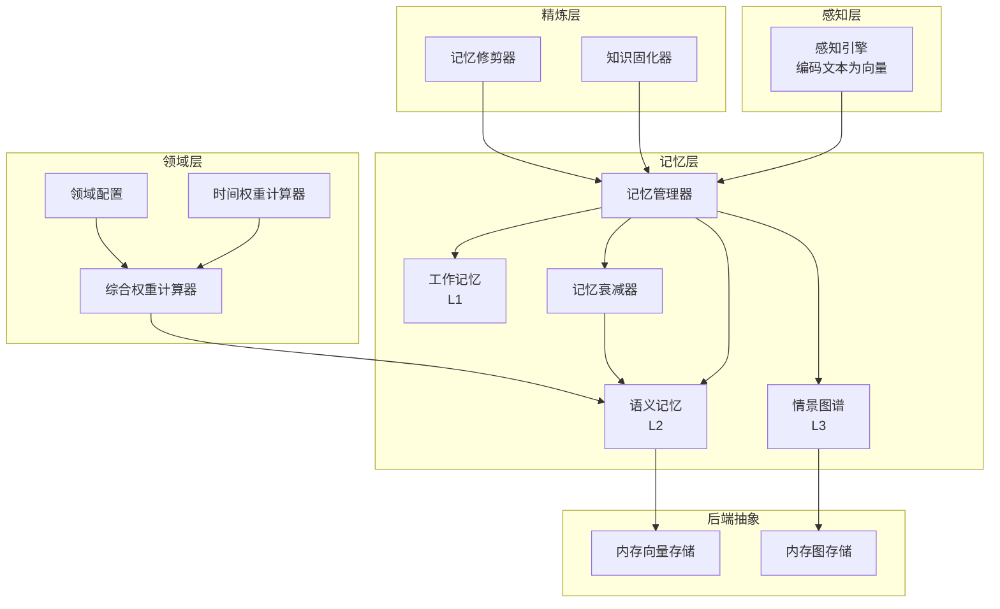
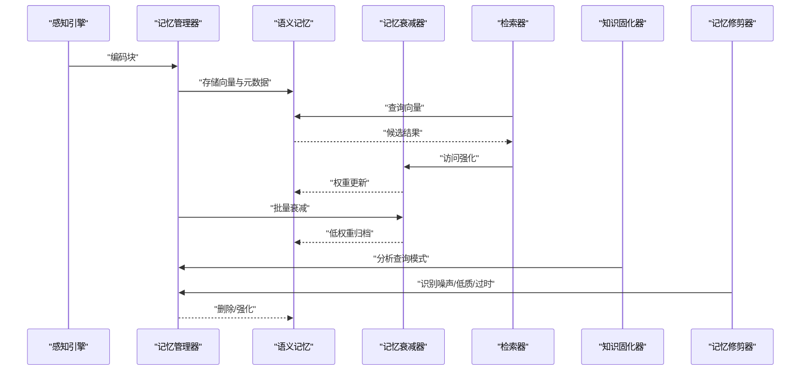
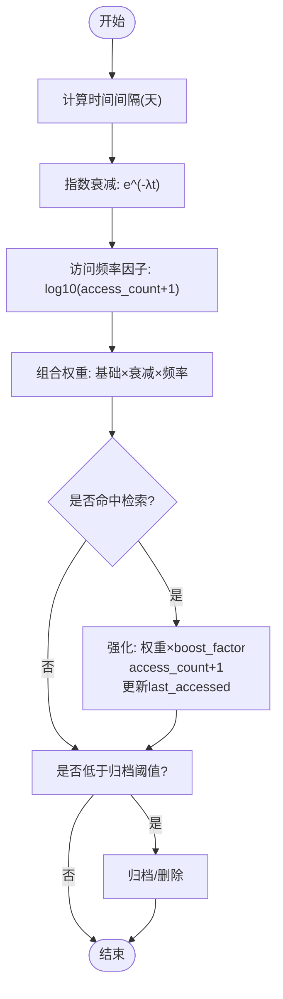
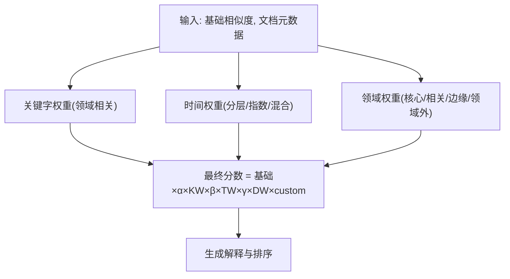
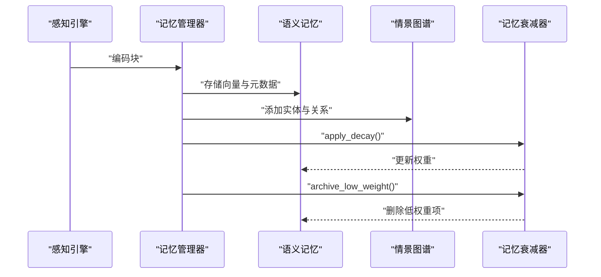
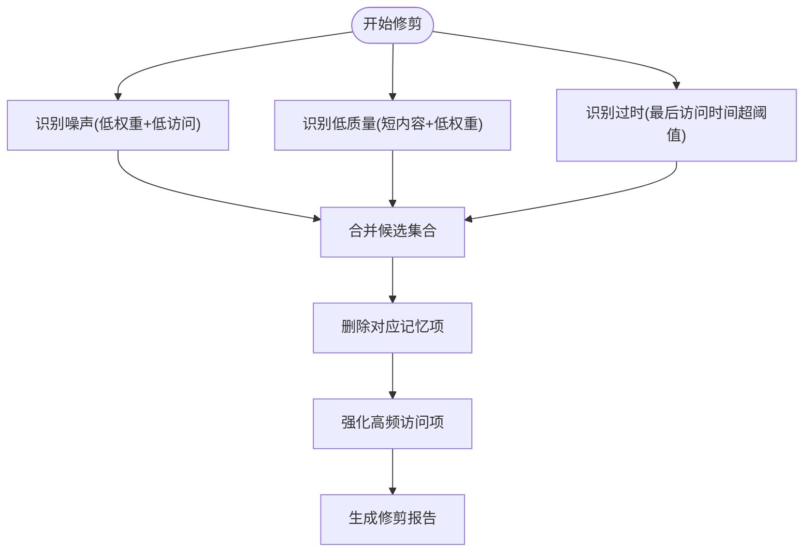
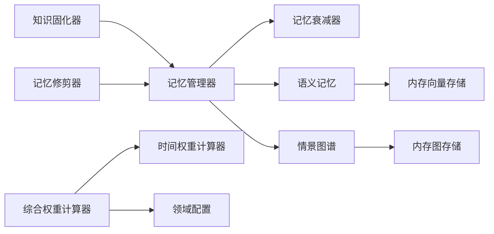

# 记忆衰减与巩固

<cite>
**本文引用的文件**
- [src/memory/decay.py](file://src/memory/decay.py)
- [src/memory/manager.py](file://src/memory/manager.py)
- [src/memory/working_memory.py](file://src/memory/working_memory.py)
- [src/memory/semantic_memory.py](file://src/memory/semantic_memory.py)
- [src/memory/episodic_graph.py](file://src/memory/episodic_graph.py)
- [src/memory/models.py](file://src/memory/models.py)
- [src/domain/temporal_weight.py](file://src/domain/temporal_weight.py)
- [src/domain/weight_calculator.py](file://src/domain/weight_calculator.py)
- [src/domain/config.py](file://src/domain/config.py)
- [src/refinement/consolidator.py](file://src/refinement/consolidator.py)
- [src/refinement/pruner.py](file://src/refinement/pruner.py)
- [src/memory/backends/memory_store.py](file://src/memory/backends/memory_store.py)
- [example/example_usage.py](file://example/example_usage.py)
</cite>

## 目录
1. [简介](#简介)
2. [项目结构](#项目结构)
3. [核心组件](#核心组件)
4. [架构总览](#架构总览)
5. [详细组件分析](#详细组件分析)
6. [依赖分析](#依赖分析)
7. [性能考虑](#性能考虑)
8. [故障排查指南](#故障排查指南)
9. [结论](#结论)
10. [附录](#附录)

## 简介
本文件围绕“记忆衰减与巩固”机制，系统阐述 NecoRAG 的三层记忆体系（工作记忆、语义记忆、情景图谱）中，如何通过数学模型与策略实现知识的动态权重计算、时间衰减、主动遗忘与数据迁移。重点覆盖：
- 记忆衰减算法设计与数学模型（权重计算与时间衰减函数）
- 记忆巩固过程中的数据迁移策略（从工作记忆到语义记忆）
- 主动遗忘的触发条件、阈值设置与清理策略
- 记忆质量评估指标与性能监控方法
- 衰减参数调优、遗忘策略配置与系统优化建议
- 对系统性能与准确性的综合影响及开发者自定义指导

## 项目结构
本项目采用分层架构，围绕感知、记忆、检索、精炼与交互五大阶段组织模块。与记忆衰减和巩固直接相关的模块包括：
- 记忆层：工作记忆、语义记忆、情景图谱、记忆管理器、衰减器
- 领域层：时间权重计算器、综合权重计算器、领域配置
- 精炼层：知识固化器、记忆修剪器
- 后端抽象：向量与图存储接口及内存实现

图表来源
- [src/memory/manager.py:16-47](file://src/memory/manager.py#L16-L47)
- [src/memory/working_memory.py:11-35](file://src/memory/working_memory.py#L11-L35)
- [src/memory/semantic_memory.py:21-49](file://src/memory/semantic_memory.py#L21-L49)
- [src/memory/episodic_graph.py:10-32](file://src/memory/episodic_graph.py#L10-L32)
- [src/memory/decay.py:11-38](file://src/memory/decay.py#L11-L38)
- [src/domain/temporal_weight.py:47-52](file://src/domain/temporal_weight.py#L47-L52)
- [src/domain/weight_calculator.py:56-80](file://src/domain/weight_calculator.py#L56-L80)
- [src/domain/config.py:54-76](file://src/domain/config.py#L54-L76)
- [src/refinement/consolidator.py:9-34](file://src/refinement/consolidator.py#L9-L34)
- [src/refinement/pruner.py:10-40](file://src/refinement/pruner.py#L10-L40)
- [src/memory/backends/memory_store.py:20-36](file://src/memory/backends/memory_store.py#L20-L36)

章节来源
- [src/memory/manager.py:16-47](file://src/memory/manager.py#L16-L47)
- [src/memory/working_memory.py:11-35](file://src/memory/working_memory.py#L11-L35)
- [src/memory/semantic_memory.py:21-49](file://src/memory/semantic_memory.py#L21-L49)
- [src/memory/episodic_graph.py:10-32](file://src/memory/episodic_graph.py#L10-L32)
- [src/memory/decay.py:11-38](file://src/memory/decay.py#L11-L38)
- [src/domain/temporal_weight.py:47-52](file://src/domain/temporal_weight.py#L47-L52)
- [src/domain/weight_calculator.py:56-80](file://src/domain/weight_calculator.py#L56-L80)
- [src/domain/config.py:54-76](file://src/domain/config.py#L54-L76)
- [src/refinement/consolidator.py:9-34](file://src/refinement/consolidator.py#L9-L34)
- [src/refinement/pruner.py:10-40](file://src/refinement/pruner.py#L10-L40)
- [src/memory/backends/memory_store.py:20-36](file://src/memory/backends/memory_store.py#L20-L36)

## 核心组件
- 记忆衰减器：负责对记忆项进行时间衰减、访问频率增强、批量衰减与归档阈值判断。
- 记忆管理器：统一调度三层记忆，执行检索、巩固与主动遗忘。
- 工作记忆：L1 层，会话上下文与意图轨迹短期存储。
- 语义记忆：L2 层，向量检索与混合检索，持久化存储。
- 情景图谱：L3 层，实体关系网络，多跳推理与因果链条。
- 时间权重计算器：按时间层级与指数衰减计算权重。
- 综合权重计算器：整合关键字、时间与领域权重，输出最终排序分数。
- 领域配置：定义权重因子、衰减系数与领域权重等级。
- 知识固化器：分析查询模式，识别知识缺口并补充。
- 记忆修剪器：识别噪声、低质量与过时信息，执行清理与强化。

章节来源
- [src/memory/decay.py:11-155](file://src/memory/decay.py#L11-L155)
- [src/memory/manager.py:16-186](file://src/memory/manager.py#L16-L186)
- [src/memory/working_memory.py:11-120](file://src/memory/working_memory.py#L11-L120)
- [src/memory/semantic_memory.py:21-179](file://src/memory/semantic_memory.py#L21-L179)
- [src/memory/episodic_graph.py:10-194](file://src/memory/episodic_graph.py#L10-L194)
- [src/domain/temporal_weight.py:47-271](file://src/domain/temporal_weight.py#L47-L271)
- [src/domain/weight_calculator.py:56-318](file://src/domain/weight_calculator.py#L56-L318)
- [src/domain/config.py:54-285](file://src/domain/config.py#L54-L285)
- [src/refinement/consolidator.py:9-142](file://src/refinement/consolidator.py#L9-L142)
- [src/refinement/pruner.py:10-157](file://src/refinement/pruner.py#L10-L157)

## 架构总览
记忆衰减与巩固贯穿感知、记忆、检索与精炼全流程。感知层产出编码块，记忆管理器将其写入语义记忆；检索阶段通过综合权重计算器对候选结果进行重排序；巩固阶段由记忆衰减器对权重进行衰减与归档，同时知识固化器与记忆修剪器辅助优化质量。

图表来源
- [src/memory/manager.py:48-186](file://src/memory/manager.py#L48-L186)
- [src/memory/semantic_memory.py:50-118](file://src/memory/semantic_memory.py#L50-L118)
- [src/memory/decay.py:39-155](file://src/memory/decay.py#L39-L155)
- [src/refinement/consolidator.py:35-61](file://src/refinement/consolidator.py#L35-L61)
- [src/refinement/pruner.py:41-70](file://src/refinement/pruner.py#L41-L70)

## 详细组件分析

### 记忆衰减算法与数学模型
- 权重计算公式
  - 基础形式：权重随时间呈指数衰减，同时引入访问频率增强项，以强化高频访问的知识。
  - 数学表达：weight(t) = 初始权重 × e^(-λt) × log10(访问次数+1)
  - 参数含义：
    - λ：衰减速率（天衰减系数），控制权重下降速度
    - t：距离创建时间的天数
    - 访问频率因子：通过对数尺度放大低频访问的惩罚与高频访问的奖励
- 批量衰减与归档
  - 对所有记忆项执行衰减，随后根据阈值筛选并归档低权重项
  - 归档阈值可按需覆盖默认值
- 强化机制
  - 检索命中后对记忆项进行强化，提升其权重并更新访问时间
  - 强化后对权重进行上限约束，避免过度膨胀

图表来源
- [src/memory/decay.py:39-155](file://src/memory/decay.py#L39-L155)

章节来源
- [src/memory/decay.py:11-155](file://src/memory/decay.py#L11-L155)

### 时间权重与领域权重融合
- 时间权重
  - 提供三种计算方式：分层权重、指数衰减、混合方法
  - 分层权重：按时间区间映射到不同权重范围，区间内线性插值
  - 指数衰减：e^(-λt)，适合强调时效性的场景
  - 混合方法：取两种方法的平均，兼顾分层与指数特性
- 领域权重
  - 依据领域配置中的相关性等级（核心/相关/边缘/领域外）与权重系数
  - 关键字权重通过领域配置的关键字词典与别名索引进行匹配与加成
- 综合权重
  - 最终分数 = 基础相似度 × α×关键字权重 × β×时间权重 × γ×领域权重 × 自定义权重加成
  - 权重因子 α、β、γ 可按领域需求调节

图表来源
- [src/domain/weight_calculator.py:81-147](file://src/domain/weight_calculator.py#L81-L147)
- [src/domain/temporal_weight.py:160-196](file://src/domain/temporal_weight.py#L160-L196)
- [src/domain/config.py:54-129](file://src/domain/config.py#L54-L129)

章节来源
- [src/domain/temporal_weight.py:47-271](file://src/domain/temporal_weight.py#L47-L271)
- [src/domain/weight_calculator.py:56-318](file://src/domain/weight_calculator.py#L56-L318)
- [src/domain/config.py:54-285](file://src/domain/config.py#L54-L285)

### 记忆巩固：从工作记忆到语义记忆的数据迁移
- 存储流程
  - 感知层编码文本为编码块，记忆管理器创建记忆项并写入语义记忆
  - 同时抽取实体三元组，构建情景图谱实体与关系
  - 统一存储于内存字典以便跨层检索与管理
- 检索与强化
  - 检索阶段命中结果后，对记忆项进行强化，提升其权重
- 巩固周期
  - 对所有记忆项执行批量衰减
  - 识别低于归档阈值的记忆并删除，实现“低价值自动清理”
- 数据迁移策略
  - L1（工作记忆）：短期会话上下文与意图轨迹，具备 TTL 与 LRU 特性，模拟瞬时遗忘
  - L2（语义记忆）：长期向量存储，作为主要检索与重排序的来源
  - L3（情景图谱）：实体关系网络，支持多跳推理与因果链条追踪

图表来源
- [src/memory/manager.py:48-186](file://src/memory/manager.py#L48-L186)
- [src/memory/semantic_memory.py:50-79](file://src/memory/semantic_memory.py#L50-L79)
- [src/memory/episodic_graph.py:33-70](file://src/memory/episodic_graph.py#L33-L70)
- [src/memory/decay.py:72-118](file://src/memory/decay.py#L72-L118)

章节来源
- [src/memory/manager.py:48-186](file://src/memory/manager.py#L48-L186)
- [src/memory/working_memory.py:11-120](file://src/memory/working_memory.py#L11-L120)
- [src/memory/semantic_memory.py:21-179](file://src/memory/semantic_memory.py#L21-L179)
- [src/memory/episodic_graph.py:10-194](file://src/memory/episodic_graph.py#L10-L194)

### 主动遗忘：触发条件、阈值与清理策略
- 触发条件
  - 记忆项权重低于设定阈值
  - 访问次数极低（噪声识别）
  - 内容质量过低（长度过短）
  - 最后访问时间超过设定天数（过时）
- 阈值设置
  - 归档阈值：默认由记忆衰减器配置，可按需覆盖
  - 噪声阈值、质量阈值、过时天数：由记忆修剪器配置
- 清理策略
  - 识别后统一删除语义记忆中的对应项，并同步清理统一存储
  - 强化高频访问的记忆，维持重要连接的稳定性

图表来源
- [src/refinement/pruner.py:41-157](file://src/refinement/pruner.py#L41-L157)
- [src/memory/manager.py:168-186](file://src/memory/manager.py#L168-L186)

章节来源
- [src/refinement/pruner.py:10-157](file://src/refinement/pruner.py#L10-L157)
- [src/memory/manager.py:168-186](file://src/memory/manager.py#L168-L186)

### 记忆质量评估与性能监控
- 质量评估指标
  - 噪声识别：权重过低且访问次数极少
  - 低质量识别：内容长度过短且权重过低
  - 过时识别：最后访问时间早于阈值日期
  - 强化效果：高频访问记忆的权重增长幅度
- 性能监控
  - 统计删除数量、强化数量、噪声/低质/过时项数量
  - 监控检索命中率与重排序稳定性
  - 记忆项总数、向量维度与图节点/边数量

章节来源
- [src/refinement/pruner.py:41-157](file://src/refinement/pruner.py#L41-L157)
- [src/memory/backends/memory_store.py:20-381](file://src/memory/backends/memory_store.py#L20-L381)

### 衰减参数调优与策略配置
- 衰减参数
  - 衰减速率 λ：控制时间衰减速度，领域越快变化选择更高值
  - 归档阈值：平衡召回与存储成本，过低导致频繁清理，过高则占用空间
  - 强化因子：提升命中记忆权重，防止“遗忘”重要知识
- 策略配置
  - 领域配置中的权重因子 α、β、γ：调节关键字、时间与领域权重对最终分数的影响
  - 时间权重方法：分层、指数或混合，依据时效性需求选择
  - 预设领域配置：针对快速变化、正常变化与缓慢变化领域的不同衰减策略

章节来源
- [src/domain/config.py:54-129](file://src/domain/config.py#L54-L129)
- [src/domain/temporal_weight.py:231-271](file://src/domain/temporal_weight.py#L231-L271)
- [src/domain/weight_calculator.py:207-223](file://src/domain/weight_calculator.py#L207-L223)

### 系统优化建议
- 检索与重排序
  - 使用综合权重计算器对候选结果进行二次排序，提高相关性
  - 合理设置阈值与 top_k，避免过多噪声进入后续处理
- 存储与索引
  - 语义记忆采用向量相似度检索，必要时扩展为混合检索（向量+关键词）
  - 情景图谱支持多跳查询与因果链条追踪，用于复杂推理场景
- 自动化维护
  - 定期运行记忆巩固与修剪，保持知识新鲜度与存储效率
  - 知识固化器分析查询模式，自动补充高频未命中知识缺口

章节来源
- [src/memory/semantic_memory.py:80-143](file://src/memory/semantic_memory.py#L80-L143)
- [src/refinement/consolidator.py:35-61](file://src/refinement/consolidator.py#L35-L61)
- [src/refinement/pruner.py:41-70](file://src/refinement/pruner.py#L41-L70)

### 开发者自定义指导
- 自定义衰减算法
  - 在记忆衰减器中扩展新的时间衰减函数或访问频率增强策略
  - 支持按领域定制权重因子与阈值
- 自定义遗忘策略
  - 在记忆修剪器中扩展噪声、低质量与过时识别规则
  - 支持基于内容特征（如关键词密度、主题一致性）的智能清理
- 集成外部存储
  - 通过内存存储实现作为基线，后续可替换为真实向量数据库与图数据库

章节来源
- [src/memory/decay.py:11-155](file://src/memory/decay.py#L11-L155)
- [src/refinement/pruner.py:10-157](file://src/refinement/pruner.py#L10-L157)
- [src/memory/backends/memory_store.py:20-381](file://src/memory/backends/memory_store.py#L20-L381)

## 依赖分析
- 组件耦合
  - 记忆管理器聚合三层记忆与衰减器，承担统一入口职责
  - 综合权重计算器依赖时间权重计算器与领域配置，形成清晰的领域驱动设计
  - 知识固化器与记忆修剪器通过记忆管理器访问底层存储
- 外部依赖
  - 向量与图存储接口抽象，便于替换为真实数据库实现
  - 示例脚本展示完整工作流，便于集成与测试

图表来源
- [src/memory/manager.py:16-47](file://src/memory/manager.py#L16-L47)
- [src/domain/weight_calculator.py:56-80](file://src/domain/weight_calculator.py#L56-L80)
- [src/domain/temporal_weight.py:47-52](file://src/domain/temporal_weight.py#L47-L52)
- [src/domain/config.py:54-76](file://src/domain/config.py#L54-L76)
- [src/refinement/consolidator.py:20-34](file://src/refinement/consolidator.py#L20-L34)
- [src/refinement/pruner.py:20-40](file://src/refinement/pruner.py#L20-L40)
- [src/memory/backends/memory_store.py:20-36](file://src/memory/backends/memory_store.py#L20-L36)

章节来源
- [src/memory/manager.py:16-47](file://src/memory/manager.py#L16-L47)
- [src/domain/weight_calculator.py:56-80](file://src/domain/weight_calculator.py#L56-L80)
- [src/domain/temporal_weight.py:47-52](file://src/domain/temporal_weight.py#L47-L52)
- [src/domain/config.py:54-76](file://src/domain/config.py#L54-L76)
- [src/refinement/consolidator.py:20-34](file://src/refinement/consolidator.py#L20-L34)
- [src/refinement/pruner.py:20-40](file://src/refinement/pruner.py#L20-L40)
- [src/memory/backends/memory_store.py:20-36](file://src/memory/backends/memory_store.py#L20-L36)

## 性能考虑
- 时间复杂度
  - 向量检索：O(N) 遍历或近似检索（待实现 HNSW），建议在大规模场景下引入索引
  - 图遍历：BFS/DFS 复杂度与节点与边数相关，建议限制最大深度与边类型过滤
- 空间复杂度
  - 向量存储与元数据字典线性增长，需定期归档与修剪
  - 图存储的邻接表与边集随关系增长，注意内存占用
- 调优建议
  - 合理设置 top_k 与阈值，减少无效计算
  - 使用批量操作与缓存热点记忆项，降低重复计算

## 故障排查指南
- 记忆未被检索
  - 检查语义记忆是否正确存储向量与元数据
  - 确认检索向量维度与存储一致
- 权重异常
  - 核对衰减速率与时间间隔计算
  - 检查访问频率增强是否生效
- 过度清理
  - 提升归档阈值或强化因子，避免误删重要知识
- 性能瓶颈
  - 增加索引与缓存策略，优化检索与图遍历

章节来源
- [src/memory/semantic_memory.py:80-118](file://src/memory/semantic_memory.py#L80-L118)
- [src/memory/backends/memory_store.py:55-91](file://src/memory/backends/memory_store.py#L55-L91)
- [src/memory/decay.py:39-71](file://src/memory/decay.py#L39-L71)

## 结论
本机制通过“时间权重 + 访问频率 + 领域权重”的综合计算，结合“批量衰减 + 主动遗忘 + 知识固化 + 记忆修剪”，实现了对知识的动态管理与持续优化。在保证检索准确性的同时，有效控制存储成本与系统开销。开发者可根据领域特性灵活调参与扩展，以获得更佳的性能与效果。

## 附录
- 使用示例
  - 完整工作流示例展示了从感知、记忆、检索到精炼与交互的端到端流程

章节来源
- [example/example_usage.py:12-252](file://example/example_usage.py#L12-L252)