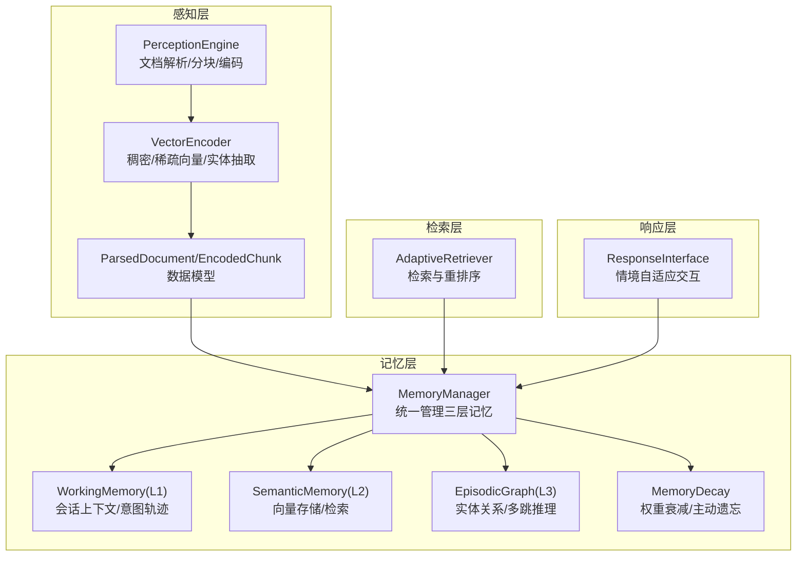
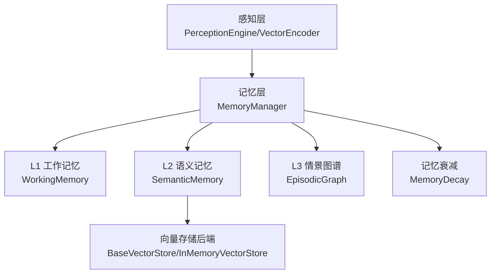
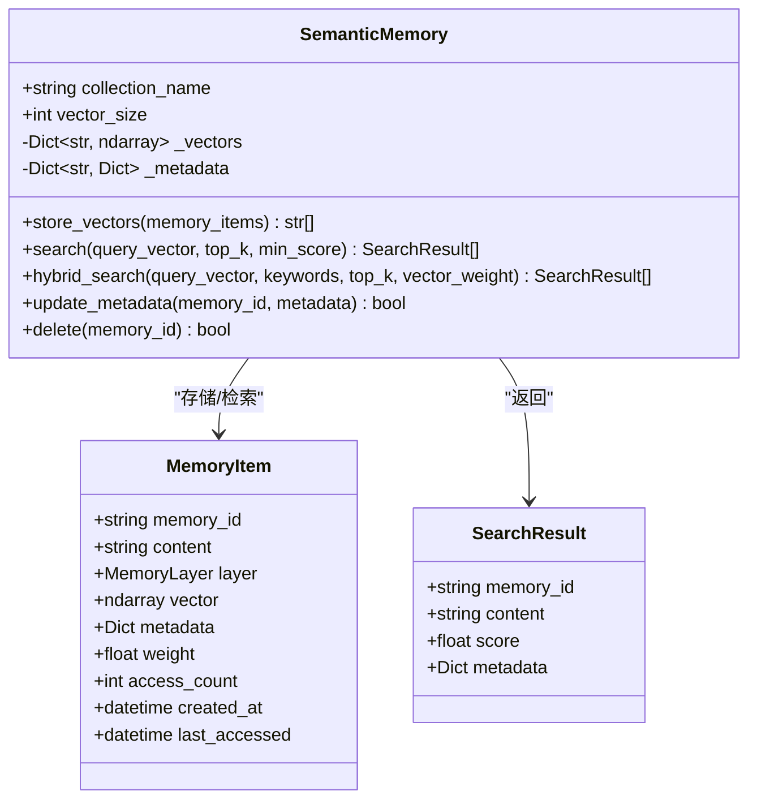
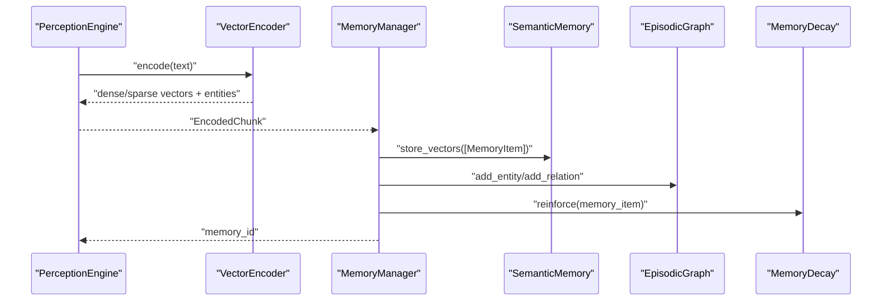
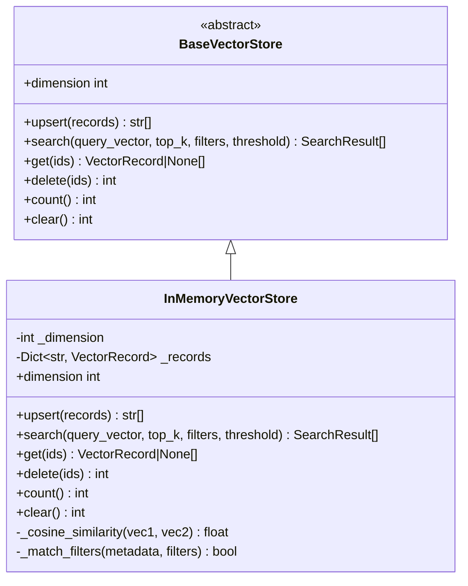
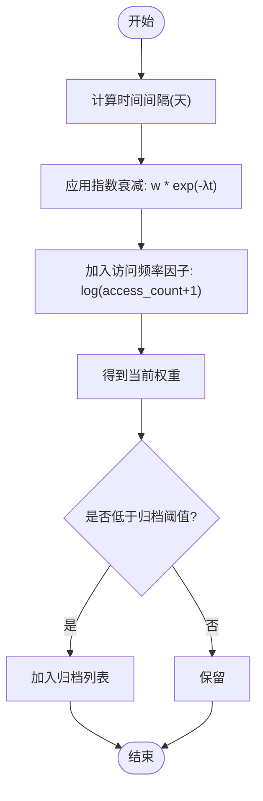
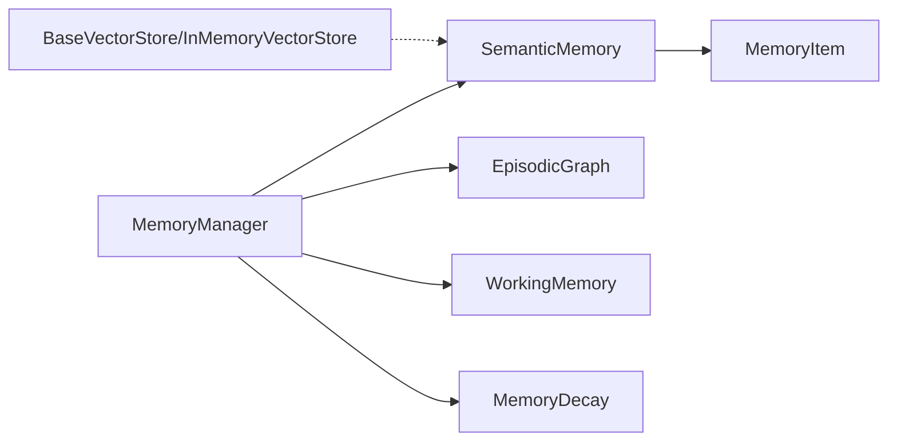

# 语义记忆管理

<cite>
**本文引用的文件**   
- [src/memory/semantic_memory.py](file://src/memory/semantic_memory.py)
- [src/memory/models.py](file://src/memory/models.py)
- [src/memory/backends/memory_store.py](file://src/memory/backends/memory_store.py)
- [src/memory/backends/base.py](file://src/memory/backends/base.py)
- [src/memory/manager.py](file://src/memory/manager.py)
- [src/memory/working_memory.py](file://src/memory/working_memory.py)
- [src/memory/episodic_graph.py](file://src/memory/episodic_graph.py)
- [src/memory/decay.py](file://src/memory/decay.py)
- [src/perception/engine.py](file://src/perception/engine.py)
- [src/perception/encoder.py](file://src/perception/encoder.py)
- [src/perception/models.py](file://src/perception/models.py)
- [example/example_usage.py](file://example/example_usage.py)
- [src/memory/README.md](file://src/memory/README.md)
- [src/domain/config.py](file://src/domain/config.py)
</cite>

## 目录
1. [简介](#简介)
2. [项目结构](#项目结构)
3. [核心组件](#核心组件)
4. [架构总览](#架构总览)
5. [详细组件分析](#详细组件分析)
6. [依赖分析](#依赖分析)
7. [性能考虑](#性能考虑)
8. [故障排查指南](#故障排查指南)
9. [结论](#结论)
10. [附录](#附录)

## 简介
本文件面向“语义记忆管理”的技术实现，围绕 L2 层语义记忆的向量存储机制、相似度检索算法、持久化与索引管理、语义搜索实现与优化、增删改查与批量处理、检索参数配置、以及与工作记忆的数据流转与同步机制展开。同时提供扩展与自定义检索策略的实现指南，帮助开发者快速上手并进行二次开发。

## 项目结构
本项目采用分层架构，感知层负责将多模态输入编码为向量与结构化信息；记忆层负责三层记忆的统一管理；检索层负责融合与重排序；响应层负责交互适配。与语义记忆直接相关的模块主要集中在 memory 与 perception 子包中。

图表来源
- [src/perception/engine.py:14-130](file://src/perception/engine.py#L14-L130)
- [src/perception/encoder.py:24-254](file://src/perception/encoder.py#L24-L254)
- [src/perception/models.py:11-69](file://src/perception/models.py#L11-L69)
- [src/memory/manager.py:16-186](file://src/memory/manager.py#L16-L186)
- [src/memory/working_memory.py:11-120](file://src/memory/working_memory.py#L11-L120)
- [src/memory/semantic_memory.py:21-179](file://src/memory/semantic_memory.py#L21-L179)
- [src/memory/episodic_graph.py:10-194](file://src/memory/episodic_graph.py#L10-L194)
- [src/memory/decay.py:11-155](file://src/memory/decay.py#L11-L155)

章节来源
- [src/memory/README.md:1-244](file://src/memory/README.md#L1-L244)

## 核心组件
- 语义记忆（L2）：负责高维向量存储、向量检索、混合检索（关键词+向量）、元数据更新与删除。
- 记忆管理器：统一调度 L1/L2/L3，协调存储、检索、巩固与遗忘。
- 工作记忆（L1）：会话上下文与意图轨迹的短期存储。
- 情景图谱（L3）：实体关系网络，支持多跳与因果链路。
- 记忆衰减：模拟生物记忆的巩固与遗忘，动态调整权重并执行归档。
- 向量存储后端：抽象基类与内存实现，提供 upsert/search/get/delete/count 等能力。

章节来源
- [src/memory/semantic_memory.py:21-179](file://src/memory/semantic_memory.py#L21-L179)
- [src/memory/manager.py:16-186](file://src/memory/manager.py#L16-L186)
- [src/memory/working_memory.py:11-120](file://src/memory/working_memory.py#L11-L120)
- [src/memory/episodic_graph.py:10-194](file://src/memory/episodic_graph.py#L10-L194)
- [src/memory/decay.py:11-155](file://src/memory/decay.py#L11-L155)
- [src/memory/backends/base.py:54-297](file://src/memory/backends/base.py#L54-L297)
- [src/memory/backends/memory_store.py:20-381](file://src/memory/backends/memory_store.py#L20-L381)

## 架构总览
语义记忆在整体架构中的定位与职责如下：

图表来源
- [src/memory/manager.py:16-186](file://src/memory/manager.py#L16-L186)
- [src/memory/semantic_memory.py:21-179](file://src/memory/semantic_memory.py#L21-L179)
- [src/memory/backends/base.py:54-137](file://src/memory/backends/base.py#L54-L137)
- [src/memory/backends/memory_store.py:20-141](file://src/memory/backends/memory_store.py#L20-L141)

## 详细组件分析

### 语义记忆（SemanticMemory）分析
- 职责边界
  - 存储：接收 MemoryItem 列表，写入向量与元数据。
  - 检索：基于余弦相似度的向量检索，支持 top_k 与最小分数阈值。
  - 混合检索：预留向量+关键词融合入口（当前最小实现仅向量）。
  - 元数据更新与删除：按 memory_id 更新/删除。
- 数据结构
  - 向量映射：memory_id -> numpy 向量
  - 元数据映射：memory_id -> 字典（含 content、layer、weight、metadata）
- 算法与复杂度
  - 当前实现为全量扫描与余弦相似度计算，时间复杂度 O(N·D)，N 为向量数量，D 为向量维度。
  - 空间复杂度 O(N·D) 存储向量，O(N) 存储元数据。
- 索引与性能
  - 当前为内存模拟，未集成 Qdrant/Milvus；HNSW 索引为 TODO。
  - 建议后续接入向量数据库以支持近似最近邻检索，降低检索复杂度至 O(log N) 或更低。
- 检索参数
  - top_k：返回数量上限
  - min_score：相似度阈值
  - 关键词融合：预留 keywords 与 vector_weight 参数

图表来源
- [src/memory/semantic_memory.py:21-179](file://src/memory/semantic_memory.py#L21-L179)
- [src/memory/models.py:19-31](file://src/memory/models.py#L19-L31)

章节来源
- [src/memory/semantic_memory.py:21-179](file://src/memory/semantic_memory.py#L21-L179)
- [src/memory/models.py:19-31](file://src/memory/models.py#L19-L31)

### 记忆管理器（MemoryManager）分析
- 职责边界
  - 接收感知层编码后的 EncodedChunk，构建 MemoryItem 并写入 L2。
  - 将实体三元组写入 L3 情景图谱。
  - 统一存储 _memory_store，便于跨层检索与强化访问。
  - 调用 MemoryDecay 对权重进行衰减与归档。
- 数据流
  - 输入：EncodedChunk（包含 dense/sparse 向量、实体、上下文标签等）
  - 输出：memory_id，供检索与后续处理使用
- 检索流程
  - L2 向量检索（若提供 query_vector），结合统一存储与衰减强化，返回 MemoryItem 列表。

图表来源
- [src/perception/engine.py:54-107](file://src/perception/engine.py#L54-L107)
- [src/perception/encoder.py:72-118](file://src/perception/encoder.py#L72-L118)
- [src/memory/manager.py:48-112](file://src/memory/manager.py#L48-L112)
- [src/memory/semantic_memory.py:50-78](file://src/memory/semantic_memory.py#L50-L78)
- [src/memory/episodic_graph.py:33-69](file://src/memory/episodic_graph.py#L33-L69)
- [src/memory/decay.py:120-142](file://src/memory/decay.py#L120-L142)

章节来源
- [src/memory/manager.py:16-186](file://src/memory/manager.py#L16-L186)

### 向量存储后端（BaseVectorStore/InMemoryVectorStore）分析
- 抽象接口
  - upsert/get/search/delete/count/clear/dimension 等标准方法。
- 内存实现
  - 维度校验、余弦相似度计算、元数据过滤、阈值过滤、Top-K 排序。
- 适用场景
  - 开发/测试/小规模应用；生产环境建议替换为 Qdrant/Milvus 等向量数据库。

图表来源
- [src/memory/backends/base.py:54-137](file://src/memory/backends/base.py#L54-L137)
- [src/memory/backends/memory_store.py:20-141](file://src/memory/backends/memory_store.py#L20-L141)

章节来源
- [src/memory/backends/base.py:54-137](file://src/memory/backends/base.py#L54-L137)
- [src/memory/backends/memory_store.py:20-141](file://src/memory/backends/memory_store.py#L20-L141)

### 记忆衰减（MemoryDecay）分析
- 目标
  - 模拟生物记忆的巩固与遗忘，通过指数衰减与访问频率因子动态调整权重。
- 关键公式
  - weight(t) = initial_weight × e^(-λt) × log(access_count+1)
- 能力
  - 计算权重、批量应用衰减、归档低权重记忆、强化访问记忆。

图表来源
- [src/memory/decay.py:39-118](file://src/memory/decay.py#L39-L118)

章节来源
- [src/memory/decay.py:11-155](file://src/memory/decay.py#L11-L155)

### 工作记忆（L1）与情景图谱（L3）
- 工作记忆（L1）
  - 会话上下文与意图轨迹的短期存储，具备 TTL 与 LRU 等容量管理能力（当前为内存模拟）。
- 情景图谱（L3）
  - 实体关系网络，支持多跳查询、因果链追踪、相关实体发现等（当前为内存实现，预留图数据库集成）。

章节来源
- [src/memory/working_memory.py:11-120](file://src/memory/working_memory.py#L11-L120)
- [src/memory/episodic_graph.py:10-194](file://src/memory/episodic_graph.py#L10-L194)

## 依赖分析
- 组件耦合
  - MemoryManager 依赖 SemanticMemory、EpisodicGraph、MemoryDecay 与 WorkingMemory。
  - SemanticMemory 依赖 MemoryItem 数据模型。
  - 向量存储后端通过抽象基类解耦具体实现。
- 外部依赖
  - 生产环境建议引入 Qdrant/Milvus（向量数据库）、Neo4j/NebulaGraph（图数据库）。
- 潜在循环依赖
  - 当前模块间为单向依赖，未见循环。

图表来源
- [src/memory/manager.py:16-46](file://src/memory/manager.py#L16-L46)
- [src/memory/semantic_memory.py:21-48](file://src/memory/semantic_memory.py#L21-L48)
- [src/memory/models.py:19-31](file://src/memory/models.py#L19-L31)
- [src/memory/backends/base.py:54-137](file://src/memory/backends/base.py#L54-L137)

章节来源
- [src/memory/manager.py:16-46](file://src/memory/manager.py#L16-L46)
- [src/memory/semantic_memory.py:21-48](file://src/memory/semantic_memory.py#L21-L48)
- [src/memory/models.py:19-31](file://src/memory/models.py#L19-L31)
- [src/memory/backends/base.py:54-137](file://src/memory/backends/base.py#L54-L137)

## 性能考虑
- 当前实现
  - 语义检索为全量扫描与余弦相似度，复杂度 O(N·D)，适合小规模数据。
- 建议优化
  - 索引：接入 Milvus/Qdrant，启用 HNSW/PQ/IVF 等索引，将检索复杂度降至 O(log N)。
  - 批量：向量入库采用批量 upsert，减少网络往返。
  - 过滤：利用元数据过滤（filters）缩小候选集，再做相似度计算。
  - 缓存：对热点查询结果与向量进行缓存，降低重复计算。
  - 稀疏向量融合：在混合检索中引入关键词权重，提升召回质量。
- 参数调优
  - top_k：根据召回与展示需求平衡。
  - min_score：依据向量质量与业务阈值设定。
  - 向量维度：与模型一致（如 768/1024），避免维度不匹配导致异常。
  - 衰减参数：decay_rate 与 archive_threshold 控制记忆留存与清理节奏。

[本节为通用性能建议，无需特定文件引用]

## 故障排查指南
- 向量维度不匹配
  - 现象：插入/查询时报维度错误。
  - 排查：确认编码器输出维度与向量存储 dimension 一致。
  - 参考
    - [src/memory/backends/memory_store.py:45-50](file://src/memory/backends/memory_store.py#L45-L50)
    - [src/perception/encoder.py:67-70](file://src/perception/encoder.py#L67-L70)
- 相似度为 0 或异常
  - 现象：检索结果分数异常。
  - 排查：检查向量是否归一化、是否存在零向量；确认阈值设置合理。
  - 参考
    - [src/memory/backends/memory_store.py:116-125](file://src/memory/backends/memory_store.py#L116-L125)
    - [src/memory/semantic_memory.py:104-106](file://src/memory/semantic_memory.py#L104-L106)
- 记忆未被检索到
  - 现象：检索为空或结果不相关。
  - 排查：确认 query_vector 是否来自同一编码器；检查 top_k 与 min_score；核对统一存储中是否存在对应 memory_id。
  - 参考
    - [src/memory/manager.py:136-147](file://src/memory/manager.py#L136-L147)
    - [src/memory/semantic_memory.py:80-118](file://src/memory/semantic_memory.py#L80-L118)
- 归档过多或过少
  - 现象：记忆被频繁归档或长期滞留。
  - 排查：调整 decay_rate 与 archive_threshold；观察 access_count 变化。
  - 参考
    - [src/memory/decay.py:39-118](file://src/memory/decay.py#L39-L118)

章节来源
- [src/memory/backends/memory_store.py:45-50](file://src/memory/backends/memory_store.py#L45-L50)
- [src/perception/encoder.py:67-70](file://src/perception/encoder.py#L67-L70)
- [src/memory/semantic_memory.py:104-118](file://src/memory/semantic_memory.py#L104-L118)
- [src/memory/manager.py:136-147](file://src/memory/manager.py#L136-L147)
- [src/memory/decay.py:39-118](file://src/memory/decay.py#L39-L118)

## 结论
本实现以最小可用方式完成了 L2 语义记忆的向量存储与检索，并通过记忆管理器串联 L1/L2/L3 与衰减机制，形成闭环的记忆系统。生产落地建议：
- 集成 Milvus/Qdrant 作为向量数据库，启用 HNSW/倒排索引；
- 引入关键词融合与重排序策略；
- 建立统一的配置中心，集中管理向量维度、阈值、索引参数；
- 完善日志与监控，跟踪检索延迟、命中率与归档比例。

[本节为总结性内容，无需特定文件引用]

## 附录

### 语义检索实现与查询优化要点
- 向量检索
  - 使用余弦相似度；支持元数据过滤与阈值过滤；按分数降序取 Top-K。
  - 参考
    - [src/memory/backends/memory_store.py:55-91](file://src/memory/backends/memory_store.py#L55-L91)
    - [src/memory/semantic_memory.py:80-118](file://src/memory/semantic_memory.py#L80-L118)
- 混合检索
  - 当前最小实现仅向量；建议引入关键词权重与向量权重融合（如加权求和/重排序）。
  - 参考
    - [src/memory/semantic_memory.py:120-142](file://src/memory/semantic_memory.py#L120-L142)
- 查询优化
  - 元数据过滤先于相似度计算，缩小候选集；
  - 批量 upsert 与缓存热点结果；
  - 合理设置 top_k 与 min_score，兼顾召回与效率。

章节来源
- [src/memory/backends/memory_store.py:55-91](file://src/memory/backends/memory_store.py#L55-L91)
- [src/memory/semantic_memory.py:80-142](file://src/memory/semantic_memory.py#L80-L142)

### 增删改查与批量处理示例
- 存储
  - 将 EncodedChunk 转换为 MemoryItem，调用 SemanticMemory.store_vectors 批量写入。
  - 参考
    - [src/memory/manager.py:48-112](file://src/memory/manager.py#L48-L112)
    - [src/memory/semantic_memory.py:50-78](file://src/memory/semantic_memory.py#L50-L78)
- 检索
  - 提供 query_vector，调用 SemanticMemory.search 或 MemoryManager.retrieve。
  - 参考
    - [src/memory/semantic_memory.py:80-118](file://src/memory/semantic_memory.py#L80-L118)
    - [src/memory/manager.py:114-147](file://src/memory/manager.py#L114-L147)
- 更新与删除
  - 更新元数据：SemanticMemory.update_metadata
  - 删除记忆：SemanticMemory.delete
  - 参考
    - [src/memory/semantic_memory.py:144-179](file://src/memory/semantic_memory.py#L144-L179)

章节来源
- [src/memory/manager.py:48-112](file://src/memory/manager.py#L48-L112)
- [src/memory/semantic_memory.py:50-179](file://src/memory/semantic_memory.py#L50-L179)

### 向量维度、相似度阈值与检索参数配置
- 向量维度
  - 由编码器决定（如 768/1024），需与向量存储 dimension 一致。
  - 参考
    - [src/perception/encoder.py:67-70](file://src/perception/encoder.py#L67-L70)
    - [src/memory/backends/memory_store.py:27-36](file://src/memory/backends/memory_store.py#L27-L36)
- 相似度阈值与 Top-K
  - min_score：过滤低相关结果
  - top_k：控制返回数量
  - 参考
    - [src/memory/semantic_memory.py:82-84](file://src/memory/semantic_memory.py#L82-L84)
    - [src/memory/backends/memory_store.py:58-60](file://src/memory/backends/memory_store.py#L58-L60)
- 领域权重与时间衰减
  - 领域配置可辅助检索加权；记忆衰减控制留存。
  - 参考
    - [src/domain/config.py:54-129](file://src/domain/config.py#L54-L129)
    - [src/memory/decay.py:24-37](file://src/memory/decay.py#L24-L37)

章节来源
- [src/perception/encoder.py:67-70](file://src/perception/encoder.py#L67-L70)
- [src/memory/backends/memory_store.py:27-60](file://src/memory/backends/memory_store.py#L27-L60)
- [src/memory/semantic_memory.py:82-84](file://src/memory/semantic_memory.py#L82-L84)
- [src/domain/config.py:54-129](file://src/domain/config.py#L54-L129)
- [src/memory/decay.py:24-37](file://src/memory/decay.py#L24-L37)

### 语义记忆与工作记忆的数据流转与同步
- 流转路径
  - 新知识入库：EncodedChunk → L1 缓存（会话上下文/意图）→ L2 向量存储 → L3 图谱节点/关系
  - 检索路径：Query → L1 上下文 → L2 向量检索 → L3 图谱推理 → 融合结果
  - 巩固路径：L1 高频 → L2 持久化；L2 关联 → L3 连接；低频 → 归档/删除
- 同步机制
  - 统一存储 _memory_store 保障跨层可见性；检索后对命中记忆进行权重强化。
  - 参考
    - [src/memory/manager.py:48-147](file://src/memory/manager.py#L48-L147)
    - [src/memory/README.md:179-192](file://src/memory/README.md#L179-L192)

章节来源
- [src/memory/manager.py:48-147](file://src/memory/manager.py#L48-L147)
- [src/memory/README.md:179-192](file://src/memory/README.md#L179-L192)

### 扩展与自定义检索策略实现指南
- 自定义向量数据库后端
  - 继承 BaseVectorStore，实现 upsert/search/get/delete/count/dimension。
  - 参考
    - [src/memory/backends/base.py:54-137](file://src/memory/backends/base.py#L54-L137)
- 自定义混合检索
  - 在 SemanticMemory.hybrid_search 中实现关键词权重与向量权重融合策略。
  - 参考
    - [src/memory/semantic_memory.py:120-142](file://src/memory/semantic_memory.py#L120-L142)
- 自定义索引与近似检索
  - 在向量存储后端中接入 Milvus/Qdrant 的查询接口，启用 HNSW/IVF/PQ。
  - 参考
    - [src/memory/backends/base.py:54-90](file://src/memory/backends/base.py#L54-L90)
- 自定义记忆衰减与归档
  - 调整 decay_rate 与 archive_threshold，或扩展权重计算逻辑。
  - 参考
    - [src/memory/decay.py:24-37](file://src/memory/decay.py#L24-L37)

章节来源
- [src/memory/backends/base.py:54-137](file://src/memory/backends/base.py#L54-L137)
- [src/memory/semantic_memory.py:120-142](file://src/memory/semantic_memory.py#L120-L142)
- [src/memory/decay.py:24-37](file://src/memory/decay.py#L24-L37)