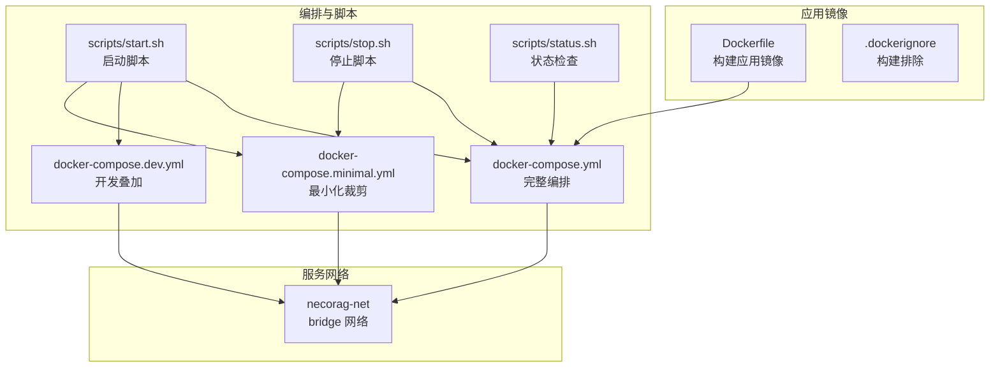
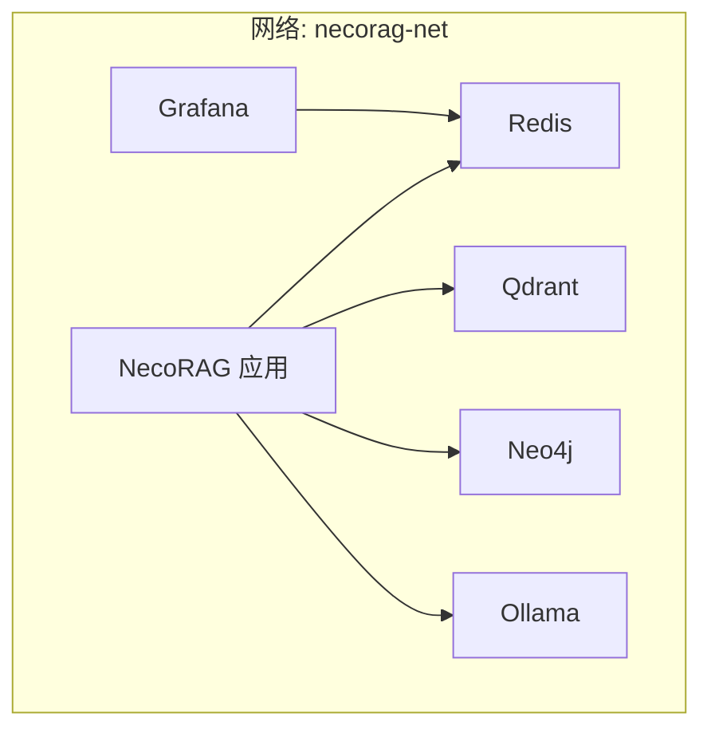
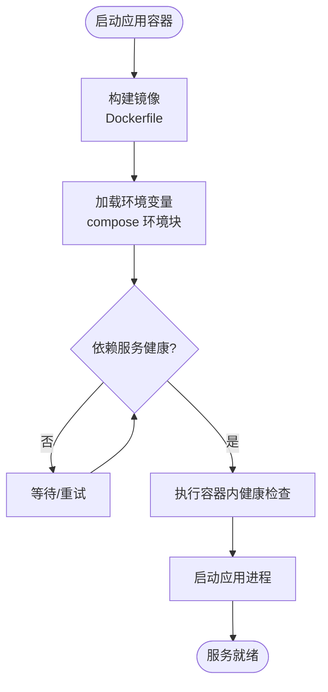
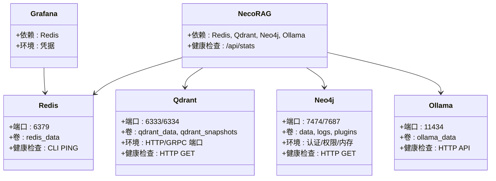
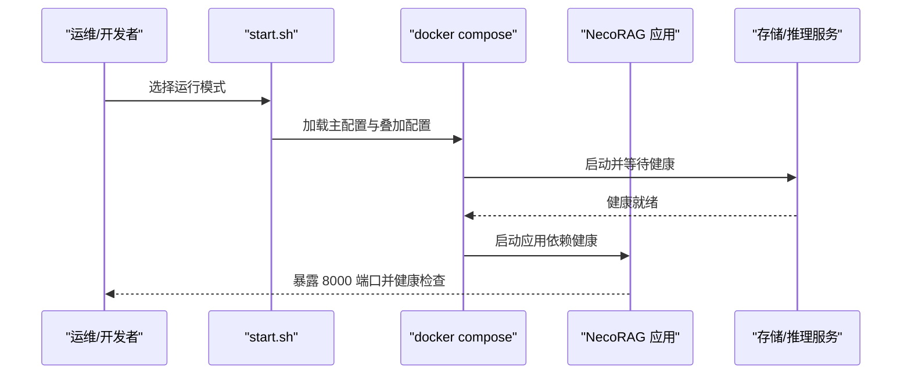

# Docker Compose 编排

<cite>
**本文引用的文件**
- [docker-compose.yml](file://devops/docker-compose.yml)
- [docker-compose.dev.yml](file://devops/docker-compose.dev.yml)
- [docker-compose.minimal.yml](file://devops/docker-compose.minimal.yml)
- [Dockerfile](file://devops/Dockerfile)
- [.dockerignore](file://devops/.dockerignore)
- [start.sh](file://devops/scripts/start.sh)
- [stop.sh](file://devops/scripts/stop.sh)
- [status.sh](file://devops/scripts/status.sh)
- [start_dashboard.py](file://tools/start_dashboard.py)
- [start_dashboard.sh](file://tools/start_dashboard.sh)
</cite>

## 目录
1. [引言](#引言)
2. [项目结构](#项目结构)
3. [核心组件](#核心组件)
4. [架构总览](#架构总览)
5. [详细组件分析](#详细组件分析)
6. [依赖关系分析](#依赖关系分析)
7. [性能考虑](#性能考虑)
8. [故障排查指南](#故障排查指南)
9. [结论](#结论)
10. [附录](#附录)

## 引言
本文件面向运维与开发团队，系统化阐述基于 Docker Compose 的 NecoRAG 微服务编排方案。内容涵盖多环境配置策略（开发、完整、最小化）、服务间依赖与网络拓扑、数据持久化与共享、环境变量覆盖与模板化、健康检查与自动重启、以及完整的编排命令、服务管理流程与故障恢复策略。目标是帮助读者快速搭建稳定、可扩展且易于维护的容器化微服务架构。

## 项目结构
围绕 devops 目录的 Compose 配置与配套脚本，形成“主配置 + 环境叠加 + 最小化裁剪”的分层设计：
- 主配置：统一编排所有核心服务与应用，定义网络、卷、健康检查与依赖关系。
- 环境叠加：通过 profiles 或多文件合并实现开发模式、按需启动 LLM/监控等场景。
- 最小化配置：仅启动核心存储（Redis + Qdrant），便于轻量化测试或嵌入式部署。
- 构建镜像：应用服务通过 Dockerfile 构建，包含健康检查与启动命令。
- 运维脚本：封装启动、停止、状态检查与清理流程，支持多种运行模式。

图表来源
- [docker-compose.yml:1-164](file://devops/docker-compose.yml#L1-L164)
- [docker-compose.dev.yml:1-16](file://devops/docker-compose.dev.yml#L1-L16)
- [docker-compose.minimal.yml:1-33](file://devops/docker-compose.minimal.yml#L1-L33)
- [Dockerfile:1-39](file://devops/Dockerfile#L1-L39)
- [start.sh:1-101](file://devops/scripts/start.sh#L1-L101)
- [stop.sh:1-36](file://devops/scripts/stop.sh#L1-L36)
- [status.sh:1-48](file://devops/scripts/status.sh#L1-L48)

章节来源
- [docker-compose.yml:1-164](file://devops/docker-compose.yml#L1-L164)
- [docker-compose.dev.yml:1-16](file://devops/docker-compose.dev.yml#L1-L16)
- [docker-compose.minimal.yml:1-33](file://devops/docker-compose.minimal.yml#L1-L33)
- [Dockerfile:1-39](file://devops/Dockerfile#L1-L39)
- [start.sh:1-101](file://devops/scripts/start.sh#L1-L101)
- [stop.sh:1-36](file://devops/scripts/stop.sh#L1-L36)
- [status.sh:1-48](file://devops/scripts/status.sh#L1-L48)

## 核心组件
- 存储层
  - Redis（工作记忆层）：持久化卷、健康检查、容器内配置挂载。
  - Qdrant（语义记忆层）：持久化卷与快照卷、HTTP/GRPC 端口映射、健康检查。
  - Neo4j（情景图谱层）：持久化卷、插件与日志卷、认证与内存参数、健康检查。
- 推理层
  - Ollama（本地大模型服务）：持久化模型卷、按需启动（开发/生产可选）。
- 可观测性
  - Grafana：数据卷、配置挂载、管理员凭据、依赖 Redis。
- 应用服务
  - NecoRAG 应用：构建自 Dockerfile，暴露 8000 端口，健康检查，依赖三大存储与 LLM（可选）。
- 网络与卷
  - 统一 bridge 网络 necorag-net；各服务独立命名卷用于持久化。

章节来源
- [docker-compose.yml:4-164](file://devops/docker-compose.yml#L4-L164)

## 架构总览
下图展示服务间的依赖关系、网络拓扑与数据流向。应用服务依赖存储与推理服务，监控服务依赖存储；服务通过统一网络互通。

图表来源
- [docker-compose.yml:4-164](file://devops/docker-compose.yml#L4-L164)

## 详细组件分析

### 组件 A：应用服务（NecoRAG）
- 构建与运行
  - 通过 Dockerfile 构建镜像，设置工作目录、安装系统与 Python 依赖、复制源码与配置、暴露端口、健康检查、启动命令。
  - 运行时通过环境变量注入 LLM 提供商、数据库连接、调试开关等。
- 依赖与健康检查
  - 依赖 Redis/Qdrant/Neo4j 健康后再启动；容器内置健康检查探测 /api/stats。
- 数据与配置
  - 挂载配置目录与数据目录，确保配置热更新与数据持久化。

图表来源
- [Dockerfile:1-39](file://devops/Dockerfile#L1-L39)
- [docker-compose.yml:118-147](file://devops/docker-compose.yml#L118-L147)

章节来源
- [Dockerfile:1-39](file://devops/Dockerfile#L1-L39)
- [docker-compose.yml:118-147](file://devops/docker-compose.yml#L118-L147)

### 组件 B：存储与推理服务
- Redis
  - 端口映射、持久化卷、配置挂载、健康检查（CLI PING）。
- Qdrant
  - HTTP/GRPC 端口映射、持久化与快照卷、环境变量控制端口、健康检查（HTTP GET）。
- Neo4j
  - HTTP/Bolt 端口映射、数据/日志/插件卷、认证与权限、内存参数、健康检查（HTTP GET）。
- Ollama
  - 端口映射、模型持久化卷、健康检查（HTTP API）。

图表来源
- [docker-compose.yml:6-97](file://devops/docker-compose.yml#L6-L97)

章节来源
- [docker-compose.yml:6-97](file://devops/docker-compose.yml#L6-L97)

### 组件 C：可观测性（Grafana）
- 依赖 Redis（作为数据源之一）。
- 通过环境变量设置管理员账户与密码，禁用用户注册。
- 挂载配置目录实现数据源与仪表板的预置化。

章节来源
- [docker-compose.yml:100-116](file://devops/docker-compose.yml#L100-L116)

### 组件 D：最小化部署（仅核心存储）
- 仅启动 Redis 与 Qdrant，适合轻量化测试或嵌入式场景。
- 使用独立 compose 文件，避免不必要的资源占用。

章节来源
- [docker-compose.minimal.yml:1-33](file://devops/docker-compose.minimal.yml#L1-L33)

### 组件 E：开发环境叠加（profiles）
- 通过 profiles 控制服务是否随主配置启动，如应用容器、LLM、监控等。
- 在开发模式下默认不启动应用容器，由本地运行替代，降低资源消耗。

章节来源
- [docker-compose.dev.yml:1-16](file://devops/docker-compose.dev.yml#L1-L16)
- [docker-compose.yml:139-147](file://devops/docker-compose.yml#L139-L147)

## 依赖关系分析
- 服务启动顺序
  - 应用服务依赖三大存储与 LLM 健康；存储与推理服务之间无直接依赖，但应用服务统一依赖它们。
- 服务发现
  - 同一 bridge 网络内，服务通过服务名进行内部通信（如应用访问 redis:6379、qdrant:6334 等）。
- 数据共享
  - 各服务通过命名卷实现持久化，避免容器重建导致数据丢失。
- 环境变量覆盖
  - 主配置中使用变量占位符（如端口、凭据），可通过 .env 或 shell 环境覆盖，实现不同环境差异化配置。

图表来源
- [start.sh:48-95](file://devops/scripts/start.sh#L48-L95)
- [docker-compose.yml:118-147](file://devops/docker-compose.yml#L118-L147)

章节来源
- [docker-compose.yml:118-147](file://devops/docker-compose.yml#L118-L147)
- [start.sh:48-95](file://devops/scripts/start.sh#L48-L95)

## 性能考虑
- 资源隔离与限制
  - 可在主配置中为关键服务添加资源限制或 GPU 设备预留（示例注释已提供），按需启用。
- 端口与网络
  - 统一 bridge 网络减少跨网络延迟；合理映射端口避免冲突。
- 健康检查频率
  - 适度调整健康检查间隔与超时，平衡探测开销与故障感知速度。
- 数据卷与备份
  - 定期备份持久化卷与快照卷（如 Qdrant snapshots），结合最小化配置进行灾备演练。

章节来源
- [docker-compose.yml:82-90](file://devops/docker-compose.yml#L82-L90)
- [docker-compose.yml:32-35](file://devops/docker-compose.yml#L32-L35)

## 故障排查指南
- 健康检查失败
  - 查看对应服务健康检查命令与端口映射，确认容器内服务可达。
  - 使用 status 脚本快速验证各服务连通性。
- 依赖未就绪
  - 检查 depends_on 条件与健康检查配置，必要时延长 start_period。
- 端口冲突
  - 修改 compose 中端口映射或宿主机端口，避免冲突。
- 数据丢失风险
  - 停止并清理数据卷前确认备份策略；使用 --clean 选项需谨慎。
- 本地开发调试
  - 开发模式下应用容器不随 compose 启动，使用本地脚本启动 Dashboard 以提升迭代效率。

章节来源
- [status.sh:21-48](file://devops/scripts/status.sh#L21-L48)
- [docker-compose.yml:16-21](file://devops/docker-compose.yml#L16-L21)
- [docker-compose.yml:38-42](file://devops/docker-compose.yml#L38-L42)
- [docker-compose.yml:64-70](file://devops/docker-compose.yml#L64-L70)
- [docker-compose.yml:90-96](file://devops/docker-compose.yml#L90-L96)
- [docker-compose.yml:139-147](file://devops/docker-compose.yml#L139-L147)
- [start.sh:59-61](file://devops/scripts/start.sh#L59-L61)
- [start_dashboard.py:16-56](file://tools/start_dashboard.py#L16-L56)

## 结论
该 Compose 编排以“主配置 + 环境叠加 + 最小化裁剪”为核心设计，配合健康检查、依赖条件与统一网络，实现了开发、完整与轻量化三种部署形态的灵活切换。通过环境变量覆盖与模板化配置，满足多环境一致性与可维护性。建议在生产环境中进一步完善资源限制、监控与备份策略，并结合 CI/CD 实现自动化编排与发布。

## 附录

### 多环境配置策略与命令
- 完整模式（默认）
  - 启动全部服务：在 opdev 目录执行 Compose 命令，应用容器随 compose 启动。
- 开发模式
  - 启动后台服务并按需启动 LLM/监控：通过叠加配置或 profiles 控制。
- 最小化模式
  - 仅启动 Redis 与 Qdrant：使用独立 compose 文件，适合轻量化测试。
- LLM 模型准备
  - 在 Ollama 容器内拉取所需模型，以便应用调用。

章节来源
- [start.sh:48-95](file://devops/scripts/start.sh#L48-L95)
- [docker-compose.yml:118-147](file://devops/docker-compose.yml#L118-L147)
- [docker-compose.dev.yml:1-16](file://devops/docker-compose.dev.yml#L1-L16)
- [docker-compose.minimal.yml:1-33](file://devops/docker-compose.minimal.yml#L1-L33)

### 服务管理流程
- 启动
  - 使用启动脚本选择模式，自动检查 Docker 状态与 .env 文件，输出服务访问指引。
- 停止
  - 停止所有服务；可选清理数据卷（需确认）。
- 状态检查
  - 输出容器状态、服务连通性与数据卷列表，辅助快速定位问题。

章节来源
- [start.sh:1-101](file://devops/scripts/start.sh#L1-L101)
- [stop.sh:1-36](file://devops/scripts/stop.sh#L1-L36)
- [status.sh:1-48](file://devops/scripts/status.sh#L1-L48)

### 环境变量与模板化
- 主配置中广泛使用变量占位符（如端口、凭据、调试开关），可在 .env 或 shell 环境中覆盖，实现环境差异化。
- .dockerignore 规避无关文件进入镜像，提升构建效率与安全性。

章节来源
- [docker-compose.yml:10-15](file://devops/docker-compose.yml#L10-L15)
- [docker-compose.yml:35-38](file://devops/docker-compose.yml#L35-L38)
- [docker-compose.yml:58-63](file://devops/docker-compose.yml#L58-L63)
- [docker-compose.yml:109-113](file://devops/docker-compose.yml#L109-L113)
- [docker-compose.yml:130-139](file://devops/docker-compose.yml#L130-L139)
- [.dockerignore:1-31](file://devops/.dockerignore#L1-L31)

### 配置模板与数据持久化
- 存储服务均配置命名卷，确保数据持久化与迁移便利。
- 应用容器挂载配置目录，支持热更新与版本化管理。

章节来源
- [docker-compose.yml:12-15](file://devops/docker-compose.yml#L12-L15)
- [docker-compose.yml:32-35](file://devops/docker-compose.yml#L32-L35)
- [docker-compose.yml:54-58](file://devops/docker-compose.yml#L54-L58)
- [docker-compose.yml:79-82](file://devops/docker-compose.yml#L79-L82)
- [docker-compose.yml:106-109](file://devops/docker-compose.yml#L106-L109)
- [docker-compose.yml:127-130](file://devops/docker-compose.yml#L127-L130)