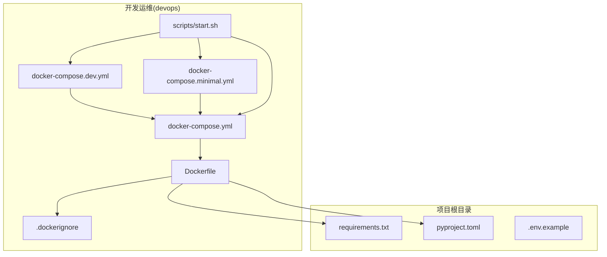
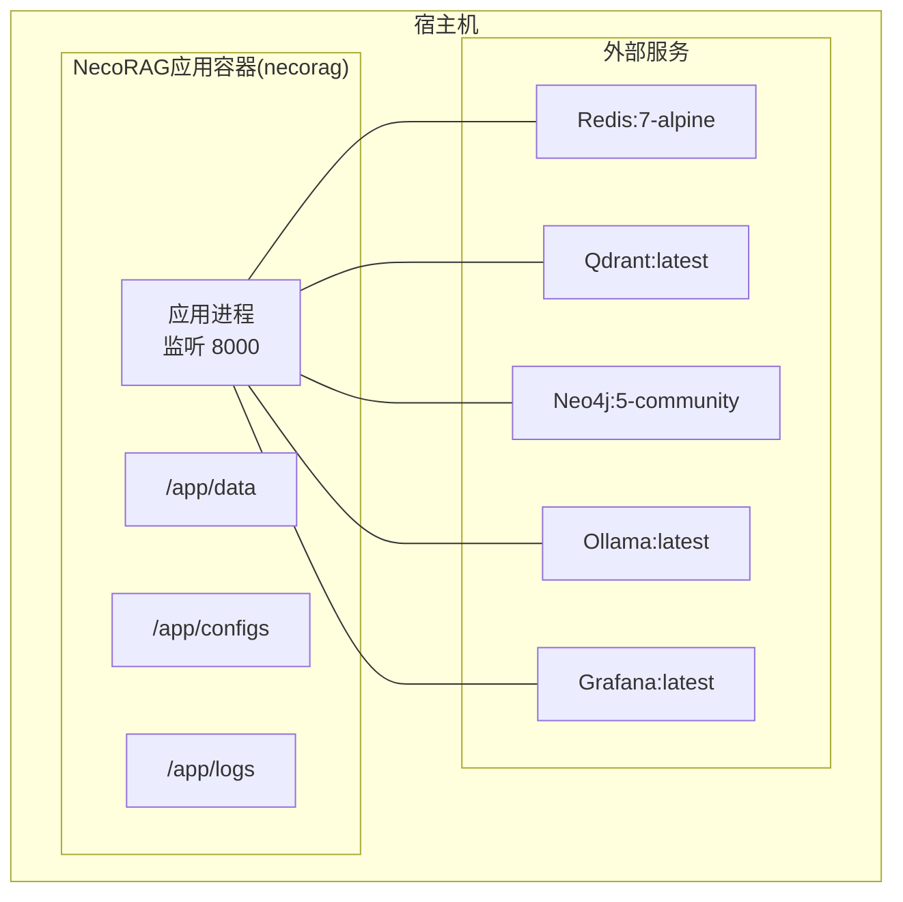
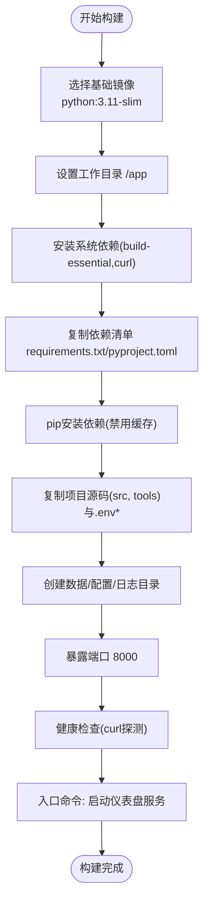
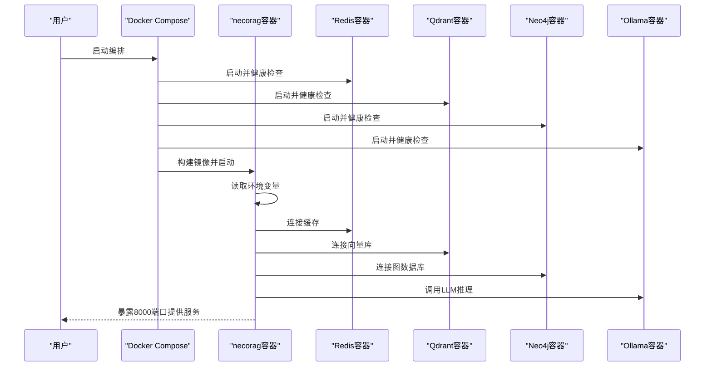
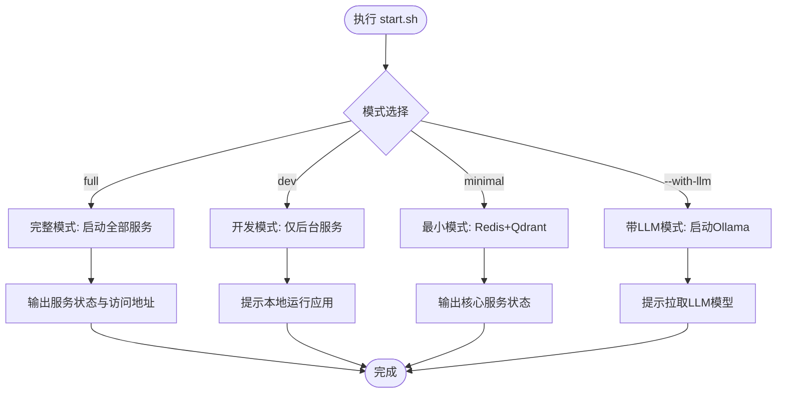
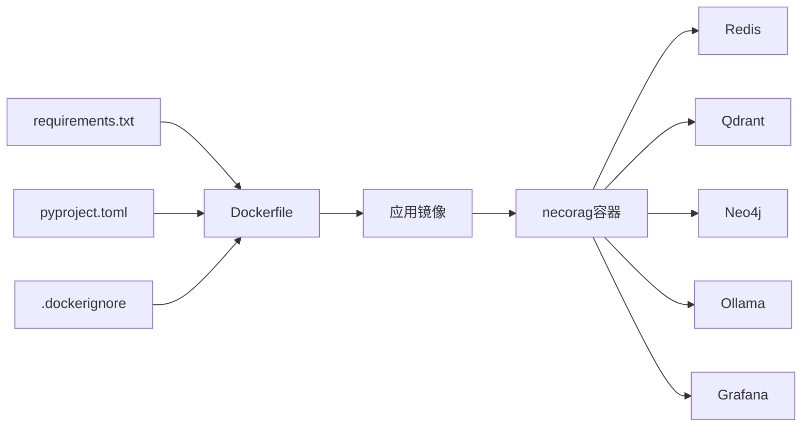

# Docker容器化

<cite>
**本文引用的文件**
- [Dockerfile](file://devops/Dockerfile)
- [.dockerignore](file://devops/.dockerignore)
- [docker-compose.yml](file://devops/docker-compose.yml)
- [docker-compose.dev.yml](file://devops/docker-compose.dev.yml)
- [docker-compose.minimal.yml](file://devops/docker-compose.minimal.yml)
- [start.sh](file://devops/scripts/start.sh)
- [requirements.txt](file://requirements.txt)
- [pyproject.toml](file://pyproject.toml)
- [.env.example](file://.env.example)
- [README.md](file://devops/README.md)
</cite>

## 目录
1. [简介](#简介)
2. [项目结构](#项目结构)
3. [核心组件](#核心组件)
4. [架构总览](#架构总览)
5. [组件详解](#组件详解)
6. [依赖关系分析](#依赖关系分析)
7. [性能考量](#性能考量)
8. [故障排查指南](#故障排查指南)
9. [结论](#结论)
10. [附录](#附录)

## 简介
本文件面向NecoRAG项目的Docker容器化实现，围绕devops目录中的Dockerfile、.dockerignore、docker-compose配置及配套脚本展开，系统阐述镜像构建流程、多阶段优化策略、层缓存与镜像瘦身、入口点与环境变量传递机制，并结合v3.3.0-alpha版本的依赖与配置说明容器化改进与性能优化要点。

## 项目结构
与容器化相关的核心文件集中在devops目录，配合根目录的依赖清单与示例环境变量文件，形成“构建—运行—运维”的闭环。

**图表来源**
- [Dockerfile](file://devops/Dockerfile)
- [.dockerignore](file://devops/.dockerignore)
- [docker-compose.yml](file://devops/docker-compose.yml)
- [docker-compose.dev.yml](file://devops/docker-compose.dev.yml)
- [docker-compose.minimal.yml](file://devops/docker-compose.minimal.yml)
- [start.sh](file://devops/scripts/start.sh)
- [requirements.txt](file://requirements.txt)
- [pyproject.toml](file://pyproject.toml)
- [.env.example](file://.env.example)

**章节来源**
- [Dockerfile](file://devops/Dockerfile)
- [.dockerignore](file://devops/.dockerignore)
- [docker-compose.yml](file://devops/docker-compose.yml)
- [docker-compose.dev.yml](file://devops/docker-compose.dev.yml)
- [docker-compose.minimal.yml](file://devops/docker-compose.minimal.yml)
- [start.sh](file://devops/scripts/start.sh)
- [requirements.txt](file://requirements.txt)
- [pyproject.toml](file://pyproject.toml)
- [.env.example](file://.env.example)

## 核心组件
- 基础镜像与标签：采用python:3.11-slim作为基础镜像，具备较小镜像体积与较新Python版本的优势，适合Web框架与科学计算类应用。
- 系统依赖安装：通过apt安装构建工具与curl等必要工具，随后清理包缓存，避免污染后续层。
- 依赖安装：先复制依赖清单，再执行pip安装，避免重复下载；使用禁用缓存选项以确保一致性。
- 项目文件复制：仅复制src、tools与.env*相关文件，减少无关文件进入镜像。
- 数据目录与端口：创建数据、配置、日志目录，暴露应用端口。
- 健康检查：基于应用内部健康端点进行探测。
- 入口命令：通过Python脚本启动仪表盘服务，绑定0.0.0.0与8000端口。

**章节来源**
- [Dockerfile](file://devops/Dockerfile)

## 架构总览
下图展示容器化部署的整体架构：应用容器与外部服务（Redis、Qdrant、Neo4j、Ollama、Grafana）通过Docker Compose编排，应用容器通过环境变量与网络与各服务互通。

**图表来源**
- [docker-compose.yml](file://devops/docker-compose.yml)

**章节来源**
- [docker-compose.yml](file://devops/docker-compose.yml)

## 组件详解

### Dockerfile构建流程与优化
- 基础镜像选择Python 3.11-slim的原因与优势
  - 版本优势：Python 3.11在性能与内存方面相较早期版本有显著提升，适合并发与科学计算场景。
  - 镜像体积：slim版本显著减小基础镜像体积，降低构建与拉取时间。
  - 生态兼容：主流依赖库对Python 3.11具备良好支持，降低兼容性风险。
- 多阶段构建策略说明
  - 当前Dockerfile为单阶段构建，但遵循了多阶段构建的常见原则：系统依赖安装、依赖安装、项目文件复制、入口点配置。
  - 若进一步优化，可在构建阶段使用更精简的基础镜像，安装依赖后将依赖打包至只读层，再复制运行时所需文件，形成“构建依赖”与“运行时依赖”的分离。
- 层缓存策略
  - 将变更频率低的步骤置于上层，如系统依赖安装与依赖安装，有利于复用缓存。
  - pip安装时禁用缓存，确保依赖一致性，避免缓存污染导致的不可重现构建。
- 依赖最小化与镜像瘦身
  - 仅安装构建必需的工具（build-essential、curl），并在安装后清理包缓存。
  - 通过.dockerignore排除不必要的文件与目录，减少上下文大小与构建时间。
- 入口点与环境变量
  - 入口命令通过Python脚本启动，绑定0.0.0.0与8000端口，便于容器网络访问。
  - 环境变量通过docker-compose注入，覆盖默认配置，满足不同部署场景。

**图表来源**
- [Dockerfile](file://devops/Dockerfile)

**章节来源**
- [Dockerfile](file://devops/Dockerfile)

### .dockerignore作用与排除规则
- 排除Python字节码与缓存：__pycache__、*.pyc、pytest与mypy缓存，避免污染镜像。
- 排除IDE与Git：.vscode、.idea、.swp、.git、.gitignore，减少无关文件。
- 排除文档与设计资源：*.md、docs/、design/、logo/，降低镜像体积。
- 排除Qoder与环境：.qoder/、.env、dist/、build/、*.egg-info，避免构建产物与私密信息进入镜像。
- 以上规则有助于：
  - 减少构建上下文大小，缩短构建时间。
  - 降低镜像体积，提高分发效率。
  - 提升构建安全性，避免敏感信息泄露。

**章节来源**
- [.dockerignore](file://devops/.dockerignore)

### docker-compose编排与环境变量传递
- 服务编排
  - necorag应用服务：基于Dockerfile构建，映射端口8000，挂载配置与数据卷，注入环境变量，等待后端服务健康后再启动。
  - 后端服务：Redis、Qdrant、Neo4j、Ollama、Grafana，分别配置端口、卷与健康检查。
- 环境变量传递
  - 应用侧：通过environment字段注入LLM提供商、数据库URL、调试开关等变量。
  - 服务侧：通过环境变量控制数据库认证、端口、内存与功能开关。
- 启动模式
  - 完整模式：启动全部服务。
  - 开发模式：通过profiles控制应用与LLM/Grafana按需启动。
  - 最小模式：仅启动Redis与Qdrant，适合资源受限或快速测试。

**图表来源**
- [docker-compose.yml](file://devops/docker-compose.yml)

**章节来源**
- [docker-compose.yml](file://devops/docker-compose.yml)
- [docker-compose.dev.yml](file://devops/docker-compose.dev.yml)
- [docker-compose.minimal.yml](file://devops/docker-compose.minimal.yml)

### 运维脚本与启动流程
- start.sh提供多种启动模式：
  - 完整模式：启动全部服务并打印访问地址。
  - 开发模式：仅启动后台服务，应用容器默认不启动，便于本地开发。
  - 最小模式：仅启动Redis与Qdrant。
  - 带LLM模式：按profile启动Ollama服务。
- 脚本还负责检查Docker可用性、复制.env示例、输出服务状态与日志查看方式。

**图表来源**
- [start.sh](file://devops/scripts/start.sh)

**章节来源**
- [start.sh](file://devops/scripts/start.sh)

### 依赖清单与版本信息
- requirements.txt
  - 列出核心依赖与可选模块，涵盖数值计算、Web框架、意图分析、监控、安全、可视化等模块。
  - 可选模块以注释形式存在，便于按需启用。
- pyproject.toml
  - 项目版本为3.3.0-alpha，明确Python版本要求与可选依赖分组（如intent、dashboard、monitoring、security等）。
  - 与requirements.txt共同指导容器内依赖安装顺序与范围。

**章节来源**
- [requirements.txt](file://requirements.txt)
- [pyproject.toml](file://pyproject.toml)

### 环境变量与配置
- .env.example提供全面的配置项，包括Python环境、应用基础配置、数据库、LLM提供商、向量化模型、Dashboard、安全、智能路由、性能优化、监控日志、插件扩展、Docker部署、功能开关、开发测试、区域化等。
- 在容器环境中，这些变量通过docker-compose的environment注入到应用容器，实现配置集中化与环境隔离。

**章节来源**
- [.env.example](file://.env.example)
- [docker-compose.yml](file://devops/docker-compose.yml)

## 依赖关系分析
- 构建期依赖：Dockerfile依赖requirements.txt与pyproject.toml，确保pip安装阶段的依赖完整性。
- 运行期依赖：应用通过环境变量与网络连接外部服务（Redis/Qdrant/Neo4j/Ollama/Grafana）。
- 维护期依赖：.dockerignore减少构建上下文与镜像体积，start.sh简化运维操作。

**图表来源**
- [Dockerfile](file://devops/Dockerfile)
- [.dockerignore](file://devops/.dockerignore)
- [requirements.txt](file://requirements.txt)
- [pyproject.toml](file://pyproject.toml)
- [docker-compose.yml](file://devops/docker-compose.yml)

**章节来源**
- [Dockerfile](file://devops/Dockerfile)
- [.dockerignore](file://devops/.dockerignore)
- [requirements.txt](file://requirements.txt)
- [pyproject.toml](file://pyproject.toml)
- [docker-compose.yml](file://devops/docker-compose.yml)

## 性能考量
- 镜像体积与启动速度
  - 使用python:3.11-slim基础镜像与.dockerignore排除无关文件，有效控制镜像体积与构建时间。
  - 系统依赖安装后立即清理包缓存，避免层膨胀。
- 依赖安装一致性
  - pip安装时禁用缓存，确保依赖版本一致，减少因缓存导致的构建差异。
- 运行时性能
  - 通过环境变量控制缓存、批处理、异步等性能参数，结合外部服务（Qdrant/Redis/Neo4j）的调优，获得更佳响应与吞吐。
- 健康检查与可用性
  - 应用与外部服务均配置健康检查，确保容器编排的稳定性与可观测性。

[本节为通用性能建议，无需特定文件引用]

## 故障排查指南
- 容器无法启动
  - 检查应用健康端点是否可达，确认依赖安装与环境变量配置正确。
  - 参考运维脚本输出的日志查看方式，定位异常。
- 端口冲突
  - 修改docker-compose中端口映射或宿主机端口占用情况。
- 数据库连接失败
  - 检查容器网络、服务健康状态与连接字符串，确保服务名称与端口正确。
- 依赖安装失败
  - 确认requirements.txt与pyproject.toml版本范围与网络可达性，必要时调整pip源或离线依赖。

**章节来源**
- [README.md](file://devops/README.md)
- [docker-compose.yml](file://devops/docker-compose.yml)

## 结论
NecoRAG的Docker容器化方案以python:3.11-slim为基础，结合.dockerignore与依赖清单，实现了清晰的单阶段构建流程与可维护的运行时配置。通过docker-compose编排外部服务、环境变量注入与健康检查，形成完整的开发与生产部署能力。v3.3.0-alpha版本的依赖与配置为容器化提供了稳定的版本边界与功能开关，便于在不同环境下灵活启用与调优。

## 附录
- 构建命令与最佳实践
  - 构建镜像：使用Dockerfile在opdev目录执行构建，确保上下文包含依赖清单与项目源码。
  - 缓存利用：保持依赖清单稳定，避免频繁变更导致pip层缓存失效。
  - 上下文优化：确保.dockerignore排除不必要的文件，减少构建上下文大小。
- 入口点与端口
  - 入口命令绑定0.0.0.0与8000端口，便于容器网络访问与负载均衡。
- 环境变量
  - 通过docker-compose的environment字段集中注入，覆盖默认配置，满足不同部署场景。

**章节来源**
- [Dockerfile](file://devops/Dockerfile)
- [README.md](file://devops/README.md)
- [docker-compose.yml](file://devops/docker-compose.yml)