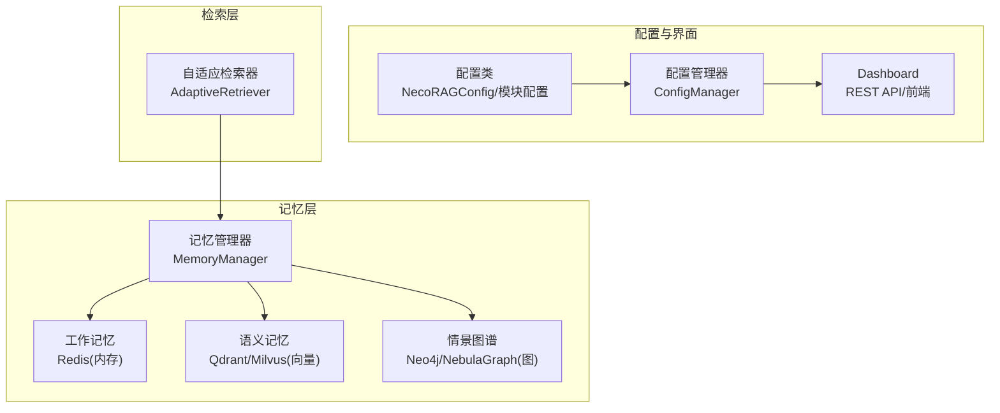
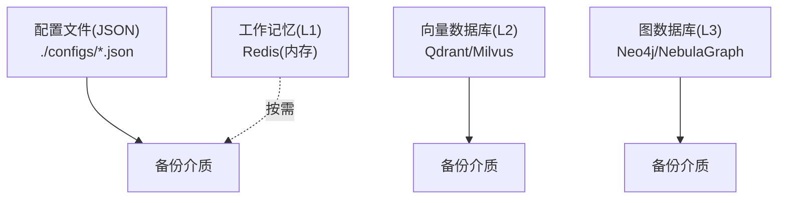
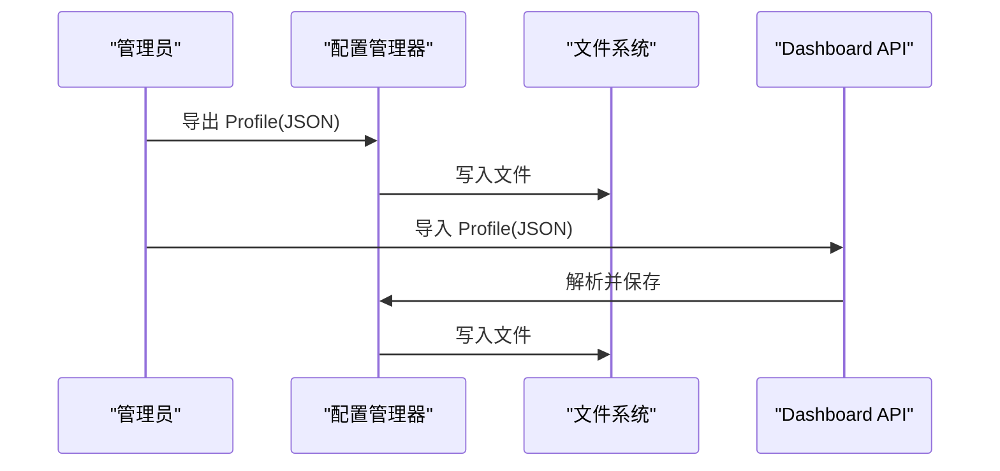
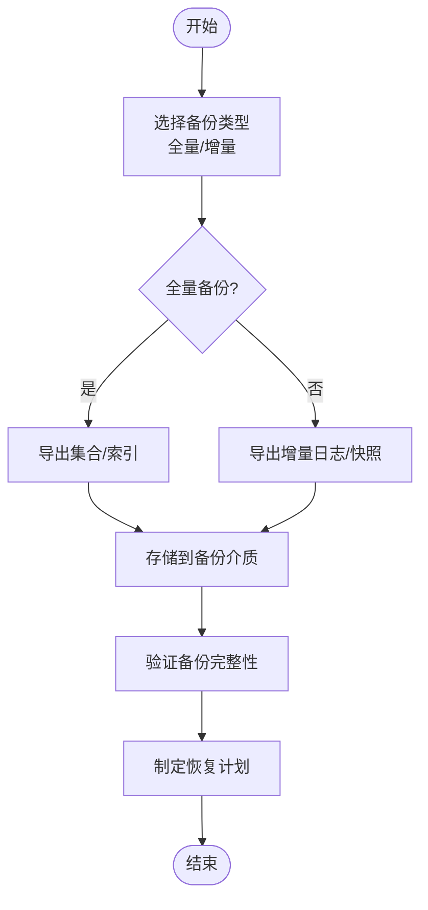
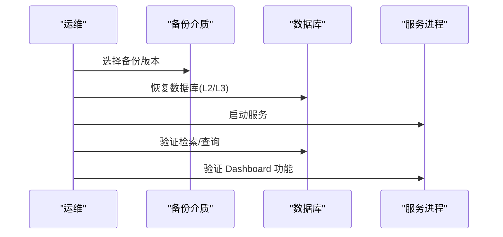
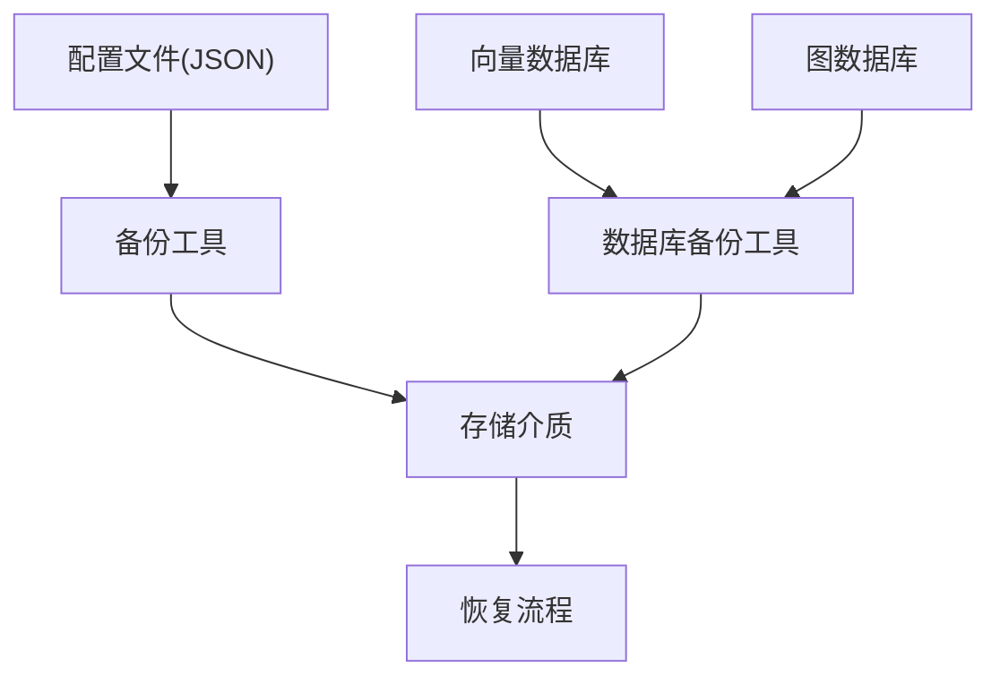

# 备份与恢复

<cite>
**本文引用的文件**
- [src/core/config.py](file://src/core/config.py)
- [src/dashboard/config_manager.py](file://src/dashboard/config_manager.py)
- [src/dashboard/models.py](file://src/dashboard/models.py)
- [src/memory/manager.py](file://src/memory/manager.py)
- [src/memory/models.py](file://src/memory/models.py)
- [src/memory/backends/memory_store.py](file://src/memory/backends/memory_store.py)
- [src/retrieval/retriever.py](file://src/retrieval/retriever.py)
- [src/perception/engine.py](file://src/perception/engine.py)
- [tools/start_dashboard.sh](file://tools/start_dashboard.sh)
- [tools/start_dashboard.bat](file://tools/start_dashboard.bat)
- [README.md](file://README.md)
- [QUICKSTART.md](file://QUICKSTART.md)
- [requirements.txt](file://requirements.txt)
</cite>

## 目录
1. [简介](#简介)
2. [项目结构](#项目结构)
3. [核心组件](#核心组件)
4. [架构总览](#架构总览)
5. [详细组件分析](#详细组件分析)
6. [依赖分析](#依赖分析)
7. [性能考虑](#性能考虑)
8. [故障排查指南](#故障排查指南)
9. [结论](#结论)
10. [附录](#附录)

## 简介
本文件面向 NecoRAG 框架的管理员与运维人员，提供一套完整的备份与恢复策略与操作指南。内容涵盖：
- 数据备份策略与执行计划：配置文件、索引数据、用户数据的备份范围与方法
- 增量备份与全量备份的选择标准与实施建议
- 自动化备份脚本与调度任务配置思路
- 备份数据的存储位置、压缩与加密要求
- 灾难恢复流程与数据恢复步骤
- 备份验证与恢复测试方法
- RPO/RTO 目标设定与监控建议
- 策略制定与维护指南

## 项目结构
NecoRAG 采用“五层认知”架构，结合配置管理与 Dashboard，形成可配置、可观测、可恢复的系统。与备份恢复直接相关的结构要点如下：
- 配置与 Profile：通过统一配置类与 Dashboard 的配置管理器持久化到 JSON 文件，便于导出/导入与版本化管理
- 记忆层：包含三层记忆（工作记忆、语义记忆、情景图谱），其中语义记忆与情景图谱为外部数据库（向量/图），需纳入备份范围
- 检索层：依赖记忆层检索结果，不直接持久化业务数据
- 响应层：面向用户输出，不涉及持久化数据
- Dashboard：提供 Profile 的导入/导出能力，便于整体备份与迁移

图表来源
- [src/core/config.py:232-284](file://src/core/config.py#L232-L284)
- [src/dashboard/config_manager.py:14-41](file://src/dashboard/config_manager.py#L14-L41)
- [src/memory/manager.py:16-47](file://src/memory/manager.py#L16-L47)
- [src/retrieval/retriever.py:122-164](file://src/retrieval/retriever.py#L122-L164)

章节来源
- [README.md:35-85](file://README.md#L35-L85)
- [QUICKSTART.md:113-141](file://QUICKSTART.md#L113-L141)

## 核心组件
- 配置与 Profile
  - 统一配置类提供 save/load 能力，便于将配置落盘；Dashboard 的配置管理器将 Profile 以 JSON 文件形式持久化，支持导入/导出
- 记忆层
  - MemoryManager 负责三层记忆的统一管理；其中 L2/L3 为外部数据库，需单独备份
- 检索层
  - AdaptiveRetriever 依赖 MemoryManager，不直接持久化业务数据
- Dashboard
  - 提供 Profile 的导入/导出 API 与文件操作，便于整体备份与迁移

章节来源
- [src/core/config.py:46-77](file://src/core/config.py#L46-L77)
- [src/dashboard/config_manager.py:25-41](file://src/dashboard/config_manager.py#L25-L41)
- [src/memory/manager.py:16-47](file://src/memory/manager.py#L16-L47)
- [src/retrieval/retriever.py:122-164](file://src/retrieval/retriever.py#L122-L164)

## 架构总览
备份与恢复关注的数据域与职责划分如下：
- 配置域：配置文件、Dashboard Profile 文件
- 索引域：向量数据库（L2）、图数据库（L3）
- 用户域：工作记忆（L1）通常为内存缓存，一般不参与长期备份；如需保留会话上下文，可结合业务需求评估

图表来源
- [src/dashboard/config_manager.py:286-315](file://src/dashboard/config_manager.py#L286-L315)
- [src/memory/backends/memory_store.py:20-141](file://src/memory/backends/memory_store.py#L20-L141)
- [src/memory/backends/memory_store.py:143-381](file://src/memory/backends/memory_store.py#L143-L381)

## 详细组件分析

### 配置与 Profile 的备份与恢复
- 备份范围
  - 配置文件：统一配置类保存到 JSON；Dashboard Profile 文件位于配置目录
  - 备份粒度：按 Profile 级别备份，便于按环境/场景隔离
- 备份方法
  - 文件系统层面：对配置目录进行全量/增量备份
  - API 导出：通过 Dashboard 导出单个 Profile 为 JSON，便于跨环境迁移
- 恢复方法
  - 文件系统恢复：将备份文件放回配置目录，重启服务后生效
  - API 导入：通过导入接口将备份的 Profile JSON 导入系统
- 自动化与调度
  - 建议使用系统级定时任务（如 cron 或计划任务）定期执行全量备份
  - 增量备份可基于文件变更监控（如 inotify 或文件时间戳）触发

图表来源
- [src/dashboard/config_manager.py:230-278](file://src/dashboard/config_manager.py#L230-L278)
- [src/dashboard/server.py:165-178](file://src/dashboard/server.py#L165-L178)

章节来源
- [src/core/config.py:66-77](file://src/core/config.py#L66-L77)
- [src/dashboard/config_manager.py:25-41](file://src/dashboard/config_manager.py#L25-L41)
- [src/dashboard/config_manager.py:230-278](file://src/dashboard/config_manager.py#L230-L278)
- [src/dashboard/models.py:164-219](file://src/dashboard/models.py#L164-L219)

### 记忆层索引数据的备份与恢复
- 备份范围
  - L2 语义记忆：向量数据库（Qdrant/Milvus）中的集合/索引
  - L3 情景图谱：图数据库（Neo4j/NebulaGraph）中的节点/关系
- 备份方法
  - 数据库原生命令/工具：使用官方备份命令导出数据与索引
  - 备份介质：本地磁盘、网络存储或云存储
- 恢复方法
  - 数据库原生恢复：通过导入工具将备份数据恢复到目标实例
  - 验证：恢复后进行检索/查询验证，确保数据完整性与可用性
- 增量与全量选择
  - 全量备份：周期性（如每日/每周）执行，确保可恢复到任意历史点
  - 增量备份：基于数据库日志或增量导出，缩短 RPO

图表来源
- [src/memory/backends/memory_store.py:20-141](file://src/memory/backends/memory_store.py#L20-L141)
- [src/memory/backends/memory_store.py:143-381](file://src/memory/backends/memory_store.py#L143-L381)

章节来源
- [src/memory/manager.py:16-47](file://src/memory/manager.py#L16-L47)
- [src/memory/models.py:19-31](file://src/memory/models.py#L19-L31)
- [requirements.txt:18-27](file://requirements.txt#L18-L27)

### 用户数据与会话上下文的备份与恢复
- 用户数据范围
  - L1 工作记忆：Redis 内存缓存，通常不参与长期备份
  - L2/L3：用户检索/问答产生的向量与图谱数据，属于业务数据范畴
- 备份策略
  - 若业务需要保留会话上下文，可将 L1 的关键会话键集合作为临时快照参与备份
  - 更常见做法是通过业务侧的会话管理与审计日志实现用户数据的可追溯性
- 恢复策略
  - L1：重启服务后重建会话上下文
  - L2/L3：通过数据库备份恢复

章节来源
- [src/memory/manager.py:48-113](file://src/memory/manager.py#L48-L113)
- [src/retrieval/retriever.py:177-254](file://src/retrieval/retriever.py#L177-L254)

### 增量备份与全量备份的选择标准
- 全量备份
  - 适用：首次备份、恢复点要求严格、数据量较小
  - 优点：恢复简单、一致性好
  - 缺点：耗时较长、占用空间大
- 增量备份
  - 适用：数据量大、恢复窗口短、变更频繁
  - 优点：节省时间与空间
  - 缺点：恢复链路较长、复杂度较高
- 选择建议
  - 建议采用“全量+增量”的组合策略：每周一次全量，每日/每小时一次增量，平衡 RPO 与恢复效率

章节来源
- [src/memory/backends/memory_store.py:20-141](file://src/memory/backends/memory_store.py#L20-L141)
- [src/memory/backends/memory_store.py:143-381](file://src/memory/backends/memory_store.py#L143-L381)

### 自动化备份脚本与调度任务配置
- 脚本建议
  - 配置文件备份：对配置目录执行 tar/zip 压缩并加密
  - 数据库备份：调用数据库原生备份命令，输出到指定目录
  - 增量触发：基于文件时间戳或数据库日志轮询
- 调度任务
  - Linux/Mac：使用 cron，建议每日 2:00 执行全量，每小时执行增量
  - Windows：使用计划任务，与上述策略一致
- Dashboard 启动脚本参考
  - 提供了跨平台启动脚本，可作为备份/恢复前后服务启停的参考

章节来源
- [tools/start_dashboard.sh:1-26](file://tools/start_dashboard.sh#L1-L26)
- [tools/start_dashboard.bat:1-30](file://tools/start_dashboard.bat#L1-L30)

### 备份数据的存储位置、压缩与加密要求
- 存储位置
  - 本地：/opt/necorag/backup（示例路径）
  - 远程：对象存储（S3/OSS）或网络共享
- 压缩
  - 建议使用 gzip/snappy 等高效压缩算法，降低存储成本
- 加密
  - 建议对备份文件进行端到端加密（如 AES-256），密钥由安全系统管理
- 校验
  - 生成校验和（如 SHA-256），用于恢复前验证

章节来源
- [src/dashboard/config_manager.py:230-278](file://src/dashboard/config_manager.py#L230-L278)

### 灾难恢复流程与数据恢复步骤
- 恢复准备
  - 确认备份介质可用、解密密钥就绪、网络与存储空间充足
- 恢复顺序
  1) 恢复配置文件与 Dashboard Profile
  2) 恢复数据库（L2/L3）
  3) 启动服务（参考 Dashboard 启动脚本）
  4) 运行健康检查与检索验证
- 回退策略
  - 采用多版本备份，若恢复失败可回退至上一个稳定版本

图表来源
- [tools/start_dashboard.sh:16-25](file://tools/start_dashboard.sh#L16-L25)
- [tools/start_dashboard.bat:18-27](file://tools/start_dashboard.bat#L18-L27)

### 备份验证与恢复测试
- 验证清单
  - 配置文件完整性：导入/导出一致性
  - 数据库一致性：随机抽样检索、统计条目数
  - 服务可用性：Dashboard 页面、API 可达性
- 测试频率
  - 每月至少一次端到端恢复演练
- 测试记录
  - 记录测试时间、版本、结果与改进建议

章节来源
- [src/dashboard/config_manager.py:230-278](file://src/dashboard/config_manager.py#L230-L278)
- [src/retrieval/retriever.py:177-254](file://src/retrieval/retriever.py#L177-L254)

### RPO 与 RTO 目标设定与监控
- RPO（恢复点目标）
  - 全量：1 天
  - 增量：1 小时
  - 数据库：根据业务容忍度设定（如 5 分钟）
- RTO（恢复时间目标）
  - 配置恢复：10 分钟
  - 数据库恢复：根据数据量与网络设定（如 1 小时）
- 监控建议
  - 备份任务执行状态与告警
  - 恢复演练结果与耗时统计
  - 数据库健康指标与延迟监控

章节来源
- [src/memory/backends/memory_store.py:20-141](file://src/memory/backends/memory_store.py#L20-L141)
- [src/memory/backends/memory_store.py:143-381](file://src/memory/backends/memory_store.py#L143-L381)

### 策略制定与维护指南
- 策略要素
  - 明确备份范围、频率、介质与保留周期
  - 制定灾难恢复流程与角色分工
  - 建立验证与演练机制
- 维护建议
  - 定期审查备份策略的有效性
  - 优化压缩与加密算法，平衡性能与安全
  - 培训团队掌握恢复流程与工具使用

## 依赖分析
- 备份与恢复的关键依赖
  - 配置文件与 Dashboard Profile：JSON 文件，易导出/导入
  - 数据库：向量数据库与图数据库，需使用官方备份工具
  - 服务启动：Dashboard 启动脚本，用于恢复后的服务启停

图表来源
- [src/dashboard/config_manager.py:230-278](file://src/dashboard/config_manager.py#L230-L278)
- [requirements.txt:18-27](file://requirements.txt#L18-L27)

章节来源
- [requirements.txt:1-66](file://requirements.txt#L1-L66)

## 性能考虑
- 备份性能
  - 全量备份在业务低峰期执行
  - 增量备份尽量使用数据库原生增量能力
- 恢复性能
  - 优先恢复配置与数据库，再启动服务
  - 通过健康检查与压测验证恢复效果

## 故障排查指南
- Dashboard 启动失败
  - 检查端口占用与依赖安装
  - 参考启动脚本进行定位
- 配置导入/导出异常
  - 检查 JSON 格式与权限
  - 确认配置目录存在且可写
- 数据库恢复异常
  - 校验备份文件完整性与版本兼容性
  - 按数据库官方文档执行恢复

章节来源
- [tools/start_dashboard.sh:10-14](file://tools/start_dashboard.sh#L10-L14)
- [tools/start_dashboard.bat:10-16](file://tools/start_dashboard.bat#L10-L16)
- [src/dashboard/config_manager.py:230-278](file://src/dashboard/config_manager.py#L230-L278)

## 结论
通过“配置文件 + 数据库”的双轨备份策略，并结合自动化脚本与定期演练，NecoRAG 可实现可控的 RPO/RTO 目标。建议以全量为基础、增量为补充，配合严格的验证与监控，确保在发生故障时能够快速、可靠地恢复系统。

## 附录
- Dashboard 启动与访问
  - 支持跨平台启动脚本，便于恢复后快速上线
- 依赖与组件
  - 向量数据库与图数据库为外部组件，需遵循其官方备份与恢复最佳实践

章节来源
- [README.md:138-157](file://README.md#L138-L157)
- [QUICKSTART.md:50-66](file://QUICKSTART.md#L50-L66)
- [requirements.txt:18-27](file://requirements.txt#L18-L27)