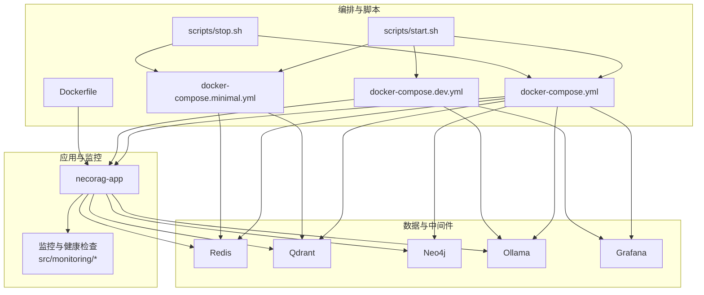
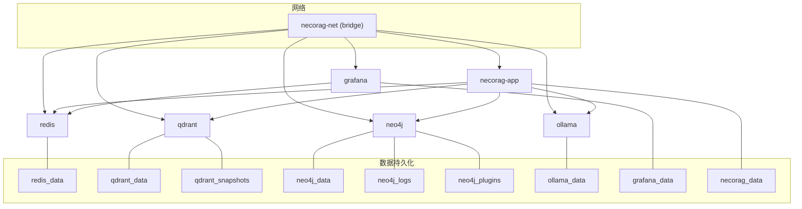
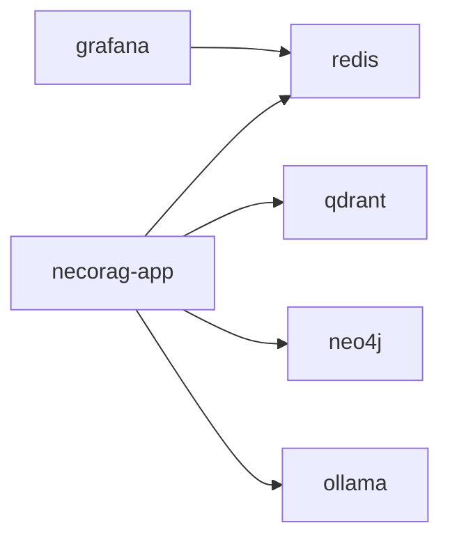

# 多服务编排

<cite>
**本文引用的文件**
- [docker-compose.yml](file://devops/docker-compose.yml)
- [docker-compose.dev.yml](file://devops/docker-compose.dev.yml)
- [docker-compose.minimal.yml](file://devops/docker-compose.minimal.yml)
- [Dockerfile](file://devops/Dockerfile)
- [README.md](file://devops/README.md)
- [start.sh](file://devops/scripts/start.sh)
- [stop.sh](file://devops/scripts/stop.sh)
- [config.py](file://src/monitoring/config.py)
- [health.py](file://src/monitoring/health.py)
- [metrics.py](file://src/monitoring/metrics.py)
- [requirements.txt](file://requirements.txt)
- [pyproject.toml](file://pyproject.toml)
</cite>

## 目录
1. [简介](#简介)
2. [项目结构](#项目结构)
3. [核心组件](#核心组件)
4. [架构总览](#架构总览)
5. [组件详解](#组件详解)
6. [依赖关系分析](#依赖关系分析)
7. [性能考量](#性能考量)
8. [故障排查指南](#故障排查指南)
9. [结论](#结论)
10. [附录](#附录)

## 简介
本文件面向 NecoRAG 多服务编排，系统性阐述生产环境 docker-compose.yml、开发环境 docker-compose.dev.yml、最小化配置 docker-compose.minimal.yml 的服务架构、网络与数据持久化策略，并结合监控与健康检查机制，提供不同环境的启动命令与配置组合方式。同时覆盖 v3.3.0-alpha 版本的编排优化与新服务集成要点。

## 项目结构
围绕 devops 目录的编排配置与运维脚本，形成“镜像构建—容器编排—运维脚本—监控配置”的完整闭环。核心文件如下：
- 生产环境编排：devops/docker-compose.yml
- 开发环境叠加：devops/docker-compose.dev.yml
- 最小化编排：devops/docker-compose.minimal.yml
- 应用镜像构建：devops/Dockerfile
- 运维脚本：devops/scripts/start.sh、devops/scripts/stop.sh
- 监控与健康检查：src/monitoring/config.py、src/monitoring/health.py、src/monitoring/metrics.py
- 依赖清单：requirements.txt、pyproject.toml

**图表来源**
- [docker-compose.yml:1-164](file://devops/docker-compose.yml#L1-L164)
- [docker-compose.dev.yml:1-16](file://devops/docker-compose.dev.yml#L1-L16)
- [docker-compose.minimal.yml:1-33](file://devops/docker-compose.minimal.yml#L1-L33)
- [Dockerfile:1-39](file://devops/Dockerfile#L1-L39)
- [start.sh:1-101](file://devops/scripts/start.sh#L1-L101)
- [stop.sh:1-36](file://devops/scripts/stop.sh#L1-L36)
- [health.py:1-300](file://src/monitoring/health.py#L1-L300)
- [metrics.py:1-207](file://src/monitoring/metrics.py#L1-L207)

**章节来源**
- [docker-compose.yml:1-164](file://devops/docker-compose.yml#L1-L164)
- [docker-compose.dev.yml:1-16](file://devops/docker-compose.dev.yml#L1-L16)
- [docker-compose.minimal.yml:1-33](file://devops/docker-compose.minimal.yml#L1-L33)
- [Dockerfile:1-39](file://devops/Dockerfile#L1-L39)
- [README.md:1-336](file://devops/README.md#L1-L336)
- [start.sh:1-101](file://devops/scripts/start.sh#L1-L101)
- [stop.sh:1-36](file://devops/scripts/stop.sh#L1-L36)

## 核心组件
- necorag-app 应用服务：基于 Python 3.11-slim，暴露 8000 端口，内置健康检查；通过环境变量对接向量库、图数据库、缓存与 LLM 提供商。
- Qdrant 向量数据库：提供向量检索与存储，持久化至独立卷，开放 HTTP/GRPC 端口。
- Neo4j 图数据库：社区版，持久化数据、日志与插件，开放浏览器与 Bolt 端口。
- Redis 缓存与工作记忆：持久化数据卷，提供键值缓存与会话存储。
- Ollama LLM 服务：可选按需启动，支持 GPU 资源预留（注释示例），作为本地推理引擎。
- Grafana 监控仪表盘：依赖 Redis，提供系统与应用指标可视化。
- Prometheus 指标收集：在 README 中明确列出，配合应用侧指标导出与 Grafana 预置仪表盘使用。

**章节来源**
- [docker-compose.yml:6-147](file://devops/docker-compose.yml#L6-L147)
- [Dockerfile:1-39](file://devops/Dockerfile#L1-L39)
- [README.md:170-194](file://devops/README.md#L170-L194)

## 架构总览
下图展示生产环境服务间依赖、网络隔离与数据持久化策略：

**图表来源**
- [docker-compose.yml:149-164](file://devops/docker-compose.yml#L149-L164)

**章节来源**
- [docker-compose.yml:1-164](file://devops/docker-compose.yml#L1-L164)

## 组件详解

### 生产环境编排（docker-compose.yml）
- 服务分层与职责
  - L1 工作记忆层：Redis，持久化卷，健康检查基于 CLI ping。
  - L2 语义记忆层：Qdrant，持久化存储与快照卷，健康检查基于 HTTP 探针。
  - L3 情景图谱层：Neo4j，持久化数据/日志/插件卷，健康检查基于 HTTP 探针，启用 APOC 插件。
  - LLM 推理引擎：Ollama，可选 GPU 资源预留示例，健康检查基于 API 探针。
  - 监控可视化：Grafana，依赖 Redis，持久化数据卷，管理员凭据可配置。
  - 应用服务：necorag-app，构建上下文指向项目根目录，映射配置与数据目录，环境变量配置各下游服务地址与提供商。
- 网络与依赖
  - 统一桥接网络 necorag-net，服务间通过服务名互联。
  - 应用服务对 Redis/Qdrant/Neo4j 的健康检查条件依赖，确保下游可用后再启动。
- 数据持久化
  - 各服务独立命名卷，避免数据与镜像耦合。
- 健康检查
  - Redis/Qdrant/Neo4j/Ollama 均配置健康检查探针，具备间隔、超时与重试参数。

**章节来源**
- [docker-compose.yml:4-164](file://devops/docker-compose.yml#L4-L164)

### 开发环境编排（docker-compose.dev.yml）
- 目标
  - 通过 profiles 控制服务启停，便于本地开发时按需启动后台服务与监控。
- 关键特性
  - 默认不启动 necorag 应用容器，鼓励开发者本地运行应用。
  - 可按需启动 LLM 与监控服务，减少资源占用。
- 启动命令
  - 使用复合编排文件启动：docker compose -f docker-compose.yml -f docker-compose.dev.yml up -d

**章节来源**
- [docker-compose.dev.yml:1-16](file://devops/docker-compose.dev.yml#L1-L16)
- [README.md:47-58](file://devops/README.md#L47-L58)

### 最小化配置（docker-compose.minimal.yml）
- 适用场景
  - 资源受限或快速验证，仅需核心存储能力。
- 包含服务
  - Redis 与 Qdrant，无图数据库与监控系统。
- 启动命令
  - docker compose -f docker-compose.minimal.yml up -d

**章节来源**
- [docker-compose.minimal.yml:1-33](file://devops/docker-compose.minimal.yml#L1-L33)
- [README.md:60-70](file://devops/README.md#L60-L70)

### 应用镜像与启动流程（Dockerfile 与运维脚本）
- 镜像构建
  - 基于 Python 3.11-slim，安装系统依赖，复制依赖与源码，创建数据/配置/日志目录，暴露 8000 端口，内置健康检查探针。
- 启动命令
  - CMD 指向工具脚本，监听 0.0.0.0:8000。
- 运维脚本
  - start.sh：支持完整/开发/最小/带 LLM 四种模式，自动检查 Docker、生成 .env、打印服务访问地址。
  - stop.sh：优雅停止，支持清理数据卷的危险操作确认。

**章节来源**
- [Dockerfile:1-39](file://devops/Dockerfile#L1-L39)
- [start.sh:1-101](file://devops/scripts/start.sh#L1-L101)
- [stop.sh:1-36](file://devops/scripts/stop.sh#L1-L36)

### 监控与健康检查（应用侧）
- 指标与告警配置
  - 支持指标采集开关、端口、路径、采集周期、健康检查周期与超时、告警评估周期与保留天数、通知渠道与阈值等。
- 健康检查器
  - 支持并发检查、历史记录、关键/非关键检查区分、整体状态聚合。
  - 预置检查项：数据库连接、Redis 连接、LLM 服务、磁盘空间。
- 指标导出
  - 系统指标与应用指标（RAG 响应时间、API 调用、缓存操作、模型推理时间）可导出 Prometheus 格式文本。

**章节来源**
- [config.py:1-90](file://src/monitoring/config.py#L1-L90)
- [health.py:1-300](file://src/monitoring/health.py#L1-L300)
- [metrics.py:1-207](file://src/monitoring/metrics.py#L1-L207)

## 依赖关系分析
- 服务内聚与耦合
  - necorag-app 对 Redis/Qdrant/Neo4j/Ollama 存在强耦合（通过环境变量与容器网络），Grafana 依赖 Redis 进行数据源配置。
- 外部依赖
  - Prometheus 指标客户端在依赖清单中声明，结合应用侧指标导出与 Grafana 预置仪表盘使用。
- 循环依赖
  - 未发现循环依赖，服务间通过网络与环境变量解耦。
- 外部集成点
  - LLM 提供商可通过环境变量切换，当前示例指向 Ollama。

**图表来源**
- [docker-compose.yml:119-147](file://devops/docker-compose.yml#L119-L147)

**章节来源**
- [docker-compose.yml:119-147](file://devops/docker-compose.yml#L119-L147)
- [requirements.txt:94-95](file://requirements.txt#L94-L95)
- [pyproject.toml:72-74](file://pyproject.toml#L72-L74)

## 性能考量
- 资源限制与伸缩
  - 可通过 deploy.resources 限制 CPU/内存，适用于生产集群部署。
- 缓存与检索优化
  - Redis 缓存热点数据，Qdrant 使用 HNSW 索引加速检索，Neo4j 合理设置内存参数。
- 数据库调优
  - Qdrant 分片与快照策略，Neo4j 堆内存与插件配置，Redis 持久化策略。
- 网络与 I/O
  - 使用独立命名卷与桥接网络，避免 I/O 竞争；监控磁盘使用率与网络吞吐。

[本节为通用指导，无需具体文件分析]

## 故障排查指南
- 容器无法启动
  - 检查日志：docker compose logs -f 服务名
  - 校验配置：docker compose config
- 端口冲突
  - 检查宿主机端口占用并调整环境变量中的端口映射。
- 数据库连接失败
  - 检查容器网络、服务名解析与健康状态。
- 健康检查失败
  - 查看各服务健康检查探针配置与日志，确认探针可达性与返回值。
- 清理数据卷
  - 使用 stop.sh 的清理选项进行危险操作前务必确认。

**章节来源**
- [README.md:239-281](file://devops/README.md#L239-L281)
- [stop.sh:21-35](file://devops/scripts/stop.sh#L21-L35)

## 结论
本编排方案以“生产环境全量服务 + 开发环境按需服务 + 最小化核心存储”三档配置覆盖不同场景，结合统一网络与持久化策略、健康检查与监控告警，形成可演进、可维护、可观测的多服务架构。v3.3.0-alpha 版本在依赖与监控侧进一步完善，建议在生产中启用 Prometheus 指标收集与 Grafana 可视化，并结合应用侧健康检查与指标导出，实现端到端可观测性。

[本节为总结，无需具体文件分析]

## 附录

### 启动命令与配置组合
- 生产环境（完整服务）
  - docker compose up -d
- 开发环境（叠加 dev 配置）
  - docker compose -f docker-compose.yml -f docker-compose.dev.yml up -d
- 最小化（仅核心存储）
  - docker compose -f docker-compose.minimal.yml up -d
- 运维脚本模式
  - ./devops/scripts/start.sh dev | minimal | full | --with-llm

**章节来源**
- [README.md:42-70](file://devops/README.md#L42-L70)
- [start.sh:48-95](file://devops/scripts/start.sh#L48-L95)

### 服务发现、负载均衡与健康检查机制
- 服务发现
  - 通过统一桥接网络与服务名进行内部 DNS 解析。
- 负载均衡
  - 当前编排为单实例，如需高可用可在集群编排中引入反向代理与副本集。
- 健康检查
  - 各服务均配置健康检查探针，应用服务对下游服务设置健康检查条件依赖。

**章节来源**
- [docker-compose.yml:16-164](file://devops/docker-compose.yml#L16-L164)