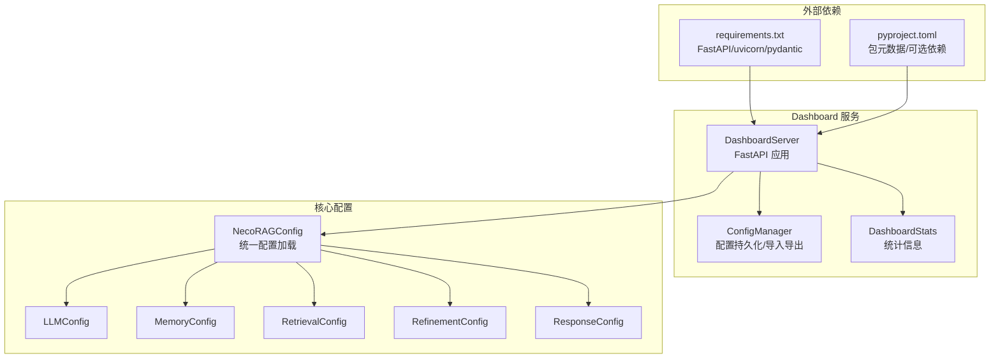
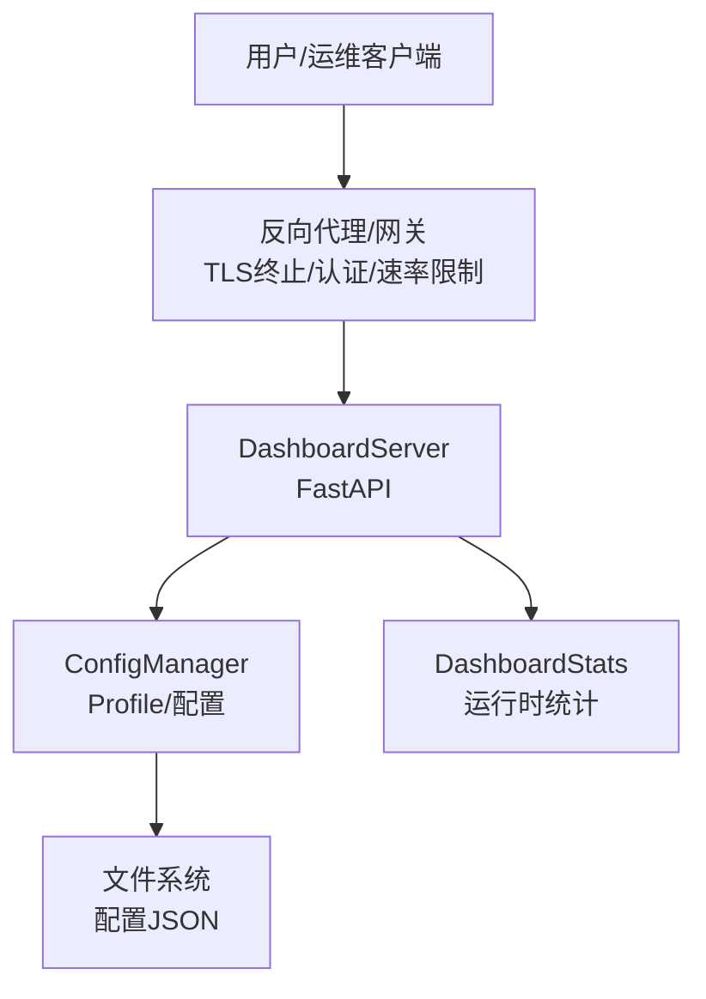
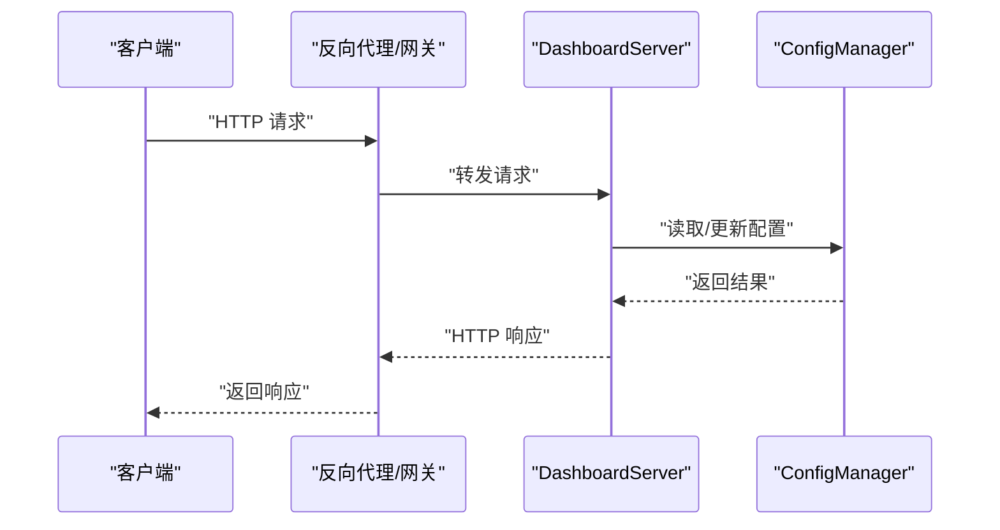
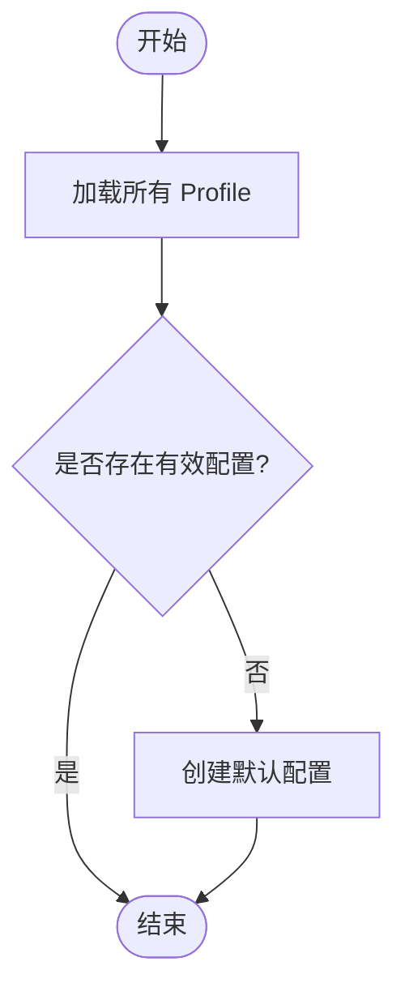
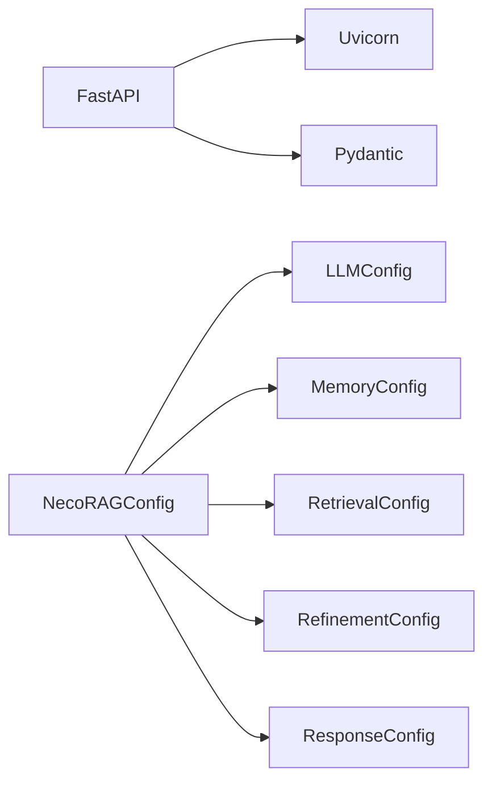

# 安全与访问控制

<cite>
**本文引用的文件**
- [README.md](file://README.md)
- [server.py](file://src/dashboard/server.py)
- [config_manager.py](file://src/dashboard/config_manager.py)
- [models.py](file://src/dashboard/models.py)
- [config.py](file://src/core/config.py)
- [requirements.txt](file://requirements.txt)
- [pyproject.toml](file://pyproject.toml)
- [start_dashboard.py](file://tools/start_dashboard.py)
- [start_dashboard.sh](file://tools/start_dashboard.sh)
- [GIT_CREDENTIALS_GUIDE.md](file://GIT_CREDENTIALS_GUIDE.md)
</cite>

## 目录
1. [引言](#引言)
2. [项目结构](#项目结构)
3. [核心组件](#核心组件)
4. [架构总览](#架构总览)
5. [详细组件分析](#详细组件分析)
6. [依赖分析](#依赖分析)
7. [性能考虑](#性能考虑)
8. [故障排查指南](#故障排查指南)
9. [结论](#结论)
10. [附录](#附录)

## 引言
本文件面向NecoRAG框架的安全与访问控制，聚焦于系统安全架构、威胁防护、身份认证与授权、会话管理、网络安全配置（防火墙、SSL/TLS、端口）、数据保护与隐私合规、安全审计与入侵检测、常见漏洞防护与应急响应，以及管理员最佳实践与检查清单。由于当前代码库未内置内置的身份认证、授权与会话管理机制，本文在“现状”基础上提供可落地的加固方案与实施建议。

## 项目结构
NecoRAG采用模块化分层架构，Dashboard作为Web配置与监控入口，提供REST API与静态UI；核心配置通过统一配置模块加载与覆盖；底层依赖通过requirements与pyproject声明。Dashboard服务器基于FastAPI，具备CORS中间件与静态资源挂载能力。

**图表来源**
- [server.py:43-93](file://src/dashboard/server.py#L43-L93)
- [config_manager.py:14-41](file://src/dashboard/config_manager.py#L14-L41)
- [config.py:232-284](file://src/core/config.py#L232-L284)
- [requirements.txt:7-11](file://requirements.txt#L7-L11)
- [pyproject.toml:27-30](file://pyproject.toml#L27-L30)

**章节来源**
- [README.md:154-157](file://README.md#L154-L157)
- [server.py:43-93](file://src/dashboard/server.py#L43-L93)
- [config.py:232-284](file://src/core/config.py#L232-L284)
- [requirements.txt:7-11](file://requirements.txt#L7-L11)
- [pyproject.toml:27-30](file://pyproject.toml#L27-L30)

## 核心组件
- DashboardServer：提供REST API、CORS、静态资源与统计信息接口，负责配置管理与监控。
- ConfigManager：Profile的创建、读取、更新、删除、复制、导入导出与活动Profile切换。
- NecoRAGConfig：统一配置加载，支持从文件与环境变量覆盖，含各层配置对象。
- 依赖声明：FastAPI、Uvicorn、Pydantic等用于Web服务与数据校验。

**章节来源**
- [server.py:43-93](file://src/dashboard/server.py#L43-L93)
- [config_manager.py:14-41](file://src/dashboard/config_manager.py#L14-L41)
- [config.py:232-284](file://src/core/config.py#L232-L284)
- [requirements.txt:7-11](file://requirements.txt#L7-L11)
- [pyproject.toml:27-30](file://pyproject.toml#L27-L30)

## 架构总览
DashboardServer作为对外暴露的唯一HTTP入口，承载配置管理与监控职责。当前未内置认证与授权，建议在网关或反向代理层进行统一鉴权与会话管理，并在Dashboard内部增加基础访问控制与审计。

**图表来源**
- [server.py:72-93](file://src/dashboard/server.py#L72-L93)
- [config_manager.py:25-41](file://src/dashboard/config_manager.py#L25-L41)
- [models.py:221-231](file://src/dashboard/models.py#L221-L231)

## 详细组件分析

### DashboardServer 安全分析
- CORS配置：允许任意源、方法与头，存在跨域风险，建议限定可信源。
- 路由安全：未内置认证/授权中间件，所有API均可直接访问。
- 静态资源：挂载静态目录，需确保仅包含前端产物且无敏感文件。
- 日志与可观测性：使用uvicorn日志级别，建议结合外部日志系统与审计。

**图表来源**
- [server.py:94-178](file://src/dashboard/server.py#L94-L178)
- [config_manager.py:76-166](file://src/dashboard/config_manager.py#L76-L166)

**章节来源**
- [server.py:79-86](file://src/dashboard/server.py#L79-L86)
- [server.py:94-178](file://src/dashboard/server.py#L94-L178)

### ConfigManager 安全分析
- 文件存储：以JSON形式保存Profile，未加密，需确保文件系统权限严格控制。
- 导入/导出：未对导入内容进行白名单校验，存在注入风险。
- 活动Profile切换：未记录变更审计，建议增加审计字段与事件记录。

**图表来源**
- [config_manager.py:290-315](file://src/dashboard/config_manager.py#L290-L315)

**章节来源**
- [config_manager.py:25-41](file://src/dashboard/config_manager.py#L25-L41)
- [config_manager.py:230-278](file://src/dashboard/config_manager.py#L230-L278)
- [config_manager.py:290-315](file://src/dashboard/config_manager.py#L290-L315)

### NecoRAGConfig 安全分析
- 环境变量覆盖：支持从环境变量覆盖关键配置（如LLM Provider/API Key），建议仅在受控环境中使用，并避免在日志中打印敏感值。
- 枚举类型：对Provider等使用枚举，降低非法输入风险。
- 配置持久化：提供save/load方法，建议配合文件权限与备份加密。

**章节来源**
- [config.py:288-327](file://src/core/config.py#L288-L327)
- [config.py:340-370](file://src/core/config.py#L340-L370)

### 启动与部署安全
- 启动脚本：支持host/port/config-dir参数，建议固定host为内网或通过反向代理暴露。
- Shell脚本：Linux/Mac启动脚本，注意执行权限与路径解析。

**章节来源**
- [start_dashboard.py:16-51](file://tools/start_dashboard.py#L16-L51)
- [start_dashboard.sh:1-26](file://tools/start_dashboard.sh#L1-L26)

## 依赖分析
- Web框架：FastAPI + Uvicorn，具备高性能与类型校验能力，但需配合网关进行安全加固。
- 数据校验：Pydantic模型用于请求/响应校验，建议扩展为统一的认证/授权中间件。
- 可选依赖：按需启用数据库与LLM集成，减少攻击面。

**图表来源**
- [requirements.txt:7-11](file://requirements.txt#L7-L11)
- [config.py:232-284](file://src/core/config.py#L232-L284)

**章节来源**
- [requirements.txt:7-11](file://requirements.txt#L7-L11)
- [pyproject.toml:27-30](file://pyproject.toml#L27-L30)
- [config.py:232-284](file://src/core/config.py#L232-L284)

## 性能考虑
- CORS通配：在生产环境建议缩小允许源范围，减少预检请求开销。
- 静态资源：确保缓存与压缩策略，降低带宽占用。
- 日志级别：生产环境建议调整为info或更高，避免过多debug日志。

[本节为通用指导，无需特定文件引用]

## 故障排查指南
- Dashboard无法访问：检查host/port与防火墙规则；确认反向代理正常转发。
- CORS错误：核对反向代理的CORS配置，确保Origin、方法与头一致。
- 配置导入失败：检查导入文件格式与权限；查看异常输出定位问题。
- 环境变量未生效：确认环境变量命名与前缀；避免在日志中泄露敏感值。

**章节来源**
- [server.py:79-86](file://src/dashboard/server.py#L79-L86)
- [config_manager.py:253-277](file://src/dashboard/config_manager.py#L253-L277)
- [config.py:310-327](file://src/core/config.py#L310-L327)

## 结论
NecoRAG当前未内置身份认证、授权与会话管理，Dashboard以CORS通配与开放API暴露运行。建议在网关/反向代理层实施统一认证与授权、TLS终止、速率限制与审计；在Dashboard内部补充基础访问控制与审计记录；对配置文件与导入导出流程加强安全校验与权限控制。通过以上措施，可在不改变核心业务的前提下显著提升整体安全性。

[本节为总结性内容，无需特定文件引用]

## 附录

### 网络安全配置指南
- 防火墙设置
  - 仅开放Dashboard所需端口（如8000），关闭其他端口。
  - 限制Dashboard来源IP，仅允许运维与管理网段。
- SSL/TLS加密
  - 在反向代理层启用TLS终止，使用强密码套件与最新协议版本。
  - 强制HTTPS重定向，禁用弱加密算法。
- 端口管理
  - 固定监听地址为内网或通过反向代理暴露。
  - 使用非特权端口运行（如1024+），避免root权限。

**章节来源**
- [server.py:54-69](file://src/dashboard/server.py#L54-L69)
- [start_dashboard.py:20-41](file://tools/start_dashboard.py#L20-L41)

### 身份认证与授权机制（建议）
- 认证
  - 在反向代理层集成OAuth2/SAML或企业身份提供商，统一登录。
  - Dashboard内部可增加Basic Auth作为临时保护（仅限内网）。
- 授权
  - 基于角色的访问控制（RBAC），区分只读与管理权限。
  - 对敏感操作（删除Profile、导出配置）增加二次确认与审计。
- 会话管理
  - 使用安全的HttpOnly SameSite Cookie，设置合理超时与滑动过期。
  - 登出后清理会话与令牌，支持强制踢出会话。

[本节为概念性建议，无需特定文件引用]

### 数据保护与隐私合规
- 数据最小化：仅存储必要的配置与统计信息。
- 加密存储：配置文件与日志建议加密存储，备份同样加密。
- 访问审计：记录所有配置变更与敏感操作，保留至少90天。
- 隐私影响评估：若涉及个人数据，遵循最小必要原则与用户同意。

[本节为通用指导，无需特定文件引用]

### 安全审计与入侵检测
- 审计
  - 记录API调用、配置变更、Profile激活与导出等事件。
  - 审计日志独立存储与轮转，防止篡改。
- 入侵检测
  - 结合WAF与IDS，监控异常请求模式（暴力破解、SQL注入、XSS等）。
  - 配置告警阈值（失败登录次数、异常响应时间）。

[本节为通用指导，无需特定文件引用]

### 常见安全漏洞防护与应急响应
- 漏洞防护
  - 输入校验与输出编码，防止注入与XSS。
  - 限制文件上传与导入类型，增加沙箱校验。
  - 定期更新依赖，关注CVE公告。
- 应急响应
  - 发生泄露：立即吊销令牌、封禁IP、回滚配置。
  - 服务中断：启用备用节点与降级策略，恢复后复盘。

[本节为通用指导，无需特定文件引用]

### 管理员最佳实践与检查清单
- 部署前
  - 使用反向代理统一接入，启用TLS与CORS白名单。
  - 限制Dashboard访问源，仅允许运维网段。
  - 配置环境变量与密钥管理，避免明文存储。
- 运行中
  - 定期巡检：端口开放、日志异常、配置变更。
  - 审计：检查登录与敏感操作记录。
  - 备份：配置与日志定期加密备份。
- 事件处理
  - 建立应急响应流程，明确责任人与升级路径。
  - 事件复盘：完善策略与培训。

**章节来源**
- [server.py:79-86](file://src/dashboard/server.py#L79-L86)
- [config_manager.py:230-278](file://src/dashboard/config_manager.py#L230-L278)
- [GIT_CREDENTIALS_GUIDE.md:81-89](file://GIT_CREDENTIALS_GUIDE.md#L81-L89)