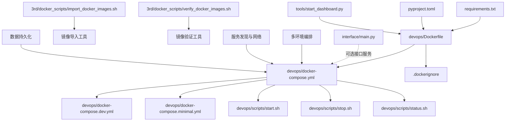
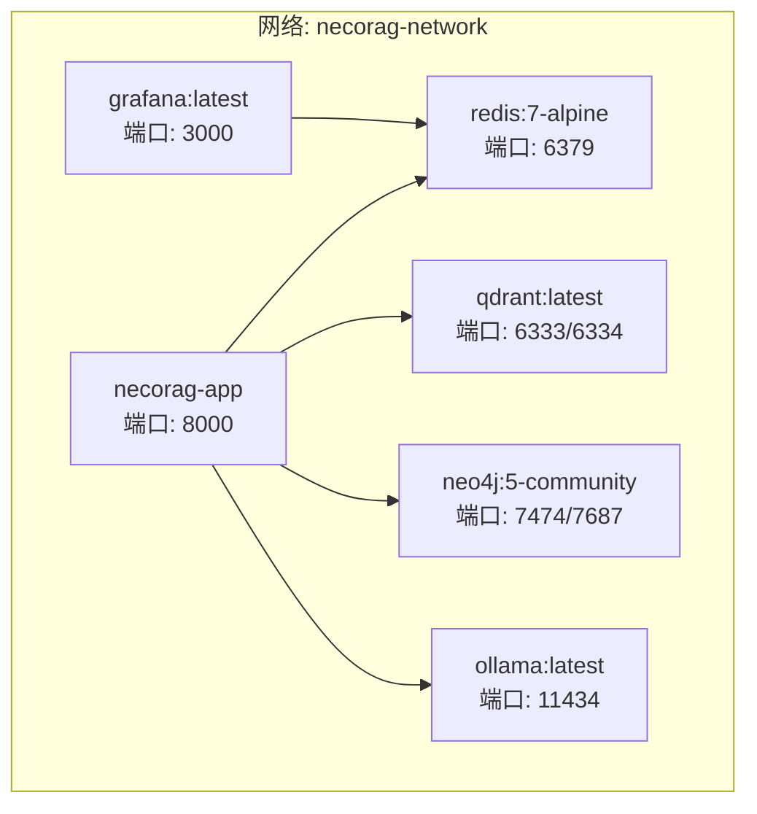
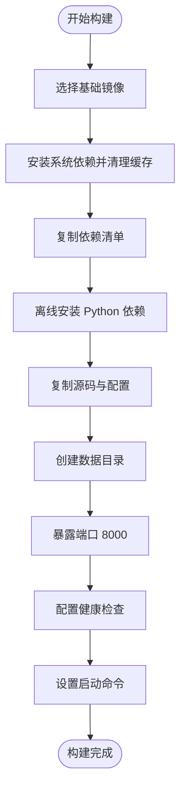
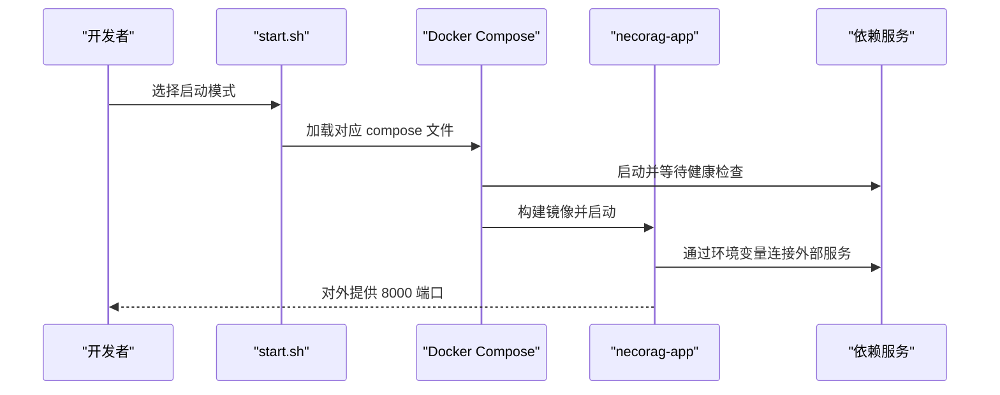
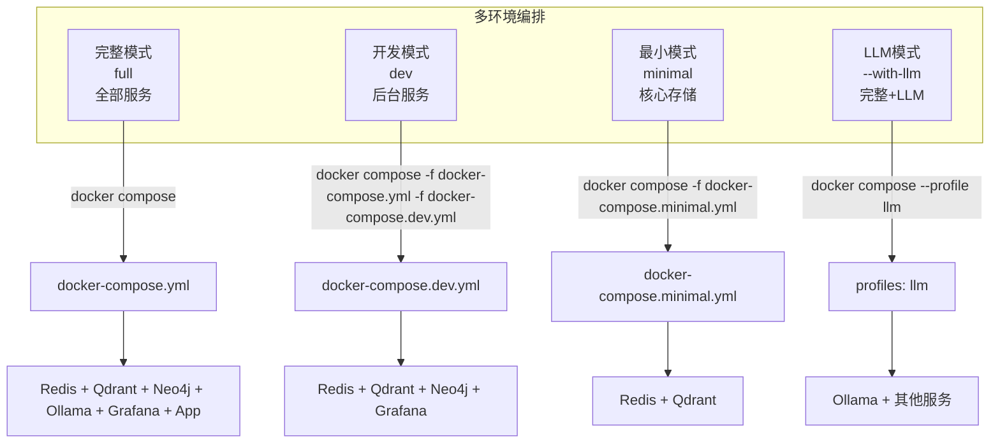
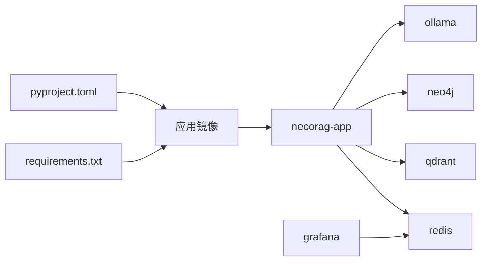

# 容器化部署

<cite>
**本文引用的文件**
- [DEPLOYMENT_GUIDE.md](file://3rd/DEPLOYMENT_GUIDE.md)
- [Dockerfile](file://devops/Dockerfile)
- [.dockerignore](file://devops/.dockerignore)
- [docker-compose.yml](file://devops/docker-compose.yml)
- [docker-compose.dev.yml](file://devops/docker-compose.dev.yml)
- [docker-compose.minimal.yml](file://devops/docker-compose.minimal.yml)
- [start.sh](file://devops/scripts/start.sh)
- [status.sh](file://devops/scripts/status.sh)
- [stop.sh](file://devops/scripts/stop.sh)
- [import_docker_images.sh](file://3rd/docker_scripts/import_docker_images.sh)
- [verify_docker_images.sh](file://3rd/docker_scripts/verify_docker_images.sh)
- [requirements.txt](file://requirements.txt)
- [pyproject.toml](file://pyproject.toml)
- [start_dashboard.py](file://tools/start_dashboard.py)
- [main.py](file://interface/main.py)
</cite>

## 更新摘要
**所做更改**
- 文档结构已简化，相关内容已整合到新的 DEPLOYMENT_GUIDE.md 中
- docker_scripts/ 目录提供自动化镜像导入和验证脚本支持
- 多环境服务编排配置已标准化，包括开发、生产、最小化环境的完整支持
- 健康检查机制和服务依赖管理得到增强
- 数据卷管理和网络配置更加规范化

## 目录
1. [引言](#引言)
2. [项目结构](#项目结构)
3. [核心组件](#核心组件)
4. [架构总览](#架构总览)
5. [详细组件分析](#详细组件分析)
6. [多环境编排配置](#多环境编排配置)
7. [依赖关系分析](#依赖关系分析)
8. [性能考量](#性能考量)
9. [故障排除指南](#故障排除指南)
10. [结论](#结论)
11. [附录](#附录)

## 引言
本文档面向容器化部署场景，围绕 NecoRAG 的 Docker 构建与多环境编排进行系统化说明。内容涵盖基础镜像选择、系统依赖安装、Python 环境配置、多阶段构建优化建议、镜像构建流程与层缓存策略、镜像体积优化技巧、健康检查机制、端口暴露与环境变量传递、容器运行时资源限制与网络配置、数据卷挂载方案，并提供完整的构建与运维命令、最佳实践与故障排除指南。

**更新** 本次更新反映了应用容器化部署的重大增强，包括完整的 docker-compose 配置、多环境编排支持以及完整的基础设施集成。文档结构已简化，相关内容已整合到新的 DEPLOYMENT_GUIDE.md 中，docker_scripts/ 目录提供自动化脚本支持。

## 项目结构
与容器化部署直接相关的核心文件位于 devops 目录，包含：
- Dockerfile：定义应用镜像构建步骤
- docker-compose.*.yml：多场景编排（完整、开发、最小）
- scripts/*：启动、停止、状态检查等辅助脚本
- .dockerignore：构建上下文排除规则
- requirements.txt / pyproject.toml：Python 依赖清单与打包元信息
- 3rd/docker_scripts/*：自动化镜像导入和验证脚本

**图表来源**
- [Dockerfile](file://devops/Dockerfile)
- [.dockerignore](file://devops/.dockerignore)
- [docker-compose.yml](file://devops/docker-compose.yml)
- [docker-compose.dev.yml](file://devops/docker-compose.dev.yml)
- [docker-compose.minimal.yml](file://devops/docker-compose.minimal.yml)
- [start.sh](file://devops/scripts/start.sh)
- [stop.sh](file://devops/scripts/stop.sh)
- [status.sh](file://devops/scripts/status.sh)
- [import_docker_images.sh](file://3rd/docker_scripts/import_docker_images.sh)
- [verify_docker_images.sh](file://3rd/docker_scripts/verify_docker_images.sh)
- [requirements.txt](file://requirements.txt)
- [pyproject.toml](file://pyproject.toml)
- [start_dashboard.py](file://tools/start_dashboard.py)
- [main.py](file://interface/main.py)

**章节来源**
- [Dockerfile](file://devops/Dockerfile)
- [docker-compose.yml](file://devops/docker-compose.yml)
- [docker-compose.dev.yml](file://devops/docker-compose.dev.yml)
- [docker-compose.minimal.yml](file://devops/docker-compose.minimal.yml)
- [.dockerignore](file://devops/.dockerignore)
- [requirements.txt](file://requirements.txt)
- [pyproject.toml](file://pyproject.toml)
- [start_dashboard.py](file://tools/start_dashboard.py)
- [main.py](file://interface/main.py)

## 核心组件
- 应用镜像构建（Dockerfile）
  - 基础镜像：使用官方 Python slim 版本，便于控制体积与安全基线
  - 工作目录：设置为 /app，便于隔离与权限控制
  - 系统依赖：apt 安装构建工具与 curl，随后清理包缓存减少镜像体积
  - 依赖安装：复制依赖清单后执行离线安装，避免重复下载
  - 源码与配置：复制 src、tools、.env* 等必要文件
  - 数据目录：预创建 data/configs/logs 目录，便于后续挂载
  - 端口与健康检查：暴露 8000，通过 HTTP 接口进行健康检查
  - 入口命令：通过 Python 启动 Dashboard 服务，绑定 0.0.0.0 与 8000 端口
- Compose 编排
  - 多服务：Redis、Qdrant、Neo4j、Ollama、Grafana、NecoRAG 应用
  - 网络：自定义桥接网络，服务间通过容器名互通
  - 数据卷：持久化各组件数据与配置
  - 环境变量：集中注入应用所需的外部服务连接参数
  - 健康检查：各依赖服务均配置健康检查，确保应用启动顺序与稳定性
- 多环境配置
  - 完整模式：包含所有服务的全功能部署
  - 开发模式：仅启动后台服务，应用容器按需启动
  - 最小模式：仅核心存储服务（Redis + Qdrant）
  - LLM模式：包含完整服务但按需启动LLM推理引擎
- 自动化脚本
  - import_docker_images.sh：智能镜像导入工具，支持网络检测和镜像源选择
  - verify_docker_images.sh：镜像验证工具，检查必需镜像的完整性
  - start.sh/status.sh/stop.sh：标准运维脚本，支持多种部署模式

**更新** 新增多环境编排配置，支持不同部署场景的需求，提供灵活的服务启动策略。docker_scripts/ 目录提供自动化镜像管理工具，简化部署流程。

**章节来源**
- [Dockerfile](file://devops/Dockerfile)
- [docker-compose.yml](file://devops/docker-compose.yml)
- [docker-compose.dev.yml](file://devops/docker-compose.dev.yml)
- [docker-compose.minimal.yml](file://devops/docker-compose.minimal.yml)
- [start.sh](file://devops/scripts/start.sh)
- [status.sh](file://devops/scripts/status.sh)
- [stop.sh](file://devops/scripts/stop.sh)
- [import_docker_images.sh](file://3rd/docker_scripts/import_docker_images.sh)
- [verify_docker_images.sh](file://3rd/docker_scripts/verify_docker_images.sh)

## 架构总览
下图展示容器化部署的整体拓扑：应用容器与多个下游服务通过同一自定义网络互联；应用容器通过环境变量指向各外部服务；数据通过命名卷持久化。

**图表来源**
- [docker-compose.yml](file://devops/docker-compose.yml)

**章节来源**
- [docker-compose.yml](file://devops/docker-compose.yml)

## 详细组件分析

### Dockerfile 构建流程与优化
- 基础镜像选择
  - 使用 Python slim 版本，兼顾体积与可维护性
- 系统依赖安装
  - 一次性 apt 更新与安装，随后清理缓存，降低镜像体积
- Python 环境配置
  - 复制依赖清单后执行离线安装，避免重复下载与网络波动影响
  - 使用无缓存安装策略，进一步减少层体积
- 多阶段构建优化建议
  - 当前单阶段构建已具备良好体积控制；如需进一步优化，可在生产镜像中移除构建工具链与开发依赖
  - 使用更精简的基础镜像或 distroless 变体（需验证运行时依赖）
- 层缓存策略
  - 将变更频率低的步骤（如系统依赖、依赖安装）置于上层，变更频繁的步骤（如复制源码）置于下层
  - 利用 .dockerignore 排除无关文件，缩短构建上下文
- 镜像大小优化技巧
  - 清理包缓存与临时文件
  - 合理拆分依赖安装与源码复制，提升缓存命中率
  - 在最终镜像中仅保留运行所需文件，剔除测试与开发工具
- 健康检查机制
  - 通过 HTTP 接口检查 /api/stats，周期性探测应用可用性
- 端口暴露与入口命令
  - EXPOSE 8000，CMD 以 0.0.0.0:8000 启动 Dashboard 服务

**图表来源**
- [Dockerfile](file://devops/Dockerfile)

**章节来源**
- [Dockerfile](file://devops/Dockerfile)
- [.dockerignore](file://devops/.dockerignore)
- [requirements.txt](file://requirements.txt)
- [pyproject.toml](file://pyproject.toml)

### Compose 编排与服务治理
- 服务定义
  - Redis/Qdrant/Neo4j/Ollama/Grafana：分别映射端口、挂载数据卷、设置健康检查
  - Necorag 应用：构建上下文指向仓库根目录，Dockerfile 位于 opdev 目录
- 环境变量传递
  - 应用通过环境变量获取外部服务地址与凭据，如 LLM 提供商、向量库、图数据库、Redis 连接串等
- 依赖关系与启动顺序
  - 应用服务声明依赖其他服务健康就绪后再启动
- 网络与数据卷
  - 自定义桥接网络实现服务互通；命名卷持久化数据与配置
- 资源限制与 GPU 支持
  - 示例中包含 GPU 设备预留注释，可按需启用

**图表来源**
- [start.sh](file://devops/scripts/start.sh)
- [docker-compose.yml](file://devops/docker-compose.yml)
- [docker-compose.dev.yml](file://devops/docker-compose.dev.yml)
- [docker-compose.minimal.yml](file://devops/docker-compose.minimal.yml)

**章节来源**
- [docker-compose.yml](file://devops/docker-compose.yml)
- [docker-compose.dev.yml](file://devops/docker-compose.dev.yml)
- [docker-compose.minimal.yml](file://devops/docker-compose.minimal.yml)

### 健康检查与端口暴露
- 应用健康检查
  - 通过 HTTP 探测 /api/stats，周期 30s，超时 10s，重试 3 次
- 依赖服务健康检查
  - Redis/Qdrant/Neo4j/Ollama/Grafana 均配置健康检查，确保应用侧依赖可用
- 端口暴露
  - 应用容器暴露 8000；Compose 将其映射到宿主机端口（可通过环境变量覆盖）

**章节来源**
- [Dockerfile](file://devops/Dockerfile)
- [docker-compose.yml](file://devops/docker-compose.yml)

### 环境变量与配置管理
- 应用侧
  - 通过环境变量控制 LLM 提供商、外部服务地址、调试开关等
  - Dashboard 启动脚本支持通过参数指定 host/port/config-dir
- 依赖侧
  - 各服务通过环境变量配置端口、认证、内存参数等
- 配置文件挂载
  - 应用容器挂载 configs 目录，便于热更新与持久化

**章节来源**
- [docker-compose.yml](file://devops/docker-compose.yml)
- [start_dashboard.py](file://tools/start_dashboard.py)

### 数据卷与持久化
- 命名卷
  - Redis/Qdrant/Neo4j/Ollama/Grafana/NecoRAG 均使用命名卷保存数据与配置
- 挂载策略
  - 应用容器挂载 configs 与 data 目录；依赖容器挂载各自存储目录
- 清理策略
  - 停止脚本支持清理数据卷，注意数据不可恢复

**章节来源**
- [docker-compose.yml](file://devops/docker-compose.yml)
- [stop.sh](file://devops/scripts/stop.sh)

### 资源限制与网络配置
- 资源限制
  - 示例中包含 GPU 设备预留注释，可按需启用
- 网络
  - 使用自定义桥接网络，容器间通过服务名互通
- 端口映射
  - 通过环境变量覆盖默认端口，便于多实例部署

**章节来源**
- [docker-compose.yml](file://devops/docker-compose.yml)

## 多环境编排配置

### 完整模式编排
完整模式包含所有服务，提供全功能的 NecoRAG 部署环境：

- **服务组成**：Redis、Qdrant、Neo4j、Ollama、Grafana、NecoRAG 应用
- **端口映射**：应用容器映射到 8000 端口，其他服务使用环境变量配置的端口
- **数据持久化**：所有服务均配置命名卷进行数据持久化
- **健康检查**：每个服务都配置了相应的健康检查机制
- **依赖管理**：应用服务依赖其他服务健康就绪后启动

### 开发模式编排
开发模式专注于后台服务，应用容器按需启动：

- **服务选择**：仅启动 Redis、Qdrant、Neo4j、Grafana 等后台服务
- **应用容器**：通过 profiles 控制，默认不启动应用容器
- **LLM 按需**：Ollama 服务通过 profiles 控制，可按需启动
- **监控按需**：Grafana 服务通过 profiles 控制，可按需启动
- **本地开发**：开发者可以在本地运行应用，而不使用容器化的应用服务

### 最小模式编排
最小模式仅包含核心存储服务：

- **核心服务**：仅启动 Redis 和 Qdrant 两个核心存储服务
- **简化部署**：适合测试环境或资源受限的场景
- **端口简化**：仅映射必要的端口（6379、6333、6334）
- **数据卷简化**：仅创建必要的数据卷

### LLM 模式编排
LLM 模式提供完整的推理能力：

- **完整服务**：包含所有服务，但通过 profiles 控制 LLM 服务的启动
- **按需启动**：Ollama 服务默认不启动，需要时再启动
- **资源优化**：避免不必要的资源消耗
- **模型管理**：提供模型拉取脚本，方便管理 LLM 模型

**图表来源**
- [docker-compose.yml](file://devops/docker-compose.yml)
- [docker-compose.dev.yml](file://devops/docker-compose.dev.yml)
- [docker-compose.minimal.yml](file://devops/docker-compose.minimal.yml)

**章节来源**
- [docker-compose.yml](file://devops/docker-compose.yml)
- [docker-compose.dev.yml](file://devops/docker-compose.dev.yml)
- [docker-compose.minimal.yml](file://devops/docker-compose.minimal.yml)

## 依赖关系分析
- 构建期依赖
  - requirements.txt 与 pyproject.toml 提供 Python 依赖清单与打包元信息
- 运行期依赖
  - Redis/Qdrant/Neo4j/Ollama/Grafana 作为外部服务被应用容器依赖
- 服务间耦合
  - 应用通过环境变量连接外部服务，降低硬编码耦合
- 可观测性
  - Grafana 依赖 Redis 采集指标，形成监控闭环

**图表来源**
- [requirements.txt](file://requirements.txt)
- [pyproject.toml](file://pyproject.toml)
- [docker-compose.yml](file://devops/docker-compose.yml)

**章节来源**
- [requirements.txt](file://requirements.txt)
- [pyproject.toml](file://pyproject.toml)
- [docker-compose.yml](file://devops/docker-compose.yml)

## 性能考量
- 镜像体积
  - 通过 apt 清理缓存、pip 无缓存安装、合理拆分 COPY 步骤，有效控制体积
- 启动速度
  - 健康检查与依赖顺序保证应用启动时外部服务已就绪
- 资源占用
  - Neo4j/Redis/Qdrant 等服务通过独立容器与命名卷，便于资源隔离与弹性伸缩
- LLM 推理
  - Ollama 作为推理引擎，可按需启动与模型拉取，降低资源占用
- 多环境优化
  - 不同模式针对不同需求优化资源使用，最小模式仅启动必要服务

## 故障排除指南
- Docker 未安装或服务未运行
  - 使用启动脚本会自动检测 Docker 状态，若失败请先安装并启动 Docker Desktop
- 服务无法访问
  - 使用状态脚本检查各服务连通性，核对端口映射与防火墙
- 数据丢失风险
  - 停止并清理数据卷会删除持久化数据，操作前请备份
- LLM 模型缺失
  - 使用模型拉取脚本在 Ollama 容器内拉取所需模型
- 健康检查失败
  - 检查外部服务健康检查配置与日志，确保端口可达且服务正常
- 环境变量配置错误
  - 检查 .env 文件配置，确保所有必需的环境变量正确设置
- 网络连接问题
  - 确认自定义网络 necorag-network 是否正确创建，服务间是否能通过容器名互相访问
- 镜像导入失败
  - 使用 import_docker_images.sh 脚本自动检测网络并选择最优镜像源
- 镜像验证失败
  - 使用 verify_docker_images.sh 脚本检查必需镜像的完整性

**章节来源**
- [start.sh](file://devops/scripts/start.sh)
- [status.sh](file://devops/scripts/status.sh)
- [stop.sh](file://devops/scripts/stop.sh)
- [import_docker_images.sh](file://3rd/docker_scripts/import_docker_images.sh)
- [verify_docker_images.sh](file://3rd/docker_scripts/verify_docker_images.sh)

## 结论
本文基于现有 Dockerfile 与 Compose 配置，系统梳理了 NecoRAG 的容器化部署流程与最佳实践。通过合理的镜像构建策略、健康检查、网络与数据卷配置，以及配套的运维脚本，可实现稳定、可观测、易维护的容器化部署。

**更新** 本次更新显著增强了容器化部署的功能，新增了完整的多环境编排配置，包括开发、生产、最小化环境的支持，集成了完整的基础设施服务，提供了更加灵活和实用的部署方案。docker_scripts/ 目录的自动化脚本进一步简化了部署流程，建议在生产环境中结合多阶段构建与更严格的资源限制进一步优化镜像体积与运行时性能。

## 附录

### 完整构建与运行命令
- 启动完整模式（含 Grafana）
  - 使用启动脚本：./devops/scripts/start.sh full
- 启动开发模式（仅后台服务）
  - 使用启动脚本：./devops/scripts/start.sh dev
- 启动最小模式（仅 Redis + Qdrant）
  - 使用启动脚本：./devops/scripts/start.sh minimal
- 启动完整模式并启用 LLM
  - 使用启动脚本：./devops/scripts/start.sh --with-llm
- 镜像导入与验证
  - 导入镜像：cd 3rd && chmod +x import_docker_images.sh && ./import_docker_images.sh
  - 验证镜像：cd 3rd && chmod +x verify_docker_images.sh && ./verify_docker_images.sh
- 查看服务状态
  - ./devops/scripts/status.sh
- 停止并清理数据卷
  - ./devops/scripts/stop.sh --clean

**章节来源**
- [start.sh](file://devops/scripts/start.sh)
- [status.sh](file://devops/scripts/status.sh)
- [stop.sh](file://devops/scripts/stop.sh)
- [import_docker_images.sh](file://3rd/docker_scripts/import_docker_images.sh)
- [verify_docker_images.sh](file://3rd/docker_scripts/verify_docker_images.sh)

### 环境变量与端口对照表
- 应用容器（necorag-app）
  - 端口：8000（可覆盖）
  - 关键环境变量：NECORAG_LLM_PROVIDER、NECORAG_LLM_API_BASE、NECORAG_VECTOR_DB、NECORAG_VECTOR_DB_URL、NECORAG_GRAPH_DB、NECORAG_GRAPH_DB_URL、REDIS_URL、NECORAG_DEBUG
- Redis
  - 端口：6379（可覆盖）
- Qdrant
  - 端口：6333/6334（可覆盖）
- Neo4j
  - 端口：7474/7687（可覆盖），认证凭据可覆盖
- Ollama
  - 端口：11434（可覆盖）
- Grafana
  - 端口：3000（可覆盖），管理员账号密码可覆盖

**章节来源**
- [docker-compose.yml](file://devops/docker-compose.yml)

### 多环境模式详细说明
- **完整模式（full）**
  - 启动所有服务：Redis、Qdrant、Neo4j、Ollama、Grafana、NecoRAG 应用
  - 适合生产环境和完整功能测试
  - 端口：8000（应用）、6379（Redis）、6333/6334（Qdrant）、7474/7687（Neo4j）、11434（Ollama）、3000（Grafana）
- **开发模式（dev）**
  - 启动后台服务：Redis、Qdrant、Neo4j、Grafana
  - 应用容器默认不启动，可在本地运行
  - LLM 和监控服务按需启动
  - 适合开发环境和本地调试
- **最小模式（minimal）**
  - 启动核心存储：Redis、Qdrant
  - 适合测试环境和资源受限场景
  - 端口：6379（Redis）、6333/6334（Qdrant）
- **LLM模式（--with-llm）**
  - 启动完整服务但仅启动 Ollama
  - 其他服务按需启动
  - 适合需要 LLM 推理能力但不需要完整监控的场景

**章节来源**
- [docker-compose.yml](file://devops/docker-compose.yml)
- [docker-compose.dev.yml](file://devops/docker-compose.dev.yml)
- [docker-compose.minimal.yml](file://devops/docker-compose.minimal.yml)
- [start.sh](file://devops/scripts/start.sh)

### 自动化脚本功能说明
- **import_docker_images.sh**
  - 智能网络检测，自动选择最优镜像源（Docker Hub 或阿里云加速器）
  - 支持必需镜像和可选镜像的选择性下载
  - 磁盘空间检查和下载进度显示
  - 详细的镜像导入报告和下一步操作指引
- **verify_docker_images.sh**
  - 检查必需镜像的完整性
  - 显示镜像大小和创建时间信息
  - 提供缺失镜像的下载指引
- **start.sh/status.sh/stop.sh**
  - 标准化的容器化环境管理脚本
  - 支持多种部署模式的切换
  - 服务状态检查和日志查看功能

**章节来源**
- [import_docker_images.sh](file://3rd/docker_scripts/import_docker_images.sh)
- [verify_docker_images.sh](file://3rd/docker_scripts/verify_docker_images.sh)
- [start.sh](file://devops/scripts/start.sh)
- [status.sh](file://devops/scripts/status.sh)
- [stop.sh](file://devops/scripts/stop.sh)