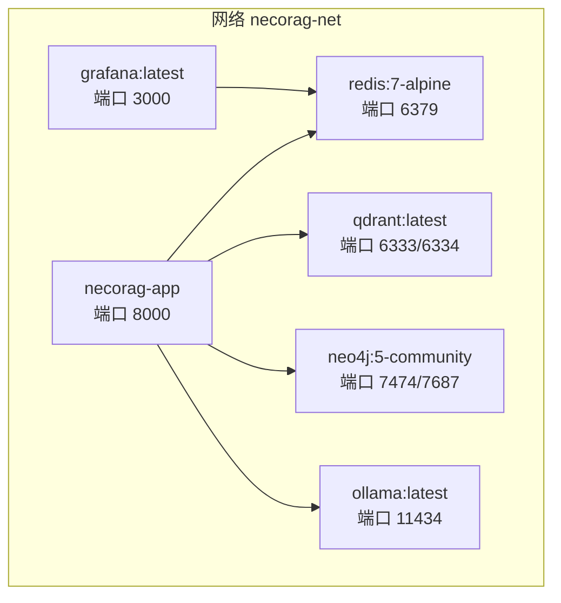
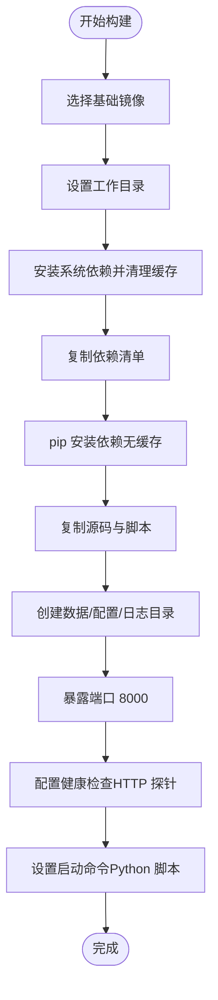
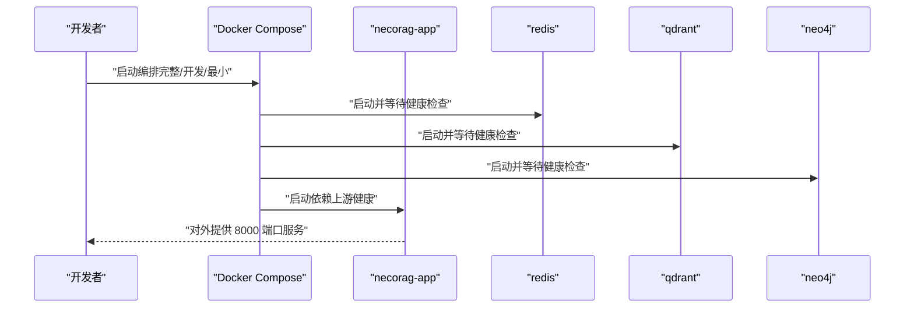
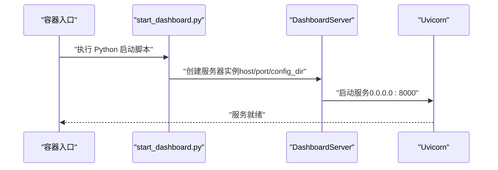
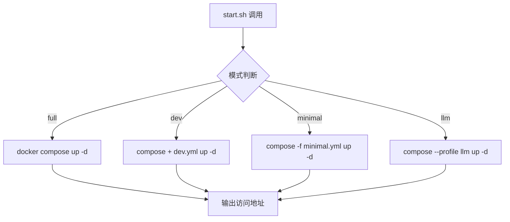
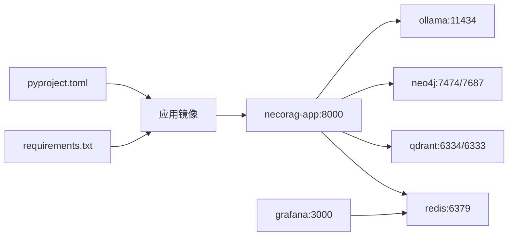

# 容器化部署

<cite>
**本文引用的文件**
- [Dockerfile](file://opdev/Dockerfile)
- [.dockerignore](file://opdev/.dockerignore)
- [docker-compose.yml](file://opdev/docker-compose.yml)
- [docker-compose.dev.yml](file://opdev/docker-compose.dev.yml)
- [docker-compose.minimal.yml](file://opdev/docker-compose.minimal.yml)
- [requirements.txt](file://requirements.txt)
- [pyproject.toml](file://pyproject.toml)
- [start_dashboard.py](file://tools/start_dashboard.py)
- [server.py](file://src/dashboard/server.py)
- [dashboard.py](file://src/dashboard/dashboard.py)
- [start.sh](file://opdev/scripts/start.sh)
- [stop.sh](file://opdev/scripts/stop.sh)
</cite>

## 目录
1. [简介](#简介)
2. [项目结构](#项目结构)
3. [核心组件](#核心组件)
4. [架构总览](#架构总览)
5. [详细组件分析](#详细组件分析)
6. [依赖关系分析](#依赖关系分析)
7. [性能考虑](#性能考虑)
8. [故障排查指南](#故障排查指南)
9. [结论](#结论)
10. [附录](#附录)

## 简介
本文件面向容器化部署与运维团队，系统性阐述 NecoRAG 的容器化方案，覆盖 Dockerfile 构建配置、多环境 docker-compose 编排、容器运行最佳实践、镜像构建与推送流程、版本与标签策略、性能优化与安全要点。文档同时提供基于仓库实际文件的架构图与流程图，帮助读者快速理解并落地部署。

## 项目结构
与容器化相关的核心位置集中在 opdev 目录，包含：
- Dockerfile：应用镜像构建定义
- docker-compose.*.yml：多环境编排配置
- .dockerignore：构建阶段排除规则
- scripts：一键启动/停止脚本
- tools/start_dashboard.py：应用入口脚本
- src/dashboard/server.py：Web 仪表盘服务实现
- requirements.txt / pyproject.toml：Python 依赖清单与打包元数据

```mermaid
graph TB
subgraph "opdev"
DF["Dockerfile"]
DC["docker-compose.yml"]
DCD["docker-compose.dev.yml"]
DCM["docker-compose.minimal.yml"]
IGN["docker-compose.ignore"]
SHS["scripts/start.sh"]
SHP["scripts/stop.sh"]
end
subgraph "应用代码"
TSD["tools/start_dashboard.py"]
SSV["src/dashboard/server.py"]
SDP["src/dashboard/dashboard.py"]
REQ["requirements.txt"]
PYP["pyproject.toml"]
end
DF --> TSD
DF --> SSV
DF --> SDP
DF --> REQ
DF --> PYP
DC -. 包含 .dev/.minimal .-> DCD
DC -. 包含 .minimal .-> DCM
SHS --> DC
SHP --> DC
```

图表来源
- [Dockerfile](file://opdev/Dockerfile)
- [docker-compose.yml](file://opdev/docker-compose.yml)
- [docker-compose.dev.yml](file://opdev/docker-compose.dev.yml)
- [docker-compose.minimal.yml](file://opdev/docker-compose.minimal.yml)
- [.dockerignore](file://opdev/.dockerignore)
- [start.sh](file://opdev/scripts/start.sh)
- [stop.sh](file://opdev/scripts/stop.sh)
- [start_dashboard.py](file://tools/start_dashboard.py)
- [server.py](file://src/dashboard/server.py)
- [dashboard.py](file://src/dashboard/dashboard.py)
- [requirements.txt](file://requirements.txt)
- [pyproject.toml](file://pyproject.toml)

章节来源
- [Dockerfile](file://opdev/Dockerfile)
- [docker-compose.yml](file://opdev/docker-compose.yml)
- [docker-compose.dev.yml](file://opdev/docker-compose.dev.yml)
- [docker-compose.minimal.yml](file://opdev/docker-compose.minimal.yml)
- [.dockerignore](file://opdev/.dockerignore)
- [start.sh](file://opdev/scripts/start.sh)
- [stop.sh](file://opdev/scripts/stop.sh)
- [start_dashboard.py](file://tools/start_dashboard.py)
- [server.py](file://src/dashboard/server.py)
- [dashboard.py](file://src/dashboard/dashboard.py)
- [requirements.txt](file://requirements.txt)
- [pyproject.toml](file://pyproject.toml)

## 核心组件
- 应用镜像构建：基于精简 Python 基础镜像，安装必要系统依赖，复制依赖与源码，创建工作目录与数据目录，暴露端口并配置健康检查，最终通过 Python 脚本启动服务。
- 多环境编排：统一编排文件定义了缓存、向量、图数据库、推理引擎与监控等服务；通过 profiles 与独立最小化编排实现开发、完整与最小三种使用场景。
- 运行时入口：提供 Python 启动脚本与 FastAPI 服务器实现，支持通过参数指定主机、端口与配置目录，并内置健康检查接口。
- 环境与脚本：提供一键启动/停止脚本，自动检查 Docker 环境、加载 .env、按模式组合编排文件并输出服务访问指引。

章节来源
- [Dockerfile](file://opdev/Dockerfile)
- [docker-compose.yml](file://opdev/docker-compose.yml)
- [docker-compose.dev.yml](file://opdev/docker-compose.dev.yml)
- [docker-compose.minimal.yml](file://opdev/docker-compose.minimal.yml)
- [start_dashboard.py](file://tools/start_dashboard.py)
- [server.py](file://src/dashboard/server.py)
- [start.sh](file://opdev/scripts/start.sh)
- [stop.sh](file://opdev/scripts/stop.sh)

## 架构总览
下图展示了容器化部署的整体架构：应用容器与后端存储/检索/图数据库/LLM/监控等服务通过自定义桥接网络互联，应用容器通过健康检查与依赖条件确保在上游服务就绪后再启动。



图表来源
- [docker-compose.yml](file://opdev/docker-compose.yml)

## 详细组件分析

### Dockerfile 构建配置
- 基础镜像与标签：采用官方 Python 精简镜像作为基础，便于体积控制与安全基线。
- 维护者与描述：通过 LABEL 标签记录维护者与项目描述，便于镜像归档与审计。
- 工作目录：设置应用工作目录，后续 COPY/EXPOSE/CMD 均以此为基准。
- 系统依赖：安装构建工具与常用下载工具，随后清理包管理缓存，降低镜像体积。
- 依赖安装：复制依赖清单后执行无缓存安装，保证依赖一致性与可复现性。
- 源码与脚本：复制应用源码与启动脚本至镜像内。
- 数据目录：预创建数据、配置与日志目录，便于容器内持久化与权限控制。
- 端口与健康检查：暴露应用端口并配置健康检查，使用 HTTP 探针验证 /api/stats 可达性。
- 启动命令：通过 Python 脚本启动 Web 服务，绑定 0.0.0.0 并监听 8000 端口。



图表来源
- [Dockerfile](file://opdev/Dockerfile)

章节来源
- [Dockerfile](file://opdev/Dockerfile)

### 多环境 docker-compose 配置
- 统一编排文件：定义了缓存、向量、图数据库、推理引擎与监控等服务，均加入自定义桥接网络，便于服务间通信与隔离。
- 存储卷：为各服务挂载持久化卷，避免容器重建导致数据丢失。
- 环境变量：通过环境变量传递服务端口、认证凭据与功能开关，便于不同环境差异化配置。
- 依赖与健康检查：应用容器显式声明对上游服务的健康检查依赖，确保启动顺序与稳定性。
- 开发模式：通过 profiles 控制应用与 LLM、监控服务的按需启动，减少资源占用。
- 最小化部署：提供仅包含核心存储的编排文件，满足轻量化场景。



图表来源
- [docker-compose.yml](file://opdev/docker-compose.yml)
- [docker-compose.dev.yml](file://opdev/docker-compose.dev.yml)
- [docker-compose.minimal.yml](file://opdev/docker-compose.minimal.yml)

章节来源
- [docker-compose.yml](file://opdev/docker-compose.yml)
- [docker-compose.dev.yml](file://opdev/docker-compose.dev.yml)
- [docker-compose.minimal.yml](file://opdev/docker-compose.minimal.yml)

### 容器运行时入口与健康检查
- 启动脚本：提供命令行参数解析，支持主机、端口与配置目录的定制，最终实例化并运行 Web 服务器。
- Web 服务器：基于 FastAPI 提供 REST API 与静态 UI，内置跨域中间件与统计接口；健康检查接口 /api/stats 由镜像健康检查探针调用。
- 依赖清单：requirements.txt 与 pyproject.toml 明确了运行期依赖与打包元数据，保障镜像内环境一致性。



图表来源
- [start_dashboard.py](file://tools/start_dashboard.py)
- [server.py](file://src/dashboard/server.py)

章节来源
- [start_dashboard.py](file://tools/start_dashboard.py)
- [server.py](file://src/dashboard/server.py)
- [requirements.txt](file://requirements.txt)
- [pyproject.toml](file://pyproject.toml)

### 一键启动与停止脚本
- 启动脚本：支持完整、开发、最小与带 LLM 四种模式，自动检查 Docker 环境与 .env 文件，按模式组合编排文件并输出访问指引。
- 停止脚本：支持普通停止与清理数据卷两种模式，提供交互确认以避免误删数据。



图表来源
- [start.sh](file://opdev/scripts/start.sh)

章节来源
- [start.sh](file://opdev/scripts/start.sh)
- [stop.sh](file://opdev/scripts/stop.sh)

## 依赖关系分析
- 构建期依赖：Dockerfile 依赖 requirements.txt 与 pyproject.toml 中的依赖声明，确保镜像内 Python 环境一致。
- 运行期依赖：应用容器通过环境变量连接 Redis/Qdrant/Neo4j/Ollama，Grafana 依赖 Redis 进行可视化。
- 健康检查：应用容器健康检查依赖 /api/stats，上游服务健康检查依赖各自服务端口或 CLI 工具。



图表来源
- [Dockerfile](file://opdev/Dockerfile)
- [requirements.txt](file://requirements.txt)
- [pyproject.toml](file://pyproject.toml)
- [docker-compose.yml](file://opdev/docker-compose.yml)

章节来源
- [Dockerfile](file://opdev/Dockerfile)
- [requirements.txt](file://requirements.txt)
- [pyproject.toml](file://pyproject.toml)
- [docker-compose.yml](file://opdev/docker-compose.yml)

## 性能考虑
- 镜像体积与层优化：使用精简基础镜像、安装后清理缓存、仅复制必要文件，有助于减小镜像体积与提升构建速度。
- 依赖安装策略：无缓存安装可避免 pip 缓存层影响镜像增量构建，但可能增加构建时间；可结合 CI/CD 的缓存策略平衡。
- 端口与网络：统一桥接网络减少跨网络开销；服务间通信尽量使用容器内 DNS 名称而非宿主机端口直连。
- 存储卷与 IO：将数据目录挂载为命名卷，避免频繁写入根文件系统；针对高吞吐场景可评估使用 SSD 或专用 IO 策略。
- 健康检查间隔：合理设置健康检查间隔与超时，避免过于频繁导致额外负载，亦避免过长导致故障发现延迟。
- 资源限制：可在 docker-compose 中为各服务设置 CPU/内存限制，防止资源争抢；对推理引擎可根据硬件能力调整资源预留。

## 故障排查指南
- Docker 环境检查：启动脚本会检查 Docker 是否安装与服务是否运行，若失败请先修复 Docker 环境。
- .env 文件缺失：启动脚本会在缺少 .env 时从模板创建，请按需修改配置项。
- 服务启动顺序：应用容器依赖上游服务健康检查，若应用无法访问上游，请先排查上游服务健康状态与端口映射。
- 健康检查失败：镜像健康检查探针访问 /api/stats，若失败请检查应用日志与端口绑定；上游服务健康检查失败请检查对应服务日志与配置。
- 数据卷清理：停止脚本提供清理数据卷选项，使用前请确认风险并做好备份。

章节来源
- [start.sh](file://opdev/scripts/start.sh)
- [stop.sh](file://opdev/scripts/stop.sh)
- [Dockerfile](file://opdev/Dockerfile)
- [docker-compose.yml](file://opdev/docker-compose.yml)

## 结论
本容器化方案以精简镜像为基础，通过多环境编排与一键脚本实现灵活部署；结合健康检查与依赖条件确保服务稳定；配合资源与网络规划可进一步提升性能与可靠性。建议在生产环境中结合 CI/CD 实现自动化构建与发布，并完善监控与告警体系。

## 附录

### 容器镜像构建与推送流程（版本与标签策略）
- 版本来源：项目版本来自打包元数据，可用于镜像标签。
- 构建步骤：在 opdev 目录执行镜像构建，指定上下文与 Dockerfile 路径。
- 标签策略：建议采用“主版本.次版本.修订”格式，结合分支/提交号形成可追溯标签；为稳定版本打上 latest 或语义化标签。
- 推送流程：登录镜像仓库后推送多标签，便于回滚与并行发布。

章节来源
- [Dockerfile](file://opdev/Dockerfile)
- [pyproject.toml](file://pyproject.toml)