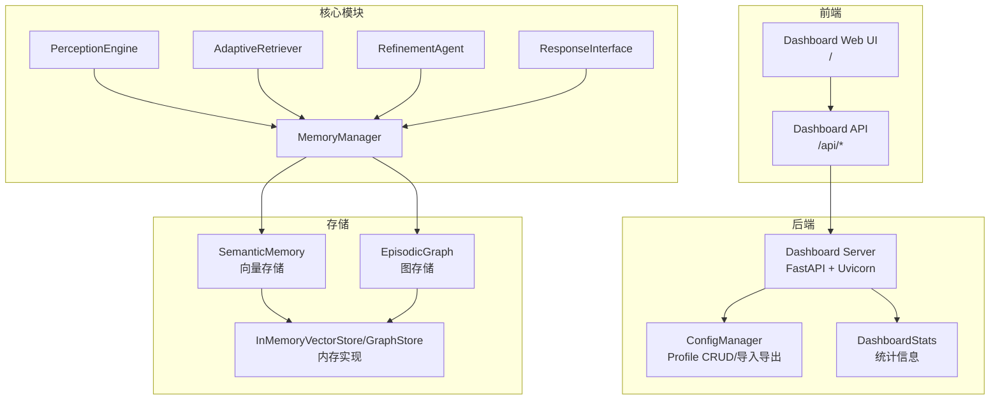
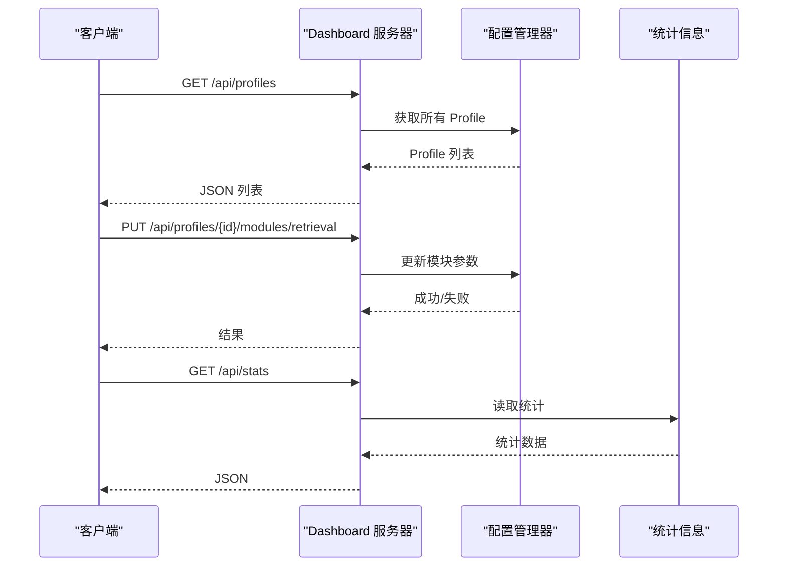
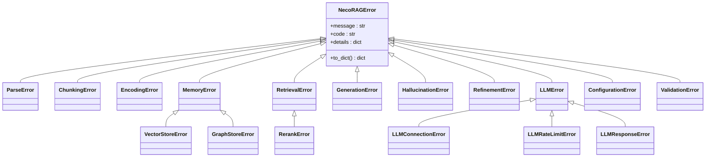
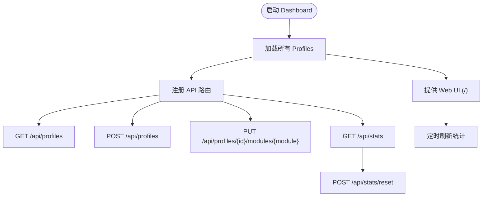
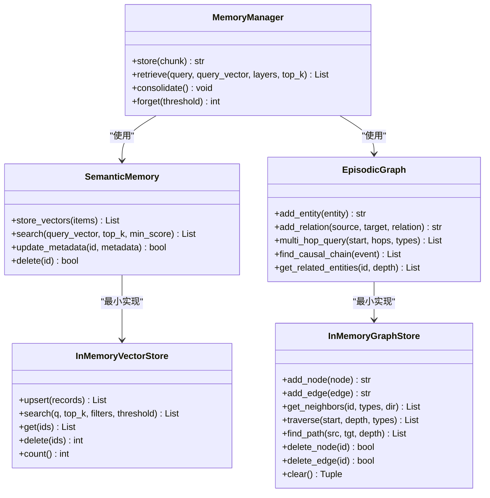
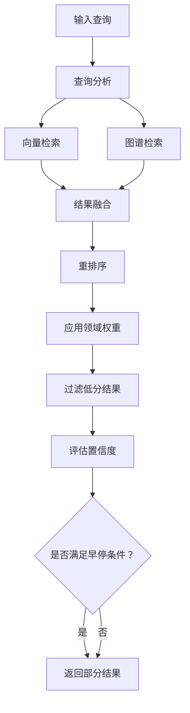
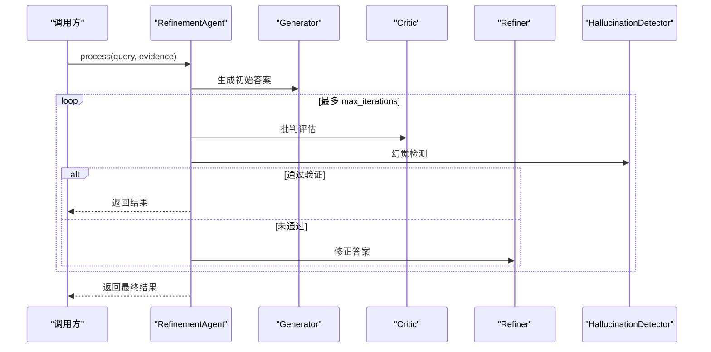
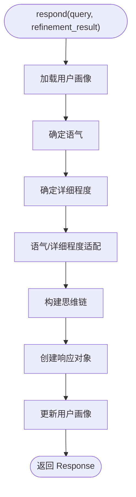
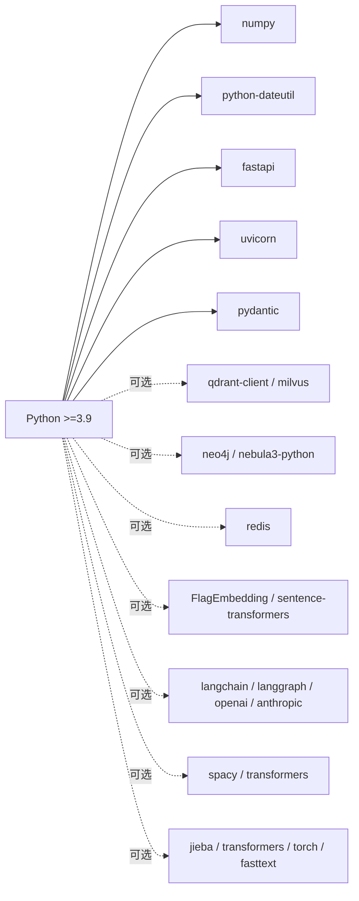
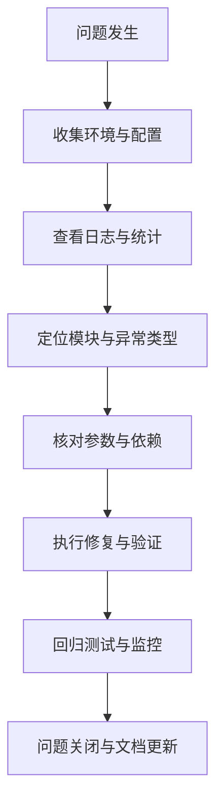

# 故障排除与诊断

<cite>
**本文引用的文件**
- [README.md](file://README.md)
- [src/core/exceptions.py](file://src/core/exceptions.py)
- [src/dashboard/server.py](file://src/dashboard/server.py)
- [src/dashboard/config_manager.py](file://src/dashboard/config_manager.py)
- [src/dashboard/models.py](file://src/dashboard/models.py)
- [src/memory/manager.py](file://src/memory/manager.py)
- [src/memory/semantic_memory.py](file://src/memory/semantic_memory.py)
- [src/memory/episodic_graph.py](file://src/memory/episodic_graph.py)
- [src/memory/backends/memory_store.py](file://src/memory/backends/memory_store.py)
- [src/perception/engine.py](file://src/perception/engine.py)
- [src/retrieval/retriever.py](file://src/retrieval/retriever.py)
- [src/refinement/agent.py](file://src/refinement/agent.py)
- [src/response/interface.py](file://src/response/interface.py)
- [requirements.txt](file://requirements.txt)
- [pyproject.toml](file://pyproject.toml)
- [example/example_usage.py](file://example/example_usage.py)
</cite>

## 目录
1. [简介](#简介)
2. [项目结构](#项目结构)
3. [核心组件](#核心组件)
4. [架构总览](#架构总览)
5. [详细组件分析](#详细组件分析)
6. [依赖分析](#依赖分析)
7. [性能考虑](#性能考虑)
8. [故障排除指南](#故障排除指南)
9. [结论](#结论)
10. [附录](#附录)

## 简介
本文件面向技术支持与运维工程师，提供 NecoRAG 框架的系统化故障排除与诊断指南。内容覆盖常见问题识别、诊断流程、异常与错误码解释、性能问题排查（内存泄漏、CPU 过载、I/O 瓶颈）、网络与数据库连接问题、配置与初始化错误修复、日志与调试技巧，以及标准化的问题报告与反馈流程。

## 项目结构
NecoRAG 采用“五层认知”架构，从感知到交互形成完整闭环；同时提供 Web Dashboard 用于配置管理与监控。关键模块包括：
- 感知层：Perception Engine（文档解析、编码、情境标记）
- 记忆层：Memory Manager（L1/L2/L3 三层记忆）
- 检索层：Adaptive Retriever（混合检索、重排序、早停机制）
- 巩固层：Refinement Agent（生成-批判-修正闭环、幻觉检测）
- 交互层：Response Interface（情境自适应生成、思维链可视化）
- Dashboard：配置管理、Profile 管理、统计与 API

图表来源
- [src/dashboard/server.py:38-253](file://src/dashboard/server.py#L38-L253)
- [src/dashboard/config_manager.py:14-315](file://src/dashboard/config_manager.py#L14-L315)
- [src/dashboard/models.py:221-231](file://src/dashboard/models.py#L221-L231)
- [src/perception/engine.py:14-130](file://src/perception/engine.py#L14-L130)
- [src/memory/manager.py:16-186](file://src/memory/manager.py#L16-L186)
- [src/memory/semantic_memory.py:21-179](file://src/memory/semantic_memory.py#L21-L179)
- [src/memory/episodic_graph.py:10-194](file://src/memory/episodic_graph.py#L10-L194)
- [src/memory/backends/memory_store.py:20-381](file://src/memory/backends/memory_store.py#L20-L381)
- [src/retrieval/retriever.py:122-440](file://src/retrieval/retriever.py#L122-L440)
- [src/refinement/agent.py:16-151](file://src/refinement/agent.py#L16-L151)
- [src/response/interface.py:16-224](file://src/response/interface.py#L16-L224)

章节来源
- [README.md:35-85](file://README.md#L35-L85)
- [src/dashboard/server.py:38-253](file://src/dashboard/server.py#L38-L253)
- [src/dashboard/config_manager.py:14-315](file://src/dashboard/config_manager.py#L14-L315)
- [src/dashboard/models.py:221-231](file://src/dashboard/models.py#L221-L231)
- [src/perception/engine.py:14-130](file://src/perception/engine.py#L14-L130)
- [src/memory/manager.py:16-186](file://src/memory/manager.py#L16-L186)
- [src/memory/semantic_memory.py:21-179](file://src/memory/semantic_memory.py#L21-L179)
- [src/memory/episodic_graph.py:10-194](file://src/memory/episodic_graph.py#L10-L194)
- [src/memory/backends/memory_store.py:20-381](file://src/memory/backends/memory_store.py#L20-L381)
- [src/retrieval/retriever.py:122-440](file://src/retrieval/retriever.py#L122-L440)
- [src/refinement/agent.py:16-151](file://src/refinement/agent.py#L16-L151)
- [src/response/interface.py:16-224](file://src/response/interface.py#L16-L224)

## 核心组件
- 统一异常体系：定义了感知、记忆、检索、生成、LLM、配置等异常类型，便于统一错误处理与追踪。
- Dashboard 服务器：提供 REST API 与 Web UI，支持 Profile 管理、模块参数配置、统计信息展示。
- 记忆管理器：统一管理 L1/L2/L3 三层记忆，负责存储、检索、巩固与主动遗忘。
- 检索器：实现向量检索、图谱检索、结果融合、重排序、领域权重与早停机制。
- 精炼代理：生成-批判-修正闭环，结合幻觉检测与知识固化/修剪。
- 响应接口：情境自适应生成、思维链可视化、用户画像适配。

章节来源
- [src/core/exceptions.py:10-296](file://src/core/exceptions.py#L10-L296)
- [src/dashboard/server.py:43-393](file://src/dashboard/server.py#L43-L393)
- [src/memory/manager.py:16-186](file://src/memory/manager.py#L16-L186)
- [src/retrieval/retriever.py:122-440](file://src/retrieval/retriever.py#L122-L440)
- [src/refinement/agent.py:16-151](file://src/refinement/agent.py#L16-L151)
- [src/response/interface.py:16-224](file://src/response/interface.py#L16-L224)

## 架构总览
NecoRAG 通过模块化设计实现端到端的检索增强生成流程，并通过 Dashboard 提供可视化配置与监控。异常类型贯穿各层，便于定位问题来源。

图表来源
- [src/dashboard/server.py:98-236](file://src/dashboard/server.py#L98-L236)
- [src/dashboard/config_manager.py:135-166](file://src/dashboard/config_manager.py#L135-L166)
- [src/dashboard/models.py:221-231](file://src/dashboard/models.py#L221-L231)

## 详细组件分析

### 统一异常与错误码
- 基础异常类提供统一的错误码、消息与细节字段，便于前端与日志系统解析。
- 按模块划分的异常类型（如 ParseError、MemoryError、RetrievalError、GenerationError、LLMError、ConfigurationError、ValidationError），有助于快速定位问题模块。
- 异常细节字段包含文件路径、模型名、查询、配置键等上下文信息，便于复现与修复。

图表来源
- [src/core/exceptions.py:10-296](file://src/core/exceptions.py#L10-L296)

章节来源
- [src/core/exceptions.py:10-296](file://src/core/exceptions.py#L10-L296)

### Dashboard 服务器与配置管理
- 提供 Profile 的创建、查询、更新、激活、复制、导入导出与删除。
- 支持模块参数的按模块更新与读取。
- 提供统计信息接口与重置能力。
- 内置简单 UI，支持定时刷新与基本交互。

图表来源
- [src/dashboard/server.py:94-253](file://src/dashboard/server.py#L94-L253)
- [src/dashboard/config_manager.py:42-166](file://src/dashboard/config_manager.py#L42-L166)
- [src/dashboard/models.py:221-231](file://src/dashboard/models.py#L221-L231)

章节来源
- [src/dashboard/server.py:43-393](file://src/dashboard/server.py#L43-L393)
- [src/dashboard/config_manager.py:14-315](file://src/dashboard/config_manager.py#L14-L315)
- [src/dashboard/models.py:221-231](file://src/dashboard/models.py#L221-L231)

### 记忆管理器与存储
- MemoryManager 统一管理 L1/L2/L3，负责存储、检索、巩固与主动遗忘。
- SemanticMemory 与 EpisodicGraph 提供最小实现（内存存储/图），便于开发与测试。
- InMemoryVectorStore/InMemoryGraphStore 提供维度校验、相似度计算、邻接表遍历等基础能力。

图表来源
- [src/memory/manager.py:16-186](file://src/memory/manager.py#L16-L186)
- [src/memory/semantic_memory.py:21-179](file://src/memory/semantic_memory.py#L21-L179)
- [src/memory/episodic_graph.py:10-194](file://src/memory/episodic_graph.py#L10-L194)
- [src/memory/backends/memory_store.py:20-381](file://src/memory/backends/memory_store.py#L20-L381)

章节来源
- [src/memory/manager.py:16-186](file://src/memory/manager.py#L16-L186)
- [src/memory/semantic_memory.py:21-179](file://src/memory/semantic_memory.py#L21-L179)
- [src/memory/episodic_graph.py:10-194](file://src/memory/episodic_graph.py#L10-L194)
- [src/memory/backends/memory_store.py:20-381](file://src/memory/backends/memory_store.py#L20-L381)

### 检索器与早停机制
- AdaptiveRetriever 支持向量检索、图谱检索、结果融合、重排序、领域权重与早停。
- EarlyTerminationController 基于置信度阈值与边际收益递减策略决定是否提前终止。

图表来源
- [src/retrieval/retriever.py:177-254](file://src/retrieval/retriever.py#L177-L254)
- [src/retrieval/retriever.py:30-120](file://src/retrieval/retriever.py#L30-L120)

章节来源
- [src/retrieval/retriever.py:122-440](file://src/retrieval/retriever.py#L122-L440)

### 精炼代理与幻觉检测
- RefinementAgent 通过 Generator -> Critic -> Refiner 闭环，结合幻觉检测与知识固化/修剪。
- 支持异步后台任务运行。

图表来源
- [src/refinement/agent.py:61-129](file://src/refinement/agent.py#L61-L129)

章节来源
- [src/refinement/agent.py:16-151](file://src/refinement/agent.py#L16-L151)

### 响应接口与思维链可视化
- ResponseInterface 基于用户画像与查询复杂度自适应语气与详细程度。
- 生成思维链可视化，包含检索路径、证据来源与推理过程。

图表来源
- [src/response/interface.py:55-132](file://src/response/interface.py#L55-L132)
- [src/response/interface.py:167-211](file://src/response/interface.py#L167-L211)

章节来源
- [src/response/interface.py:16-224](file://src/response/interface.py#L16-L224)

## 依赖分析
- Python 版本要求：3.9+
- 核心依赖：numpy、python-dateutil
- Dashboard 依赖：fastapi、uvicorn、pydantic
- 可选外部组件（注释形式）：文档解析（RAGFlow）、向量库（Qdrant/Milvus）、图库（Neo4j/NebulaGraph）、缓存（Redis）、嵌入模型（BGE-M3/BGE-Reranker）、LLM（LangChain/LangGraph/OpenAI/Anthropic）、NLP 工具（spaCy/transformers）、意图分类（jieba/transformers/torch/fasttext）

图表来源
- [requirements.txt:1-66](file://requirements.txt#L1-L66)
- [pyproject.toml:10-30](file://pyproject.toml#L10-L30)

章节来源
- [requirements.txt:1-66](file://requirements.txt#L1-L66)
- [pyproject.toml:10-30](file://pyproject.toml#L10-L30)

## 性能考虑
- 检索性能：top_k、min_score、confidence_threshold、reranker 模型选择与早停机制直接影响延迟与吞吐。
- 记忆层：向量维度、索引类型（HNSW）、元数据过滤与阈值设置影响 L2 检索速度。
- 图谱查询：多跳深度、关系类型过滤与遍历策略对 CPU 与内存占用有显著影响。
- 后台任务：知识固化与修剪周期需平衡资源消耗与效果。
- Dashboard：Uvicorn 日志级别与并发配置影响可观测性与性能。

## 故障排除指南

### 一、常见问题识别与诊断
- 症状：组件初始化失败或模块导入报错
  - 可能原因：缺少可选依赖、版本不兼容、环境变量缺失
  - 诊断要点：检查 requirements 与 pyproject 中的依赖声明，确认已安装所需包
- 症状：检索结果为空或质量差
  - 可能原因：向量维度不匹配、阈值过高、top_k 过小、早停阈值过高
  - 诊断要点：核对 query_vector 维度、调整 min_score/top_k/confidence_threshold
- 症状：响应接口生成内容不稳定或无思维链
  - 可能原因：用户画像未正确加载、LLM 配置缺失、模块参数错误
  - 诊断要点：检查用户画像管理与模块参数配置

章节来源
- [requirements.txt:1-66](file://requirements.txt#L1-L66)
- [pyproject.toml:10-30](file://pyproject.toml#L10-L30)
- [src/retrieval/retriever.py:177-254](file://src/retrieval/retriever.py#L177-L254)
- [src/response/interface.py:55-132](file://src/response/interface.py#L55-L132)

### 二、系统错误代码与异常解释
- 基础与模块化异常：统一错误码与细节字段，便于前端与日志解析
- 常见错误码与含义（节选）
  - PARSE_ERROR：文档解析失败，细节包含文件路径与类型
  - CHUNKING_ERROR：文本分块失败
  - ENCODING_ERROR：向量编码失败，细节包含模型名
  - VECTOR_STORE_ERROR：L2 向量存储错误
  - GRAPH_STORE_ERROR：L3 图存储错误
  - RETRIEVER_ERROR/RERANK_ERROR：检索/重排序错误，细节包含查询
  - GENERATION_ERROR/HALLUCINATION_ERROR/REFINEMENT_ERROR：生成与精炼相关错误
  - LLM_ERROR/LLM_CONNECTION_ERROR/LLM_RATE_LIMIT_ERROR/LLM_RESPONSE_ERROR：LLM 相关错误，细节包含供应商与模型
  - CONFIGURATION_ERROR：配置错误，细节包含配置键
  - VALIDATION_ERROR：参数校验失败，细节包含字段与值

章节来源
- [src/core/exceptions.py:46-296](file://src/core/exceptions.py#L46-L296)

### 三、性能问题排查流程
- 内存泄漏
  - 现象：长时间运行后内存持续增长
  - 排查：检查向量/图存储是否正确释放；确认 InMemoryVectorStore/InMemoryGraphStore 的 clear/delete 使用；避免全局缓存累积
  - 建议：定期执行 consolidate/forget；限制 L1 TTL 与 L2 集合大小
- CPU 过载
  - 现象：CPU 占用高，延迟上升
  - 排查：降低 top_k、提高 min_score、启用早停；减少多跳深度；优化 reranker 模型与 batch 大小
- I/O 瓶颈
  - 现象：磁盘/网络等待时间长
  - 排查：确认外部存储（Qdrant/Milvus/Neo4j/Redis）连接与索引配置；检查网络延迟与带宽
  - 建议：使用本地或内网部署外部组件；合理设置超时与重试

章节来源
- [src/memory/backends/memory_store.py:116-140](file://src/memory/backends/memory_store.py#L116-L140)
- [src/memory/semantic_memory.py:104-118](file://src/memory/semantic_memory.py#L104-L118)
- [src/memory/episodic_graph.py:215-246](file://src/memory/episodic_graph.py#L215-L246)
- [src/retrieval/retriever.py:177-254](file://src/retrieval/retriever.py#L177-L254)

### 四、网络连接与数据库连接失败
- Dashboard 启动失败
  - 现象：端口被占用、CORS 配置问题
  - 排查：修改 host/port；确认允许的源配置；检查防火墙
- 外部存储连接失败
  - 现象：连接超时、认证失败、驱动未安装
  - 排查：确认 URL 正确、凭据有效、驱动已安装；检查网络连通性与安全组
  - 建议：使用 Docker Compose 或本地容器化部署外部组件

章节来源
- [src/dashboard/server.py:54-93](file://src/dashboard/server.py#L54-L93)
- [requirements.txt:18-27](file://requirements.txt#L18-L27)

### 五、配置错误与模块初始化失败
- 症状：Profile 无法创建/更新、模块参数无效
  - 排查：确认配置目录可写、JSON 格式正确；检查模块参数键名与类型
  - 建议：使用 Dashboard API 进行参数更新；导出/导入 Profile 进行备份与迁移
- 症状：模块初始化抛出异常
  - 排查：检查依赖安装与版本；确认可选组件已启用或禁用一致

章节来源
- [src/dashboard/config_manager.py:42-166](file://src/dashboard/config_manager.py#L42-L166)
- [src/dashboard/server.py:181-216](file://src/dashboard/server.py#L181-L216)

### 六、日志分析与调试技巧
- Dashboard 日志
  - 启动日志包含访问地址与 API 文档地址；可通过日志观察请求与错误
- 统计信息
  - 使用 /api/stats 获取文档/块/查询/会话等指标；用于性能基线与回归分析
- 调试建议
  - 逐步缩小范围：先验证感知层编码与存储，再验证检索与精炼，最后验证响应
  - 使用示例脚本：参考 example_usage.py 的完整流程，逐段替换为真实数据与配置

章节来源
- [src/dashboard/server.py:379-392](file://src/dashboard/server.py#L379-L392)
- [src/dashboard/models.py:221-231](file://src/dashboard/models.py#L221-L231)
- [example/example_usage.py:218-252](file://example/example_usage.py#L218-L252)

### 七、问题报告与反馈流程（标准化）
- 收集信息
  - 环境：Python 版本、操作系统、依赖版本
  - 配置：相关模块参数、Profile 状态、外部组件版本
  - 日志：Dashboard 启动日志、关键错误堆栈、统计信息快照
  - 复现步骤：最小可复现实例、输入样本、期望与实际输出
- 提交渠道
  - 通过项目 Issue 页面提交，附上上述信息与异常截图/日志
- 响应时效
  - 团队将在工作日内回复并推进修复

章节来源
- [README.md:544-556](file://README.md#L544-L556)

## 结论
通过统一异常体系、模块化组件与 Dashboard 监控，NecoRAG 提供了完善的故障诊断与修复路径。建议在生产环境中：
- 明确依赖与版本约束
- 启用早停与合理的检索参数
- 定期清理与固化记忆
- 使用 Dashboard 进行参数调优与监控
- 建立标准化的问题报告流程

## 附录

### A. 故障排除工具箱与检查清单
- 环境与依赖
  - Python 版本与核心依赖是否满足
  - 可选依赖是否按需启用
- Dashboard
  - 端口可用性、CORS 配置、静态资源加载
  - Profile 创建/更新/激活状态
- 记忆层
  - 向量维度与阈值设置
  - L1 TTL、L2 集合与索引、L3 图谱关系
- 检索层
  - top_k、min_score、早停阈值、重排序模型
- 精炼层
  - 生成-批判-修正循环参数、幻觉检测阈值
- 响应层
  - 用户画像与偏好、思维链可视化开关
- 外部组件
  - 连接 URL、凭据、网络连通性、索引与权限

### B. 关键流程图（概念）
