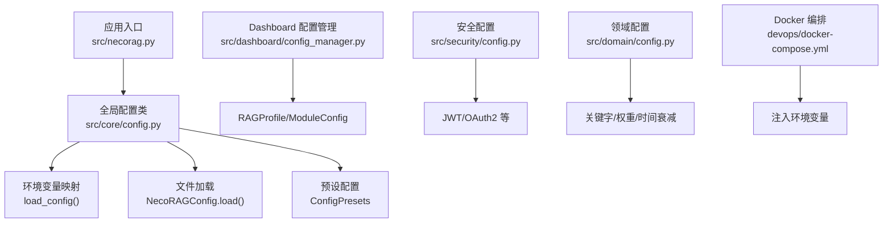
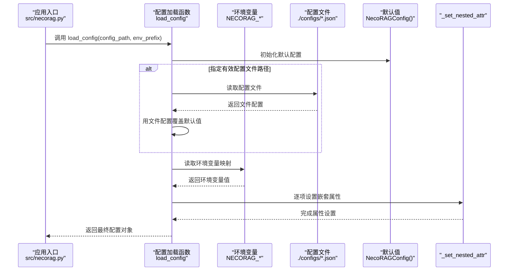
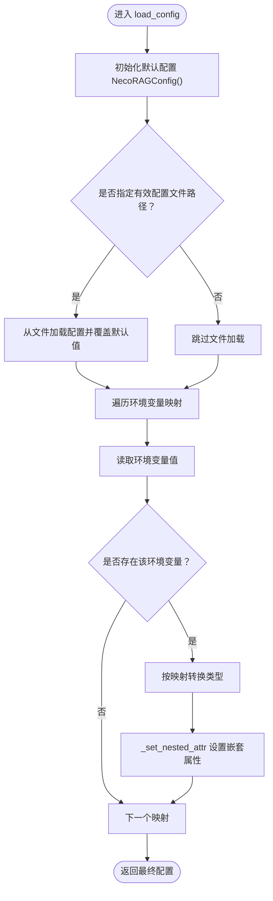
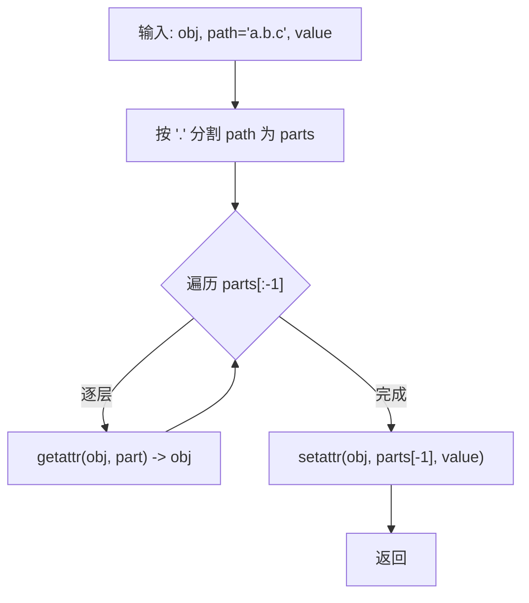
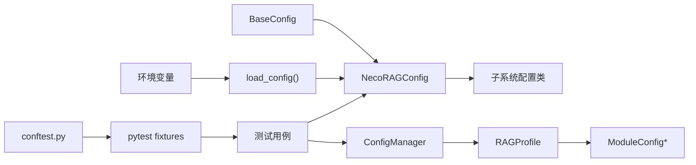

# 环境配置管理

<cite>
**本文引用的文件**
- [src/core/config.py](file://src/core/config.py)
- [src/necorag.py](file://src/necorag.py)
- [src/dashboard/config_manager.py](file://src/dashboard/config_manager.py)
- [src/security/config.py](file://src/security/config.py)
- [src/domain/config.py](file://src/domain/config.py)
- [devops/docker-compose.yml](file://devops/docker-compose.yml)
- [devops/docker-compose.dev.yml](file://devops/docker-compose.dev.yml)
- [src/core/exceptions.py](file://src/core/exceptions.py)
- [VERSION_README.md](file://VERSION_README.md)
- [RELEASE_NOTES_v3.1.0.md](file://RELEASE_NOTES_v3.1.0.md)
- [wiki/wiki/配置管理/环境变量配置.md](file://wiki/wiki/配置管理/环境变量配置.md)
- [wiki/wiki/配置管理/配置管理.md](file://wiki/wiki/配置管理/配置管理.md)
</cite>

## 目录
1. [简介](#简介)
2. [项目结构](#项目结构)
3. [核心组件](#核心组件)
4. [架构总览](#架构总览)
5. [详细组件分析](#详细组件分析)
6. [依赖分析](#依赖分析)
7. [性能考量](#性能考量)
8. [故障排查指南](#故障排查指南)
9. [结论](#结论)
10. [附录](#附录)

## 简介
本文件面向 NecoRAG 的环境配置管理，围绕统一的配置加载与覆盖机制，系统性梳理应用配置、数据库配置、LLM 配置、安全配置等关键维度，并结合 Docker 编排与环境变量优先级，给出部署模板、最佳实践、安全策略、验证与错误处理机制，以及 v3.3.0-alpha 版本的配置项更新与迁移指南。

## 项目结构
NecoRAG 的配置体系由“全局配置类 + 环境变量覆盖 + 文件持久化 + Dashboard 可视化配置”构成，核心文件分布如下：
- 全局配置与加载：src/core/config.py
- 应用入口与配置初始化：src/necorag.py
- Dashboard 配置管理：src/dashboard/config_manager.py
- 安全配置（含 JWT/OAuth2 等）：src/security/config.py
- 领域配置（关键字与权重）：src/domain/config.py
- Docker 编排与环境变量注入：devops/docker-compose.yml、devops/docker-compose.dev.yml
- 异常体系（配置相关异常）：src/core/exceptions.py
- 版本与发布说明：VERSION_README.md、RELEASE_NOTES_v3.1.0.md
- Wiki 配置文档（环境变量与加载流程）：wiki/wiki/配置管理/环境变量配置.md、wiki/wiki/配置管理/配置管理.md

**图表来源**
- [src/necorag.py:80-120](file://src/necorag.py#L80-L120)
- [src/core/config.py:338-377](file://src/core/config.py#L338-L377)
- [src/dashboard/config_manager.py:14-41](file://src/dashboard/config_manager.py#L14-L41)
- [src/security/config.py:11-87](file://src/security/config.py#L11-L87)
- [src/domain/config.py:163-241](file://src/domain/config.py#L163-L241)
- [devops/docker-compose.yml:118-147](file://devops/docker-compose.yml#L118-L147)

**章节来源**
- [src/core/config.py:278-334](file://src/core/config.py#L278-L334)
- [src/necorag.py:75-122](file://src/necorag.py#L75-L122)
- [src/dashboard/config_manager.py:14-41](file://src/dashboard/config_manager.py#L14-L41)
- [src/security/config.py:11-87](file://src/security/config.py#L11-L87)
- [src/domain/config.py:163-241](file://src/domain/config.py#L163-L241)
- [devops/docker-compose.yml:118-147](file://devops/docker-compose.yml#L118-L147)

## 核心组件
- 全局配置类 NecoRAGConfig：聚合各层配置（LLM、感知、记忆、检索、巩固、响应、领域权重、知识演化），并提供 from_dict/to_dict/save/load。
- 配置加载函数 load_config：按“环境变量 > 配置文件 > 默认值”的优先级覆盖配置。
- 预设配置 ConfigPresets：开发/生产/最小化三种模式，便于快速切换。
- Dashboard 配置管理 ConfigManager：Profile 的创建、切换、更新、导入导出与持久化。
- 安全配置 SecurityManager：从环境变量读取 JWT/OAuth2/速率限制/XSS/CSRF 等安全参数。
- 领域配置 DomainConfig：关键字、领域权重、时间衰减等配置与持久化。
- Docker 编排：通过 environment 注入环境变量，统一注入 LLM、向量/图数据库、Redis 等。

**章节来源**
- [src/core/config.py:278-334](file://src/core/config.py#L278-L334)
- [src/core/config.py:338-377](file://src/core/config.py#L338-L377)
- [src/core/config.py:390-420](file://src/core/config.py#L390-L420)
- [src/dashboard/config_manager.py:14-41](file://src/dashboard/config_manager.py#L14-L41)
- [src/security/config.py:11-87](file://src/security/config.py#L11-L87)
- [src/domain/config.py:163-241](file://src/domain/config.py#L163-L241)
- [devops/docker-compose.yml:118-147](file://devops/docker-compose.yml#L118-L147)

## 架构总览
NecoRAG 的配置加载遵循“环境变量 > 配置文件 > 默认值”的优先级，Docker 编排通过 environment 将变量注入容器，从而影响应用行为。

**图表来源**
- [src/necorag.py:80-120](file://src/necorag.py#L80-L120)
- [src/core/config.py:338-377](file://src/core/config.py#L338-L377)
- [src/core/config.py:368-374](file://src/core/config.py#L368-L374)
- [wiki/wiki/配置管理/环境变量配置.md:75-98](file://wiki/wiki/配置管理/环境变量配置.md#L75-L98)

**章节来源**
- [src/core/config.py:338-377](file://src/core/config.py#L338-L377)
- [src/core/config.py:368-374](file://src/core/config.py#L368-L374)
- [wiki/wiki/配置管理/环境变量配置.md:75-98](file://wiki/wiki/配置管理/环境变量配置.md#L75-L98)

## 详细组件分析

### 全局配置与环境变量加载机制
- 优先级：环境变量 > 配置文件 > 默认值
- 环境变量前缀：默认 NECORAG，可通过参数 env_prefix 覆盖
- 映射规则：将环境变量名映射到配置对象的点号路径（如 llm.provider），并进行类型转换（如枚举、布尔）
- 嵌套属性设置：内部使用路径解析与反射设置嵌套字段

**图表来源**
- [src/core/config.py:338-377](file://src/core/config.py#L338-L377)
- [src/core/config.py:368-374](file://src/core/config.py#L368-L374)

**章节来源**
- [src/core/config.py:338-377](file://src/core/config.py#L338-L377)
- [src/core/config.py:368-374](file://src/core/config.py#L368-L374)
- [wiki/wiki/配置管理/配置管理.md:127-175](file://wiki/wiki/配置管理/配置管理.md#L127-L175)

### 嵌套属性设置机制
_set_nested_attr 通过点号路径逐层定位目标属性并设置值，确保可以对嵌套的数据类进行细粒度覆盖。

**图表来源**
- [src/core/config.py:368-374](file://src/core/config.py#L368-L374)

**章节来源**
- [src/core/config.py:368-374](file://src/core/config.py#L368-L374)

### 预设配置模式
- 开发环境：开启调试、使用内存数据库、简化检索与巩固策略
- 生产环境：提升检索与巩固强度，启用重排序与图谱搜索
- 最小化：关闭非核心功能，适合快速启动与资源受限场景

**章节来源**
- [src/core/config.py:390-420](file://src/core/config.py#L390-L420)

### Dashboard 配置管理
- 支持 Profile 的创建、切换、更新、复制、导入导出与持久化
- 默认在首次加载时创建“默认配置”，并标记为活动
- 模块配置包含 whiskers/memory/retrieval/grooming/purr 等参数集合

**章节来源**
- [src/dashboard/config_manager.py:14-41](file://src/dashboard/config_manager.py#L14-L41)
- [src/dashboard/config_manager.py:289-315](file://src/dashboard/config_manager.py#L289-L315)

### 安全配置（JWT/OAuth2/防护）
- 从环境变量读取 JWT 密钥、算法、过期间隔
- 支持 GitHub/Google OAuth2 客户端配置
- 速率限制、CSRF/XSS 防护、允许的 Origin 列表、密码复杂度要求等

**章节来源**
- [src/security/config.py:11-87](file://src/security/config.py#L11-L87)

### 领域配置（关键字/权重/时间衰减）
- 关键字等级与权重范围校验与自动修正
- 领域权重因子、时间衰减系数、相关领域映射
- 支持保存/加载到 JSON 文件，便于版本化管理

**章节来源**
- [src/domain/config.py:163-241](file://src/domain/config.py#L163-L241)

### Docker 编排与环境变量注入
- 通过 environment 字段将 LLM、向量/图数据库、Redis、应用端口等注入容器
- 服务间通过容器名互联（如 http://qdrant:6334、bolt://neo4j:7687）

**章节来源**
- [devops/docker-compose.yml:118-147](file://devops/docker-compose.yml#L118-L147)
- [devops/docker-compose.dev.yml:1-16](file://devops/docker-compose.dev.yml#L1-L16)

## 依赖分析
- 组件内聚：各配置类均继承 BaseConfig，统一了序列化与持久化能力，降低耦合
- 组件耦合：Dashboard 的 ConfigManager 依赖 RAGProfile 与 ModuleConfig；全局配置层通过 load_config 与环境变量解耦
- 外部依赖：JSON 文件作为配置持久化介质；环境变量作为外部输入源；Dashboard 通过 REST API 与前端交互
- 测试依赖：pytest fixtures 依赖核心配置模块，提供测试所需的配置实例和数据对象

**图表来源**
- [src/core/config.py:46-77](file://src/core/config.py#L46-L77)
- [src/core/config.py:266-318](file://src/core/config.py#L266-L318)
- [src/dashboard/config_manager.py:14-41](file://src/dashboard/config_manager.py#L14-L41)
- [src/dashboard/models.py:165-220](file://src/dashboard/models.py#L165-L220)
- [tests/conftest.py:48-81](file://tests/conftest.py#L48-L81)

**章节来源**
- [src/core/config.py:46-77](file://src/core/config.py#L46-L77)
- [src/core/config.py:266-318](file://src/core/config.py#L266-L318)
- [src/dashboard/config_manager.py:14-41](file://src/dashboard/config_manager.py#L14-L41)
- [src/dashboard/models.py:165-220](file://src/dashboard/models.py#L165-L220)
- [tests/conftest.py:48-81](file://tests/conftest.py#L48-L81)

## 性能考量
- 配置加载：文件读取与 JSON 解析为轻量操作；建议在应用启动时一次性加载，避免频繁 IO
- 环境变量覆盖：仅在必要时读取，避免在热路径中重复解析
- Dashboard Profile：Profile 数量较多时，注意磁盘 IO 与内存占用；可通过懒加载与缓存优化
- 验证开销：validate 在配置变更时执行，建议在开发/CI 阶段启用严格校验，在生产环境根据需求选择性启用
- 测试性能：pytest fixtures 通过延迟创建和缓存机制优化测试性能，避免重复创建昂贵的对象

## 故障排查指南
- 配置加载失败
  - 检查配置文件路径与权限；确认 JSON 格式正确
  - 确认环境变量前缀与键名一致
- 配置验证失败
  - 根据 validate 抛出的错误信息逐一修正阈值、权重与时间间隔
  - 参考异常类型：ConfigurationError、ValidationError
- Dashboard 操作异常
  - 检查 Profile 文件是否存在与可读写
  - 确认模块参数键名与前端一致
- 知识演化异常
  - 关注健康度阈值与评分权重；检查回滚窗口与变更日志配置
- 测试配置异常
  - 检查 conftest.py 中的 fixtures 定义是否正确
  - 确认测试夹具的依赖关系和导入路径
  - 验证测试配置与实际配置类的一致性

**章节来源**
- [src/core/exceptions.py:256-295](file://src/core/exceptions.py#L256-L295)
- [src/knowledge_evolution/config.py:168-214](file://src/knowledge_evolution/config.py#L168-L214)
- [src/dashboard/config_manager.py:289-315](file://src/dashboard/config_manager.py#L289-L315)
- [tests/conftest.py:48-81](file://tests/conftest.py#L48-L81)

## 结论
本配置管理体系通过“文件 + 环境变量”的双通道加载、统一的序列化与预设策略、Dashboard 的可视化管理，以及完善的测试配置系统，实现了灵活、可维护、可迁移的配置方案。新增的测试配置系统通过 pytest fixtures 提供了强大的测试支持，确保配置的正确性和稳定性。配合严格的验证与完善的异常体系，能够在不同环境中稳定运行并快速定位问题。

## 附录

### 环境变量优先级与覆盖机制
- 优先级：环境变量 > 配置文件 > 默认值
- 前缀：默认 NECORAG，可通过参数修改
- 映射示例：NECORAG_LLM_PROVIDER → llm.provider；NECORAG_VECTOR_DB → memory.vector_db_provider

**章节来源**
- [src/core/config.py:338-377](file://src/core/config.py#L338-L377)
- [wiki/wiki/配置管理/配置管理.md:475-482](file://wiki/wiki/配置管理/配置管理.md#L475-L482)

### 不同部署环境的配置模板与最佳实践
- 开发环境
  - 使用内存数据库与 Mock LLM，开启调试模式
  - Docker：通过 docker-compose.dev.yml 按需启动 LLM/监控服务
- 生产环境
  - 使用真实数据库（Qdrant/Neo4j/Redis），配置 API Key 与连接地址
  - 启用重排序、图谱检索、知识演化等增强功能
- 最小化部署
  - 关闭非核心功能（如 HyDE、重排序、思维链可视化），降低资源消耗

**章节来源**
- [src/core/config.py:390-420](file://src/core/config.py#L390-L420)
- [devops/docker-compose.yml:118-147](file://devops/docker-compose.yml#L118-L147)
- [devops/docker-compose.dev.yml:1-16](file://devops/docker-compose.dev.yml#L1-L16)

### 敏感信息的安全存储与管理策略
- JWT 密钥与算法：从环境变量读取，避免硬编码
- OAuth2 客户端密钥：通过环境变量注入，避免提交至仓库
- 速率限制、CSRF/XSS 防护、允许的 Origin 列表等安全参数集中管理
- 建议使用密钥管理服务或容器编排平台的密文注入机制

**章节来源**
- [src/security/config.py:11-87](file://src/security/config.py#L11-L87)

### 配置验证与错误处理机制
- 配置序列化测试：to_dict/from_dict 与 JSON 序列化/反序列化
- 预设配置测试：开发/生产/最小化预设的正确性
- 枚举类型测试：LLMProvider/VectorDBProvider/GraphDBProvider 等
- 异常类型：ConfigurationError、ValidationError、KnowledgeEvolutionError 等

**章节来源**
- [wiki/wiki/配置管理/配置管理.md:384-502](file://wiki/wiki/配置管理/配置管理.md#L384-L502)
- [src/core/exceptions.py:256-295](file://src/core/exceptions.py#L256-L295)

### v3.3.0-alpha 版本的配置项更新与新增功能
- 版本号：3.3.0-alpha
- 核心更新：代码统计指令系统、三级用户系统重构、架构文档增强
- 配置层面：保持现有配置体系不变，新增 Dashboard Profile 的导入导出与活动状态管理，强化安全配置项

**章节来源**
- [VERSION_README.md:1-91](file://VERSION_README.md#L1-L91)
- [RELEASE_NOTES_v3.1.0.md:1-315](file://RELEASE_NOTES_v3.1.0.md#L1-L315)
- [src/dashboard/config_manager.py:289-315](file://src/dashboard/config_manager.py#L289-L315)

### 配置迁移与版本兼容性指南
- 迁移建议
  - 从旧版导入：使用 Dashboard 的导入功能或直接复制 JSON 文件
  - 环境变量命名：遵循“NECORAG_前缀 + 点号路径”的映射规则
  - 安全配置：将密钥与敏感参数迁移到环境变量或密钥管理服务
- 兼容性
  - v3.3.0-alpha 为功能性增强版本，未引入破坏性变更
  - 保持配置文件与环境变量的兼容映射，避免硬编码

**章节来源**
- [src/dashboard/config_manager.py:230-278](file://src/dashboard/config_manager.py#L230-L278)
- [src/core/config.py:338-377](file://src/core/config.py#L338-L377)
- [RELEASE_NOTES_v3.1.0.md:257-280](file://RELEASE_NOTES_v3.1.0.md#L257-L280)