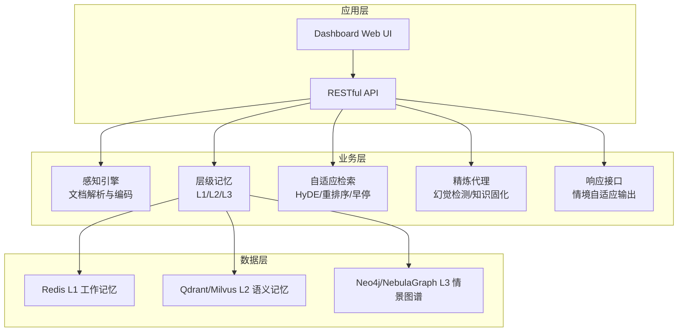
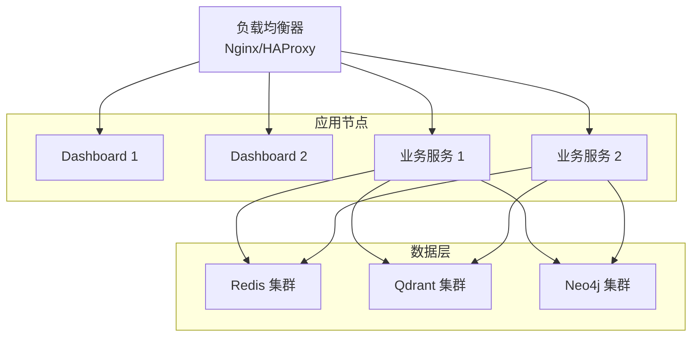
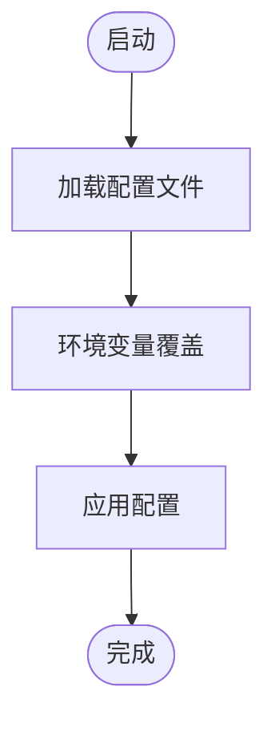
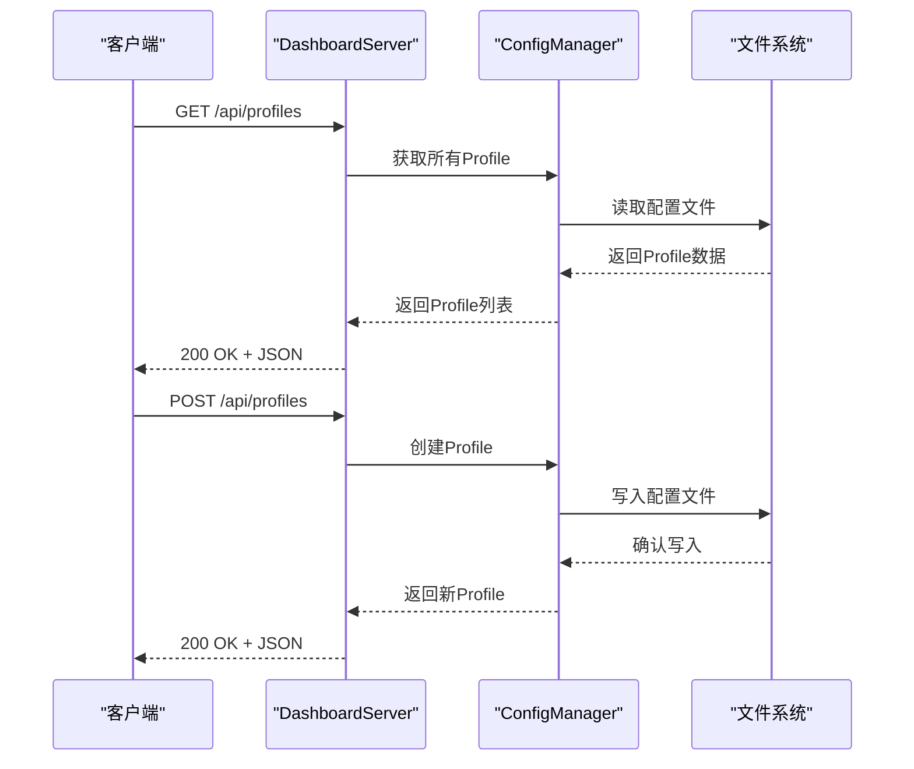
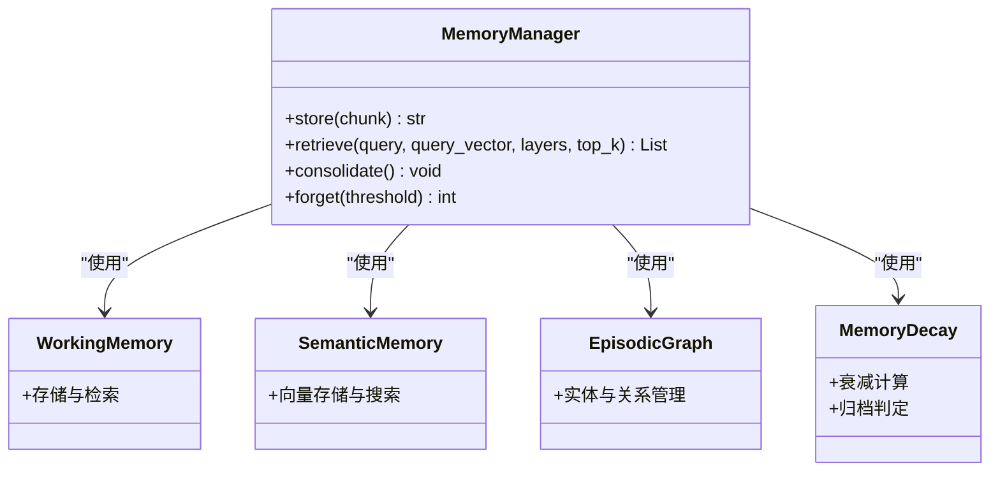
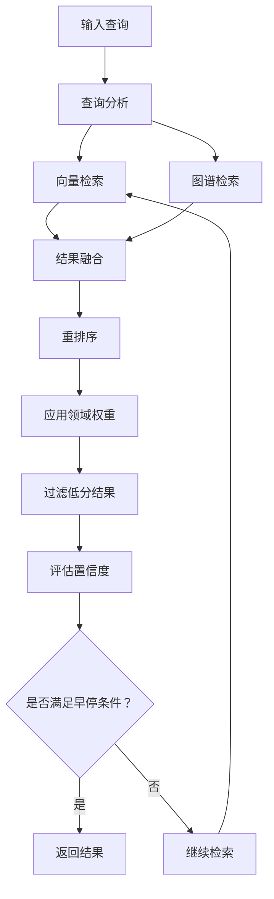
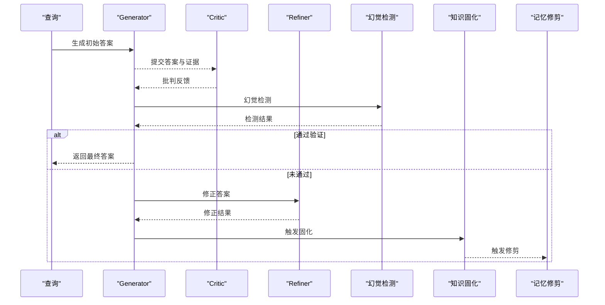
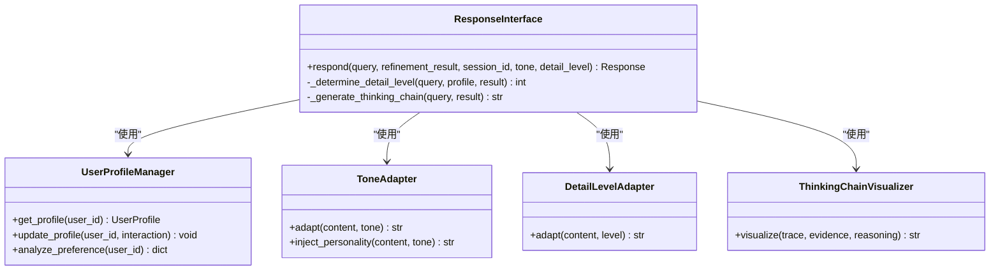
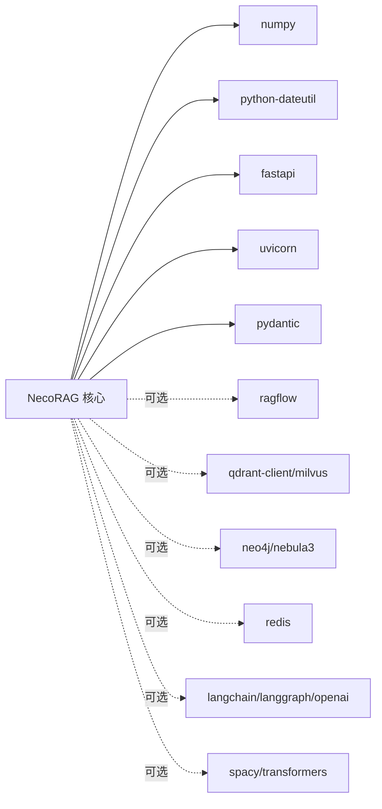

# 生产环境部署

<cite>
**本文档引用的文件**
- [README.md](file://README.md)
- [QUICKSTART.md](file://QUICKSTART.md)
- [pyproject.toml](file://pyproject.toml)
- [requirements.txt](file://requirements.txt)
- [src/core/config.py](file://src/core/config.py)
- [src/dashboard/server.py](file://src/dashboard/server.py)
- [src/dashboard/config_manager.py](file://src/dashboard/config_manager.py)
- [src/dashboard/models.py](file://src/dashboard/models.py)
- [tools/start_dashboard.py](file://tools/start_dashboard.py)
- [src/memory/manager.py](file://src/memory/manager.py)
- [src/retrieval/retriever.py](file://src/retrieval/retriever.py)
- [src/refinement/agent.py](file://src/refinement/agent.py)
- [src/response/interface.py](file://src/response/interface.py)
</cite>

## 目录
1. [简介](#简介)
2. [项目结构](#项目结构)
3. [核心组件](#核心组件)
4. [架构概览](#架构概览)
5. [详细组件分析](#详细组件分析)
6. [依赖分析](#依赖分析)
7. [性能考虑](#性能考虑)
8. [故障排除指南](#故障排除指南)
9. [结论](#结论)
10. [附录](#附录)

## 简介
本文件面向运维团队，提供NecoRAG框架在生产环境中的完整部署指南。内容涵盖硬件要求、软件依赖、网络配置、安全设置、容器化与Kubernetes部署、负载均衡与高可用、容灾备份、环境变量与配置管理、启动脚本使用以及性能调优与资源限制的最佳实践，并配套部署检查清单与验证步骤。

## 项目结构
NecoRAG采用模块化分层架构，核心由感知层、记忆层、检索层、巩固层与交互层组成。Dashboard提供Web配置管理与监控能力，支持Profile配置的创建、切换、导入导出与实时参数调整。

**图表来源**
- [README.md:35-85](file://README.md#L35-L85)
- [src/memory/manager.py:16-47](file://src/memory/manager.py#L16-L47)

**章节来源**
- [README.md:23-85](file://README.md#L23-L85)
- [src/memory/manager.py:16-47](file://src/memory/manager.py#L16-L47)

## 核心组件
- 配置管理：统一的全局配置类与模块配置基类，支持从文件与环境变量加载，提供开发/生产/最小化预设配置。
- Dashboard：基于FastAPI的Web管理界面，提供Profile管理、模块参数配置、统计监控与API接口。
- 记忆层：三层记忆系统（L1工作记忆、L2语义记忆、L3情景图谱），支持衰减与归档。
- 检索层：混合检索与重排序，集成HyDE增强、Novelty重排与早停机制。
- 巩固层：Generator-Critic-Refiner闭环，支持幻觉检测与知识固化。
- 响应层：情境自适应生成与思维链可视化。

**章节来源**
- [src/core/config.py:232-370](file://src/core/config.py#L232-L370)
- [src/dashboard/server.py:43-93](file://src/dashboard/server.py#L43-L93)
- [src/memory/manager.py:16-47](file://src/memory/manager.py#L16-L47)
- [src/retrieval/retriever.py:122-164](file://src/retrieval/retriever.py#L122-L164)
- [src/refinement/agent.py:16-60](file://src/refinement/agent.py#L16-L60)
- [src/response/interface.py:16-54](file://src/response/interface.py#L16-L54)

## 架构概览
生产部署建议采用微服务架构，将Dashboard作为独立服务，业务组件通过API交互；数据层使用外部数据库（Redis/Qdrant/Neo4j）以支持横向扩展与高可用。

**图表来源**
- [README.md:69-75](file://README.md#L69-L75)
- [src/memory/manager.py:23-43](file://src/memory/manager.py#L23-L43)

## 详细组件分析

### 配置管理与环境变量
- 支持从配置文件与环境变量加载，环境变量优先级高于配置文件。
- 关键环境变量前缀为NECORAG，可覆盖LLM、向量数据库、图数据库等配置。
- 提供开发/生产/最小化预设配置，便于快速切换。

**图表来源**
- [src/core/config.py:288-327](file://src/core/config.py#L288-L327)

**章节来源**
- [src/core/config.py:288-327](file://src/core/config.py#L288-L327)
- [src/core/config.py:340-370](file://src/core/config.py#L340-L370)

### Dashboard 部署与API
- 提供RESTful API与Web UI，支持Profile管理、模块参数配置与统计监控。
- 支持CORS配置，便于前端直连。
- 启动脚本支持指定host/port/config-dir参数。

**图表来源**
- [src/dashboard/server.py:94-180](file://src/dashboard/server.py#L94-L180)
- [src/dashboard/config_manager.py:42-74](file://src/dashboard/config_manager.py#L42-L74)

**章节来源**
- [src/dashboard/server.py:43-93](file://src/dashboard/server.py#L43-L93)
- [src/dashboard/server.py:94-180](file://src/dashboard/server.py#L94-L180)
- [src/dashboard/config_manager.py:14-41](file://src/dashboard/config_manager.py#L14-L41)
- [tools/start_dashboard.py:16-51](file://tools/start_dashboard.py#L16-L51)

### 记忆层与数据存储
- L1工作记忆：Redis，支持TTL与容量限制。
- L2语义记忆：Qdrant/Milvus，支持向量检索与索引。
- L3情景图谱：Neo4j/NebulaGraph，支持实体关系网络与多跳推理。
- 记忆衰减与归档：根据权重阈值进行主动遗忘与持久化。

**图表来源**
- [src/memory/manager.py:16-47](file://src/memory/manager.py#L16-L47)

**章节来源**
- [src/memory/manager.py:16-47](file://src/memory/manager.py#L16-L47)

### 检索层与早停机制
- 混合检索：向量检索 + 图谱检索 + 结果融合。
- HyDE增强：生成假设文档提升检索质量。
- 重排序：BGE-Reranker-v2进行精排。
- 早停机制：基于置信度与边际收益快速终止冗余检索。

**图表来源**
- [src/retrieval/retriever.py:177-254](file://src/retrieval/retriever.py#L177-L254)

**章节来源**
- [src/retrieval/retriever.py:122-164](file://src/retrieval/retriever.py#L122-L164)
- [src/retrieval/retriever.py:177-254](file://src/retrieval/retriever.py#L177-L254)

### 巩固层与幻觉检测
- Generator-Critic-Refiner闭环：生成-批判-修正。
- 幻觉检测：基于事实一致性、证据支撑度与逻辑连贯性。
- 知识固化与记忆修剪：异步执行，定期清理低价值记忆。

**图表来源**
- [src/refinement/agent.py:61-129](file://src/refinement/agent.py#L61-L129)

**章节来源**
- [src/refinement/agent.py:16-60](file://src/refinement/agent.py#L16-L60)
- [src/refinement/agent.py:61-129](file://src/refinement/agent.py#L61-L129)

### 响应层与思维链可视化
- 用户画像适配：根据专业水平与交互风格调整语气与详细程度。
- 思维链可视化：展示检索路径、证据来源与推理过程。
- 多模态输出：支持文本/Markdown/HTML格式。

**图表来源**
- [src/response/interface.py:16-54](file://src/response/interface.py#L16-L54)

**章节来源**
- [src/response/interface.py:16-54](file://src/response/interface.py#L16-L54)
- [src/response/interface.py:167-211](file://src/response/interface.py#L167-L211)

## 依赖分析
- Python版本：3.9+
- 核心依赖：numpy、python-dateutil
- Dashboard依赖：fastapi、uvicorn、pydantic
- 可选依赖：文档解析、向量数据库、图数据库、缓存、嵌入模型、LLM集成、NLP工具、aiohttp、python-dotenv、requests

**图表来源**
- [requirements.txt:3-47](file://requirements.txt#L3-L47)

**章节来源**
- [requirements.txt:3-47](file://requirements.txt#L3-L47)
- [pyproject.toml:27-30](file://pyproject.toml#L27-L30)

## 性能考虑
- 检索性能：合理设置top_k、confidence_threshold与rerank_top_k，启用早停机制减少无效计算。
- 记忆层优化：为Redis设置合适的TTL与最大项数，为Qdrant配置合适索引类型与HNSW参数。
- LLM调优：根据延迟与成本平衡temperature与max_tokens，选择合适的嵌入模型维度。
- 并发与资源：为Dashboard与业务服务设置合理的并发数与内存上限，避免资源争用。
- 监控与日志：开启详细日志与性能指标，定期分析慢查询与异常。

[本节为通用指导，无需特定文件引用]

## 故障排除指南
- Dashboard启动失败：检查端口占用，确认host/port参数正确；查看日志定位具体错误。
- 配置加载异常：确认环境变量命名与前缀一致，检查配置文件JSON格式；验证枚举值有效性。
- 记忆层连接失败：核对Redis/Qdrant/Neo4j连接URL与认证信息；确保网络连通性与防火墙放行。
- 检索结果不理想：调整confidence_threshold、rerank_top_k与领域权重因子；启用HyDE与重排序。
- 幻觉检测触发频繁：提高hallucination_threshold或增加证据来源；优化生成提示词。

**章节来源**
- [QUICKSTART.md:245-259](file://QUICKSTART.md#L245-L259)
- [src/core/config.py:288-327](file://src/core/config.py#L288-L327)
- [src/memory/manager.py:23-43](file://src/memory/manager.py#L23-L43)
- [src/retrieval/retriever.py:150-151](file://src/retrieval/retriever.py#L150-L151)

## 结论
通过模块化的配置管理、清晰的组件边界与可扩展的数据层，NecoRAG可在生产环境中实现稳定、高性能与易维护的部署。结合负载均衡、高可用与容灾备份策略，可进一步提升系统的可靠性与可伸缩性。

[本节为总结，无需特定文件引用]

## 附录

### 硬件要求建议
- CPU：至少8核，推荐16核以上
- 内存：至少32GB，推荐64GB以上
- 存储：SSD至少500GB，建议为数据层单独挂载高IO磁盘
- 网络：千兆以太网，内网低延迟

[本节为通用建议，无需特定文件引用]

### 软件依赖安装
- Python 3.9+
- 依赖安装：pip install -r requirements.txt
- Dashboard运行：python tools/start_dashboard.py

**章节来源**
- [requirements.txt:1-13](file://requirements.txt#L1-L13)
- [QUICKSTART.md:5-13](file://QUICKSTART.md#L5-L13)
- [tools/start_dashboard.py:16-51](file://tools/start_dashboard.py#L16-L51)

### 网络配置与安全
- Dashboard监听：默认0.0.0.0:8000，生产环境建议绑定内网IP并启用反向代理
- CORS：允许跨域访问，生产环境建议限制来源域名
- TLS：为Dashboard与业务服务配置HTTPS证书
- 防火墙：仅开放Dashboard与业务服务端口，限制Redis/Qdrant/Neo4j访问范围

**章节来源**
- [src/dashboard/server.py:54-87](file://src/dashboard/server.py#L54-L87)
- [src/dashboard/server.py:239-253](file://src/dashboard/server.py#L239-L253)

### 环境变量配置清单
- NECORAG_DEBUG：布尔值，启用调试模式
- NECORAG_LLM_PROVIDER：LLM提供商（mock/openai/ollama/vllm/azure/anthropic）
- NECORAG_LLM_MODEL：模型名称
- NECORAG_LLM_API_KEY：API密钥（按提供商命名）
- NECORAG_VECTOR_DB：向量数据库提供商（memory/qdrant/milvus/chroma）
- NECORAG_VECTOR_DB_URL：向量数据库连接URL
- NECORAG_GRAPH_DB：图数据库提供商（memory/neo4j/nebula）
- NECORAG_GRAPH_DB_URL：图数据库连接URL

**章节来源**
- [src/core/config.py:288-327](file://src/core/config.py#L288-L327)

### 配置文件管理
- Profile创建与激活：通过Dashboard或API创建并激活配置
- 参数更新：支持逐模块参数更新与批量导入导出
- 统计监控：实时显示文档总数、块总数、查询总数与活动会话

**章节来源**
- [src/dashboard/config_manager.py:42-74](file://src/dashboard/config_manager.py#L42-L74)
- [src/dashboard/server.py:181-236](file://src/dashboard/server.py#L181-L236)

### 启动脚本使用
- start_dashboard.py：支持host/port/config-dir参数
- 支持Windows批处理与Linux/Mac Shell脚本启动方式

**章节来源**
- [tools/start_dashboard.py:16-51](file://tools/start_dashboard.py#L16-L51)
- [README.md:138-152](file://README.md#L138-L152)

### Docker容器化部署方案
- 基础镜像：python:3.9-slim
- 依赖安装：COPY requirements.txt && RUN pip install -r requirements.txt
- 应用启动：CMD ["python", "tools/start_dashboard.py"]
- 端口暴露：EXPOSE 8000
- 环境变量：通过docker run -e传入NECORAG_*变量
- 数据卷：挂载配置目录与日志目录

[本节为通用方案，无需特定文件引用]

### Kubernetes集群部署指南
- Deployment：Dashboard与业务服务分别部署
- Service：ClusterIP或LoadBalancer暴露服务
- ConfigMap：存放配置文件与环境变量
- Secret：存放API密钥与数据库密码
- PersistentVolume：为配置与日志提供持久化存储
- HPA：根据CPU/内存或自定义指标自动扩缩容

[本节为通用方案，无需特定文件引用]

### 负载均衡、高可用与容灾
- 负载均衡：Nginx/HAProxy轮询或健康检查
- 高可用：Dashboard与业务服务多副本部署，共享配置中心
- 容灾：数据层使用集群模式，定期备份与异地容灾演练

[本节为通用方案，无需特定文件引用]

### 性能调优与资源限制最佳实践
- Dashboard：设置并发worker数与连接池大小，限制内存使用
- 业务服务：根据查询复杂度调整top_k与重排序参数，启用早停
- 数据层：为Redis设置合理的TTL与淘汰策略，为Qdrant配置索引参数
- LLM：根据SLA设定超时与重试策略，使用流式响应降低首字延迟

[本节为通用指导，无需特定文件引用]

### 部署检查清单
- 系统资源：CPU/内存/存储满足最低要求
- 依赖安装：requirements.txt中依赖全部安装成功
- 环境变量：NECORAG_*变量配置正确且生效
- 网络连通：Dashboard与数据层服务间网络连通
- 安全配置：TLS、CORS、防火墙规则已配置
- 高可用：多副本部署与健康检查已启用
- 监控：日志与性能指标采集已部署
- 备份：数据层与配置文件定期备份策略

[本节为通用清单，无需特定文件引用]

### 验证步骤
- Dashboard可用性：访问http://host:8000与/docs，确认UI与API正常
- Profile管理：创建/激活/更新Profile，验证参数生效
- 检索验证：构造查询，确认检索结果与早停机制正常
- 记忆层验证：确认L1/L2/L3存储与查询正常
- 幻觉检测：构造容易产生幻觉的问题，确认检测与修正流程
- 性能验证：压测Dashboard与业务服务，观察延迟与吞吐

**章节来源**
- [README.md:138-157](file://README.md#L138-L157)
- [src/dashboard/server.py:379-392](file://src/dashboard/server.py#L379-L392)