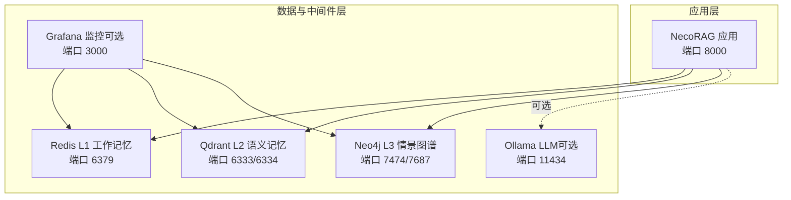
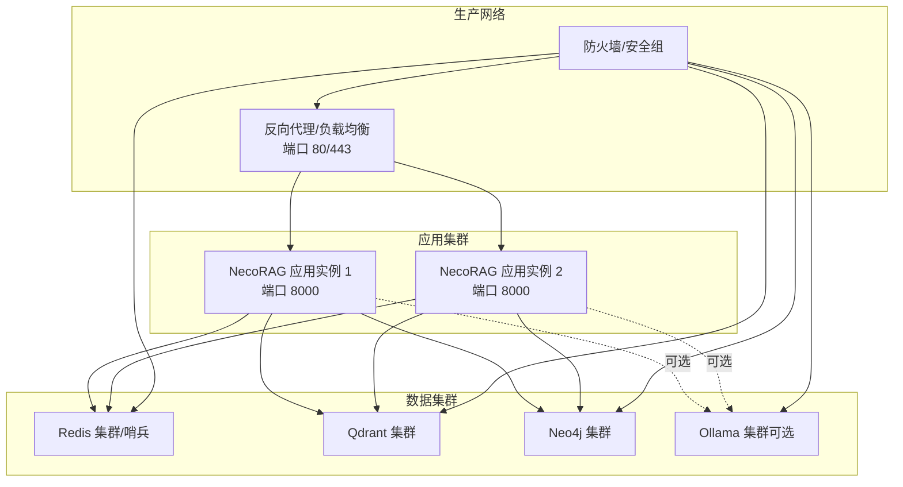
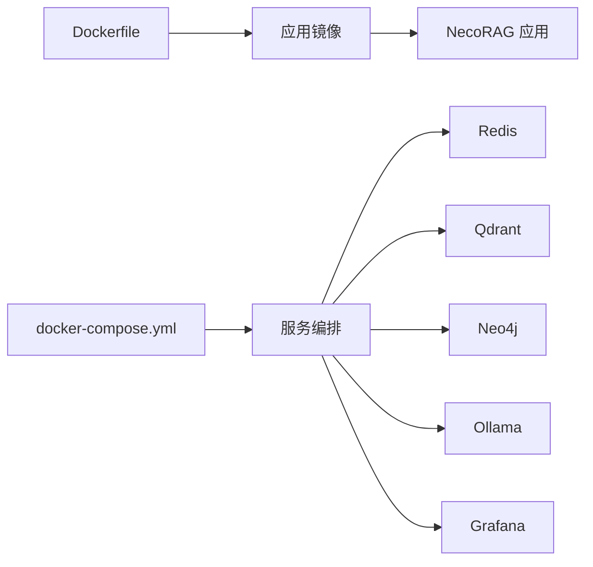

# 生产环境配置

<cite>
**本文引用的文件**
- [README.md](file://README.md)
- [requirements.txt](file://requirements.txt)
- [opdev/docker-compose.yml](file://opdev/docker-compose.yml)
- [opdev/docker-compose.dev.yml](file://opdev/docker-compose.dev.yml)
- [opdev/docker-compose.minimal.yml](file://opdev/docker-compose.minimal.yml)
- [opdev/Dockerfile](file://opdev/Dockerfile)
- [opdev/scripts/start.sh](file://opdev/scripts/start.sh)
- [opdev/scripts/stop.sh](file://opdev/scripts/stop.sh)
- [src/core/config.py](file://src/core/config.py)
- [src/dashboard/server.py](file://src/dashboard/server.py)
- [src/dashboard/config_manager.py](file://src/dashboard/config_manager.py)
- [src/dashboard/models.py](file://src/dashboard/models.py)
- [tools/start_dashboard.py](file://tools/start_dashboard.py)
</cite>

## 目录
1. [引言](#引言)
2. [项目结构](#项目结构)
3. [核心组件](#核心组件)
4. [架构总览](#架构总览)
5. [详细组件分析](#详细组件分析)
6. [依赖分析](#依赖分析)
7. [性能考虑](#性能考虑)
8. [故障排查指南](#故障排查指南)
9. [结论](#结论)
10. [附录](#附录)

## 引言
本文件面向生产环境部署与运维，围绕系统要求、硬件配置建议、环境变量与敏感信息管理、网络安全、存储与持久化、性能调优与资源限制等方面，结合代码库中的配置与编排文件，给出可落地的实施指南。目标是在满足功能需求的同时，确保系统的稳定性、安全性与可维护性。

## 项目结构
NecoRAG 采用“五层认知”架构，生产部署围绕应用容器、缓存、向量数据库、图数据库以及可选的本地 LLM 与监控组件展开。项目通过 Docker Compose 提供统一编排，并通过 Dashboard 提供配置管理与监控入口。

图表来源
- [opdev/docker-compose.yml:4-164](file://opdev/docker-compose.yml#L4-L164)

章节来源
- [README.md:35-85](file://README.md#L35-L85)
- [opdev/docker-compose.yml:1-164](file://opdev/docker-compose.yml#L1-L164)

## 核心组件
- 应用容器：基于 Python 3.11 Slim，暴露 8000 端口，内置健康检查，启动 Dashboard 服务。
- 缓存（L1 工作记忆）：Redis，提供会话上下文与意图轨迹的短期存储。
- 向量数据库（L2 语义记忆）：Qdrant，提供高维向量检索与索引能力。
- 图数据库（L3 情景图谱）：Neo4j，提供实体关系网络与多跳推理。
- 本地 LLM（可选）：Ollama，提供本地推理能力；可按需启用。
- 监控（可选）：Grafana，提供可视化与告警能力。

章节来源
- [opdev/Dockerfile:1-39](file://opdev/Dockerfile#L1-L39)
- [opdev/docker-compose.yml:4-164](file://opdev/docker-compose.yml#L4-L164)
- [requirements.txt:1-71](file://requirements.txt#L1-L71)

## 架构总览
生产环境推荐采用“容器化 + 编排 + 外部化配置”的方式，将数据库与缓存作为独立服务，应用通过环境变量与配置文件进行连接与参数化。

图表来源
- [opdev/docker-compose.yml:4-164](file://opdev/docker-compose.yml#L4-L164)

## 详细组件分析

### 系统要求与硬件配置建议
- CPU
  - 小型部署：2 核 4GB 内存可满足轻量场景。
  - 中型部署：4 核 8GB 内存起步，配合 SSD 存储。
  - 大型部署：8 核 16GB+，并行查询与检索密集场景建议更高规格。
- 内存
  - 应用进程：建议预留 1-2GB 可用内存余量。
  - 缓存与数据库：Redis/Qdrant/Neo4j 建议分配占物理内存 50%-70%，并开启持久化与快照。
- 存储
  - 日志与配置：建议单独分区，容量按月估算，保留 30 天滚动日志。
  - 数据卷：Redis/Qdrant/Neo4j 建议使用 SSD，预留 2-3 倍增长空间。
- 网络带宽
  - 单节点内网：千兆以太网即可满足大多数场景。
  - 跨机房/跨区域：建议万兆或更高，降低延迟与抖动。

说明
- 以上为通用建议，具体需结合业务规模、并发量与数据体量评估。

### 环境变量与敏感信息管理
- 环境变量加载顺序（优先级）
  - 配置文件（JSON）< 环境变量 < 默认值
- 关键环境变量（示例）
  - 应用与数据库连接
    - NECORAG_DEBUG：布尔开关
    - NECORAG_LLM_PROVIDER：LLM 提供商（mock/openai/ollama/vllm/azure/anthropic）
    - NECORAG_VECTOR_DB：向量数据库提供商（qdrant/memory/chroma/milvus）
    - NECORAG_GRAPH_DB：图数据库提供商（neo4j/memory/nebula）
    - REDIS_URL：Redis 连接串
  - 服务端口映射（容器内固定，宿主可变）
    - REDIS_PORT、QDRANT_HTTP_PORT、QDRANT_GRPC_PORT、NEO4J_HTTP_PORT、NEO4J_BOLT_PORT、OLLAMA_PORT、GRAFANA_PORT、NECORAG_PORT
  - 数据库认证
    - NEO4J_AUTH：用户名/密码
    - GRAFANA_USER/GRAFANA_PASSWORD：管理员账号与密码
- 敏感信息管理
  - API 密钥与第三方凭证通过环境变量注入，避免硬编码于镜像或配置文件。
  - 在 CI/CD 中使用受控的密钥管理服务（如 KMS/Vault），仅在部署时注入。
  - 配置文件仅存放非敏感参数，必要时进行加密存储并在启动前解密。

章节来源
- [src/core/config.py:326-366](file://src/core/config.py#L326-L366)
- [opdev/docker-compose.yml:130-139](file://opdev/docker-compose.yml#L130-L139)

### 网络安全配置
- 防火墙与安全组
  - 仅开放对外必需端口：NecoRAG Dashboard（8000）、Redis（6379）、Qdrant（6333/6334）、Neo4j（7474/7687）、Ollama（11434）、Grafana（3000）。
  - 内部服务间通信建议使用专用子网或容器网络，限制外联出口。
- SSL/TLS
  - 在反向代理层统一启用 HTTPS，证书由可信 CA 签发，定期轮换。
  - Dashboard 与数据库连接建议启用 TLS（Redis/Qdrant/Neo4j/Neo4j Bolt）。
- 访问控制
  - Grafana 管理员账户禁用自动注册，使用强口令与多因素认证。
  - Neo4j 默认凭据需立即变更，限制远程登录来源 IP。
  - 对外 API 限流与白名单策略，防止滥用。

### 存储配置与数据持久化
- 卷挂载与数据目录
  - Redis：持久化数据卷（/data），建议启用 RDB/AOF。
  - Qdrant：存储卷（/qdrant/storage）与快照卷（/qdrant/snapshots），定期备份。
  - Neo4j：数据卷（/data）、日志卷（/logs）、插件卷（/plugins）。
  - 应用：应用数据卷（/app/data）、配置卷（/app/configs）。
- 备份策略
  - 数据库：全量 + 增量备份，周期性校验与异地容灾。
  - 配置：版本化管理（Git），变更审批与回滚。
- 数据迁移
  - 通过数据库官方工具进行迁移（如 Redis RDB、Qdrant 快照、Neo4j 数据目录迁移）。
  - 迁移窗口内暂停写入，完成后验证一致性与性能回归。

章节来源
- [opdev/docker-compose.yml:12-158](file://opdev/docker-compose.yml#L12-L158)

### 性能调优与资源限制
- 应用层
  - Dashboard 使用 Uvicorn，建议根据 CPU 核数设置 workers 数量，合理设置 keepalive 与并发上限。
  - 启用健康检查与优雅关闭，避免突发流量导致的重启风暴。
- 缓存层（Redis）
  - 合理设置 TTL、最大内存与淘汰策略，监控命中率与内存使用。
  - 使用连接池与长连接，减少握手开销。
- 向量数据库（Qdrant）
  - 索引类型与向量维度影响查询性能，建议在预生产环境压测后确定参数。
  - 启用快照与副本，保障可用性与恢复速度。
- 图数据库（Neo4j）
  - 调整堆大小与事务超时，限制复杂查询的执行时间。
  - 使用索引与约束，优化常见查询路径。
- LLM（Ollama）
  - 按需启用 GPU，合理分配显存；在高并发场景建议使用外部推理服务或队列化处理。

章节来源
- [opdev/Dockerfile:33-35](file://opdev/Dockerfile#L33-L35)
- [opdev/docker-compose.yml:58-63](file://opdev/docker-compose.yml#L58-L63)
- [src/core/config.py:391-396](file://src/core/config.py#L391-L396)

## 依赖分析
- 应用依赖
  - FastAPI/Uvicorn：提供 Dashboard API 与 Web UI。
  - Python 核心库：NumPy、dateutil 等。
  - 可选深度学习与 NLP 工具：按需启用。
- 数据库与中间件
  - Redis/Qdrant/Neo4j/Ollama/Grafana：通过 Docker Compose 统一编排。
- 配置与编排
  - Dockerfile 定义镜像与启动命令；docker-compose.yml 定义服务、端口、卷与环境变量；脚本提供启动/停止自动化。

图表来源
- [opdev/Dockerfile:1-39](file://opdev/Dockerfile#L1-L39)
- [opdev/docker-compose.yml:1-164](file://opdev/docker-compose.yml#L1-L164)

章节来源
- [requirements.txt:1-71](file://requirements.txt#L1-L71)
- [opdev/docker-compose.yml:1-164](file://opdev/docker-compose.yml#L1-L164)

## 性能考虑
- 查询路径优化
  - 检索层：Top-K、重排序与早停阈值需结合业务调优，避免无效计算。
  - 记忆层：工作记忆 TTL 与衰减阈值影响召回质量与性能平衡。
- 并发与资源
  - 应用实例水平扩展，结合反向代理实现会话粘性或无状态化。
  - 数据库连接池与超时设置，避免阻塞与资源耗尽。
- 监控与告警
  - Grafana 面板监控 CPU/内存/磁盘/网络与数据库指标，设置阈值告警。
  - Dashboard 提供统计信息接口，便于观测整体运行状态。

章节来源
- [src/core/config.py:158-181](file://src/core/config.py#L158-L181)
- [src/core/config.py:134-156](file://src/core/config.py#L134-L156)
- [src/dashboard/server.py:231-247](file://src/dashboard/server.py#L231-L247)

## 故障排查指南
- 健康检查
  - 应用：/api/stats 健康探针，失败时自动重启。
  - Redis/Qdrant/Neo4j/Ollama：Compose 健康检查，失败时重试直至就绪。
- 常见问题定位
  - 端口冲突：检查 REDIS_PORT/QDRANT_HTTP_PORT/NEO4J_HTTP_PORT 等映射是否冲突。
  - 认证失败：核对 NEO4J_AUTH、GRAFANA_USER/PASSWORD 等环境变量。
  - 依赖不可达：确认容器网络与服务名（如 http://qdrant:6334）正确。
- 日志与审计
  - 应用日志输出至标准输出，结合容器平台日志收集。
  - Grafana 仪表盘记录关键指标，辅助定位瓶颈。

章节来源
- [opdev/Dockerfile:33-35](file://opdev/Dockerfile#L33-L35)
- [opdev/docker-compose.yml:16-95](file://opdev/docker-compose.yml#L16-L95)
- [src/dashboard/server.py:231-247](file://src/dashboard/server.py#L231-L247)

## 结论
通过容器化编排与外部化配置，NecoRAG 可在生产环境中实现高可用、可扩展与易维护。建议以“最小可用”为基础，逐步引入监控、备份与安全加固，持续以压测与指标驱动优化，确保在高负载下的稳定运行。

## 附录

### 部署与运维脚本
- 启动脚本
  - 支持完整模式、开发模式、最小模式与带 LLM 模式，自动检查 Docker 与 .env。
- 停止脚本
  - 支持普通停止与清理数据卷两种模式，谨慎使用清理模式。

章节来源
- [opdev/scripts/start.sh:1-101](file://opdev/scripts/start.sh#L1-L101)
- [opdev/scripts/stop.sh:1-36](file://opdev/scripts/stop.sh#L1-L36)

### Dashboard API 一览（生产常用）
- 配置管理
  - GET /api/profiles：列出所有 Profile
  - POST /api/profiles：创建 Profile
  - PUT /api/profiles/{id}：更新 Profile
  - GET /api/profiles/{id}：获取指定 Profile
  - POST /api/profiles/{id}/activate：激活 Profile
  - GET /api/profiles/{id}/modules/{module}：获取模块参数
  - PUT /api/profiles/{id}/modules/{module}：更新模块参数
- 统计信息
  - GET /api/stats：获取统计信息
  - POST /api/stats/reset：重置统计信息

章节来源
- [src/dashboard/server.py:111-191](file://src/dashboard/server.py#L111-L191)
- [src/dashboard/server.py:231-247](file://src/dashboard/server.py#L231-L247)