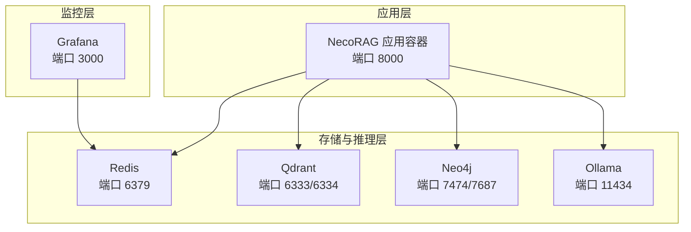
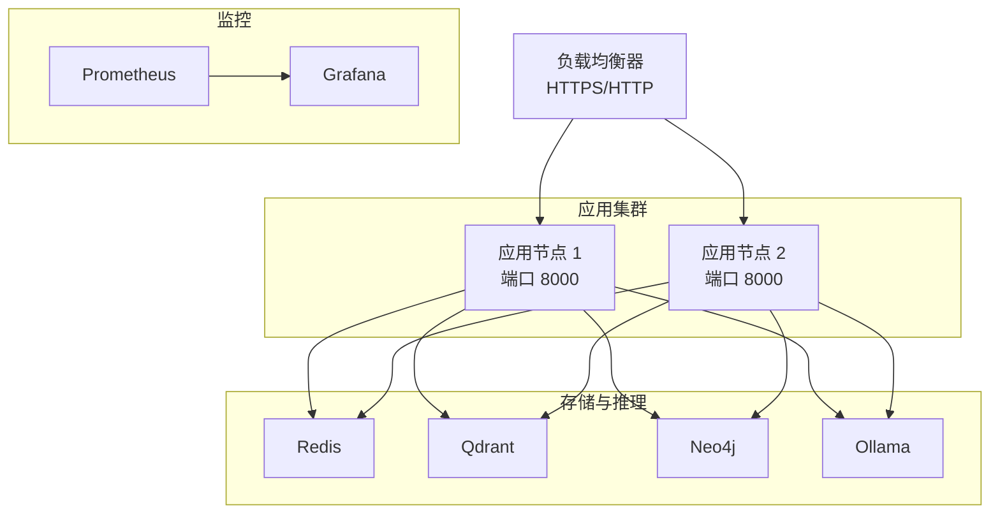
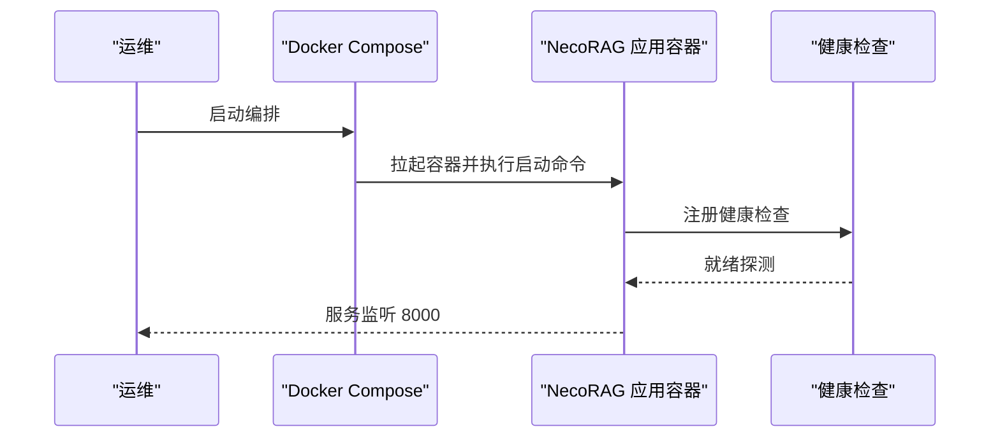
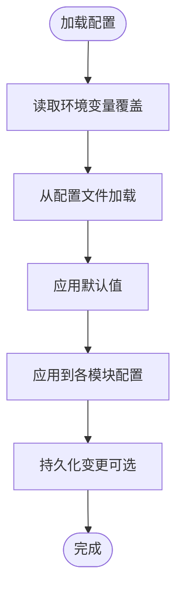
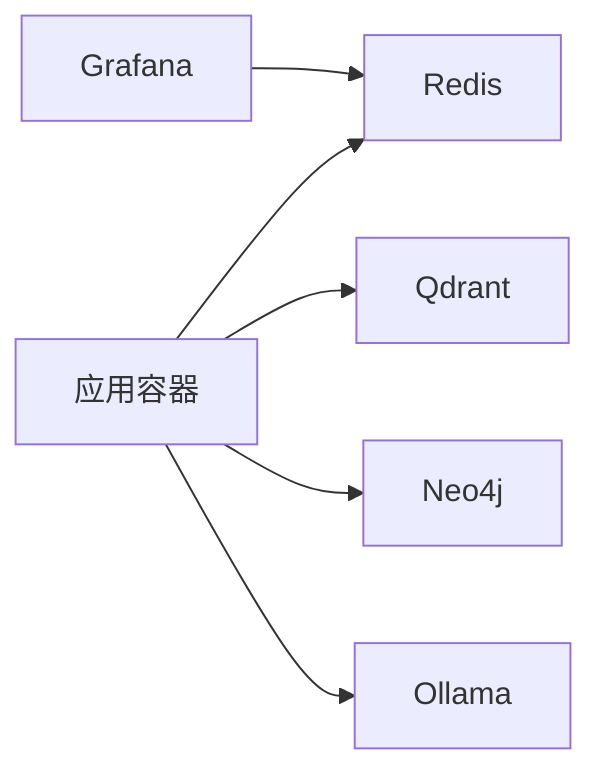

# 生产环境配置

<cite>
**本文引用的文件**
- [Dockerfile](file://devops/Dockerfile)
- [docker-compose.yml](file://devops/docker-compose.yml)
- [docker-compose.dev.yml](file://devops/docker-compose.dev.yml)
- [docker-compose.minimal.yml](file://devops/docker-compose.minimal.yml)
- [start.sh](file://devops/scripts/start.sh)
- [config.py](file://src/core/config.py)
- [config.py](file://src/security/config.py)
- [config.py](file://src/monitoring/config.py)
- [config_manager.py](file://src/dashboard/config_manager.py)
- [2acb71bc-e452-4608-b230-cf555add4034.json](file://configs/2acb71bc-e452-4608-b230-cf555add4034.json)
</cite>

## 目录
1. [引言](#引言)
2. [项目结构](#项目结构)
3. [核心组件](#核心组件)
4. [架构总览](#架构总览)
5. [详细组件分析](#详细组件分析)
6. [依赖分析](#依赖分析)
7. [性能考虑](#性能考虑)
8. [故障排查指南](#故障排查指南)
9. [结论](#结论)
10. [附录](#附录)

## 引言
本指南面向生产环境部署与运维团队，围绕 NecoRAG 的容器化架构与多层认知系统，提供从关键配置参数、性能调优、安全加固到监控告警、负载均衡与高可用设计的完整实践建议。文档结合仓库中的配置管理、容器编排与仪表板配置能力，给出可落地的部署检查清单与基准测试方法，帮助构建稳定可靠的生产环境。

## 项目结构
NecoRAG 采用分层模块化架构与容器化编排，核心组件包括：
- 应用容器：基于 Python 3.11 的轻量镜像，内置健康检查与启动命令
- 存储与推理后端：Redis、Qdrant、Neo4j、Ollama
- 监控与可视化：Grafana
- 配置管理：统一的全局配置类、模块化配置与仪表板配置文件

图表来源
- [docker-compose.yml:4-164](file://devops/docker-compose.yml#L4-L164)

章节来源
- [Dockerfile:1-39](file://devops/Dockerfile#L1-L39)
- [docker-compose.yml:1-164](file://devops/docker-compose.yml#L1-L164)

## 核心组件
- 全局配置系统：提供 LLM、感知、记忆、检索、巩固、响应、领域权重与知识演化等模块化配置，并支持从文件与环境变量加载，便于生产环境参数化。
- 安全配置：集中管理 JWT、OAuth2、速率限制、CSRF/XSS 保护与密码强度策略。
- 监控配置：定义指标采集、健康检查、告警阈值与通知渠道，支撑生产可观测性。
- 仪表板配置：通过 JSON Profile 管理各模块参数，支持导入导出与活动配置切换。

章节来源
- [config.py:275-420](file://src/core/config.py#L275-L420)
- [config.py:11-92](file://src/security/config.py#L11-L92)
- [config.py:27-117](file://src/monitoring/config.py#L27-L117)
- [config_manager.py:14-315](file://src/dashboard/config_manager.py#L14-L315)

## 架构总览
下图展示生产环境典型拓扑：应用容器通过内网网络访问存储与推理后端；监控系统独立部署并通过指标端点采集数据；负载均衡器前置于应用，实现高可用与流量分发。

## 详细组件分析

### 应用容器与启动流程
- 基础镜像与健康检查：使用 Python 3.11 slim 镜像，暴露 8000 端口，内置 HTTP 健康检查，确保容器就绪。
- 启动命令：通过工具脚本启动仪表盘服务，绑定 0.0.0.0 以便外部访问。
- 环境变量：通过 docker-compose 注入 LLM、向量库、图数据库与 Redis 的连接信息。

图表来源
- [Dockerfile:33-39](file://devops/Dockerfile#L33-L39)
- [docker-compose.yml:118-147](file://devops/docker-compose.yml#L118-L147)

章节来源
- [Dockerfile:1-39](file://devops/Dockerfile#L1-L39)
- [docker-compose.yml:118-147](file://devops/docker-compose.yml#L118-L147)
- [start.sh:1-101](file://devops/scripts/start.sh#L1-L101)

### 数据库连接池与缓存策略
- Redis：作为 L1 工作记忆后端，建议在生产中开启持久化与合理内存上限，配合 TTL 控制会话生命周期。
- Qdrant：作为 L2 语义记忆后端，建议配置索引类型、分片与副本，结合查询超时与重试策略提升稳定性。
- Neo4j：作为 L3 情景图谱后端，建议启用 APOC 扩展与合适的堆大小，控制并发与查询复杂度。
- 缓存策略：利用 Redis TTL 与 LRU 淘汰，结合应用层缓存命中率阈值进行监控与调优。

章节来源
- [docker-compose.yml:6-71](file://devops/docker-compose.yml#L6-L71)
- [config.py:134-156](file://src/core/config.py#L134-L156)
- [config.py:52-64](file://src/monitoring/config.py#L52-L64)

### 会话管理机制
- 会话存储：使用 Redis 管理会话与短期上下文，设置合理的 TTL 与最大项数，避免内存膨胀。
- 会话清理：结合记忆层衰减阈值与归档策略，定期清理低价值会话。
- 会话安全：结合安全配置中的 CSRF/XSS 保护与速率限制，降低会话劫持与滥用风险。

章节来源
- [config.py:136-142](file://src/core/config.py#L136-L142)
- [config.py:56-67](file://src/security/config.py#L56-L67)

### 日志级别与监控指标
- 日志目录：应用容器挂载日志目录，建议生产中使用结构化日志与集中式日志收集。
- 指标端点：监控配置提供指标采集端口与路径，建议 Prometheus 抓取并建立 Grafana 仪表盘。
- 健康检查：应用与后端均配置健康检查，保障自动恢复与负载均衡探活。

章节来源
- [Dockerfile:27-35](file://devops/Dockerfile#L27-L35)
- [docker-compose.yml:16-96](file://devops/docker-compose.yml#L16-L96)
- [config.py:27-51](file://src/monitoring/config.py#L27-L51)

### 告警阈值配置
- 系统资源：CPU、内存、磁盘使用率的警告与严重阈值，结合应用特定指标如 RAG 响应时间、API 错误率与缓存命中率。
- 通知渠道：支持控制台、邮件、Webhook、Slack 等通知方式，建议生产中至少启用邮件或 Webhook。

章节来源
- [config.py:52-100](file://src/monitoring/config.py#L52-L100)

### 负载均衡与反向代理
- 负载均衡器：建议在应用前放置硬件或软件负载均衡器，启用健康检查与会话亲和（可选）。
- 反向代理：通过反向代理统一入口，实现 HTTPS 终止、压缩与限流。
- SSL 证书：由反向代理负责证书管理与续期，应用容器保持内网通信。

（本节为概念性说明，无需代码映射）

### 高可用与灾难恢复
- 多实例部署：应用至少两节点，结合健康检查与自动重启策略。
- 数据持久化：Redis、Qdrant、Neo4j、Grafana 均配置卷持久化，定期快照与异地备份。
- 故障演练：定期进行故障注入与切换演练，验证备份与恢复流程。

（本节为概念性说明，无需代码映射）

### 配置管理与参数化
- 全局配置：通过环境变量覆盖 LLM 提供商、向量库与图数据库等关键参数。
- 模块化配置：感知、记忆、检索、巩固、响应等模块均可独立调整。
- 仪表板配置：通过 JSON Profile 管理各模块参数，支持导入导出与活动配置切换。

图表来源
- [config.py:338-378](file://src/core/config.py#L338-L378)
- [config_manager.py:290-315](file://src/dashboard/config_manager.py#L290-L315)

章节来源
- [config.py:338-378](file://src/core/config.py#L338-L378)
- [config_manager.py:14-315](file://src/dashboard/config_manager.py#L14-L315)
- [2acb71bc-e452-4608-b230-cf555add4034.json:1-101](file://configs/2acb71bc-e452-4608-b230-cf555add4034.json#L1-L101)

## 依赖分析
- 组件耦合：应用容器依赖 Redis、Qdrant、Neo4j、Ollama；监控容器依赖 Redis 以提供数据源。
- 外部依赖：LLM 提供商（OpenAI、Ollama、vLLM 等）、第三方 OAuth2 提供商。
- 环境变量契约：docker-compose 中定义了关键环境变量，需在生产中补齐。

图表来源
- [docker-compose.yml:4-164](file://devops/docker-compose.yml#L4-L164)

章节来源
- [docker-compose.yml:4-164](file://devops/docker-compose.yml#L4-L164)

## 性能考虑
- LLM 推理：选择合适的模型与温度、最大令牌数，结合 Ollama 的 GPU 资源预留（如需）。
- 检索与重排序：启用 HyDE 与重排序，合理设置 top-k 与置信度阈值，平衡准确率与延迟。
- 缓存与会话：通过 Redis TTL 与 LRU 控制内存占用，监控缓存命中率并动态调参。
- 存储性能：Qdrant 与 Neo4j 的索引与副本配置直接影响查询性能，建议压测后确定最优参数。

（本节为通用指导，无需具体文件分析）

## 故障排查指南
- 健康检查失败：检查应用与后端容器的健康检查命令与端口可达性。
- 配置加载异常：确认环境变量命名与值格式，核对配置文件路径与权限。
- 监控不可用：检查指标端点与抓取间隔，确认通知渠道配置正确。
- 容器启动失败：查看容器日志与启动命令，确认依赖服务已就绪。

章节来源
- [Dockerfile:33-39](file://devops/Dockerfile#L33-L39)
- [docker-compose.yml:16-96](file://devops/docker-compose.yml#L16-L96)
- [config.py:36-44](file://src/monitoring/config.py#L36-L44)

## 结论
通过容器化编排与模块化配置管理，NecoRAG 可在生产环境中实现高可用、可观测与可扩展的部署。建议结合本文提供的参数化清单、性能调优与安全加固建议，逐步完善监控告警与灾难恢复体系，确保系统稳定运行。

## 附录

### 生产环境配置清单
- 基础设施
  - 负载均衡器与反向代理（HTTPS 终止、压缩、限流）
  - SSL 证书管理与自动续期
  - 网络隔离与内网通信（应用与后端在同一桥接网络）
- 应用容器
  - 端口映射与健康检查
  - 环境变量：LLM 提供商、API 基础地址、向量库与图数据库连接
  - 日志目录挂载与轮转策略
- 存储与推理
  - Redis：持久化、内存上限、TTL 与最大项数
  - Qdrant：索引类型、分片与副本、快照策略
  - Neo4j：堆大小、APOC 扩展、认证与安全策略
  - Ollama：GPU 资源预留（可选）
- 监控与告警
  - 指标采集端口与路径
  - 健康检查间隔与超时
  - 告警阈值：CPU/内存/磁盘、RAG 响应时间、API 错误率、缓存命中率
  - 通知渠道：邮件/Slack/Webhook
- 安全加固
  - JWT 密钥、算法与过期时间
  - OAuth2 客户端凭据（GitHub/Google）
  - 速率限制、CSRF/XSS 保护、允许的来源
  - 密码强度策略
- 配置管理
  - 全局配置文件与环境变量覆盖
  - 仪表板配置 Profile 的导入导出与活动切换
  - 参数验证与版本化管理

章节来源
- [docker-compose.yml:4-164](file://devops/docker-compose.yml#L4-L164)
- [config.py:338-378](file://src/core/config.py#L338-L378)
- [config.py:17-84](file://src/security/config.py#L17-L84)
- [config.py:72-100](file://src/monitoring/config.py#L72-L100)
- [config_manager.py:290-315](file://src/dashboard/config_manager.py#L290-L315)
- [2acb71bc-e452-4608-b230-cf555add4034.json:1-101](file://configs/2acb71bc-e452-4608-b230-cf555add4034.json#L1-L101)

### 部署检查清单
- 环境准备
  - Docker 与 Compose 正常运行
  - .env 文件存在且包含必要环境变量
- 服务启动
  - 应用容器健康检查通过
  - 后端服务（Redis/Qdrant/Neo4j/Ollama）健康检查通过
  - 监控容器（Grafana/Prometheus）正常运行
- 连通性验证
  - 应用可访问后端服务
  - 指标端点可被抓取
- 安全与合规
  - JWT 密钥已替换
  - OAuth2 凭据已配置
  - 速率限制与跨域策略符合要求
- 备份与恢复
  - 卷快照与备份策略已制定并验证

章节来源
- [start.sh:28-44](file://devops/scripts/start.sh#L28-L44)
- [docker-compose.yml:16-96](file://devops/docker-compose.yml#L16-L96)

### 性能基准测试方法
- 基准场景
  - 单用户连续检索与对话，记录响应时间分布
  - 多用户并发请求，观察错误率与吞吐量
  - 大规模数据注入后的检索延迟与准确性
- 指标采集
  - 应用侧：RAG 响应时间、API 错误率、缓存命中率
  - 系统侧：CPU/内存/磁盘使用率、网络 I/O
- 调优步骤
  - 逐步调整 LLM 温度与令牌数、检索 top-k 与重排序参数
  - 优化 Redis TTL 与 Qdrant 索引配置
  - 根据监控阈值动态调整资源配额

（本节为通用指导，无需具体文件分析）