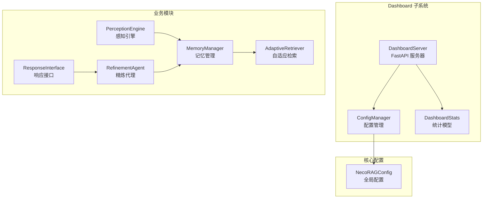
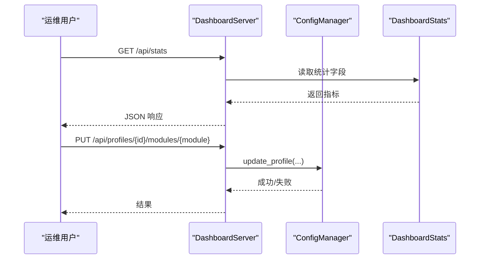
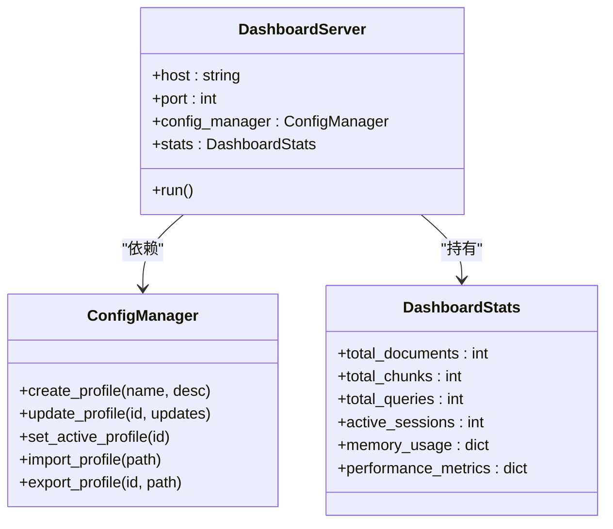
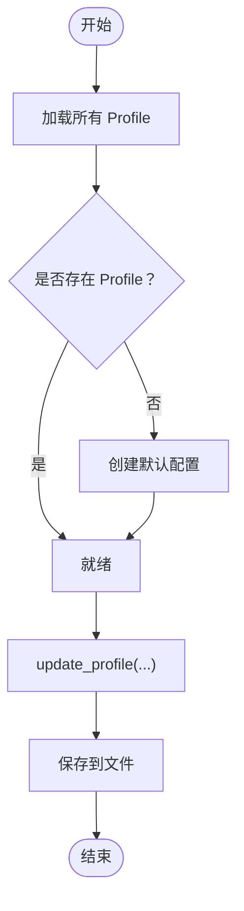
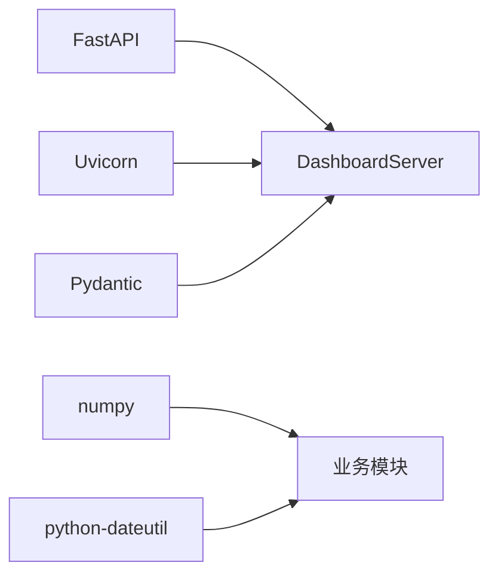

# 监控与日志管理

<cite>
**本文引用的文件**
- [src/dashboard/server.py](file://src/dashboard/server.py)
- [src/dashboard/dashboard.py](file://src/dashboard/dashboard.py)
- [src/dashboard/models.py](file://src/dashboard/models.py)
- [src/dashboard/config_manager.py](file://src/dashboard/config_manager.py)
- [DASHBOARD_GUIDE.md](file://DASHBOARD_GUIDE.md)
- [src/core/config.py](file://src/core/config.py)
- [src/memory/manager.py](file://src/memory/manager.py)
- [src/retrieval/retriever.py](file://src/retrieval/retriever.py)
- [src/perception/engine.py](file://src/perception/engine.py)
- [src/refinement/agent.py](file://src/refinement/agent.py)
- [src/response/interface.py](file://src/response/interface.py)
- [requirements.txt](file://requirements.txt)
- [pyproject.toml](file://pyproject.toml)
</cite>

## 目录
1. [简介](#简介)
2. [项目结构](#项目结构)
3. [核心组件](#核心组件)
4. [架构总览](#架构总览)
5. [详细组件分析](#详细组件分析)
6. [依赖分析](#依赖分析)
7. [性能考虑](#性能考虑)
8. [故障排查指南](#故障排查指南)
9. [结论](#结论)
10. [附录](#附录)

## 简介
本文件面向运维与平台工程团队，围绕 NecoRAG 框架的监控与日志管理提供系统化文档。内容涵盖：
- 系统监控指标的采集与配置（内存使用、CPU 负载、磁盘空间、网络流量）
- 日志收集、分类与存储的实施方案
- 仪表板统计信息的解读与分析方法
- 告警规则配置、异常检测与自动恢复机制
- 性能瓶颈识别与容量规划方法
- 日志查询与分析工具使用指南
- 仪表板的定制与扩展方案

## 项目结构
NecoRAG 的监控与日志能力主要由 Dashboard 子系统提供，结合核心配置与各模块的数据结构支撑统计与可观测性。

图表来源
- [src/dashboard/server.py:43-93](file://src/dashboard/server.py#L43-L93)
- [src/dashboard/config_manager.py:14-41](file://src/dashboard/config_manager.py#L14-L41)
- [src/dashboard/models.py:221-231](file://src/dashboard/models.py#L221-L231)
- [src/core/config.py:232-284](file://src/core/config.py#L232-L284)
- [src/memory/manager.py:16-47](file://src/memory/manager.py#L16-L47)
- [src/retrieval/retriever.py:122-164](file://src/retrieval/retriever.py#L122-L164)
- [src/perception/engine.py:14-41](file://src/perception/engine.py#L14-L41)
- [src/refinement/agent.py:16-60](file://src/refinement/agent.py#L16-L60)
- [src/response/interface.py:16-54](file://src/response/interface.py#L16-L54)

章节来源
- [src/dashboard/server.py:43-93](file://src/dashboard/server.py#L43-L93)
- [src/dashboard/config_manager.py:14-41](file://src/dashboard/config_manager.py#L14-L41)
- [src/dashboard/models.py:221-231](file://src/dashboard/models.py#L221-L231)
- [src/core/config.py:232-284](file://src/core/config.py#L232-L284)

## 核心组件
- DashboardServer：提供 REST API 与 Web UI，内置统计信息接口与配置管理接口。
- ConfigManager：负责 Profile 的持久化、切换与导入导出，支撑运行时配置变更。
- DashboardStats：承载仪表板所需的统计指标（文档/块/查询/会话等），并预留内存使用与性能指标字段。
- NecoRAGConfig：统一配置入口，支持从文件与环境变量加载，便于在运行时注入监控相关参数。

章节来源
- [src/dashboard/server.py:43-93](file://src/dashboard/server.py#L43-L93)
- [src/dashboard/config_manager.py:14-41](file://src/dashboard/config_manager.py#L14-L41)
- [src/dashboard/models.py:221-231](file://src/dashboard/models.py#L221-L231)
- [src/core/config.py:232-284](file://src/core/config.py#L232-L284)

## 架构总览
Dashboard 作为观测与控制中枢，向上提供 API 与 UI，向下对接各模块的配置与统计。当前实现侧重于“配置管理 + 基础统计”，建议在后续版本中扩展系统指标采集与日志聚合能力。

图表来源
- [src/dashboard/server.py:217-235](file://src/dashboard/server.py#L217-L235)
- [src/dashboard/config_manager.py:135-166](file://src/dashboard/config_manager.py#L135-L166)
- [src/dashboard/models.py:221-231](file://src/dashboard/models.py#L221-L231)

## 详细组件分析

### DashboardServer（监控与配置入口）
- 职责
  - 提供 Profile 管理 API（创建、更新、删除、激活、复制、导入导出）
  - 提供模块参数管理 API（感知/记忆/检索/巩固/交互）
  - 提供统计信息 API（文档/块/查询/会话/内存使用/性能指标）
  - 提供 Web UI 与静态资源服务
- 关键点
  - 统计信息接口返回 memory_usage 与 performance_metrics 字段，可用于后续扩展系统指标采集。
  - Web UI 通过定时轮询 /api/stats 实时展示统计数据。

图表来源
- [src/dashboard/server.py:43-93](file://src/dashboard/server.py#L43-L93)
- [src/dashboard/config_manager.py:14-41](file://src/dashboard/config_manager.py#L14-L41)
- [src/dashboard/models.py:221-231](file://src/dashboard/models.py#L221-L231)

章节来源
- [src/dashboard/server.py:94-253](file://src/dashboard/server.py#L94-L253)
- [src/dashboard/models.py:221-231](file://src/dashboard/models.py#L221-L231)

### ConfigManager（配置持久化与运行时变更）
- 职责
  - Profile 的创建、加载、保存、删除、复制、导入导出
  - 活动 Profile 的切换与状态持久化
  - 模块参数的增量更新
- 关键点
  - 默认会在 configs/ 目录下以 JSON 文件形式存储 Profile
  - 支持从外部导入/导出单个 Profile，便于迁移与备份

图表来源
- [src/dashboard/config_manager.py:290-315](file://src/dashboard/config_manager.py#L290-L315)

章节来源
- [src/dashboard/config_manager.py:42-166](file://src/dashboard/config_manager.py#L42-L166)

### DashboardStats（统计指标载体）
- 字段
  - total_documents、total_chunks、total_queries、active_sessions：基础统计
  - memory_usage：预留内存使用统计（层级 L1/L2/L3）
  - performance_metrics：预留性能指标（如平均延迟、召回等）
- 用途
  - 通过 /api/stats 接口对外暴露
  - 通过 /api/stats/reset 重置

章节来源
- [src/dashboard/models.py:221-231](file://src/dashboard/models.py#L221-L231)
- [src/dashboard/server.py:217-235](file://src/dashboard/server.py#L217-L235)

### NecoRAGConfig（全局配置与环境注入）
- 能力
  - 统一管理 LLM、感知、记忆、检索、巩固、响应、领域权重等配置
  - 支持从文件与环境变量加载，便于在容器化/CI 场景注入参数
- 与监控的关系
  - 可用于集中管理日志目录、调试开关等与可观测性相关的参数

章节来源
- [src/core/config.py:232-327](file://src/core/config.py#L232-L327)

### 业务模块与可观测性扩展点
- MemoryManager：三层记忆的统一管理，适合扩展 L1/L2/L3 的容量与命中率统计
- AdaptiveRetriever：检索流程包含早停逻辑与重排序，适合埋点检索耗时与置信度变化
- PerceptionEngine：文档解析与编码阶段可统计处理耗时与吞吐
- RefinementAgent：生成-批判-修正循环可统计迭代次数与置信度收敛
- ResponseInterface：响应生成与可视化可统计输出长度与渲染耗时

章节来源
- [src/memory/manager.py:16-186](file://src/memory/manager.py#L16-L186)
- [src/retrieval/retriever.py:122-440](file://src/retrieval/retriever.py#L122-L440)
- [src/perception/engine.py:14-130](file://src/perception/engine.py#L14-L130)
- [src/refinement/agent.py:16-151](file://src/refinement/agent.py#L16-L151)
- [src/response/interface.py:16-224](file://src/response/interface.py#L16-L224)

## 依赖分析
- Dashboard 依赖 FastAPI、Uvicorn、Pydantic，构成轻量级 Web 服务
- 业务模块依赖 numpy 等，建议在部署时统一管理依赖版本
- 建议引入第三方监控与日志库（如 Prometheus、OpenTelemetry、Loguru、structlog）以扩展系统指标与日志能力

图表来源
- [requirements.txt:1-57](file://requirements.txt#L1-L57)
- [pyproject.toml:27-30](file://pyproject.toml#L27-L30)

章节来源
- [requirements.txt:1-57](file://requirements.txt#L1-L57)
- [pyproject.toml:27-30](file://pyproject.toml#L27-L30)

## 性能考虑
- 指标采集粒度
  - 按模块维度（感知/记忆/检索/巩固/响应）拆分指标，便于定位瓶颈
  - 在关键路径（向量检索、重排序、生成、可视化）埋点耗时
- 资源监控
  - CPU/内存：结合系统监控（如 cAdvisor/Prometheus Node Exporter）与进程内采样
  - 磁盘：监控向量库、图数据库、日志目录的使用率
  - 网络：监控 LLM 推理与外部服务调用的 RTT 与错误率
- 性能基线
  - 建立端到端延迟、检索命中率、生成质量等基线，定期回归对比
- 容量规划
  - 基于检索 top-k、向量维度、实体数量估算 L2/L3 存储与索引开销
  - 依据会话并发与响应长度估算 L1 缓存与 LLM 推理成本

## 故障排查指南
- Dashboard 无法访问
  - 检查端口占用与防火墙；参考 DASHBOARD_GUIDE 中的常见问题章节
- 统计信息不更新
  - 确认前端定时轮询 /api/stats 是否正常；检查后端日志级别
- 配置变更未生效
  - 确认已激活目标 Profile，并在业务侧重新初始化对应模块
- 模块参数校验失败
  - 确认模块名在允许列表内（whiskers/memory/retrieval/grooming/purr）

章节来源
- [DASHBOARD_GUIDE.md:288-305](file://DASHBOARD_GUIDE.md#L288-L305)
- [src/dashboard/server.py:190-215](file://src/dashboard/server.py#L190-L215)

## 结论
当前 NecoRAG 的监控与日志体系以 Dashboard 为核心，提供配置管理与基础统计能力。建议在下一阶段引入系统指标采集（Prometheus/OpenTelemetry）、日志聚合（ELK/OTel Collector）、以及针对各模块的关键路径埋点，形成完整的可观测性闭环。

## 附录

### 仪表板统计解读与分析方法
- 文档/块/查询/会话
  - 用于评估数据摄入速率、检索活跃度与用户行为趋势
- 内存使用（memory_usage）
  - 建议按层级划分（L1/L2/L3），结合向量库与图数据库容量评估
- 性能指标（performance_metrics）
  - 建议包含平均延迟、召回率、早停触发比例等

章节来源
- [src/dashboard/models.py:221-231](file://src/dashboard/models.py#L221-L231)
- [src/dashboard/server.py:217-235](file://src/dashboard/server.py#L217-L235)

### 告警规则与异常检测建议
- 触发条件示例
  - 查询/会话数在 5 分钟内下降 50%
  - 检索平均延迟超过阈值且持续 3 个周期
  - 内存使用率超过阈值且增长趋势明显
- 自动恢复
  - 重启异常实例、切换备用节点、降级非关键功能

[本节为通用实践建议，无需特定文件引用]

### 日志查询与分析工具使用指南
- 日志目录
  - NecoRAGConfig 中提供 log_dir，默认位于 ./logs
- 建议
  - 使用结构化日志（JSON），统一时间戳与级别
  - 通过 OpenSearch/ELK 或 OTel Collector 进行采集与检索
  - 建立常用查询模板（按模块、按会话、按错误类型）

章节来源
- [src/core/config.py:250-252](file://src/core/config.py#L250-L252)

### 仪表板定制与扩展方案
- 自定义端口/主机/配置目录
  - 通过命令行参数或环境变量注入
- 扩展统计字段
  - 在 DashboardStats 中新增字段，并在 /api/stats 中返回
- 扩展模块参数
  - 在 ConfigManager 中支持更多模块配置的增删改查

章节来源
- [src/dashboard/dashboard.py:10-26](file://src/dashboard/dashboard.py#L10-L26)
- [src/dashboard/models.py:221-231](file://src/dashboard/models.py#L221-L231)
- [src/dashboard/config_manager.py:135-166](file://src/dashboard/config_manager.py#L135-L166)