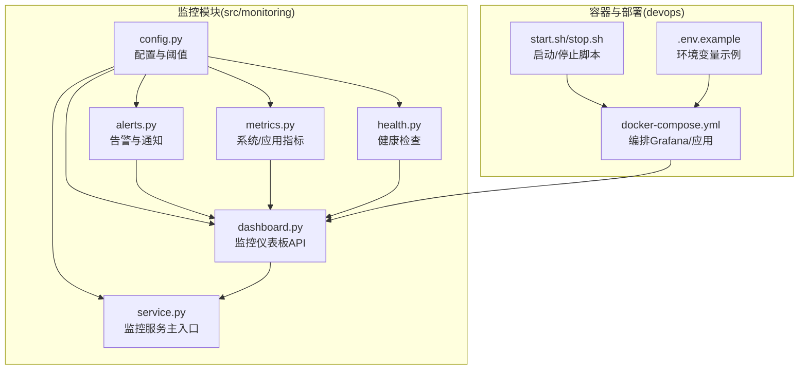
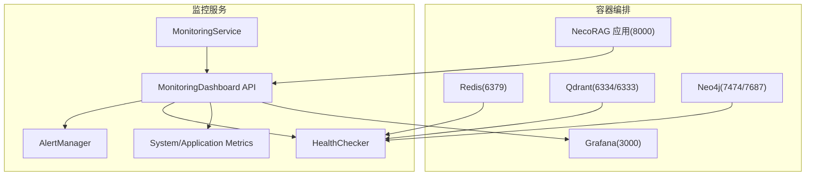
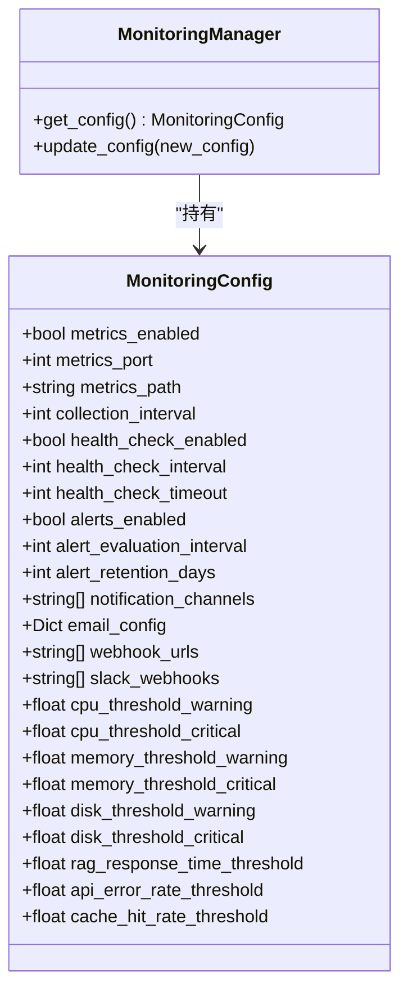
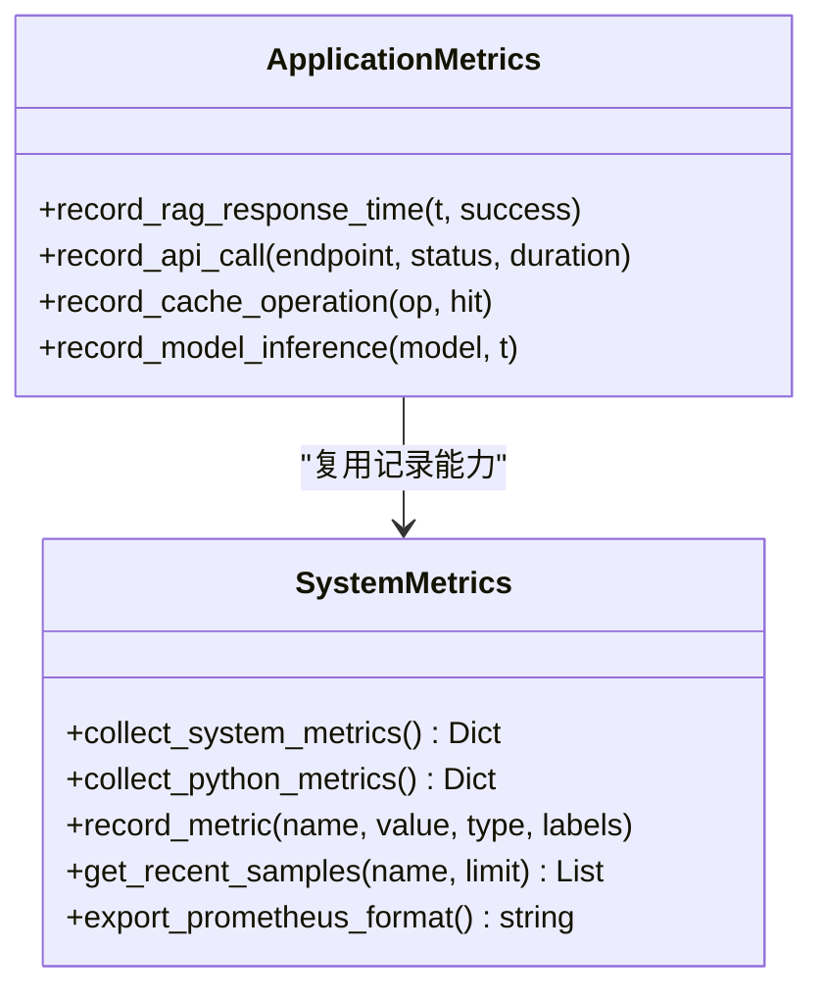
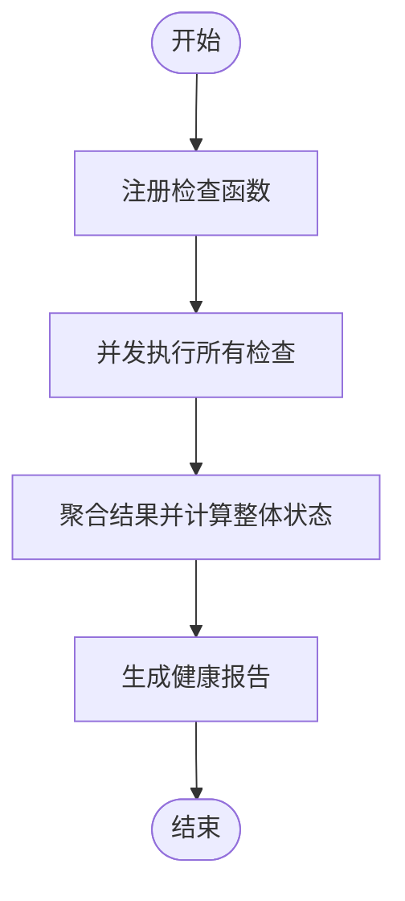
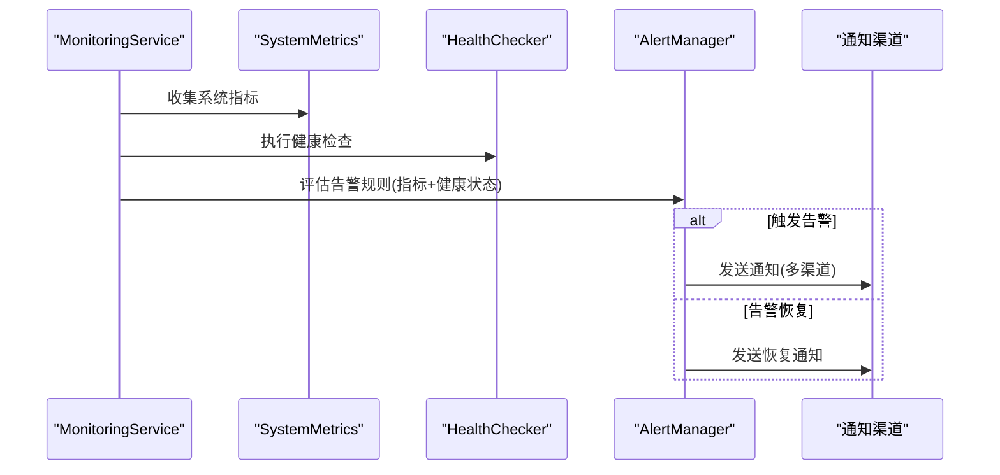
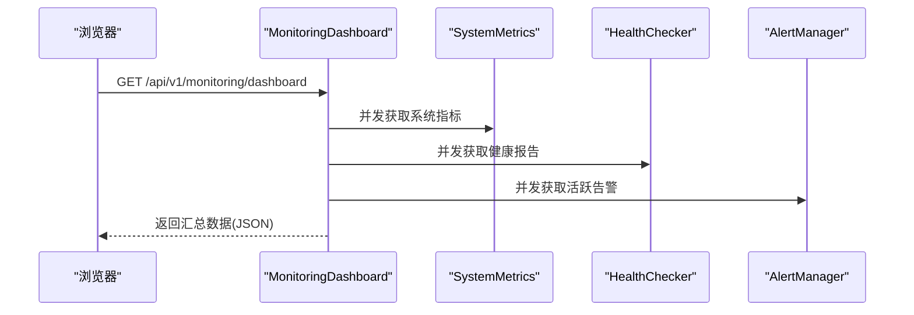
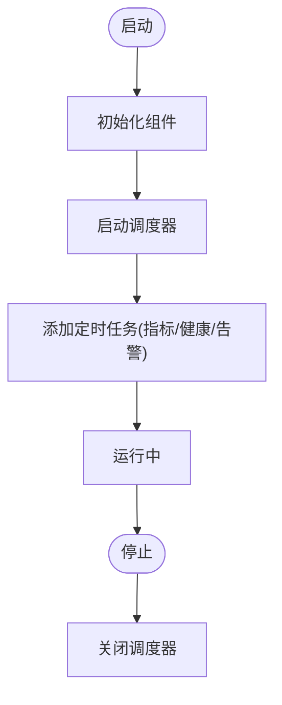
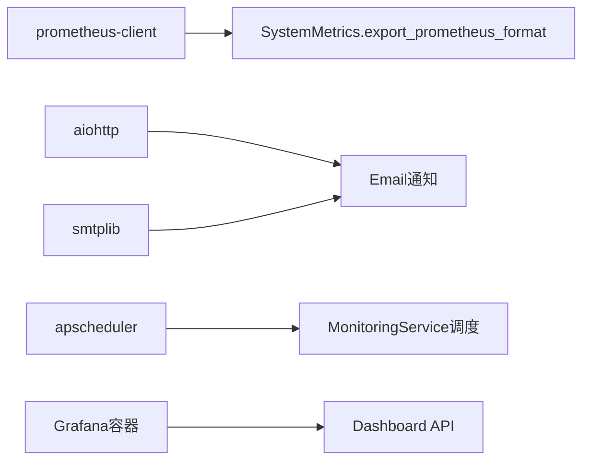

# 监控告警系统

<cite>
**本文引用的文件**
- [src/monitoring/__init__.py](file://src/monitoring/__init__.py)
- [src/monitoring/config.py](file://src/monitoring/config.py)
- [src/monitoring/metrics.py](file://src/monitoring/metrics.py)
- [src/monitoring/alerts.py](file://src/monitoring/alerts.py)
- [src/monitoring/health.py](file://src/monitoring/health.py)
- [src/monitoring/dashboard.py](file://src/monitoring/dashboard.py)
- [src/monitoring/service.py](file://src/monitoring/service.py)
- [devops/docker-compose.yml](file://devops/docker-compose.yml)
- [devops/scripts/start.sh](file://devops/scripts/start.sh)
- [devops/scripts/stop.sh](file://devops/scripts/stop.sh)
- [devops/.env.example](file://devops/.env.example)
- [requirements.txt](file://requirements.txt)
</cite>

## 目录
1. [引言](#引言)
2. [项目结构](#项目结构)
3. [核心组件](#核心组件)
4. [架构总览](#架构总览)
5. [详细组件分析](#详细组件分析)
6. [依赖分析](#依赖分析)
7. [性能考虑](#性能考虑)
8. [故障排查指南](#故障排查指南)
9. [结论](#结论)
10. [附录](#附录)

## 引言
本文件面向 NecoRAG v3.3.0-alpha 的监控告警系统，提供从架构到实现细节的完整说明。内容覆盖：
- Grafana 监控配置与预置仪表盘（系统监控、应用性能、知识库健康、用户行为）
- Prometheus 指标收集配置（HTTP 请求、数据库查询、缓存命中率、队列长度、自定义业务指标）
- 采集频率、存储策略与告警规则配置
- Grafana 数据源与仪表盘模板使用
- 监控系统的部署与初始化步骤
- 告警通知机制与故障恢复流程
- v3.3.0-alpha 版本的监控增强与新指标

## 项目结构
监控告警系统位于 src/monitoring 目录，采用模块化设计，包含配置、指标、健康检查、告警、仪表板与服务主入口等子模块。同时，devops 提供容器化编排与启动脚本，配合 Grafana 实现可视化。

**图表来源**
- [src/monitoring/config.py:27-117](file://src/monitoring/config.py#L27-L117)
- [src/monitoring/metrics.py:25-207](file://src/monitoring/metrics.py#L25-L207)
- [src/monitoring/health.py:34-300](file://src/monitoring/health.py#L34-L300)
- [src/monitoring/alerts.py:237-435](file://src/monitoring/alerts.py#L237-L435)
- [src/monitoring/dashboard.py:17-250](file://src/monitoring/dashboard.py#L17-L250)
- [src/monitoring/service.py:21-214](file://src/monitoring/service.py#L21-L214)
- [devops/docker-compose.yml:99-117](file://devops/docker-compose.yml#L99-L117)
- [devops/scripts/start.sh:48-95](file://devops/scripts/start.sh#L48-L95)
- [devops/.env.example:1-32](file://devops/.env.example#L1-L32)

**章节来源**
- [src/monitoring/__init__.py:1-35](file://src/monitoring/__init__.py#L1-L35)
- [devops/docker-compose.yml:1-164](file://devops/docker-compose.yml#L1-L164)
- [devops/scripts/start.sh:1-101](file://devops/scripts/start.sh#L1-L101)
- [devops/scripts/stop.sh:1-36](file://devops/scripts/stop.sh#L1-L36)
- [devops/.env.example:1-32](file://devops/.env.example#L1-L32)

## 核心组件
- 配置与阈值：集中管理指标采集、健康检查、告警评估、通知渠道及各类阈值。
- 指标收集：系统指标（CPU/内存/磁盘/网络/进程）与应用指标（RAG 响应时间、API 调用、缓存操作、模型推理）。
- 健康检查：并发执行关键与非关键检查，聚合整体健康状态。
- 告警与通知：基于规则表达式评估触发/恢复，多通道通知（控制台、邮件、Webhook、Slack）。
- 仪表板：FastAPI 提供系统/健康/告警/汇总数据接口，并内置前端页面。
- 服务主入口：调度器驱动定时任务，统一启动/停止生命周期。

**章节来源**
- [src/monitoring/config.py:27-117](file://src/monitoring/config.py#L27-L117)
- [src/monitoring/metrics.py:25-207](file://src/monitoring/metrics.py#L25-L207)
- [src/monitoring/health.py:34-300](file://src/monitoring/health.py#L34-L300)
- [src/monitoring/alerts.py:237-435](file://src/monitoring/alerts.py#L237-L435)
- [src/monitoring/dashboard.py:17-250](file://src/monitoring/dashboard.py#L17-L250)
- [src/monitoring/service.py:21-214](file://src/monitoring/service.py#L21-L214)

## 架构总览
下图展示监控系统在容器化环境中的角色与数据流。

**图表来源**
- [devops/docker-compose.yml:99-147](file://devops/docker-compose.yml#L99-L147)
- [src/monitoring/service.py:178-201](file://src/monitoring/service.py#L178-L201)
- [src/monitoring/dashboard.py:26-104](file://src/monitoring/dashboard.py#L26-L104)

## 详细组件分析

### 配置与阈值（MonitoringConfig）
- 指标采集：开关、端口、路径、采集间隔。
- 健康检查：开关、间隔、超时。
- 告警：开关、评估间隔、历史保留天数。
- 通知渠道：控制台、邮件、Webhook、Slack；邮件配置、Webhook 列表、Slack 列表。
- 阈值：CPU/内存/磁盘警告/严重阈值；RAG 响应时间、API 错误率、缓存命中率阈值。
- 环境变量覆盖：通过 MONITORING_* 前缀读取。

**图表来源**
- [src/monitoring/config.py:27-117](file://src/monitoring/config.py#L27-L117)

**章节来源**
- [src/monitoring/config.py:27-117](file://src/monitoring/config.py#L27-L117)

### 指标收集（SystemMetrics / ApplicationMetrics）
- 系统指标：CPU 使用率/频率/负载、内存/交换、磁盘总量/使用/IO、网络 IO、进程数、运行时长。
- Python 运行时指标：GC 统计、RSS/VMS 内存、Python 版本信息。
- 应用指标：RAG 响应时间与成功率、API 请求耗时与计数、缓存操作（命中/未命中）、模型推理耗时。
- 存储与导出：内部缓冲区保留最近样本，支持导出 Prometheus 格式文本。

**图表来源**
- [src/monitoring/metrics.py:25-207](file://src/monitoring/metrics.py#L25-L207)

**章节来源**
- [src/monitoring/metrics.py:25-207](file://src/monitoring/metrics.py#L25-L207)

### 健康检查（HealthChecker）
- 注册检查：数据库、Redis、LLM 服务、磁盘空间等。
- 并发执行：异步并发运行所有检查，记录时延与详情。
- 整体状态：关键检查失败则 UNHEALTHY；存在 DEGRADED 则 DEGRADED；否则 HEALTHY。
- 报告：包含状态、检查项明细与统计摘要。

**图表来源**
- [src/monitoring/health.py:107-154](file://src/monitoring/health.py#L107-L154)

**章节来源**
- [src/monitoring/health.py:34-300](file://src/monitoring/health.py#L34-L300)

### 告警与通知（AlertManager）
- 规则：告警规则对象，包含表达式、级别、持续时间、标签与注解。
- 状态：触发中、已解决、已静默。
- 表达式评估：当前实现支持基础条件（如 CPU/Memory 阈值、健康状态）。
- 通知渠道：控制台、邮件、Webhook、Slack；按配置动态启用。
- 历史与清理：保留指定天数的历史告警并清理过期记录。

**图表来源**
- [src/monitoring/service.py:99-154](file://src/monitoring/service.py#L99-L154)
- [src/monitoring/alerts.py:291-344](file://src/monitoring/alerts.py#L291-L344)

**章节来源**
- [src/monitoring/alerts.py:237-435](file://src/monitoring/alerts.py#L237-L435)

### 仪表板（MonitoringDashboard）
- API 路由：系统指标、应用指标、健康状态、告警列表、仪表板汇总。
- 前端页面：HTML + JS，定时刷新系统状态/CPU/内存/活跃告警。
- 并发数据获取：系统概览、健康概览、告警概览三路并发。

**图表来源**
- [src/monitoring/dashboard.py:82-148](file://src/monitoring/dashboard.py#L82-L148)

**章节来源**
- [src/monitoring/dashboard.py:17-250](file://src/monitoring/dashboard.py#L17-L250)

### 监控服务主入口（MonitoringService）
- 调度器：APScheduler 异步调度，按配置周期执行指标收集、健康检查、告警评估。
- 生命周期：启动/停止事件中自动管理调度器。
- 状态查询：返回运行状态、配置与各组件状态。

**图表来源**
- [src/monitoring/service.py:38-98](file://src/monitoring/service.py#L38-L98)

**章节来源**
- [src/monitoring/service.py:21-214](file://src/monitoring/service.py#L21-L214)

## 依赖分析
- Prometheus 客户端：requirements.txt 明确列出 prometheus-client，用于指标导出与采集。
- Grafana：docker-compose 中提供 Grafana 服务，挂载 provisioning 目录，便于数据源与仪表盘初始化。
- 通知渠道：aiohttp 用于 Webhook/Slack；smtplib 用于邮件通知。
- 调度：apscheduler 用于异步定时任务。

**图表来源**
- [requirements.txt:94-95](file://requirements.txt#L94-L95)
- [src/monitoring/metrics.py:144-174](file://src/monitoring/metrics.py#L144-L174)
- [src/monitoring/alerts.py:142-169](file://src/monitoring/alerts.py#L142-L169)
- [src/monitoring/service.py:26-73](file://src/monitoring/service.py#L26-L73)
- [devops/docker-compose.yml:99-117](file://devops/docker-compose.yml#L99-L117)

**章节来源**
- [requirements.txt:94-95](file://requirements.txt#L94-L95)
- [devops/docker-compose.yml:99-117](file://devops/docker-compose.yml#L99-L117)

## 性能考虑
- 采集频率：默认采集间隔 15 秒，健康检查 30 秒，告警评估 60 秒，可在环境变量中调整。
- 指标缓冲：系统指标样本缓冲上限 1000，避免内存无限增长。
- 并发执行：健康检查与仪表板数据聚合采用并发，降低等待时间。
- 导出格式：Prometheus 格式导出仅输出最新样本值，减少传输体积。

**章节来源**
- [src/monitoring/config.py:34-44](file://src/monitoring/config.py#L34-L44)
- [src/monitoring/metrics.py:30-31](file://src/monitoring/metrics.py#L30-L31)
- [src/monitoring/dashboard.py:88-94](file://src/monitoring/dashboard.py#L88-L94)

## 故障排查指南
- 启动/停止：使用 start.sh/stop.sh 管理容器编排，确保 Docker 正常运行。
- 环境变量：检查 .env 示例，确认端口与认证信息正确。
- 健康检查：若整体状态异常，查看健康报告中的具体检查项与耗时。
- 告警评估：确认规则表达式与阈值配置，检查通知渠道可用性。
- 日志与状态：访问 /status 获取服务状态，查看容器日志定位问题。

**章节来源**
- [devops/scripts/start.sh:28-95](file://devops/scripts/start.sh#L28-L95)
- [devops/scripts/stop.sh:19-35](file://devops/scripts/stop.sh#L19-L35)
- [devops/.env.example:1-32](file://devops/.env.example#L1-L32)
- [src/monitoring/service.py:195-198](file://src/monitoring/service.py#L195-L198)
- [src/monitoring/health.py:156-184](file://src/monitoring/health.py#L156-L184)

## 结论
NecoRAG 监控告警系统以模块化方式实现了指标采集、健康检查、告警评估与可视化仪表板，并通过容器化编排与环境变量配置实现快速部署与灵活调优。v3.3.0-alpha 在指标类型与阈值配置上提供了更丰富的参数，结合 Prometheus/Grafana 可满足生产级监控需求。

## 附录

### Grafana 监控配置与预置仪表盘
- 数据源：Grafana 通过 provisioning 配置 Prometheus 数据源，指向应用指标端点。
- 预置仪表盘建议：
  - 系统监控：CPU 使用率、内存使用率、磁盘使用率、网络 IO。
  - 应用性能：RAG 响应时间、API 请求速率、错误率、缓存命中率。
  - 知识库健康：健康分数（可映射健康状态）、增长趋势（指标环比/同比）、更新频率（写入速率）。
  - 用户行为：查询分布（按端点/状态分类）、活跃时段（按小时/星期统计）、满意度（可引入外部反馈指标）。
- 模板使用：利用变量与模板变量实现跨环境复用，结合注解完善告警上下文。

[本节为概念性说明，无需“章节来源”]

### Prometheus 指标收集配置
- 指标类型：计数器、仪表盘、直方图、摘要，用于不同场景的统计与采样。
- 指标命名：遵循 Prometheus 命名规范，清晰标注单位与含义。
- 采集频率：默认 15 秒，可根据负载与精度需求调整。
- 存储策略：Prometheus 默认保留 15 天数据，可按需调整保留周期。
- 自定义业务指标：通过 ApplicationMetrics 记录 RAG/缓存/模型推理等关键指标。

**章节来源**
- [src/monitoring/config.py:19-24](file://src/monitoring/config.py#L19-L24)
- [src/monitoring/metrics.py:126-136](file://src/monitoring/metrics.py#L126-L136)

### 告警规则与通知机制
- 规则表达式：支持基于阈值与健康状态的简单表达式，后续可扩展为更复杂的 PromQL 或 DSL。
- 通知渠道：控制台（默认）、邮件、Webhook、Slack；按需启用并配置凭据。
- 告警生命周期：触发 → 通知 → 恢复 → 清理，历史保留天数可配置。

**章节来源**
- [src/monitoring/alerts.py:291-344](file://src/monitoring/alerts.py#L291-L344)
- [src/monitoring/alerts.py:402-427](file://src/monitoring/alerts.py#L402-L427)

### 部署与初始化步骤
- 准备：复制 .env.example 为 .env，按需修改端口与认证。
- 启动：./scripts/start.sh（支持 dev/minimal/full/--with-llm 模式）。
- 访问：Grafana http://localhost:3000，默认管理员账号见 .env。
- 初始化：在 Grafana 中添加 Prometheus 数据源，导入预置仪表盘模板。

**章节来源**
- [devops/scripts/start.sh:28-95](file://devops/scripts/start.sh#L28-L95)
- [devops/docker-compose.yml:99-117](file://devops/docker-compose.yml#L99-L117)
- [devops/.env.example:21-23](file://devops/.env.example#L21-L23)

### v3.3.0-alpha 监控增强与新指标
- 新增阈值配置：RAG 响应时间、API 错误率、缓存命中率阈值，便于精细化告警。
- 指标类型扩展：明确计数器/仪表盘/直方图/摘要类型，提升指标表达力。
- 通知渠道增强：支持多渠道并行通知，便于企业级告警分发。

**章节来源**
- [src/monitoring/config.py:52-63](file://src/monitoring/config.py#L52-L63)