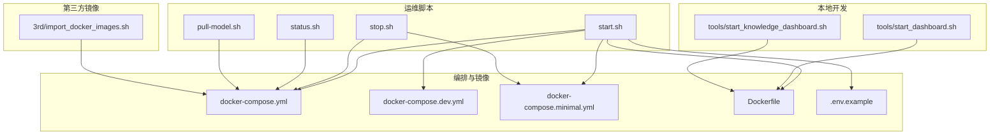
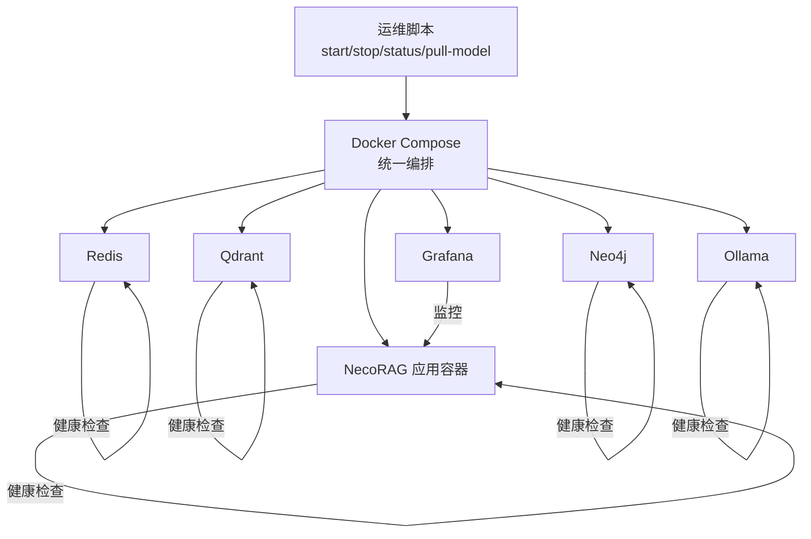
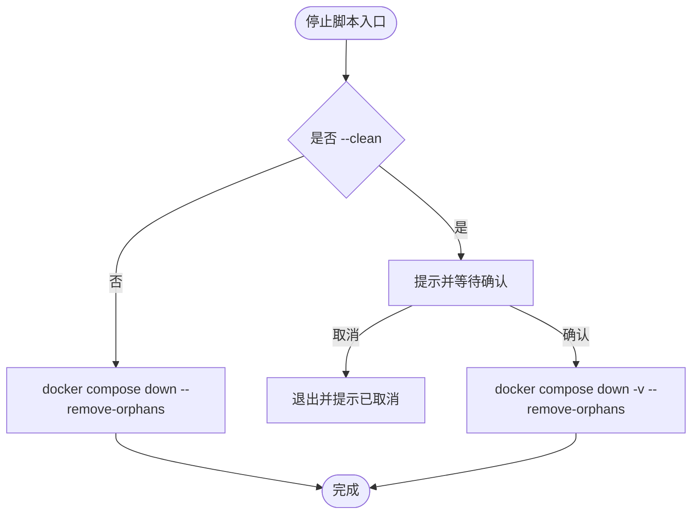
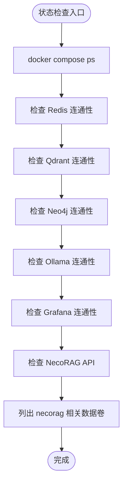
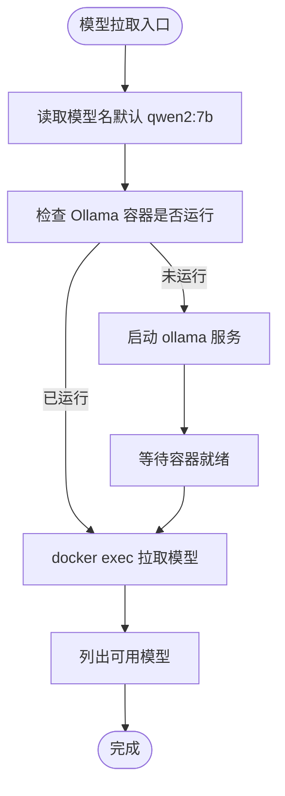
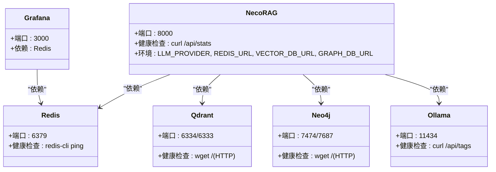
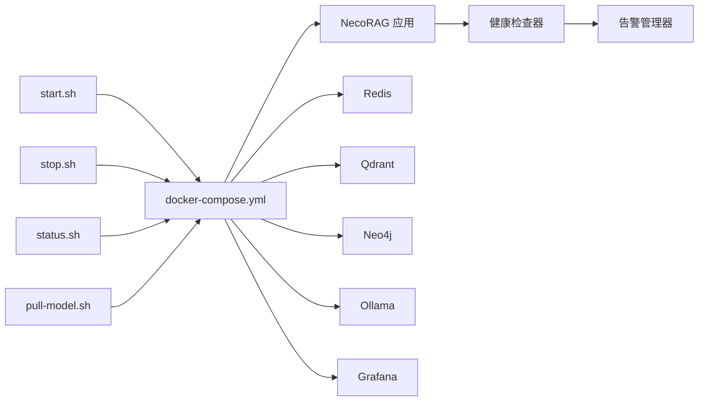

# 运维脚本工具

<cite>
**本文引用的文件**
- [devops/scripts/start.sh](file://devops/scripts/start.sh)
- [devops/scripts/stop.sh](file://devops/scripts/stop.sh)
- [devops/scripts/status.sh](file://devops/scripts/status.sh)
- [devops/scripts/pull-model.sh](file://devops/scripts/pull-model.sh)
- [devops/docker-compose.yml](file://devops/docker-compose.yml)
- [devops/docker-compose.dev.yml](file://devops/docker-compose.dev.yml)
- [devops/docker-compose.minimal.yml](file://devops/docker-compose.minimal.yml)
- [devops/Dockerfile](file://devops/Dockerfile)
- [devops/.env.example](file://devops/.env.example)
- [tools/start_dashboard.sh](file://tools/start_dashboard.sh)
- [tools/start_knowledge_dashboard.sh](file://tools/start_knowledge_dashboard.sh)
- [3rd/import_docker_images.sh](file://3rd/import_docker_images.sh)
- [src/monitoring/health.py](file://src/monitoring/health.py)
- [src/monitoring/alerts.py](file://src/monitoring/alerts.py)
- [src/dashboard/USAGE_GUIDE.md](file://src/dashboard/USAGE_GUIDE.md)
</cite>

## 目录
1. [简介](#简介)
2. [项目结构](#项目结构)
3. [核心组件](#核心组件)
4. [架构总览](#架构总览)
5. [详细组件分析](#详细组件分析)
6. [依赖关系分析](#依赖关系分析)
7. [性能考虑](#性能考虑)
8. [故障排查指南](#故障排查指南)
9. [结论](#结论)
10. [附录](#附录)

## 简介
本文件面向运维团队，提供 NecoRAG 运维脚本工具的实用操作指南。内容覆盖启动脚本的初始化流程与环境检查、停止脚本的优雅关闭与数据卷清理、状态检查脚本的健康指标与告警机制、模型拉取脚本的版本与缓存策略，以及权限设置、定时任务配置与自动化部署集成建议，帮助建立标准化的运维流程。

## 项目结构
运维脚本位于 devops/scripts 目录，配合 Docker Compose 编排文件与 Dockerfile 构成完整的容器化运行环境；同时提供本地开发启动脚本与第三方镜像导入工具，便于快速部署与维护。



**图表来源**
- [devops/scripts/start.sh:1-101](file://devops/scripts/start.sh#L1-L101)
- [devops/scripts/stop.sh:1-36](file://devops/scripts/stop.sh#L1-L36)
- [devops/scripts/status.sh:1-48](file://devops/scripts/status.sh#L1-L48)
- [devops/scripts/pull-model.sh:1-28](file://devops/scripts/pull-model.sh#L1-L28)
- [devops/docker-compose.yml:1-164](file://devops/docker-compose.yml#L1-L164)
- [devops/docker-compose.dev.yml:1-16](file://devops/docker-compose.dev.yml#L1-L16)
- [devops/docker-compose.minimal.yml:1-33](file://devops/docker-compose.minimal.yml#L1-L33)
- [devops/Dockerfile:1-39](file://devops/Dockerfile#L1-L39)
- [devops/.env.example:1-32](file://devops/.env.example#L1-L32)
- [tools/start_dashboard.sh:1-26](file://tools/start_dashboard.sh#L1-L26)
- [tools/start_knowledge_dashboard.sh:1-61](file://tools/start_knowledge_dashboard.sh#L1-L61)
- [3rd/import_docker_images.sh:1-589](file://3rd/import_docker_images.sh#L1-L589)

**章节来源**
- [devops/scripts/start.sh:1-101](file://devops/scripts/start.sh#L1-L101)
- [devops/docker-compose.yml:1-164](file://devops/docker-compose.yml#L1-L164)

## 核心组件
- 启动脚本：负责模式选择、环境检查、Docker Compose 启动与服务提示。
- 停止脚本：负责优雅停止与可选的数据卷清理。
- 状态检查脚本：负责容器状态、服务连通性与数据卷检查。
- 模型拉取脚本：负责 Ollama 容器状态检查与模型下载。
- 编排与镜像：统一的服务编排、健康检查与应用镜像构建。
- 本地开发脚本：辅助本地调试与仪表盘启动。
- 第三方镜像导入：网络环境自适配、磁盘空间检查与批量镜像拉取。

**章节来源**
- [devops/scripts/start.sh:1-101](file://devops/scripts/start.sh#L1-L101)
- [devops/scripts/stop.sh:1-36](file://devops/scripts/stop.sh#L1-L36)
- [devops/scripts/status.sh:1-48](file://devops/scripts/status.sh#L1-L48)
- [devops/scripts/pull-model.sh:1-28](file://devops/scripts/pull-model.sh#L1-L28)
- [devops/docker-compose.yml:1-164](file://devops/docker-compose.yml#L1-L164)
- [devops/Dockerfile:1-39](file://devops/Dockerfile#L1-L39)
- [tools/start_dashboard.sh:1-26](file://tools/start_dashboard.sh#L1-L26)
- [tools/start_knowledge_dashboard.sh:1-61](file://tools/start_knowledge_dashboard.sh#L1-L61)
- [3rd/import_docker_images.sh:1-589](file://3rd/import_docker_images.sh#L1-L589)

## 架构总览
下图展示运维脚本与容器编排、服务健康检查及监控告警的关系：



**图表来源**
- [devops/docker-compose.yml:1-164](file://devops/docker-compose.yml#L1-L164)
- [devops/Dockerfile:33-35](file://devops/Dockerfile#L33-L35)
- [src/monitoring/health.py:132-154](file://src/monitoring/health.py#L132-L154)

## 详细组件分析

### 启动脚本（start.sh）
- 功能与用途
  - 支持多种启动模式：完整模式、开发模式、最小模式、带 LLM 模式。
  - 自动检查 .env 文件并创建示例配置；校验 Docker 与 Docker 服务可用性。
  - 根据模式选择不同的 compose 配置文件并启动服务，输出服务访问提示。
- 执行参数
  - 无参：完整模式
  - dev：开发模式（不启动应用容器，按需启动 LLM/监控）
  - minimal：仅启动 Redis 与 Qdrant
  - full 或 --with-llm：完整模式或带 LLM 模式
- 使用场景
  - 开发联调：使用 dev 模式，本地运行应用，按需启动 LLM。
  - 快速验证：使用 minimal 模式验证核心存储。
  - 生产/演示：使用 full 模式，启动全部服务。
- 初始化流程与环境检查
  - 检查 .env 是否存在，不存在则复制示例文件。
  - 检查 Docker 与 Docker 服务状态。
  - 根据模式拼接 compose 文件并启动。
- 依赖验证机制
  - 通过 docker compose up -d 启动，依赖各服务的 healthcheck。
  - 应用容器内置健康检查，确保 /api/stats 可访问。

```mermaid
flowchart TD
Start(["启动脚本入口"]) --> CheckEnv["检查 .env 文件是否存在"]
CheckEnv --> EnvExists{"存在？"}
EnvExists --> |否| CreateEnv["复制 .env.example 为 .env"]
EnvExists --> |是| CheckDocker["检查 Docker 与 Docker 服务"]
CreateEnv --> CheckDocker
CheckDocker --> DockerOK{"Docker 可用？"}
DockerOK --> |否| ExitErr["退出并提示安装/启动 Docker"]
DockerOK --> |是| ParseMode["解析启动模式"]
ParseMode --> Mode{"模式类型"}
Mode --> |dev|minimal|full|--with-llm| RunCompose["执行 docker compose 启动"]
RunCompose --> PrintTips["打印服务访问提示"]
PrintTips --> End(["完成"])
```

**图表来源**
- [devops/scripts/start.sh:28-95](file://devops/scripts/start.sh#L28-L95)
- [devops/docker-compose.yml:1-164](file://devops/docker-compose.yml#L1-L164)

**章节来源**
- [devops/scripts/start.sh:1-101](file://devops/scripts/start.sh#L1-L101)
- [devops/.env.example:1-32](file://devops/.env.example#L1-L32)
- [devops/docker-compose.yml:1-164](file://devops/docker-compose.yml#L1-L164)

### 停止脚本（stop.sh）
- 功能与用途
  - 停止所有服务；支持 --clean 参数清理数据卷（需确认）。
- 执行参数
  - 无参：停止服务并保留数据卷
  - --clean：停止并清理数据卷（危险操作，需确认）
- 优雅关闭与资源释放
  - 使用 docker compose down 停止服务；对最小配置也进行 down。
  - 清理孤儿容器，避免残留。
- 与编排的关系
  - 依赖 docker-compose.yml 与 docker-compose.minimal.yml 的服务定义。



**图表来源**
- [devops/scripts/stop.sh:21-35](file://devops/scripts/stop.sh#L21-L35)

**章节来源**
- [devops/scripts/stop.sh:1-36](file://devops/scripts/stop.sh#L1-L36)
- [devops/docker-compose.yml:1-164](file://devops/docker-compose.yml#L1-L164)
- [devops/docker-compose.minimal.yml:1-33](file://devops/docker-compose.minimal.yml#L1-L33)

### 状态检查脚本（status.sh）
- 功能与用途
  - 输出容器状态、关键服务连通性检查、数据卷列表。
- 检查项与健康判断
  - 容器状态：docker compose ps
  - 服务连通性：Redis、Qdrant、Neo4j、Ollama、Grafana、NecoRAG API
  - 数据卷：列出包含 necorag 的卷
- 告警触发机制
  - 通过 curl/HTTP 探针与 CLI 工具（如 redis-cli）判断服务可达性。
  - 若任一关键服务不可达，标记为不健康，提示进一步排查。



**图表来源**
- [devops/scripts/status.sh:32-47](file://devops/scripts/status.sh#L32-L47)

**章节来源**
- [devops/scripts/status.sh:1-48](file://devops/scripts/status.sh#L1-L48)

### 模型拉取脚本（pull-model.sh）
- 功能与用途
  - 拉取指定 Ollama 模型；若 Ollama 容器未运行则先启动。
- 执行参数
  - 无参：默认拉取 qwen2:7b
  - 传参：自定义模型名
- 版本管理与缓存机制
  - 通过 docker exec 进入容器执行 ollama pull，利用 Ollama 本地缓存。
  - 拉取完成后列出可用模型，便于核对缓存状态。
- 与编排的关系
  - 依赖 docker-compose.yml 中的 ollama 服务与健康检查。



**图表来源**
- [devops/scripts/pull-model.sh:11-27](file://devops/scripts/pull-model.sh#L11-L27)
- [devops/docker-compose.yml:74-97](file://devops/docker-compose.yml#L74-L97)

**章节来源**
- [devops/scripts/pull-model.sh:1-28](file://devops/scripts/pull-model.sh#L1-L28)
- [devops/docker-compose.yml:74-97](file://devops/docker-compose.yml#L74-L97)

### 编排与镜像（docker-compose.yml、Dockerfile、.env.example）
- 服务编排
  - 包含 Redis、Qdrant、Neo4j、Ollama、Grafana、NecoRAG 应用等服务。
  - 各服务均配置健康检查，确保容器健康状态可被编排识别。
- 应用镜像与健康检查
  - Dockerfile 构建应用镜像，暴露 8000 端口。
  - 健康检查通过 /api/stats 探针判断应用可用性。
- 环境变量
  - .env.example 提供端口、认证、LLM Provider、调试开关等配置项。



**图表来源**
- [devops/docker-compose.yml:6-147](file://devops/docker-compose.yml#L6-L147)
- [devops/Dockerfile:33-35](file://devops/Dockerfile#L33-L35)
- [devops/.env.example:7-31](file://devops/.env.example#L7-L31)

**章节来源**
- [devops/docker-compose.yml:1-164](file://devops/docker-compose.yml#L1-L164)
- [devops/Dockerfile:1-39](file://devops/Dockerfile#L1-L39)
- [devops/.env.example:1-32](file://devops/.env.example#L1-L32)

### 本地开发脚本（tools/start_dashboard.sh、tools/start_knowledge_dashboard.sh）
- 作用
  - 提供本地启动 Dashboard 的便捷方式，支持自动打开浏览器与端口配置。
- 与运维脚本的关系
  - 与 docker-compose.yml 启动的应用容器互补，适合本地调试与快速验证。

**章节来源**
- [tools/start_dashboard.sh:1-26](file://tools/start_dashboard.sh#L1-L26)
- [tools/start_knowledge_dashboard.sh:1-61](file://tools/start_knowledge_dashboard.sh#L1-L61)

### 第三方镜像导入（3rd/import_docker_images.sh）
- 作用
  - 自动检测网络环境，选择镜像源（Docker Hub 或阿里云），计算所需磁盘空间，支持批量拉取镜像。
- 与运维脚本的关系
  - 作为部署前置步骤，确保基础镜像可用，减少后续启动失败风险。

**章节来源**
- [3rd/import_docker_images.sh:1-589](file://3rd/import_docker_images.sh#L1-L589)

## 依赖关系分析
- 脚本与编排
  - start.sh/stop.sh/status.sh/pull-model.sh 均依赖 docker-compose.yml 及其扩展配置。
- 健康检查与告警
  - 应用与各服务的健康检查由 Docker 健康探针与内部健康检查器共同保障。
  - 告警系统基于健康状态与指标表达式进行规则评估与通知。



**图表来源**
- [devops/scripts/start.sh:46-95](file://devops/scripts/start.sh#L46-L95)
- [devops/scripts/stop.sh:21-35](file://devops/scripts/stop.sh#L21-L35)
- [devops/scripts/status.sh:32-47](file://devops/scripts/status.sh#L32-L47)
- [devops/scripts/pull-model.sh:15-23](file://devops/scripts/pull-model.sh#L15-L23)
- [devops/docker-compose.yml:1-164](file://devops/docker-compose.yml#L1-L164)
- [src/monitoring/health.py:132-154](file://src/monitoring/health.py#L132-L154)
- [src/monitoring/alerts.py:237-344](file://src/monitoring/alerts.py#L237-L344)

**章节来源**
- [devops/docker-compose.yml:1-164](file://devops/docker-compose.yml#L1-L164)
- [src/monitoring/health.py:1-300](file://src/monitoring/health.py#L1-L300)
- [src/monitoring/alerts.py:1-435](file://src/monitoring/alerts.py#L1-L435)

## 性能考虑
- 启动阶段
  - 使用健康检查避免应用在依赖未就绪时对外提供服务。
  - 开发模式按需启动 LLM/监控，降低资源占用。
- 运行阶段
  - Grafana 依赖 Redis，建议优先保证 Redis 健康，以减少监控链路阻塞。
  - Ollama 作为推理服务，建议单独配置资源与 GPU 支持（已在 Dockerfile 中预留注释）。
- 存储与缓存
  - Redis/Qdrant/Neo4j 的数据卷持久化需定期评估容量与快照策略。
  - Ollama 模型缓存建议结合业务需求定期清理不常用模型。

[本节为通用指导，无需特定文件引用]

## 故障排查指南
- Docker 未安装或未运行
  - 现象：启动脚本报错，提示未检测到 Docker。
  - 处理：安装 Docker 并启动服务后重试。
- 服务不可达
  - 现象：status.sh 中某服务标记为不健康。
  - 处理：查看对应服务日志，确认健康检查是否通过；必要时重启服务。
- 数据卷清理
  - 现象：停止后仍存在大量数据卷占用空间。
  - 处理：使用 stop.sh --clean 清理数据卷（谨慎操作）。
- LLM 模型拉取失败
  - 现象：pull-model.sh 拉取失败或超时。
  - 处理：确认 Ollama 容器健康；检查网络与镜像源；重试拉取。
- 健康状态与告警
  - 现象：健康检查器返回降级/不健康。
  - 处理：根据健康报告定位具体检查项，结合告警规则进行处置。

**章节来源**
- [devops/scripts/start.sh:35-44](file://devops/scripts/start.sh#L35-L44)
- [devops/scripts/status.sh:21-47](file://devops/scripts/status.sh#L21-L47)
- [devops/scripts/stop.sh:21-35](file://devops/scripts/stop.sh#L21-L35)
- [devops/scripts/pull-model.sh:15-23](file://devops/scripts/pull-model.sh#L15-L23)
- [src/monitoring/health.py:132-154](file://src/monitoring/health.py#L132-L154)
- [src/monitoring/alerts.py:291-344](file://src/monitoring/alerts.py#L291-L344)

## 结论
通过标准化的运维脚本与编排配置，NecoRAG 实现了从开发到生产的全生命周期管理。启动脚本提供灵活的模式选择与环境检查，停止脚本支持优雅关闭与数据卷清理，状态检查脚本与健康检查/告警机制共同保障系统可观测性，模型拉取脚本简化了本地推理能力的准备。结合权限设置、定时任务与自动化部署实践，可进一步提升运维效率与稳定性。

[本节为总结性内容，无需特定文件引用]

## 附录

### 权限设置与脚本执行
- 为脚本赋予执行权限：chmod +x devops/scripts/*.sh
- 建议在非 root 用户下运行，确保 Docker Socket 权限正确。

**章节来源**
- [devops/scripts/start.sh:1-101](file://devops/scripts/start.sh#L1-L101)
- [devops/scripts/stop.sh:1-36](file://devops/scripts/stop.sh#L1-L36)
- [devops/scripts/status.sh:1-48](file://devops/scripts/status.sh#L1-L48)
- [devops/scripts/pull-model.sh:1-28](file://devops/scripts/pull-model.sh#L1-L28)

### 定时任务与自动化部署
- 建议使用系统计划任务定期执行：
  - 周期性运行 status.sh 以监控健康状态
  - 定期拉取最新模型（结合业务需求）
- 自动化部署集成
  - CI/CD 流水线中加入第三方镜像导入步骤，确保镜像可用性
  - 部署后执行启动脚本并等待健康检查通过后再对外提供服务

**章节来源**
- [3rd/import_docker_images.sh:1-589](file://3rd/import_docker_images.sh#L1-L589)
- [devops/scripts/start.sh:1-101](file://devops/scripts/start.sh#L1-L101)

### 监控与告警集成要点
- 健康检查
  - 应用与各服务均具备健康检查探针，建议在外部监控系统中复用这些探针结果。
- 告警规则
  - 可基于健康状态与关键指标（CPU/内存/磁盘）设置告警规则，结合通知渠道（邮件、Webhook、Slack）实现闭环。

**章节来源**
- [devops/docker-compose.yml:16-97](file://devops/docker-compose.yml#L16-L97)
- [devops/Dockerfile:33-35](file://devops/Dockerfile#L33-L35)
- [src/monitoring/health.py:132-154](file://src/monitoring/health.py#L132-L154)
- [src/monitoring/alerts.py:237-344](file://src/monitoring/alerts.py#L237-L344)