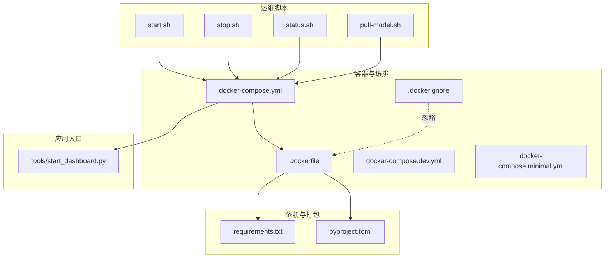
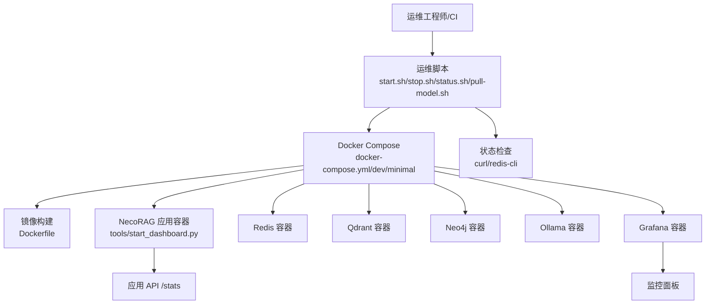
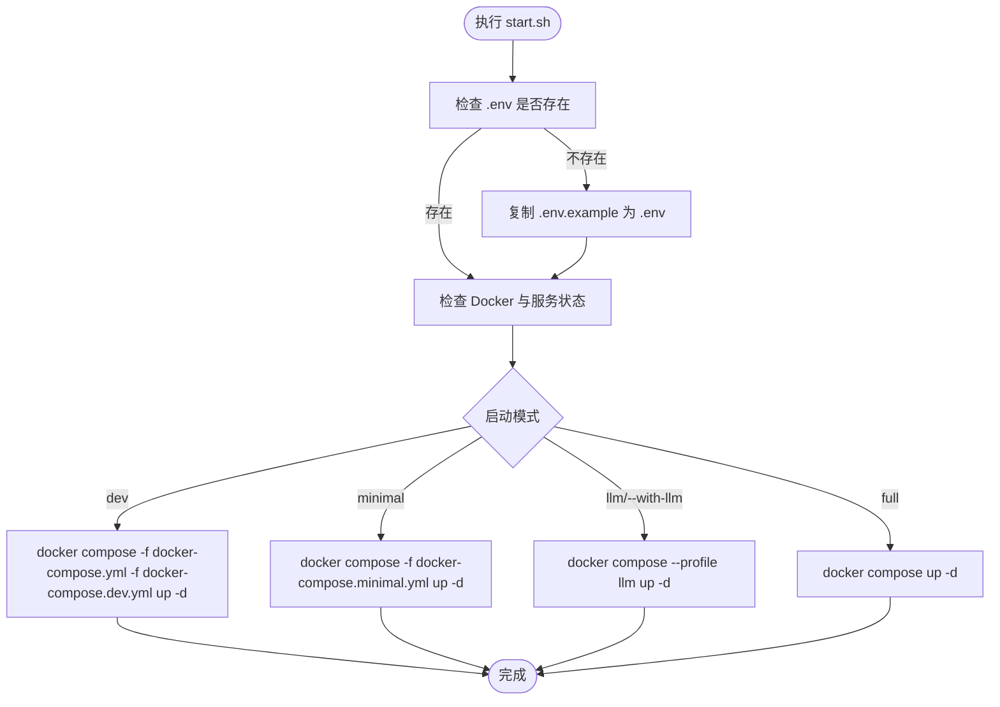
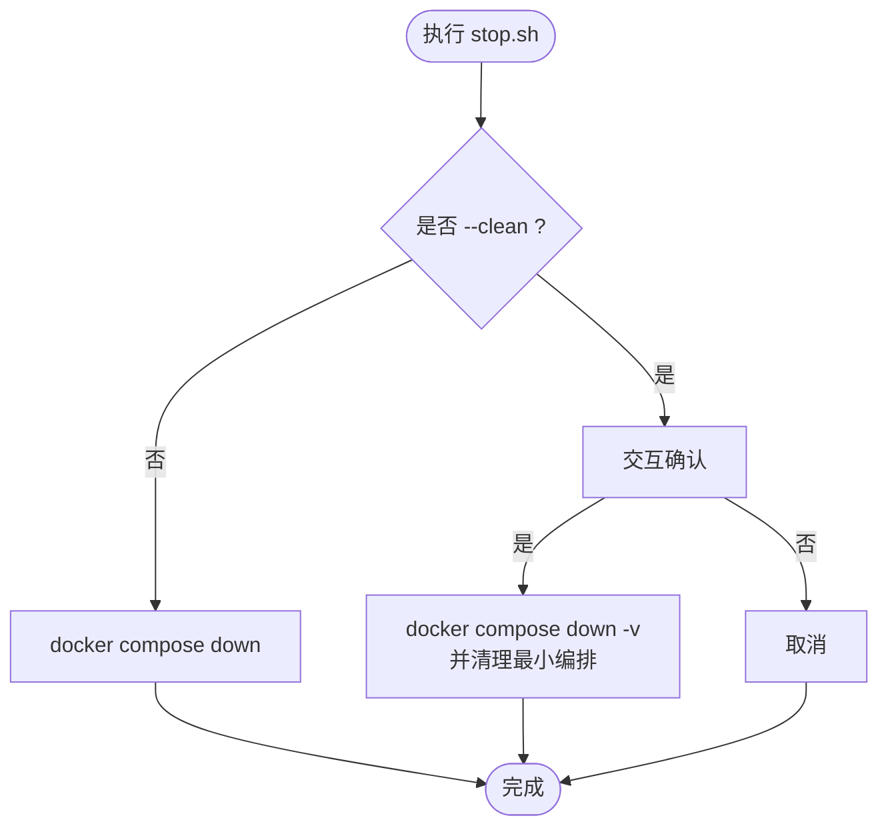
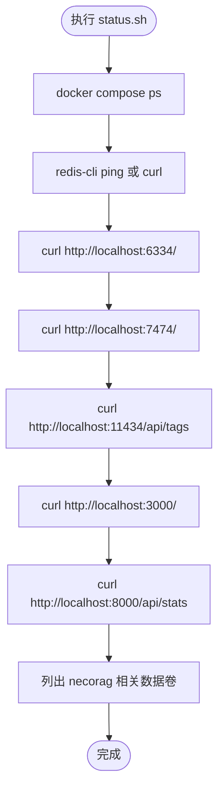
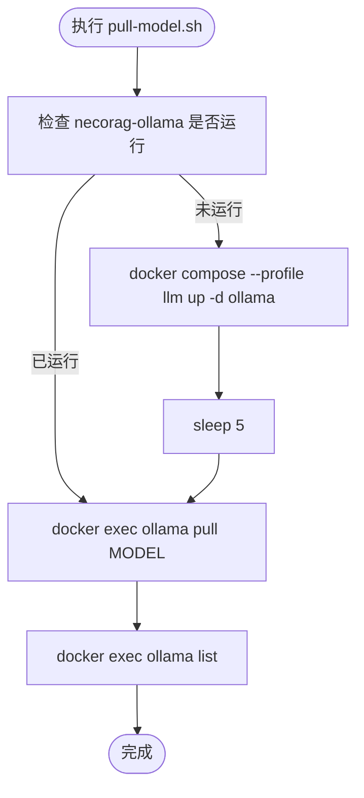
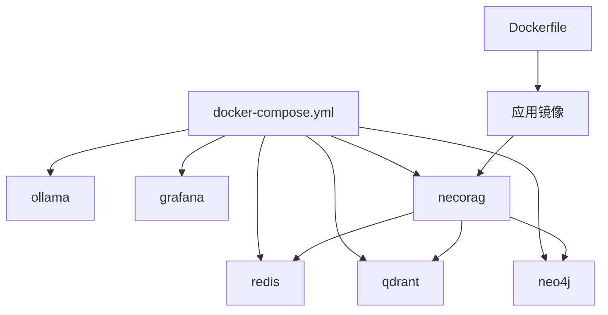
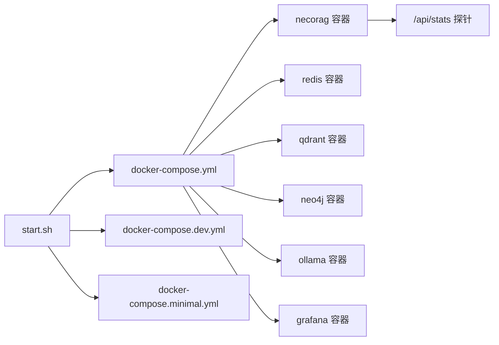

# 运维自动化

<cite>
**本文引用的文件**   
- [opdev/scripts/start.sh](file://opdev/scripts/start.sh)
- [opdev/scripts/stop.sh](file://opdev/scripts/stop.sh)
- [opdev/scripts/status.sh](file://opdev/scripts/status.sh)
- [opdev/scripts/pull-model.sh](file://opdev/scripts/pull-model.sh)
- [opdev/Dockerfile](file://opdev/Dockerfile)
- [opdev/docker-compose.yml](file://opdev/docker-compose.yml)
- [opdev/docker-compose.dev.yml](file://opdev/docker-compose.dev.yml)
- [opdev/docker-compose.minimal.yml](file://opdev/docker-compose.minimal.yml)
- [opdev/.dockerignore](file://opdev/.dockerignore)
- [tools/start_dashboard.py](file://tools/start_dashboard.py)
- [requirements.txt](file://requirements.txt)
- [pyproject.toml](file://pyproject.toml)
- [README.md](file://README.md)
- [QUICKSTART.md](file://QUICKSTART.md)
</cite>

## 目录
1. [引言](#引言)
2. [项目结构](#项目结构)
3. [核心组件](#核心组件)
4. [架构总览](#架构总览)
5. [详细组件分析](#详细组件分析)
6. [依赖分析](#依赖分析)
7. [性能考虑](#性能考虑)
8. [故障排查指南](#故障排查指南)
9. [结论](#结论)
10. [附录](#附录)

## 引言
本文件面向运维与平台工程团队，系统化梳理 NecoRAG 的运维自动化体系，覆盖启动/停止/状态检查脚本、容器化编排与健康检查、自动化部署与版本发布、系统维护任务（清理、备份、更新）、监控与可观测性、以及 CI/CD 集成与回滚策略建议。文档同时提供最佳实践与故障处理自动化流程，帮助团队实现稳定、可重复、可审计的交付与运维。

## 项目结构
NecoRAG 的运维自动化主要由以下部分组成：
- 运维脚本：位于 opdev/scripts，提供启动、停止、状态检查、模型拉取等常用运维动作。
- 容器化与编排：opdev/Dockerfile、docker-compose.* 定义镜像构建、服务编排、健康检查与网络/卷配置。
- 应用入口：tools/start_dashboard.py 提供本地开发与调试的 Web 管理界面启动方式。
- 依赖与打包：requirements.txt、pyproject.toml 管理运行时与可选依赖，支持打包与分发。
- 文档与指南：README.md、QUICKSTART.md 提供使用说明与常见问题，便于自动化流程的落地与标准化。

图表来源
- [opdev/scripts/start.sh:1-101](file://opdev/scripts/start.sh#L1-L101)
- [opdev/scripts/stop.sh:1-36](file://opdev/scripts/stop.sh#L1-L36)
- [opdev/scripts/status.sh:1-48](file://opdev/scripts/status.sh#L1-L48)
- [opdev/scripts/pull-model.sh:1-28](file://opdev/scripts/pull-model.sh#L1-L28)
- [opdev/Dockerfile:1-39](file://opdev/Dockerfile#L1-L39)
- [opdev/docker-compose.yml:1-164](file://opdev/docker-compose.yml#L1-L164)
- [opdev/docker-compose.dev.yml:1-16](file://opdev/docker-compose.dev.yml#L1-L16)
- [opdev/docker-compose.minimal.yml:1-33](file://opdev/docker-compose.minimal.yml#L1-L33)
- [opdev/.dockerignore:1-31](file://opdev/.dockerignore#L1-L31)
- [tools/start_dashboard.py:1-56](file://tools/start_dashboard.py#L1-L56)
- [requirements.txt:1-71](file://requirements.txt#L1-L71)
- [pyproject.toml:1-83](file://pyproject.toml#L1-L83)

章节来源
- [opdev/scripts/start.sh:1-101](file://opdev/scripts/start.sh#L1-L101)
- [opdev/scripts/stop.sh:1-36](file://opdev/scripts/stop.sh#L1-L36)
- [opdev/scripts/status.sh:1-48](file://opdev/scripts/status.sh#L1-L48)
- [opdev/scripts/pull-model.sh:1-28](file://opdev/scripts/pull-model.sh#L1-L28)
- [opdev/Dockerfile:1-39](file://opdev/Dockerfile#L1-L39)
- [opdev/docker-compose.yml:1-164](file://opdev/docker-compose.yml#L1-L164)
- [opdev/docker-compose.dev.yml:1-16](file://opdev/docker-compose.dev.yml#L1-L16)
- [opdev/docker-compose.minimal.yml:1-33](file://opdev/docker-compose.minimal.yml#L1-L33)
- [opdev/.dockerignore:1-31](file://opdev/.dockerignore#L1-L31)
- [tools/start_dashboard.py:1-56](file://tools/start_dashboard.py#L1-L56)
- [requirements.txt:1-71](file://requirements.txt#L1-L71)
- [pyproject.toml:1-83](file://pyproject.toml#L1-L83)

## 核心组件
- 启动脚本：支持多种启动模式（完整/开发/最小/带 LLM），自动检查 Docker 环境与 .env，打印服务访问指引。
- 停止脚本：支持普通停止与“清理数据卷”模式，带交互确认与幂等处理。
- 状态检查脚本：检查容器运行状态、关键服务连通性（Redis/Qdrant/Neo4j/Ollama/Grafana/NecoRAG），列出相关数据卷。
- 模型拉取脚本：自动确保 Ollama 容器运行并拉取指定模型，支持列出可用模型。
- 容器镜像与编排：Dockerfile 定义基础镜像、依赖安装、健康检查与启动命令；docker-compose.yml 定义服务、网络、卷、环境变量与健康检查；dev/minimal 配置用于按需组合。
- 应用入口：tools/start_dashboard.py 提供本地启动参数（host/port/config-dir），便于本地调试与自动化脚本调用。
- 依赖与打包：requirements.txt 与 pyproject.toml 明确运行时与可选依赖，支持不同场景的依赖组合。

章节来源
- [opdev/scripts/start.sh:1-101](file://opdev/scripts/start.sh#L1-L101)
- [opdev/scripts/stop.sh:1-36](file://opdev/scripts/stop.sh#L1-L36)
- [opdev/scripts/status.sh:1-48](file://opdev/scripts/status.sh#L1-L48)
- [opdev/scripts/pull-model.sh:1-28](file://opdev/scripts/pull-model.sh#L1-L28)
- [opdev/Dockerfile:1-39](file://opdev/Dockerfile#L1-L39)
- [opdev/docker-compose.yml:1-164](file://opdev/docker-compose.yml#L1-L164)
- [opdev/docker-compose.dev.yml:1-16](file://opdev/docker-compose.dev.yml#L1-L16)
- [opdev/docker-compose.minimal.yml:1-33](file://opdev/docker-compose.minimal.yml#L1-L33)
- [tools/start_dashboard.py:1-56](file://tools/start_dashboard.py#L1-L56)
- [requirements.txt:1-71](file://requirements.txt#L1-L71)
- [pyproject.toml:1-83](file://pyproject.toml#L1-L83)

## 架构总览
下图展示了运维自动化在系统中的位置与交互：运维脚本通过 Docker Compose 控制容器生命周期，容器内应用通过健康检查与 API 暴露供状态检查脚本探测，Grafana 提供监控与可视化。

图表来源
- [opdev/scripts/start.sh:1-101](file://opdev/scripts/start.sh#L1-L101)
- [opdev/scripts/stop.sh:1-36](file://opdev/scripts/stop.sh#L1-L36)
- [opdev/scripts/status.sh:1-48](file://opdev/scripts/status.sh#L1-L48)
- [opdev/scripts/pull-model.sh:1-28](file://opdev/scripts/pull-model.sh#L1-L28)
- [opdev/Dockerfile:1-39](file://opdev/Dockerfile#L1-L39)
- [opdev/docker-compose.yml:1-164](file://opdev/docker-compose.yml#L1-L164)

## 详细组件分析

### 启动脚本（start.sh）
- 功能概览
  - 自动检查 .env 是否存在，不存在则复制模板并提示修改。
  - 检查 Docker 与 Docker 服务可用性。
  - 支持多种模式：
    - 完整模式：启动全部服务（含 NecoRAG、Redis、Qdrant、Neo4j、Grafana、Ollama）。
    - 开发模式：仅启动后台服务，应用容器按需启动。
    - 最小模式：仅启动 Redis 与 Qdrant。
    - 带 LLM 模式：按 profile 启动 Ollama，并提示拉取模型。
  - 输出服务访问地址与后续操作指引。
- 关键行为
  - 通过 docker compose -f ... up -d 启动，结合 profiles 与多 compose 文件实现灵活编排。
  - 健康检查与端口映射在 Dockerfile 与 docker-compose.yml 中定义，启动脚本负责组合启动。
- 使用建议
  - 在 CI 中使用完整模式进行端到端验证；在本地开发使用 dev 模式减少资源占用；在纯存储测试使用 minimal 模式。

图表来源
- [opdev/scripts/start.sh:1-101](file://opdev/scripts/start.sh#L1-L101)
- [opdev/docker-compose.yml:1-164](file://opdev/docker-compose.yml#L1-L164)
- [opdev/docker-compose.dev.yml:1-16](file://opdev/docker-compose.dev.yml#L1-L16)
- [opdev/docker-compose.minimal.yml:1-33](file://opdev/docker-compose.minimal.yml#L1-L33)

章节来源
- [opdev/scripts/start.sh:1-101](file://opdev/scripts/start.sh#L1-L101)

### 停止脚本（stop.sh）
- 功能概览
  - 普通停止：down 停止服务，保留数据卷。
  - 清理模式：--clean 删除数据卷，带交互确认，防止误操作。
- 关键行为
  - 对主编排与最小编排分别执行 down，保证覆盖所有服务。
  - 使用 2>/dev/null || true 保证幂等与容错。
- 使用建议
  - 日常维护使用普通停止；需要完全重置环境时使用清理模式。

图表来源
- [opdev/scripts/stop.sh:1-36](file://opdev/scripts/stop.sh#L1-L36)
- [opdev/docker-compose.yml:1-164](file://opdev/docker-compose.yml#L1-L164)
- [opdev/docker-compose.minimal.yml:1-33](file://opdev/docker-compose.minimal.yml#L1-L33)

章节来源
- [opdev/scripts/stop.sh:1-36](file://opdev/scripts/stop.sh#L1-L36)

### 状态检查脚本（status.sh）
- 功能概览
  - 打印容器运行状态、关键服务连通性（Redis/Qdrant/Neo4j/Ollama/Grafana/NecoRAG）、数据卷列表。
  - 使用 curl 与 redis-cli 进行连通性探测，失败时标记为红色。
- 关键行为
  - 通过 docker compose ps 与 curl/redis-cli 检查服务可用性。
  - 对 NecoRAG API 提供 /api/stats 探针，与 Dockerfile 健康检查一致。
- 使用建议
  - 作为自动化巡检的一部分，定时执行并记录结果，异常时触发告警与自愈流程。

图表来源
- [opdev/scripts/status.sh:1-48](file://opdev/scripts/status.sh#L1-L48)
- [opdev/Dockerfile:33-35](file://opdev/Dockerfile#L33-L35)
- [opdev/docker-compose.yml:1-164](file://opdev/docker-compose.yml#L1-L164)

章节来源
- [opdev/scripts/status.sh:1-48](file://opdev/scripts/status.sh#L1-L48)

### 模型拉取脚本（pull-model.sh）
- 功能概览
  - 若 Ollama 容器未运行，先按需启动；再执行模型拉取；最后列出可用模型。
- 关键行为
  - 通过 docker ps 检测容器；若不存在则启动；使用 docker exec 调用 ollama 命令。
- 使用建议
  - 在 CI 中预热常用模型，缩短首次推理等待时间；在本地开发中快速切换模型。

图表来源
- [opdev/scripts/pull-model.sh:1-28](file://opdev/scripts/pull-model.sh#L1-L28)
- [opdev/docker-compose.yml:74-97](file://opdev/docker-compose.yml#L74-L97)

章节来源
- [opdev/scripts/pull-model.sh:1-28](file://opdev/scripts/pull-model.sh#L1-L28)

### 容器镜像与编排（Dockerfile 与 docker-compose.*）
- Dockerfile
  - 基于 python:3.11-slim，安装系统依赖与 Python 依赖，复制源码与配置，暴露端口 8000，设置健康检查与 CMD。
  - 健康检查与应用 API /stats 保持一致，便于统一探测。
- docker-compose.yml
  - 定义服务：redis、qdrant、neo4j、ollama、grafana、necorag。
  - 每个服务均配置健康检查、重启策略、端口映射、卷挂载与环境变量。
  - necorag 依赖其他服务健康后再启动，确保整体可用性。
- docker-compose.dev.yml
  - 通过 profiles 控制应用与 LLM/监控服务的按需启动，适合开发场景。
- docker-compose.minimal.yml
  - 仅启动 Redis 与 Qdrant，适合轻量测试或仅需核心存储的场景。
- .dockerignore
  - 忽略 Python/IDE/Git/Docs 等无关文件，减少镜像体积与构建时间。

图表来源
- [opdev/Dockerfile:1-39](file://opdev/Dockerfile#L1-L39)
- [opdev/docker-compose.yml:1-164](file://opdev/docker-compose.yml#L1-L164)
- [opdev/docker-compose.dev.yml:1-16](file://opdev/docker-compose.dev.yml#L1-L16)
- [opdev/docker-compose.minimal.yml:1-33](file://opdev/docker-compose.minimal.yml#L1-L33)
- [opdev/.dockerignore:1-31](file://opdev/.dockerignore#L1-L31)

章节来源
- [opdev/Dockerfile:1-39](file://opdev/Dockerfile#L1-L39)
- [opdev/docker-compose.yml:1-164](file://opdev/docker-compose.yml#L1-L164)
- [opdev/docker-compose.dev.yml:1-16](file://opdev/docker-compose.dev.yml#L1-L16)
- [opdev/docker-compose.minimal.yml:1-33](file://opdev/docker-compose.minimal.yml#L1-L33)
- [opdev/.dockerignore:1-31](file://opdev/.dockerignore#L1-L31)

### 应用入口（tools/start_dashboard.py）
- 功能概览
  - 提供本地启动参数：host、port、config-dir，默认监听 0.0.0.0:8000。
  - 作为 Web 管理界面的入口，与状态检查脚本的 /api/stats 探针配合使用。
- 使用建议
  - 在本地开发与自动化脚本中统一使用该入口，便于参数化与容器化。

章节来源
- [tools/start_dashboard.py:1-56](file://tools/start_dashboard.py#L1-L56)

### 依赖与打包（requirements.txt 与 pyproject.toml）
- requirements.txt
  - 定义运行时依赖（如 numpy、fastapi、uvicorn、redis、qdrant-client、neo4j 等），并标注可选集成项。
- pyproject.toml
  - 定义项目元数据、可选依赖（如 dev、intent、scheduler、scheduler-distributed 等），支持不同场景的依赖组合。
- 使用建议
  - 在 CI 中按需安装可选依赖；在生产镜像中仅保留必要依赖，降低攻击面。

章节来源
- [requirements.txt:1-71](file://requirements.txt#L1-L71)
- [pyproject.toml:1-83](file://pyproject.toml#L1-L83)

## 依赖分析
- 组件耦合
  - 运维脚本与 docker-compose 强耦合，通过多 compose 文件与 profiles 实现灵活编排。
  - 应用容器与后台服务通过网络与健康检查建立依赖关系。
- 外部依赖
  - Docker 与 Docker Compose 为必需运行时。
  - 各服务的健康检查依赖 curl/redis-cli/wget 等工具，Dockerfile 已内置。
- 潜在循环依赖
  - 无直接循环依赖；necorag 服务依赖其他服务健康，形成单向依赖链。

图表来源
- [opdev/scripts/start.sh:1-101](file://opdev/scripts/start.sh#L1-L101)
- [opdev/docker-compose.yml:1-164](file://opdev/docker-compose.yml#L1-L164)
- [opdev/docker-compose.dev.yml:1-16](file://opdev/docker-compose.dev.yml#L1-L16)
- [opdev/docker-compose.minimal.yml:1-33](file://opdev/docker-compose.minimal.yml#L1-L33)
- [opdev/Dockerfile:33-35](file://opdev/Dockerfile#L33-L35)

章节来源
- [opdev/scripts/start.sh:1-101](file://opdev/scripts/start.sh#L1-L101)
- [opdev/docker-compose.yml:1-164](file://opdev/docker-compose.yml#L1-L164)

## 性能考虑
- 启动性能
  - 使用 dev/minimal 编排减少启动时间；在 CI 中按需启动 LLM 与监控服务。
- 健康检查
  - 服务健康检查间隔与超时合理设置，避免频繁探活导致资源浪费。
- 资源占用
  - Neo4j 与 Ollama 对内存与 CPU 较敏感，建议在开发环境按需启动，生产环境评估资源规划。
- 镜像体积
  - 使用 .dockerignore 减少无关文件进入镜像；在生产镜像中仅保留必要依赖。

## 故障排查指南
- Docker 未安装或服务未运行
  - 现象：启动脚本报错退出。
  - 处理：安装 Docker Desktop 并启动服务；再次执行启动脚本。
- 端口冲突
  - 现象：应用或服务无法绑定端口。
  - 处理：使用 tools/start_dashboard.py 的 --port 参数或调整 docker-compose 端口映射。
- 服务不可达
  - 现象：status.sh 检测到服务不可用。
  - 处理：查看对应服务日志（docker compose logs -f 服务名），确认健康检查与依赖服务状态。
- 数据丢失风险
  - 现象：停止后数据消失。
  - 处理：避免使用 --clean；如需清理，提前备份数据卷或迁移至持久化存储。
- LLM 模型缺失
  - 现象：推理失败或报模型不存在。
  - 处理：执行 pull-model.sh 拉取所需模型；确保 Ollama 容器运行。

章节来源
- [opdev/scripts/start.sh:35-44](file://opdev/scripts/start.sh#L35-L44)
- [opdev/scripts/status.sh:21-47](file://opdev/scripts/status.sh#L21-L47)
- [opdev/scripts/stop.sh:21-30](file://opdev/scripts/stop.sh#L21-L30)
- [opdev/scripts/pull-model.sh:15-21](file://opdev/scripts/pull-model.sh#L15-L21)
- [tools/start_dashboard.py:20-41](file://tools/start_dashboard.py#L20-L41)

## 结论
NecoRAG 的运维自动化以 Docker 为核心，结合多 compose 文件与健康检查，提供了灵活、可重复的部署与运维能力。通过标准化的启动/停止/状态检查脚本与容器化编排，团队可以高效地完成本地开发、CI 验证与生产部署。建议在此基础上进一步完善 CI/CD 集成、版本发布与回滚策略、定期维护任务与监控告警，以实现更高水平的自动化与可靠性。

## 附录
- CI/CD 集成与版本发布（建议）
  - 触发条件：push 到主分支或打 Tag。
  - 步骤：拉取代码 → 安装依赖 → 构建镜像 → 运行测试 → 推送镜像 → 启动服务 → 健康检查 → 发布报告。
  - 回滚策略：记录镜像版本与部署时间，支持一键回滚至上一版本。
- 系统维护任务自动化
  - 定期清理：清理旧日志与临时文件，释放磁盘空间。
  - 数据备份：对关键数据卷（redis_data、qdrant_data、neo4j_data、ollama_data、grafana_data、necorag_data）定期快照或导出。
  - 系统更新：镜像定期更新基础系统与依赖，确保安全补丁及时应用。
- 监控自动化
  - 自动故障检测：基于健康检查与 API 探针，异常时触发告警。
  - 自动恢复：容器自动重启策略（unless-stopped）与健康检查失败后的重建。
  - 自动扩容：根据负载与资源使用情况，结合编排工具进行副本扩展（需结合具体平台能力）。
- 运维工具链集成
  - 配置管理：通过 Web Dashboard 与 API 管理配置，支持导入导出与版本控制。
  - 日志分析：集中收集容器日志，结合日志分析工具定位问题。
  - 性能监控：利用 Grafana 面板与探针指标，持续监控系统性能与健康状况。
- 最佳实践
  - 使用 profiles 与最小编排降低资源消耗。
  - 将 .env 管理在 CI/CD 环境变量中，避免明文提交。
  - 健康检查与探针保持一致，确保状态检查准确性。
  - 对关键数据卷进行备份与异地容灾准备。

章节来源
- [README.md:138-152](file://README.md#L138-L152)
- [QUICKSTART.md:237-259](file://QUICKSTART.md#L237-L259)