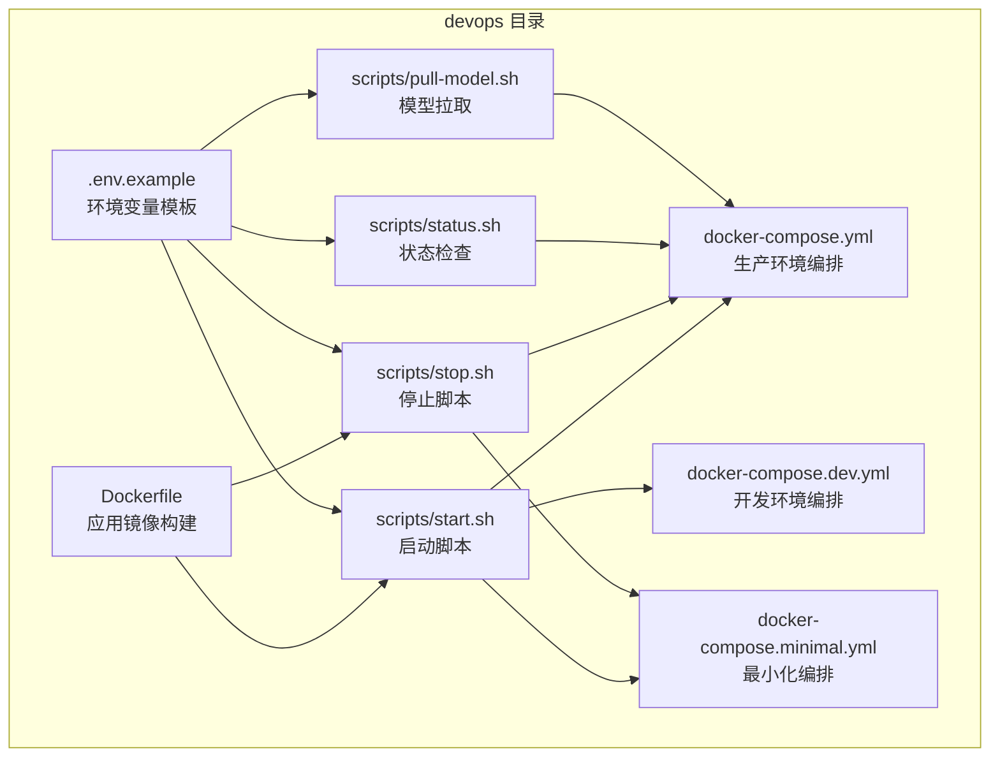
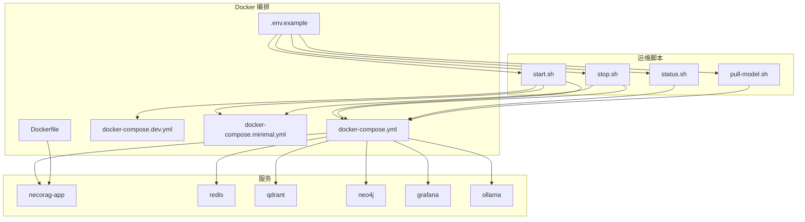
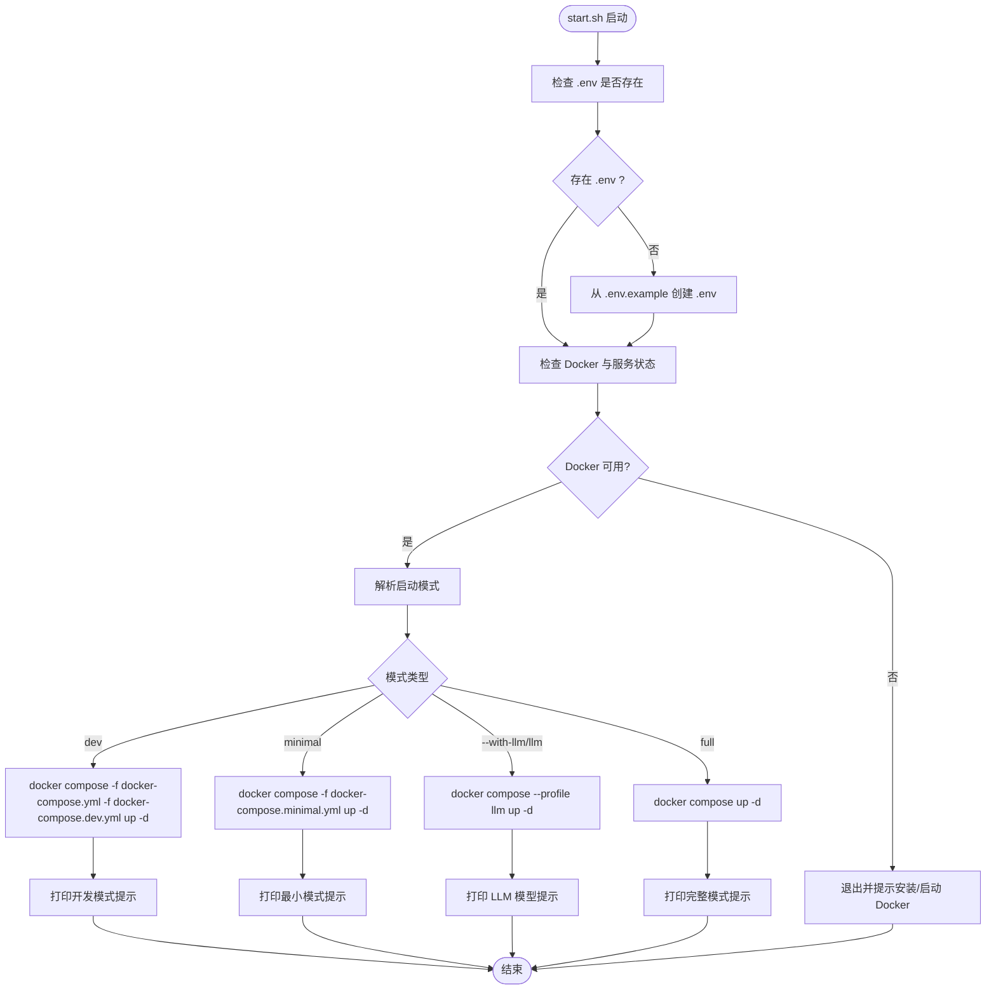
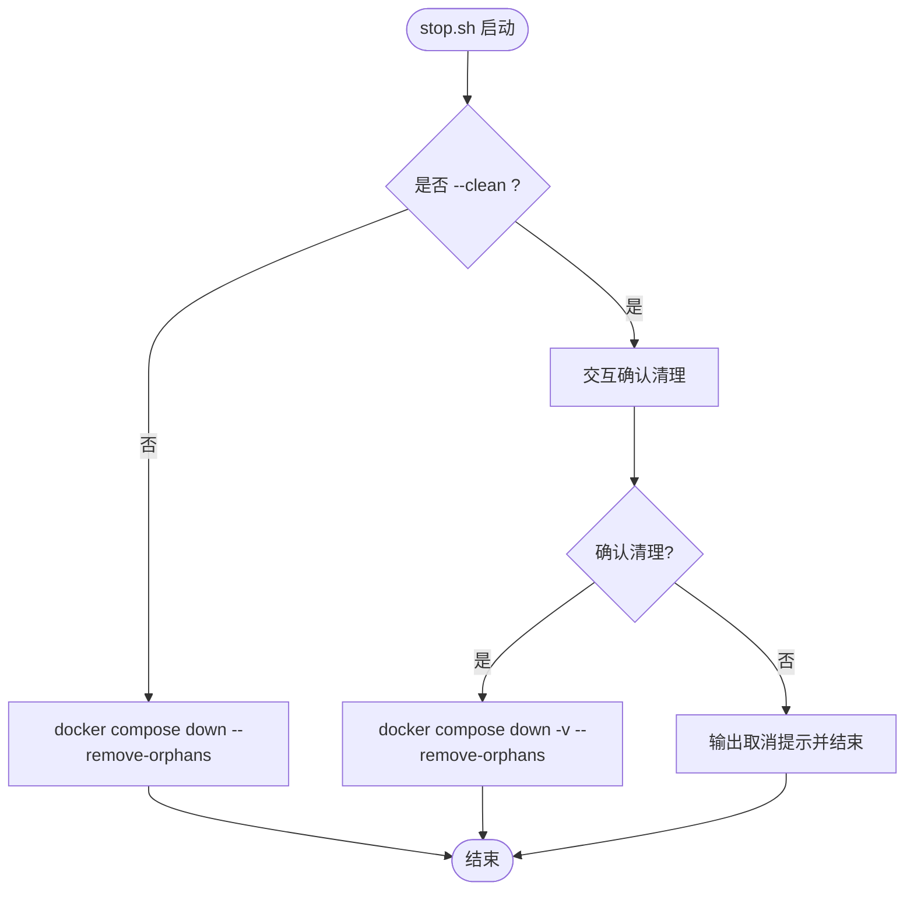
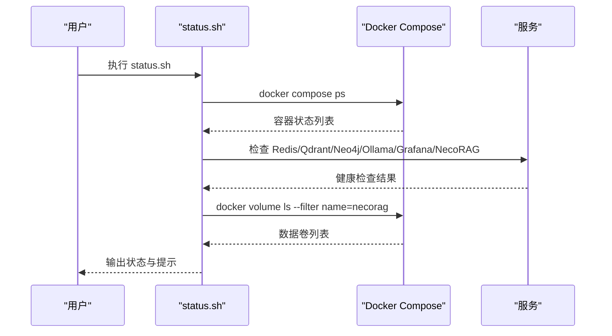
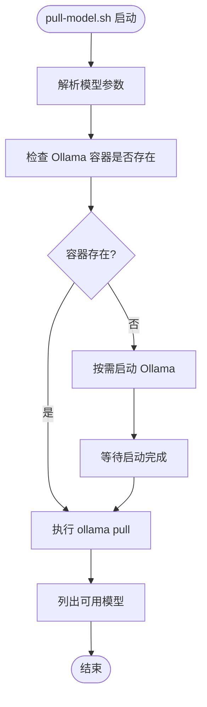
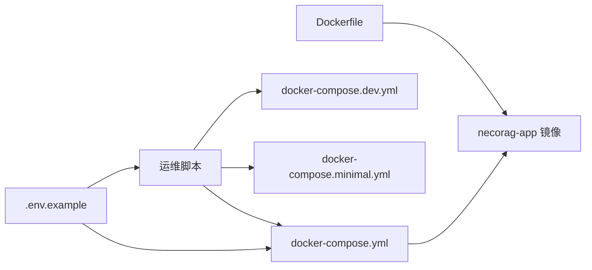

# 运维自动化脚本

<cite>
**本文档引用的文件**
- [start.sh](file://devops/scripts/start.sh)
- [stop.sh](file://devops/scripts/stop.sh)
- [status.sh](file://devops/scripts/status.sh)
- [pull-model.sh](file://devops/scripts/pull-model.sh)
- [docker-compose.yml](file://devops/docker-compose.yml)
- [docker-compose.dev.yml](file://devops/docker-compose.dev.yml)
- [docker-compose.minimal.yml](file://devops/docker-compose.minimal.yml)
- [.env.example](file://devops/.env.example)
- [Dockerfile](file://devops/Dockerfile)
- [README.md](file://devops/README.md)
- [CHANGELOG.md](file://CHANGELOG.md)
</cite>

## 目录
1. [简介](#简介)
2. [项目结构](#项目结构)
3. [核心组件](#核心组件)
4. [架构总览](#架构总览)
5. [详细组件分析](#详细组件分析)
6. [依赖关系分析](#依赖关系分析)
7. [性能考虑](#性能考虑)
8. [故障排除指南](#故障排除指南)
9. [结论](#结论)
10. [附录](#附录)

## 简介
本文件为 NecoRAG 运维自动化脚本的详细实现文档，覆盖以下脚本的功能说明、使用方法、参数选项、返回值、错误处理与日志记录机制，并解释 v3.3.0-alpha 版本的优化与新增功能：
- start.sh：一键启动脚本，支持完整模式、开发模式、最小模式与带 LLM 的模式，负责环境参数传递与启动顺序控制
- stop.sh：优雅停止脚本，支持清理数据卷的强制停止
- status.sh：状态检查脚本，包含容器状态监控、端口占用检查与健康检查集成
- pull-model.sh：模型拉取脚本，支持 Ollama 模型拉取与自动启动 Ollama 容器

## 项目结构
运维相关文件位于 devops 目录，包含 Docker 编排配置、Dockerfile、环境变量模板以及四个自动化脚本。

图表来源
- [docker-compose.yml:1-164](file://devops/docker-compose.yml#L1-L164)
- [docker-compose.dev.yml:1-16](file://devops/docker-compose.dev.yml#L1-L16)
- [docker-compose.minimal.yml:1-33](file://devops/docker-compose.minimal.yml#L1-L33)
- [Dockerfile:1-39](file://devops/Dockerfile#L1-L39)
- [.env.example:1-32](file://devops/.env.example#L1-L32)
- [start.sh:1-101](file://devops/scripts/start.sh#L1-L101)
- [stop.sh:1-36](file://devops/scripts/stop.sh#L1-L36)
- [status.sh:1-48](file://devops/scripts/status.sh#L1-L48)
- [pull-model.sh:1-28](file://devops/scripts/pull-model.sh#L1-L28)

章节来源
- [README.md:1-336](file://devops/README.md#L1-L336)

## 核心组件
本节对四个运维脚本进行功能与实现要点的深入分析。

- 启动脚本 start.sh
  - 功能：根据传入模式启动不同组合的服务，支持完整模式、开发模式、最小模式与带 LLM 的模式；自动检查 Docker 环境与 .env 配置；打印服务访问地址与后续操作提示
  - 关键实现点：路径定位、颜色输出、模式分支、Docker Compose 参数传递、环境变量注入、健康检查提示
  - 返回值：正常退出码 0；异常时输出错误信息并退出非零码
  - 错误处理：未检测到 Docker 或 Docker 服务未运行时直接退出；未知模式时提示用法并退出
  - 日志记录：彩色终端输出，便于人工观察

- 停止脚本 stop.sh
  - 功能：优雅停止所有服务；支持 --clean 参数清理数据卷；交互式确认清理危险操作
  - 关键实现点：条件判断 --clean；down 命令与数据卷清理；孤儿容器移除；静默失败处理
  - 返回值：正常退出码 0；清理确认取消时输出提示并保持退出码 0
  - 错误处理：清理前交互确认；down 失败时忽略错误继续执行
  - 日志记录：彩色终端输出，区分警告与成功信息

- 状态检查脚本 status.sh
  - 功能：检查容器运行状态、关键服务连通性（Redis、Qdrant、Neo4j、Ollama、Grafana、NecoRAG）、列出相关数据卷
  - 关键实现点：curl 健康检查；redis-cli ping 回退；Docker Compose ps 输出；数据卷过滤显示
  - 返回值：正常退出码 0；容器状态查询失败时输出占位信息
  - 错误处理：各服务检查失败时标记为失败；Docker Compose ps 失败时输出占位信息
  - 日志记录：彩色终端输出，使用勾选/叉号标识状态

- 模型拉取脚本 pull-model.sh
  - 功能：拉取指定 Ollama 模型；若 Ollama 容器未运行则自动启动；列出可用模型
  - 关键实现点：参数解析与默认模型；容器存在性检查；条件启动；exec 执行 ollama 命令
  - 返回值：正常退出码 0；容器启动失败不影响后续拉取
  - 错误处理：容器不存在时尝试启动；拉取完成后列出模型
  - 日志记录：彩色终端输出，提示拉取进度与结果

章节来源
- [start.sh:1-101](file://devops/scripts/start.sh#L1-L101)
- [stop.sh:1-36](file://devops/scripts/stop.sh#L1-L36)
- [status.sh:1-48](file://devops/scripts/status.sh#L1-L48)
- [pull-model.sh:1-28](file://devops/scripts/pull-model.sh#L1-L28)

## 架构总览
下图展示 NecoRAG 运维脚本与 Docker 编排的关系，以及各脚本如何通过 Docker Compose 控制服务生命周期。

图表来源
- [start.sh:1-101](file://devops/scripts/start.sh#L1-L101)
- [stop.sh:1-36](file://devops/scripts/stop.sh#L1-L36)
- [status.sh:1-48](file://devops/scripts/status.sh#L1-L48)
- [pull-model.sh:1-28](file://devops/scripts/pull-model.sh#L1-L28)
- [docker-compose.yml:1-164](file://devops/docker-compose.yml#L1-L164)
- [docker-compose.dev.yml:1-16](file://devops/docker-compose.dev.yml#L1-L16)
- [docker-compose.minimal.yml:1-33](file://devops/docker-compose.minimal.yml#L1-L33)
- [Dockerfile:1-39](file://devops/Dockerfile#L1-L39)
- [.env.example:1-32](file://devops/.env.example#L1-L32)

## 详细组件分析

### 启动脚本 start.sh 详细分析
- 功能概述
  - 支持多种启动模式：完整模式（默认）、开发模式、最小模式、带 LLM 的模式
  - 自动检查 Docker 环境与 .env 配置文件，必要时从模板创建
  - 根据模式选择不同的 Compose 配置文件与 profile，控制服务启动范围
  - 输出服务访问地址与后续操作建议

- 参数与用法
  - 无参数：完整模式，启动全部服务
  - dev：开发模式，仅启动后台服务（应用容器按需启动）
  - minimal：最小模式，仅启动 Redis 与 Qdrant
  - --with-llm 或 llm：完整服务 + LLM（Ollama），并提示拉取模型
  - 其他参数：报错并显示用法

- 环境参数传递
  - 通过 .env 文件注入端口与认证等环境变量
  - 应用容器读取 LLM 提供商、向量数据库、图数据库等配置
  - LLM 提供商可切换为 mock 或 ollama

- 启动顺序控制
  - 通过 depends_on 与健康检查确保 Redis、Qdrant、Neo4j 在应用启动前处于健康状态
  - 开发模式下应用容器默认不启动，便于本地调试

- 错误处理与日志
  - Docker 未安装或服务未运行时直接退出
  - 未知模式时输出帮助信息并退出
  - 彩色终端输出，便于快速识别状态

图表来源
- [start.sh:1-101](file://devops/scripts/start.sh#L1-L101)
- [docker-compose.yml:1-164](file://devops/docker-compose.yml#L1-L164)
- [docker-compose.dev.yml:1-16](file://devops/docker-compose.dev.yml#L1-L16)
- [docker-compose.minimal.yml:1-33](file://devops/docker-compose.minimal.yml#L1-L33)
- [.env.example:1-32](file://devops/.env.example#L1-L32)

章节来源
- [start.sh:1-101](file://devops/scripts/start.sh#L1-L101)
- [docker-compose.yml:1-164](file://devops/docker-compose.yml#L1-L164)
- [docker-compose.dev.yml:1-16](file://devops/docker-compose.dev.yml#L1-L16)
- [docker-compose.minimal.yml:1-33](file://devops/docker-compose.minimal.yml#L1-L33)
- [.env.example:1-32](file://devops/.env.example#L1-L32)

### 停止脚本 stop.sh 详细分析
- 功能概述
  - 优雅停止所有服务，支持清理数据卷的强制停止
  - 交互式确认清理操作，避免误删数据

- 参数与用法
  - 无参数：停止服务但保留数据卷
  - --clean：停止并清理数据卷，需用户确认

- 实现细节
  - 同时调用主编排与最小化编排的 down 命令，确保所有相关服务停止
  - 使用 --remove-orphans 清理孤儿容器
  - 静默失败处理，避免单个服务停止失败影响整体流程

- 错误处理与日志
  - 清理前弹窗确认，用户输入 y/Y 才执行清理
  - 清理完成后输出成功信息；取消时输出提示信息

图表来源
- [stop.sh:1-36](file://devops/scripts/stop.sh#L1-L36)

章节来源
- [stop.sh:1-36](file://devops/scripts/stop.sh#L1-L36)

### 状态检查脚本 status.sh 详细分析
- 功能概述
  - 检查容器运行状态、关键服务连通性与数据卷情况
  - 对 Redis 提供回退检查（redis-cli ping）

- 实现细节
  - 使用 docker compose ps 获取容器状态
  - 对各服务使用 curl 或专用客户端进行健康检查
  - 过滤并列出与项目相关的数据卷

- 错误处理与日志
  - 各服务检查失败时输出失败标识
  - 容器状态查询失败时输出占位信息

图表来源
- [status.sh:1-48](file://devops/scripts/status.sh#L1-L48)

章节来源
- [status.sh:1-48](file://devops/scripts/status.sh#L1-L48)

### 模型拉取脚本 pull-model.sh 详细分析
- 功能概述
  - 拉取指定 Ollama 模型；若 Ollama 容器未运行则自动启动
  - 列出当前可用模型

- 参数与用法
  - 无参数：默认拉取 qwen2:7b
  - 指定模型名称：如 bge-m3、bge-reranker-v2 等

- 实现细节
  - 通过容器名匹配检查 Ollama 是否运行
  - 若未运行则按需启动 Ollama 服务
  - 使用 docker exec 在容器内执行 ollama 命令

- 错误处理与日志
  - 容器不存在时尝试启动；拉取完成后列出模型列表

图表来源
- [pull-model.sh:1-28](file://devops/scripts/pull-model.sh#L1-L28)

章节来源
- [pull-model.sh:1-28](file://devops/scripts/pull-model.sh#L1-L28)

## 依赖关系分析
- 脚本与编排文件
  - start.sh/stop.sh/status.sh/pull-model.sh 均基于 docker-compose.yml 及其变体进行服务编排
  - 开发模式依赖 docker-compose.dev.yml 的 profile 配置
  - 最小模式依赖 docker-compose.minimal.yml 的简化服务集合

- 脚本与环境变量
  - .env.example 提供端口、认证与 LLM 配置模板
  - 应用容器读取环境变量决定数据库连接与 LLM 提供商

- 脚本与应用镜像
  - Dockerfile 定义应用镜像构建过程与健康检查
  - 运维脚本通过 Compose 启动应用容器并暴露端口

图表来源
- [docker-compose.yml:1-164](file://devops/docker-compose.yml#L1-L164)
- [docker-compose.dev.yml:1-16](file://devops/docker-compose.dev.yml#L1-L16)
- [docker-compose.minimal.yml:1-33](file://devops/docker-compose.minimal.yml#L1-L33)
- [.env.example:1-32](file://devops/.env.example#L1-L32)
- [Dockerfile:1-39](file://devops/Dockerfile#L1-L39)

章节来源
- [docker-compose.yml:1-164](file://devops/docker-compose.yml#L1-L164)
- [docker-compose.dev.yml:1-16](file://devops/docker-compose.dev.yml#L1-L16)
- [docker-compose.minimal.yml:1-33](file://devops/docker-compose.minimal.yml#L1-L33)
- [.env.example:1-32](file://devops/.env.example#L1-L32)
- [Dockerfile:1-39](file://devops/Dockerfile#L1-L39)

## 性能考虑
- 启动顺序与健康检查
  - 通过 depends_on 与健康检查确保下游服务就绪后再启动应用，减少启动失败与重试开销
- 资源隔离
  - 使用独立网络隔离服务，降低跨服务通信延迟
- 数据持久化
  - 通过命名卷持久化关键数据，避免频繁重建带来的初始化成本

## 故障排除指南
- Docker 未安装或服务未运行
  - 现象：启动脚本报错并退出
  - 处理：安装 Docker Desktop 并启动服务后重试

- 端口冲突
  - 现象：服务启动失败或访问异常
  - 处理：修改 .env 中对应端口变量后重启

- 数据卷清理
  - 现象：停止后仍存在历史数据导致状态异常
  - 处理：使用 --clean 参数清理数据卷并确认操作

- 服务健康检查失败
  - 现象：status.sh 显示服务不可用
  - 处理：查看对应服务日志，确认依赖服务（如 Redis、Qdrant、Neo4j）已健康运行

章节来源
- [start.sh:35-44](file://devops/scripts/start.sh#L35-L44)
- [stop.sh:21-30](file://devops/scripts/stop.sh#L21-L30)
- [status.sh:21-30](file://devops/scripts/status.sh#L21-L30)
- [README.md:239-281](file://devops/README.md#L239-L281)

## 结论
NecoRAG 运维自动化脚本通过简洁的 Bash 脚本与完善的 Docker 编排配置，实现了多模式的一键部署、优雅停止、状态检查与模型拉取能力。结合健康检查与环境变量管理，确保了服务的稳定性与可观测性。v3.3.0-alpha 版本在脚本层面提供了更清晰的模式选择与交互体验，同时保持了与 Docker 编排的强耦合与一致性。

## 附录

### 使用方法与参数说明
- 启动脚本
  - 用法：./devops/scripts/start.sh [dev|minimal|full|--with-llm]
  - 默认：完整模式，启动全部服务
  - 提示：首次运行会自动生成 .env 文件

- 停止脚本
  - 用法：./devops/scripts/stop.sh [--clean]
  - 默认：停止服务但保留数据卷
  - --clean：停止并清理数据卷（需确认）

- 状态检查脚本
  - 用法：./devops/scripts/status.sh
  - 输出：容器状态、服务连通性、数据卷列表

- 模型拉取脚本
  - 用法：./devops/scripts/pull-model.sh [模型名称]
  - 默认：qwen2:7b
  - 示例：./devops/scripts/pull-model.sh bge-m3

章节来源
- [start.sh:3-9](file://devops/scripts/start.sh#L3-L9)
- [stop.sh:3-6](file://devops/scripts/stop.sh#L3-L6)
- [status.sh:1-3](file://devops/scripts/status.sh#L1-L3)
- [pull-model.sh:1-3](file://devops/scripts/pull-model.sh#L1-L3)

### 环境变量与执行环境要求
- 环境变量
  - 端口与认证：NECORAG_PORT、REDIS_PORT、QDRANT_HTTP_PORT、QDRANT_GRPC_PORT、NEO4J_HTTP_PORT、NEO4J_BOLT_PORT、OLLAMA_PORT、GRAFANA_PORT、NEO4J_USER、NEO4J_PASSWORD、GRAFANA_USER、GRAFANA_PASSWORD
  - LLM 配置：LLM_PROVIDER、OLLAMA_MODEL
  - 应用配置：NECORAG_DEBUG

- 执行环境要求
  - Docker 与 Docker Compose
  - Bash 环境
  - 可选：curl、redis-cli（用于健康检查）

章节来源
- [.env.example:7-32](file://devops/.env.example#L7-L32)
- [docker-compose.yml:130-138](file://devops/docker-compose.yml#L130-L138)

### v3.3.0-alpha 版本优化与新功能
- 版本信息
  - 发布日期：2026-03-19
  - 版本号：3.3.0-alpha
- 优化与变更
  - 本版本主要涉及文档与部分文件的调整，运维脚本层面保持稳定
  - 建议在升级时同步检查 .env 与 Compose 配置文件的兼容性

章节来源
- [CHANGELOG.md:1-54](file://CHANGELOG.md#L1-L54)