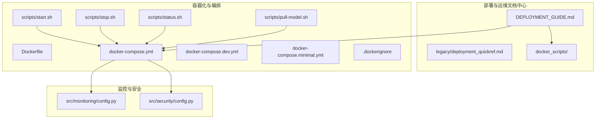
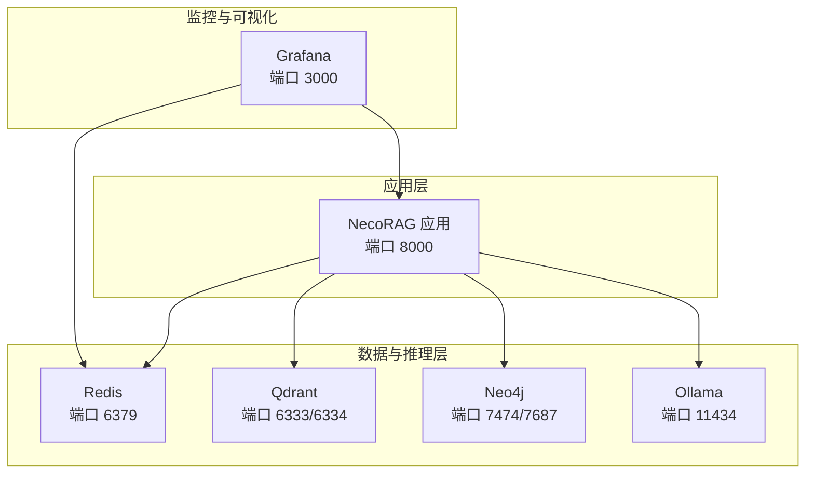
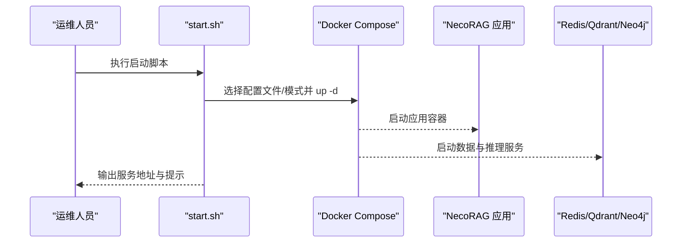
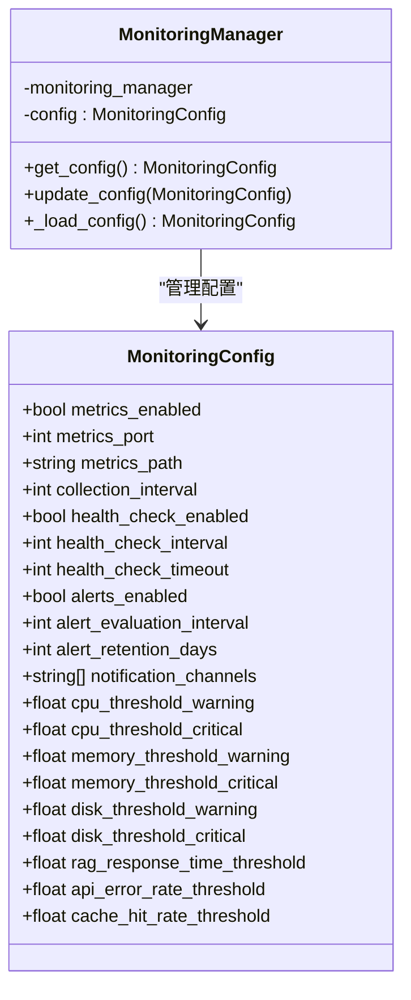
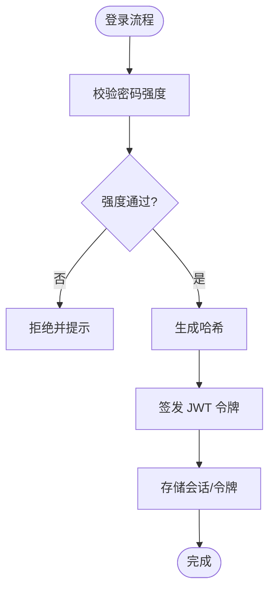
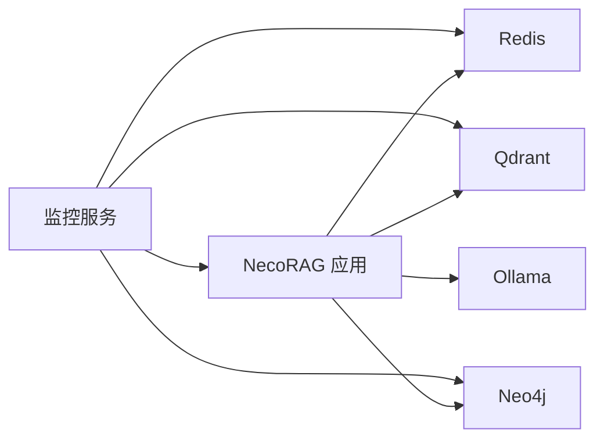

# 部署与运维

<cite>
**本文引用的文件**
- [DEPLOYMENT_GUIDE.md](file://3rd/DEPLOYMENT_GUIDE.md)
- [deployment_quickref.md](file://3rd/legacy/deployment_quickref.md)
- [Dockerfile](file://devops/Dockerfile)
- [.dockerignore](file://devops/.dockerignore)
- [docker-compose.yml](file://devops/docker-compose.yml)
- [docker-compose.dev.yml](file://devops/docker-compose.dev.yml)
- [docker-compose.minimal.yml](file://devops/docker-compose.minimal.yml)
- [start.sh](file://devops/scripts/start.sh)
- [stop.sh](file://devops/scripts/stop.sh)
- [status.sh](file://devops/scripts/status.sh)
- [pull-model.sh](file://devops/scripts/pull-model.sh)
- [import_docker_images.sh](file://3rd/docker_scripts/import_docker_images.sh)
- [verify_docker_images.sh](file://3rd/docker_scripts/verify_docker_images.sh)
- [config.py](file://src/monitoring/config.py)
- [config.py](file://src/security/config.py)
- [requirements.txt](file://requirements.txt)
- [pyproject.toml](file://pyproject.toml)
</cite>

## 更新摘要
**所做更改**
- 更新了部署操作文档结构，反映新的DEPLOYMENT_GUIDE.md文件组织方式
- 新增了完整的部署快速参考和Docker镜像指南内容
- 完善了多服务编排的部署模式说明和环境变量配置
- 增强了监控配置和安全配置的详细说明
- 补充了依赖管理的最佳实践和镜像导入验证流程

## 目录
1. [引言](#引言)
2. [项目结构](#项目结构)
3. [核心组件](#核心组件)
4. [架构总览](#架构总览)
5. [详细组件分析](#详细组件分析)
6. [依赖关系分析](#依赖关系分析)
7. [性能考虑](#性能考虑)
8. [故障排除指南](#故障排除指南)
9. [结论](#结论)
10. [附录](#附录)

## 引言
本文件面向部署与运维工程师，提供 NecoRAG 在生产环境中的容器化与多服务编排部署指南。内容涵盖镜像构建优化、环境变量配置管理、数据持久化策略、负载均衡与高可用建议、监控与告警集成、故障恢复自动化流程、运维脚本使用方法、性能调优参数以及安全加固最佳实践。目标是帮助团队快速搭建稳定可靠的生产环境。

**更新** 本指南已重组为新的DEPLOYMENT_GUIDE.md文件，提供更完整的部署指导和快速参考。

## 项目结构
围绕部署与运维的关键目录与文件如下：
- 3rd：部署与运维文档中心
  - DEPLOYMENT_GUIDE.md：完整的部署指南，包含快速启动、组件独立部署、配置模板、端口速查和故障排查
  - docker_scripts：Docker镜像导入和验证工具
  - legacy：历史部署快速参考文档
- devops：容器化与编排配置、运维脚本
  - Dockerfile：应用镜像构建定义
  - .dockerignore：构建阶段排除项
  - docker-compose.yml：统一编排（含 Redis/Qdrant/Neo4j/Ollama/Grafana/NecoRAG）
  - docker-compose.dev.yml：开发模式配置（按需启动）
  - docker-compose.minimal.yml：最小化编排（仅 Redis + Qdrant）
  - scripts：运维脚本（启动/停止/状态检查/模型拉取）
- src/monitoring：监控与告警子系统（配置、服务、指标）
- src/security：安全配置与认证（JWT/OAuth2/速率限制等）
- requirements.txt / pyproject.toml：依赖清单与可选特性

**图表来源**
- [DEPLOYMENT_GUIDE.md:1-999](file://3rd/DEPLOYMENT_GUIDE.md#L1-L999)
- [Dockerfile:1-39](file://devops/Dockerfile#L1-L39)
- [docker-compose.yml:1-164](file://devops/docker-compose.yml#L1-L164)
- [docker-compose.dev.yml:1-16](file://devops/docker-compose.dev.yml#L1-L16)
- [docker-compose.minimal.yml:1-33](file://devops/docker-compose.minimal.yml#L1-L33)
- [.dockerignore:1-31](file://devops/.dockerignore#L1-L31)
- [start.sh:1-101](file://devops/scripts/start.sh#L1-L101)
- [stop.sh:1-36](file://devops/scripts/stop.sh#L1-L36)
- [status.sh:1-48](file://devops/scripts/status.sh#L1-L48)
- [pull-model.sh:1-28](file://devops/scripts/pull-model.sh#L1-L28)
- [config.py:1-117](file://src/monitoring/config.py#L1-L117)
- [config.py:1-92](file://src/security/config.py#L1-L92)

**章节来源**
- [DEPLOYMENT_GUIDE.md:1-999](file://3rd/DEPLOYMENT_GUIDE.md#L1-L999)
- [Dockerfile:1-39](file://devops/Dockerfile#L1-L39)
- [docker-compose.yml:1-164](file://devops/docker-compose.yml#L1-L164)
- [docker-compose.dev.yml:1-16](file://devops/docker-compose.dev.yml#L1-L16)
- [docker-compose.minimal.yml:1-33](file://devops/docker-compose.minimal.yml#L1-L33)
- [.dockerignore:1-31](file://devops/.dockerignore#L1-L31)

## 核心组件
- 完整部署指南
  - DEPLOYMENT_GUIDE.md提供快速开始、一键启动脚本、各组件独立部署、配置文件模板、端口速查和故障排查的完整指导
  - 包含开发环境、生产环境和最小化部署三种启动模式
- 容器镜像与构建
  - 基于精简 Python 镜像，安装必要系统依赖，复制依赖与源码，创建数据/配置/日志目录，暴露应用端口，设置健康检查，指定启动命令
- 多服务编排
  - 统一编排包含：Redis（工作记忆）、Qdrant（语义记忆）、Neo4j（情景图谱）、Ollama（LLM 推理）、Grafana（监控可视化）、NecoRAG 应用
  - 提供开发模式与最小化模式，便于不同场景快速启动
- 镜像导入与验证
  - import_docker_images.sh：智能镜像源选择、磁盘空间检查、批量镜像导入
  - verify_docker_images.sh：镜像完整性验证、状态检查
- 运维脚本
  - start.sh：支持完整/开发/最小/带LLM四种模式；自动检查 Docker 与 .env；打印服务地址；提示拉取模型
  - stop.sh：停止所有服务，支持清理数据卷（交互确认）
  - status.sh：检查容器状态、各服务连通性、数据卷
  - pull-model.sh：按需启动 Ollama 并拉取指定模型
- 监控与告警
  - 配置模型：指标采集、健康检查、告警、通知渠道、阈值
  - 服务：定时收集系统/应用指标、执行健康检查、评估告警规则
  - 指标：CPU/内存/磁盘/网络/进程/垃圾回收/Prometheus 导出
- 安全配置
  - JWT 密钥/算法/过期；OAuth2 提供商配置；速率限制；CSRF/XSS；跨域白名单；密码强度策略

**章节来源**
- [DEPLOYMENT_GUIDE.md:21-170](file://3rd/DEPLOYMENT_GUIDE.md#L21-L170)
- [Dockerfile:1-39](file://devops/Dockerfile#L1-L39)
- [docker-compose.yml:1-164](file://devops/docker-compose.yml#L1-L164)
- [import_docker_images.sh:1-589](file://3rd/docker_scripts/import_docker_images.sh#L1-L589)
- [verify_docker_images.sh:1-84](file://3rd/docker_scripts/verify_docker_images.sh#L1-L84)
- [start.sh:1-101](file://devops/scripts/start.sh#L1-L101)
- [stop.sh:1-36](file://devops/scripts/stop.sh#L1-L36)
- [status.sh:1-48](file://devops/scripts/status.sh#L1-L48)
- [pull-model.sh:1-28](file://devops/scripts/pull-model.sh#L1-L28)
- [config.py:1-117](file://src/monitoring/config.py#L1-L117)
- [config.py:1-92](file://src/security/config.py#L1-L92)

## 架构总览
下图展示生产环境典型拓扑：NecoRAG 应用通过 Docker Compose 编排多个服务，应用容器依赖 Redis/Qdrant/Neo4j，并可选接入 Ollama；Grafana 作为可视化与告警聚合平台。

**图表来源**
- [docker-compose.yml:1-164](file://devops/docker-compose.yml#L1-L164)

## 详细组件分析

### 完整部署指南与快速参考
- 部署指南重组
  - DEPLOYMENT_GUIDE.md整合了原有的部署快速参考和Docker镜像指南，提供更完整的部署指导
  - 包含一键启动脚本、各组件独立部署、配置文件模板、端口速查和故障排查
- 快速启动模式
  - 开发环境：启动全部服务，自动拉取Ollama模型
  - 生产环境：设置资源限制，执行健康检查
  - 最小化部署：仅启动核心存储服务（Redis + Qdrant）

**章节来源**
- [DEPLOYMENT_GUIDE.md:21-170](file://3rd/DEPLOYMENT_GUIDE.md#L21-L170)
- [DEPLOYMENT_GUIDE.md:173-424](file://3rd/DEPLOYMENT_GUIDE.md#L173-L424)

### 容器镜像构建与优化
- 基础镜像与依赖安装
  - 使用精简 Python 镜像，减少镜像体积；安装构建工具与 curl；避免缓存目录残留
- 依赖安装
  - 先复制依赖清单再安装，利用 Docker 缓存；安装完成后复制源码与工具脚本
- 目录与权限
  - 创建 /app/data、/app/configs、/app/logs；应用以非 root 用户运行更佳（当前 CMD 以 python 启动）
- 健康检查
  - 通过 HTTP 接口探测 /api/stats，周期与超时可调
- 启动命令
  - 通过工具脚本启动仪表盘服务，监听 0.0.0.0:8000

优化建议
- 多阶段构建：分离构建与运行阶段，进一步瘦身镜像
- 只复制必要文件：结合 .dockerignore，避免无关文件进入镜像
- 使用非 root 用户运行应用，提升安全性
- 为健康检查增加更细粒度的内部依赖探测（如数据库连接）

**章节来源**
- [Dockerfile:1-39](file://devops/Dockerfile#L1-L39)
- [.dockerignore:1-31](file://devops/.dockerignore#L1-L31)

### Docker镜像导入与验证系统
- 智能镜像源选择
  - 自动检测网络环境（中国大陆/海外）
  - Docker Hub官方镜像源 vs 阿里云镜像加速器
  - 支持手动切换镜像源
- 磁盘空间检查
  - 计算所需磁盘空间（MB）
  - 建议预留20%额外空间
  - 提供清理建议和继续选项
- 镜像选择菜单
  - 必需镜像：Redis、Qdrant、Neo4j、Ollama、Grafana
  - 可选镜像：Milvus、Memgraph、Prometheus、Superset
  - 支持仅下载必需镜像、下载全部镜像、自定义选择
- 验证与报告
  - 汇总统计：总计尝试、成功、失败、实际下载
  - 显示所有已拉取的镜像
  - 提供下一步操作指引

**章节来源**
- [import_docker_images.sh:74-181](file://3rd/docker_scripts/import_docker_images.sh#L74-L181)
- [import_docker_images.sh:183-295](file://3rd/docker_scripts/import_docker_images.sh#L183-L295)
- [import_docker_images.sh:329-453](file://3rd/docker_scripts/import_docker_images.sh#L329-L453)
- [verify_docker_images.sh:38-83](file://3rd/docker_scripts/verify_docker_images.sh#L38-L83)

### 多服务编排与环境变量管理
- 统一编排
  - 通过 docker-compose.yml 启动全部服务，定义网络、数据卷、环境变量、健康检查与依赖顺序
- 开发模式
  - docker-compose.dev.yml 使用 profiles 控制按需启动（应用/LLM/监控），适合本地联调
- 最小化编排
  - docker-compose.minimal.yml 仅启动 Redis 与 Qdrant，便于快速验证检索链路
- 环境变量
  - 应用侧通过环境变量控制 LLM 提供商、数据库连接、调试开关等
  - 数据库与可视化组件通过环境变量设置认证与端口映射
- 数据持久化
  - 使用命名卷保存 Redis/Qdrant/Neo4j/Ollama/Grafana 的数据与快照，避免容器重建丢失数据

**章节来源**
- [docker-compose.yml:1-164](file://devops/docker-compose.yml#L1-L164)
- [docker-compose.dev.yml:1-16](file://devops/docker-compose.dev.yml#L1-L16)
- [docker-compose.minimal.yml:1-33](file://devops/docker-compose.minimal.yml#L1-L33)

### 运维脚本使用指南
- 启动
  - ./scripts/start.sh：完整模式启动全部服务；dev 模式仅后台服务；minimal 仅核心存储；--with-llm 启动 LLM
  - 自动检查 Docker 与 .env；打印服务访问地址；提示拉取模型
- 停止
  - ./scripts/stop.sh：停止所有服务；--clean 清理数据卷（交互确认）
- 状态
  - ./scripts/status.sh：显示容器状态、连通性检查、数据卷列表
- 模型拉取
  - ./scripts/pull-model.sh：按需启动 Ollama 并拉取指定模型，列出可用模型

**图表来源**
- [start.sh:1-101](file://devops/scripts/start.sh#L1-L101)
- [docker-compose.yml:1-164](file://devops/docker-compose.yml#L1-L164)

**章节来源**
- [start.sh:1-101](file://devops/scripts/start.sh#L1-L101)
- [stop.sh:1-36](file://devops/scripts/stop.sh#L1-L36)
- [status.sh:1-48](file://devops/scripts/status.sh#L1-L48)
- [pull-model.sh:1-28](file://devops/scripts/pull-model.sh#L1-L28)

### 监控与告警集成
- 配置模型
  - 指标采集开关、端口、路径、间隔；健康检查间隔与超时；告警开关、评估间隔、留存天数；通知渠道（控制台/邮件/Webhook/Slack）；各类阈值（CPU/内存/磁盘/RAG 响应时间/API 错误率/缓存命中率）
- 服务生命周期
  - FastAPI 应用在启动时初始化监控服务并启动调度器；定时任务包括指标收集、健康检查、告警评估；关闭时优雅停机
- 指标采集
  - 系统指标：CPU/内存/磁盘/网络/进程/负载；Python 运行时指标：GC 统计、内存使用、版本信息
  - 应用指标：RAG 响应时间、API 调用、缓存操作、模型推理耗时
  - Prometheus 导出：将最近样本导出为 Prometheus 格式

**图表来源**
- [config.py:1-117](file://src/monitoring/config.py#L1-L117)

**章节来源**
- [config.py:1-117](file://src/monitoring/config.py#L1-L117)

### 安全加固与配置
- JWT
  - 密钥、算法、过期时间；令牌签发与解码；依赖注入获取当前用户
- OAuth2
  - GitHub/Google 配置；授权 URL、令牌 URL、用户信息 URL；回调处理
- 速率限制与防护
  - 速率限制开关与窗口；CSRF/XSS 开关；跨域白名单；密码强度策略（长度、大小写、数字、特殊字符）
- 依赖与可选特性
  - requirements.txt 与 pyproject.toml 明确核心与可选依赖，便于按需安装

**图表来源**
- [config.py:1-92](file://src/security/config.py#L1-L92)

**章节来源**
- [config.py:1-92](file://src/security/config.py#L1-L92)
- [requirements.txt:1-161](file://requirements.txt#L1-L161)
- [pyproject.toml:1-101](file://pyproject.toml#L1-L101)

## 依赖关系分析
- 组件耦合
  - 应用容器依赖 Redis/Qdrant/Neo4j；可选依赖 Ollama；监控服务独立于业务容器但可通过 Prometheus 暴露指标
- 外部依赖
  - Python 依赖集中在核心与可选模块；监控与安全模块通过 Prometheus、Passlib、PyJWT 等库实现
- 数据流
  - 应用通过环境变量连接外部服务；指标由系统与应用指标共同构成，Prometheus 导出供 Grafana 抓取

**图表来源**
- [docker-compose.yml:1-164](file://devops/docker-compose.yml#L1-L164)

**章节来源**
- [docker-compose.yml:1-164](file://devops/docker-compose.yml#L1-L164)
- [requirements.txt:1-161](file://requirements.txt#L1-L161)
- [pyproject.toml:1-101](file://pyproject.toml#L1-L101)

## 性能考虑
- 指标采集频率
  - 调整监控配置中的采集间隔与健康检查间隔，平衡精度与开销
- 系统资源
  - 根据实际负载调整 Redis/Qdrant/Neo4j/Ollama 的内存与线程参数；监控磁盘使用率，防止写放大
- 应用层
  - 通过 Prometheus 指标观察响应时间、错误率与缓存命中率，定位瓶颈
- LLM 推理
  - 合理设置模型批处理与并发；GPU 推理时注意显存占用与温度控制

## 故障排除指南
- 启动失败
  - 使用 ./scripts/status.sh 检查容器状态与服务连通性；核对 .env 是否存在且配置正确
- 数据丢失
  - 停止前确认使用的是命名卷；如需清理数据，使用 ./scripts/stop.sh --clean 并确认风险
- LLM 模型缺失
  - 使用 ./scripts/pull-model.sh 拉取所需模型；确保 Ollama 服务已启动
- 健康检查失败
  - 查看应用健康检查端点与外部服务健康检查；检查网络连通与端口映射
- 监控异常
  - 检查监控服务是否启动；确认 Prometheus 导出端口可达；核对阈值与通知渠道配置
- 镜像问题
  - 使用 ./3rd/docker_scripts/verify_docker_images.sh 验证镜像完整性
  - 使用 ./3rd/docker_scripts/import_docker_images.sh 重新导入镜像

**章节来源**
- [status.sh:1-48](file://devops/scripts/status.sh#L1-L48)
- [stop.sh:1-36](file://devops/scripts/stop.sh#L1-L36)
- [pull-model.sh:1-28](file://devops/scripts/pull-model.sh#L1-L28)
- [docker-compose.yml:1-164](file://devops/docker-compose.yml#L1-L164)
- [verify_docker_images.sh:38-83](file://3rd/docker_scripts/verify_docker_images.sh#L38-L83)
- [import_docker_images.sh:384-509](file://3rd/docker_scripts/import_docker_images.sh#L384-L509)

## 结论
通过重组的DEPLOYMENT_GUIDE.md文档和完整的部署工具链，NecoRAG 可在开发与生产环境中快速部署并保持一致的行为。智能的镜像导入与验证系统确保了部署环境的可靠性，而标准化的容器镜像与 Compose 编排则提供了灵活的部署模式。配合完善的监控与安全配置，能够有效保障系统的可观测性与安全性。运维脚本简化了日常操作，结合合理的性能调优与故障恢复策略，可构建稳定可靠的生产环境。

## 附录

### 环境变量与配置要点
- 应用容器
  - LLM 提供商、向量数据库、图数据库、Redis 连接、调试开关等
- 数据库与可视化
  - Redis/Qdrant/Neo4j/Ollama/Grafana 的端口、认证与持久化路径
- 监控与安全
  - 指标端口与路径、健康检查与告警阈值、JWT 密钥与算法、OAuth2 客户端凭据、速率限制与防护开关

**章节来源**
- [docker-compose.yml:120-147](file://devops/docker-compose.yml#L120-L147)
- [config.py:27-100](file://src/monitoring/config.py#L27-L100)
- [config.py:17-83](file://src/security/config.py#L17-L83)

### 依赖与可选特性
- 核心依赖：NumPy、FastAPI、Prometheus 客户端、PyJWT 等
- 可选特性：意图分析、调度、仪表盘、监控、安全等，按需安装

**章节来源**
- [requirements.txt:1-161](file://requirements.txt#L1-L161)
- [pyproject.toml:27-79](file://pyproject.toml#L27-L79)

### GPU 推理配置
- NVIDIA GPU 支持
  - 在 docker-compose.yml 中取消注释 GPU 配置部分
  - 支持所有可用 GPU 或指定数量的 GPU
  - 需要预先安装 NVIDIA Container Toolkit

**章节来源**
- [docker-compose.yml:83-89](file://devops/docker-compose.yml#L83-L89)

### 配置文件示例
- .env.example 文件包含完整的环境变量配置示例
- 支持自定义端口、认证凭据、调试模式
- 建议在生产环境中使用强密码和随机密钥

**章节来源**
- [docker-compose.yml:58-63](file://devops/docker-compose.yml#L58-L63)
- [docker-compose.yml:110-112](file://devops/docker-compose.yml#L110-L112)

### 部署模式对比
- 开发环境模式
  - 启动全部服务，自动拉取Ollama模型
  - 适合本地开发和功能测试
- 生产环境模式
  - 设置资源限制，执行健康检查
  - 适合生产部署和性能测试
- 最小化部署模式
  - 仅启动核心存储服务
  - 适合资源受限环境和基础功能验证

**章节来源**
- [DEPLOYMENT_GUIDE.md:60-169](file://3rd/DEPLOYMENT_GUIDE.md#L60-L169)

### 端口与服务映射
- NecoRAG API：8000/TCP
- Ollama：11434/TCP
- Redis：6379/TCP
- Qdrant：6333/6334/TCP/UDP
- Neo4j：7474/7687/TCP
- Grafana：3000/TCP
- Prometheus：9090/TCP

**章节来源**
- [DEPLOYMENT_GUIDE.md:724-745](file://3rd/DEPLOYMENT_GUIDE.md#L724-L745)