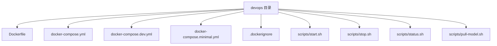
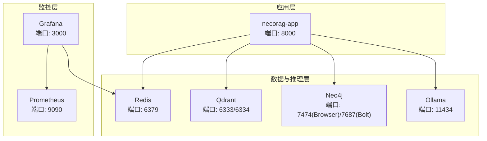
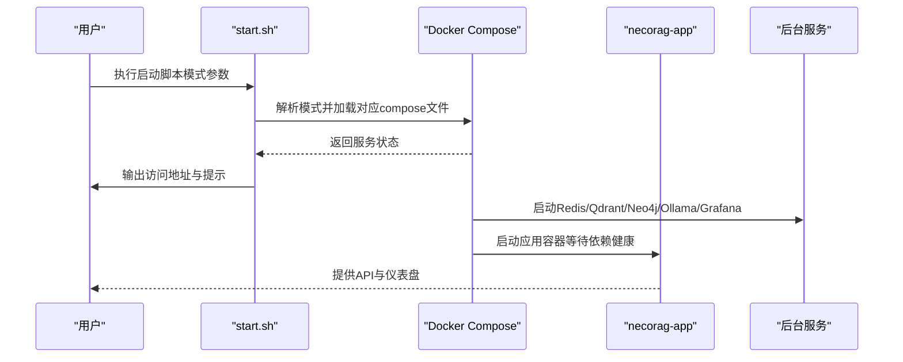
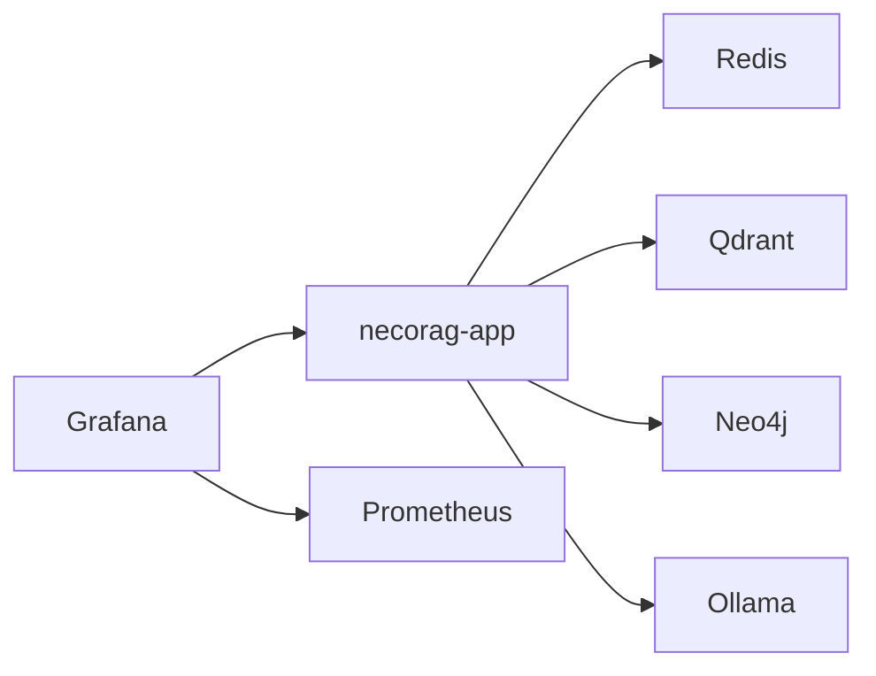

# 部署与运维

<cite>
**本文引用的文件**
- [Dockerfile](file://devops/Dockerfile)
- [docker-compose.yml](file://devops/docker-compose.yml)
- [docker-compose.dev.yml](file://devops/docker-compose.dev.yml)
- [docker-compose.minimal.yml](file://devops/docker-compose.minimal.yml)
- [.dockerignore](file://devops/.dockerignore)
- [start.sh](file://devops/scripts/start.sh)
- [stop.sh](file://devops/scripts/stop.sh)
- [status.sh](file://devops/scripts/status.sh)
- [pull-model.sh](file://devops/scripts/pull-model.sh)
- [DEPLOYMENT_GUIDE.md](file://3rd/DEPLOYMENT_GUIDE.md)
- [devops README.md](file://devops/README.md)
</cite>

## 目录
1. [简介](#简介)
2. [项目结构](#项目结构)
3. [核心组件](#核心组件)
4. [架构总览](#架构总览)
5. [详细组件分析](#详细组件分析)
6. [依赖分析](#依赖分析)
7. [性能考虑](#性能考虑)
8. [故障排除指南](#故障排除指南)
9. [结论](#结论)
10. [附录](#附录)

## 简介
本文件面向NecoRAG v3.3.0-alpha版本的部署与运维，围绕容器化部署、多服务编排、生产环境配置、监控与告警、运维自动化脚本、镜像构建与发布流程、不同部署模式的配置差异以及常见问题排查进行系统化说明。内容基于仓库中的DevOps目录与第三方部署指南文档整理而成，确保读者能够快速、安全、稳定地完成从开发到生产的全流程部署。

## 项目结构
DevOps相关资源集中在devops目录，包含：
- Dockerfile：应用镜像构建定义
- docker-compose.yml：生产级多服务编排
- docker-compose.dev.yml：开发模式可选叠加
- docker-compose.minimal.yml：最小化部署
- .dockerignore：构建时忽略项
- scripts/：运维自动化脚本（启动、停止、状态检查、模型拉取）

图表来源
- [Dockerfile:1-39](file://devops/Dockerfile#L1-L39)
- [docker-compose.yml:1-164](file://devops/docker-compose.yml#L1-L164)
- [docker-compose.dev.yml:1-16](file://devops/docker-compose.dev.yml#L1-L16)
- [docker-compose.minimal.yml:1-33](file://devops/docker-compose.minimal.yml#L1-L33)
- [.dockerignore:1-31](file://devops/.dockerignore#L1-L31)
- [start.sh:1-101](file://devops/scripts/start.sh#L1-L101)
- [stop.sh:1-36](file://devops/scripts/stop.sh#L1-L36)
- [status.sh:1-48](file://devops/scripts/status.sh#L1-L48)
- [pull-model.sh:1-28](file://devops/scripts/pull-model.sh#L1-L28)

章节来源
- [devops README.md:1-336](file://devops/README.md#L1-L336)

## 核心组件
- 应用容器（necorag-app）：基于Python 3.11-slim，内置健康检查，暴露8000端口，通过入口脚本启动仪表盘服务。
- 后台服务：
  - Redis：工作记忆与缓存
  - Qdrant：向量数据库
  - Neo4j：图数据库
  - Ollama：本地大模型推理服务
  - Grafana：可视化与监控
- 多套编排配置：
  - 完整生产配置
  - 开发模式叠加
  - 最小化部署

章节来源
- [Dockerfile:1-39](file://devops/Dockerfile#L1-L39)
- [docker-compose.yml:4-164](file://devops/docker-compose.yml#L4-L164)
- [docker-compose.dev.yml:1-16](file://devops/docker-compose.dev.yml#L1-L16)
- [docker-compose.minimal.yml:1-33](file://devops/docker-compose.minimal.yml#L1-L33)

## 架构总览
下图展示NecoRAG在生产环境中的容器化架构与服务依赖关系。应用容器依赖Redis、Qdrant、Neo4j与Ollama；Grafana依赖Redis等后端服务进行可视化；Prometheus用于指标采集（在部署指南中提供模板）。

图表来源
- [docker-compose.yml:4-164](file://devops/docker-compose.yml#L4-L164)
- [DEPLOYMENT_GUIDE.md:101-149](file://3rd/DEPLOYMENT_GUIDE.md#L101-L149)

## 详细组件分析

### Dockerfile 构建配置与镜像优化
- 基础镜像与标签：采用轻量级Python 3.11-slim，设置维护者与描述标签，便于镜像识别与溯源。
- 工作目录与系统依赖：创建工作目录，安装构建工具与常用工具，随后清理包缓存，降低镜像体积。
- 依赖安装：复制依赖清单后使用pip离线安装，避免缓存残留，减少镜像层数。
- 源码与配置：复制src与tools目录，以及.env系列文件；创建数据、配置与日志目录。
- 端口与健康检查：暴露8000端口，并通过HTTP健康检查验证应用状态。
- 入口命令：以工具脚本启动仪表盘服务，绑定0.0.0.0与8000端口。

优化建议（基于现有配置）：
- 使用多阶段构建分离构建与运行时环境，进一步压缩镜像体积。
- 在requirements.txt中固定版本，结合pip-tools锁定依赖，提升可重复性。
- 将日志与数据目录挂载至宿主机卷，避免容器内文件膨胀影响镜像大小。

章节来源
- [Dockerfile:1-39](file://devops/Dockerfile#L1-L39)

### docker-compose.yml 多服务编排
- 网络与卷：定义专用桥接网络与命名卷，确保数据持久化与服务间通信隔离。
- 服务分层：
  - L1工作记忆层：Redis，持久化配置与健康检查。
  - L2语义记忆层：Qdrant，HTTP与gRPC端口映射及健康检查。
  - L3情景图谱层：Neo4j，认证、插件与内存参数配置，健康检查。
  - LLM推理引擎：Ollama，GPU支持预留（注释），健康检查。
  - 监控可视化：Grafana，管理员凭据与数据卷挂载。
  - 应用容器：NecoRAG，构建上下文指向仓库根目录，挂载配置与数据卷，设置环境变量，依赖其他服务健康。
- 环境变量：集中于应用容器，包含LLM提供商、向量数据库、图数据库、Redis连接串与调试开关等。
- 依赖顺序：应用容器等待Redis/Qdrant/Neo4j健康后再启动，保证启动一致性。

章节来源
- [docker-compose.yml:1-164](file://devops/docker-compose.yml#L1-L164)

### docker-compose.dev.yml 开发模式叠加
- 功能：通过profiles控制服务是否参与编排，开发时默认不启动应用容器与LLM、监控等服务，便于本地直跑。
- 使用：与主编排文件组合使用，实现“后台服务+按需LLM/监控”的灵活启动。

章节来源
- [docker-compose.dev.yml:1-16](file://devops/docker-compose.dev.yml#L1-L16)

### docker-compose.minimal.yml 最小化部署
- 功能：仅启动Redis与Qdrant，适合资源受限或快速验证场景。
- 使用：直接以该文件启动，或在完整编排基础上移除非核心服务。

章节来源
- [docker-compose.minimal.yml:1-33](file://devops/docker-compose.minimal.yml#L1-L33)

### 运维自动化脚本
- start.sh：支持完整模式、开发模式、最小模式与带LLM模式，自动检查Docker、生成.env模板、打印访问地址与提示。
- stop.sh：优雅停止所有服务，支持清理数据卷（交互确认）。
- status.sh：检查Docker容器状态、关键服务连通性与数据卷存在性。
- pull-model.sh：按需拉取Ollama模型，若容器未运行则先启动对应服务。

图表来源
- [start.sh:1-101](file://devops/scripts/start.sh#L1-L101)
- [docker-compose.yml:118-147](file://devops/docker-compose.yml#L118-L147)

章节来源
- [start.sh:1-101](file://devops/scripts/start.sh#L1-L101)
- [stop.sh:1-36](file://devops/scripts/stop.sh#L1-L36)
- [status.sh:1-48](file://devops/scripts/status.sh#L1-L48)
- [pull-model.sh:1-28](file://devops/scripts/pull-model.sh#L1-L28)

### 生产环境配置要点
- 环境变量：在应用容器中集中设置，包括LLM提供商与URL、向量/图数据库连接、Redis连接串、调试开关等。
- 资源与健康：各服务均配置健康检查；应用容器具备HTTP健康检查端点。
- 网络隔离：通过自定义桥接网络隔离服务，限制端口暴露。
- 数据持久化：为Redis、Qdrant、Neo4j、Ollama、Grafana分别配置命名卷，确保数据不随容器删除而丢失。

章节来源
- [docker-compose.yml:130-147](file://devops/docker-compose.yml#L130-L147)

### 监控与告警集成（基于部署指南）
- Prometheus：提供指标采集与存储配置模板，支持TSDB路径与保留时间设置。
- Grafana：提供数据源与预置仪表盘模板，支持系统监控、应用性能、知识库健康与用户行为等维度。
- 集成方式：Grafana依赖Prometheus作为数据源，Prometheus按配置抓取目标指标，Grafana通过预置面板展示。

章节来源
- [DEPLOYMENT_GUIDE.md:539-720](file://3rd/DEPLOYMENT_GUIDE.md#L539-L720)

### 镜像构建与发布流程
- 构建：使用Dockerfile在仓库根目录构建镜像，镜像名称与标签可按需调整。
- 发布：建议配合CI/CD流水线，将构建产物推送到私有或公共镜像仓库，并在生产环境拉取对应标签。
- 验证：使用第三方目录提供的镜像导入与校验脚本，确保网络与镜像完整性。

章节来源
- [Dockerfile:1-39](file://devops/Dockerfile#L1-L39)
- [DEPLOYMENT_GUIDE.md:21-41](file://3rd/DEPLOYMENT_GUIDE.md#L21-L41)

### 不同部署模式的配置差异
- 单机部署：完整编排，适用于开发测试与小规模使用。
- 开发模式：通过profiles控制，仅启动后台服务，应用容器由本地运行替代，便于热重载与调试。
- 最小化部署：仅启动Redis与Qdrant，适合资源受限或快速验证。
- 生产模式：在完整编排基础上，结合资源限制、健康检查与安全配置，满足高可用与稳定性要求。

章节来源
- [devops README.md:212-239](file://devops/README.md#L212-L239)
- [docker-compose.dev.yml:1-16](file://devops/docker-compose.dev.yml#L1-L16)
- [docker-compose.minimal.yml:1-33](file://devops/docker-compose.minimal.yml#L1-L33)

## 依赖分析
- 组件耦合：应用容器对Redis、Qdrant、Neo4j、Ollama存在强依赖；Grafana依赖Prometheus与后端服务。
- 启动顺序：应用容器通过“service_healthy”条件等待上游服务就绪，降低冷启动失败概率。
- 端口与网络：通过端口映射与自定义桥接网络实现服务互通与外部访问控制。

图表来源
- [docker-compose.yml:139-147](file://devops/docker-compose.yml#L139-L147)

章节来源
- [docker-compose.yml:139-147](file://devops/docker-compose.yml#L139-L147)

## 性能考虑
- 资源限制：在编排文件中为服务设置CPU与内存上限，避免资源争抢。
- 缓存优化：Redis合理设置最大内存与淘汰策略；Qdrant/HNSW索引参数按数据规模调优。
- 数据库调优：Neo4j内存参数与页缓存按负载调整；Qdrant存储路径与线程数优化。
- 模型与推理：Ollama按硬件能力配置GPU数量与显存上限，减少推理延迟。

章节来源
- [devops README.md:283-305](file://devops/README.md#L283-L305)
- [DEPLOYMENT_GUIDE.md:287-311](file://3rd/DEPLOYMENT_GUIDE.md#L287-L311)

## 故障排除指南
- 容器无法启动：检查日志与编排配置，确认端口占用与网络连通。
- 端口冲突：修改映射端口或释放宿主机端口。
- 数据库连接失败：检查容器网络、服务健康状态与连接串配置。
- 模型拉取失败：确认Ollama容器健康，网络可达，再执行模型拉取脚本。
- 健康检查失败：查看各服务健康检查命令与返回状态，逐步定位依赖问题。

章节来源
- [devops README.md:239-281](file://devops/README.md#L239-L281)
- [status.sh:21-48](file://devops/scripts/status.sh#L21-L48)
- [pull-model.sh:15-21](file://devops/scripts/pull-model.sh#L15-L21)

## 结论
通过Dockerfile与多套docker-compose配置，NecoRAG实现了从开发到生产的全场景覆盖。配合运维自动化脚本与监控模板，团队可以高效完成部署、运维与故障排查。建议在生产环境中结合资源限制、健康检查与安全配置，持续优化性能与稳定性。

## 附录
- 端口速查：应用API、Ollama、Redis、Qdrant、Neo4j、Prometheus、Grafana等端口与协议对照。
- 环境变量速查：LLM、存储、模型、性能与安全相关的关键变量说明。
- 持续集成：建议在CI中集成单元测试、集成测试、镜像构建与推送流程。

章节来源
- [DEPLOYMENT_GUIDE.md:724-786](file://3rd/DEPLOYMENT_GUIDE.md#L724-L786)
- [devops README.md:306-320](file://devops/README.md#L306-L320)