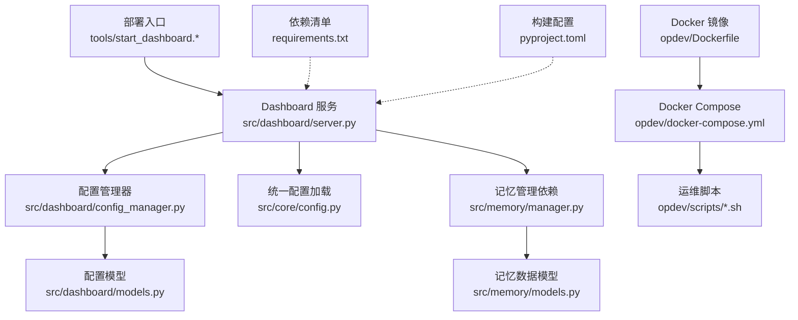
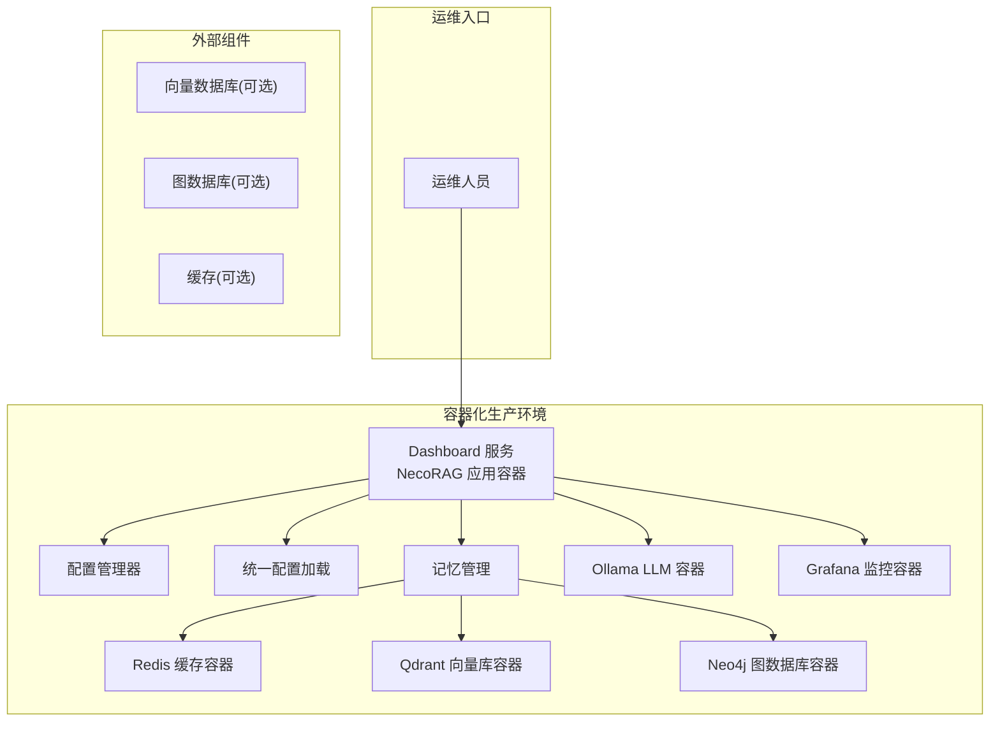
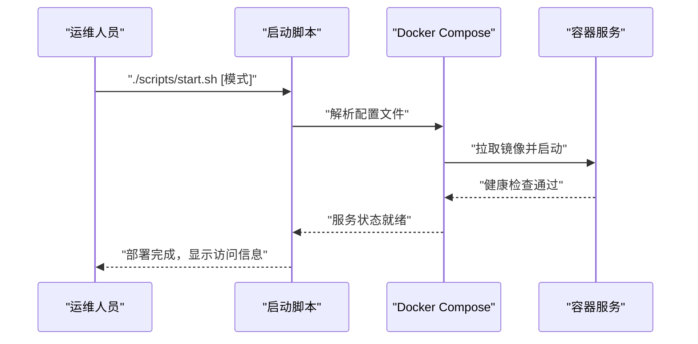
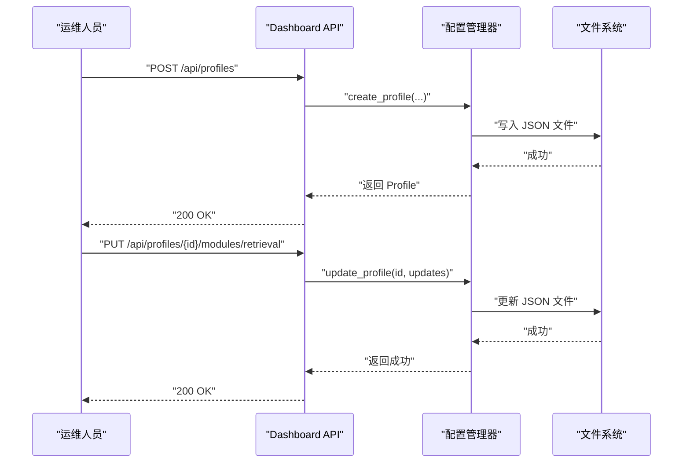
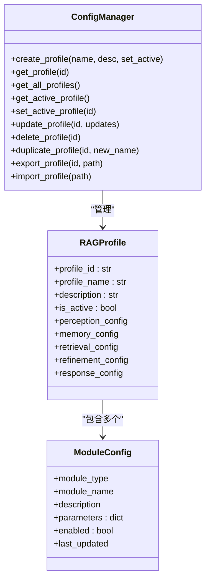
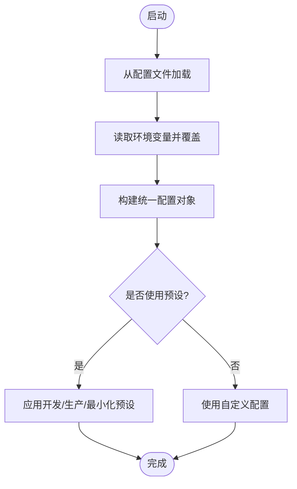
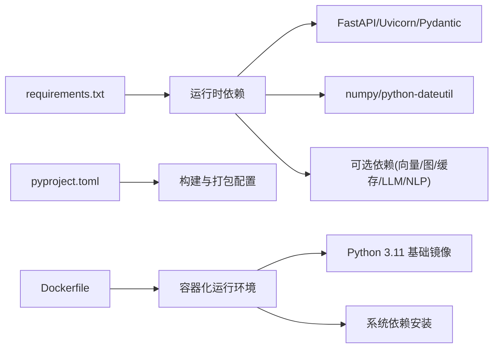

# 部署与运维

<cite>
**本文引用的文件**
- [README.md](file://README.md)
- [pyproject.toml](file://pyproject.toml)
- [requirements.txt](file://requirements.txt)
- [src/core/config.py](file://src/core/config.py)
- [src/dashboard/server.py](file://src/dashboard/server.py)
- [src/dashboard/config_manager.py](file://src/dashboard/config_manager.py)
- [src/dashboard/models.py](file://src/dashboard/models.py)
- [src/memory/manager.py](file://src/memory/manager.py)
- [src/memory/models.py](file://src/memory/models.py)
- [tools/start_dashboard.py](file://tools/start_dashboard.py)
- [tools/start_dashboard.sh](file://tools/start_dashboard.sh)
- [tools/start_dashboard.bat](file://tools/start_dashboard.bat)
- [opdev/Dockerfile](file://opdev/Dockerfile)
- [opdev/docker-compose.yml](file://opdev/docker-compose.yml)
- [opdev/docker-compose.dev.yml](file://opdev/docker-compose.dev.yml)
- [opdev/docker-compose.minimal.yml](file://opdev/docker-compose.minimal.yml)
- [opdev/.dockerignore](file://opdev/.dockerignore)
- [opdev/scripts/start.sh](file://opdev/scripts/start.sh)
- [opdev/scripts/status.sh](file://opdev/scripts/status.sh)
- [opdev/scripts/stop.sh](file://opdev/scripts/stop.sh)
- [opdev/scripts/pull-model.sh](file://opdev/scripts/pull-model.sh)
- [DASHBOARD_GUIDE.md](file://DASHBOARD_GUIDE.md)
- [src/dashboard/README.md](file://src/dashboard/README.md)
- [QUICKSTART.md](file://QUICKSTART.md)
</cite>

## 目录
1. [引言](#引言)
2. [项目结构](#项目结构)
3. [核心组件](#核心组件)
4. [架构总览](#架构总览)
5. [详细组件分析](#详细组件分析)
6. [依赖分析](#依赖分析)
7. [性能考虑](#性能考虑)
8. [故障排除指南](#故障排除指南)
9. [结论](#结论)
10. [附录](#附录)

## 引言
本文件面向生产环境的部署与运维，围绕 NecoRAG 框架的 Dashboard 服务、配置管理、依赖与运行环境、性能监控与日志、安全与访问控制、故障排除、自动化与持续集成、备份与灾难恢复以及系统维护与升级等方面，提供可操作的指导。随着容器化部署系统的引入，现提供基于 Docker 的生产就绪自动化部署解决方案，替代原有手动部署方式，显著提升部署效率与一致性。

## 项目结构
- 顶层入口与工具
  - Dashboard 启动脚本：tools/start_dashboard.py、tools/start_dashboard.sh、tools/start_dashboard.bat
  - Docker 容器化部署：opdev/Dockerfile、opdev/docker-compose.yml、opdev/docker-compose.dev.yml、opdev/docker-compose.minimal.yml
  - 运维脚本：opdev/scripts/start.sh、opdev/scripts/status.sh、opdev/scripts/stop.sh、opdev/scripts/pull-model.sh
  - 项目说明与安装：README.md、QUICKSTART.md
- 核心运行时
  - Dashboard 服务：src/dashboard/server.py
  - 配置管理：src/dashboard/config_manager.py、src/dashboard/models.py
  - 统一配置与环境变量：src/core/config.py
  - 记忆管理（底层依赖）：src/memory/manager.py、src/memory/models.py
- 依赖与打包
  - 依赖清单：requirements.txt
  - 构建与打包：pyproject.toml

**图表来源**
- [src/dashboard/server.py:1-393](file://src/dashboard/server.py#L1-L393)
- [src/dashboard/config_manager.py:1-315](file://src/dashboard/config_manager.py#L1-L315)
- [src/dashboard/models.py:1-231](file://src/dashboard/models.py#L1-L231)
- [src/core/config.py:1-370](file://src/core/config.py#L1-L370)
- [src/memory/manager.py:1-186](file://src/memory/manager.py#L1-L186)
- [src/memory/models.py:1-67](file://src/memory/models.py#L1-L67)
- [requirements.txt:1-57](file://requirements.txt#L1-L57)
- [pyproject.toml:1-59](file://pyproject.toml#L1-L59)
- [tools/start_dashboard.py:1-56](file://tools/start_dashboard.py#L1-L56)
- [opdev/Dockerfile:1-39](file://opdev/Dockerfile#L1-L39)
- [opdev/docker-compose.yml:1-164](file://opdev/docker-compose.yml#L1-L164)
- [opdev/scripts/start.sh:1-101](file://opdev/scripts/start.sh#L1-L101)

**章节来源**
- [README.md:1-678](file://README.md#L1-L678)
- [QUICKSTART.md:1-325](file://QUICKSTART.md#L1-L325)
- [src/dashboard/server.py:1-393](file://src/dashboard/server.py#L1-L393)
- [src/dashboard/config_manager.py:1-315](file://src/dashboard/config_manager.py#L1-L315)
- [src/dashboard/models.py:1-231](file://src/dashboard/models.py#L1-L231)
- [src/core/config.py:1-370](file://src/core/config.py#L1-L370)
- [src/memory/manager.py:1-186](file://src/memory/manager.py#L1-L186)
- [src/memory/models.py:1-67](file://src/memory/models.py#L1-L67)
- [requirements.txt:1-57](file://requirements.txt#L1-L57)
- [pyproject.toml:1-59](file://pyproject.toml#L1-L59)
- [tools/start_dashboard.py:1-56](file://tools/start_dashboard.py#L1-L56)
- [tools/start_dashboard.sh:1-26](file://tools/start_dashboard.sh#L1-L26)
- [tools/start_dashboard.bat:1-30](file://tools/start_dashboard.bat#L1-L30)
- [opdev/Dockerfile:1-39](file://opdev/Dockerfile#L1-L39)
- [opdev/docker-compose.yml:1-164](file://opdev/docker-compose.yml#L1-L164)
- [opdev/docker-compose.dev.yml:1-16](file://opdev/docker-compose.dev.yml#L1-L16)
- [opdev/docker-compose.minimal.yml:1-33](file://opdev/docker-compose.minimal.yml#L1-L33)
- [opdev/scripts/start.sh:1-101](file://opdev/scripts/start.sh#L1-L101)
- [opdev/scripts/status.sh:1-48](file://opdev/scripts/status.sh#L1-L48)
- [opdev/scripts/stop.sh:1-36](file://opdev/scripts/stop.sh#L1-L36)
- [opdev/scripts/pull-model.sh:1-28](file://opdev/scripts/pull-model.sh#L1-L28)

## 核心组件
- Dashboard 服务
  - 基于 FastAPI，提供 REST API 与静态 Web UI，支持跨域访问，内置统计信息与配置管理。
- 配置管理
  - 支持 Profile 的创建、激活、复制、导入导出；模块参数的增删改查；持久化到 JSON 文件。
- 统一配置加载
  - 支持从文件与环境变量加载配置，提供开发/生产/最小化预设。
- 记忆管理（底层依赖）
  - 三层记忆（工作/语义/情景图谱）的统一管理与检索，支持衰减与主动遗忘。
- 启动脚本
  - 提供跨平台启动方式，支持主机、端口、配置目录参数。
- Docker 容器化部署系统
  - 完整的镜像构建、服务编排与运维脚本，支持多种部署模式（完整/开发/最小化）。

**章节来源**
- [src/dashboard/server.py:43-93](file://src/dashboard/server.py#L43-L93)
- [src/dashboard/config_manager.py:14-41](file://src/dashboard/config_manager.py#L14-L41)
- [src/core/config.py:232-284](file://src/core/config.py#L232-L284)
- [src/memory/manager.py:16-47](file://src/memory/manager.py#L16-L47)
- [tools/start_dashboard.py:16-51](file://tools/start_dashboard.py#L16-L51)
- [opdev/Dockerfile:1-39](file://opdev/Dockerfile#L1-L39)
- [opdev/docker-compose.yml:1-164](file://opdev/docker-compose.yml#L1-L164)

## 架构总览
Dashboard 作为统一入口，负责配置下发与运行状态展示；其依赖的统一配置系统支持从文件与环境变量加载；底层依赖包括记忆层等模块（具体外部组件如向量库、图数据库、缓存等在生产中按需集成）。新的容器化架构通过 Docker Compose 实现服务编排，提供生产就绪的自动化部署能力。

**图表来源**
- [opdev/docker-compose.yml:4-164](file://opdev/docker-compose.yml#L4-L164)
- [opdev/Dockerfile:33-39](file://opdev/Dockerfile#L33-L39)

## 详细组件分析

### Docker 容器化部署系统
- 功能要点
  - Dockerfile：基于 Python 3.11 slim 镜像，安装系统依赖，复制依赖与源码，配置健康检查与启动命令。
  - docker-compose.yml：完整服务编排，包含 Redis、Qdrant、Neo4j、Ollama、Grafana 和 NecoRAG 应用容器。
  - 运维脚本：提供一键启动、状态检查、停止清理等完整运维能力。
- 部署模式
  - 完整模式：启动所有服务，包含 LLM 推理引擎和监控系统。
  - 开发模式：仅启动后台服务，应用容器按需启动。
  - 最小模式：仅启动核心存储服务（Redis + Qdrant）。
- 运维优势
  - 标准化环境配置，避免"在我机器上能运行"问题。
  - 健康检查确保服务可用性，自动重启机制提升稳定性。
  - 数据卷持久化，支持配置与数据分离管理。

**图表来源**
- [opdev/scripts/start.sh:48-95](file://opdev/scripts/start.sh#L48-L95)
- [opdev/docker-compose.yml:119-147](file://opdev/docker-compose.yml#L119-L147)

**章节来源**
- [opdev/Dockerfile:1-39](file://opdev/Dockerfile#L1-L39)
- [opdev/docker-compose.yml:1-164](file://opdev/docker-compose.yml#L1-L164)
- [opdev/docker-compose.dev.yml:1-16](file://opdev/docker-compose.dev.yml#L1-L16)
- [opdev/docker-compose.minimal.yml:1-33](file://opdev/docker-compose.minimal.yml#L1-L33)
- [opdev/scripts/start.sh:1-101](file://opdev/scripts/start.sh#L1-L101)

### Dashboard 服务（FastAPI）
- 功能要点
  - REST API：Profile 管理、模块参数更新、统计信息查询与重置。
  - Web UI：静态页面挂载与简单 UI 回退。
  - 运行参数：主机、端口、配置目录。
- 部署建议
  - 使用反向代理（如 Nginx）暴露 80/443，并开启 HTTPS。
  - 限制来源 IP 或接入 WAF。
  - 日志级别与访问日志分离，结合上游代理日志统一分析。
- 安全加固
  - CORS 当前允许任意来源，生产中建议限定可信域名。
  - 若暴露至公网，务必启用认证与授权（可在网关层实现）。

**图表来源**
- [src/dashboard/server.py:97-216](file://src/dashboard/server.py#L97-L216)
- [src/dashboard/config_manager.py:42-166](file://src/dashboard/config_manager.py#L42-L166)

**章节来源**
- [src/dashboard/server.py:43-93](file://src/dashboard/server.py#L43-L93)
- [src/dashboard/server.py:94-253](file://src/dashboard/server.py#L94-L253)
- [src/dashboard/server.py:379-393](file://src/dashboard/server.py#L379-L393)

### 配置管理器与模型
- 功能要点
  - Profile 生命周期管理（创建/激活/复制/导入/导出/删除）。
  - 模块参数更新与持久化。
  - 默认配置回退与缓存。
- 运维要点
  - 配置目录权限必须可写，建议独立挂载持久卷。
  - 导出/导入用于跨环境迁移与备份恢复。

**图表来源**
- [src/dashboard/config_manager.py:14-41](file://src/dashboard/config_manager.py#L14-L41)
- [src/dashboard/models.py:164-219](file://src/dashboard/models.py#L164-L219)
- [src/dashboard/models.py:21-44](file://src/dashboard/models.py#L21-L44)

**章节来源**
- [src/dashboard/config_manager.py:42-315](file://src/dashboard/config_manager.py#L42-L315)
- [src/dashboard/models.py:164-231](file://src/dashboard/models.py#L164-L231)

### 统一配置加载（环境变量与文件）
- 功能要点
  - 从文件加载默认配置，再由环境变量覆盖关键字段（如调试模式、LLM/数据库提供商与连接串）。
  - 提供开发/生产/最小化预设。
- 运维要点
  - 生产环境建议通过环境变量注入敏感配置（如 API Key），避免硬编码在文件中。
  - 预设配置可用于快速切换运行模式。

**图表来源**
- [src/core/config.py:288-327](file://src/core/config.py#L288-L327)
- [src/core/config.py:340-370](file://src/core/config.py#L340-L370)

**章节来源**
- [src/core/config.py:288-327](file://src/core/config.py#L288-L327)
- [src/core/config.py:340-370](file://src/core/config.py#L340-L370)

### 记忆管理（底层依赖）
- 功能要点
  - 统一管理 L1/L2/L3 三层记忆，支持向量检索、图谱实体关系、衰减与主动遗忘。
- 运维要点
  - 生产中需按需集成外部组件（向量库、图数据库、缓存），并在配置中正确设置连接信息。
  - 监控各层容量与性能，定期执行巩固与遗忘策略。

**章节来源**
- [src/memory/manager.py:16-47](file://src/memory/manager.py#L16-L47)
- [src/memory/manager.py:114-186](file://src/memory/manager.py#L114-L186)
- [src/memory/models.py:19-67](file://src/memory/models.py#L19-L67)

### 启动脚本与跨平台部署
- 功能要点
  - 提供 Python 脚本、Shell、批处理三种启动方式，支持主机、端口、配置目录参数。
  - Docker 环境下，容器内已集成启动命令，支持多种部署模式。
- 运维要点
  - 建议使用 Docker Compose 管理容器生命周期，提供健康检查与自动重启。
  - Shell/批处理脚本适合本地开发与快速验证，Docker 方案适合生产部署。

**章节来源**
- [tools/start_dashboard.py:16-51](file://tools/start_dashboard.py#L16-L51)
- [tools/start_dashboard.sh:1-26](file://tools/start_dashboard.sh#L1-L26)
- [tools/start_dashboard.bat:1-30](file://tools/start_dashboard.bat#L1-L30)
- [opdev/Dockerfile:37-39](file://opdev/Dockerfile#L37-L39)

## 依赖分析
- 运行时依赖
  - FastAPI、Uvicorn、Pydantic：Dashboard 服务与 API 文档。
  - numpy、python-dateutil：核心计算与日期处理。
- 可选依赖（按需集成）
  - 向量数据库客户端、图数据库驱动、缓存客户端、嵌入模型、LLM SDK、NLP 工具等。
- 构建与打包
  - setuptools 作为构建后端，支持包发现与版本管理。
- Docker 容器化依赖
  - Python 3.11 slim 基础镜像，系统依赖（build-essential、curl），多阶段构建优化。

**图表来源**
- [requirements.txt:1-57](file://requirements.txt#L1-L57)
- [pyproject.toml:1-59](file://pyproject.toml#L1-L59)
- [opdev/Dockerfile:2-14](file://opdev/Dockerfile#L2-L14)

**章节来源**
- [requirements.txt:1-57](file://requirements.txt#L1-L57)
- [pyproject.toml:1-59](file://pyproject.toml#L1-L59)
- [opdev/Dockerfile:1-39](file://opdev/Dockerfile#L1-L39)

## 性能考虑
- Dashboard 服务
  - 使用高性能 ASGI 服务器（Uvicorn）承载，建议多进程与并发参数根据 CPU 核心数与内存配置调优。
  - 启用上游反向代理的连接复用与压缩。
- 配置与缓存
  - 配置管理器对 Profile 进行内存缓存，减少磁盘 IO。
  - 建议对热点 API 增加轻量缓存（如 Redis）以降低后端压力。
- 记忆层
  - 合理设置 top_k、阈值与衰减参数，避免无效检索与冗余存储。
  - 对向量检索与图谱查询增加超时与重试策略。
- Docker 容器化优化
  - 健康检查间隔与超时参数可根据服务响应特性调整。
  - 数据卷映射优化 I/O 性能，合理配置内存限制防止资源争用。

## 故障排除指南
- Docker 容器启动失败
  - 检查 Docker 服务状态与权限；确认端口未被占用；查看容器日志获取详细错误信息。
- 服务健康检查失败
  - 检查依赖服务（Redis、Qdrant、Neo4j）是否正常启动；验证网络连接与环境变量配置。
- Dashboard 无法访问
  - 检查端口占用与防火墙放行；确认反向代理与证书配置。
- 配置保存失败
  - 检查配置目录权限与磁盘空间；必要时更换目录或临时目录。
- API 返回 404
  - 确认 Profile ID 存在；先列出所有 Profile 再进行操作。
- 启动失败（端口占用）
  - 更换端口或停止占用进程；参考快速开始中的排查命令。
- 配置未生效
  - 配置保存后立即生效，但若模块已实例化，需重启或重新初始化模块以应用新参数。

**章节来源**
- [opdev/scripts/status.sh:21-48](file://opdev/scripts/status.sh#L21-L48)
- [opdev/scripts/stop.sh:21-36](file://opdev/scripts/stop.sh#L21-L36)
- [src/dashboard/server.py:379-393](file://src/dashboard/server.py#L379-L393)
- [src/dashboard/config_manager.py:289-315](file://src/dashboard/config_manager.py#L289-L315)
- [DASHBOARD_GUIDE.md:381-412](file://DASHBOARD_GUIDE.md#L381-L412)
- [QUICKSTART.md:237-277](file://QUICKSTART.md#L237-L277)

## 结论
通过引入完整的 Docker 容器化部署系统，NecoRAG 现已具备生产就绪的自动化部署能力。Dockerfile 提供标准化的镜像构建，docker-compose.yml 实现复杂服务编排，配套的运维脚本实现了从启动到监控的全流程自动化。结合 Dashboard 的配置管理能力与统一配置加载机制，可在生产环境中实现灵活、可追踪、可重复的参数治理。建议在生产中强化安全与可观测性，完善自动化与灾备策略，确保系统稳定与可恢复。

## 附录

### A. 生产环境部署清单
- 基础设施
  - Docker 环境（Docker Engine + Docker Compose）
  - 反向代理（Nginx/Traefik）+ HTTPS 证书
  - 负载均衡（可选）
- 运行环境
  - Python 3.9+，Docker 容器化部署
  - 独立配置目录（持久卷），具备写权限
  - 环境变量配置文件（.env）
- 外部组件（按需）
  - 向量数据库、图数据库、缓存、LLM 服务
- 安全
  - 仅允许受信域名 CORS；在网关层启用认证与速率限制
  - 敏感配置通过环境变量注入

**章节来源**
- [opdev/docker-compose.yml:129-139](file://opdev/docker-compose.yml#L129-L139)
- [opdev/Dockerfile:27-31](file://opdev/Dockerfile#L27-L31)

### B. 性能监控与日志管理
- 监控指标
  - Dashboard：请求数、响应时间、错误率、活跃会话数、统计信息（文档/块/查询数）
  - 外部组件：向量库/图数据库/缓存的连接数、查询延迟、容量使用
  - 容器资源：CPU、内存、磁盘 I/O 使用率
- 日志
  - Dashboard：ASGI 访问日志与业务日志分离；结合上游代理日志统一采集
  - 配置变更审计：记录 Profile 创建/更新/删除与参数变更
  - Docker 日志：容器标准输出与错误输出收集
- 可视化
  - 建议接入 Prometheus/Grafana 或云监控平台

**章节来源**
- [opdev/docker-compose.yml:100-117](file://opdev/docker-compose.yml#L100-L117)
- [opdev/Dockerfile:33-35](file://opdev/Dockerfile#L33-L35)

### C. 安全与访问控制
- CORS 与跨域
  - 生产中限制允许来源，避免通配符
- 认证与授权
  - 建议在反向代理或 API 网关层实现 OAuth/JWT 认证与细粒度授权
- 数据保护
  - 配置文件加密存储；敏感参数仅通过环境变量注入
- 网络隔离
  - 将 Dashboard 与外部组件置于不同子网或容器网络，最小化暴露面
- 容器安全
  - 非特权用户运行容器；只读文件系统；最小权限原则

**章节来源**
- [opdev/docker-compose.yml:58-63](file://opdev/docker-compose.yml#L58-L63)
- [opdev/.dockerignore:1-31](file://opdev/.dockerignore#L1-L31)

### D. 自动化部署与持续集成
- CI/CD
  - 代码检查（Black/Flake8/Mypy）、单元测试（pytest）、打包发布
  - Docker 镜像构建与制品库管理
- 部署流水线
  - 开发/测试/生产多环境；蓝绿/滚动发布；配置导入导出自动化
- 配置管理
  - 使用 Git 管理配置模板；通过 CI 注入环境变量
- 容器化优势
  - 标准化构建过程，确保开发与生产环境一致性
  - 快速扩缩容与弹性伸缩

**章节来源**
- [opdev/Dockerfile:1-39](file://opdev/Dockerfile#L1-L39)
- [opdev/docker-compose.yml:1-164](file://opdev/docker-compose.yml#L1-L164)

### E. 备份恢复与灾难恢复
- 配置备份
  - 定期导出 Profile 或整体备份 configs 目录
  - Docker 数据卷快照备份
- 数据备份
  - 外部组件（向量库/图数据库/缓存）按厂商策略备份
- 灾难恢复
  - 制定 RTO/RPO；演练恢复流程；验证恢复数据完整性
- 容器化备份
  - 镜像版本管理；数据卷独立备份；配置文件版本控制

**章节来源**
- [opdev/docker-compose.yml:149-158](file://opdev/docker-compose.yml#L149-L158)
- [opdev/scripts/stop.sh:21-36](file://opdev/scripts/stop.sh#L21-L36)

### F. 系统维护与升级
- 版本管理
  - 严格遵循语义化版本；发布前充分测试
- 升级策略
  - 逐步升级组件与依赖；灰度发布；回滚预案
- 运行维护
  - 定期清理日志与临时文件；监控资源使用；优化参数
  - Docker 容器健康检查与自动重启机制
- 运维脚本
  - 统一的启动、停止、状态检查、日志查看命令
  - LLM 模型拉取与管理脚本

**章节来源**
- [opdev/scripts/start.sh:1-101](file://opdev/scripts/start.sh#L1-L101)
- [opdev/scripts/status.sh:1-48](file://opdev/scripts/status.sh#L1-L48)
- [opdev/scripts/stop.sh:1-36](file://opdev/scripts/stop.sh#L1-L36)
- [opdev/scripts/pull-model.sh:1-28](file://opdev/scripts/pull-model.sh#L1-L28)