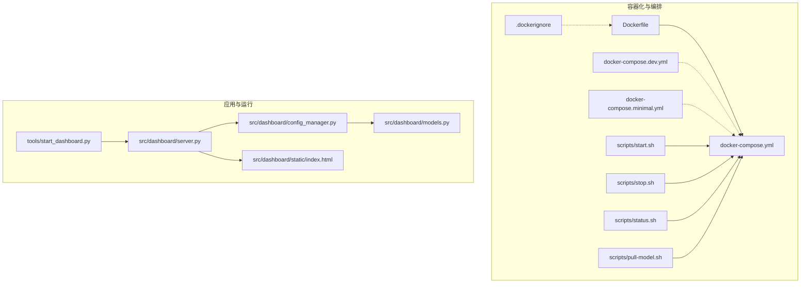

# 部署与运维

<cite>
**本文引用的文件**
- [Dockerfile](file://opdev/Dockerfile)
- [docker-compose.yml](file://opdev/docker-compose.yml)
- [docker-compose.dev.yml](file://opdev/docker-compose.dev.yml)
- [docker-compose.minimal.yml](file://opdev/docker-compose.minimal.yml)
- [.dockerignore](file://opdev/.dockerignore)
- [start.sh](file://opdev/scripts/start.sh)
- [stop.sh](file://opdev/scripts/stop.sh)
- [status.sh](file://opdev/scripts/status.sh)
- [pull-model.sh](file://opdev/scripts/pull-model.sh)
- [requirements.txt](file://requirements.txt)
- [pyproject.toml](file://pyproject.toml)
- [start_dashboard.py](file://tools/start_dashboard.py)
- [server.py](file://src/dashboard/server.py)
- [config_manager.py](file://src/dashboard/config_manager.py)
- [models.py](file://src/dashboard/models.py)
- [index.html](file://src/dashboard/static/index.html)
</cite>

## 目录
1. [简介](#简介)
2. [项目结构](#项目结构)
3. [核心组件](#核心组件)
4. [架构总览](#架构总览)
5. [详细组件分析](#详细组件分析)
6. [依赖关系分析](#依赖关系分析)
7. [性能考量](#性能考量)
8. [故障排查指南](#故障排查指南)
9. [结论](#结论)
10. [附录](#附录)

## 简介
本文件面向部署与运维工程师，围绕 NecoRAG 的容器化部署与运维实践，系统阐述镜像构建、容器编排、资源与网络规划、存储与备份、监控与告警、故障恢复与灾难恢复，以及自动化运维脚本的使用与维护要点。文档同时给出生产环境配置建议与安全注意事项，帮助团队在不同规模场景下稳定运行系统。

## 项目结构
NecoRAG 的部署与运维主要集中在 opdev 目录下的容器化配置与脚本，以及 Dashboard 的运行入口与配置管理模块。整体结构如下：

图表来源
- [Dockerfile:1-39](file://opdev/Dockerfile#L1-L39)
- [docker-compose.yml:1-164](file://opdev/docker-compose.yml#L1-L164)
- [docker-compose.dev.yml:1-16](file://opdev/docker-compose.dev.yml#L1-L16)
- [docker-compose.minimal.yml:1-33](file://opdev/docker-compose.minimal.yml#L1-L33)
- [.dockerignore:1-31](file://opdev/.dockerignore#L1-L31)
- [start.sh:1-101](file://opdev/scripts/start.sh#L1-L101)
- [stop.sh:1-36](file://opdev/scripts/stop.sh#L1-L36)
- [status.sh:1-48](file://opdev/scripts/status.sh#L1-L48)
- [pull-model.sh:1-28](file://opdev/scripts/pull-model.sh#L1-L28)
- [start_dashboard.py:1-56](file://tools/start_dashboard.py#L1-L56)
- [server.py:1-484](file://src/dashboard/server.py#L1-L484)
- [config_manager.py:1-315](file://src/dashboard/config_manager.py#L1-L315)
- [models.py:1-232](file://src/dashboard/models.py#L1-L232)
- [index.html:1-800](file://src/dashboard/static/index.html#L1-L800)

章节来源
- [Dockerfile:1-39](file://opdev/Dockerfile#L1-L39)
- [docker-compose.yml:1-164](file://opdev/docker-compose.yml#L1-L164)
- [docker-compose.dev.yml:1-16](file://opdev/docker-compose.dev.yml#L1-L16)
- [docker-compose.minimal.yml:1-33](file://opdev/docker-compose.minimal.yml#L1-L33)
- [.dockerignore:1-31](file://opdev/.dockerignore#L1-L31)
- [start.sh:1-101](file://opdev/scripts/start.sh#L1-L101)
- [stop.sh:1-36](file://opdev/scripts/stop.sh#L1-L36)
- [status.sh:1-48](file://opdev/scripts/status.sh#L1-L48)
- [pull-model.sh:1-28](file://opdev/scripts/pull-model.sh#L1-L28)
- [start_dashboard.py:1-56](file://tools/start_dashboard.py#L1-L56)
- [server.py:1-484](file://src/dashboard/server.py#L1-L484)
- [config_manager.py:1-315](file://src/dashboard/config_manager.py#L1-L315)
- [models.py:1-232](file://src/dashboard/models.py#L1-L232)
- [index.html:1-800](file://src/dashboard/static/index.html#L1-L800)

## 核心组件
- 容器镜像与构建
  - 基于精简 Python 运行时，安装必要系统依赖，拷贝依赖清单与源码，预装运行时依赖，创建数据/配置/日志目录，暴露应用端口，并配置健康检查。
- 容器编排
  - 统一编排 Redis、Qdrant、Neo4j、Ollama 与 NecoRAG 应用，定义持久化卷、网络、环境变量与健康检查；提供开发模式与最小化模式组合。
- Dashboard 服务
  - 基于 FastAPI 提供 REST API 与 Web UI，支持配置 Profile 管理、模块参数调整、统计信息与知识演化相关接口。
- 自动化运维脚本
  - 启动/停止/状态检查/模型拉取等脚本，支持多模式编排与一键式运维。

章节来源
- [Dockerfile:1-39](file://opdev/Dockerfile#L1-L39)
- [docker-compose.yml:1-164](file://opdev/docker-compose.yml#L1-L164)
- [server.py:1-484](file://src/dashboard/server.py#L1-L484)
- [start.sh:1-101](file://opdev/scripts/start.sh#L1-L101)
- [stop.sh:1-36](file://opdev/scripts/stop.sh#L1-L36)
- [status.sh:1-48](file://opdev/scripts/status.sh#L1-L48)
- [pull-model.sh:1-28](file://opdev/scripts/pull-model.sh#L1-L28)

## 架构总览
下图展示了 NecoRAG 在容器化环境中的整体拓扑与交互关系，包括应用服务、向量数据库、图数据库、缓存与 LLM 推理引擎，以及监控与可视化组件。

图表来源
- [docker-compose.yml:4-164](file://opdev/docker-compose.yml#L4-L164)
- [Dockerfile:30-38](file://opdev/Dockerfile#L30-L38)

## 详细组件分析

### 容器镜像与构建（Dockerfile）
- 基础镜像与标签
  - 使用精简 Python 运行时作为基础镜像，便于减少攻击面与镜像体积。
- 系统依赖
  - 安装构建工具与常用工具，满足编译与运行期需求。
- 依赖安装
  - 通过依赖清单安装 Python 依赖，避免缓存污染。
- 源码与资源
  - 拷贝源码与工具脚本，准备配置与数据目录。
- 端口与健康检查
  - 暴露应用端口并配置健康检查，确保容器编排层能正确感知服务状态。
- 启动命令
  - 以 Web 服务方式启动 Dashboard，绑定 0.0.0.0 以便外部访问。

章节来源
- [Dockerfile:1-39](file://opdev/Dockerfile#L1-L39)

### 容器编排（docker-compose.yml）
- 服务分层
  - L1 工作记忆层：Redis
  - L2 语义记忆层：Qdrant
  - L3 情景图谱层：Neo4j
  - LLM 推理引擎：Ollama
  - 监控可视化：Grafana
  - 应用服务：NecoRAG
- 网络与卷
  - 统一桥接网络，定义命名卷用于持久化数据。
- 环境变量与端口映射
  - 通过环境变量连接各后端服务，端口映射支持宿主访问。
- 健康检查
  - 各服务均配置健康检查，提升编排稳定性。
- 依赖顺序
  - 应用服务依赖其他服务健康，保证启动顺序。

章节来源
- [docker-compose.yml:1-164](file://opdev/docker-compose.yml#L1-L164)

### 开发模式与最小化模式
- 开发模式
  - 通过 profiles 控制是否启动应用与 LLM、监控等服务，便于本地开发与按需启动。
- 最小化模式
  - 仅启动 Redis 与 Qdrant，降低资源占用，适合轻量测试或演示。

章节来源
- [docker-compose.dev.yml:1-16](file://opdev/docker-compose.dev.yml#L1-L16)
- [docker-compose.minimal.yml:1-33](file://opdev/docker-compose.minimal.yml#L1-L33)

### 自动化运维脚本
- 启动脚本
  - 支持完整/开发/最小/带 LLM 四种模式，自动检查 Docker 环境，生成 .env 示例，输出服务访问指引。
- 停止脚本
  - 支持普通停止与清理数据卷两种模式，带二次确认保护。
- 状态检查脚本
  - 检查容器运行状态与关键服务连通性，列出数据卷。
- 模型拉取脚本
  - 自动启动 Ollama 并执行模型拉取，支持指定模型名。

章节来源
- [start.sh:1-101](file://opdev/scripts/start.sh#L1-L101)
- [stop.sh:1-36](file://opdev/scripts/stop.sh#L1-L36)
- [status.sh:1-48](file://opdev/scripts/status.sh#L1-L48)
- [pull-model.sh:1-28](file://opdev/scripts/pull-model.sh#L1-L28)

### Dashboard 服务与配置管理
- 服务入口
  - 通过命令行参数指定监听地址、端口与配置目录，启动 Uvicorn 服务。
- API 能力
  - 提供 Profile 管理、模块参数管理、统计信息、知识演化相关接口。
- 配置管理
  - 基于 JSON 文件持久化配置，支持创建、激活、复制、导入/导出、更新与删除。
- 数据模型
  - 定义模块配置与 RAG Profile 结构，包含感知、记忆、检索、精炼、响应等模块参数。

章节来源
- [start_dashboard.py:1-56](file://tools/start_dashboard.py#L1-L56)
- [server.py:1-484](file://src/dashboard/server.py#L1-L484)
- [config_manager.py:1-315](file://src/dashboard/config_manager.py#L1-L315)
- [models.py:1-232](file://src/dashboard/models.py#L1-L232)
- [index.html:1-800](file://src/dashboard/static/index.html#L1-L800)

## 依赖关系分析
- 运行时依赖
  - Python 版本与核心依赖由依赖清单与构建配置共同约束。
- 可选依赖
  - 向量库、图数据库、缓存、嵌入模型、LLM 集成等均以注释形式提供，便于按需启用。
- 项目打包
  - 构建系统与可选功能通过可选依赖组区分，利于最小化部署与扩展。

章节来源
- [requirements.txt:1-71](file://requirements.txt#L1-L71)
- [pyproject.toml:1-83](file://pyproject.toml#L1-L83)

## 性能考量
- 镜像与容器
  - 使用精简基础镜像与只读文件系统策略，结合健康检查与重启策略，提升稳定性与资源利用率。
- 存储与卷
  - 为各后端服务配置独立命名卷，确保数据持久化与隔离；合理规划卷空间与快照策略。
- 网络与端口
  - 明确端口映射与防火墙策略，避免冲突；对生产环境建议使用反向代理与 TLS 终止。
- LLM 推理
  - 如需 GPU 加速，可在 Compose 中启用设备直通；注意显存与并发限制。
- 缓存与索引
  - 合理设置缓存 TTL、索引参数与检索阈值，平衡延迟与准确性。
- 监控与可观测性
  - 集成指标采集与日志聚合，设置关键阈值告警，定期审查性能基线。

## 故障排查指南
- 健康检查失败
  - 检查各服务健康检查命令与端口可达性；查看容器日志定位问题。
- 端口冲突
  - 修改映射端口或释放宿主端口；确认防火墙放行。
- 数据丢失风险
  - 使用停止脚本清理数据卷前进行二次确认；定期备份命名卷。
- LLM 模型缺失
  - 使用模型拉取脚本拉取所需模型；确保网络可达与磁盘空间充足。
- Dashboard 无法访问
  - 检查应用端口与防火墙；确认健康检查与依赖服务状态。

章节来源
- [docker-compose.yml:16-94](file://opdev/docker-compose.yml#L16-L94)
- [status.sh:1-48](file://opdev/scripts/status.sh#L1-L48)
- [stop.sh:21-35](file://opdev/scripts/stop.sh#L21-L35)
- [pull-model.sh:15-23](file://opdev/scripts/pull-model.sh#L15-L23)

## 结论
通过标准化的容器镜像与编排配置、完善的自动化运维脚本与 Dashboard 的可视化管理能力，NecoRAG 能够在开发、测试与生产环境中实现一致且高效的部署与运维。建议在生产环境中进一步完善网络隔离、密钥与凭据管理、备份与灾备策略，并建立持续集成与发布流程，以保障系统的长期稳定与可演进性。

## 附录

### 生产环境配置与安全建议
- 网络
  - 使用专用子网与防火墙规则；对外仅开放必要端口；启用 TLS 终止与证书管理。
- 存储
  - 为各后端服务配置独立持久卷与快照策略；定期校验与迁移。
- 备份
  - 制定定时备份计划，覆盖配置、数据与日志；验证恢复流程。
- 凭据与密钥
  - 使用环境变量注入或密钥管理服务；避免硬编码敏感信息。
- 日志与审计
  - 集中化日志采集与保留策略；开启审计与访问日志。

### 性能监控与告警配置指南
- 指标采集
  - 针对应用、数据库与系统资源设置指标采集；关注延迟、吞吐量与错误率。
- 日志管理
  - 结构化日志格式与分级；集中存储与检索；设置日志轮转。
- 异常通知
  - 基于阈值与异常模式触发告警；明确升级路径与责任人。

### 故障恢复与灾难恢复
- 快速恢复
  - 标准化回滚流程与一键切换方案；最小化停机窗口。
- 灾难恢复
  - 跨区域或多副本策略；定期演练与评估；确保数据一致性与完整性。

### 自动化运维脚本使用与维护要点
- 使用方法
  - 启动：选择合适模式；停止：谨慎使用清理模式；状态：定期巡检；模型：按需拉取。
- 维护要点
  - 保持脚本与 Compose 配置同步；更新依赖与镜像版本；记录变更与回滚点。